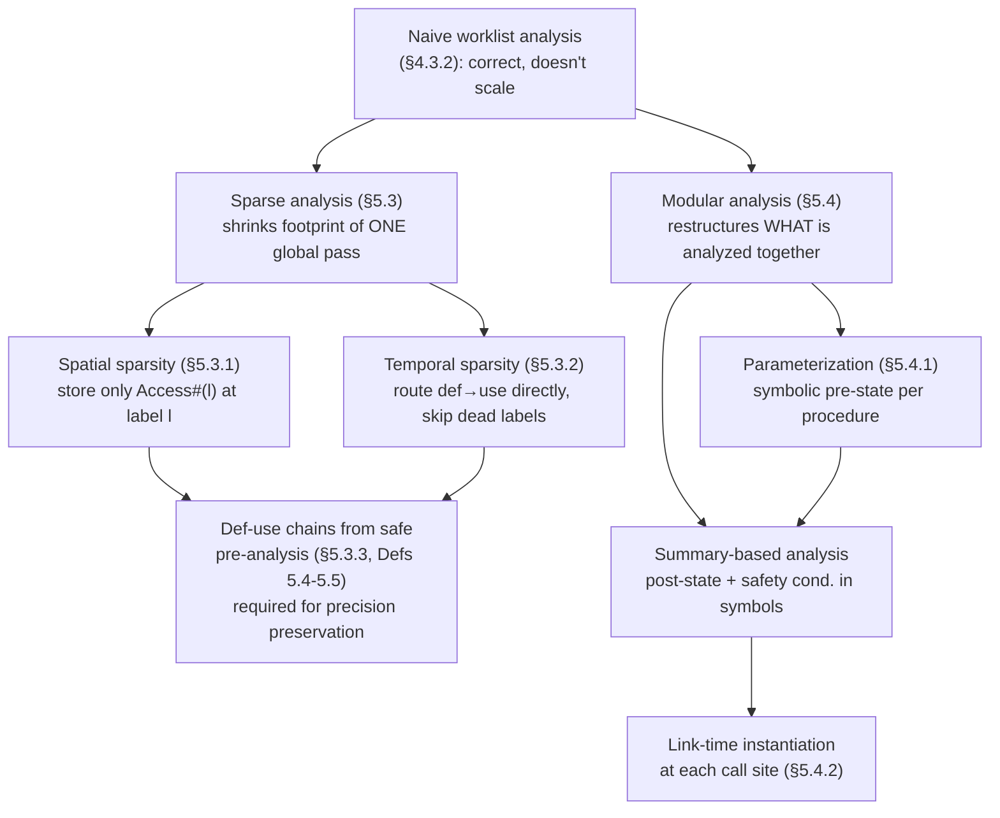

# Scalability Techniques for Static Analysis

[[book-guidelines|↩ Back to guidelines]]

## Why this is a separate problem from precision

Everything in chapters 3–4 gives you a *correct* analysis: a Galois-connection-grounded abstract semantics, a fixpoint algorithm with widening that terminates, a soundness proof. None of that says anything about whether the analysis will finish before your CI pipeline times out on a real codebase. Rival and Yi are explicit about this gap: "blindly implementing the analysis as specified in the worklist-based fixpoint algorithm is not sufficient to ensure that the analysis scales up in practice." They illustrate it with `less-382`, a 23,822-line C program whose interprocedural call graph is genuinely hairy — the kind of thing that turns a textbook-correct analyzer into something that never returns.

This chapter section treats scalability as an *orthogonal* concern to soundness, deliberately factored apart from it: you first design a global, correct abstract interpretation (chapters 3–4), and only afterward bolt on cost-reduction techniques that must preserve — not trade off — the underlying result. That separation of concerns is itself the interesting design move, and it's why this material reads less like new theory and more like an engineering discipline layered on top of theory you already have.

Two independent techniques do the bolting-on: **sparse analysis** (§5.3), which shrinks the memory and time footprint of a *single* whole-program analysis pass without changing its semantics, and **modular analysis** (§5.4), which restructures *what gets analyzed together* — per-procedure instead of monolithically — so that reanalysis after a local edit stays local.

## Sparse analysis: two kinds of waste in the naive fixpoint

### What breaks without it

Say your analysis result is a table `L → (A♯ → V♯)`: for every program label, a map from abstract memory locations to abstract values. For a million-line program, that's roughly a million labels, each holding a table sized proportionally to the million abstract locations in the program — a naive worklist implementation is quadratic in program size before you've even accounted for widening iterations. This is not a hypothetical inefficiency; it's the default behavior of implementing the fixpoint algorithm from §4.3.2 literally.

The book identifies exactly two forms of waste being paid for here, and names them precisely:

- **Spatial sparsity**: "each program portion (an expression, a statement, a sequence of statements, a procedure, a loop body, etc.) accesses only a small part of the whole memory." Storing the *entire* memory state at *every* label pays for locations that the code at that label will never touch.
- **Temporal sparsity**: "after the definition (write) of a memory location, its use (read) is not immediate but a while later." Propagating a memory state label-by-label along the syntactic control flow — even through statements that neither read nor write the location in question — pays for hops that carry no new information.

The crucial property the book insists on: sparse analysis is a **pure cost transformation**. "Implementing the technique on top of a given global analysis only improves the analysis cost; the resulting sparse version computes the same analysis result as the underlying analysis." It is not an approximation of the analysis — it's a different data structure and control-flow schedule for computing the *identical* fixpoint. This matters a great deal for a verifier's trusted computing base: sparsity is a performance-layer decision, and (given the precision-preservation conditions below) it should never need to be re-verified against the soundness proof of the base analysis — the base analysis's soundness proof still covers it.

### 5.3.1 Exploiting spatial sparsity: don't store what isn't read

Rather than the abstract transfer function operating over the *whole* memory,

$$F^\# : (L \to M^\#) \to (L \to M^\#)$$

restrict each label's stored memory to only the abstract locations that program portion can actually touch:

$$F^\#_{\text{sparse}} : (L \to M^\#_{\mathrm{Access}^\#(l)}) \to (L \to M^\#_{\mathrm{Access}^\#(l)})$$

where $\mathrm{Access}^\#(l)$ is the set of abstract locations that *may* be accessed at label $l$, and $M^\#_{\mathrm{Access}^\#(l)}$ denotes memories restricted to that domain. The book calls this "abstract garbage collection" and draws the direct analogy to the *frame rule* in separation logic — you carry only the footprint a piece of code actually needs, and implicitly frame away the rest. $\mathrm{Access}^\#(l)$ itself is computed by "a sound pre-analysis, which is typically coarser, hence quicker yet still sound, than the main analysis" — a cheap syntactic reachability pass that overapproximates "what might this statement touch," feeding a precise, expensive analysis.

**Worked example (fig. 5.8/5.9).** For a code fragment over variables `x, y, z, v, a, b` where `a` points to `v` and `b` to `z`: the naive analysis stores all six variables at every label. But the first statement accesses only `x`; the second only `y`; the last only `a, b, v, z`. Bookkeeping the full six-variable table at every one of these points is pure waste — each label needs only its own small slice.

### 5.3.2 Exploiting temporal sparsity: route data directly to its use

Instead of the abstract one-step relation always stepping through *syntactically* adjacent labels,

$$(l, M^\#) \hookrightarrow^\# (l', M'^\#) \quad \text{for } l' \in \mathrm{next}^\#(l, M^\#)$$

we let $\mathrm{next}^\#(l, M^\#)$ route directly from a definition point to its use point, skipping intermediate labels that neither read nor write the relevant location. Concretely: "the defined variable `x` in the first statement `x = x + 1` can directly flow to the third statement `z = x`... skipping the second statement." This is exactly an SSA-style *def-use edge*, computed and exploited at analysis time rather than baked into the IR beforehand — the sparse one-step relation *is* the def-use graph, replacing the syntactic CFG edges for propagation purposes wherever they'd otherwise sit idle.

### 5.3.3 The precision-preservation obligation: def-use chains must be *safe*

This is the section's real technical content, and it's worth taking slowly, because getting it wrong silently breaks soundness rather than just precision.

You cannot compute the "true" def-use graph without already knowing the analysis result (which is what you're trying to compute). So def-use information comes from a cheaper *pre-analysis* that produces def-sets $\hat D^\#(l)$ and use-sets $\hat U^\#(l)$ approximating the original analysis's true $D^\#(l)$, $U^\#(l)$. **Definition 5.4 (safe def and use sets)** states the two conditions these approximations must satisfy:

1. **Overapproximation**: $\hat D^\#(l) \supseteq D^\#(l)$ and $\hat U^\#(l) \supseteq U^\#(l)$ — the pre-analysis must not *miss* any real definition or use. Missing one would mean the sparse routing fails to deliver a state update that the real semantics requires, which breaks soundness outright. This half is the intuitive one.

2. **Spurious-definition closure**: every location the pre-analysis over-approximates as *possibly defined* at $l$ but that isn't really defined there must also be recorded as *used* at $l$. This is the subtler condition, and the book works through exactly why it's needed with a scenario (fig. 5.10): suppose the real def-use edge for location $\eta$ runs from label $a$ to label $b$, with $\eta$ genuinely undefined at intermediate label $c$. If the coarse pre-analysis conservatively guesses that $\eta$ *might* be redefined at $c$ (a false positive, since it's sound but imprecise), then naively the sparse routing would only see an edge from $c$ to $b$ — the real $a \to b$ edge silently disappears, and $a$'s contribution to $b$'s state is never propagated. Condition 2 patches this: by forcing every such spurious definition to *also* count as a use, the pre-analysis is compelled to keep $c$ transparent to information from $a$, and the $a\to b$ edge is recovered.

**Definition 5.5 (def-use chain)** then says: labels $a, b$ have a def-use chain for location $\eta$ when $\eta \in \hat D^\#(a) \cap \hat U^\#(b)$ and $\eta$ is not redefined at any intermittent label $c$ on paths from $a$ to $b$ (per the pre-analysis's own $\hat D^\#(c)$). Given safe def/use sets, these chains form an "express highway" that provably carries every edge the original non-sparse analysis needed — hence "the resulting sparse analysis version should have the same precision as the original non-sparse analysis," not merely a faster approximation of it.

**Why this is load-bearing for a verifier, not just an optimization footnote.** This is precisely the shape of soundness argument your Rust-based analyzer will need if you ever build a sparse/incremental invariant-generation pass on top of your abstract interpreter for Hoare-triple checking: any performance-motivated restructuring of *what state gets propagated where* has to come with its own two-part safety obligation (don't drop real edges; account for every conservative false positive as a use) before you can claim the restructuring is transparent to the trusted result. It is the same overapproximation discipline that shows up in reachability analysis and in constraint propagation more generally — a cheap, coarse pass licensing a precise, expensive one only if its overapproximation is *provably* a superset in exactly the right sense.

```rust
// A concrete illustration of def/use bookkeeping a sparse analysis pass
// would maintain per label — this is the *data structure*, not the
// analysis itself. In a real implementation, Access#, D#, and U# would
// be populated by a fast pre-analysis walk over the CFG/AST.
use std::collections::{HashMap, HashSet};

type Label = usize;
type Loc = String; // abstract memory location (e.g. a variable name)

struct SparseInfo {
    /// Access#(l): locations this label's memory table is restricted to.
    access: HashMap<Label, HashSet<Loc>>,
    /// D-hat#(l), U-hat#(l): safe (over-approximated) def/use sets.
    def_hat: HashMap<Label, HashSet<Loc>>,
    use_hat: HashMap<Label, HashSet<Loc>>,
}

impl SparseInfo {
    /// Definition 5.4, condition 2: every spurious definition must also
    /// be recorded as a use, or def-use edges silently vanish.
    fn close_spurious_defs_as_uses(&mut self, real_def: &HashMap<Label, HashSet<Loc>>) {
        for (label, def_set) in &self.def_hat {
            let spurious: HashSet<Loc> = def_set
                .difference(real_def.get(label).unwrap_or(&HashSet::new()))
                .cloned()
                .collect();
            self.use_hat.entry(*label).or_default().extend(spurious);
        }
    }
}
```

## Modular analysis: analyze procedures, not the whole program

### The idea, by analogy to compilers

"As compilers translate files separately and then link them into a whole-program translation, static analysis too can separately analyze components of a program and then stitch the componential results into a monolithic whole-program analysis result." The unit here is the procedure: instead of one giant interprocedural fixpoint over the entire call graph (which is exactly what makes `less-382`'s tangled call structure so expensive), you compute one **summary** per procedure, independent of who calls it, and *instantiate* that summary at each call site afterward.

This buys two things simultaneously, and it's worth being precise that they're distinct benefits: **scalability** (you never re-analyze a procedure's body once per call site — you analyze it once, symbolically, and cheaply plug in each context), and **incrementality** (editing one procedure invalidates only its own summary plus the — typically much smaller — set of call sites that transitively depend on it, not the whole-program fixpoint).

### Parameterization: analyzing under an unknown caller

You can't run a forward analysis of a procedure body without *some* pre-state, but you don't know the caller yet. The fix: parameterize the unknown pre-state by fresh symbols. For an interval-based analysis, instead of concrete bounds $[l, h]$, an unconstrained input interval becomes $[s_0, s_1]$ for fresh symbols $s_0 \le s_1$. The forward analysis then proceeds exactly as before, except its output — and any safety conditions it derives — are expressed *in terms of these symbols* rather than concrete numbers.

### Summary-based analysis and the case study

Walking forward from the symbolic pre-state accumulates a **summary**: a post-state plus a symbolic safety condition, both parameterized by the calling-context symbols. The book's running example is buffer-overrun checking. For

```c
// pointer arr with symbolic offset [s0,s1] into a buffer of symbolic
// size [s2,s3]; index i with symbolic interval [s4,s5]
*(arr + i)
```

the derived safety condition is $[s_0+s_4,\, s_1+s_5] \subseteq [0,\, s_2) \sqcup \dots$, formally $[s_0+s_4, s_1+s_5] < [s_2, s_3]$ — the shifted-offset interval must stay within bounds, expressed purely symbolically, with no commitment yet to what `arr` or `i` actually are at any call site.

Then at **link time**, each call instantiates the summary's symbols with the actual argument intervals and evaluates the safety condition concretely. The book's worked case study chains a `malloc_wrapper(n)` (summary: return pointer has offset $[0,0]$, size $[s_0,s_1] = n$) into two calls of a `set_i(arr, i)` summary:

- `malloc_wrapper(9)` instantiates $[s_6,s_7] \to [9,9]$, giving `arr` = pointer of offset $[0,0]$ into a size-$[9,9]$ buffer.
- `set_i(arr, i)` with `i` known: safety condition instantiates to $[0+0,\, 0+8] < [9,9]$ — true, no alarm.
- `set_i(arr, i+1)`: safety condition instantiates to $[0+1,\, 0+9] < [9,9]$ — **false**, since $9 \in [1,9]$ is not provably $< 9$; the analysis correctly raises an alarm at this specific call site, without ever having re-analyzed `set_i`'s body.

The key point the book stresses: this is not a precision *loss* relative to inlining everything and analyzing monolithically — "the modular analysis can analyze the original procedure just as accurately... even though the procedures are analyzed independently," provided the summary is expressive enough and the stitching (instantiation) is done faithfully. The price of modularity is entirely in engineering the summary representation, not in giving up soundness or precision.

```rust
// Rust sketch of what a symbolic interval summary looks like as a data
// type — the shape your compiler's per-procedure invariant-generation
// pass would build once per function and cache.
#[derive(Clone, Debug)]
struct SymInterval { lo: Sym, hi: Sym } // Sym = concrete int or a fresh symbol id

#[derive(Clone, Debug)]
struct ProcSummary {
    /// Symbolic pre-state: one SymInterval per formal parameter.
    params: Vec<(String, SymInterval)>,
    /// Symbolic post-state, in terms of the same symbols.
    post_state: HashMap<String, SymInterval>,
    /// Safety condition(s) derived during the forward walk, e.g.
    /// "offset_interval < size_interval" for every dereference.
    safety_conditions: Vec<Constraint>,
}

// At a call site: substitute concrete/known intervals for `params`'
// symbols throughout `post_state` and `safety_conditions`, then check
// each instantiated constraint. This substitution step is exactly
// what "linking" means for modular static analysis — no re-walk of
// the callee's body is needed.
fn instantiate(summary: &ProcSummary, args: &[SymInterval]) -> InstantiatedResult {
    let subst = build_substitution(&summary.params, args);
    InstantiatedResult {
        post_state: apply_subst(&summary.post_state, &subst),
        checks: summary.safety_conditions.iter()
            .map(|c| apply_subst_constraint(c, &subst))
            .collect(),
    }
}
```

A Python sketch of the same instantiation idea, stripped of types, if you just want to see the substitution mechanics:

```python
def instantiate_summary(summary, actual_args):
    subst = dict(zip(summary.param_symbols, actual_args))
    post = {loc: interval.substitute(subst) for loc, interval in summary.post_state.items()}
    checks = [cond.substitute(subst) for cond in summary.safety_conditions]
    return post, [check.is_satisfied() for check in checks]
```

## Where sparse and modular analysis sit relative to each other

They are genuinely orthogonal axes, and the book is careful to say so ("independently of the sparse analysis technique of the previous section, we can further improve...") — you can apply either alone or both together:



Both techniques share the same meta-pattern: **a cheap, coarse, sound pre-computation (Access# sets, def-use chains, symbolic parameterization) licenses a restructuring of an expensive, precise computation, with an explicit correctness obligation connecting the two.** That pattern — approximate cheaply first, then use the approximation to safely restructure the expensive part — recurs constantly in program analysis engineering, and it's the same shape you'll reach for whenever a full re-verification is too costly to redo from scratch on every change.

## Where this leads

Both techniques are prerequisites for building an analyzer that scales past toy examples — which is precisely the difference between a proof-of-concept abstract interpreter and something you'd point at real Rust or C codebases. For the compiler/elaborator project: **modular analysis is the direct architectural template for how your Hoare-triple / refinement-type checker should handle procedure-scale invariant generation** — compute a symbolic summary (a set of Horn-clause-shaped pre/post constraints over metavariables standing in for the unknown call context) once per function, then instantiate it at each call site instead of re-running invariant inference under every possible caller. This is structurally the same move as computing a function's refinement-type signature once and checking it against each call's actual argument types — parameterization by symbols here is a first-order analogue of parameterizing by metavariables in your elaborator's unification. **Sparse analysis's safety obligation (Definitions 5.4–5.5)** is the more general lesson: any time you build a fast pre-pass to license skipping work in an expensive precise pass (as you likely will for CHC solving or invariant propagation at scale), you need the same two-part overapproximation argument — don't miss real dependencies, and treat every spurious conservative guess as if it were real — to keep the shortcut sound. The next section in the book, [[Backward-Analysis|backward analysis]] (§5.5), is independent of scalability and instead complements the forward direction covered so far by computing necessary pre-conditions from a post-condition — relevant to weakest-precondition-style reasoning, but a separate topic from what's covered here.
