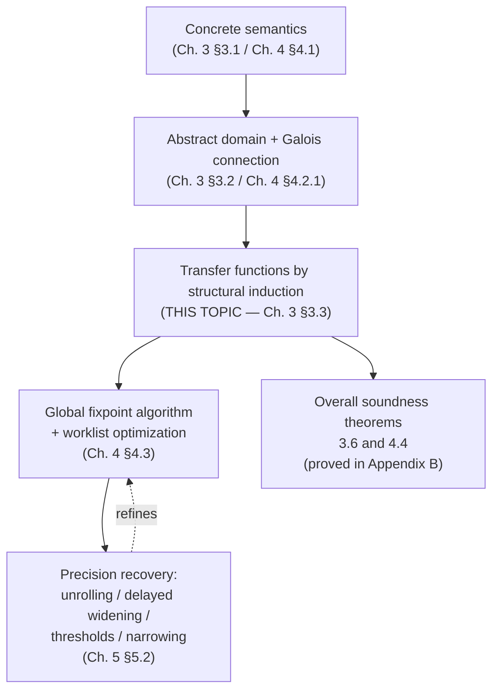

[[book-guidelines|↩ Back to guidelines]]

# Sound Abstract Semantics and Analysis Algorithms

## The problem this stage of the recipe solves

By the time you reach this topic in Rival and Yi's book, you've already done two of the three steps in their design recipe: you fixed a **concrete semantics** (what a program actually does — either compositionally, `⟦C⟧_P : ℘(M) → ℘(M)`, or transitionally, as a least fixpoint of a one-step relation), and you chose an **abstraction** (intervals, signs, octagons, convex polyhedra, a Galois connection `(α, γ)` between concrete and abstract domains). Neither step, by itself, gives you a terminating algorithm. This topic is where the two get glued together into something you can actually run: a function `⟦C⟧_P^#` that (a) is computable in finite time, (b) never lies (soundness), and (c) is *derived*, not invented — every abstract operator is obtained by systematically over-approximating one piece of the concrete semantics.

If you're building a verifier, this is the chapter that turns "I have a type system on paper" into "I have a type-checker that terminates and never accepts a program it shouldn't." [[Specialized-Static-Analysis-Frameworks#The mechanism|The mechanism]] here — structural induction over syntax, each case discharging one soundness obligation — is the same mechanism your elaborator's type-checking pass and your CHC solver's abstract domain will both need.

## Transfer functions: soundness as a diagram you must close

The book's central definitional device (Figure 3.7) is a *soundness diagram*. You have a concrete operation (say, running command `C` from a set of states `M`), and you want an abstract operation `⟦C⟧^#` such that:

$$
m \in \gamma(a_{\text{pre}}) \ \land\ m' \in \llbracket C \rrbracket(\{m\}) \implies m' \in \gamma\big(\llbracket C \rrbracket^\#(a_{\text{pre}})\big)
$$

In words: if a real execution starts in a state described by abstract element `a_pre` and ends in `m'`, then the abstract analysis's output, when concretized, must still contain `m'`. This is a **one-sided** guarantee — the abstract post-condition can (and usually will) contain extra, spurious states that no real execution reaches. That asymmetry is the whole game: soundness only forbids under-approximation, never over-approximation. A transfer function that always returns `⊤` (the whole state space) is trivially sound; it's just useless. The entire chapter is really about how to be sound *and* precise enough to matter, which is exactly the tension the book's soundness/completeness framing (Chapter 1) predicted every automatic technique would face.

**Rust framing.** Think of a transfer function as a trait method whose contract is a refinement, not an equality:

```rust
trait AbstractDomain: PartialOrd + Sized {
    fn bottom() -> Self;
    fn join(&self, other: &Self) -> Self;   // ⊔#, must over-approximate ∪
    fn concretize(&self) -> ConcreteStates; // γ, conceptual — never actually computed
}

trait TransferFunction<D: AbstractDomain> {
    // Contract (not enforced by the type system, only by proof):
    // for all concrete m in a.concretize(), and all m' reachable from m
    // by this command, m' ∈ self.apply(a).concretize()
    fn apply(&self, a: &D) -> D;
}
```

The type signature can't encode soundness — that's a semantic property about `γ`, proved on paper (Theorems 3.2–3.6), not something `rustc` checks. This is the exact same situation as a type-checker's `is_well_typed` function: the type system doesn't verify itself; you prove *that* algorithm sound once, externally, and then trust the implementation.

**What breaks without the diagram.** If you skip the discipline of deriving each operator from a soundness obligation and instead hand-write "a plausible-looking" abstract assignment or join, you get an analyzer that looks fine on toy examples and then silently drops a real bug — because nothing forced `γ(a) ⊇` the true reachable set at every step. This is precisely how "unsound by accident" tools happen in practice (a theme the book returns to in Chapter 6 under "soundness bugs").

## Building `⟦C⟧^#` by structural induction

The mechanism, not just the goal, is the payoff here. The analysis function is defined **by induction over program syntax** — literally mirroring how the concrete semantics itself was defined compositionally in Chapter 3. This has a beautiful consequence: **Theorem 3.1 (approximation of compositions)** says that if `F₀^#` over-approximates `F₀` and `F₁^#` over-approximates `F₁`, then `F₁^# ∘ F₀^#` over-approximates `F₁ ∘ F₀`. Soundness is *compositional* — you prove each syntactic case sound once, in isolation, and the whole-program soundness proof (Theorem 3.6) just glues the cases together by induction. You never have to reason about a whole program at once.

This is exactly the shape of a **bidirectional type-checker's soundness proof**: you prove each typing rule locally sound (preservation, progress per rule) and induction over derivations gives you whole-program soundness. If you're building the elaborator described in your learning goals, expect to reuse this exact proof architecture for `isDefEq`/unification soundness and for your Hoare-triple checker.

Concretely, the base and inductive cases:

- **`skip`**: `⟦skip⟧_P^#(a) = a` — trivial, no soundness burden (identity is always sound).
- **Sequencing**: `⟦p₀;p₁⟧_P^#(a) = ⟦p₁⟧_P^#(⟦p₀⟧_P^#(a))` — direct application of Theorem 3.1.
- **Assignment `x := E`**: decomposed via Theorem 3.1 into (1) abstractly evaluate `E` to get an over-approximation of its possible values, then (2) abstractly update the store at `x`.
- **Conditionals**: decomposed into (1) an abstract filtering operator per branch, (2) recursive analysis of each branch, (3) an abstract join at the merge point.
- **Loops**: the one case that isn't finite unrolling of the above — it needs its own fixpoint machinery, discussed below.

### Abstract expression evaluation

For expressions, induction over syntax again: a constant `n` maps to any abstract element `a` with `n ∈ γ_V(a)` (using `φ_V` if there's no best abstraction `α_V`); a variable reads its current abstract value from the store; a binary operation `E₀ ⊙ E₁` needs an abstract operator `⊙^#` satisfying

$$
\forall v_0 \in \gamma_V(a_0),\, v_1 \in \gamma_V(a_1): \; v_0 \odot v_1 \in \gamma_V(a_0 \odot^\# a_1)
$$

For intervals this is concrete and computable — e.g., interval addition `[a,b] + [c,d] = [a+c, b+d]`. The book's Example 3.10 walks `x + 2*y - 6` through interval arithmetic step by step; this is worth internalizing because it's the pattern every abstract-interpretation-based invariant generator (the kind your CSP/AI hybrid will need) implements at its innermost loop.

**Rust sketch** (interval abstract value, minimal):

```rust
#[derive(Clone, Copy, PartialEq)]
enum Interval { Bottom, Range(i64, i64), Top } // simplified; real code needs ±∞

impl Interval {
    fn add(self, other: Self) -> Self {
        match (self, other) {
            (Interval::Bottom, _) | (_, Interval::Bottom) => Interval::Bottom,
            (Interval::Top, _) | (_, Interval::Top) => Interval::Top,
            (Interval::Range(a, b), Interval::Range(c, d)) =>
                Interval::Range(a.saturating_add(c), b.saturating_add(d)),
        }
    }
}
```

Note this is *exactly* what non-linear or interval-domain propagation in a CSP kernel does when tightening bounds — abstract interpretation's transfer functions and CSP's domain-propagation rules are the same computation wearing different names, one proving absence of bugs (over-approximation), the other searching for presence of bugs (under-approximation via concrete witnesses). Your learning goals note this explicitly; this section is the textbook source for the "over-approximation" half of that pairing.

An important asymmetry the book flags: **relational domains handle assignment differently.** For `x := y + x + 2` in convex polyhedra, non-relational evaluate-then-store loses the relation between `x` and `y`. The relational trick: introduce a fresh dimension `x'`, represent `x' = E` exactly as a constraint, then **project out** the old `x` and rename `x'` to `x`. This projection-based technique is structurally identical to how an SMT-style symbolic execution engine handles assignment in a relational constraint store (e.g. an octagon or polyhedra abstract domain backing a CHC solver) — same "introduce a fresh variable, constrain, eliminate" move you'll need for weakest-precondition generation.

### Abstract filtering (conditions)

For `if(B){C₀}else{C₁}`, the concrete semantics is `⟦C₀⟧_P(ℱ_B(M)) ∪ ⟦C₁⟧_P(ℱ_{¬B}(M))`. The abstract counterpart needs a filtering operator `ℱ_B^#` satisfying

$$
\gamma\big(\mathcal{F}_B^\#(a)\big) \supseteq \mathcal{F}_B(\gamma(a))
$$

For a comparison like `x < n` against the interval `M#(x) = [a,b]`: if `b < n` is impossible for any value below `n`... actually the three cases are (1) the condition is unsatisfiable (`M#(x)` entails `x ≥ n`, so filtering yields `⊥`), (2) the interval gets tightened (`[a, min(b, n-1)]`), (3) the condition is always true. This is a **weakest-precondition-style narrowing of a domain**, exactly the operation your refinement-type inference engine performs when it narrows a variable's abstract range on entry to a branch guarded by a refinement predicate. **Filtering is where Hoare-logic's "assume" statement and abstract interpretation's branch analysis become the same operation** — worth flagging since it's one of your standing threads.

### Abstract join (`⊔^#`)

At control-flow merge points, the analysis needs `γ(a₀) ∪ γ(a₁) ⊆ γ(a₀ ⊔^# a₁)`. For non-relational domains this decomposes pointwise: define a value-level join and apply it per variable. For relational domains (polyhedra), the geometric analogue is the convex hull — itself potentially imprecise, since the union of two polyhedra generally isn't a polyhedron, so the hull strictly over-approximates.

## The fixpoint problem: why loops need a fourth idea

Everything above is finite recursion over syntax — trivially terminating. Loops break that pattern because the concrete semantics of `while(B){C}` is itself already an infinite union:

$$
\llbracket \texttt{while}(B)\{C\}\rrbracket_P(M) = \mathcal{F}_{\lnot B}\Big(\bigcup_{i \ge 0} F^i(M)\Big), \quad F = \llbracket C \rrbracket_P \circ \mathcal{F}_B
$$

This is provably the least fixpoint of `G(X) = M ∪ F(X)` (Kleene's fixpoint theorem, invoked again here just as in Chapter 3's foundations). The abstract analysis has to compute a *finite* over-approximation of an *a priori infinite* iteration. Three separate mechanisms handle this, in increasing order of generality:

**1. Finite-height convergence.** If the abstract domain's ordering has no infinite strictly-increasing chain (height `h`, e.g. signs has height 3), the sequence `a₀ ⊑ a₁ ⊑ …` defined by `a₀ = M#`, `a_{k+1} = a_k ⊔# F#(a_k)` must stabilize within `h` steps, because it's monotone and can't increase forever. Simple loop, guaranteed termination — no widening needed.

**2. Widening operators.** Intervals, octagons, and polyhedra have infinite height (the chain `[0,0] ⊏ [0,1] ⊏ [0,2] ⊏ …` never stabilizes on its own). Definition 3.11 fixes this with a binary operator `∇` satisfying two conditions:

$$
\gamma(a_0) \cup \gamma(a_1) \subseteq \gamma(a_0 \,\nabla\, a_1) \qquad \text{(sound, like a join)}
$$
$$
\text{for any sequence } (a_n),\ \text{the sequence } b_0 = a_0,\ b_{n+1} = b_n \nabla a_{n+1} \text{ is ultimately stationary}
$$

The second condition is the interesting one: it's a *syntactic acceleration guarantee*, independent of the domain's actual height. For intervals, the canonical widening drops any bound that isn't stable between two consecutive iterates straight to `±∞`:

$$
[a_0, b_0] \,\nabla\, [a_1, b_1] = \big[\, (a_1 < a_0 ? -\infty : a_0),\ (b_1 > b_0 ? +\infty : b_0) \,\big]
$$

**What breaks without widening:** the book's running example (a loop incrementing `x` forever) never converges under plain join — the interval keeps growing by one at each step, forever. Widening forces `[0,0] ∇ [0,1] = [0,+∞)` in one shot: sound, terminating, but *lossy* — you've thrown away the fact that a bounded loop might have kept `x` finite.

**3. Theorem 3.5 / Theorem 4.3 — soundness with widening.** Both the compositional-style algorithm (Theorem 3.5) and the transitional-style algorithm (Theorem 4.3) guarantee: given a widening operator, the sequence terminates *and* its limit over-approximates the true least fixpoint. This is the theorem that licenses "iterate with `∇` until stable" as a legitimate, provably sound algorithm rather than a heuristic.

**Lean framing.** If you're building a Lean-style kernel comparison: the loop-analysis fixpoint is structurally the same object as the `lfp` a monotone Galois-connected function computes in domain theory used to justify recursive definitions or coinductive unfolding in a proof assistant's kernel — Kleene's theorem is doing the same job Lean's well-founded recursion elaboration does when it needs a fixpoint to terminate, just in a different (numerical, not syntactic) domain.

```python
# Minimal widening-iteration sketch (illustrative, not load-bearing — Python is fine here)
def analyze_loop(pre, F_hash, join, widen, is_stable):
    a = pre
    while True:
        a_next = widen(a, join(a, F_hash(a)))
        if is_stable(a, a_next):
            return a_next
        a = a_next
```

## The worklist algorithm: turning theory into something that scales

Theorems 4.2/4.3 give you a *correct* algorithm — iterate the global abstract transition `↪^#` over every program label until stable — but the naive version rescans **every label** on **every iteration**, even labels whose input didn't change. For a program with a million statements, that's a million redundant re-analyses per pass.

The **worklist algorithm** (Figure 4.5, §4.3.2) fixes this by tracking a set of "dirty" labels:

- Maintain a table `C : Label → AbstractMemory` and a worklist (initially all labels, or just the entry).
- Pop a label `l` from the worklist, apply `↪^#` to `(l, C(l))`.
- If the resulting state at target label `l'` strictly increases `C(l')` (i.e. `M# ⋢ C(l')`), join it in and **push `l'` onto the worklist**.
- Repeat until the worklist is empty.

The key optimization the book flags explicitly: don't rebuild the whole worklist by rescanning all labels each round (`WorkList ← {l | C(l) ⋢ R(l)}`) — instead, incrementally add exactly the successor labels that changed, right where the change is detected. This turns an `O(labels)` per-iteration cost into work proportional only to what actually changed — the standard data-flow-analysis worklist pattern.

```rust
use std::collections::{HashMap, VecDeque};

fn worklist_analyze<D: AbstractDomain + Clone + PartialEq>(
    entry: Label,
    initial: D,
    step: impl Fn(Label, &D) -> Vec<(Label, D)>, // ↪# : one label's effect on successors
) -> HashMap<Label, D> {
    let mut table: HashMap<Label, D> = HashMap::new();
    table.insert(entry, initial);
    let mut worklist = VecDeque::from([entry]);

    while let Some(l) = worklist.pop_front() {
        let current = table.get(&l).cloned().unwrap_or_else(D::bottom);
        for (l_prime, delta) in step(l, &current) {
            let old = table.get(&l_prime).cloned().unwrap_or_else(D::bottom);
            let joined = old.join(&delta);
            if joined != old {                 // strictly increased
                table.insert(l_prime, joined);
                worklist.push_back(l_prime);   // only the label that changed
            }
        }
    }
    table
}
```

This is precisely the shape of a **constraint-propagation loop in a CSP/CHC solver** — a worklist of "constraints whose domain shrank, re-propagate their neighbors" is the AC-3-style arc-consistency algorithm your CSP kernel will need, applied to abstract-interpretation lattices instead of finite domains. Recognizing this now saves you from re-deriving worklist propagation from scratch when you get to the CSP kernel.

## Recovering precision: unrolling, delayed widening, thresholds, narrowing

Widening buys termination at a real precision cost, and §5.2 gives four concrete techniques (used individually or combined) to claw precision back — worth knowing because a naive "always widen at the loop head" analyzer is often uselessly imprecise in practice.

**Loop unrolling.** The first iteration of a loop is often qualitatively different (e.g., using an uninitialized variable that gets pinned down by the loop body). Unrolling analyzes the first `N` iterations *without* joining them into the recurring loop-head state, delaying the merge:

$$
a_0 = M^\#, \quad a_{i+1} = F^\#(a_i) \quad \text{for } i < N, \quad \text{then widen/iterate normally from } a_N
$$

The book's example: a loop resetting `x` to `0` whenever it exceeds `1001`. Standard analysis can't rule out `x`'s initial garbage value at loop head (it's part of the invariant by construction); unrolling one iteration separates "the messy first pass" from "the stable steady state," recovering the tight range `[0,1001]`.

**Delaying widening with plain union.** Rather than widening on the very first iterate (which can blow a tight bound straight to `±∞` in one step, as in the `rand()` example where `[0,0] ∇ [-1,2] = [-∞,+∞]`), use ordinary `⊔#` for the first `N` iterations and only switch to `∇` afterward. This is strictly different from unrolling: unrolling *fully postpones* merging, while delayed widening still merges (via join) but withholds the aggressive extrapolation to `±∞` until later.

**Widening with thresholds.** Instead of jumping an unstable bound straight to `∞`, jump it to the nearest value in a pre-chosen finite set of thresholds (e.g. syntactic constants appearing in the program — `50`, `100`). The book's example: a loop with exit condition `x > 100` and reset-to-`10` behavior actually stabilizes at `[0,50]`, but plain widening jumps straight past it to `[0,+∞)`. Threshold widening with `B = 50` recovers the tight bound by taking smaller, informed steps instead of one unbounded leap.

**Narrowing / post-fixpoint refinement.** After the widened sequence stabilizes at `a_lim` (an over-approximation, possibly loose), you can apply `G#` *one more time*: `G#(a_lim)`. The book proves this is still sound (via monotonicity of the concrete `G` and the soundness of `G#`) and often strictly *more precise*, because re-running the loop body's transfer function against an already-stable invariant lets condition tests inside the loop sharpen the bound. This generalizes into a **narrowing operator**: iterate downward (`⊑`-decreasing) after the widening-based `⊔`-increasing phase converges. The book is candid about the limitation: narrowing can refine some variables in a loop but not others in the *same* iteration (its worked example: `x` gets refined to `[0,50]` via the loop guard, but `y`, only conditionally updated inside the loop, resists refinement the same way) — narrowing is not a universal fix, only a partial and heuristic post-hoc pass, which is precisely why threshold widening is the more surgical fix for cases it can reach.

**Why this matters for CEGAR-style refinement.** All four techniques are instances of a single idea your learning goals name directly: trading a coarse, cheap over-approximation for a more expensive but more precise one, on demand, only where the coarse one fails. That's the same abductive-refinement loop underlying CEGAR (counterexample-guided abstraction refinement) — threshold widening is essentially "refine the abstraction with hints"; narrowing is "refine the fixpoint after the fact." If your CSP/AI hybrid uses CEGAR to sharpen invariants when a spurious counterexample shows up, these four mechanisms are the concrete toolbox it will reach for.

## Synthesis: where this sits in the book's architecture



This topic is the load-bearing middle stage of the book's three-step recipe (semantics → abstraction → algorithm): it's where the first two stages' choices get cashed out into something executable and provably correct. Everything downstream depends on it directly — Chapter 6's discussion of alarms and triage assumes you already have a terminating, sound `⟦C⟧^#`; Chapter 7's OCaml implementation is a literal transcription of the transfer functions and worklist algorithm defined here; Chapter 8's extension to pointers, arrays, and procedures reuses the exact same "define transfer functions by induction, prove soundness case-by-case" methodology on richer domains.

For your compiler project specifically: this chapter *is* the abstract-interpretation half of the invariant-generation engine your CSP kernel needs to pair with. The transfer-function-by-induction discipline is also a direct rehearsal for how you'll want to structure soundness proofs for your bidirectional type-checker and your elaborator's constraint generation — same inductive skeleton, same "prove each syntactic case locally, get the whole program for free" argument, just applied to abstract lattices here instead of typing judgments there. The worklist algorithm is worth remembering verbatim: it is, essentially, the arc-consistency propagation loop your CSP kernel will need, just with abstract-domain joins standing in for finite-domain pruning.
