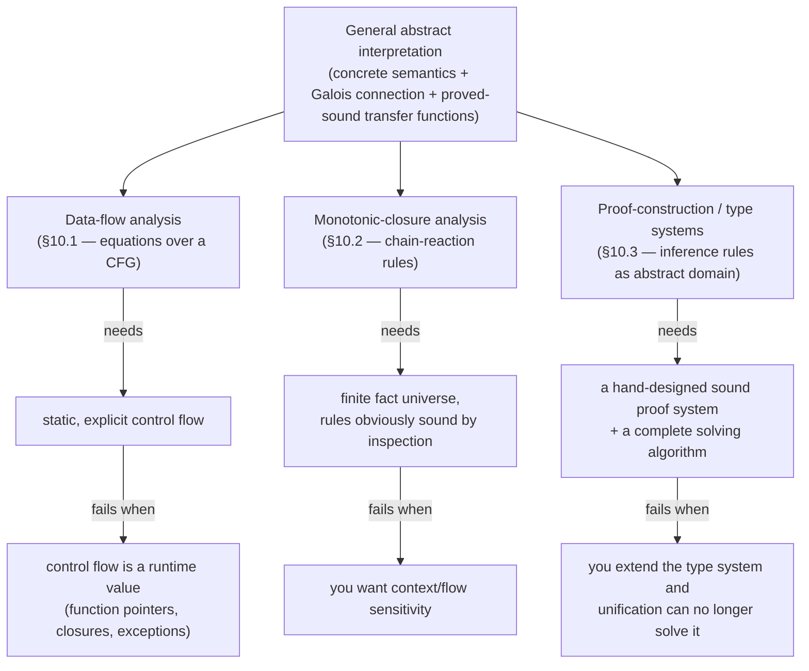

# Specialized Static Analysis Frameworks

[[book-guidelines|↩ Back to guidelines]]

## Why a book about general abstract interpretation stops to talk about "special cases"

Everything up through the general framework (concrete semantics → target property → abstraction → fixpoint algorithm, chapters 3–4) is heavyweight machinery: you build a concrete semantics, prove an abstraction is sound with respect to it via a Galois connection or a concretization function, define abstract transfer functions, prove *those* sound, and only then run a worklist fixpoint algorithm with widening. That's the "general-purpose programming language" of static analysis — it works for anything, but you pay the full proof burden every time.

Chapter 10's premise is that three narrower techniques — **data-flow analysis**, **monotonic-closure analysis** (pointer analysis and 0-CFA are the instances given), and **proof-construction / type systems** — get you a sound analysis *without* going through that machinery, provided your language and property are simple enough to fit the technique's built-in assumptions. The book's own framing: these are domain-specific languages next to abstract interpretation's general-purpose one. You give up generality and get informal, ad hoc, "obviously sound" reasoning instead of a systematic soundness proof.

The chapter's payoff isn't "here are three new algorithms" — it's the diagnostic move at the end of each section: *what exactly does this technique assume, and what breaks the moment your language stops satisfying it?* That diagnostic is exactly the skill you need when deciding whether your own verifier's invariant-generation pass can get away with a lightweight closure rule set, or needs the full abstract-interpretation apparatus.

A structural fact worth holding onto before the details: **all three reduce to computing the least fixpoint of a monotonic function.** They are not alternatives to fixpoint computation — they're alternatives to the *proof obligations* that justify a particular fixpoint computation as sound.



## 10.1 Static analysis by equations: data-flow analysis

### What problem this solves

Suppose your language is a simple imperative one — assignment, sequence, if, while, no pointers, no function calls (the book's running restriction throughout §10.1). For such a language the execution order is *fixed and syntactically visible*: you can draw the program as a **control-flow graph (CFG)** and know, without running anything, exactly which statement can follow which. If control flow is that static, you don't need a general fixpoint-over-a-lattice framework with an abstraction proof — you can set up equations directly and "eyeball" their soundness.

### The mechanism

Each CFG node carries a **state-transformation function** $f$: it maps the incoming machine state (pre-state) to the outgoing one (post-state), simulating that statement's semantics directly. If a node has incoming pre-states $x_1, x_2$ and outgoing post-states $y_1, y_2$ (a node may have multiple in/out edges — think of an if-join or an if-split), the equation is

$$y_i = f(x_1 \sqcup x_2), \qquad \text{(join at merge points, } f \text{ per node)}$$

The unknowns range over a lattice whose order $\sqsubseteq$ is "information subsumption" — $a \sqsubseteq b$ means everything $a$ implies, $b$ also implies (so $b$ is the coarser, weaker fact). $\sqcup$ is least-upper-bound (join): merging two incoming facts at a control-flow merge point.

**Worked example (book's Example 10.1).** Track the interval of a variable `x` at each CFG edge, using $[-\infty, +\infty]$ as "unconstrained." For a `while` loop testing `x ≤ 99` and incrementing `x`, the book sets up:

$$x_0 = [-\infty, +\infty] \qquad \text{(unknown input)}$$
$$x_1 = x_0 \sqcup x_3 \qquad \text{(loop head: entry value or looped-back value)}$$
$$x_2 = x_1 \sqcap [-\infty, 99] \qquad \text{(loop-guard true branch)}$$
$$x_3 = x_2 \oplus 1 \qquad \text{(the increment)}$$
$$x_4 = x_1 \sqcap [100, +\infty] \qquad \text{(loop-guard false branch, i.e. loop exit)}$$

This is a plain system of equations over the interval lattice; $\sqcup, \sqcap, \oplus$ are all monotonic, so the least solution is a fixpoint computable by the exact worklist/Kleene-iteration machinery from chapter 4 — and if the lattice has infinite height (like intervals), you still need **widening** to force termination. The equation *form* is lighter-weight, but the *solving* machinery underneath is identical to the general framework.

**What breaks without the equation-per-node discipline:** if control flow depends on a runtime value — a function pointer, a first-class closure, an exception target computed at runtime — there is no static CFG to write equations over. The book states this as the primary limitation: "the control flow can generally not be represented as a static finite graph... edges are introduced during program execution." This is exactly the situation you'll face analyzing a language with first-class functions or dynamic dispatch, which is why §10.1's approach cannot be your invariant-generation backbone for a general-purpose compiler.

### The two other limitations, and why they matter for a from-scratch verifier

1. **Transfer-function soundness is "obvious," not proven.** For `⊔, ⊓, ⊕` on intervals it *is* obvious. For richer abstract domains (shape analysis, relational numeric domains) it stops being obvious, and you need the systematic soundness criteria from chapters 4/8 (concretization functions, Galois connections) to certify a transfer function instead of eyeballing it.
2. **Equation sets are not unique.** The book shows (Figure 10.3) an alternative, still-sound equation set for the same program. There's no principled way *within* this framework to choose among sound equation sets — no notion of "the best" or "the most precise" abstraction. The general framework at least gives you a *lattice of possible abstractions* with a precision order; data-flow-by-equations gives you no such structure.

This is the recurring shape of the whole chapter: a specialized framework is simple exactly because it *doesn't ask* the questions (is this transformer sound? is this the best available abstraction?) that the general framework forces you to answer systematically.

### Grounding

In Rust, a CFG-equation solver is close to how a real compiler pass looks: build a graph, attach a transfer function per node, run to a fixpoint.

```rust
use std::collections::HashMap;

#[derive(Clone, Copy, PartialEq, Debug)]
struct Interval { lo: i64, hi: i64 } // use i64::MIN/MAX to stand in for ±∞

impl Interval {
    fn join(self, other: Self) -> Self {       // ⊔
        Interval { lo: self.lo.min(other.lo), hi: self.hi.max(other.hi) }
    }
    fn meet(self, other: Self) -> Self {        // ⊓
        Interval { lo: self.lo.max(other.lo), hi: self.hi.min(other.hi) }
    }
    fn widen(self, prev: Self) -> Self {        // forces termination on infinite-height lattice
        Interval {
            lo: if self.lo < prev.lo { i64::MIN } else { prev.lo },
            hi: if self.hi > prev.hi { i64::MAX } else { prev.hi },
        }
    }
}

// One "equation" per CFG edge: how to recompute this edge's value from its inputs.
type EdgeId = usize;
struct Equation {
    inputs: Vec<EdgeId>,
    eval: fn(&[Interval]) -> Interval,
}

fn solve(equations: &HashMap<EdgeId, Equation>, initial: Interval) -> HashMap<EdgeId, Interval> {
    let mut state: HashMap<EdgeId, Interval> = equations.keys().map(|&e| (e, initial)).collect();
    loop {
        let mut changed = false;
        for (&edge, eq) in equations {
            let inputs: Vec<Interval> = eq.inputs.iter().map(|i| state[i]).collect();
            let new_val = (eq.eval)(&inputs).widen(state[&edge]);
            if new_val != state[&edge] { state.insert(edge, new_val); changed = true; }
        }
        if !changed { break; }
    }
    state
}
```

This *is* the worklist-fixpoint loop from the general framework — the "specialization" was entirely in how you got the equations, not in how you solve them. That distinction (equation setup vs. equation solving) is worth internalizing: your compiler's invariant-generation pass will always solve fixpoints the same way; what differs per property is only how transfer functions get produced and certified.

## 10.2 Static analysis by monotonic closure

### What problem this solves

Some properties are naturally phrased not as "transform this pre-state into that post-state along this edge" but as "here is a growing set of *facts*, and here are rules for deriving new facts from old ones until nothing new can be added." That's a **chain-reaction / closure** computation — logically identical to bottom-up logic-programming evaluation (think Datalog) or to computing the transitive closure of a relation.

Formally: let $R$ be a set of chain-reaction (inference) rules, $X_0$ the initial fact set, and $\mathsf{Facts}$ the (finite) universe of possible facts. Write $X \vdash_R Y$ to mean "applying every rule in $R$ to $X$ derives the additional facts $Y$." The analysis result is the least $X$ with $X_0 \subseteq X$ and $X \vdash_R \varnothing$ (no more facts derivable) — equivalently, the least fixpoint of

$$\varphi(X) = X_0 \cup \{\, Y : X \vdash_R Y \,\}, \qquad \varphi : \wp(\mathsf{Facts}) \to \wp(\mathsf{Facts})$$

Because $\mathsf{Facts}$ is finite by construction (finitely many variables, finitely many expression labels), $\varphi$'s least fixpoint is reached in finitely many rule applications — no widening needed, unlike §10.1's interval lattice. This is the trade the framework makes: give up expressive value abstractions (get a flat, finite fact universe) and you get termination for free.

**What breaks without a finite fact universe:** if your facts were, say, integer intervals instead of finitely many points-to pairs, this closure computation would not terminate on its own — you'd be back to needing widening, i.e. back to the general framework. The finiteness of $\mathsf{Facts}$ is doing all the termination work here, silently.

### 10.2.1 Pointer analysis — flow-insensitive points-to facts

**Target property:** for a simple C-like language with `x`, `*x` (dereference), `&x` (address-of) on either side of an assignment, compute every pair $a \to b$ ("$a$ may point to $b$") that can ever hold during execution.

**Rules.** Initial facts come straight from address-of assignments:
$$\dfrac{x \coloneqq \&y}{x \to y}$$
and six chain-reaction rules cover the remaining assignment forms (`x := y`, `x := *y`, `*x := y`, `*x := *y`, etc.). The book walks the last one explicitly: `*x := &y` stores $y$'s address wherever `x` currently points, so

$$\dfrac{*x \coloneqq \&y \qquad x \to w}{w \to y}$$

**Why this is sound "for free":** each rule is a direct transcription of one assignment form's semantics — there's no abstraction-correctness proof to write because the fact language (`a → b` pairs) already *is* the concrete relation, just unioned across all execution paths rather than tracked per-path. The over-approximation comes from two collapses the book names explicitly:
- **Ignoring branch conditions.** A `while`-loop body's rules fire unconditionally regardless of whether the loop guard could ever be true along that path.
- **Global fact accumulation.** All points-to facts land in one set, so a fact derived from a statement anywhere in the program can trigger new facts anywhere else — there's no notion of "this only holds after this program point."

The book's example makes the second collapse concrete: for the straight-line sequence `x := &a; y := x; x := &b`, the closure concludes both `y → a` and `y → b`, even though by the time `x := &b` executes, `y` has already been bound to `x`'s *old* value (`a`) and can never see `b`. This is **flow-insensitivity** — the closure rules are blind to statement order, only to which facts are derivable at all. The book notes flow sensitivity can be recovered by preprocessing into **SSA form**, where each variable is written exactly once (so "which write does this read see" becomes syntactically unambiguous, not something the rule system has to track).

### 10.2.2 Higher-order control-flow analysis (0-CFA)

Same closure idea, applied to a call-by-value λ-calculus, to answer: for each application site, which lambdas can actually be called there? Facts have the form $L \ni R$ ("$L$ can evaluate to $R$"), where $L$ is an expression label or variable and $R$ is a label, variable, or literal lambda. Initial facts record that each lambda expression is a value of itself; propagation rules push values through applications — e.g. for an application $l_0 = (l_1\ l_2)$, once you know $l_1 \ni \lambda x.e$ (label $l_3$), you add $x \ni$ (whatever $l_2$ evaluates to) and $l_0 \ni$ (whatever the body evaluates to).

This is exactly **0-CFA** — the "0" meaning zero degrees of context sensitivity. The book states the limitation precisely: a real closure value in the concrete semantics is a *pair* — code plus an environment binding its free variables — and 0-CFA "completely abstracts away the environment part," collapsing every occurrence of a given lambda's code into one abstract value regardless of which call created it. Concretely: if a function `f` is called from two different sites with two different arguments, 0-CFA merges both calls' bindings of `f`'s free variables into one blob, losing the distinction. Recovering that distinction (context sensitivity — $k$-CFA for $k>0$, or polymorphic instantiation as in §10.3) needs the heavier semantic machinery of chapters 3–4/8.

### Grounding: monotonic closure as saturation, in Rust and Python

A closure computation is a worklist saturation loop — this is *directly* the shape of the constraint-propagation kernel you'd write for domain/lattice propagation in a CSP-based invariant generator: seed a fact set, repeatedly fire rules whose premises are satisfied, stop at a fixpoint.

```rust
use std::collections::{HashSet, VecDeque};

#[derive(Clone, Eq, PartialEq, Hash)]
struct PointsTo { from: String, to: String } // a -> b

fn saturate(initial: Vec<PointsTo>, assignments: &[Assignment]) -> HashSet<PointsTo> {
    let mut facts: HashSet<PointsTo> = initial.into_iter().collect();
    let mut worklist: VecDeque<PointsTo> = facts.iter().cloned().collect();

    while let Some(fact) = worklist.pop_front() {
        for new_fact in derive(&fact, &facts, assignments) {
            if facts.insert(new_fact.clone()) {   // only re-fire on genuinely new facts
                worklist.push_back(new_fact);
            }
        }
    }
    facts // the least fixpoint of φ
}
# (derive() encodes the six assignment-form rules; elided for brevity)
```

```python
# The finite-universe / worklist shape in five lines — good for sketching 0-CFA quickly
def saturate(seed_facts, rules):
    facts, worklist = set(seed_facts), list(seed_facts)
    while worklist:
        f = worklist.pop()
        for new in rules(f, facts):
            if new not in facts:
                facts.add(new); worklist.append(new)
    return facts
```

Notice this is *literally* semi-naive Datalog evaluation — the "monotonic closure" framework in the book is Datalog-shaped analysis under a different name, and that correspondence is worth keeping explicit if you ever want to implement pointer analysis or CFA by compiling rules to an actual Datalog engine (as tools like Doop and CodeQL do) instead of hand-rolling the worklist.

## 10.3 Static analysis by proof construction: type systems as abstract interpretation

### What problem this solves, and the reframing that matters most

This section is the one to read most carefully against the learning goals: it explicitly casts **a type system as an abstract domain**, and **type inference as constructing a proof in a finite proof system**. "The soundness of the analysis corresponds to the soundness of the proof system" — soundness of the *whole static analysis* is reduced to soundness of a fixed set of syntax-directed inference rules, which is a *much* smaller, more local thing to prove than soundness of a transfer function over an arbitrary abstract domain.

For the language with values `int` and functions, types are

$$\tau ::= \mathsf{int} \mid \tau_1 \to \tau_2$$

and the central judgment is

$$\Gamma \vdash E : \tau$$

read: "under free-variable type assumptions $\Gamma$, expression $E$ evaluates without a type error, and returns a value of type $\tau$ if it terminates." $\Gamma$ is a finite map from variables to types; $\Gamma, x:\tau$ extends $\Gamma$ with (or overwrites) $x$'s entry. Each proof rule

$$\dfrac{J_1 \quad \cdots \quad J_k}{J}$$

says: if every premise $J_1,\dots,J_k$ is provable, so is the conclusion $J$; a rule with no premises is an axiom. Building a derivation tree bottom-up from axioms *is* the "proof construction" the section is named after.

**Worked example (Example 10.4).** $(\lambda x.\, x\ 1)(\lambda y.\, y)$ types to `int`: you derive $\varnothing \vdash \lambda y.y : \tau \to \tau$ (identity, polymorphically instantiable but here just some $\tau$), derive $\varnothing \vdash \lambda x.\, x\ 1 : \mathsf{int} \to \mathsf{int}$ (since applying `x` to `1` forces `x : int → int`... actually the book's derivation forces $\tau=\mathsf{int}$ via the application `x 1`), and the outer application then types as `int`. The point isn't the specific derivation — it's that *the proof tree itself is the certificate*, and its existence is the analysis's positive answer.

### Theorem 10.1 and why "progress + preservation" is the soundness argument

> **Theorem 10.1 (soundness of the proof rules).** If $\varnothing \vdash E : \tau$, then $E$ runs without a type error and, if it terminates, returns a value of type $\tau$.

Proved via the two lemmas every reader of a PL-theory text eventually internalizes:
- **Progress**: a well-typed non-value expression can always take a step (it's never "stuck").
- **Preservation** (subject reduction): a well-typed expression, after one evaluation step, still has the *same* type.

Together, induction over the evaluation sequence gives you: type-safe forever, and (if it halts) the type predicted at the start is the type of the answer. This is the compact, syntactic analogue of the general framework's abstraction-soundness proof (concretization + monotonic transfer functions) — but it's specific to *this one proof system*, not reusable across type systems.

### Theorem 10.2/10.3: constraint generation, unification, and the two solving strategies

This is the part most directly load-bearing for a metaprogramming elaborator: the book gives **both** the constraint-generation/constraint-solving split (off-line) and the syntax-directed algorithm (online, "algorithm $M$") for the *same* type system, and proves them equivalent to the declarative proof system.

**Off-line — collect, then solve.** Function $V(\Gamma, e, \tau)$ walks the syntax and emits type equations $\tau_1 \doteq \tau_2$ over types-with-metavariables $\tau ::= \alpha \mid \mathsf{int} \mid \tau \to \tau$ (the book's $\alpha$ is exactly a *type metavariable* in the elaboration sense). For a closed program $E$, call $V(\varnothing, E, \alpha)$ with a fresh $\alpha$.

> **Theorem 10.2.** $S$ solves $V(\varnothing, E, \alpha)$ iff $\varnothing \vdash E : S\alpha$ is provable.

Then `unify(τ1, τ2)` finds the **most general unifying substitution** $S$ with $S\tau_1 = S\tau_2$ (structural, first-match-from-the-top decomposition — `int ≐ int` succeeds trivially, `τ1→τ2 ≐ τ1'→τ2'` recurses on each side, a metavariable unifies with anything not containing itself). `Solve` threads substitutions through the whole equation set by repeatedly unifying and substituting into the rest:

$$\mathrm{Solve}(\{\tau_1 \doteq \tau_2\} \cup \mathrm{rest}) = S \cdot \mathrm{Solve}(S\,\mathrm{rest}), \quad S = \mathrm{unify}(\tau_1,\tau_2)$$

**Online — algorithm $M$.** The same computation, but interleaved with the syntax walk instead of split into two phases: $M(\Gamma, E, \tau)$ unifies *as it recurses*, rather than emitting equations to solve afterward.

> **Theorem 10.3.** If $M(\varnothing, E, \alpha) = S$, then $\varnothing \vdash E : S\alpha$; conversely every derivable typing is found by $M$ up to a further substitution.

This off-line/online duality is precisely the tension between **constraint generation followed by constraint solving** (batch elaboration) and **bidirectional, syntax-directed inference/checking done in one pass** — the two architectures you'll be choosing between for your own elaborator. Lean's elaborator, notably, does something closer to algorithm $M$'s incremental unification, deferring hard cases into a residual metavariable-constraint queue rather than collecting one flat equation set up front — the "off-line" picture here is the simplified textbook version of what a real elaborator's `isDefEq`/unifier loop resolves incrementally, often with postponement.

### Polymorphism, principal types, and the abstract-domain reading

The book reframes let-polymorphism as **refining the abstract domain**: a polymorphic type like $\forall\alpha.\, \alpha \to \mathsf{int}$ is a single abstract element denoting a whole *family* of concrete monomorphic functions — one abstract element standing for "every instantiation," which simple types could only represent as separately-typed, unrelated functions. **Principal types** (the let-polymorphic system computes one canonical most-general type per expression, Theorem cited via [91]) are explicitly identified with **best abstractions**: when a principal type exists, it is *the* least (most precise, most general) sound abstract element representing that expression's whole family of uses — the type-system analogue of a Galois connection's $\alpha \circ \gamma$ being the identity on the abstract side.

Generalization (turning a inferred monomorphic type into a $\forall$-quantified one at a `let`-binding) and instantiation (specializing it back down at each use site) are, the book says explicitly, "analogous to context-sensitive analysis that analyzes functions differently at different call sites" — directly answering the tension 0-CFA (§10.2.2) couldn't resolve: polymorphic generalization is *one* principled way to buy back some of the context sensitivity that a flat, non-parametric abstraction throws away.

### The limitation that matters most for building a compiler from scratch

> "For target programming languages that lack a sound static type system, we have to invent it... Then we have to find its algorithm and prove its soundness. The burden grows if the algorithm has to solve some constraints that turn out to be unsolvable by the unification procedure."

This is the chapter's sharpest warning, and it's exactly the risk in a refinement-type compiler: **first-order syntactic unification is not closed under extension.** The moment your "type" carries more than an uninterpreted skeleton — say, a refinement predicate over a first-order theory (linear arithmetic, arrays, uninterpreted functions) — unifying two such types may require deciding satisfiability/entailment in that theory, which plain unification cannot do. This is precisely why refinement-type and dependent-type elaborators don't stay inside pure unification: they generate **verification conditions** (Horn clauses, SMT queries) alongside or instead of pure unification equations, and hand solving off to a CHC solver or SMT solver rather than `unify`. The book's Theorem 10.1–10.3 soundness argument (proof system ↔ sound algorithm ↔ complete solving procedure) is the right *shape* of soundness story to reproduce for your own system — but the solving procedure for a refinement-type or dependent-type system cannot, in general, be plain first-order unification; it needs constraint generation over Horn clauses/SMT plus (for the higher-order metavariable case) something in the tractable fragment of higher-order unification — Miller's pattern unification — rather than full unification, which is undecidable.

### Grounding

**Rust** — this is the checker-shaped half of the topic, so it gets the most detail. A minimal Hindley–Milner-style unifier, structurally identical to the book's `unify`:

```rust
use std::collections::HashMap;

#[derive(Clone, Debug, PartialEq)]
enum Ty { Int, Arrow(Box<Ty>, Box<Ty>), Var(u32) }

type Subst = HashMap<u32, Ty>;

fn apply(s: &Subst, t: &Ty) -> Ty {
    match t {
        Ty::Var(a) => s.get(a).map(|t2| apply(s, t2)).unwrap_or(Ty::Var(*a)),
        Ty::Arrow(a, b) => Ty::Arrow(Box::new(apply(s, a)), Box::new(apply(s, b))),
        Ty::Int => Ty::Int,
    }
}

fn occurs(a: u32, t: &Ty) -> bool {
    match t {
        Ty::Var(b) => a == *b,
        Ty::Arrow(x, y) => occurs(a, x) || occurs(a, y),
        Ty::Int => false,
    }
}

// Structural decomposition, first match from the top — exactly the book's `unify`.
fn unify(t1: &Ty, t2: &Ty) -> Result<Subst, String> {
    match (t1, t2) {
        (Ty::Int, Ty::Int) => Ok(Subst::new()),
        (Ty::Var(a), t) | (t, Ty::Var(a)) => {
            if let Ty::Var(b) = t { if a == b { return Ok(Subst::new()); } }
            if occurs(*a, t) { return Err("occurs check failed".into()); }
            let mut s = Subst::new();
            s.insert(*a, t.clone());
            Ok(s)
        }
        (Ty::Arrow(a1, a2), Ty::Arrow(b1, b2)) => {
            let s1 = unify(a1, b1)?;
            let s2 = unify(&apply(&s1, a2), &apply(&s1, b2))?;
            // concatenation S2 ∘ S1, per the book's definition
            let mut composed = s1;
            for (k, v) in s2 { composed.insert(k, apply(&composed, &v)); }
            Ok(composed)
        }
        _ => Err(format!("cannot unify {:?} with {:?}", t1, t2)),
    }
}
```

A refinement-type extension would replace the bare `occurs`/structural check on the leaf case with an SMT query ("does this equality hold under the accumulated path predicates?") — the exact point where, per the limitation above, unification alone stops being a complete decision procedure and you need to hand off to a theory solver.

**Lean** — the judgment $\Gamma \vdash E : \tau$ is *definitionally* what Lean's own elaborator checks at every step, and algorithm $M$'s incremental, syntax-directed unification is the closest textbook analogue to what Lean's `isDefEq` does when it meets two terms containing metavariables: try structural decomposition first, and only fall back to deferred constraint-solving (postponement) when a metavariable's assignment isn't yet determined — the same "solve as you go, defer what you can't" strategy `M` embodies, just extended to dependent types and definitional equality instead of simple types.

**Python** — a five-line sketch of `V`-style constraint collection (not solving) shows the split cleanly without unification's bookkeeping:

```python
def collect(env, expr, ty, eqs):
    match expr:
        case ('int', _): eqs.append((ty, 'int'))
        case ('var', x): eqs.append((ty, env[x]))
        case ('app', f, a):
            arg_ty, eqs2 = fresh(), eqs
            collect(env, f, ('arrow', arg_ty, ty), eqs2)
            collect(env, a, arg_ty, eqs2)
    return eqs
```

## Where this leads

Within the book: chapter 10 is explicitly a lateral excursion, not a dependency for chapter 11 (Summary and Perspectives) — its function is to show the reader *when the general apparatus of chapters 3–4 (and the domain-design material of chapters 7–8) is overkill*, and conversely, to make the failure modes of each shortcut recognizable so the reader reaches for the general framework when a language or property doesn't fit. The chapter's three "limitation" paragraphs are the actual takeaway: static, syntactic control flow (data-flow), a finite fact universe with rule-obvious soundness (closure), and a solvable-by-unification proof system (type inference) are exactly the three assumptions worth checking first, cheaply, before reaching for a full abstraction-and-Galois-connection design.

For the standing project: §10.3 is the load-bearing section. It's the textbook's own statement that a type checker and a proof checker are the same artifact — the judgment $\Gamma \vdash E:\tau$, its proof rules, and its algorithmic realization via unification are precisely the ancestor of your elaborator's bidirectional inference/checking and its metavariable-unification core, and Theorem 10.2/10.3's equivalence between "provable in the declarative system" and "found by the algorithm" is the *shape* of soundness+completeness proof you'll want for your own bidirectional elaborator. The chapter's own limitation — first-order unification breaks the moment the type system grows theory-carrying refinements — is the concrete reason your compiler's constraint layer needs to graduate from `unify` to CHC/SMT generation, with Miller pattern unification handling only the higher-order-metavariable fragment that stays tractable. Sections 10.1–10.2, by contrast, are useful mainly as *cautionary* material: they're the kind of flow- or context-insensitive shortcut your abstract-interpretation-based invariant generator should consciously choose to move past (via SSA, via context-sensitive $k$-CFA-style call handling, via Galois-connection-certified transfer functions) rather than adopt as the final design.
