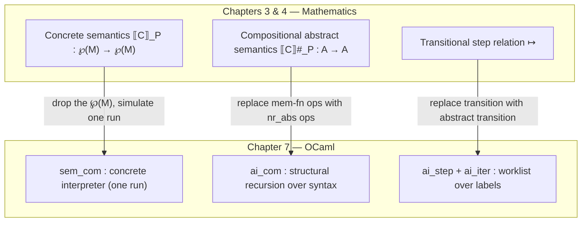
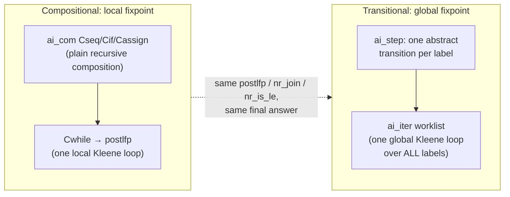

[[book-guidelines|↩ Back to guidelines]]

# Static Analyzer Implementation

## Why this chapter exists

Chapters 3 and 4 built two mathematically equivalent stories about what a static analyzer *is*: a compositional abstract semantics defined by structural induction on the syntax, and a transitional abstract semantics defined by iterating a one-step transition relation over a control-flow graph. Both are functions on lattices, defined with join, order, and fixpoints. Neither, as written, is a program.

The gap between "a function on an abstract domain, defined by structural recursion" and "a `.ml` file that runs on your laptop" looks small on paper and is treacherous in practice. This is exactly the gap every static-analysis engineer — and every author of a type checker, an SMT front end, or an elaborator — has to cross at least once: the point where a judgment written with turnstiles and inference rules becomes a recursive function that pattern-matches on an AST. Chapter 7 crosses that gap once, explicitly and completely, for a toy imperative language, precisely so the *shape* of the crossing becomes visible. That shape is what this article is really about — the OCaml is a vehicle.

**What breaks without this step:** if you jump straight from "abstract interpretation is a Galois connection between a concrete and an abstract lattice" to writing an analyzer, you will conflate at least three different things that need separate code: the representation of *program syntax*, the representation of *abstract values*, and the *fixpoint engine* that ties them together. Chapter 7's whole pedagogical move is to build these three layers one at a time and show that each layer of the implementation is a near-literal transcription of the corresponding layer of the mathematics — so that when something in your own analyzer looks ad hoc, you have a mathematical object to check it against.



---

## 1. Syntax and concrete interpreter: the representation layer

The book fixes a minimal imperative language — constants, variables, binary operators, comparisons, and six command forms (`skip`, sequencing, assignment, `input`, conditional, `while`) — and gives it an OCaml type. Note the one subtlety worth naming out loud: **commands carry labels**. This is not decoration; labels are what make program points addressable, and program points are exactly what a transitional (control-flow-graph, worklist) analysis needs to have a notion of "state."

```ocaml
(* the book's data types, section 7.1 *)
type const = int          (* machine integers *)
type var   = int          (* variables are consecutive non-negative ints *)
type bop   = Badd | ...
type rel   = Cinfeq | Csup
type expr  =
  | Ecst of const
  | Evar of var
  | Ebop of bop * expr * expr
type command =
  | Cskip
  | Cseq of com * com
  | Cassign of var * expr
  | Cinput of var
  | Cif of (rel*var*const) * com * com
  | Cwhile of (rel*var*const) * com
and com = label * command   (* the label is the program point *)
```

The memory model is the direct implementation of $M = X \to V$: since variables are contiguous integers starting at $0$, an array indexed by variable number *is* a total function from variables to values, and `read`/`write` are literally function application and function update.

```ocaml
type mem = const array
let read  (x:var) (m:mem) : const = m.(x)
let write (x:var) (n:const) (m:mem) : mem = (* functional or in-place update *)
type state = label * mem
```

Now the crucial move, and the chapter's first genuine insight. The concrete semantics of expressions is a **function** ($\mathbb{X} \times \mathbb{M} \to \mathbb{V}$, no choice involved), so its interpreter (`sem_expr`) is a literal transcription — recursion on syntax, one line per constructor, done. But the concrete semantics of *commands* is defined over **sets of memories** ($\llbracket C \rrbracket_\mathscr{P} : \wp(\mathbb{M}) \to \wp(\mathbb{M})$), because a `while` loop's semantics has to account for *every* possible run, including divergent ones. An interpreter that faithfully simulated $\llbracket C \rrbracket_\mathscr{P}$ would have to enumerate all executions — and would simply not terminate on any program with a non-terminating execution. So `sem_com` quietly narrows scope: it simulates **one** run (`Cif` picks a branch by evaluating the condition instead of unioning both; `Cwhile` recurses on the actual boolean result instead of taking a union over all iteration counts):

```ocaml
(* val sem_com : com -> mem -> mem *)
let rec sem_com (l, c) m =
  match c with
  | Cskip -> m
  | Cseq (c0, c1) -> sem_com c1 (sem_com c0 m)
  | Cassign (x, e) -> write x (sem_expr e m) m
  | Cinput x -> write x (input ()) m
  | Cif (b, c0, c1) ->
      if sem_cond b m then sem_com c0 m else sem_com c1 m
  | Cwhile (b, c) ->
      if sem_cond b m then sem_com (l, Cwhile (b, c)) (sem_com c m) else m
```

This divergence between semantics-as-mathematics and semantics-as-interpreter does not undermine the structural parallel the chapter is building toward — it *explains* why abstract interpretation is needed at all. An interpreter computes one trace; a sound analyzer needs to account for **all** traces without literally enumerating them, which is exactly what the join operator (union in the concrete, $\sqcup$ in the abstract) buys you in the compositional semantics below.

**Rust [[Specialized-Static-Analysis-Frameworks#Grounding|grounding]].** The natural Rust shape for `expr`/`command` is a tagged enum, and `mem` is a `Vec<i64>` (or `HashMap<VarId, i64>` if variables aren't dense). The interesting design decision — invisible in OCaml's garbage-collected, implicitly-shared world — is whether `write` mutates in place or returns a new `mem`. A Rust analyzer with performance in mind will almost always mutate a `&mut [Value]` in place for the concrete interpreter, but *persistent* (structurally shared) data structures for the abstract domain, because abstract states get copied and joined constantly during fixpoint iteration (the book flags this exact tradeoff in its "Optimizing the Representation" aside — more on it in §3).

```rust
#[derive(Clone, Copy, PartialEq)]
enum Bop { Add, Sub, Mul /* ... */ }
#[derive(Clone, Copy, PartialEq)]
enum Rel { LtEq, Gt }

enum Expr {
    Cst(i64),
    Var(VarId),
    Bop(Bop, Box<Expr>, Box<Expr>),
}

type Label = u32;
enum Command {
    Skip,
    Seq(Box<Com>, Box<Com>),
    Assign(VarId, Expr),
    Input(VarId),
    If((Rel, VarId, i64), Box<Com>, Box<Com>),
    While((Rel, VarId, i64), Box<Com>),
}
struct Com { label: Label, command: Command }

type Mem = Vec<i64>; // dense var-indexed array, mirroring `mem` exactly

fn sem_expr(e: &Expr, m: &Mem) -> i64 {
    match e {
        Expr::Cst(n) => *n,
        Expr::Var(x) => m[*x as usize],
        Expr::Bop(op, e0, e1) => binop(*op, sem_expr(e0, m), sem_expr(e1, m)),
    }
}
```

This is worth pausing on for the elaborator project: `sem_expr` recursing structurally over `Expr` and returning a value is the same shape as a bidirectional type checker's `infer : Expr -> Ctx -> Type` — a *judgment* realized as a total recursive function over an inductive syntax. The book is quietly teaching "judgment $\to$ recursive function" using operational semantics instead of typing rules, but the translation technique is identical, down to the choice between "structural recursion that terminates by syntax-induction" (assignment, sequencing — like a type checker's application/variable cases) and "structural recursion that needs an external argument for termination" (`Cwhile` — like a checker's fixpoint-based recursive-definition unfolding).

---

## 2. Abstract domain implementation: separating "what a value is" from "how a program runs"

Section 7.2 makes explicit something the chapter has been building toward: **you get to design the abstract domain independently of the analyzer**. This is the whole point of an abstract-interpretation framework instead of a bespoke analysis: swap the domain, keep the engine.

The book picks the sign domain from example 3.6 — four elements $\bot, \top, [\geq 0], [\leq 0]$ — and represents it as a four-constructor sum type:

```ocaml
type val_abs = Abot | Atop | Apos | Aneg   (* ⊥, ⊤, [≥0], [≤0] *)
```

and a non-relational abstract state as an array of these — literally `mem` with `const` swapped for `val_abs`:

```ocaml
type nr_abs = val_abs array
```

The operations are then case analysis, mirroring the mathematical definitions constructor-for-constructor. Two are worth reading in full because they carry real content:

```ocaml
let val_sat o n v =           (* refine v under the fact that "x REL n" holds *)
  if v = Abot then Abot
  else if o = Cinfeq && n < 0 then
    (if v = Apos then Abot else Aneg)     (* x ≤ n<0 and x≥0 together ⇒ ⊥ *)
  else if o = Csup && n >= 0 then
    (if v = Aneg then Abot else Apos)
  else v

let val_join a0 a1 =
  match a0, a1 with
  | Abot, a | a, Abot -> a
  | Atop, _ | _, Atop | Apos, Aneg | Aneg, Apos -> Atop
  | Apos, Apos -> Apos
  | Aneg, Aneg -> Aneg
```

**What breaks without a principled `val_join`:** if you hand-roll an ad hoc "merge" here instead of the *least upper bound* of the lattice, soundness silently breaks — the whole guarantee of abstract interpretation (the analysis result over-approximates every concrete execution) is a theorem *about* $\sqcup$ being an upper bound, not about whatever merge function happens to compile. `val_join` doubling as widening is legal here only because this four-element lattice has finite height — Kleene iteration with $\sqcup$ is guaranteed to terminate. The moment you swap in an infinite-height domain (intervals, say), `val_join` is no longer a legitimate replacement for widening, and the book flags this explicitly — it's the seam where chapter 5's widening machinery plugs back in.

The non-relational lift (`nr_abs` operations, figure 7.9) is componentwise application of the value operations over the array — `nr_is_le` is literally "the pointwise order," `nr_join` is literally "the pointwise join," both defined with a single `Array.iteri`/`Array.mapi`. This componentwise-lift pattern is worth naming: it is *the* recipe for building a non-relational domain out of any value domain $V$: $(X \to V^\sharp)$ ordered and joined pointwise. Swap sign for intervals, or for a constants domain (the book sketches this second option explicitly, figure 7.10, with a `[n]_C` constructor for "exactly $n$"), and every line in figure 7.9 is untouched. Only a *relational* domain (APRON) breaks this — because relational domains correlate variables, they cannot be represented as an array of independent per-variable abstractions, and the whole `nr_abs` type has to be replaced.

**Rust grounding — this is the place to reach for a trait, not an enum, if you want the "swap the domain" property to be enforced by the type system rather than by discipline:**

```rust
trait ValueDomain: Clone + PartialEq {
    fn bot() -> Self;
    fn top() -> Self;
    fn leq(&self, other: &Self) -> bool;
    fn join(&self, other: &Self) -> Self;      // doubles as widening iff finite height
    fn of_const(n: i64) -> Self;
    fn binop(op: Bop, a: &Self, b: &Self) -> Self;
    fn sat(rel: Rel, n: i64, v: &Self) -> Self; // val_sat — refine under a test
}

#[derive(Clone, PartialEq)]
enum Sign { Bot, Top, Pos, Neg }

impl ValueDomain for Sign {
    fn bot() -> Self { Sign::Bot }
    fn top() -> Self { Sign::Top }
    fn join(&self, o: &Self) -> Self {
        use Sign::*;
        match (self, o) {
            (Bot, x) | (x, Bot) => x.clone(),
            (Top, _) | (_, Top) | (Pos, Neg) | (Neg, Pos) => Top,
            (Pos, Pos) => Pos,
            (Neg, Neg) => Neg,
        }
    }
    // ... leq, of_const, binop, sat mirror val_incl / val_cst / val_binop / val_sat
}

// the non-relational lift is now GENERIC over any ValueDomain:
struct NonRelational<V: ValueDomain> { vars: Vec<V> }
impl<V: ValueDomain> NonRelational<V> {
    fn join(&self, other: &Self) -> Self {
        NonRelational { vars: self.vars.iter().zip(&other.vars)
                                 .map(|(a, b)| a.join(b)).collect() }
    }
    // is_le, is_bot, bot: identical componentwise pattern
}
```

The `ValueDomain` trait *is* the interface the book describes in prose ("swap `val_abs` and the four operations, reuse figure 7.9 verbatim") made mechanically enforced: `NonRelational<Interval>` and `NonRelational<Sign>` share every line of lift code, and the compiler will refuse to compile a lift that doesn't provide `join`/`leq`/`bot`. This is the direct ancestor of what your compiler's abstract-domain layer needs to look like if the CSP/lattice-propagation kernel from your project goals is going to support pluggable domains (intervals, congruences, DFA-shaped domains for data structures) without touching the fixpoint engine.

---

## 3. Analysis of expressions and conditions: two different structures for two different roles

Section 7.3 implements the two building blocks every command-level analysis needs, and it's worth dwelling on *why they have different shapes* — this is a distinction that recurs constantly in verification-condition generation and is easy to blur.

**`ai_expr`** is forward, structural, and total — the abstract twin of `sem_expr`, replacing constants/variables/operators with `val_cst`/`read`/`val_binop`:

```ocaml
(* ai_expr : expr -> nr_abs -> val_abs *)
let rec ai_expr e aenv =
  match e with
  | Ecst n -> val_cst n
  | Evar x -> read x aenv
  | Ebop (o, e0, e1) -> val_binop o (ai_expr e0 aenv) (ai_expr e1 aenv)
```

**`ai_cond`** is *not* structural over an expression grammar at all — a condition test is a single comparison `(rel, var, const)`, and its "analysis" is a **backward, refining** operation: given an abstract state and a fact ("$x \leq n$" say), it *narrows* the state, using `val_sat`:

```ocaml
(* ai_cond : cond -> nr_abs -> nr_abs *)
let ai_cond (r, x, n) aenv =
  let av = val_sat r n (read x aenv) in
  if av = val_bot then nr_bot aenv else write x av aenv
```

The book names this precisely: `ai_cond` implements the *filter* $\mathcal{F}_B$, viewed as a **[[Backward-Analysis|backward analysis]] of the Boolean semantics** — it enriches a state with the consequence of a fact being true, rather than computing a new value from old ones. If you have done any Hoare-logic or weakest-precondition work, this should ring a very specific bell: `ai_cond` is doing, at the single-comparison granularity of a non-relational domain, exactly the job that `assume` statements do in a Hoare-logic VCGen, and exactly the job that pattern-refinement does in bidirectional type checking when a `match`/`if` arm narrows a sum type. **The recurring shape is: forward rules propagate abstract values outward from premises; refinement rules propagate constraints inward onto existing bindings.** Any Hoare-triple checker your project builds will need this same two-mode structure — evaluate expressions forward under a precondition, filter states backward under a guard — and `val_sat`/`ai_cond` is the minimal, complete illustration of the second mode with a single relational operator.

**Python sketch**, because the point here is legibility, not performance — a five-line illustration of exactly the same forward/backward split, generic over any object exposing `join`/`sat`/`of_const`:

```python
def ai_expr(e, aenv, dom):
    match e:
        case ('cst', n):        return dom.of_const(n)
        case ('var', x):        return aenv[x]
        case ('bop', op, e0, e1): return dom.binop(op, ai_expr(e0, aenv, dom), ai_expr(e1, aenv, dom))

def ai_cond(rel, x, n, aenv, dom):
    av = dom.sat(rel, n, aenv[x])
    return dom.bot_env(aenv) if av == dom.bot() else {**aenv, x: av}
```

---

## 4. The compositional analyzer: local fixpoints, structural recursion

`ai_com` (figure 7.13) is the payoff of everything above: it is `ai_com : com -> nr_abs -> nr_abs`, a direct structural transcription of the abstract semantics $\llbracket C \rrbracket^\sharp_\mathscr{P}$ from chapter 3, with one addition — an explicit bottom short-circuit for efficiency (`if nr_is_bot aenv then aenv`), and one addition of real substance: **the loop case needs its own local fixpoint computation**, because structural recursion over the syntax runs out — a `while` loop's body doesn't get smaller as you unfold it.

```ocaml
let rec postlfp f a =
  let anext = f a in
  if nr_is_le anext a then a else postlfp f (nr_join a anext)

let rec ai_com (l, c) aenv =
  if nr_is_bot aenv then aenv
  else match c with
    | Cskip -> aenv
    | Cseq (c0, c1) -> ai_com c1 (ai_com c0 aenv)
    | Cassign (x, e) -> write x (ai_expr e aenv) aenv
    | Cinput x -> write x val_top aenv
    | Cif (b, c0, c1) ->
        nr_join (ai_com c0 (ai_cond b aenv))
                (ai_com c1 (ai_cond (cneg b) aenv))
    | Cwhile (b, c) ->
        let f_loop = fun a -> ai_com c (ai_cond b a) in
        ai_cond (cneg b) (postlfp f_loop aenv)
```

`postlfp` is Kleene iteration written out by hand: apply $f$, check whether you've reached (or overshot) a post-fixpoint via the abstract order, and if not, join in the new iterate and try again. Termination is guaranteed *only* because the value lattice has finite height (§2) — swap in an infinite-height domain and `nr_join` inside `postlfp` must become `ai_widen`, exactly as the "Improving the Analysis" aside says.

Notice the recursion structure: **the iteration is local to the `Cwhile` case.** Every other command composes its analysis by ordinary function composition (`ai_com c1 (ai_com c0 aenv)` — no loop, no fixpoint machinery, just plain recursive calls). This "local fixpoint" property is the compositional style's defining feature, and it directly answers one of the book's own key questions about why the compositional and transitional analyzers, despite computing the same thing, are structured so differently — see §6.

**Lean grounding.** This is the point in the chapter where the connection to your elaborator/kernel project is most direct, because `postlfp` *is*, verbatim, the constructive witness behind the Knaster–Tarski / Kleene fixpoint theorem restricted to finite-height lattices — the theorem that gives static analysis its mathematical legs in the first place. In Lean, if you had a `Lattice` with a proof of finite height (or, more usually, a well-founded strict order on decreasing "distance to the top"), `postlfp`'s termination argument is exactly a well-founded recursion:

```lean
-- sketch: postlfp as well-founded recursion on "how far anext is above a"
def postlfp {A : Type*} [Lattice A] [DecidableEq A]
    (leq : A → A → Bool) (join : A → A → A)
    (f : A → A) (a : A) : A :=
  let anext := f a
  if leq anext a then a
  else postlfp leq join f (join a anext)
termination_by /- rank of `a` in a finite-height lattice, strictly decreasing -/
```

The `termination_by` obligation Lean would demand here is not a formality — it is *the theorem* that makes `ai_com`'s `Cwhile` case sound and terminating, spelled out as a proof obligation instead of left as prose ("the lattice has finite height"). This is precisely the kind of soundness argument your Rust analyzer's Hoare-triple checker will eventually need to discharge (or trust) for every fixpoint computation it runs — either by restricting to finite-height domains, or by threading a genuine widening operator with its own termination proof.

---

## 5. The transitional analyzer: one abstract step, one global fixpoint

Section 7.5 implements the same analysis over the same language, from the opposite architectural choice: chapter 4's transition-relation view instead of chapter 3's structural-recursion view.

`ai_step` computes, from a single label and its abstract state, the list of *all* possible next (label, state) pairs — the abstract lift of the concrete `step` function (figure 7.6), generalized from "the next state" to "the set of all next states with their labels," because in the abstract, a conditional or a loop guard produces two possible continuations rather than one chosen branch:

```ocaml
(* ai_step : com -> label -> nr_abs -> (label * nr_abs) list *)
let rec ai_step (l, c) lnext aenv =
  match c with
  | Cskip -> [ (lnext, aenv) ]
  | Cseq (c0, c1) -> ai_step c0 (fst c1) aenv
  | Cassign (x, e) -> [ (lnext, write x (ai_expr e aenv) aenv) ]
  | Cinput x -> [ (lnext, write x val_top aenv) ]
  | Cif (b, c0, c1) ->
      [ (fst c0, ai_cond b aenv); (fst c1, ai_cond (cneg b) aenv) ]
  | Cwhile (b, c) ->
      [ (fst c, ai_cond b aenv); (lnext, ai_cond (cneg b) aenv) ]
```

The global driver, `ai_iter`, is a worklist algorithm — the textbook data-flow fixpoint loop, and the direct implementation of the macroscopic algorithm of figure 4.5:

```ocaml
(* ai_iter : prog -> nr_abs -> unit *)
let ai_iter p aenv =
  let (l, c) = first p in
  invs := I.add l aenv I.empty;
  let wlist = T.create () in
  T.add l wlist;
  while not (T.is_empty wlist) do
    let l = T.pop wlist in
    let c = find p l in
    let lnext = next p l in
    let aenv = I.find l !invs in
    let aposts = ai_step (l, c) lnext aenv in
    List.iter (fun (lnext, apost) ->
      let old_apost = storage_find lnext in
      if not (nr_is_le apost old_apost) then begin
        let new_apost = nr_join old_apost apost in
        invs := I.add lnext new_apost !invs;
        T.add lnext wlist
      end) aposts
  done
```

Every ingredient here — `ai_step`, `nr_is_le`, `nr_join` — is shared *verbatim* with the compositional analyzer. **The only genuinely new thing is the iteration strategy itself, and where it lives.** In `ai_com`, iteration is local: it appears inline, inside `Cwhile`, and nowhere else — every non-loop command is handled by ordinary recursive composition. In `ai_iter`, iteration is global: there is exactly one loop (the `while not (T.is_empty wlist)` in `ai_iter`), and it is the *only* control structure in the entire analyzer — assignment, sequencing, conditionals, and while-loops are all just different cases of what one worklist-pop produces via `ai_step`.

### Local vs. global fixpoint iteration — the same answer, two engines

This is one of the book's own flagged Key Questions, and it's worth answering explicitly rather than gesturing at it: **`ai_iter` visits one label at a time (microscopic), while figure 4.5's abstract description visits the whole active worklist at once each round (macroscopic) — yet the two are equivalent** because the macroscopic $F^\sharp$ step is just "apply the one-step transition to every label in the worklist, partition results by target label, and join everything landing on the same label" — which is precisely what running the microscopic loop to completion accumulates, just interleaved differently and updating shared mutable state (`invs`) incrementally instead of building one big new worklist per round. The *set of fixpoint equations being solved* is identical in both formulations; only the scheduling of when you propagate a join differs, and — because join is associative, commutative, and idempotent — the final fixpoint reached does not depend on that scheduling.



For engineering purposes this distinction has real teeth: the compositional analyzer's structure mirrors the program's syntax tree, so it's easy to reason about and easy to extend with syntax-directed instrumentation (the reachable-states table via `storage_find`/`storage_add`, added with a one-line `nr_join` at the top of `ai_com`), but it does not naturally support arbitrary control flow (`goto`, exceptions) because it needs a tree to recurse over. The transitional analyzer's structure mirrors the control-flow graph instead, so it generalizes to arbitrary label graphs "for free" (any `next`/`find` implementation works), at the cost of losing the syntax-tree-shaped instrumentation points — you have to instrument at the level of `ai_iter`'s global table (`invs`) instead of at specific syntactic sites. This exact tradeoff resurfaces, unaltered, in every real-world CFG-based dataflow framework and every worklist-based points-to analysis.

**Rust grounding**, which makes the "one interface, two engines" point concretely — both engines can be written against the same `ValueDomain`/`NonRelational` types from §2, differing only in their control structure:

```rust
// Compositional: pure recursive descent, fixpoint appears once, locally
fn ai_com<V: ValueDomain>(com: &Com, aenv: NonRelational<V>) -> NonRelational<V> {
    if aenv.is_bot() { return aenv; }
    match &com.command {
        Command::Skip => aenv,
        Command::Seq(c0, c1) => ai_com(c1, ai_com(c0, aenv)),
        Command::Assign(x, e) => aenv.write(*x, ai_expr(e, &aenv)),
        Command::If(cond, c0, c1) =>
            ai_com(c0, ai_cond(cond, aenv.clone()))
                .join(&ai_com(c1, ai_cond(&neg(cond), aenv))),
        Command::While(cond, body) => {
            let post = postlfp(|a| ai_com(body, ai_cond(cond, a.clone())), aenv);
            ai_cond(&neg(cond), post)
        }
        Command::Input(x) => aenv.write(*x, V::top()),
    }
}

// Transitional: single worklist, fixpoint appears once, globally
fn ai_iter<V: ValueDomain>(prog: &Prog, entry: Label, init: NonRelational<V>) {
    let mut invs: HashMap<Label, NonRelational<V>> = HashMap::from([(entry, init)]);
    let mut worklist: VecDeque<Label> = VecDeque::from([entry]);
    while let Some(l) = worklist.pop_front() {
        let com = prog.find(l);
        let lnext = prog.next(l);
        let aenv = invs[&l].clone();
        for (lnext, apost) in ai_step(com, lnext, aenv) {
            let old = invs.get(&lnext).cloned().unwrap_or(NonRelational::bot());
            if !apost.leq(&old) {
                invs.insert(lnext, old.join(&apost));
                worklist.push_back(lnext);
            }
        }
    }
}
```

If you are building a CSP-backed invariant-generation kernel, the worklist shape of `ai_iter` is very close to what you already need for constraint propagation (AC-3-style domain filtering runs on exactly this "pop, recompute, push neighbors if changed" pattern) — the abstract-interpretation worklist and the CSP-propagation worklist are, structurally, the same algorithm applied to different lattices.

---

## 6. Where this leads

This chapter is the hinge between the theoretical apparatus of chapters 3–5 and everything downstream that depends on having a *working* analyzer to extend:

- **Chapter 8** (pointers, aliasing, procedures, heap shape) extends exactly this scaffolding — new abstract domains plugged into the same `ValueDomain`/`NonRelational`-style interface, new cases added to `ai_expr`/`ai_com`/`ai_step`, without touching the fixpoint engines built here.
- **Chapter 5's** widening, loop unrolling, and delayed-widening techniques all plug into the single seam this chapter exposes: `postlfp`'s join (compositional) or `ai_iter`'s join-at-a-label (transitional). Anything that changes *how* a fixpoint is approached — rather than *what* the value or non-relational domain is — lives here.
- For the standing project: this chapter is the minimal complete blueprint for the "abstract interpretation for automated invariant generation" component of the planned Rust compiler. `ai_com`/`ai_iter` over a `NonRelational<V>` state *is* the invariant-generation engine; a Hoare-triple checker built on top needs only to (a) treat `requires` as the initial abstract precondition fed to `ai_com`/`ai_iter`, and (b) treat `ensures` as an inclusion check between the resulting abstract postcondition and the abstract element denoted by the postcondition formula — reusing `val_incl`/`nr_is_le` as the semantic core of that check. The CSP kernel's domain-propagation loop and `ai_iter`'s worklist loop are close enough in shape that a shared propagation engine parameterized over "abstract domain vs. constraint domain" is a realistic design target, not just an analogy.
