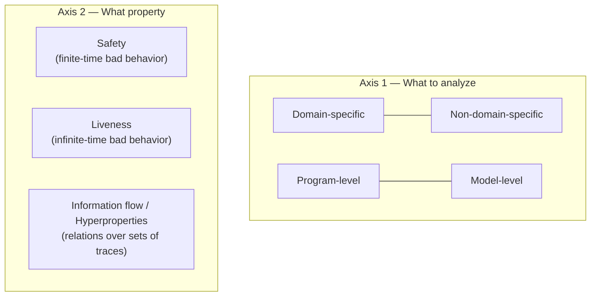
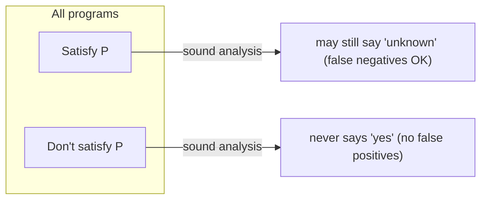

[[book-guidelines|↩ Back to guidelines]]

# The Landscape of Program Analysis Techniques

## Why this chapter exists before any actual analysis technique

Every engineering discipline answers the same question before it builds anything: *will this design behave as intended once it meets reality?* For a bridge, the answer comes from applying physics to a blueprint. For software, there's a twist: the thing that "runs" the design isn't nature, it's the computer, and the computer's behavior is entirely determined by the *meanings* of the source language — nothing more, nothing less. So checking "will this program behave as intended" reduces to checking a property about the language's own meaning function applied to the program. Rival and Yi give that meaning function a name:

**Semantics** — a (generally formal) description of a program's run-time behaviors.
**Semantic property** — any property about a program's semantics.

Once you have this vocabulary, "program analysis" gets a one-line definition: a technique that checks whether a program satisfies a semantic property. A **program analysis tool** is just an implementation of one. This sounds almost too simple to be worth stating, but it's doing real work — it's what lets the rest of the book treat "does this program crash," "does this program terminate," and "does this program leak secrets" as instances of the *same* underlying problem (check semantic property $P$ against program $p$), rather than as unrelated engineering tasks each needing its own bag of tricks.

**What breaks without this framing:** if you don't first nail down "semantics" as the object of study, you end up conflating syntactic checks (does this parse, does this match a pattern) with genuinely semantic ones (will this ever divide by zero). Syntactic properties are decidable by definition — you just read the text. Semantic properties are a different animal entirely, and the rest of the chapter is about exactly how different.

## Two axes for classifying any technique: what you analyze, and what you're checking for

Section 1.3.1 ("What to Analyze") sets up two independent classification axes for program analyses — orthogonal choices a designer makes before writing a single line of an algorithm.

**Axis 1 — target programs.**
- *Domain-specific* vs. *non-domain-specific*: a domain-specific analysis exploits idioms common to a narrow family of programs (e.g., embedded C rarely uses recursion or dynamic allocation, so an analysis for it can specialize and be both cheaper and more precise). A non-domain-specific analysis — the kind baked into a general compiler — sacrifices some precision/cost to stay applicable across a wide program population.
- *Program-level* vs. *model-level*: program-level analyses run directly on source or binaries, typically with a compiler-style front end building syntax trees. Model-level analyses instead consume a separate description (a model) of the program's semantics, built either by hand or by another tool. The catch: any gap between the model and the real program's behavior is a hidden source of unsoundness or incompleteness that has to be accounted for.

**Axis 2 — target properties.** The book singles out three families that recur throughout:
- **Safety property**: no bad behavior observable in *finite* time (crashes, integer overflow, buffer overrun, uncaught exceptions, deadlock, or even *reaching a particular state*). Proving a safety property means proving something can never happen along any finite prefix of execution.
- **Liveness property**: no bad behavior observable only after *infinite* time — non-termination, livelock, starvation. Note the asymmetry: a safety violation has a finite witness (a single bad trace prefix disproves it); a liveness violation in general needs an infinite witness.
- **Information flow property**: statements about the *absence of dependence* between pairs of program behaviors (e.g., "user A's output never depends on user B's secret input"). This is qualitatively different — it can't be phrased as a statement about one execution at a time, because it's fundamentally a relation *between* executions. The book generalizes this into **hyperproperties**: properties defined over *sets* of executions rather than single executions.

This distinction (single-trace vs. relational/hyperproperties) is not cosmetic — it's why safety and liveness analyses can often be built by reasoning about one execution at a time, while information-flow analysis generally needs machinery that reasons about two (or more) executions simultaneously (self-composition is exactly this trick, covered later in chapter 9).



## Static versus dynamic: when the check happens

Section 1.3.2 draws a second, cross-cutting line: *when* is the analysis performed relative to execution?

- **Dynamic analysis** runs *during* execution — user assertions, Java's array-bound checks, runtime type checks. It observes the actual behavior as it happens, over one or more concrete runs.
- **Static analysis** runs *before* execution, once and for all, independent of any particular run — type checking is the book's go-to example: "well-typed programs will not present certain classes of errors," decided entirely at compile time.

The trade-off is concrete, not philosophical: dynamic analysis is usually easier to build but costs runtime overhead and doesn't force a fix before the program ships; static analysis costs nothing at runtime but some properties (termination, again) are outright *impossible* to check dynamically — you'd need to observe an infinite execution to conclude non-termination dynamically, which obviously can't be done in finite time. There's also an asymmetry in what happens after a violation is found: a dynamic check can only abort or patch a *running* program (with all the risk of an unspecified continuation), whereas a static violation gives developers a chance to fix the bug before the software is ever deployed.

## The hard limit: why no technique can be perfect

This is the section that gives the whole book its shape. Section 1.3.3 asks: could we build an ideal analysis that is fully automatic, always correct, and always terminates? The answer is a hard, mathematical *no*, and it's worth internalizing the two theorems precisely because everything downstream — every soundness/completeness trade-off in every later chapter — is a designer's reaction to this wall.

**Theorem 1.1 (Halting problem, Church/Turing 1936).** For a Turing-complete language $L$, there is no algorithm $\mathrm{halt}$ such that for every program $p \in L$, $\mathrm{halt}(p) = \mathtt{true} \iff p$ terminates.

**Theorem 1.2 (Rice's theorem).** Let $L$ be Turing-complete and $P$ a *nontrivial* semantic property (nontrivial meaning: some programs satisfy it, some don't — the only properties worth analyzing in the first place). Then there is no algorithm that returns $\mathtt{true}$ if and only if $p$ satisfies $P$, for every $p \in L$.

The proof sketch the book gives for why *any* nontrivial semantic property reduces to the halting problem is genuinely illuminating: suppose you had an exact decider for "this program prints 1 and finishes." Feed it the transformed program "$P$; print 1." The decider says yes iff $P$ halts — so you've just built a halting oracle out of your supposedly narrower decider. Nontriviality is exactly what makes this reduction go through; a property that's always true or always false gives you no leverage.

**Why this matters mechanically, not just philosophically:** Rice's theorem forces *every* automatic technique to give up exactly one of two things — the "for every program" quantifier (restrict to a subclass) or the "if and only if" (accept a possibly-wrong or possibly-inconclusive answer). Every technique surveyed in section 1.4 is a different choice of *which* half to sacrifice, and *how much* of it.

## Soundness and completeness: naming the two ways to be inexact

Section 1.3.5 formalizes "possibly inconclusive answer" precisely, and this pair of definitions is arguably the single most load-bearing piece of vocabulary in the entire book.

Fix a semantic property $P$ and an analysis tool $\mathrm{analysis}$. The unattainable ideal would be:

$$\forall p \in L,\quad \mathrm{analysis}(p) = \mathtt{true} \iff p \text{ satisfies } P$$

This biconditional splits into two independent implications, and dropping either one gives you a different, weaker, but potentially useful notion:

**Definition 1.2 (Soundness).** $\mathrm{analysis}$ is sound w.r.t. $P$ if $\mathrm{analysis}(p) = \mathtt{true} \Rightarrow p$ satisfies $P$.

A sound analysis never lies in the "yes" direction — if it says "property holds," you can bet the software on it. It "errs on the side of caution": it may refuse to certify programs that are actually fine (false negatives, in the "no bug" sense), but it never certifies a program that isn't.

**Definition 1.3 (Completeness).** $\mathrm{analysis}$ is complete w.r.t. $P$ if $p$ satisfies $P \Rightarrow \mathrm{analysis}(p) = \mathtt{true}$.

A complete analysis never *misses* a program that genuinely has the property — equivalently, whenever it rejects a program, that program genuinely lacks $P$.

Both definitions admit a trivial, useless instance: an analysis that *always* returns false is (vacuously) sound; one that *always* returns true is (vacuously) complete. Neither produces a single useful conclusive answer. This is the sharpest possible illustration of why "sound" is not a synonym for "good" — soundness is a floor, not a target. The actual engineering problem the rest of the book solves is: *given* that you must be sound (or must be complete), how do you make the analysis conclusive as often as possible on real programs?



Since Rice's theorem rules out sound-and-complete-and-automatic simultaneously, an *automatic* analysis is always either unsound or incomplete (possibly both, in the bug-finding case below). One quiet but important footnote: nontermination or crashes of the analyzer itself must be interpreted conservatively too — a sound analyzer that times out must report the conservative ("unknown," treated as "false") answer, not silently omit the check.

## The five families: the same trade-off, five different resolutions

Section 1.4 walks through the concrete techniques, each characterized by *which* of {automatic, sound, complete} it gives up.

| Family | Automatic | Sound | Complete | Mechanism |
|---|---|---|---|---|
| **Testing** | yes | no (generally) | yes | samples a finite subset of a generally infinite execution set; a failing test *is* a real counterexample, so it can't produce false alarms, only misses |
| **Assisted proof** | no | yes (rel. to the model) | yes (up to the prover) | user supplies invariants/proof scripts (Coq, Isabelle/HOL, PVS, or tool-assisted like Dafny, Why3); human does the hard logical work, machine checks it |
| **Model checking** | yes | yes & complete *w.r.t. a finite model* | — | exhaustively enumerates a finite abstraction of the system; soundness/completeness w.r.t. the real program depends entirely on the model's fidelity |
| **Conservative static analysis** | yes | yes | no (generally) | over-approximates the set of reachable behaviors using a fixed, finitely representable set of properties |
| **Bug finding** | yes | no | no | drops both guarantees deliberately (e.g. unrolls loops only once) to stay fast and produce fewer, higher-signal alarms |

A few points the book stresses that are easy to gloss over:

- **Testing is complete, not sound**, which inverts the intuition many programmers carry from unit-testing culture ("if tests pass, we're probably fine" — no, formally testing gives you zero soundness guarantee; a passing test suite proves nothing about untested paths). Its completeness comes precisely from the fact that a failing run is a genuine witness.
- **Model checking's soundness/completeness is relative to the model**, not the program. This is the crucial caveat: if the finite model doesn't faithfully capture the (usually infinite-state) program, the *verification result* can be unsound or incomplete with respect to the actual program even though the model-checking algorithm itself is exact relative to the model it was given. Techniques like counterexample-guided abstraction refinement (CEGAR) exist precisely to iteratively patch this gap — a thread the learning-goals notes flag as directly relevant to later CEGAR/CHC material.
- **Conservative static analysis is the book's chosen focus** specifically *because* it's automatic and sound — the two properties needed to run analysis unattended over large codebases and still trust a "yes." The definition it settles on (Definition 1.4): *Static analysis is an automatic technique for program-level analysis that approximates in a conservative manner semantic properties of programs before their execution.* Every remaining chapter of the book is an elaboration of how to build such a thing.
- **Bug finding deliberately drops soundness too**, in exchange for lower engineering cost and fewer, noisier alarms — tools like Coverity or CBMC (bounded model checking) accept that they'll sometimes miss bugs and sometimes flag non-bugs, betting that a fast, cheap, mostly-useful signal beats a slow, expensive, fully-guaranteed one for non-critical software.

## First-principles grounding: soundness/completeness as a type checker's contract

If you've ever written or used a type checker, you've already lived inside Definition 1.2 without naming it. A sound type system is exactly a sound program analysis for the property "this program will not go wrong at runtime due to a type error." It rejects some programs that would actually run fine (false negatives on "no crash") in exchange for the guarantee that everything it accepts really is safe.

**Rust.** The borrow checker is a textbook conservative static analysis: automatic, sound, incomplete. It conservatively over-approximates aliasing and lifetime relationships, and famously rejects some memory-safe programs (the classic "the borrow checker doesn't know this is fine" frustration) in exchange for *never* accepting a program with a real aliasing violation it can detect statically.

```rust
// The borrow checker is a sound-but-incomplete static analysis for the
// property "no simultaneous mutable+immutable aliasing." It conservatively
// rejects some programs that are actually fine at runtime.
fn analysis_is_incomplete() {
    let mut v = vec![1, 2, 3];
    let r = &v[0];          // immutable borrow
    // v.push(4);            // <- would be rejected: conservative over-approximation
                              //    of "r might still be read after this point"
    println!("{}", r);
}
```

**Python.** Python has essentially no static analysis in this sense by default — it is (mostly) a *dynamic*-only language for type errors: `1 + "a"` is only caught when that line actually executes. This is a clean illustration of the static/dynamic axis from section 1.3.2: the cost of skipping static analysis is that a bug can sit dormant in an unexercised branch indefinitely.

```python
def maybe_broken(flag):
    if flag:
        return 1 + "a"   # TypeError only if this branch actually runs
    return 0
```

**Lean.** Lean's kernel is the assisted-proof end of the spectrum taken to its logical extreme: fully sound and fully complete *relative to the logic*, but not automatic — the user (or an automated tactic) must supply the proof term, and the kernel only *checks* it.

```lean
-- The kernel's type-checking of this proof term is sound and complete
-- relative to Lean's logic, but constructing the term was not automatic.
theorem add_comm_ex (a b : Nat) : a + b = b + a := Nat.add_comm a b
```

This maps directly onto the "trusted kernel" thread from the learning-goals notes: Lean's elaborator (which does unification, metavariable resolution, tactic execution) is *not* trusted — it's the small kernel re-checking the final term that carries the soundness guarantee. That is precisely the assisted-proof family's "sound relative to the model, complete up to the prover's abilities" characterization from section 1.4.2, engineered as a trusted-computing-base split.

## Where this leads

This chapter is the book's foundation stone, not a self-contained topic: everything that follows is downstream of the commitment made in section 1.5 — "from now on, we focus on conservative static analysis." Concretely:

- **Soundness (Def. 1.2)** reappears as the precise proof obligation for every abstract semantics the book builds, starting in chapter 2's toy geometric analyzer and formalized fully in chapter 3's Theorem 3.6 and chapter 4's Theorem 4.4 — "derive a sound abstract semantics from a concrete one" is the book's entire methodology, and this chapter is where "sound" gets its meaning.
- **The safety/liveness/hyperproperty trichotomy** resurfaces, expanded, in chapter 9 — safety via invariant analysis, liveness via ranking functions, and information flow via self-composition or sets-of-sets abstraction, all framed as different answers to the same "what class of property am I proving" question raised here.
- **The completeness give-up** is what motivates the entire abstract-domain design space of chapters 3–5 (products, widening, partitioning): every one of those constructions is an attempt to claw back precision — i.e., to make the *incomplete* analysis conclusive more often — without ever compromising soundness.
- For the standing project of building a Rust-based verifier with an embedded prover: this chapter is where the trusted-kernel / proof-reconstruction split (assisted-proof family) and the sound-conservative-approximation split (static-analysis family) get named as genuinely different design points. A CHC/Horn-clause-based invariant generator sits in the conservative-static-analysis family (automatic, sound, incomplete); a proof-certificate-checking kernel for an elaborator sits in the assisted-proof family (not automatic, but sound and complete relative to the logic it checks). Knowing which family a given component of the toolchain belongs to tells you, immediately, which guarantee it owes its caller.
