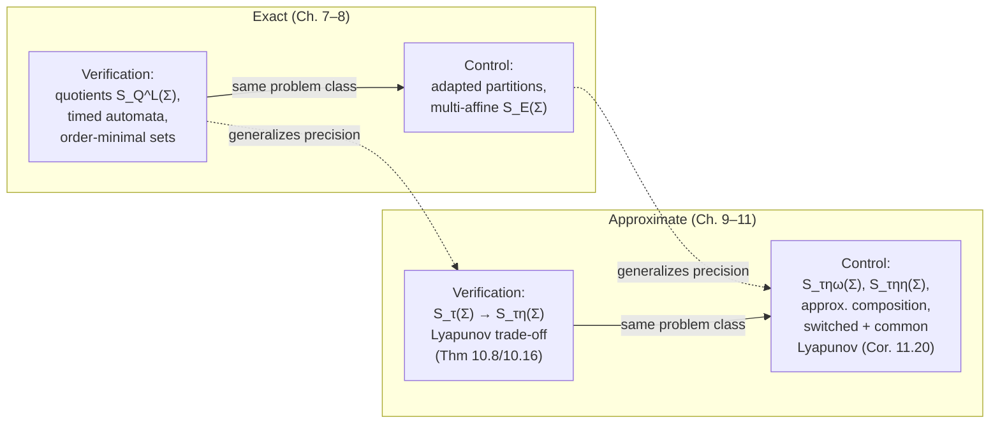

[[book-guidelines|↩ Back to guidelines]]

# Approximate Symbolic Models for Verification and Control

## From a stability certificate to a finite machine

[[Stability-Theory-for-Approximate-Abstraction]] hands you a Lyapunov function $V$ and a decay rate $\lambda$ as *proof that error doesn't blow up*. This article is about what you actually build with that proof: a finite-state (or countable) transition system that is provably $\varepsilon$-close to an infinite-state dynamical, control, or switched system — close enough that a safety game or a reachability computation solved on the finite model transfers back to the real one. Chapters 7–8 built exact finite quotients by chasing equivalence classes of trajectories through a definable structure; nothing here quotients anything. Instead, two independent operations get applied directly to the state space and to the transition relation, and a stability argument is what lets you get away with it.

**Quantizing time** means: stop recording every instant of the flow, and only record the state every $\tau$ seconds. This turns a [[Exact-Symbolic-Models-for-Control#Continuous-time|continuous-time]] trajectory into a [[Exact-Symbolic-Models-for-Control#Discrete-time|discrete-time]] system whose single "input" is *duration* $\tau$ itself — a transition $x \xrightarrow{\tau} x'$ exists exactly when some solution of the differential equation starting at $x$ reaches $x'$ after exactly $\tau$ time units. Nothing is lost yet: the state space is still all of $\mathbb{R}^n$, so this is still an infinite-state system, merely a resampled one.

**Quantizing space** means: replace $\mathbb{R}^n$ by a countable grid $[\mathbb{R}^n]_\eta$ — points spaced so that balls of radius $\eta$ around grid points cover the whole space — and reroute every transition so it starts and ends on the grid, tolerating up to $\eta$ of drift at each end. This is what actually makes the state set finite (once you also restrict to a bounded operating region), but it necessarily corrupts the transition relation: a transition in the quantized system no longer means "the flow takes you exactly here," only "the flow takes you within $\eta$ of here." Space quantization is the operation that introduces error; time quantization only decides how often you're willing to accept it.

**Why you can't pick $\varepsilon$, $\tau$, $\eta$ independently.** Intuitively: every $\tau$ seconds, the quantized system re-snaps the true trajectory to a grid point up to $\eta$ away. That $\eta$ of error doesn't vanish — it becomes the new initial condition for the next $\tau$-second interval, where it gets an *additional* $\eta$ of quantization error added to it. If the underlying dynamics were merely stable, these errors would accumulate without bound and the "abstraction" would drift arbitrarily far from the true trajectory as time goes on — an unusable approximation. What saves the construction is *asymptotic* stability, specifically the exponential contraction $V(\xi_x(\tau) - \xi_{x'}(\tau)) \le e^{-\lambda\tau} V(x-x')$ that a Lyapunov function certifies: whatever error was present at the start of an interval shrinks by a factor $e^{-\lambda\tau}$ over that interval, before the fresh $\eta$ of quantization error is added back in. The whole construction is a fixed point of "shrink, then add noise," and Theorem 10.8 is exactly the statement of when that fixed point stays under a target precision $\varepsilon$. This is why the inequality relating $\varepsilon,\tau,\eta$ is not a numerical nicety — it is the condition for a positive answer to "does the drift-then-correct process ever stabilize below my precision budget," and it necessarily involves all three quantities at once: tightening $\varepsilon$ forces $\eta$ down for fixed $\tau$; slowing the sampling (raising $\tau$) buys more contraction $e^{-\lambda\tau}$ per step, which loosens the bound on $\eta$; but only up to a ceiling ($\alpha^{-1}\overline\alpha\varepsilon$) set purely by how much drift $\varepsilon$-precision can tolerate at all, independent of $\tau$.

## The time-triggered system $S_\tau(\Sigma)$

For a dynamical system $\Sigma = (\mathbb{R}^n, f)$, Definition 10.6 sets:

$$S_\tau(\Sigma) = (X_\tau,U_\tau,\to_\tau,Y_\tau,H_\tau), \qquad X_\tau = \mathbb{R}^n,\ U_\tau=\{\tau\},\ Y_\tau=\mathbb{R}^n,\ H_\tau = \iota,$$

with $x \xrightarrow{\tau} x'$ iff some solution $\xi_x:[0,\tau]\to\mathbb{R}^n$ of $\Sigma$ satisfies $\xi_x(\tau)=x'$. Contrast this with Chapter 7's $S_Q^L(\Sigma)$: that system samples a transition whenever the *output* changes (output-triggered — the equivalence class $Q(\xi(t))$ has to change before anything happens). $S_\tau(\Sigma)$ samples on a fixed clock regardless of what the state is doing — it is genuinely just the flow map $\xi(\cdot,\tau)$ viewed as a one-step transition relation. The output set stays $\mathbb{R}^n$ with the Euclidean metric, which is the only reason $S_\tau(\Sigma)$ qualifies as a *metric system* and hence a candidate for approximate (not exact) bisimulation from [[Approximate-System-Relationships]].

## Space quantization: $S_{\tau\eta}(\Sigma)$ and Theorem 10.8

Fix $\eta \in \mathbb{R}^+$ and let $[\mathbb{R}^n]_\eta$ be the grid of Chapter 10's notation section — points whose coordinates are integer multiples of $\eta\cdot\tfrac{2}{\sqrt n}$, chosen so that balls of radius $\eta$ centered at grid points cover $\mathbb{R}^n$. Definition 10.7:

$$S_{\tau\eta}(\Sigma): \quad X_{\tau\eta}=[\mathbb{R}^n]_\eta,\quad x \xrightarrow{\tau}_{\tau\eta} x' \iff \exists\, \xi_x:[0,\tau]\to\mathbb{R}^n \text{ solving } \Sigma,\ \|\xi_x(\tau)-x'\|\le\eta.$$

$X_{\tau\eta}$ is countable (finite, if $f$'s domain is bounded — the usual case for physical state variables). But note precisely what got weakened: a transition $x \to_{\tau\eta} x'$ no longer certifies $x'=\xi_x(\tau)$, only $\|\xi_x(\tau)-x'\|\le \eta$. Without an argument bounding how this per-step slack compounds, $S_{\tau\eta}(\Sigma)$ is not even guaranteed to be *approximately simulated* by $S_\tau(\Sigma)$ — errors could grow along a long external behavior with nothing capping them.

> **Theorem 10.8.** Let $\Sigma=(\mathbb{R}^n,A)$ be linear with Lyapunov function $V(x)=\sqrt{x^TPx}$, $P\in SP(n)$ (so $V$ satisfies the norm-equivalence and generalized-triangle bounds $\underline\alpha\|x\|\le V(x)\le\overline\alpha\|x\|$ and $V(x-x')-V(x-x'')\le\gamma\|x'-x''\|$ from Proposition 10.5). For any desired precision $\varepsilon\in\mathbb{R}^+$, any time quantization $\tau\in\mathbb{R}^+$, and any space quantization $\eta$ satisfying
> $$\eta \;\le\; \min\Big\{\gamma^{-1}\underline\alpha\varepsilon\big(1-e^{-\lambda\tau}\big),\ \overline\alpha^{-1}\underline\alpha\varepsilon\Big\}, \tag{10.7}$$
> the relation $R_\varepsilon = \{(x_\tau,x_{\tau\eta}) \mid V(x_\tau - x_{\tau\eta}) \le \underline\alpha\varepsilon\}$ is an $\varepsilon$-approximate bisimulation relation between $S_\tau(\Sigma)$ and $S_{\tau\eta}(\Sigma)$.

The proof is the "shrink, then add noise" argument made precise. Take a related pair with $V(x_\tau-x_{\tau\eta})\le\underline\alpha\varepsilon$ and a transition $x_\tau \to_\tau x_\tau'$. Route $S_{\tau\eta}(\Sigma)$'s matching transition $x_{\tau\eta}\to x_{\tau\eta}'$ through any grid point within $\eta$ of the *true* flow endpoint $\xi_{x_{\tau\eta}}(\tau)$ (such a point always exists by construction of the grid). Then:

$$V(x'_\tau - x'_{\tau\eta}) \;\underset{\text{triangle}}{\le}\; V(\xi_{x_\tau}(\tau)-\xi_{x_{\tau\eta}}(\tau)) + \gamma\eta \;\underset{\text{contraction}}{\le}\; e^{-\lambda\tau}V(x_\tau-x_{\tau\eta}) + \gamma\eta \;\le\; e^{-\lambda\tau}\underline\alpha\varepsilon + \gamma\eta.$$

For this to stay $\le\underline\alpha\varepsilon$ you need $\gamma\eta \le \underline\alpha\varepsilon(1-e^{-\lambda\tau})$ — exactly the first branch of (10.7). The second branch, $\eta\le\overline\alpha^{-1}\underline\alpha\varepsilon$, is unrelated to dynamics at all: it is what's needed just to seed the *first* step, so that a grid point within $\eta$ of any $x_\tau$ already satisfies $V(x_\tau-x_{\tau\eta})\le\overline\alpha\eta\le\underline\alpha\varepsilon$ by the norm-equivalence bound alone (using $V\le\overline\alpha\|\cdot\|$). **Corollary 10.10** extends the identical statement to affine systems $\Sigma=(\mathbb{R}^n,A,h)$ — the extra term $h$ cancels in the difference $\xi_{x_0}(t)-\xi_{x_0'}(t)$, so the same contraction inequality (10.16) holds verbatim.

**What breaks without asymptotic stability.** If $\lambda=0$ (merely stable, not asymptotically), the first branch of (10.7) forces $\eta\to 0$ as $\tau$ grows, and more importantly the "shrink" step vanishes entirely — there is nothing to counteract the $\gamma\eta$ of fresh quantization noise injected every $\tau$ seconds, so the bound cannot be met at any fixed $\eta>0$ over unboundedly many steps. This is the constructive echo of [[Stability-Theory-for-Approximate-Abstraction]]'s Proposition 10.11: stability isn't a convenient sufficient condition here, it is what the trade-off inequality is *solving for*.

### Worked numbers (Example 10.9)

For $\dot\xi_1=-7\xi_1+\xi_2,\ \dot\xi_2=8\xi_1-10\xi_2$, the Euclidean norm $V(x)=\|x\|$ is a Lyapunov function with $P=I_2$, $\underline\alpha=\overline\alpha=\gamma=1$, $\lambda=3.5$. Choosing $\varepsilon=0.5,\ \tau=0.05$, inequality (10.7) gives $\eta\le\min\{0.08027,\,1\} = 0.08027$; the book picks $\eta=\sqrt2/20\approx0.0707$. Restricting to a bounded box makes $S_{\tau\eta}(\Sigma)$ finite, and a reachability computation on it (Chapter 6's fixed-point machinery) certifies the safety specification that trajectories from $L$ avoid $B$ — precisely a [[Fixed-Point-Methods-for-Verification]]-style computation, just running on a *different kind* of finite abstraction than Chapter 7's quotients.

### Grounding: building and checking $S_{\tau\eta}(\Sigma)$

The construction is mechanical enough to implement directly and check the bound numerically rather than trust it symbolically. A minimal Rust sketch for the Example 10.9 system:

```rust
/// A linear system dx/dt = A x, sampled/quantized per S_{tau,eta}(Sigma).
struct LinearSystem {
    a: [[f64; 2]; 2],
}

impl LinearSystem {
    fn flow(&self, x: [f64; 2], tau: f64, steps: usize) -> [f64; 2] {
        // RK4 integration of dx/dt = A x over [0, tau].
        let h = tau / steps as f64;
        let mut x = x;
        let f = |x: [f64; 2]| {
            [self.a[0][0]*x[0] + self.a[0][1]*x[1],
             self.a[1][0]*x[0] + self.a[1][1]*x[1]]
        };
        for _ in 0..steps {
            let k1 = f(x);
            let k2 = f(add(x, scale(k1, h/2.0)));
            let k3 = f(add(x, scale(k2, h/2.0)));
            let k4 = f(add(x, scale(k3, h)));
            x = add(x, scale(add(add(k1, scale(k2,2.0)), add(scale(k3,2.0), k4)), h/6.0));
        }
        x
    }
}

fn add(a: [f64;2], b: [f64;2]) -> [f64;2] { [a[0]+b[0], a[1]+b[1]] }
fn scale(a: [f64;2], s: f64) -> [f64;2] { [a[0]*s, a[1]*s] }
fn norm(a: [f64;2]) -> f64 { (a[0]*a[0] + a[1]*a[1]).sqrt() }

/// Snap a point to the nearest grid point of resolution eta (Xτη = [R^n]_η).
fn quantize(x: [f64; 2], eta: f64) -> [f64; 2] {
    let step = eta * 2.0 / (2f64).sqrt(); // matches the book's [Z]_eta spacing for n=2
    [ (x[0]/step).round()*step, (x[1]/step).round()*step ]
}

fn main() {
    let sys = LinearSystem { a: [[-7.0, 1.0], [8.0, -10.0]] };
    let (tau, eta, eps) = (0.05, 0.0707, 0.5);
    let alpha_bar = 1.0; // alpha_bar for V(x) = ||x||

    let x_tau = [5.2, 0.3];               // a point of X_tau
    let x_tau_eta = quantize(x_tau, eta);  // its S_{tau,eta} grid partner

    // one step in each system
    let x_tau_next = sys.flow(x_tau, tau, 50);
    let x_tau_eta_next = quantize(sys.flow(x_tau_eta, tau, 50), eta);

    let precision = norm(sub(x_tau_next, x_tau_eta_next));
    assert!(precision <= alpha_bar * eps, "Theorem 10.8 bound violated: {precision}");
}

fn sub(a: [f64;2], b: [f64;2]) -> [f64;2] { [a[0]-b[0], a[1]-b[1]] }
```

Running this across many random `x_tau` and many successive steps is exactly a numerical check of the assertion Theorem 10.8 makes *for all* pairs in $R_\varepsilon$ and *for all* transitions — the theorem is what tells you in advance, from $(\underline\alpha,\overline\alpha,\gamma,\lambda)$ alone, that the assertion never fires, without simulating every trajectory. That gap — checking a finite number of runs numerically versus proving the bound holds for the uncountably many trajectories the abstraction stands for — is exactly the soundness argument a Lyapunov function buys you, and it is the same shape of soundness argument [[Barrier-Certificates-and-Reachable-Set-Computation]] makes for safety directly rather than for an abstraction.

### The nonlinear generalization (Theorem 10.16)

Everything above specializes $V$ to a quadratic form. §10.4 (largely the sibling article's territory for the *stability* definitions) shows the same bound survives with $V:\mathbb{R}^n\times\mathbb{R}^n\to\mathbb{R}_0^+$ a $\delta$-GAS Lyapunov function and $\underline\alpha,\overline\alpha,\gamma$ promoted from constants to class-$\mathcal{K}_\infty$ comparison functions:

$$\eta \le \min\Big\{\gamma^{-1}\big((1-e^{-\lambda\tau})\underline\alpha(\varepsilon)\big),\ \overline\alpha^{-1}\!\circ\underline\alpha(\varepsilon)\Big\}. \tag{10.22}$$

Setting $\underline\alpha(r)=\underline\alpha r,\ \overline\alpha(r)=\overline\alpha r,\ \gamma(r)=\gamma r$ recovers (10.7) exactly — Theorem 10.8 is the linear special case, not a different theorem. The construction — sample the flow at $\tau$, snap to the grid, bound the error via the same triangle-inequality-then-contraction argument — is unchanged; only the algebra generalizes from linear norm bounds to comparison-function bounds. The *reason* this needs the strictly stronger $\delta$-GAS (comparing arbitrary trajectory pairs, not just trajectories against the equilibrium) rather than plain GAS is a stability-theory question belongs to [[Stability-Theory-for-Approximate-Abstraction]]; the payoff for this article is purely that the same quantize-and-bound recipe survives the generalization unchanged in shape.

## Extending to control: why composition has to average

For control, add an input to the flow, $S_\tau(\Sigma)$ for control systems (Definition 11.4) is the same time-triggered idea with $U_\tau$ ranging over admissible input curves on $[0,\tau]$ instead of a fixed clock. The new problem control introduces is *composition*: verification only ever composed a system with a fixed specification, but control composes a controller — itself often a finite abstraction with its own $\varepsilon$ of slop — with a plant that has its own, different $\varepsilon$. §11.3 works out how to compose two systems that are each merely *approximately* related to some "true" object, rather than one exact system and one exact specification.

The mechanism: given metric systems $S_a,S_b$ sharing an output space, and an interconnection relation $I$ satisfying $(x_a,x_b)\in\pi_X(I) \Rightarrow d(H_a(x_a),H_b(x_b))\le\varepsilon$ (states that get interconnected must already output within $\varepsilon$ of each other), Definition of $S_a\times_I^\varepsilon S_b$ keeps every structural piece of exact composition (state set, transitions gated by both sides plus $I$) except the output map, which becomes the **average**:

$$H_{ab}(x_a,x_b) = \tfrac12\big(H_a(x_a) + H_b(x_b)\big).$$

**Why averaging, not projecting to either side.** Picking $H_a$ (project to the $a$-side) would make the composite exactly as good an approximation of $S_a$ as picking $H_b$ would make it of $S_b$ — you'd have to choose which side to be faithful to, and asymmetrically ruin the guarantee to the other. Averaging is the symmetric choice, and it pays off exactly as intended:

> **Proposition 11.8.** With $I$ as above, $S_a\times_I^\varepsilon S_b \preceq_S^{\frac12\varepsilon} S_a$ **and** $S_a\times_I^\varepsilon S_b \preceq_S^{\frac12\varepsilon} S_b$.

The proof is arithmetic: relate $(x_a,x_b)$ to $x_a$ by literally picking out the $a$-coordinate, and
$$d(H_{ab}(x_a,x_b),H_a(x_a)) = \big\|\tfrac12H_a(x_a)+\tfrac12H_b(x_b)-H_a(x_a)\big\| = \tfrac12\|H_b(x_b)-H_a(x_a)\| \le \tfrac12\varepsilon.$$
Averaging literally sits the composite output halfway between the two sides' outputs, so it is at most half the total gap from *either* one — and the same computation works identically for $S_b$, which is why averaging is the unique choice making the composition **commutative** ($S_a\times_I^\varepsilon S_b \cong_S S_b\times_I^\varepsilon S_a$) and a strict generalization of exact composition ($\varepsilon=0$ collapses the outputs to be equal, recovering $S_a\times_I S_b$ from Chapter 1).

**Approximate feedback composition and refinement** (Definition 11.9, Proposition 11.10) then repeats topic 12's refinement recipe verbatim with every relation carrying a precision that *adds* on composition — exactly [[Approximate-System-Relationships]]'s accumulation rule. Concretely: if a controller $S_{\text{cont}}$ is synthesized exactly ($\varepsilon=0$) against a finite abstraction $S_{\text{abs}}$ that is itself only $\varepsilon$-alternatingly-similar to the real plant $S$, then $S_{\text{cont}}' = S_{\text{cont}}\times_F S_{\text{abs}}$ controls the real plant with precision $\tfrac12\varepsilon$ against the same specification — you lose nothing structurally versus the exact case in topic 12, you just carry a precision number through every step and it grows by addition, never by anything worse.

## Symbolic models for affine control systems

### $S_{\tau\eta}(\Sigma)$: quantized states, unrestricted input curves

Definition 11.11 quantizes states exactly as before but leaves the control input curve $\chi$ unrestricted (any admissible curve on $[0,\tau]$), with disturbance $\delta$ absorbed into "there exists some trajectory within $\eta$."

> **Theorem 11.12.** Given a Lyapunov function $V$ for $(\mathbb{R}^n,A)$ as before, for any $\varepsilon,\tau$ and $\eta$ satisfying the *same* inequality (10.7)/(11.6), $R_\varepsilon=\{(x_{\tau\eta},x_\tau)\mid V(x_\tau-x_{\tau\eta})\le\underline\alpha\varepsilon\}$ is a **surjective $\varepsilon$-approximate alternating simulation relation from $S_{\tau\eta}(\Sigma)$ to $S_\tau(\Sigma)$**.

Two things changed relative to Theorem 10.8, and both are forced by what control needs: it's *alternating* simulation (not bisimulation) because a controller commits to an input *before* the disturbance/environment reacts, exactly the game-order [[Exact-Symbolic-Models-for-Control]] built alternating simulation to capture; and it's stated as **surjective**, meaning every state of the real system $S_\tau(\Sigma)$ has *some* abstraction state related to it — without surjectivity, a controller synthesized on the abstraction might simply have nothing to say about wherever the real plant's disturbances push it.

**What breaks without surjectivity.** A controller is a strategy defined on the abstraction's *states*. If some region of the real state space has no corresponding abstraction state, the controller literally has no move prescribed there — refinement (topic 8's Proposition 8.7 analogue) has nothing to refine. The grid's covering property ($\mathbb{R}^n\subseteq\bigcup_{x\in[\mathbb{R}^n]_\eta}B_\eta(x)$) is exactly what supplies surjectivity for free.

One problem remains unsolved by Theorem 11.12 alone: *how do you compute $S_{\tau\eta}(\Sigma)$* when the input curve ranges over an infinite-dimensional space of admissible curves? Two fixes:

### Sampled-data abstraction and input quantization: $S_{\tau\eta\omega}(\Sigma)$

Restrict to **piecewise-constant inputs held for the whole sampling interval** — exactly what a digital microcontroller running at period $\tau$ actually produces — and additionally **quantize the input values** to a grid $[\mathbb{R}^m]_\omega$. Definition 11.13 packages this as $S_{\tau\eta\omega}(\Sigma)$, and the payoff is that the result strengthens from simulation to full bisimulation:

> **Theorem 11.14.** For $\Sigma$ admitting an ISS-Lyapunov function and $\eta$ satisfying
> $$\eta \le \min\Big\{\gamma^{-1}\underline\alpha\varepsilon(1-e^{-\lambda\tau}) - \gamma^{-1}\lambda^{-1}\sigma_c\omega,\ \overline\alpha^{-1}\underline\alpha\varepsilon\Big\}, \tag{11.9}$$
> $R_\varepsilon$ is an $\varepsilon$-approximate **bisimulation** between $S_\tau(\Sigma)$ and $S_{\tau\eta\omega}(\Sigma)$.

The trade-off inequality now has *four* knobs instead of three: precision $\varepsilon$, sampling period $\tau$, space quantization $\eta$, input quantization $\omega$. Quantizing the input introduces its own error term ($\sigma_c\omega/\lambda$, straight out of the ISS-Lyapunov dissipation bound (11.5) that charges $\sigma_c\|\chi\|$ per unit of input mismatch) that eats directly into the space-quantization budget — you literally trade $\eta$-room for $\omega$-room. Setting $\omega=0$ (no input quantization — the input curve set becomes just constants) recovers (11.6), and setting the input set to a single point recovers (10.7): Theorem 10.8 is the $C=D=\{0\}$, $\omega=0$ corner of Theorem 11.14.

**Why bisimulation, not just simulation, is now achievable.** Simulation only had to promise the abstraction could track *some* input the controller might pick; going to piecewise-constant, quantized inputs makes the input alphabet itself finite (or the object of a further discrete quantization), which is precisely what lets the *reverse* direction of the game — every quantized-input transition on the abstraction side matching some real trajectory on the plant side — go through cleanly as well. Example 11.15's numbers ($A=\begin{psmallmatrix}-1&1\\-8&5\end{psmallmatrix}$, stabilized by feedback $K$ to $\lambda\approx0.077$, $\tau=0.25$, $\varepsilon=0.1 \Rightarrow \eta<0.017$) then let a safety game — hard to even pose on the infinite-state $S_\tau(\Sigma)$ — become "iterate the operator $F_W$ from [[Feedback-Composition-and-Controller-Synthesis]] on a finite graph," and Example 11.16 turns "find a periodic trajectory through two points" into a graph search on the same finite $S_{\tau\eta\omega}(\Sigma)$.

## Disturbance quantization: $S_{\tau\eta\eta}(\Sigma)$

Quantizing the control input to a grid makes sense because a controller *chooses* the input — you can restrict it to a finite palette by design. A disturbance is adversarial: you don't get to restrict what the environment throws at you, so quantizing $\delta$ pointwise the way $\omega$ quantizes $\chi$ would be unsound (you'd be pretending the adversary can only play from a finite menu). §11.4's fix is to quantize not the disturbance values themselves but the **reachable set of their aggregate effect** on the state. From the variation-of-constants solution (11.2), all the ways control and disturbance inputs over $[0,\tau]$ can perturb the endpoint are captured by two sets:

$$R_{\tau C} = \Big\{\textstyle\int_0^\tau e^{A(\tau-t)}C\chi(t)\,dt : \chi\in\mathcal{C}\Big\}, \qquad R_{\tau D} = \Big\{\textstyle\int_0^\tau e^{A(\tau-t)}D\delta(t)\,dt : \delta\in\mathcal{D}\Big\}.$$

Definition 11.17's $S_{\tau\eta\eta}(\Sigma)$ replaces the input curves themselves with finite sets $U_{\tau\eta\eta}\subseteq[\mathbb{R}^m]_\eta$ and $D_\eta\subseteq[\mathbb{R}^n]_\eta$ that are $\eta$-close, in Hausdorff pseudo-metric $d_h$, to these *reachable sets* — not to the disturbance values — and a transition holds when $\|\xi_{x}(\tau) + \chi + \delta - x'\| \le \eta$ for some choices from these finite covers. This is a **reachable-set over-approximation problem**, the same flavor of computation as [[Barrier-Certificates-and-Reachable-Set-Computation]]'s zonotope bloating in §7.6 — and indeed the book explicitly reuses that machinery: approximating $R_{\tau C},R_{\tau D}$ by $\hat R_{\tau C},\hat R_{\tau D}$ with Hausdorff error $e_C,e_D$ just shrinks the effective grid to $[\mathbb{R}^n]_{\eta-e_C-e_D}$ and the bound still closes by triangle inequality.

> **Theorem 11.18.** For $\eta \le \min\{\tfrac13\gamma^{-1}\underline\alpha\varepsilon(1-e^{-\lambda\tau}),\ \overline\alpha^{-1}\underline\alpha\varepsilon\}$, $R_\varepsilon$ is an $\varepsilon$-approximate **alternating bisimulation** between $S_\tau(\Sigma)$ and $S_{\tau\eta\eta}(\Sigma)$.

The factor of $\tfrac13$ (versus (10.7)'s no fraction) is the direct cost of quantizing *twice* — once for $C$-effects, once for $D$-effects — inside the same $\eta$-budget; the proof's chain of triangle inequalities picks up three $\gamma\eta$ terms instead of one. With $\mathcal{C}=\{0\}$ this specializes to a *verification* tool: the disturbance $\delta$ is treated as fully adversarial, and $S_{\tau\eta\eta}(\Sigma)$ lets you check a property holds for *every* disturbance realization by checking it on a finite graph.

## Switched affine systems and common Lyapunov functions

A **switched affine system** (Definition 11.5) is a hybrid dynamical system whose finite states $X_a$ are *always* mutually reachable in one discrete step (any mode can switch to any other, at any time, without disturbing the continuous state), and whose continuous dynamics in mode $x_a$ is affine: $f_{x_a}(x_b)=A_{x_a}x_b + h_{x_a}$. Equivalently — and this is the whole point of the restriction — it's completely specified by a finite family of affine dynamical systems sharing one continuous state space: $\Sigma=(X_a,\mathbb{R}^n,\{A_{x_a},h_{x_a}\}_{x_a\in X_a})$. Example 11.6 is the canonical instance: several linear feedback laws $c=K_ix+h_i$ designed for the same plant, switched between by a **supervisory controller** that has no access to (and imposes no constraint from) the continuous state at switch time.

Treating the supervisory controller as itself periodic with period $\tau$ (realistic — it's a software task on a microprocessor) gives $S_\tau(\Sigma)$ for switched systems (Definition 11.7): same time-triggered idea, but the "input" is now the discrete mode $u_a\in X_a$ selecting *which* affine dynamics governs the interval.

**Why a common Lyapunov function collapses this to the control-system case.** Re-examine Theorem 11.14's proof: it never used the specific form $\dot\xi=A\xi+C\chi+h$, only the dissipation inequality $\tfrac{\partial V}{\partial x}(Ax+Cc)\le-\lambda V(x)+\sigma_c\|c\|$. A switched system replaces "pick a continuous input $c$" with "pick a discrete mode $x_a$," so if there is a *single* $V$ satisfying

$$\frac{\partial V}{\partial x}A_{x_a}x \le -\lambda V(x) \qquad \text{for every mode } x_a\in X_a$$

— a **common Lyapunov function**, valid across every switching mode simultaneously — the entire argument goes through unchanged, with "mode" playing the role "input" played before:

> **Corollary 11.20.** Given a common Lyapunov function $V(x)=\sqrt{x^TPx}$ and $\eta$ satisfying (11.26) (syntactically identical to (10.7)), $R_\varepsilon$ is an $\varepsilon$-approximate bisimulation between $S_\tau(\Sigma)$ and $S_{\tau\eta}(\Sigma)$ for the switched system.

The construction doesn't care whether $X_a$ is read as adversarial (verify a property regardless of switching pattern) or as the control designer's own choice (synthesize *which* mode to use, when, via a safety/reachability game on the finite $S_{\tau\eta}(\Sigma)$) — it's the same duality [[Verification-and-Control-Problems]] draws between the two problem classes, just now instantiated on switched dynamics.

**What happens without a common Lyapunov function.** Each mode individually being stable (each $A_{x_a}$ Hurwitz, each with its *own* $V_{x_a}$) does *not* imply the existence of a common $V$ — this is a standard, sharp fact in switched-systems theory: two individually stable linear systems can be switched between in a way that destabilizes the composite (imagine each mode's flow pushing state in a direction the *other* mode's Lyapunov function reads as "growing"). When no common Lyapunov function exists, Corollary 11.20's argument has no single decay rate $\lambda$ to rely on across a switch, so the book (citing further work, not derived in these sections) falls back on a **dwell time**: a minimum interval that must elapse between consecutive switches. The intuition is the same "shrink, then add noise" story, but now the "shrink" has to happen *within* a single mode's own Lyapunov function before the mode is allowed to hand off — enforcing a floor on $\tau$ per mode is what prevents an adversarial switching *pattern* itself from injecting unbounded growth, exactly as $\lambda>0$ prevented unbounded growth from quantization noise in the single-mode case. The book flags this honestly as the harder, less complete case: unlike the common-Lyapunov construction, dwell-time-based abstraction is not spelled out step-by-step in these sections, only pointed to as the mechanism the literature uses.

### Worked example: the boost DC-DC converter (Example 11.21)

This closes Chapter 11 and is a genuinely usable, fully-numeric grounding case. The converter (introduced back in Chapter 1) is a switched affine system with two modes (switch positions), each an affine ODE in $(z_1,z_2)$ after a rescaling of coordinates. A **single** quadratic $V(z)=\sqrt{z^TPz}$ with

$$P = \begin{pmatrix}1.0224 & 0.0084\\ 0.0084 & 1.0031\end{pmatrix}$$

satisfies $\tfrac{\partial V}{\partial z}A_1 z \le -0.0139\,V$ **and** $\tfrac{\partial V}{\partial z}A_2 z\le-0.0138\,V$ simultaneously — it *is* a common Lyapunov function, found (not derived analytically here) with $\lambda=0.0138$, $\gamma=1.0256$. Choosing $\tau=0.2$ and a (deliberately loose, for visualizability) $\varepsilon=3$, inequality (11.26) gives $\eta\le0.00807$, and $\eta=\sqrt2/200\approx0.0071$ is selected. The resulting finite $S_{\tau\eta}(\Sigma)$ is small enough to run a safety game on directly (specification: keep the regulated current within $[1.2,1.6]\times[5.6,5.8]$), producing — per point of the target region — *which mode to use*, i.e. a complete switching control law read directly off the fixed point of the safety-game operator $F_W$ from [[Feedback-Composition-and-Controller-Synthesis]]. This is the chapter's demonstration that the whole machinery — quantize, find a Lyapunov certificate, solve a finite game, refine the controller back — is not just a proof technique but something you can carry through on a real (if small) physical system end to end.

## Synthesis: the fourth quadrant



Chapters 7–8 built exact finite models by exploiting *definability* — the geometry of the dynamics had to be nice enough (order-minimal, or a timed/multi-affine special case) for a finite equivalence relation to be exactly respected by the flow. Chapters 10–11 trade that geometric requirement for a *stability* requirement — the dynamics don't need to be definable at all, only asymptotically (or incrementally, or input-to-state) stable — and get a finite model that is only approximately right, with the approximation error an explicit, tunable, provably-bounded number rather than zero. This is precisely the shift [[Approximate-System-Relationships]] set up at the relation level (exact bisimulation becomes $\varepsilon$-approximate bisimulation, with $\varepsilon=0$ recovering the exact case); this article and its sibling show what that shift buys constructively: a *much* larger class of systems — most controlled physical plants are stable but not remotely definable — now admits a finite symbolic model, at the cost of carrying a precision budget through every subsequent operation (composition adds precisions; refinement multiplies by simulation factors of $\tfrac12$; quantizing more things divides the same $\eta$-budget further). Together with topic 14's necessity results (Proposition 10.11, Theorem 11.25 — a Lyapunov function isn't just sufficient for this, it's essentially required), this completes the book's four-quadrant structure: {exact, approximate} × {verification, control}.

**[[Exact-Symbolic-Models-for-Control#Where this leads|Where this leads]].** For the compiler/verification project this maps onto directly as the *quantitative* analogue of abstract-interpretation soundness: the trade-off inequalities (10.7), (11.9), (11.21), (11.26) are, structurally, the same kind of "how much you can tighten precision before you must also refine the abstraction" statement that shows up in Galois-connection-based abstract domains — except here the "abstraction ladder" is parameterized by real numbers ($\tau,\eta,\omega$) instead of a lattice of predicates, and the soundness certificate is a Lyapunov function playing the role a widening/narrowing operator or invariant plays in Galois-connection-based abstract interpretation. The reachable-set quantization of $S_{\tau\eta\eta}(\Sigma)$ is also a direct sibling of over-approximating counterexample search in CEGAR-style loops: quantize coarse, check, and if the abstraction is too lossy for the property at hand, shrink $\eta$ (equivalently, refine the abstraction) rather than reason on the infinite system directly — the same refine-on-failure shape that a CSP/abstract-interpretation hybrid engine would use when a coarse over-approximation can't decide a query.
