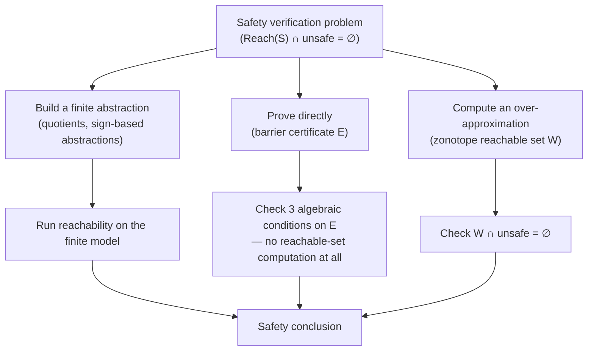

[[book-guidelines|↩ Back to guidelines]]

# Barrier Certificates and Reachable Set Computation

## Skipping the abstraction step

Everything else in Chapter 7 — quotients for timed automata, order-minimal
partitions, [[Sign-Based-Abstractions|sign-based abstractions]] built from
Lie derivatives — follows the same recipe: build a finite equivalence
relation $Q$ on the state space, prove the quotient $S_Q^L(\Sigma)$ is
bisimilar (or at least simulating) to the original infinite-state dynamics,
and then run the fixed-point verification/control machinery from
[[Fixed-Point-Methods-for-Verification]] on the *finite* result. That's a lot
of construction for what is often a very narrow question: "can the system
ever reach this one bad set $B$ from this one initial set $L$?" You don't
need a whole finite-state *model* of the system to answer a single yes/no
safety question — you need a *proof*.

This is exactly the move Lyapunov theory makes for stability (previewed here,
developed properly in [[Stability-Theory-for-Approximate-Abstraction|Chapter
10]]): instead of simulating every trajectory forward and checking none of
them diverges, you exhibit one scalar function that decreases along every
trajectory, and the decrease *alone* — without ever running a simulation —
certifies stability. A **barrier certificate** is the same trick aimed at
safety instead of stability: one scalar function $E$, checked algebraically,
certifies that no trajectory starting in $L$ can ever reach $B$, without
constructing any abstraction of the state space at all.

The section then pairs this "prove it directly" technique with a
complementary one: **zonotopes**, a set representation for *computing*
(over-approximating) reachable sets when a direct proof isn't what you want
— you want the actual set of states the system can reach. Same underlying
safety-verification problem from [[Verification-and-Control-Problems]], two
different tools: certify without computing (barrier certificates), or
compute without certifying anything beyond "this is a superset"
(zonotopes).

## Barrier certificates: a boundary trajectories cannot cross

### The geometric picture before the symbols

Recall the safety verification problem from [[Exact-System-Relationships]]:
given a system $S = S_Q^L(\Sigma)$ built from a dynamical system
$\Sigma = (\mathbb{R}^n, f)$ and a finite equivalence relation $Q$, and an
unsafe output set $B \subseteq Y$, decide whether
$\mathrm{Reach}(S_Q^L(\Sigma)) \cap \pi_Q(B) = \emptyset$ — no reachable state
ever lands in the (quotient-image of the) unsafe set.

Picture the state space $\mathbb{R}^n$ with two disjoint regions carved out:
the initial set $L$ and the (preimage of the) unsafe set
$\pi_Q^{-1}(B)$. Safety means no continuous trajectory of $\dot x = f(x)$
starting in $L$ ever reaches $\pi_Q^{-1}(B)$. Now suppose you could draw a
single smooth surface — a level set of some function $E$ — that sits
strictly between $L$ and $\pi_Q^{-1}(B)$, with $L$ entirely on the
"$E \le 0$" side and $\pi_Q^{-1}(B)$ entirely on the "$E > 0$" side. That
surface *alone* doesn't prove anything yet — a trajectory could still cross
it. What makes it a genuine barrier is one more condition: the vector field
$f$ never points from the $E \le 0$ side toward increasing $E$ *at* the
surface. If trajectories can only push $E$ downward or stay flat, and $L$
starts below zero while $B$'s preimage sits above zero, no trajectory from
$L$ can ever climb across $E = 0$ to reach $\pi_Q^{-1}(B)$. The whole
argument is topological: a continuous, non-increasing scalar quantity cannot
jump from negative to positive.

### The formal statement

The rate of change of $E$ along trajectories of $f$ is the **Lie derivative**
$(L_fE)(x) = \nabla E(x) \cdot f(x)$ — the same object used for sign-based
abstractions in §7.4, here doing a subtly different job: instead of
constraining which *signs* $E$ is allowed to transition between, it directly
bounds $E$'s rate of change everywhere.

> **Theorem 7.27.** Let $\Sigma = (\mathbb{R}^n, f)$ be a dynamical system,
> let $L \subseteq \mathbb{R}^n$ be a set of initial states, let
> $B \subseteq \mathbb{R}^n = Y$ be a set of unsafe outputs, and let $Q$ be a
> finite equivalence relation on $\mathbb{R}^n$ respecting $L$ and
> $\pi_Q^{-1}(B)$. If there exists a smooth function
> $E : \mathbb{R}^n \to \mathbb{R}$ satisfying:
> 1. $E(x) \le 0$ for $x \in L$;
> 2. $E(x) > 0$ for $x \in \pi_Q^{-1}(B)$;
> 3. $(L_fE)(x) \le 0$ for $x \in \mathbb{R}^n$;
>
> then $\mathrm{Reach}(S_Q^L(\Sigma)) \cap \pi_Q(B) = \emptyset$.

The proof formalizes exactly the picture above, by contradiction: suppose a
trajectory $\xi$ does escape, with $\xi(0) \in L$ and $\xi(\tau) \in
\pi_Q^{-1}(B)$ for some $\tau$. Then $E(\xi(0)) \le 0$ and $E(\xi(\tau)) > 0$,
so by smoothness of $E \circ \xi$ there must be some intermediate time
$\tau'$ where the composed function is strictly increasing,
$\left.\frac{d}{dt}E(\xi(t))\right|_{t=\tau'} > 0$. But that derivative *is*
$(L_fE)(\xi(\tau'))$, which condition 3 says must be $\le 0$ everywhere —
contradiction. Note condition 3 is global (holds on all of $\mathbb{R}^n$,
not just near the level set $E^{-1}(0)$): the theorem doesn't need to know
where the boundary actually sits relative to trajectories, it only needs $E$
to never be pushed upward anywhere, which is what makes the "climb across
zero" argument airtight without any case analysis on trajectory geometry.

A function $E$ satisfying these three conditions is called a **barrier
certificate**, because the set $E^{-1}(0)$ literally cannot be crossed by
solutions of $\Sigma$ — it separates $L$ from $\pi_Q^{-1}(B)$ the way a wall
separates two rooms, except the "wall" is a level set of a scalar function
rather than a physical boundary you had to construct piece by piece.

Contrast this with [[Sign-Based-Abstractions|sign-based abstractions]]: there,
you build a *whole abstraction* $S_P^L(\Sigma)$ out of a collection of
sign-indicator functions and their closure under Lie-derivative saturation,
and then you'd still need to run reachability *on* that abstraction to answer
a safety question. Here, one function $E$ answers the safety question
directly — no abstraction, no reachability computation on a symbolic model,
just three algebraic inequalities to check.

### Where $E$ comes from: sum-of-squares as a search procedure

Theorem 7.27 tells you what $E$ must satisfy but says nothing about how to
find it — this is the real engineering content of the section. For general
smooth $f$ and $E$, checking $E(x) \le 0$ on an unbounded region or
$(L_fE)(x) \le 0$ everywhere is itself an intractable universal-quantification
problem. But when $f$ is a **polynomial vector field** and you restrict the
search to *polynomial* $E$, all three conditions become polynomial
non-negativity constraints over $\mathbb{R}^n$ (or over semialgebraic
subsets like $L$ and $\pi_Q^{-1}(B)$, when those are themselves described by
polynomial inequalities).

Polynomial non-negativity is still NP-hard to decide exactly, but it has a
tractable *sufficient* certificate: a polynomial $p$ is non-negative if it
can be written as a **sum of squares (SOS)**, $p(x) = \sum_i q_i(x)^2$ for
some polynomials $q_i$. Whether a given polynomial (or a polynomial with free
coefficients) admits an SOS decomposition is checkable via **semidefinite
programming** — a convex optimization problem, solvable in polynomial time to
any desired precision. So the search for a barrier certificate becomes:
parametrize $E$ as a polynomial of some fixed degree with unknown
coefficients, then pose "does there exist an assignment of those
coefficients making $-E$ SOS on $L$'s complement-side condition, $E$ SOS on
$\pi_Q^{-1}(B)$'s side, and $-L_fE$ SOS everywhere" as one semidefinite
feasibility problem. This is precisely why the book calls barrier
certificates "a very appealing approach": the *existence proof* (Theorem
7.27) and the *search procedure* (SOS/SDP) fit together as a convex
relaxation of an otherwise intractable universal-quantifier problem — the
same pattern that recurs constantly in program verification when a Hoare
invariant or a ranking function is searched for via a convex template rather
than guessed by hand.

Example 7.28 in the book makes this concrete for a stable linear system: a
natural template for $E$ when the dynamics are already stable is a
Lyapunov-like quadratic form,
$$E(x) = 7x_1^2 - 6x_1x_2 + 28x_2^2 - 320,$$
whose zero level set is an ellipse. Checked directly, this $E$ satisfies all
three conditions of Theorem 7.27 for the system's $L$ and $B$, and the
ellipse visibly separates the (light) initial region from the (dark) unsafe
region in the book's Figure 7.18 — geometrically exactly the "wall" picture
from above, now realized as a specific quadric.

### Grounding: a toy SOS-style barrier search

The following sketch shows the shape of the search, not a production SOS
solver (that needs a real SDP backend — e.g. `cvxpy` + a solver, or `SumOfSquares.jl`).
It fixes a quadratic template $E(x) = a x_1^2 + b x_1 x_2 + c x_2^2 - d$ for a
linear system $\dot x = Ax$, and checks Theorem 7.27's three conditions by
brute-force sampling — enough to see *why* the SOS/SDP formulation is the
principled version of this same check, replacing "sample many points" with
"prove non-negativity everywhere via one convex program":

```python
import numpy as np

# Stable linear dynamics: xdot = A x
A = np.array([[-0.5, -1.0],
              [ 1.0, -0.5]])

def E(x, a, b, c, d):
    x1, x2 = x
    return a * x1**2 + b * x1 * x2 + c * x2**2 - d

def LfE(x, a, b, c, d):
    # Lie derivative: grad(E) . f(x), f(x) = A x
    x1, x2 = x
    grad = np.array([2*a*x1 + b*x2, b*x1 + 2*c*x2])
    f = A @ x
    return grad @ f

def check_barrier(a, b, c, d, L_samples, B_samples, domain_samples):
    # Condition 1: E <= 0 on samples of L
    if not all(E(x, a, b, c, d) <= 0 for x in L_samples):
        return False, "condition 1 (E<=0 on L) violated"
    # Condition 2: E > 0 on samples of B
    if not all(E(x, a, b, c, d) > 0 for x in B_samples):
        return False, "condition 2 (E>0 on B) violated"
    # Condition 3: Lf(E) <= 0 on samples of the whole domain
    if not all(LfE(x, a, b, c, d) <= 1e-9 for x in domain_samples):
        return False, "condition 3 (LfE<=0) violated"
    return True, "candidate survives the sampled check"

# A stable quadratic template centered at the origin often works for
# stable linear dynamics -- this is the discrete analogue of the SOS
# search: instead of sampling, a real solver proves the inequalities
# hold on the *continuum*, not just at sampled points.
rng = np.random.default_rng(0)
domain = [rng.uniform(-6, 6, 2) for _ in range(2000)]
L_samples = [rng.uniform(-1, 1, 2) for _ in range(200)]
B_samples = [np.array([x1, x2]) for x1 in np.linspace(-6, 6, 20)
             for x2 in (rng.uniform(4, 6), rng.uniform(-6, -4))]

ok, msg = check_barrier(a=7, b=-6, c=28, d=20, L_samples=L_samples,
                         B_samples=B_samples, domain_samples=domain)
print(ok, msg)
```

The point of showing this in code is the gap it makes visible: sampling can
only ever falsify a candidate, never certify one (you'd need to check
uncountably many points). That gap is exactly what SOS decomposition closes
— it turns "true at every sampled point" into "provably true everywhere,"
which is what a semidefinite program can certify in one shot.

## Zonotopes: representing reachable sets, not proving safety

### A different problem, complementary tool

Barrier certificates answer "is it safe?" with a proof and never compute the
reachable set itself. Sometimes you want the reachable set itself — to plot
it, to feed it into a downstream control-synthesis step (the book flags this
use explicitly: reachable-set computation for symbolic models of *control*
systems is used again in Chapter 11), or because no polynomial barrier
certificate of low-enough degree was found and you need a fallback. §7.6
develops exactly this: compute (an over-approximation of) $\mathrm{Reach}$
directly, then check $W \cap B = \emptyset$ for the over-approximation $W$ —
sufficient for safety exactly as Proposition 7.21's soundness argument was
for sign-based abstractions, just via a geometric object instead of a
symbolic relation.

The technique here is restricted to **linear** dynamical systems,
$\Sigma = (\mathbb{R}^n, f)$ with $f(x) = Ax$ — this restriction is what
makes the whole construction closed-form and efficient rather than requiring
general-purpose set integration.

### Why a zonotope specifically

> **Definition 7.29 (Zonotope).** A zonotope $Z$ is a set $Z \subseteq
> \mathbb{R}^n$ described by
> $$Z = \left\{ x \in \mathbb{R}^n \;\middle|\; x = c + \sum_{i=1}^k \lambda_i v_i,\ -1 \le \lambda_i \le 1 \right\}$$
> where $c, v_1, \dots, v_k \in \mathbb{R}^n$.

Written $Z = (c, \langle v_1, \dots, v_k \rangle)$: $c$ is the center, and
each **generator** $v_i$ contributes a segment $[-v_i, v_i]$ that gets
Minkowski-summed in. Geometrically it's the image of a $k$-dimensional
hypercube $[-1,1]^k$ under the affine map $\lambda \mapsto c + V\lambda$
(columns of $V$ the $v_i$'s) — equivalently, a (possibly degenerate,
possibly higher-dimensional-generator-count-than-$n$) zonohedron: a
centrally symmetric convex polytope built by summing line segments.

The reason this representation is the right one *specifically* for linear
reachability, spelled out in Proposition 7.30, is closure:

> **Proposition 7.30.** For zonotopes $Z_a = (c_a, \langle v_{a1}, \dots,
> v_{ak} \rangle)$, $Z_b = (c_b, \langle v_{b1}, \dots, v_{bl} \rangle)$ and a
> linear map $g(x) = Gx$:
> - $Z_a + Z_b = (c_a + c_b, \langle v_{a1}, \dots, v_{ak}, v_{b1}, \dots, v_{bl} \rangle)$ (Minkowski sum);
> - $g(Z_a) = (Gc_a, \langle Gv_{a1}, \dots, Gv_{ak} \rangle)$ (linear image).

Both operations are *free* in the representation: no vertex enumeration, no
convex-hull recomputation, just matrix-vector products on the generators.
Since the two operations any linear reachability computation ever needs are
"apply $e^{At}$" (a linear map) and "combine an over-approximation error"
(a Minkowski sum with an error cube), zonotopes are closed under exactly the
operations the algorithm performs — this is the same representation-matches-
operations principle that motivates choosing an abstract domain in program
analysis: pick the domain whose closure properties line up with what the
transfer function actually needs to do.

### Building the one-step over-approximation

Let $R_\tau(Z) = \{x \mid x = \xi(\tau) \wedge \xi(0) \in Z\}$ be the states
reached at exactly time $\tau$, and $R_{[\tau_1,\tau_2]}(Z) =
\bigcup_{\tau \in [\tau_1,\tau_2]} R_\tau(Z)$ the states reached over an
interval. For a zonotope $Z = (c, \langle v_1, \dots, v_k\rangle)$ under
linear flow $\xi(t) = e^{At}x$, computing $R_\tau(Z)$ exactly is immediate
from Proposition 7.30's second bullet:
$$R_\tau(Z) = e^{A\tau}(Z) = \left(e^{A\tau}c, \langle e^{A\tau}v_1, \dots, e^{A\tau}v_k \rangle\right).$$

That's the *endpoint* at time $\tau$. The hard part is $R_{[0,\tau]}(Z)$ — all
the states visited *along the way*, which is not simply the segment between
$Z$ and $e^{A\tau}(Z)$, since trajectories curve. The construction proceeds
in two steps:

**Step 1 — a candidate containing both endpoints.** Build
$$Z_a = \left(\frac{c + e^{A\tau}c}{2}, \left\langle \frac{v_1 + e^{A\tau}v_1}{2}, \dots, \frac{v_k+e^{A\tau}v_k}{2}, \frac{c - e^{A\tau}c}{2}, \frac{v_1 - e^{A\tau}v_1}{2}, \dots, \frac{v_k - e^{A\tau}v_k}{2} \right\rangle\right).$$
This is a zonotope averaging $Z$ and $e^{A\tau}(Z)$ as center with both the
"sum" and "difference" directions as generators — a standard trick for
building a zonotope guaranteed to contain two given zonotopes' convex hull
(the difference-generators are exactly what's needed to reach back out to
either extreme). $Z_a$ contains both $Z$ and $e^{A\tau}(Z)$, but curved
trajectories can bulge *outside* the straight-line hull between them, so
$Z_a$ alone is not yet guaranteed to contain $R_{[0,\tau]}(Z)$.

**Step 2 — inflate by the curvature error.** Add a hypercube:
$$Z_b = Z_a + C_{\alpha_\tau}, \qquad C_{\alpha_\tau} = \left(0, \langle \alpha_\tau b_1, \dots, \alpha_\tau b_n\rangle\right)$$
where $b_i$ is the $i$-th standard basis vector, so $C_{\alpha_\tau}$ is the
axis-aligned cube of radius $\alpha_\tau$ centered at the origin.

> **Proposition 7.31.** Let $\Sigma = (\mathbb{R}^n, f)$, $f(x) = Ax$, and
> $Z \subseteq \mathbb{R}^n$ a zonotope. If
> $$\alpha_\tau = \left(e^{\|A\|_\infty \tau} - 1 - \tau\|A\|_\infty\right) \sup_{x \in Z} \|x\|_\infty$$
> then $R_{[0,\tau]}(Z) \subseteq Z_b$.

**Why this particular $\alpha_\tau$.** The proof approximates each true
trajectory $\xi(t) = e^{At}x$ by the straight-line interpolant $\hat\xi(t) =
(1 - t/\tau)x + (t/\tau)e^{A\tau}x$ between its two known endpoints. The
error $\|\xi(t) - \hat\xi(t)\|_\infty$ is bounded by expanding $e^{At}$ as a
power series and discarding the linear term (which the interpolant already
matches exactly), giving a tail sum bounded by
$e^{\|A\|_\infty \tau} - 1 - \|A\|_\infty \tau$ times $\|x\|_\infty$ — the
same expression appearing in $\alpha_\tau$, maximized over $Z$. The set of
all such interpolants, as $x$ ranges over $Z$ and $t$ over $[0,\tau]$, is
contained in $Z_a$ (by construction — that's what the averaging in Step 1
buys), and inflating $Z_a$ by a cube of radius equal to the worst-case
interpolation error absorbs the true trajectories' deviation from their
interpolants. So $\alpha_\tau$ isn't an arbitrary safety margin — it's the
exact second-order-and-beyond Taylor remainder of the matrix exponential,
turned into a box that swallows the curvature the linear interpolant misses.

### Chaining it into a time horizon

For a time horizon $T$ and step $\Delta$ with $T/\Delta = k \in \mathbb{N}$,
split
$$R_{[0,T]}(Z) = R_{[0,\Delta]}(Z) \cup R_{[\Delta,2\Delta]}(Z) \cup \dots \cup R_{[(k-1)\Delta, k\Delta]}(Z).$$
The first piece is over-approximated by the one-step $Z_b$ construction
above. For the rest, apply $e^{A\Delta}$ to both sides of
$R_{[0,\Delta]}(Z) = \bigcup_{t\in[0,\Delta]} e^{At}(Z)$: since $e^{A\Delta}$
commutes with the union and shifts every exponent by $\Delta$, this gives
$R_{[\Delta,2\Delta]}(Z) = e^{A\Delta}(R_{[0,\Delta]}(Z))$, hence
$R_{[0,\Delta]}(Z) \subseteq Z_b \Rightarrow R_{[\Delta,2\Delta]}(Z) \subseteq
e^{A\Delta}(Z_b)$ — no new $\alpha$ computation needed, just re-map the
*same* $Z_b$ forward. Iterating:
$$R_{[0,T]}(Z) \subseteq Z_b \cup e^{A\Delta}(Z_b) \cup e^{2A\Delta}(Z_b) \cup \dots \cup e^{k\Delta A}(Z_b).$$
All approximation error is introduced once, in building $Z_b$ from $\alpha_\Delta$,
and shrinks as $\Delta \to 0$ (since $\alpha_\tau \to 0$ faster than
linearly as $\tau \to 0$ — it's an $O(\tau^2)$ quantity by the Taylor
argument above) — so precision is a knob, exactly as in the space/time
quantization trade-offs that reappear for approximate abstractions later in
the book.

### Grounding: computing and plotting a zonotope reachable set

```python
import numpy as np

def zonotope_map(Z, G):
    """Apply linear map G to zonotope Z = (c, [v1,...,vk])."""
    c, vs = Z
    return G @ c, [G @ v for v in vs]

def zonotope_sum(Za, Zb):
    """Minkowski sum of two zonotopes."""
    ca, va = Za
    cb, vb = Zb
    return ca + cb, va + vb

def zonotope_vertices(Z):
    """Enumerate all 2^k sign combinations for plotting (k small only)."""
    c, vs = Z
    k = len(vs)
    pts = []
    for signs in np.ndindex(*([2] * k)):
        x = c.copy()
        for lam, v in zip(signs, vs):
            x = x + (1 if lam else -1) * v
        pts.append(x)
    return np.array(pts)

# Stable linear system xdot = A x
A = np.array([[-0.5, -1.0],
              [ 1.0, -0.5]])
tau = 0.3

# Initial zonotope: a small box around (5, 0)
Z0 = (np.array([5.0, 0.0]), [np.array([0.3, 0.0]), np.array([0.0, 0.3])])

from scipy.linalg import expm
E = expm(A * tau)

Z_end = zonotope_map(Z0, E)

# Step 1: Za, the sum/difference-generator zonotope containing both endpoints
c0, vs0 = Z0
c1, vs1 = Z_end
Za_c = (c0 + c1) / 2
Za_vs = [(v0 + v1) / 2 for v0, v1 in zip(vs0, vs1)] + \
        [(v0 - v1) / 2 for v0, v1 in zip(vs0, vs1)]
Za = (Za_c, Za_vs)

# Step 2: inflate by alpha_tau (Proposition 7.31)
A_inf_norm = np.max(np.sum(np.abs(A), axis=1))          # ||A||_inf
sup_norm_Z0 = max(np.max(np.abs(c0 + sum(s * v for s, v in zip(signs, vs0))))
                   for signs in [(1,1), (1,-1), (-1,1), (-1,-1)])
alpha_tau = (np.exp(A_inf_norm * tau) - 1 - tau * A_inf_norm) * sup_norm_Z0

n = 2
cube_gens = [alpha_tau * np.eye(n)[i] for i in range(n)]
C_alpha = (np.zeros(n), cube_gens)
Zb = zonotope_sum(Za, C_alpha)

print("Za center:", Za[0])
print("Zb center:", Zb[0], "  alpha_tau:", alpha_tau)
# Zb over-approximates R_[0,tau](Z0); plot zonotope_vertices(Zb) as a convex
# hull (matplotlib + scipy.spatial.ConvexHull) to reproduce Fig. 7.19/7.20.
```

This is a direct transcription of (7.15)/(7.16)/Proposition 7.31, not a
simplification — the only thing elided is the plotting step, which the book
does with a convex hull over the $2^k$ sign combinations of the generators
(fine for the small generator counts here; real implementations use
zonotope-specific vertex/support-function algorithms instead of exhaustive
enumeration once $k$ grows).

## Synthesis: two ways to discharge the same safety obligation



Barrier certificates and zonotope reachable sets both discharge the same
obligation from [[Verification-and-Control-Problems]] — $\mathrm{Reach}(S)
\cap B = \emptyset$ — but they sit at opposite ends of a spectrum from "prove
without computing" to "compute without proving anything extra." A barrier
certificate needs no reachable-set computation whatsoever: once $E$ is found,
checking the three conditions is a (convex, via SOS) algebraic question.
Zonotope reachability needs no candidate function to guess: it grinds out an
actual over-approximating set mechanically, at the cost of doing real
numerical work (matrix exponentials, generator bookkeeping) and losing
precision to $\alpha_\tau$ at every step. Neither needs the finite-state
bisimulation machinery of §7.1–7.4 at all — that's the point of this
section relative to the rest of Chapter 7: sometimes the safety question is
narrow enough that building $S_Q^L(\Sigma)$ as a full symbolic model is
overkill.

For the `static-analysis` and `sat-smt-csp` threads this book is tagged
against: the barrier-certificate/SOS pairing is the direct continuous-state
analogue of searching for a **Hoare invariant via a convex template** rather
than guessing it — Theorem 7.27's three conditions are exactly an inductive
invariant's shape (holds on entry $L$, excludes the bad states $B$, and is
preserved — here by $L_fE \le 0$ instead of a discrete transition relation),
and the SOS/semidefinite-programming search is a fully worked-out instance of
turning "does there exist an invariant of this template" into a convex
feasibility problem, which is precisely the machinery an automated
invariant-generation or refinement-type-inference engine would reach for
when a template-based search is preferable to enumerative or
counterexample-guided search. Zonotopes are the corresponding story for
reachability analysis / abstract interpretation: a domain chosen because its
closure properties (linear image, Minkowski sum) match the operations the
analysis needs, the same design principle behind choosing intervals,
octagons, or polyhedra as an abstract domain — zonotopes are, in effect, a
numerical abstract domain specialized for linear ODE reachability.

Both techniques also foreshadow **Chapter 10 and 14**
([[Stability-Theory-for-Approximate-Abstraction]]): the Lyapunov-like
quadratic $E$ used in Example 7.28 is not a coincidence — once exact
bisimilar abstractions stop existing (most nonlinear or non-order-minimal
systems), the book's whole strategy for *approximate* symbolic models
switches to Lyapunov functions playing exactly the role $E$ plays here:
a single scalar certificate, checked algebraically, standing in for an
exhaustive case analysis over trajectories.
