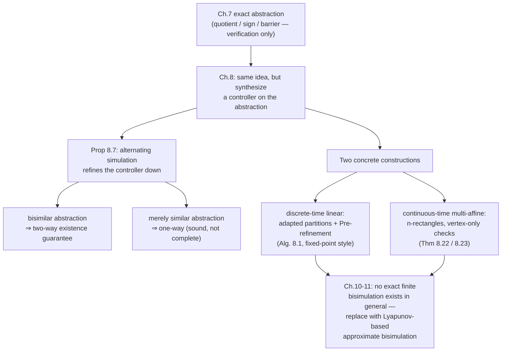

[[book-guidelines|↩ Back to guidelines]]

# Exact Symbolic Models for Control

## What changes when the abstraction has to steer, not just answer yes/no

Chapter 7 built finite quotients $S_Q^L(\Sigma)$ of infinite-state dynamical systems and used them to answer a single question: does the trajectory ever hit the unsafe set? That's a *verification* problem — the quotient just has to preserve enough information to make the answer transfer back from the finite model to the original system. A simulation relation from the abstraction to the original ($S_{\text{abs}} \preceq_S S$, so the abstraction's behaviors bound what the concrete system can do) is exactly the right tool: if the abstraction never enters "bad," neither does the concrete system, because everything the concrete system can do is matched by something the abstraction can do.

Control changes the object you're handing back. Instead of a bit ("safe"/"unsafe"), synthesis on the finite abstraction produces a *controller* — a strategy that picks inputs in response to observed state. You now want to port that strategy itself down to the infinite-state system, not just a Boolean fact about it. And here ordinary simulation quietly stops being enough, for a reason worth sitting with: simulation only makes a promise about the *plant's* moves — every move the original system can make, the abstraction can match. It says nothing about whether promises the abstraction made to a controller ("give me input $u$, I'll go to $x'$") can be honored by the original system reacting to the *same* nominal input. Controllers are built by playing a game against the abstraction's inputs; refining that controller to the real system requires knowing that whatever the abstraction promised the controller, the original system can still deliver, for any disturbance the environment throws at it in response. That back-and-forth structure — controller commits, environment reacts, promise must still hold — is precisely what topic 3/5's *alternating* simulation encodes, and ordinary simulation does not: alternating simulation quantifies over the controllable input first and only afterward requires a matching successor for *every* choice the environment/plant makes, exactly the order of commitment a real closed-loop controller experiences. This chapter is the payoff of building that machinery: it shows (a) precisely how a controller synthesized on an abstraction gets pushed down to the original system via alternating simulation, and (b) two concrete, checkable ways to build such abstraction/original pairs for control systems — one for discrete-time linear systems, one for continuous-time multi-affine systems on rectangles.

## Control systems as systems

### Discrete-time

A discrete-time control system is just a state-update map with an input slot:

$$\Sigma = (\mathbb{R}^n, \mathbb{R}^m, f), \qquad f: \mathbb{R}^n\times\mathbb{R}^m \to \mathbb{R}^n \text{ smooth.}$$

Given an equivalence relation $Q$ on $\mathbb{R}^n$, the associated *system* $S_Q(\Sigma)$ (Definition 8.2) packages this exactly like Chapter 1's systems: $X=\mathbb{R}^n$, $U=\mathbb{R}^m$, transition $x \xrightarrow{u} x'$ iff $x'=f(x,u)$, output space $X/Q$, output map $\pi_Q$. This is the object every later construction refines or abstracts.

**Controllability.** A system is controllable (Definition 8.3) if every ordered pair of states $x_0,x'$ is connected by *some* finite run of $S_Q(\Sigma)$. For linear systems, $f(x,u)=Ax+Bu$ (written $\Sigma=(\mathbb{R}^n,\mathbb{R}^m,A,B)$), this abstract reachability condition collapses to a rank test:

> **Theorem 8.4.** $\Sigma=(\mathbb{R}^n,\mathbb{R}^m,A,B)$ is controllable iff $\operatorname{rank}\mathcal{C}=n$, where $\mathcal{C} = \big[\,B \mid AB \mid A^2B \mid \cdots \mid A^{n-1}B\,]$ is the *controllability matrix*.

Why this is the right test, intuitively: $B$ gives you the directions you can move in one step, $AB$ the directions reachable after the state has been pushed once more through $A$, and so on. $\mathcal{C}$'s columns span every direction reachable by *some* sequence of inputs over $n$ steps (Cayley–Hamilton caps the useful powers at $n-1$); if that span is all of $\mathbb{R}^n$ you can steer anywhere, if not, some subspace is permanently unreachable from certain states no matter what input sequence you pick.

**What breaks without controllability.** Controllability doesn't just help — it is the exact condition under which Section 8.3's construction of "adapted" vectors is possible at all (more below): the vectors that define adapted sets have to span an $n$-dimensional space built out of $c_r^T A^l$ rows, and that span exists precisely when $\mathcal{C}$ has full rank. An uncontrollable system has directions no input can influence, and no amount of clever partitioning recovers information the dynamics themselves make unreachable.

### Continuous-time

A continuous-time control system $\Sigma=(\mathbb{R}^n,\mathcal{U},f)$ (Definition 8.5) replaces the single-step map with a differential equation $\dot\xi = f(\xi,\upsilon)$ driven by an *input curve* $\upsilon\in\mathcal{U}$ (a piecewise-continuous, essentially-bounded function of time — regular enough that solutions exist and are unique, "regular enough to be physically implementable by an actuator"). A *feedback law* $k:\mathbb{R}^n\to\mathbb{R}^m$ closes the loop by substituting $u=k(x)$, giving the closed-loop dynamical system $\dot\xi = f(\xi,k(\xi))$ — this is the object that topic 7's dynamical-systems machinery from Chapter 7 can then be applied to. Definition 8.6 builds the associated system $S_Q(\Sigma)$ the same way Chapter 7 built $S_Q^L(\Sigma)$ for uncontrolled dynamical systems, sampling transitions at output changes, with the same non-blocking self-loop convention for trajectories whose output never changes. The one structural difference from Chapter 7's dynamical systems: $X_0 = X$ for control systems — you generally don't get to pick a fixed initial condition, control problems are about *what can be forced from anywhere*.

## Controller refinement: the alternating-simulation handoff

Here is the chapter's central mechanism, and it's worth stating precisely because everything downstream depends on this one implication.

> **Proposition 8.7.** Let $S_a,S_b,S_c$ share an output set. If $S_c$ is feedback-composable with $S_a$ via alternating simulation relation ${}_cR_a$, and there is an alternating simulation relation ${}_aR_b$ from $S_a$ to $S_b$, then $S_c\times_{{}_cR_a}S_a$ is feedback-composable with $S_b$, via the relation
> $${}_{ca}R_b = \{((x_c,x_a),x_b) \mid (x_c,x_a)\in{}_cR_a \wedge (x_a,x_b)\in{}_aR_b\}.$$

In implication form: $S_c \preceq_{AS} S_a \wedge S_a \preceq_{AS} S_b \implies S_c\times_F S_a \preceq_{AS} S_b$. Read $S_a$ as the concrete (original, infinite-state) system and $S_b$ as its finite abstraction $S_{\text{abs}}$. The refinement recipe is then:

1. Synthesize $S_{\text{cont}}$ on the abstraction — it wins a simulation game against $S_{\text{abs}}$ and specification $S_{\text{spec}}$, so $S_{\text{cont}} \preceq_{AS} S_{\text{abs}}$ and $S_{\text{cont}}\times_F S_{\text{abs}} \preceq_S S_{\text{spec}}$.
2. Because the abstraction relation runs the *other* direction, $S_{\text{abs}} \preceq_{AS} S$ (the abstraction is alternatingly simulated by — i.e., is a sound over-approximation of what the controller can rely on from — the original system), Proposition 8.7 combines these to give $S_{\text{cont}}\times_F S_{\text{abs}} \preceq_{AS} S$: the controller-abstraction pair is feedback-composable with the *original* system.
3. Define $S_{\text{cont}}' = S_{\text{cont}}\times_F S_{\text{abs}}$ and use it to control $S$ directly. A short chain of simulation-preserving facts (composition monotonicity, Proposition 6.3, plus step 2) gives $S_{\text{cont}}'\times_G S \preceq_S S_{\text{cont}}\times_F S_{\text{abs}} \preceq_S S_{\text{spec}}$ — the refined controller enforces the *same* specification on the concrete system.

**One-way vs. two-way.** This only gives existence in one direction: if no controller exists for $S_{\text{abs}}$, you cannot conclude none exists for $S$ — the abstraction may have thrown away exactly the freedom a real controller for $S$ would have used. But if the abstraction relation is upgraded from alternating *simulation* to alternating *bisimulation* ($S_{\text{abs}} \cong_{AS} S$), the argument runs in both directions: a controller enforcing the spec on $S$ can, by the same Proposition 8.7, be pushed back up to a controller for $S_{\text{abs}}$. So **a controller exists for $S_{\text{abs}}$ iff a controller exists for $S$** — the finite abstraction becomes a *complete* proxy for the synthesis problem, not merely a sound one. This is the two-way guarantee topic 5's alternating-bisimulation apparatus was built to deliver, and it's the reason the rest of this chapter works so hard to construct bisimilar (not just similar) abstractions.

**Grounding (Lean).** The two-way guarantee is a genuinely appealing target for a Lean proof, because it's a small, clean piece of propositional reasoning once the alternating-(bi)simulation relations are in hand — exactly the shape of "trusted kernel fact" you'd want your compiler's refinement checker to reduce to:

```lean
-- Skeletal statement; `AltSim`/`AltBisim` would be the alternating
-- (bi)simulation relations from Chapter 4/8, `FeedbackComposable`
-- the existence of a controller enforcing `spec` via feedback composition.

theorem controller_exists_iff_abs_bisimilar
    {Sa Sabs Sspec : System}
    (h : AltBisim Sabs Sa) :
    (∃ c, FeedbackComposable c Sabs ∧ Enforces c Sabs Sspec) ↔
    (∃ c, FeedbackComposable c Sa   ∧ Enforces c Sa   Sspec) := by
  constructor
  · rintro ⟨c, hcomp, henf⟩
    -- forward: refine c to `c ×_F Sabs`, apply Proposition 8.7
    -- using h.toAltSim : AltSim Sabs Sa
    exact refine_controller c hcomp henf h.toAltSim
  · rintro ⟨c, hcomp, henf⟩
    -- backward: same proposition, applied to h.symm.toAltSim : AltSim Sa Sabs
    exact refine_controller c hcomp henf h.symm.toAltSim
```

The two branches are literally the same lemma (`refine_controller`, an encoding of Proposition 8.7) invoked on the relation and its converse — which is exactly why alternating *bisimulation*, rather than a pair of unrelated simulations, is what buys the `iff` instead of just one `→`.

## Discrete-time linear control systems: adapted partitions

Chapter 7 got finite bisimilar quotients for *uncontrolled* linear dynamical systems by constraining eigenvalues. Section 8.3 takes the complementary route for *controlled* linear systems: leave the dynamics $\Sigma=(\mathbb{R}^n,\mathbb{R}^m,A,B)$ alone, and constrain the *partition* instead, so that it interacts well with $A$ and $B$.

### Adapted sets

> **Definition 8.8.** Choose $c_1,\dots,c_m \in \mathbb{R}^n$ (one per input channel) and integers $\nu_1,\dots,\nu_m$ satisfying, with $b_r$ the $r$-th column of $B$:
> 1. $c_r^TB=0,\ c_r^TAB=0,\dots,c_r^TA^{\nu_r-2}b_r=0,\ c_r^TA^{\nu_r-1}b_r\neq0$ ($r=1,\dots,m$);
> 2. the vectors $c_1^TA^{\nu_1}B,\dots,c_m^TA^{\nu_m}B$ are linearly independent.
>
> The *adapted* sets to $\Sigma$ are finite unions of sets cut out by conjunctions of half-space conditions $f\sim0$, $f=\pm c_r^TA^lx\pm e$, $l\in\{0,\dots,\nu_r-1\}$, $\sim\in\{=,>\}$.

Read this operationally rather than as raw algebra: $\nu_r$ is "how many steps of the dynamics you have to look ahead before input channel $r$ first has any effect" along direction $c_r$ — condition 1 says $c_r^T A^l b_r=0$ for every shorter lookahead and nonzero exactly at $\nu_r-1$ steps. Condition 2 makes sure the $m$ input channels, at their respective lookaheads, don't collide — each can independently move the corresponding coordinate $c_r^Tx$. Adapted sets are then unions of level-and-sign conditions on the functionals $c_r^TA^lx$ for $l<\nu_r$ — i.e., regions cut out by hyperplanes that are "aligned" with how the input can actually push the state, rather than arbitrary hyperplanes that might slice across a single input's reachable directions.

Adapted sets always exist trivially (take $\nu_r=1$, $c_r=b_r$), but interesting choices come from a controllability-matrix construction: sweep $\mathcal{C}=[B|AB|\cdots|A^{n-1}B]$ left to right, keep the first $n$ linearly independent columns as $\tilde{\mathcal C}$, invert it, and read the $c_r$'s off specific rows of $\tilde{\mathcal C}^{-1}$ (Example 8.12 in the book works a full $4\times4$ numeric instance of this). This is exactly where Theorem 8.4's controllability matters concretely: $n$ independent columns of $\mathcal C$ exist iff $\Sigma$ is controllable.

### Theorem 8.10: adapted partitions give finite bisimilar quotients

> **Theorem 8.10.** For any finite partition $P$ of $\mathbb{R}^n$ adapted to a linear $\Sigma$, there is a finite-state system bisimilar to $S_Q(\Sigma)$, $Q$ the equivalence relation induced by $P$.

Proof sketch, because the mechanism recurs constantly in this book: change input coordinates $u=Lv$ so that the new $B'=BL$ makes each channel's lookahead condition (8.10), $c_r^TA^lB=0$ for $l<\nu_r-1$, hold automatically ($L$ is built from the matrix $D$ whose $i$-th row is $c_i^TA^{\nu_i-1}B$, invertible by condition 2). Collect *all* the linear functionals $g(x)=\pm c_r^TA^lx\pm e$ (for every $r$, every $l\le\nu_r-1$, every constant $e$ appearing in $P$'s defining half-spaces) — finitely many, since $P$ is a finite union of finitely many half-space conditions — and let $R$ relate $x,x'$ when every such $g$ agrees in sign at $x$ and $x'$. $R$ is finite (finitely many sign patterns), refines $P$'s equivalence relation (every $f$ defining $P$ is among the $g$'s), and — the algebraic heart of the proof — is a bisimulation: given $(x,x')\in R$ and a successor $x''=Ax+BLv$, choosing $v_i' = c_i^TA^{\nu_i}(x-x')+v_i$ produces a matching successor $x'''=Ax'+BLv'$ with $(x'',x''')\in R$, because for $l<\nu_r-1$ the $g$'s ignore $v$ entirely (by the lookahead-zero property) and for $l=\nu_r-1$ the correction term in $v_i'$ exactly cancels the $x$-vs-$x'$ discrepancy. Theorem 4.18 (quotienting by a bisimulation gives a bisimilar quotient system) finishes it.

**What breaks without "adapted."** An arbitrary finite partition has no reason to survive taking a $\mathrm{Pre}$-image: a one-step predecessor of a partition cell can be an arbitrarily-shaped region that straddles several other cells in a way no finite refinement resolves, because nothing ties the partition's boundaries to directions the input can actually move along. Being adapted guarantees the sign-pattern refinement of *finitely many* linear functionals is already closed under taking predecessors — that's what makes the construction terminate at a finite bisimulation instead of refining forever.

### The $\mathrm{Pre}$ operator and Algorithm 8.1

Theorem 8.10's $R$ is *a* bisimulation, not the coarsest (maximal) one — so the resulting quotient can have more states than necessary. Rather than run Chapter 5's general operator $G$ for maximal bisimulation between two *different* systems, Section 8.3 specializes to the fact that we want a bisimulation between $S_Q(\Sigma)$ *and itself* (self-bisimulation), using the one-step predecessor operator:

$$\mathrm{Pre}(W) = \{x\in X \mid x\xrightarrow{u}x' \text{ for some } u\in U,\ x'\in W\}. \tag{8.12}$$

Starting from partition $P$, refine any cell $P'$ that $\mathrm{Pre}(P)$ splits into a nonempty proper subset — i.e. whenever $\emptyset\neq P'\cap\mathrm{Pre}(P)\neq P'$ for some $P,P'\in P$ — by cutting $P'$ into $P_a=P'\cap\mathrm{Pre}(P)$ and $P_b = P'\setminus \mathrm{Pre}(P)$. Repeat until no cell needs splitting. This is exactly the shape of a **predicate-abstraction / CEGAR refinement loop**: a cell is only allowed to stay coarse if every point in it agrees on whether one input choice can reach every other cell — the moment two points in the same cell disagree about a one-step reachability question, the cell is split to remove the disagreement, mirroring how a CEGAR loop splits an abstract state exactly when a spurious counterexample reveals it conflates two concretely-distinguishable behaviors.

```
Input: Partition P and system S
Output: P'
P' := P
while ∃ P, P' in current partition s.t. ∅ ≠ P' ∩ Pre(P) ≠ P':
    Pa := P' ∩ Pre(P)
    Pb := P' \ Pre(P)
    P' := (P' \ {P'}) ∪ {Pa, Pb}
```
*(Algorithm 8.1, book notation.)*

Correctness is a specialization of the fixed-point machinery from Chapter 5 (topic 4): the loop invariant is "$P'\cap\mathrm{Pre}(P)\neq\emptyset \Rightarrow P'\subseteq \mathrm{Pre}(P)$ for all $P,P'$ in the current partition," and once that holds for *every* pair the partition is closed under $\mathrm{Pre}$, which is exactly the bisimulation condition read off Definition 4.13. Complexity is bounded, not just finite: the theorem's proof shows the number of equivalence classes in the resulting relation is at most $|P|^\nu \le |P|^n$, $\nu=\max_r\nu_r$ — the same kind of state-explosion bound familiar from partition-refinement bisimulation minimization (Paige–Tarjan-style algorithms), here specialized to a linear-algebraic setting.

**Worked instance (national income model, Example 8.11, condensed).** Take the controlled national-income model from Chapter 1, $A=\begin{psmallmatrix}\tfrac12&\tfrac12&\tfrac12\\-1&1&1\\0&0&0\end{psmallmatrix}$, $B=\begin{psmallmatrix}0\\0\\1\end{psmallmatrix}$, adapted vector $c_1=(1,0,0)^T$ ($\nu_1=2$). Goal: drive consumption from $10$ down to $2$ while keeping national income above $20$, phrased as reaching region $P_2$ from $P_4$ without passing through $P_1$ (regions cut by the thresholds on $c_1^Tx$ and $c_1^TAx$). Running Algorithm 8.1: $\mathrm{Pre}(P_1)=\mathbb{R}^3$ (since $c_1^TAB\neq0$, *some* input always drives the next $c_1^TAx$ below the threshold — the whole state space can reach $P_1$'s defining condition in one step), so $P_1$ doesn't get split by itself; but $\mathrm{Pre}(P_2)$ intersects $P_1$ non-trivially and not entirely, so $P_1$ splits into $P_{1a},P_{1b}$. After that split the partition is already closed under $\mathrm{Pre}$ — Figure 8.2's five-state graph shows $P_2$ is unreachable from $P_4$ without transiting $P_1$, so the safety objective is infeasible, readable directly off the finite bisimilar quotient.

**Grounding (Rust).** Algorithm 8.1 is a natural fit for Rust: cells as regions represented symbolically (here, as linear-inequality systems over $c_r^TA^lx$), $\mathrm{Pre}$ as a function computing the inequality system whose satisfying set is the predecessor region, and refinement as a worklist loop splitting cells on witnessed disagreement. A compact sketch, specialized to the single-input national-income instance (state $x=(c,i,g)$, functionals $\phi_0(x)=c_1^Tx$, $\phi_1(x)=c_1^TAx$, threshold intervals as cell membership predicates):

```rust
#[derive(Clone, Copy, Debug, PartialEq)]
enum Cmp { Lt(f64), Ge(f64) } // c1^T A x compared to a threshold

#[derive(Clone, Debug)]
struct Cell {
    id: usize,
    // conjunction of threshold conditions on phi0(x) = c1^T x
    // and phi1(x) = c1^T A x; represented abstractly as intervals.
    phi0: (f64, f64), // [lo, hi)
    phi1: (f64, f64),
}

/// Pre(cell) under x' = A x + B u, specialized: since c1^T A B != 0,
/// phi1(x') is freely steerable by u, so membership of x' in `cell`
/// constrains only phi1(x) via the *next* step's phi0, i.e. phi1(x)
/// itself (phi0(x') = phi1(x) exactly, since c1^T A x = phi1(x)).
fn pre_constrains_phi1(cell: &Cell) -> (f64, f64) {
    cell.phi0 // phi0(x') == phi1(x): predecessor constraint on phi1(x)
}

/// Refine `partition` until every cell is closed under one-step Pre:
/// no cell is split into a nonempty proper subset by any other cell's Pre-image.
fn refine(mut partition: Vec<Cell>) -> Vec<Cell> {
    loop {
        let mut split = None;
        'search: for (i, target) in partition.iter().enumerate() {
            let (plo, phi) = pre_constrains_phi1(target);
            for (j, candidate) in partition.iter().enumerate() {
                let (clo, chi) = candidate.phi1;
                // does [clo, chi) straddle the Pre-boundary [plo, phi)?
                let inside = clo.max(plo) < chi.min(phi);
                let outside = clo < plo || chi > phi;
                if i != j && inside && outside {
                    split = Some((j, plo.max(clo), phi.min(chi)));
                    break 'search;
                }
            }
        }
        match split {
            None => return partition,
            Some((j, lo, hi)) => {
                let c = partition.remove(j);
                let a = Cell { id: c.id, phi1: (lo, hi), ..c.clone() };
                let b_lo = if (c.phi1.0 - lo).abs() < 1e-9 { hi } else { c.phi1.0 };
                let b = Cell { id: partition.len() + 1000, phi1: (b_lo.min(c.phi1.0), c.phi1.1.max(hi)), ..c };
                partition.push(a);
                partition.push(b);
            }
        }
    }
}
```

The point of showing this in Rust rather than pseudocode: the loop's termination argument (finitely many cells, each split strictly shrinks some cell and the ambient space of achievable sign-patterns is finite) is exactly the argument that makes this safe to compile as a bounded-iteration fixed-point routine — no different in kind from a dataflow-analysis worklist algorithm over an abstract lattice, which is precisely the "specific thread" this chapter's construction is an instance of.

### The Mars-rover example: the full pipeline in one worked instance

The book's longest example (8.13) is worth walking through because it's the chapter's single illustration of *every* piece fitting together: an adapted-partition abstraction, a hand-built finite-state component, their composition, a string specification, controller synthesis by simulation game (Chapter 6/topic 5), and controller refinement back down (Proposition 8.7).

**The setup.** A Mars rover's camera is pointed by a friction-free rotational system $\ddot\theta=u$ ($\theta$ = angle from home position). Sampling at unit intervals with piecewise-constant input gives the discrete-time linear system $\theta(k{+}1)=\theta(k)+\omega(k)+\tfrac12u(k)$, $\omega(k{+}1)=\omega(k)+u(k)$. A shared heater resource is modeled as a small finite-state system $S_{\text{heat}}$: a request to turn the heater off (input `off`) at state $x_{\text{heat}1}$ may or may not be honored immediately, but is *guaranteed* honored on a second consecutive request — a minimal but realistic model of a shared-resource protocol with request latency.

**Requirements:** the heater must be off while a picture is taken; it can be switched off only once per picture, and must go back on right after; the camera must reach the picture position and return home within 5 time steps.

**Building the abstraction.** With $c_1^T=(1,-\tfrac12)$ (satisfying $c_1^Tb_1=0$), the adapted partition starts as three coarse regions — a neighborhood of home ($P_1$), a neighborhood of the desired picture angle ($P_2$), and everything else ($P_3$) — then Algorithm 8.1 refines it to five cells $P_1,\dots,P_5$ once one-step reachability distinctions (e.g. "about to enter $P_1$ next step" vs. "not") get resolved. The resulting quotient $S_{\text{abs}}$, relabeled so inputs become destination states (a standard determinism-preserving transformation from Chapter 4), is bisimilar — in fact *alternatingly* bisimilar, since the underlying system is deterministic — to $S_Q(\Sigma)$.

**Composing and specifying.** $S_{\text{abs}}\times S_{\text{heat}}$ (trivial interconnection) models camera and heater running concurrently, and the alternating bisimulation relation lifts to the product (pairing the camera relation with heater-state equality) — an instance of how relations compose across Chapter 1's product construction. The specification is a finite set of output strings over $(Y_{\text{abs}}\times Y_{\text{heat}})^\omega$: all behaviors that start and end at `(home, Hon)`, return within 5 steps, visit `(pointed, Hoff)` exactly once along the way, and never toggle the heater off twice.

**Synthesizing and refining.** Solving a simulation game (Chapter 6 machinery) between $S_{\text{abs}}\times S_{\text{heat}}$ and this specification yields a 10-state finite controller $S_{\text{cont}}$ with an explicit alternating simulation relation to $S_{\text{abs}}\times S_{\text{heat}}$. Proposition 8.7 then refines $S_{\text{cont}}$ to $S_{\text{cont}}' = S_{\text{cont}}\times_F(S_{\text{abs}}\times S_{\text{heat}})$, a controller acting on the *infinite-state* $S_Q(\Sigma)\times S_{\text{heat}}$. Concretely this means: each abstract transition the finite controller relies on (e.g. "go from region $P_5$ to $P_4$") is replaced by the *set* of real-valued inputs $u$ that actually realize that transition, computed by writing the target-region membership condition as an affine inequality in $u$ and solving for it — e.g. the transition into the "desired" region works out to $u\in U_{\text{des}}(\theta,\omega) = \big(-\theta-\tfrac32\omega+\theta_{\text{des}}-\varepsilon,\ -\theta-\tfrac32\omega+\theta_{\text{des}}+\varepsilon\big)$. The refined controller is genuinely hybrid: it reads both a continuous state (to decide the real-valued input range for the camera) and a discrete state (to decide when the heater's second `off` request has actually landed).

**Why this example earns its length in the book (and here):** it's the one place the chapter shows the entire pipeline — abstract, synthesize on the abstraction, refine back — running end to end on a system that is itself a genuine hybrid controller (continuous output to the camera, discrete output to the heater), which is exactly the class of controller the whole book is building toward.

## Continuous-time multi-affine systems on rectangles

Section 8.4 develops an entirely different route to a finite abstraction — not by quotienting via sign-refinement of a partition, but by choosing the *shape* of the abstraction cells (axis-aligned rectangles) to match a special algebraic property of the vector field (multi-affinity), so that continuous safety/reachability conditions over an entire cell reduce to checking finitely many points.

### Affine and multi-affine functions

$f:\mathbb{R}\to\mathbb{R}$ is *affine* (Definition 8.14) if it commutes with affine combinations: $f(\alpha x+\beta y)=\alpha f(x)+\beta f(y)$ whenever $\alpha+\beta=1$. A point in an interval $]a,b[$ is the affine combination $(1-\lambda)a+\lambda b$ of its endpoints, $\lambda=(x-a)/(b-a)$; an affine $f$ is therefore fully determined on $]a,b[$ by its two endpoint values.

*Multi-affine* generalizes this to several variables — but crucially, not by requiring $f$ itself to be affine (that would just be a hyperplane), only by requiring $f$ to be affine **separately in each coordinate when the others are held fixed** (Definition 8.16: $f_{x_i}^{\hat{c}}:\mathbb{R}\to\mathbb{R}$, the function of $x_i$ obtained by freezing every other coordinate, is affine, for each $i$). This is strictly weaker than affine — e.g. $f(x_1,x_2)=x_1x_2$ is multi-affine but not affine — and it is exactly the property that makes the following work:

> **Proposition 8.17.** For an $n$-rectangle $E=\prod_i\,]a_i,b_i[$ with vertex set $V(E)=\{x\mid x_i\in\{a_i,b_i\}\}$, and multi-affine $f$: for any $x\in E$, $f(x)=\sum_{v\in V(E)}\lambda_v f(v)$ for some $\lambda_v\ge0$ summing to 1.

The derivation (worked explicitly for $n=2$ in the source, equations 8.37–8.41) is a repeated one-variable affine-combination argument: write $x$ as an affine combination along coordinate 1 of two auxiliary points $z,w$ (themselves affine combinations along coordinate 2 of pairs of vertices), push $f$ through using affine-in-coordinate-1-ness, then affine-in-coordinate-2-ness on the two resulting terms. Iterating this over all $n$ coordinates is exactly a multilinear interpolation — the value of $f$ anywhere inside the box is a convex combination of its values at the $2^n$ corners, with weights given by the standard multilinear ("trilinear," in 3D graphics terms) interpolation formula.

**Why this matters for control, concretely:** *every value $f$ takes inside $E$ is a convex combination of its vertex values.* If you want to guarantee $f(x)$ satisfies a sign condition ($<0$, say) for every $x\in E$, checking it at the (finitely many, $2^n$) vertices is not just sufficient by luck — a strict inequality that holds at every corner is preserved under any convex combination of the corners' values, so it automatically holds everywhere in between. This is the mechanism, and it is the entire reason the rest of the section can reduce continuous safety/reachability questions to a finite check. (Proposition 8.18 supplies the converse fact used implicitly throughout: *any* function defined only on $V(E)$ extends to a *unique* multi-affine function on all of $E$, via the explicit interpolation formula (8.42) — so designing "what should happen at the corners" and getting a well-defined feedback law on the whole box are the same problem.)

### $n$-rectangles, facets, and the two control problems

A multi-affine control system is $\Sigma=(\mathbb{R}^n,\mathcal{U},g,B)$ with $f(x,u)=g(x)+Bu$, $g$ multi-affine (Definition 8.19); a state-dependent $B(x)$ can always be folded back into this form by extending the state with $u$ as in (8.43), a standard trick for eliminating bilinear input dependence.

For an $n$-rectangle $E$, each *facet* $F$ (an $(n-1)$-dimensional face, $x_i=a_i$ or $x_i=b_i$) has an outward normal $\eta_F$ (e.g. $\eta_F=-e_i$ for the $x_i=a_i$ facet), and $\mathcal{F}(v)$ denotes the facets containing vertex $v$. Two control problems get posed:

- **Rectangular invariant (Problem 8.20):** does some multi-affine feedback $k$ make $E$ forward-invariant — every trajectory of the closed loop that starts in $E$ stays in $E$ forever?
- **Control to facet (Problem 8.21):** does some multi-affine feedback make every trajectory starting in $E$ eventually exit cleanly through one *designated* facet $F$, without touching any other facet first?

Both admit vertex-only conditions:

> **Theorem 8.22 (rectangular invariant).** Sufficient that, for every $v\in V(E)$, $U_E(v)=\bigcap_{F\in\mathcal F(v)}\{u\mid \eta_F^T(g(v)+Bu)<0\}$ is nonempty.
>
> **Theorem 8.23 (control to facet).** Sufficient that, for every $v$ *not* on $F$, the same "point inward on every incident facet" condition holds, and for every $v$ *on* $F$, the condition additionally requires $\eta_F^T(g(v)+Bu)>0$ (point *outward* through $F$ specifically).

Why vertices suffice, mechanically: pick any $u_v\in U_E(v)$ at each vertex (nonemptiness is what's being checked — a linear-inequality feasibility problem, off-the-shelf LP territory), interpolate them into a single multi-affine feedback $k$ via Proposition 8.18's formula, and consider $f(x)=g(x)+Bk(x)$ — itself multi-affine, since $g$, $B$, and $k$ combine multi-affine pieces. The scalar $\eta_F^Tf$ is then multi-affine too, so Proposition 8.17 says: if $\eta_F^Tf(v)<0$ at every vertex of a facet, it's $<0$ *everywhere on that facet* (convex combination of negative numbers), and by continuity in a whole neighborhood — meaning $\frac{d}{dt}\eta_F^T\xi\big|_{t=\tau}<0$ whenever the trajectory nears that facet, which is exactly "pointing back inward," ruling out ever leaving through it. For control-to-facet, the same argument run on the *designated* facet with the inequality flipped gives a strictly positive outward drift rate $\delta>0$ bounded below (again by compactness plus vertex-checking, this time by taking a *minimum* over $E$ rather than a sign), which integrates to a finite exit time.

**Vertex-based feedback synthesis, restated as a recipe:** (1) enumerate $V(E)$ ($2^n$ points); (2) at each vertex, check feasibility of a linear-inequality system in $u$ (LP feasibility, or just algebra for small $m$); (3) pick a witness $u_v$ at each feasible vertex; (4) interpolate via (8.42) to get the closed-form multi-affine feedback law. This is a genuinely different computational texture from the linear-partition case: no fixed-point iteration is needed at all, because multi-affinity front-loads all the work into checking $2^n$ vertex conditions once.

**Worked instance (Lotka–Volterra, Example 8.24, condensed).** For $\dot\xi_1=-\xi_1+\xi_1\xi_2-\upsilon$, $\dot\xi_2=\xi_2-\xi_1\xi_2$ (predator/prey with a pesticide input $\upsilon$ suppressing predators), the control-to-facet problem on $E=\,]5,6[\times]2,6[$ exiting through the facet $[5,6]\times\{2\}$ reduces to four scalar inequalities, one per vertex — e.g. $U_E(5,6)=\{u\ge0 \mid u<25\}$, $U_E(6,6)=\{u\ge0\mid u>30\}$ — all nonempty, so picking witnesses and interpolating via (8.42) gives the explicit closed-form feedback $k(x_1,x_2) = -\tfrac{115}2+10x_1-\tfrac{35}4x_2+\tfrac52x_1x_2$, guaranteed (not just simulated) to drive every trajectory starting in $E$ out through the prey-reduction facet.

### From rectangles to a finite-state system

A collection $\mathcal E$ of $n$-rectangles isn't itself a partition (rectangles needn't tile space, and generally don't), but under a *completion* condition ($\exists$ a partition $P$ whose cells' interiors match $\mathcal E$'s rectangles' interiors one-for-one) it induces one. Definition 8.25 then builds a finite-state system $S_{\mathcal E}(\Sigma)$ directly on the rectangles as states: a self-loop at $E$ when the rectangular-invariant problem is solvable for $E$, and a transition $E\to E'$ across a shared facet $F$ when the control-to-facet problem is solvable for $(E,F)$.

> **Theorem 8.26.** $R=\{(E,x)\mid x\in E\}$ is a simulation relation from $S_{\mathcal E}(\Sigma)$ to $S_Q(\Sigma)$ (and, since both are deterministic, an alternating one) — so $S_{\mathcal E}(\Sigma)\preceq_S S_Q(\Sigma)$, and controllers synthesized on $S_{\mathcal E}(\Sigma)$ refine to $S_Q(\Sigma)$ by exactly the Proposition 8.7 machinery from earlier in the chapter.

The book explicitly flags the kinship with Chapter 7's sign-based abstractions: condition (8.44) *is* a Lie-derivative sign condition, $\operatorname{sign}(L_{g(x)+Bu}\,p)=-1$ for $p(x)=\eta_F^Tx$ — the novelty here is purely computational, that multi-affinity plus rectangular geometry lets the sign check collapse from "everywhere on the facet" to "at finitely many vertices."

## Where this leads



This chapter is the control-theoretic mirror of Chapter 7: same overall shape (build a finite quotient, transfer a decision problem across it), but the decision problem is now existence-of-a-strategy rather than a yes/no fact, which is exactly why it needs topic 5's alternating-simulation refinement machinery rather than ordinary simulation, and why it reuses topic 4's fixed-point iteration style for the $\mathrm{Pre}$-refinement loop (Algorithm 8.1 is, structurally, the same "iterate a monotone operator to a fixed point on a finite lattice" pattern as the operators $F$, $G$, $F_W$, $G_W$ from Chapters 5–6). Both constructions here are *exact* — they work only because the systems have special structure (linearity plus an adapted partition; multi-affinity plus a rectangular partition) that makes a finite bisimulation exist at all. Chapters 10–11 exist precisely because most systems don't have that structure: they replace "finite partition closed under $\mathrm{Pre}$" and "vertex-only sign checks" with Lyapunov-function-based *approximate* bisimulation, trading exactness for applicability to any sufficiently stable system.

For the standing compiler/verifier project, two things in this chapter are worth carrying forward under the `static-analysis` and `sat-smt-csp` focus areas: the $\mathrm{Pre}$-operator partition-refinement loop (Algorithm 8.1) is a textbook instance of the abstract-interpretation/CEGAR refinement pattern — split an abstract cell exactly when a one-step reachability query distinguishes two of its concrete points, iterate to a fixed point on a finite lattice — which is the same algorithmic skeleton a predicate-abstraction-based invariant generator would use; and the vertex-based feasibility checks in Theorems 8.22/8.23 (LP feasibility over a box, exploiting a structural property — multi-affinity — to avoid checking an infinite domain) are a clean, small-scale illustration of exactly the "exploit domain structure to reduce a continuous/infinite check to finitely many concrete ones" move that a CSP/constraint kernel handling non-linear domains would want to generalize.
