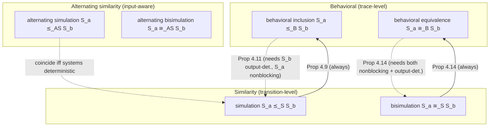
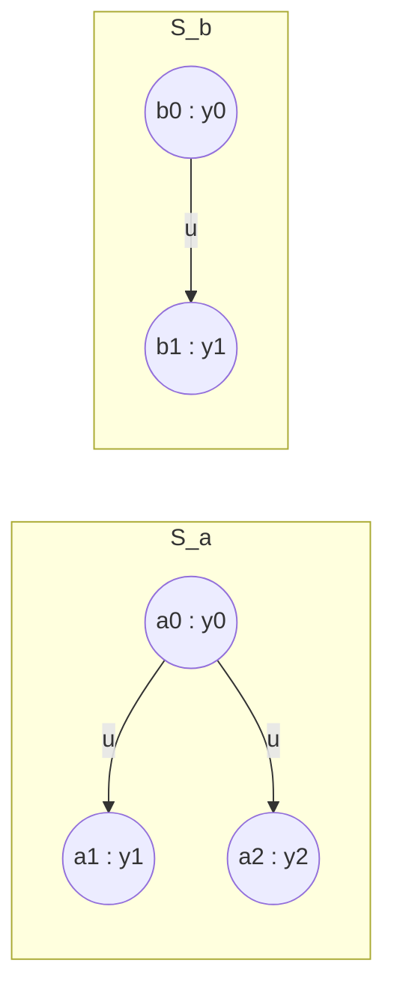

[[book-guidelines|↩ Back to guidelines]]

# Exact System Relationships

## Why you need a precise notion of "the same system" before you can verify anything

Suppose you have built a model $S_a$ of some machine — a fare box, a scheduler, a satellite's attitude controller — and you have a second model $S_b$ that encodes the *desired* behavior, the specification. The verification question is deceptively simple to state: *does $S_a$ do what $S_b$ says it should?* But "does the same thing as" is not one relation, it's a whole family of relations of increasing strength, and the entire machinery of the rest of this book — the fixed-point algorithms of Chapter 5, the controller-synthesis games of Chapter 6, the abstraction constructions of Chapters 7–11 — depends on picking the right member of that family for the job at hand.

Here's the problem with the weakest, most obvious candidate: comparing behaviors directly. A behavior of a system is a full run — states visited, inputs applied, outputs produced, forever. You could say $S_a$ "matches" $S_b$ if every infinite output-behavior $S_a$ can produce, $S_b$ can also produce. That's a perfectly good relation, and it is in fact the first one this chapter defines. But it treats each system as a black box that occasionally emits an infinite trace, and infinite traces are the wrong unit to compute with — you cannot enumerate them, store them, or check membership in a set of them algorithmically for an infinite-state system. What you *can* compute with is individual states and individual transitions. So the chapter's real project is to replace "compare the infinite traces" with "compare the transition structure, one step at a time, forever" — and show that the step-at-a-time relation implies the trace-level one (so it's sound), while being checkable inductively/coinductively rather than by trace enumeration (so it's usable).

That's the throughline of the whole chapter: three tiers of relations — **behavioral** (trace-level, weakest, most natural to state), **similarity** (transition-level: simulation/bisimulation, the workhorse), and **alternating similarity** (transition-level but input-aware, needed the moment "input" means "a choice an adversary or controller makes" rather than just "a label on an edge"). Each tier has an inclusion/asymmetric member and an equivalence/symmetric member.



## Tier 1: Behavioral inclusion and equivalence

**Definition 4.1 (Behavioral inclusion).** For systems $S_a, S_b$ with $Y_a = Y_b$, $S_a$ is *behaviorally included* in $S_b$, written $S_a \preceq_B S_b$, if $B^\omega(S_a) \subseteq B^\omega(S_b)$ — every infinite external behavior $S_a$ can produce, $S_b$ can also produce.

**Definition 4.2 (Behavioral equivalence).** $S_a \cong_B S_b$ iff $S_a \preceq_B S_b$ and $S_b \preceq_B S_a$, i.e. $B^\omega(S_a) = B^\omega(S_b)$.

Tabuada gives this an appealing game-theoretic reading — **the behavioral matching game** — that will recur, strengthened, for every relation in this chapter: to show $S_a \preceq_B S_b$, let $S_a$ pick any behavior $y \in B^\omega(S_a)$; $S_b$ wins the round if it can reproduce $y$ exactly. If $S_b$ can match every choice $S_a$ makes, $S_b$ wins the game and $S_a \preceq_B S_b$ holds. For equivalence, play the game in both directions (or, equivalently, one combined game where the mover alternates arbitrarily and the responder must always match).

**What breaks without this framing.** If you only ever check "is *a specific* behavior of $S_a$ inside $B^\omega(S_b)$", you've verified nothing — you need the *universal* statement over all of $S_a$'s behaviors, and the game framing is what makes that universal quantifier operationally checkable move-by-move instead of requiring you to first enumerate an infinite set of infinite strings.

The book's own worked example is a UCLA bus fare machine (swipe card → `ding`, deposit quarter → `dong`): two differently-structured finite automata $S_a$ (three states) and $S_b$ (four states) turn out to be behaviorally equivalent, $S_a \cong_B S_b$ — same external behavior, different internal shape. This pair is reused throughout the chapter and is exactly the example that will later separate behavioral equivalence from bisimilarity.

**Reachability and the safety problem.** A state $x$ is *reachable* if some initialized internal behavior $x_0 \xrightarrow{u_0} x_1 \xrightarrow{u_1} \cdots \to x$ ends at it; $\mathrm{Reach}(S)$ collects all reachable *outputs*. Proposition 4.6: $S_a \preceq_B S_b \implies \mathrm{Reach}(S_a) \subseteq \mathrm{Reach}(S_b)$, and equality under $\cong_B$. This one implication is the entire engine behind **safety verification**: given an unsafe output set $B$, $S_a$ is safe iff $\mathrm{Reach}(S_a) \cap B = \emptyset$. When $\mathrm{Reach}(S_a)$ is too hard to compute directly (the norm for infinite-state $S_a$), you instead find some $S_b$ with $S_a \preceq_B S_b$ whose reachable set *is* tractable, and conclude safety of $S_a$ from safety of $S_b$. This $S_b$ is called a **modeling abstraction** of $S_a$ (dually, $S_a$ is a **modeling refinement** of $S_b$) — and note the asymmetry of guarantees: an overconservative abstraction ($S_a \preceq_B S_b$) only ever gives you a *sufficient* condition for safety (if $S_b$ is unsafe you learn nothing about $S_a$, since the culprit behavior might live only in $S_b \setminus S_a$), whereas $S_a \cong_B S_b$ gives you an *iff*. This abstraction/refinement duality is the conceptual seed for the entire abstraction machinery of Parts III–IV.

## Tier 2: Similarity relationships — simulation and bisimulation

Trace-level comparison is elegant but computationally useless for infinite-state systems: you can't range over infinite strings algorithmically. So Tabuada replaces it with a relation *between states* that can be checked one transition at a time.

**Definition 4.7 (Simulation relation).** $R \subseteq X_a \times X_b$ is a simulation relation from $S_a$ to $S_b$ if:
1. every initial state of $S_a$ is $R$-related to some initial state of $S_b$;
2. related states agree on output: $(x_a,x_b)\in R \implies H_a(x_a)=H_b(x_b)$;
3. related states have matched transitions: $x_a \xrightarrow{u_a} x_a'$ in $S_a$ implies there exists $x_b \xrightarrow{u_b} x_b'$ in $S_b$ (any input $u_b$, not necessarily $u_a$) with $(x_a',x_b')\in R$.

$S_a \preceq_S S_b$ ("$S_b$ simulates $S_a$") iff such an $R$ exists. Notice condition 3 is asymmetric and existentially quantified only on $S_b$'s side — $S_b$ must be able to *shadow* every move $S_a$ makes, but $S_b$ is free to have moves of its own that $S_a$ can't shadow back. That asymmetry is precisely what separates simulation from bisimulation below, and it's worth sitting with condition 3 until it feels inevitable, because every later definition in the chapter is a variation on this exact matching clause.

**What breaks without condition 3 (only checking initial states + outputs).** You'd accept any pair of systems that merely *start* compatibly and happen to have matching output alphabets, even if their transition structure diverges arbitrarily after one step — the relation would not compose forward through behaviors at all, breaking Proposition 4.9 below.

**Proposition 4.9 (the soundness result): $S_a \preceq_S S_b \implies S_a \preceq_B S_b$.** The proof is a straightforward induction: given any internal behavior of $S_a$, use the simulation relation to build, transition by transition, a matching internal behavior of $S_b$ with identical outputs at every step (this is literally running the matching game and always winning). This is the load-bearing theorem of the section — it's why simulation is a *useful strengthening* of behavioral inclusion rather than an unrelated concept.

**The converse fails — and the book proves it with its own running example.** Example 4.10 shows that although the two bus-fare-machine automata satisfy $S_a \cong_B S_b$ (Example 4.3), $S_a \preceq_S S_b$ *fails*. Trying to build $R$ forces $(x_{a0},x_{b0})\in R$ (unique initial states); then $x_{a0}\xrightarrow{\text{swipe}} x_{a1}$ must be matched by $x_{b0}$'s only `swipe`-successors, $x_{b1}$ or $x_{b3}$ — but relating $x_{a1}$ to $x_{b1}$ breaks on $x_{a1}$'s `idle` self-loop (unmatchable from $x_{b1}$), and relating it to $x_{b3}$ breaks on $x_{a1}\xrightarrow{\text{quarter}} x_{a2}$ (unmatchable from $x_{b3}$). No relation works. **Behavioral equivalence is strictly weaker than the existence of a simulation relation** — trace equality alone doesn't certify that any step-by-step shadowing strategy exists, even when one direction's traces are literally identical.

**Proposition 4.11 (a partial converse):** if $S_b$ is *output deterministic*, then $B(S_a)\subseteq B(S_b) \implies S_a \preceq_S S_b$; if additionally $S_a$ is *nonblocking*, then $S_a \preceq_B S_b \implies S_a \preceq_S S_b$. The proof constructs $R$ directly as "pairs of states reachable by behavior-matched prefixes," and determinism of $S_b$ is exactly what lets you show this candidate $R$ satisfies the transition-matching clause (determinism means the matching successor is *unique*, so "some" successor and "the" successor coincide). This proposition is what licenses collapsing behavioral verification into simulation verification in Chapter 5 — provided you first make your specification system output-deterministic (which Chapter 5's Myhill–Nerode construction, Proposition 5.1, always lets you do without loss of generality).

**Definition 4.12/4.13 (Bisimulation).** Symmetrize: $S_a \cong_S S_b$ if there is $R$ that is a simulation relation from $S_a$ to $S_b$ *and* $R^{-1}$ is a simulation relation from $S_b$ to $S_a$. Equivalently (Definition 4.13), a single relation $R$ satisfying the two-directional versions of all three simulation conditions — every initial state on *either* side has an $R$-partner on the other, and every transition on *either* side is matched by one on the other, landing back in $R$.

**Proposition 4.14:** $S_a \cong_S S_b \implies S_a \cong_B S_b$ always; the converse holds when both systems are nonblocking *and* output deterministic. Example 4.15 shows bisimilar systems can have *different state-set cardinalities* — bisimulation identifies states up to "produces the same future," not up to literal equality, which is exactly the flexibility Part III exploits to replace an infinite-state system by a finite-state one that is bisimilar to it.

**Proposition 4.16:** the set of all simulation relations from $S_a$ to $S_b$ (and likewise bisimulation relations) is closed under union and bounded above by $X_a\times X_b$, hence has a *maximal element*. This single observation is what makes Chapter 5's fixed-point algorithms possible: "does a simulation relation exist" becomes "is the *maximal* simulation relation nonempty on the required pairs," which can be computed by monotone-operator iteration from the top of a lattice — this chapter sets up the object; Chapter 5 computes it.

### A worked example: simulation without bisimulation

The book's own examples happen to separate *behavioral inclusion from simulation* and *simulation from alternating simulation*, but it's worth making the "simulation but not bisimulation" gap fully concrete too, since it's the one most people trip on. Consider two tiny labeled transition systems over a shared output alphabet $\{y_0,y_1,y_2\}$:



Take $R=\{(a_0,b_0),(a_1,b_1),(a_2,b_1)\}$. Check simulation from $S_a$ to $S_b$: outputs match ($y_1=H(a_1)=H(b_1)$, and note $H(b_1)$ must then *also* equal $H(a_2)=y_2$ for condition 2 to hold on $(a_2,b_1)$ — so for this $R$ to be valid we'd need $y_1=y_2$; assume it is, i.e. $S_b$ conflates the two outcomes into one observable output). Transitions: $a_0\xrightarrow{u}a_1$ is matched by $b_0\xrightarrow{u}b_1$ (land in $R$); $a_0\xrightarrow{u}a_2$ is *also* matched by the same $b_0\xrightarrow{u}b_1$ (land in $R$ again, since $(a_2,b_1)\in R$). So $R$ is a genuine simulation relation: $S_a\preceq_S S_b$. But it cannot be extended to a bisimulation, because $R^{-1}$ fails condition 3: $b_1$ has no outgoing transition to match (there's nothing to match, it's a sink) — actually more informatively, run it the other way with $S_b$ having *two* choices: if $S_b$ had $b_0 \xrightarrow{u} b_1$ as its *only* successor while $S_a$ offers a *choice* between two distinguishable futures, $S_b$ has committed to shadowing both of $S_a$'s branches with a single successor state, which is fine for simulation (one direction: can $S_b$ match each of $S_a$'s moves — yes, same $b_1$ both times) but breaks bisimulation (can $S_a$ match $S_b$'s move $b_0\to b_1$ with *both* of its own successors simultaneously landing back in $R^{-1}$ — no, $b_1$ is a single state, but it needs to be related back to a single behavior, and if $a_1,a_2$ genuinely diverge afterward, $b_1$ cannot shadow both). The general shape: **simulation lets the "bigger" system ($S_b$ here) *merge* distinguishable behaviors of $S_a$ into one state, because $S_b$ only ever needs to keep up, never to be kept up with. Bisimulation forbids exactly this merging**, because the inverse relation must also be a simulation, meaning $S_a$ must be able to shadow *every* move $S_b$ makes too — and a merged state can't un-merge on demand.

This is the same phenomenon underlying the book's fare-machine example, just stripped to its essence — and it's the reason quotienting (next section) needs its own extra hypothesis to be safe.

## Quotient systems: bisimulation as the correctness condition for abstraction

**Definition 4.17 (Quotient system).** Given an equivalence relation $Q$ on $X$ with $(x,x')\in Q \implies H(x)=H(x')$ (i.e. $Q$-equivalent states must already agree on output — otherwise there's no well-defined output for the quotient), the quotient $S/Q$ has states $X/Q$ (the equivalence classes), $u$-transitions $x_{/Q}\xrightarrow{u} x'_{/Q}$ whenever *some* representative pair has $x\xrightarrow{u}x'$ in $S$, and $H_{/Q}(x_{/Q})=H(x)$ for any representative $x$. Tabuada calls $S/Q$ a **symbolic model**: each class is a *symbol* standing in for the (possibly infinite) set of concrete states $\pi_Q^{-1}(x_{/Q})$ it represents — this is the literal mechanism by which Chapters 7–8 turn continuous state spaces into finite automata.

By construction, $S/Q$ *always* simulates $S$ (the graph of the natural projection $\pi_Q$ is a simulation relation from $S$ to $S/Q$ — merging states can only ever add transitions, never remove the ability to shadow). The interesting, non-trivial direction is:

**Theorem 4.18.** $\Gamma(\pi_Q)=\{(x,x_{/Q}) : x_{/Q}=\pi_Q(x)\}$ is a simulation relation from $S$ to $S/Q$ unconditionally; it is a **bisimulation** relation between $S$ and $S/Q$ **iff $Q$ is itself a bisimulation relation on $S$** (i.e., $Q$ relates $S$ to itself as a bisimulation, meaning $Q$-related states have $Q$-related successors in both directions).

This answers Key Question 3 from the guidelines directly: quotienting by an *arbitrary* congruence-respecting-outputs equivalence only ever gives you simulation, which is enough for safety abstraction (sound over-approximation) but not enough to transport arbitrary properties or to go back and refine a controller synthesized on $S/Q$ to control $S$ exactly (Chapter 8 needs bisimilarity, or its alternating analogue, for exactly this reason). Quotienting by a *bisimulation* $Q$ is what makes the abstraction lossless in both directions — every distinction the concrete system $S$ can make, the quotient can still (indirectly, via the class) make too, because $Q$ itself never merged two states with genuinely different futures.

**Grounding this in Lean.** This theorem is the formal-verification-flavored version of something Lean's `Quotient` type does every day. `Quotient.mk : α → Quotient s` is exactly $\pi_Q$; `Quotient.sound : a ≈ b → Quotient.mk a = Quotient.mk b` is the statement that $Q$-related states *become* the same symbol; and `Quotient.lift`, which requires you to prove a function *respects* the equivalence relation before it descends to the quotient, is the type-theoretic incarnation of the side-condition "$(x,x')\in Q \implies H(x)=H(x')$" in Definition 4.17 — you cannot even *state* $H_{/Q}$ without first discharging that respecting-obligation, exactly as Tabuada bakes it into the definition. The extra content of Theorem 4.18 — that the quotient is *behaviorally faithful*, not just *well-defined* — is not something `Quotient.lift` gives you for free; it's an extra theorem you'd have to prove about the *transition relation specifically*, which is precisely what Theorem 4.18 does.

```rust
// Checking whether a candidate relation is a simulation relation —
// this is the decision procedure whose *existence* question Theorem 5.3
// (next chapter) turns into a fixed-point computation.
use std::collections::HashSet;

struct System {
    initial: HashSet<u32>,
    output: fn(u32) -> u32,
    // transitions[x] = set of (u, x') reachable from x
    transitions: fn(u32) -> Vec<(u32, u32)>,
}

fn is_simulation(r: &HashSet<(u32, u32)>, sa: &System, sb: &System) -> bool {
    // (1) every initial state of Sa has an R-partner among Sb's initial states
    let init_ok = sa.initial.iter().all(|&xa| {
        sb.initial.iter().any(|&xb| r.contains(&(xa, xb)))
    });
    // (2) + (3): outputs agree, and every Sa-transition is matched by some Sb-transition landing back in R
    let step_ok = r.iter().all(|&(xa, xb)| {
        (sa.output)(xa) == (sb.output)(xb)
            && (sa.transitions)(xa).iter().all(|&(_ua, xa_next)| {
                (sb.transitions)(xb)
                    .iter()
                    .any(|&(_ub, xb_next)| r.contains(&(xa_next, xb_next)))
            })
    });
    init_ok && step_ok
}
```
This is deliberately the *checking* direction, not the *search* direction — verifying a given $R$ is $O(|R| \cdot \max \text{branching})$, but *finding* the maximal such $R$ (what Chapter 5 needs) is the harder fixed-point problem. Notice the structural mirror to a type checker vs. a type-inference/elaboration engine: checking a witness is cheap, searching for one is where the real algorithmic content lives — the same split that shows up everywhere from bidirectional typing to SAT solving.

## Tier 3: Alternating similarity — when "input" becomes "choice"

Everything so far treats an input $u$ as a label $S_a$ picks and $S_b$ must merely shadow with *some* transition. That's the right notion for passive verification ("does the plant's behavior stay inside spec"), but wrong for control: when $S_a$ is a *controller* being checked against an abstract plant model $S_b$, you don't want "any transition of $S_b$ will do" — you want a guarantee that holds *no matter which input the plant's environment (disturbance) throws at it*. The matching has to happen at the level of *entire input choices*, quantified correctly over both controllable and uncontrollable outcomes.

**Definition 4.19 (Alternating simulation relation).** $R\subseteq X_a\times X_b$ is an alternating simulation relation from $S_a$ to $S_b$ if conditions 1–2 are as before, and condition 3 becomes: for every $(x_a,x_b)\in R$ and **every** input $u_a\in U_a(x_a)$, **there exists** an input $u_b\in U_b(x_b)$ such that **every** successor $x_b'\in \mathrm{Post}_{u_b}(x_b)$ has **some** matching successor $x_a'\in\mathrm{Post}_{u_a}(x_a)$ with $(x_a',x_b')\in R$.

Read the quantifier alternation out loud — $\forall u_a\,\exists u_b\,\forall x_b'\,\exists x_a'$ — this is a genuine two-player game with four moves per round instead of simulation's $\forall x_a'\,\exists x_b'$ (two moves). That's exactly why it's called *alternating*: the game alternates between choosing an input for $S_a$'s side, and then, once $S_b$ has committed to a *response input* $u_b$, resolving the (possibly nondeterministic) *outcome* of that input, which $S_a$ must be able to match no matter which outcome occurs. This is the precise formal content behind the book's intuition (§4.3 opening): "we need a similarity relationship that captures the effect that different choices of inputs have on transitions" — ordinary simulation only ever asked "can $S_b$ shadow this one transition," never "does committing to an *input* leave $S_b$ exposed to outcomes it can't cover."

$S_a\preceq_{AS} S_b$ iff such an $R$ exists.

**Example 4.21 makes the gap between simulation and alternating simulation concrete.** With $S_a$'s single state $x_{a0}$ branching nondeterministically to $x_{a1},x_{a2}$ under the *same* input $a$, and $S_b$ offering, also under $a$ from $x_{b0}$, three possible successors $x_{b1},x_{b2},x_{b3}$: the relation $R=\{(x_{a0},x_{b0}),(x_{a1},x_{b1}),(x_{a2},x_{b2})\}$ is a valid *simulation* (every $S_a$-successor is individually shadowed) but **not** an alternating simulation, because $x_{b3}\in\mathrm{Post}_a(x_{b0})$ has *no* $R$-partner among $S_a$'s actual successors of $x_{a0}$ — under alternating semantics, $S_b$ committing to input $a$ exposes $S_a$ to an outcome ($x_{b3}$) it has no way to match, so $S_b$'s choice of $a$ is not a safe response. Conversely, $R'=\{(x_{a0},x_{b0}),(x_{a1},x_{b1}),(x_{a1},x_{b2}),(x_{a1},x_{b3})\}$ *is* a valid alternating simulation relation — because it lets a *single* state $x_{a1}$ cover *every* possible outcome $S_b$ might produce under $a$ — but it is **not** a plain simulation, since the actual transition $x_{a0}\xrightarrow{a}x_{a2}$ in $S_a$ is never matched (the relation just never uses $x_{a2}$). The two notions genuinely diverge in *opposite directions*: alternating simulation cares about covering all environment-chosen outcomes of a committed input, ordinary simulation cares about covering every actually-taken transition.

**They coincide exactly for deterministic systems** — determinism forces $|\mathrm{Post}_u(x)|\le 1$ everywhere, collapsing the $\forall x_b'\,\exists x_a'$ clause to a single pair, which is exactly ordinary simulation's condition 3. This is a good sanity check: alternating simulation is a strict generalization, not a different idea.

**Definition 4.22 (Extended alternating simulation relation).** $R^e\subseteq X_a\times X_b\times U_a\times U_b$ packages the *witnessing input pair* alongside the related states: $(x_a,x_b,u_a,u_b)\in R^e$ iff $(x_a,x_b)\in R$, $u_a\in U_a(x_a)$, and $u_b$ is a valid response for $u_a$ per condition 3. This is not a new relation conceptually — it's $R$ with its existential input-witness made explicit and inspectable — but that explicitness is exactly what Chapter 6 needs: a *controller* is built by literally reading off, state by state, which $u_a$'s have a valid $R^e$-response, and feeding the plant that response. Definition 4.19's condition 3 is an *existence* statement; $R^e$ turns it into *data* a synthesis algorithm can enumerate.

**Proposition 4.23:** alternating simulation composes — if $R_{ab}$ witnesses $S_a\preceq_{AS}S_b$ and $R_{bc}$ witnesses $S_b\preceq_{AS}S_c$, then $R_{bc}\circ R_{ab}$ witnesses $S_a\preceq_{AS}S_c$. This transitivity is what licenses *chains* of abstraction — control an abstract $S_c$, refine through $S_b$, refine again down to the real plant $S_a$ — which is the whole architecture of Chapter 8's abstract-synthesize-refine pipeline.

**Definition 4.24 (Alternating bisimulation).** Symmetrize once more: $S_a\cong_{AS}S_b$ iff $R$ and $R^{-1}$ are both alternating simulation relations. This is the strongest relation in the chapter, and Chapter 8 shows it's exactly the condition under which controller refinement becomes a *two-way* guarantee (a controller can be designed on either system and transported to the other), rather than the one-way "design on the abstraction, refine down" guarantee that plain alternating simulation already gives via Proposition 8.7.

## Synthesis: where this chapter sits in the book

This chapter is pure vocabulary — no algorithm yet computes any of these relations, and no construction yet builds a small system related to a big one. But every later chapter is either **computing** one of these relations or **constructing** a system that stands in one of these relations to another:

- **Chapter 5 (Verification)** computes the *maximal* simulation and bisimulation relation between two finite-state systems as the maximal fixed-point of a monotone operator over the lattice $2^{X_a\times X_b}$ — Proposition 4.16's "maximal element exists" is exactly the existence half of what Tarski's fixed-point theorem (the Appendix) then makes *constructive*.
- **Chapter 6 (Control)** replays the same fixed-point strategy but over the *extended alternating simulation relation* $R^e$, turning controller synthesis into a fixed-point game (safety games via maximal fixed-points, reachability games via minimal fixed-points — with no minimally-restrictive controller in general, because reachability is a liveness property that plain greatest-fixed-point reasoning can't capture).
- **Chapters 7–8** *construct*, for specific classes of infinite-state dynamical/hybrid/control systems, a finite quotient system $S/Q$ that Theorem 4.18 certifies as exactly bisimilar (timed automata, order-minimal structures, sign-based abstractions) or alternatingly bisimilar (Chapter 8's controllable systems) to the original — this chapter's Theorem 4.18 is the correctness lemma every one of those later existence theorems ultimately cites.
- **Chapters 9–11** relax every relation in this chapter to an $\varepsilon$-approximate version (metric outputs, $\varepsilon$-close instead of equal) for the systems that admit no *exact* finite bisimilar quotient — everything in this chapter is the $\varepsilon=0$ special case of Part IV's machinery.

### Connections to the compiler/elaborator project (Focus Area: `static-analysis`)

This chapter is tagged under Static Analysis & Abstract Interpretation in this book's learning-goals file, and the connections are genuinely load-bearing, not decorative:

- **The quotient construction *is* an abstraction in the Cousot–Cousot sense.** $S/Q$ plays the role of an abstract domain element, $\pi_Q$ plays the role of the abstraction map $\alpha$, and the "always simulates" half of the quotient result is the soundness direction of a Galois connection — the abstract system can only ever *over-approximate* the concrete one's behaviors, never miss one. Theorem 4.18's extra condition for *bisimulation* (i.e. exact, not merely sound, abstraction) is the transition-system analogue of asking a Galois connection to be an isomorphism-on-the-relevant-fragment rather than a lossy approximation — precisely the distinction your compiler's abstract interpreter will face between a sound-but-imprecise invariant and an exact one.
- **Behavioral inclusion + reachability (Proposition 4.6) is literally the safety-verification-via-over-approximation pattern** your Hoare-contract / Horn-clause invariant generator will run: compute (or over-approximate) $\mathrm{Reach}$ on an abstraction, intersect with the unsafe set, and if empty, conclude safety on the concrete system — this is the same soundness argument that justifies trusting an abstract interpreter's "no bug found" result.
- **The simulation/bisimulation matching game is a concrete instance of a checking game whose search version is what a model checker or a CEGAR loop actually runs** — when Proposition 4.11's converse *fails* (as in Example 4.10), that failure is structurally the same event as a spurious-counterexample refinement step: the "abstraction" ($S_b$ in behavioral terms) matches all *traces* but not all *transitions*, meaning some abstract path has no concrete witness, which is exactly what a CEGAR refinement loop detects and repairs.

Two connections worth naming explicitly even though this book's topic is only tagged under `static-analysis`: the coinductive character of bisimulation (Definition 4.13's "for every $(x_a,x_b)\in R$" self-referential closure condition is a coinductive definition in the same sense as Sangiorgi's treatment in *Introduction to Bisimulation and Coinduction*, already in this vault) is directly the proof principle your elaborator's `isDefEq`-style definitional-equality checker would use if you ever needed to check equivalence of infinite/lazy structures rather than just syntactic terms; and the quotient-type correspondence noted above under Theorem 4.18 is a genuine preview of the bookkeeping your trusted kernel will need whenever it represents "provably equal but not syntactically identical" terms.

**[[Exact-Symbolic-Models-for-Control#Where this leads|Where this leads]]:** the next chapter (Verification, pp. 43–50) is where these definitions stop being static vocabulary and start being *computed* — via the Myhill–Nerode construction (Proposition 5.1) that makes Proposition 4.11's determinism hypothesis free to assume, and via the fixed-point operators $F$ and $G$ whose maximal fixed-points *are* the maximal simulation and bisimulation relations this chapter merely postulated the existence of (Proposition 4.16).
