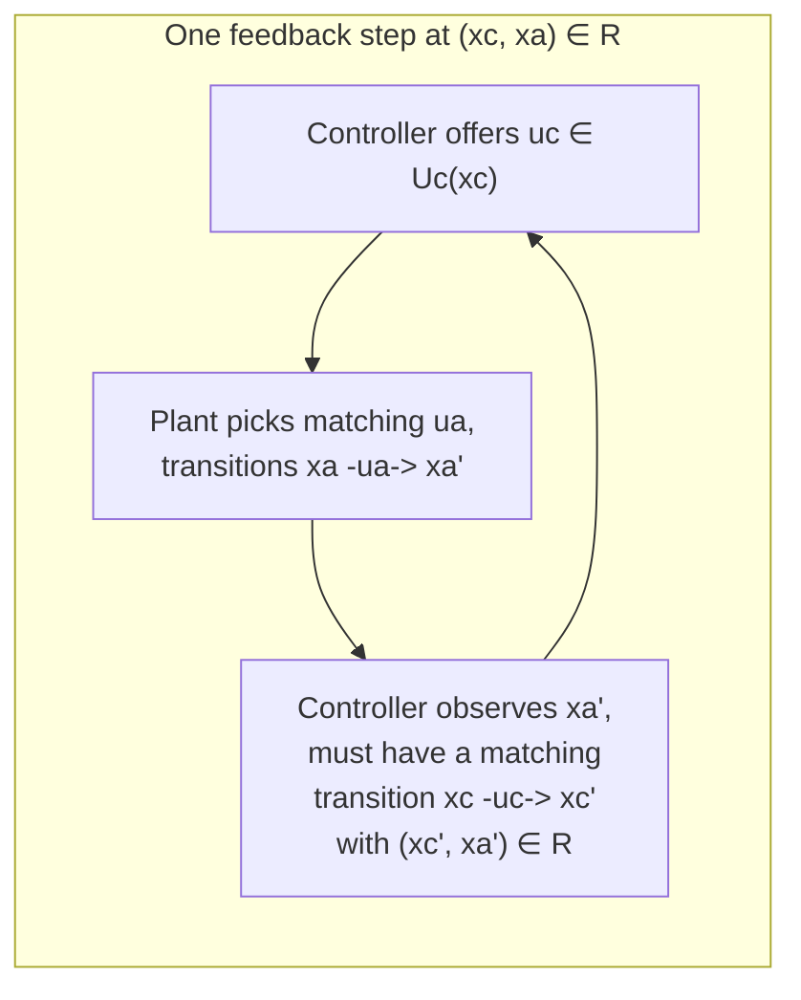
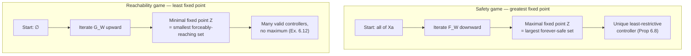

[[book-guidelines|↩ Back to guidelines]]

# Feedback Composition and Controller Synthesis

## Why "composing a controller" is not the composition you already know

Chapter 5 answered a verification question: given two fixed systems $S_a$ and $S_b$, does $S_a$'s behavior sit inside $S_b$'s? That's a decision problem — compute a fixed-point, read off a yes/no. Chapter 6 changes the question in one specific way: instead of checking whether a *given* system conforms to a spec, it asks whether there *exists* a system $S_c$ — a controller — you can plug in front of $S_a$ so that the result conforms. This single change from "check" to "construct" is, as the chapter's own framing puts it, the entire conceptual distance between verification and control.

But notice what has to be true for "plug in front of" to even make sense as an operation. In Chapter 1, composition $S_a \times_I S_b$ was symmetric machinery: two systems, an interconnection relation $I$ constraining which state/input quadruples can co-occur, and a product system whose behavior is a *subset* of the independent product of behaviors. Nothing in that definition distinguishes "the plant" from "the thing steering the plant." If you tried to use ordinary composition to model a controller, you'd hit a wall immediately: a generic interconnection relation can correlate the *inputs* of $S_c$ and $S_a$ in ways that have no operational meaning — there's no story for how, mechanically, $S_c$'s next move gets to depend on which input $S_a$ happens to also be taking at the same instant, unless you already believe some communication channel exists between them beyond "the controller watches the plant's state and reacts." Composition is too permissive: it lets you write down interconnections that no real feedback loop could implement.

So Chapter 6's first move is to split the input set. Instead of one undifferentiated set of inputs $U$, a controlled system has $U = C \times D$ (or, in the book's control-vs-disturbance framing carried into feedback composition, controllable inputs $U_c$ chosen by $S_c$ and inputs $U_a$ chosen by $S_a$/the environment). This is not bookkeeping — it's a commitment about *who gets to decide what, and in what order of information*. The book explicitly rejects the "interleaved/turn-based" alternative (where each transition is labeled by either a controllable or an uncontrollable input, one at a time) in favor of a **concurrent** model: at a state $x$, the controller offers a controllable input $u_c \in U_c(x)$, and the environment/plant *simultaneously* resolves which successor is reached, as if by picking a matching $u_a$. The controller does not get to see the environment's choice before committing to its own move at that instant — it only gets to react at the *next* step, once the new state is observed. That asymmetry is exactly what a real controller experiences: you set an actuator, physics (or an adversary, or a disturbance) resolves the consequence, and you observe the resulting state before you get to act again.

## Controllers as maps from observed history to permitted inputs

Given that asymmetry, what mathematical object should a "controller" even be? The book's answer is deliberately not "a function that picks one action" — because there is often more than one input that leads to correct behavior, and collapsing to a single choice throws away that freedom for no reason. Instead:

$$\varphi : X^* \to 2^U$$

A controller is a map from a finite sequence of observed states (a history) to a **set** of permitted next inputs. A run $x_0 \xrightarrow{u_0} x_1 \xrightarrow{u_1} x_2 \cdots$ is legal under $\varphi$ exactly when $u_k \in \varphi(x_0 x_1 \cdots x_k)$ for every step. This is a restriction operator on behaviors, not a generator of behaviors — it tells you which of the plant's own transitions remain available, it does not invent new ones. That single fact is what makes everything downstream (least-restrictive controllers, the ordering "$S_d$ is less restrictive than $S_c$") a meaningful comparison: two controllers can be ranked by how much of the plant's original behavior they leave standing.

**Grounding (Rust).** The history-indexed map $\varphi: X^* \to 2^U$ is exactly the shape of a *policy* function in an MDP/game solver, and it is naturally expressed as a trait rather than a closure, because you want to be able to swap "the maximally permissive controller derived from a fixed-point" for "an arbitrary controller" without changing any calling code:

```rust
trait Controller<X, U> {
    /// Given the history observed so far (state suffices here, since the
    /// book's controllers are Mealy machines over Xc, not over all of X*),
    /// return the set of currently-permitted inputs.
    fn permitted(&self, observed: &X) -> HashSet<U>;
}

// The canonical controller of Theorem 6.6 / (6.1) is just:
// a subset Z of states, reachable-and-safe, with permitted(x) restricting
// to inputs whose *entire* successor set stays inside Z.
struct SafetyController<X> {
    z: HashSet<X>, // the (maximal) fixed-point of F_W
}
```

`X^*`, in practice, collapses to "the controller's own current state" because the book restricts attention to controllers *describable by a finite-state system* $S_c$ — a Mealy machine whose own state already summarizes the relevant history. That restriction (from "arbitrary function of history" down to "finite-state machine") is exactly the same move a compiler makes going from "arbitrary semantic action" to "a DFA/DPDA transition function" — you trade generality for decidability and composability.

## Feedback composition: alternating simulation as the interconnection relation

Here is the crux, and it's worth sitting with why plain simulation fails. To realize $\varphi$ as $S_c \times_I S_a$, you need to pick $I$. The book's choice: $I$ must be the *extended relation* $R^e$ of an **alternating simulation relation** $R$ from $S_c$ to $S_a$ (alternating simulation was introduced in Chapter 4 §4.3 — recall it, unlike plain simulation, requires that for every controllable input $S_c$ offers, *every* environment response the plant might produce is matched by some transition on $S_c$'s side, i.e. it quantifies "for all environment choices" where plain simulation only quantifies "for all specific successors reached").

**Definition 6.1 (Feedback composition).** $S_c$ is *feedback composable* with $S_a$ if there is an alternating simulation relation $R$ from $S_c$ to $S_a$. The feedback composition $S_c \times_F S_a$ uses interconnection relation $F = R^e$.

Operationally (this is the "feedback" story the book tells): at a joint state $(x_c, x_a) \in R$, the controller offers *any* $u_c \in U_c(x_c)$; the plant picks *any* matching $u_a \in U_a(x_a)$ consistent with $F$ and transitions to some $x_a'$; that transition then *triggers* a matching transition on the controller's side, $x_c \xrightarrow{u_c} x_c'$, landing back in the relation $R$. The controller reacts — one full plant transition later — no matter which of the plant's nondeterministic responses actually occurred.

This is precisely why *alternating* simulation, not plain simulation, is required: plain simulation only guarantees a matching transition exists for whichever successor happens to be reached; it says nothing about *every possible* successor being matchable. If you tried to build feedback composition from an ordinary simulation relation, you could end up needing the controller to react differently to two different plant successors that are reached by the *same labeled transition* — which is impossible for a controller that only sees inputs, not internal nondeterministic choices. The book makes this concrete in Example 6.2/its follow-up: a candidate controller $S_d$ related to $S_a$ by an ordinary (non-alternating) simulation relation composes into a system missing a transition that *should* be present by input-labeling alone — implementing it would require a synchronization channel beyond "read the input label," i.e. it would require the controller to peek at which branch of the plant's nondeterminism got taken, rather than truly reacting only to the resulting state. Alternating simulation is exactly the closure condition that rules this out: it forces the controller to have a legal response *for every* successor the plant's chosen input might produce, so no hidden side-channel is ever needed.

**What breaks without this:** if you relax "alternating simulation" back down to "simulation" as the composability condition, feedback composition stops being *physically realizable* as a Mealy-style reactive loop — you get a mathematically well-defined product system that no actual state-feedback controller (one that only observes states, not the plant's internal nondeterministic branch) could implement.



Proposition 6.3 records the payoff: composing with an interconnection relation whose projected pairs share outputs can only *restrict* behavior ($S_a \times_I S_b \preceq_S S_b$), never add to it — feedback composition is a behavior-shrinking operation, consistent with "controller = permission-restricting map."

## Safety games: why a unique least-restrictive controller exists

**Definition 6.4.** For $S_a$ with $Y_a = X_a$, $H_a = 1_{X_a}$, and a "safe" set $W \subseteq X_a$: does there exist $S_c$ feedback composable with $S_a$, such that $S_c \times_F S_a$ is nonblocking and every reachable state stays in $W$?

The book solves this with a monotone operator on the state lattice $2^{X_a}$:

$$F_W(Z) = \{x_a \in Z \mid x_a \in W \text{ and } \exists u_a \in U_a(x_a).\ \emptyset \neq \mathrm{Post}_{u_a}(x_a) \subseteq Z\}$$

Read it as: keep $x_a$ in the output set only if it's safe *and* there's at least one input whose *entire* successor set is also still in the (shrinking) candidate set $Z$. This is a **backward-controllable-predecessor** operator — the control-theoretic analogue of a weakest-precondition computation restricted to inputs the controller actually gets to pick. Because $F_W$ is monotone ($Z \subseteq Z' \Rightarrow F_W(Z) \subseteq F_W(Z')$), Tarski's theorem (the Appendix, reused wholesale from Chapter 5's machinery) guarantees a unique **maximal** fixed-point $Z = \lim_i F_W^i(X_a)$, computed by iterating from the *whole* state space downward — you start optimistic ("everything is fine") and prune away states that can't be kept safe, exactly mirroring Chapter 5's maximal-fixed-point simulation computation, just with the successor-set quantifier restricted to controllable choices.

**Theorem 6.6 / Proposition 6.8 — why safety has a canonical best controller.** Once you have the maximal fixed-point $Z$, the controller (6.1) — states $Z$, transitions restricted to inputs whose successor set stays in $Z$ — is not just *a* solution, it is **least restrictive**: any other valid controller $S_d$ satisfies $S_d \times_F S_a \preceq_S S_c \times_F S_a$. The proof leans on a clean structural fact: *any* controller solving the safety game induces a reachable-state set that is itself a fixed-point of $F_W$ (Proposition 6.5), and all fixed-points of a monotone operator are ordered by set inclusion under the same lattice — so the maximal one dominates every other solution's reachable set. Safety is a **closure/greatest-fixed-point property**: it's about what stays true forever, so "as permissive as possible while never letting go of $W$" is a coherent, unique maximum — there's nothing better *to* find beyond the largest safe invariant set.

## Reachability games: why the analogous story fails

**Definition 6.9.** Same setup, but now the objective flips: every maximal behavior of $S_c \times_F S_a$ must *eventually visit* $W$ (finite behaviors that can't be extended must reach $W$ before blocking; no nonblocking requirement is imposed beyond that).

The dual operator:

$$G_W(Z) = \{x_a \in X_a \mid x_a \in W \text{ or } \exists u_a \in U_a(x_a).\ \emptyset \neq \mathrm{Post}_{u_a}(x_a) \subseteq Z\}$$

is also monotone, but now the book iterates it **upward from $\emptyset$** to the *minimal* fixed-point $Z = \lim_i G_W^i(\emptyset)$ (Theorem 6.10) — this is a controllable-predecessor computation building up the set of states from which the target is *forceably* reachable, layer by layer (this is literally backward BFS through the controllable-predecessor operator, the standard reachability-game/attractor computation from game theory and model checking).

Here is the chapter's central conceptual payoff, and it deserves real space: **reachability games have no minimally restrictive controller, in general.** Example 6.12 makes it concrete and it's worth internalizing the shape of the counterexample rather than just the conclusion. Take a trivial two-state system where $W = \{x_2\}$ and the only nontrivial behavior is a self-loop at $x_1$ that can be taken any (finite) number of times before moving on to $x_2$. Any finite-state controller $S_c$ solving the reachability game must, being finite-state, bound the number of times it permits the self-loop at $x_1$ to be taken — say $k$ times. But you can always build a *strictly less restrictive* controller $S_d$ that permits $k+1$ loops before forcing the move to $x_2$. $S_d$ is less restrictive than $S_c$ (it retains a strict superset of behaviors), and by the same argument $S_d$ itself is dominated by a controller permitting $k+2$ loops, and so on, forever. There is no top of this chain — no controller that both reaches $W$ and permits *every* possible amount of dawdling beforehand, because permitting unboundedly much dawdling is exactly the same as never being forced to reach $W$ at all.

**Why this connects to safety vs. liveness.** This is not a technical accident of the example — it's the general shape of *liveness* properties (Alpern–Schneider's "something good eventually happens") as opposed to *safety* ("something bad never happens"). A safety violation has a finite witness — the first bad state — so the largest safe set is a well-defined greatest fixed-point that "gives up" states only when forced to, and giving up as little as possible is a coherent notion of optimality. A liveness/reachability requirement has no finite witness of *violation* (an infinite behavior that dawdles forever without ever formally "failing" at any finite prefix) — so "least restrictive" would have to mean "delays reaching the goal as long as possible while still guaranteeing it eventually happens," and for any finite-state candidate offering a maximum delay, there's always a strictly more patient finite-state candidate. The lattice of valid controllers for a reachability game has fixed points but no maximum element among behavior-preserving solutions — monotonicity guarantees *a* minimal fixed-point for the *state-set* computation, but that says nothing about a maximum in the *controller-refinement* order, which is the ordering that actually matters for "least restrictive." Minimal-fixed-point-of-a-state-operator and least-restrictive-controller are simply not the same kind of optimality, and the chapter's own Notes section flags this explicitly as the book's introduction of the safety/liveness dichotomy that resurfaces, more consequentially, in Chapter 5's remark about liveness never being addressed there.

**What breaks without this distinction:** if you tried to define "the" canonical reachability controller the same way as the safety one — take the minimal fixed-point, restrict to controllable-predecessor transitions — you get *a* correct controller, but calling it "the best one" is simply false; Proposition 6.8's analogue for reachability does not exist, and no amount of cleverer fixed-point bookkeeping recovers it, because the obstruction is structural (no maximum in an infinite ascending chain), not a proof gap.



## Behavioral, simulation, and bisimulation games: reusing Chapter 5's operators, now control-flavored

**Behavioral games (§6.4).** Safety games are a special case: if $B^\omega(S_b) = W^\omega$, the safety game for $W$ *is* the behavior-inclusion game "find $S_c$ with $S_c \times_F S_a \preceq_B S_b$." Under output-determinism (Chapter 4's standing reduction, via Proposition 4.11) this collapses to a **simulation game**: find $S_c$ with $S_c \times_F S_a \preceq_S S_b$.

**Simulation games (§6.5) — operator $F_C$.** This directly generalizes Chapter 5's verification operator $F$, now over pairs $(x_a, x_b) \in X_a \times X_b$ and requiring the *controller* to pick the witnessing input:

$$(x_a,x_b) \in F_C(W) \iff H_a(x_a)=H_b(x_b) \ \wedge\ (x_a,x_b)\in W \ \wedge\ \exists u_a \in U_a(x_a).\ \forall x_a' \in \mathrm{Post}_{u_a}(x_a).\ \exists\, x_b \xrightarrow{u_b} x_b' \text{ with } (x_a',x_b')\in W$$

Compare this to Chapter 5's $F$: the difference is exactly the injected $\exists u_a.\forall x_a'$ quantifier alternation — $F$ asked "does *every* transition of $S_a$ have a match," $F_C$ asks "does the *controller* have a choice of input all of whose consequences have a match." That's the control generalization in one line: verification checks a universal, control existentially picks among available universals. Theorem 6.15 gives the same shape of result as Theorem 6.6: solvable iff the maximal fixed-point $Z = \lim_i F_C^i(X_a \times X_b)$ meets $X_{a0} \times X_{b0}$, computed in time polynomial in $|X_a||X_b|$ for finite systems, and Proposition 6.17 recovers a least-restrictive-controller guarantee exactly as in the safety case (simulation games are safety-shaped: they ask for a relation to be *maintained* forever, so the same greatest-fixed-point optimality argument applies).

**Bisimulation games (§6.6) — operator $G_C$.** The strictly stronger requirement $S_c \times_F S_a \cong_S S_b$ needs an operator that also checks the *reverse* direction — every transition $S_b$ can take must be matched by some controllable choice in $S_a$:

$$(x_a,x_b)\in G_C(W) \iff H_a(x_a)=H_b(x_b)\ \wedge\ (x_a,x_b)\in W\ \wedge\ \forall x_b \xrightarrow{u_b} x_b'.\ \exists u_a\in U_a(x_a).\ \big[\exists x_a'\in\mathrm{Post}_{u_a}(x_a).(x_a',x_b')\in W\big] \wedge \big[\forall x_a''\in\mathrm{Post}_{u_a}(x_a).\exists\, x_b\xrightarrow{u_b'}x_b''. (x_a'',x_b'')\in W\big]$$

The book flags something worth noticing structurally in its closing Notes: $G_C$'s definition is *shaped exactly like* the definition of an alternating simulation relation itself — no coincidence, since a solved bisimulation game is precisely an alternating-simulation-relation-producing construction one level up. Theorem 6.19's solvability condition is stated differently in form from Theorem 6.15's — surjectivity of the projection $\pi_b(Z \cap (X_{a0}\times X_{b0})) = X_{b0}$ rather than mere nonemptiness of the intersection — because bisimulation must match transitions from *both* sides, so every one of $S_b$'s initial states, not just some, needs a controllable counterpart.

**Grounding (Rust).** All four operators — $F_W$, $G_W$, $F_C$, $G_C$ — share one shape: a monotone set transformer over a finite lattice, iterated to a fixed point. This is worth factoring as a single generic routine, exactly the way you'd factor a Kleene-iteration dataflow-analysis engine:

```rust
trait MonotoneOp<S> {
    fn apply(&self, current: &HashSet<S>) -> HashSet<S>;
}

fn greatest_fixed_point<S: Eq + Hash + Clone>(
    op: &impl MonotoneOp<S>,
    universe: HashSet<S>,
) -> HashSet<S> {
    let mut z = universe;
    loop {
        let next = op.apply(&z);
        if next == z { return z; }
        z = next;
    }
}

fn least_fixed_point<S: Eq + Hash + Clone>(
    op: &impl MonotoneOp<S>,
) -> HashSet<S> {
    let mut z: HashSet<S> = HashSet::new();
    loop {
        let next = op.apply(&z);
        if next == z { return z; }
        z = next;
    }
}
```

`F_W` and `F_C` instantiate `greatest_fixed_point` (start from everything, prune); `G_W` instantiates `least_fixed_point` (start from nothing, grow); `G_C` also instantiates `greatest_fixed_point` but over pairs, with a two-sided match check. The controller extraction step (6.1)/(6.2)/(6.3)/(6.4) is then a second pass over the computed fixed-point set, reading off, at each retained state, *which* input(s) justified keeping it — i.e., you need to retain enough evidence during the fixed-point computation (or recompute it) to reconstruct the witnessing $u_a$, not just the Boolean "is this state in $Z$." This is precisely the same bookkeeping distinction as an abstract interpreter that needs to keep *justifications* for retained facts (for counterexample/witness extraction, as in CEGAR) rather than only the abstract state itself.

## Closing synthesis

Chapter 6 is the control-side mirror of Chapter 5's verification fixed-points, and the mirroring is exact enough that it's worth stating as a table: Chapter 5's $F$ (maximal simulation) becomes $F_C$ (maximal fixed-point, controller existentially quantifies over its own inputs); Chapter 5's $G$ (maximal bisimulation) becomes $G_C$; and safety/reachability games ($F_W$/$G_W$) are the specializations of that same machinery to the single-system, invariant-vs-eventuality case. The recurring idea across both chapters — replace "does a relation hold" with "compute the extremal fixed-point of a monotone operator on $2^X$ or $2^{X\times X}$" — is Tarski's theorem doing essentially all the real work, with the safety/reachability split showing *why* the direction of the fixed-point (greatest vs. least) is not a free implementation choice but is forced by whether the property is a safety property (closed under limits, greatest-fixed-point-friendly, unique optimum) or a liveness property (no finite violation witness, least-fixed-point-friendly, no controller optimum).

This chapter is also infrastructure, not an endpoint: Chapter 8's controller-refinement pipeline (Proposition 8.7) takes a controller synthesized on a *finite-state abstraction* via exactly these safety/simulation/bisimulation games and transports it back to the original infinite-state plant, using the same alternating-simulation composability condition defined here — feedback composability is the load-bearing hypothesis that makes "synthesize small, refine to the original system" sound rather than merely hopeful. Chapter 11 repeats the whole story approximately (§11.3's "approximate feedback composition," with precisions accumulating exactly the way Chapter 9 warned they would under composition).

**Focus-area connections (`static-analysis`, per this book's tagging of this topic).** The operators $F_W, G_W, F_C, G_C$ are textbook instances of **abstract interpretation**'s core recipe — a monotone transformer on a complete lattice, extremal fixed-points obtained by Kleene iteration, soundness guaranteed by Tarski — specialized here to a *game* semantics (the transformer alternates a $\exists$ over the analyzer's own choices with a $\forall$/$\exists$ over the environment's, rather than being a pure forward/backward dataflow step). The safety-game operator $F_W$ *is* a **reachability analysis** in reverse: it computes exactly the controllable-predecessor set that underlies both CEGAR-style backward refinement and the "does a bad state stay unreachable" invariant-generation problem — and Theorem 6.6's iteration $\lim_i F_W^i(X_a)$ is structurally identical to computing the coarsest invariant that a Horn-clause/CHC solver would accept as an inductive safety proof, just phrased over a controllable-vs-uncontrollable transition relation instead of a program's guarded assignments. The reachability-game operator $G_W$, dually, is the **domain-propagation** analogue of a backward worklist algorithm computing "must-reach" facts — precisely the shape of the fixed-point a CEGAR loop's abstraction-refinement step needs when the property under check is an eventuality rather than an invariant, and the chapter's demonstration that *no* least/greatest controller exists for liveness is a cautionary instance worth remembering when designing invariant-generation heuristics that implicitly assume "the weakest inductive invariant" is well-defined — it is, for safety, and it is *not*, in the analogous refinement-optimality sense, for liveness obligations.

## Where this leads

Chapter 6's feedback composition and its safety/simulation/bisimulation games are the fixed-point machinery that Chapters 8 and 11 invoke directly — Chapter 8 to refine a finite-abstraction controller onto an exact infinite-state plant, Chapter 11 to do the same approximately, with precision bookkeeping layered on top. The safety-vs-liveness distinction drawn here (unique optimum vs. none) is also the chapter the book's own Notes point back to whenever Chapter 5's "no liveness" simplification needs justifying.
