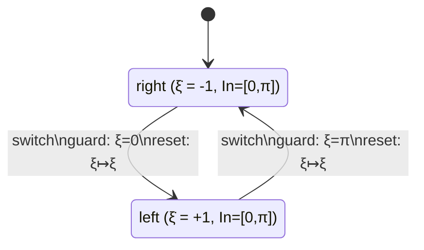

[[book-guidelines|↩ Back to guidelines]]

# Hybrid Dynamical Systems

## Why a continuous trajectory needs to become a "system" at all

Chapter 1 fixed one mathematical object for the whole book: a *system* is a sextuple $S = (X, X_0, U, \to, Y, H)$ — states, initial states, inputs, a transition relation, outputs, and an output map. Everything the book can verify or control — a communication protocol, a satellite, a scheduler — has to be pressed into that shape, because the verification and control *algorithms* (Chapters 5–6, and their fixed-point machinery) are defined once, on that shape, and reused everywhere.

A dynamical system $\dot\xi = f(\xi)$ is not obviously a system in this sense. Its state space $\mathbb{R}^n$ is infinite, and "time" doesn't look like a discrete input symbol — it's a real number you can flow for. So before any abstraction technique (timed automata, sign-based abstractions, barrier certificates — all downstream of this section) can even be stated, you need one specific, honest translation: *given* a [[Exact-Symbolic-Models-for-Control#Continuous-time|continuous-time]] dynamical system, *here is the system $S=(X,X_0,U,\to,Y,H)$ it becomes.* That translation is the entire content of §7.1, and everything later in Chapter 7 is a way of making that translation's state space finite.

The key design decision, and the one with a real failure mode if you get it wrong, is: **what counts as a transition?** You could sample the trajectory at fixed time steps $0, \delta, 2\delta, \dots$ — that's the *time-triggered* approach the book actually uses later, in Chapter 10, for *approximate* models. Section 7.1 does something different and more exact: it samples only where the **output changes**. This is worth dwelling on, because the reason is not aesthetic — it's what makes an *exact* (not approximate) finite-output model possible at all.

## Dynamical systems and their trajectories

**Definition (dynamical system).** $\Sigma = (\mathbb{R}^n, f)$, where $f : \mathbb{R}^n \to \mathbb{R}^n$ is smooth, defining $\dot\xi = f(\xi)$. A **trajectory** with initial condition $x$ is a smooth curve $\xi_x : \,]a,b[\, \to \mathbb{R}^n$ with $a<0<b$, $\xi_x(0)=x$, and $\dot\xi_x(t) = f(\xi_x(t))$ on the whole interval. If every trajectory is defined for all $t\in\mathbb{R}$ (not just some bounded interval), $\Sigma$ is **complete**, and you get a single map

$$\theta : \mathbb{R}^n \times \mathbb{R} \to \mathbb{R}^n, \qquad \theta(x,t) = \xi_x(t)$$

called the **flow**, satisfying $\theta(x,0)=x$ and $\theta(x,t_1+t_2) = \theta(\theta(x,t_1),t_2)$ — i.e. flowing for $t_1$ then $t_2$ is the same as flowing for $t_1+t_2$ directly. This semigroup law is doing real work: it's what lets you treat "flow for $u$ time units" as a well-defined action, the same way a monoid action on a state lets you compose two moves into one. If you know Rust `enum`-based state machines, $\theta$ is the continuous-time analogue of a `step(state, n) -> state` function that's associative in `n`.

You don't usually want to observe $\xi(t)$ at *every* real number $t$ — you want to know things like "is the temperature and concentration in range." So fix a finite output set $Y$ and an output map $H : \mathbb{R}^n \to Y$ (equivalently: a finite equivalence relation $Q$ on $\mathbb{R}^n$, with $H = \pi_Q$, the projection to equivalence classes $\mathbb{R}^n/Q$). The question the rest of §7.1 answers is: *given $\Sigma$ and $Q$, what system $S=(X,X_0,U,\to,Y,H)$ reproduces exactly the $Y^\omega$-behavior an observer watching through $H$ would see?*

## Building the system $S_Q^L(\Sigma)$: sample only at output changes

**Definition 7.2.** Given $\Sigma=(\mathbb{R}^n,f)$, a finite equivalence relation $Q$ on $\mathbb{R}^n$, and a set of initial states $L\subseteq\mathbb{R}^n$, the associated system $S_Q^L(\Sigma)$ has:

- $X = \mathbb{R}^n$ (states — still infinite; only the *output* has been made finite so far)
- $X_0 = L$
- $U = \mathbb{R}_{\geq 0}$ (inputs are durations — "flow for this long")
- $Y = \mathbb{R}^n/Q$, $H = \pi_Q$
- a transition $x \xrightarrow{\tau} x'$ exists iff **one of two cases** holds:

  1. **(output-change transition)** $\pi_Q(x) \neq \pi_Q(x')$, there's a trajectory $\xi_x$ on $[0,\tau]$ with $\xi_x(\tau)=x'$, and there is a single switching instant $\varepsilon\in[0,\tau]$ where the output flips exactly once from $\pi_Q(x)$ to $\pi_Q(x')$ (and stays on one side or the other of $\varepsilon$, never oscillating back).
  2. **(self-loop / repeated-output transition)** $\pi_Q(x) = \pi_Q(x')$, and there's an *unboundedly long* trajectory $\xi_x : \mathbb{R}_{\geq 0} \to \mathbb{R}^n$ with $\xi_x(\tau)=x'$ whose output **never changes** for all $t\geq 0$.

Case 1 is the natural idea: don't record the output at every instant, record only the instant it *changes*. A transition witnesses exactly one output flip. Case 2 is the fix for a real pathology, and it's Chapter 7's first Key Question, so it's worth deriving the failure rather than just stating the patch.

### What breaks without the self-loop rule

Suppose a trajectory's output never changes at all — for instance the dynamical system settles into an equilibrium, or just orbits forever inside one equivalence class of $Q$. Under case 1 alone, this trajectory generates **no transitions whatsoever**, because case 1 requires an output *change*. A state with no outgoing transition is a *blocking* state in the book's terminology (Chapter 1, §1.1) — the system looks like it has literally stopped, deadlocked, run out of behavior.

But that's a lie about the underlying dynamical system: $\Sigma$ hasn't stopped, its trajectory runs forever, it's just boring to watch through $H$. If you feed this broken system into the verification machinery of Chapter 5 or the control games of Chapter 6, "blocking" is a meaningfully different property than "nonblocking" — nonblocking is a precondition baked into definitions like safety games (Theorem 6.6 requires $S_c\times_F S_a$ nonblocking). A system that reports itself as blocked when it is really just quiescent would make every downstream algorithm draw the wrong conclusion about liveness and progress.

Case 2 is the fix: whenever the output would never change again, add a **self-loop-shaped transition** anyway (any duration $\tau$, back into the same output class), so the system stays *nonblocking* and faithfully continues to exist as a $Y^\omega$-generating object, exactly the way the real dynamical system does. The self-loop doesn't add new *observable* behavior (the output is still constant) — it only repairs blockingness so the system's internal behavior matches the fact that time keeps passing.

A useful mental model, if you're used to reactive streams: case 1 is "emit an event on state change," case 2 is "keep the channel alive with heartbeat events when nothing changed," and the reason you need heartbeats is that a channel with no events looks, to a consumer, indistinguishable from "closed."

**One consequence worth flagging:** because case 1 only ever allows a *single* switch inside $[0,\tau]$, the output string produced by $S_Q^L(\Sigma)$ **never has two equal symbols in a row** except via the deliberate self-loop of case 2 — every transition is either "sampled from a genuine change" or "manufactured to avoid blocking." This is exactly the kind of invariant a soundness proof over this construction would lean on.

$S_Q^L(\Sigma)$ is abbreviated $S_Q(\Sigma)$ when $L = X$ (every state is a legal start).

## Hybrid dynamical systems: modeling mode switches explicitly

A dynamical system $(\mathbb{R}^n, f)$ has one differential equation, everywhere. Many real systems don't: a thermostat's heater is either on or off, and *which* differential equation governs the temperature depends on that discrete mode; a DC-DC converter's switch is open or closed; a real-time scheduler has a currently-running task drawn from a finite set. In each case there's a finite set of **modes**, a **different dynamical system per mode**, and **rules for when and how you switch modes**. Definition 7.3 packages exactly this:

**Definition 7.3 (Hybrid dynamical system).** A hybrid dynamical system $\Sigma$ is a quintuple

$$\Sigma = \big(S_a,\ \{\mathrm{In}_x\}_{x\in X},\ \{\mathrm{Gu}_t\}_{t\in\to},\ \{\mathrm{Re}_t\}_{t\in\to},\ \{f_x\}_{x\in X}\big)$$

consisting of:

- a finite-state system $S_a = (X, U, \to)$ — the modes and the discrete transitions between them;
- for each mode $x\in X$, a non-empty **invariant** set $\mathrm{In}_x \subseteq \mathbb{R}^n$ — the region of continuous state where it's legal to *stay* in mode $x$;
- for each discrete transition $(x,u,x')\in\to$, a non-empty **guard** set $\mathrm{Gu}_{(x,u,x')} \subseteq \mathrm{In}_x$ — the region of continuous state where that transition is *allowed to fire*;
- for each discrete transition, a **reset** map $\mathrm{Re}_{(x,u,x')} : \mathrm{In}_x \to \mathrm{In}_{x'}$ — how the continuous state gets rewritten when the transition fires;
- for each mode $x$, a dynamical system $(\mathrm{In}_x, f_x)$ — the differential equation active while in mode $x$.

Each of the three pieces models a distinct real phenomenon, and it's worth naming them separately rather than treating "invariant/guard/reset" as one blob of syntax:

- **Invariant** $\mathrm{In}_x$ — *where you're allowed to keep flowing*. In the scheduler example this is "this task's deadline clock hasn't yet exceeded its bound"; leaving the invariant is not optional, the system *must* take a transition before it would happen.
- **Guard** $\mathrm{Gu}_{(x,u,x')}$ — *where a specific discrete transition is enabled*. In the DC-DC converter this is the region of (current, voltage) space where flipping the switch is the physically/logically correct thing to do. A guard is a precondition on a transition, the continuous-state analogue of a Rust `match` arm's pattern guard.
- **Reset** $\mathrm{Re}_{(x,u,x')}$ — *how continuous state carries over across a discrete jump*. Sometimes it's the identity (angle unchanged, only the mode flips); sometimes it snaps a value to zero (a clock reset); in general it's any map between the two modes' invariant sets.

### Worked example: the windshield wiper (Example 7.4)

The book's own worked example for this section is deliberately small. A wiper sweeps an angle $\xi \in [0,\pi]$, and has two modes, `right` (clockwise, $\dot\xi = -1$) and `left` (counterclockwise, $\dot\xi = +1$), both with invariant $[0,\pi]$.



Starting at $(\mathrm{right}, \tfrac{\pi}{2})$, the wiper flows continuously via $\xi(t) = \tfrac{\pi}{2} - t$ until it hits $\xi=0$ at $t=\tfrac{\pi}{2}$ — exactly the guard for `right`$\to$`left`. The transition fires (here the reset is the identity: $0 \mapsto 0$), the mode flips to `left`, and the angle now flows forward under $\dot\xi=+1$ until it hits $\xi=\pi$, at which point `left`$\to$`right` fires, and so on. This alternation — continuous flow, hit an invariant boundary, discrete jump, continuous flow again — is the general shape of every hybrid execution, and it's exactly what the sextuple below has to capture without ever formally defining "execution" as a primitive notion (the book deliberately avoids that — executions *emerge* as the internal behavior of the system built from Definition 7.5, the same way $B(S)$ emerges from Chapter 1's definitions rather than being separately stipulated).

## Discrete transitions versus continuous flows, and the system $S_Q^L(\Sigma)$

Definition 7.5 does for hybrid dynamical systems exactly what Definition 7.2 did for plain dynamical systems: builds one system $S_Q^L(\Sigma) = (X,X_0,U,\to,Y,H)$ whose transitions are sampled at output changes, with a self-loop rule for the unbounded case. The state now has two parts, one discrete and one continuous, glued together:

- $X = \{(x_a, x_b) \mid x_a \in X_a,\ x_b \in \mathrm{In}_{x_a}\}$ — a mode $x_a$ paired with a continuous state legal for that mode
- $U = U_a \cup \mathbb{R}_{\geq 0}$ — either a discrete-transition label, or a flow duration
- $H(x_a,x_b) = (x_a, \pi_{Q_{x_a}}(x_b))$ — output is the mode plus the quotiented continuous state

and a transition $(x_a,x_b) \xrightarrow{u} (x_a',x_b')$ falls into exactly one of three cases:

1. **Discrete transition.** $u \in U_a$, $x_b \in \mathrm{Gu}_{(x_a,u,x_a')}$, and $x_b' = \mathrm{Re}_{(x_a,u,x_a')}(x_b)$ — the continuous state is inside the guard, and the new continuous state is whatever the reset map produces. This is a single instantaneous jump, driven entirely by the discrete transition relation $\to_a$ of $S_a$; the mode changes, and the continuous part is rewritten by the reset.
2. **Continuous flow, output-change case.** $u \in \mathbb{R}_{\geq 0}$, $x_a' = x_a$ (mode unchanged), and the output of the *continuous* part changes across the flow — this is verbatim Definition 7.2 case 1, applied inside the current mode's dynamical system $(\mathrm{In}_{x_a}, f_{x_a})$.
3. **Continuous flow, self-loop case.** Same but the continuous output never changes across an unboundedly long flow — verbatim Definition 7.2 case 2, for the same reason: without it, a mode where the continuous state settles and never triggers a guard would look blocking, even though time is still legitimately passing and the hybrid system hasn't actually gotten stuck.

So "discrete transitions versus continuous flows" isn't a fuzzy distinction — it's precisely cases {1} versus {2,3} of this transition relation, and the continuous-flow cases are literally the dynamical-system construction from §7.1.1 nested one level down, run separately inside whichever mode's invariant set you're currently in. This is why the book calls it "the associated system": once you fix a finite quotient $Q_{x_a}$ per mode, you get exactly one system out of the construction, mechanically, and that system is what the rest of Chapter 7 tries to make bisimilar to a *finite-state* system (its continuous part $X=\mathbb{R}^n$ per mode is still infinite at this point — nothing here has made the state space finite yet, only the output).

## Grounding: a hybrid automaton as a Rust state machine

The three-case transition relation above maps almost directly onto a `step` function over an `enum` of modes, where each mode owns a guard check, a flow function, and (on transition) a reset — a thermostat is a clean small example, structurally identical to the wiper:

```rust
#[derive(Clone, Copy, PartialEq, Debug)]
enum Mode { Heating, Idle }

struct HybridState {
    mode: Mode,
    temp: f64,   // the continuous part x_b ∈ In_{x_a}
}

// f_x for each mode: dT/dt as a function of mode.
fn flow_rate(mode: Mode) -> f64 {
    match mode {
        Mode::Heating => 2.0,   // heater raises temperature
        Mode::Idle    => -1.0,  // ambient loss cools it
    }
}

// Guards: when is the discrete transition enabled?
fn guard_satisfied(mode: Mode, temp: f64) -> bool {
    match mode {
        Mode::Heating => temp >= 22.0,  // hits upper invariant boundary
        Mode::Idle    => temp <= 18.0,  // hits lower invariant boundary
    }
}

// Reset: here the identity — temperature carries over unchanged,
// only the mode flips (this is not always the case in general).
fn reset(_mode: Mode, temp: f64) -> f64 { temp }

// One simulation tick: either a discrete jump (case 1) or a
// continuous flow step (cases 2/3 collapsed into fixed-step Euler
// integration for simulation purposes).
fn step(state: HybridState, dt: f64) -> HybridState {
    if guard_satisfied(state.mode, state.temp) {
        let new_mode = match state.mode {
            Mode::Heating => Mode::Idle,
            Mode::Idle    => Mode::Heating,
        };
        HybridState { mode: new_mode, temp: reset(state.mode, state.temp) }
    } else {
        HybridState { mode: state.mode, temp: state.temp + flow_rate(state.mode) * dt }
    }
}
```

This `step` function is a *simulator*, not the book's $S_Q^L(\Sigma)$ itself — it advances by a fixed `dt` rather than sampling exactly at output changes, which is closer to the time-triggered $S_\tau(\Sigma)$ the book introduces later (Chapter 10) for approximate models. But the structural correspondence is exact: the `match` on `guard_satisfied` is the guard set $\mathrm{Gu}_{(x_a,u,x_a')}$, the mode-flip plus `reset` is exactly case 1 of Definition 7.5, and `flow_rate` integrated over time is the dynamical system $(\mathrm{In}_{x_a}, f_{x_a})$ for the active mode. Writing the *exact*, output-change-triggered version means detecting the crossing time $\varepsilon$ symbolically or via root-finding on `temp - threshold`, rather than stepping by fixed `dt` — which is precisely the harder problem the rest of Chapter 7 (timed automata, order-minimal structures, sign-based abstractions) exists to solve for specific restricted classes of dynamics where that crossing structure is tractable to compute finitely.

## Connecting to the abstraction/verification picture

Even before any finite-state abstraction is built, $S_Q^L(\Sigma)$ (or its hybrid version) is already doing something in the spirit of **abstract interpretation**: the equivalence relation $Q$ is a concrete instance of collapsing an infinite concrete domain ($\mathbb{R}^n$) down to a finite set of observable classes ($\mathbb{R}^n/Q$) via a projection $\pi_Q$ — structurally the same move as an abstraction map in a Galois connection, where $\pi_Q$ plays the role of the abstraction function $\alpha$ and "which concrete states map to a given output" plays the role of $\gamma$. The difference from classical abstract interpretation is that here the *state space itself* stays concrete ($X=\mathbb{R}^n$) — only the *output* is abstracted — so this construction alone gives you an exact but still infinite-state system; making $X$ itself finite (so that the fixed-point algorithms of Chapters 5–6 actually terminate) is precisely the job of the rest of Chapter 7. The self-loop rule, similarly, is the kind of soundness-preserving patch you see constantly in reachability analysis: a construction that would otherwise silently under-approximate a system's behavior (by reporting it as terminated/blocked) gets a deliberate correction so it remains a faithful — not just convenient — model.

## Where this leads

$S_Q^L(\Sigma)$ and its hybrid counterpart from Definition 7.5 are the object every later technique in Chapter 7 abstracts further:

- **§7.2 Timed automata** restrict Definition 7.3's invariants/guards/resets/dynamics to rational-constant clock conditions and unit-slope flows, and show that under those restrictions a *finite-state* bisimilar quotient of $S_Q^L(\Sigma)$ always exists.
- **§7.3 Order-minimal structures** replace the timed-automaton restriction with a model-theoretic one (definability in an order-minimal structure), giving finite bisimilar quotients for a broader class of continuous flows, at the cost of needing eigenvalue conditions to hold.
- **§7.4 Sign-based abstractions** and **§7.5 Barrier certificates** stop trying to build an exact finite quotient at all, and instead construct sound (safety-preserving) approximations directly on top of the same $S_Q^L(\Sigma)$ object, using Lie derivatives and Lyapunov-like certificates respectively.

All three read the invariant/guard/reset/flow data exactly as defined here — this section is the shared foundation, not a competing technique.
