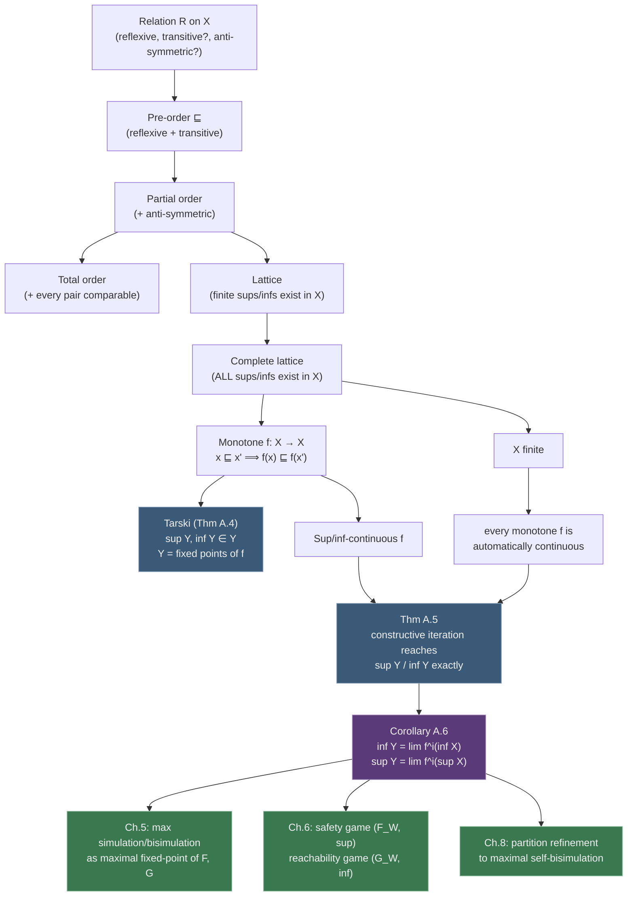

# Lattice and Fixed-Point Theory

[[book-guidelines|↩ Back to guidelines]]

## Why a control-theory book ends with an appendix on abstract order theory

Every substantive algorithm in this book — computing the largest simulation relation between two systems, computing the largest bisimulation, solving a safety game for the least restrictive controller, solving a reachability game, refining a partition until it becomes a bisimulation — has the same shape: *start somewhere, apply an operator repeatedly, stop when nothing changes, and trust that what you land on is the answer you actually wanted.* Chapter 5 defines an operator $F$ and says "the maximal simulation relation is $\lim_{i\to\infty}F^i(X_a\times X_b)$." Chapter 6 does the same thing with $F_W$ for safety games and $G_W$ for reachability games. Chapter 8's partition-refinement algorithm iterates a $\mathrm{Pre}$-based operator until the partition stabilizes.

None of that is justified by anything in Chapters 1–11. Those chapters use the pattern; they never prove it works. This appendix is where the proof actually lives, stripped down to the bare minimum structure needed to state it once and reuse it everywhere.

Here is the concrete thing that could go wrong without this appendix. Suppose you're computing the maximal simulation relation as an iterated intersection $Z_0 = X_a \times X_b$, $Z_{i+1} = F(Z_i)$. Three questions are silently being answered "yes" every time this is used in the book, and none of them is obvious from the construction alone:

1. **Does the limit exist at all?** If $Z_i$ keeps shrinking forever without settling, "the maximal simulation relation" isn't a well-defined object.
2. **If a limit exists, is it actually a fixed point** — i.e. does $F(Z_\infty) = Z_\infty$, or could the sequence merely converge to something $F$ still moves?
3. **Is the fixed point you reach the *right* one** — the maximal simulation relation, and not merely *some* simulation relation, or worse, not a simulation relation at all?

An algorithm that "iterates until it stops changing" and just declares victory is, without further justification, a heuristic. Tarski's fixed-point theorem (and its constructive companion, Theorem A.5) is what upgrades "iterate until it stops changing" from a heuristic into a theorem with a guaranteed, characterizable, terminating answer. This appendix is the load-bearing wall underneath the whole book's algorithmic content; everything else is a specific choice of lattice and a specific choice of monotone operator plugged into this one machine.

This is also, not coincidentally, the exact same machine underneath abstract interpretation in program analysis — a dataflow analysis is a monotone function on a lattice of abstract states, and the analysis result is the *least* fixed point reached by Kleene iteration from $\bot$. If you've seen worklist algorithms for reaching-definitions or constant propagation, you've already used Theorem A.5; Tabuada is teaching you the theorem those algorithms secretly depend on.

## Orders: the minimal vocabulary for "comparable"

Before you can talk about a supremum or an iteration converging "upward," you need a notion of "one thing being at least as big as another" that doesn't assume you're talking about numbers. The book builds this from a bare relation.

**Definition A.1.** A relation $R \subseteq X \times X$ on a set $X$ is:
- **reflexive** when $(x,x) \in R$ for every $x \in X$;
- **anti-symmetric** when $(x,x') \in R$ and $(x',x) \in R$ imply $x = x'$;
- **transitive** when $(x,x') \in R$ and $(x',x'') \in R$ imply $(x,x'') \in R$.

A **pre-order** on $X$, written $\sqsubseteq$, is a relation that is reflexive and transitive — nothing more. A pre-order that is *also* anti-symmetric is a **partial order**. A partial order where every two elements are comparable (for every $x, x'$, either $x \sqsubseteq x'$ or $x' \sqsubseteq x$) is a **total order**. The pair $(X, \sqsubseteq)$ with $\sqsubseteq$ a partial order is a **partially ordered set** (a poset).

The gap between pre-order and partial order is exactly the gap between "equivalent" and "equal." A pre-order lets you have $x \sqsubseteq x'$ and $x' \sqsubseteq x$ without $x = x'$ — two distinct elements that are mutually "no worse than" each other. This matters directly in this book: the *simulation pre-order* $\preceq_S$ between systems is a pre-order, not a partial order — $S_a \preceq_S S_b$ and $S_b \preceq_S S_a$ (i.e. bisimilarity, in a loose sense) doesn't make $S_a$ and $S_b$ the *same system*, only behaviorally indistinguishable ones. The lattice theory in this appendix, though, is stated for partial orders, because the object it actually gets applied to (subsets of a set, ordered by $\subseteq$) is anti-symmetric by construction — two different subsets are never mutually included in each other.

**What breaks without anti-symmetry:** if you tried to take a "supremum" in a pre-order that isn't a partial order, uniqueness fails — there could be two different least-upper-bounds that are pre-order-equivalent to each other but not equal, and "the" supremum stops being well-defined as a specific element. The book sidesteps this entirely by doing lattice theory only over partial orders.

Given $X' \subseteq X$ and $x \in X$, $x$ is the **supremum** of $X'$, $\sup X'$, when:
1. $\forall x' \in X'.\ x' \sqsubseteq x$ ($x$ is an upper bound), and
2. $\forall x'' \in X.\ (\forall x' \in X'.\ x' \sqsubseteq x'') \implies x \sqsubseteq x''$ ($x$ is the *least* upper bound).

**Infimum** is the exact dual: $x = \inf X'$ when $x$ is a lower bound for $X'$ and every other lower bound $x''$ satisfies $x'' \sqsubseteq x$ (the *greatest* lower bound).

### Grounding: orders as traits, not just numbers

The instinct to read "order" as "numbers you can compare with `<`" is exactly what this abstraction refuses. In Rust, the analogous distinction between `PartialOrd` and a genuine total order is already baked into the standard library, but the book's pre-order is even weaker than `PartialOrd` — it drops anti-symmetry, not just totality:

```rust
// A pre-order: reflexive + transitive, but NOT required to be antisymmetric.
// Two distinct values can be mutually "at least as good as" each other.
trait PreOrder {
    fn leq(&self, other: &Self) -> bool; // x ⊑ x'
}

// Example: simulation-style pre-order on finite automata states,
// where two distinct states can simulate each other without being equal.
#[derive(Clone, PartialEq, Debug)]
struct State(u32);

struct SimPreorder {
    // (a, b) present means a ⊑ b, i.e. a is simulated by b
    pairs: std::collections::HashSet<(State, State)>,
}

impl SimPreorder {
    fn leq(&self, a: &State, b: &State) -> bool {
        a == b || self.pairs.contains(&(a.clone(), b.clone()))
    }
    // Two mutually-simulating but distinct states are NOT equal —
    // this is precisely the pre-order/partial-order gap.
    fn mutually_similar_but_distinct(&self, a: &State, b: &State) -> bool {
        a != b && self.leq(a, b) && self.leq(b, a)
    }
}
```

In Lean, the standard library formalizes this exact hierarchy directly — `Preorder` (reflexive + transitive), then `PartialOrder extends Preorder` adding `le_antisymm`, then `LinearOrder extends PartialOrder` adding totality — which is a verbatim match for Definition A.1's chain of increasingly strong requirements, right down to which axiom is added at each step.

## Lattices: guaranteeing the sup and inf exist

A poset only guarantees you *can compare* elements; it says nothing about whether "the least upper bound of this subset" actually exists inside $X$. Lattices add that guarantee.

**Definition A.2.** A poset $(X, \sqsubseteq)$ is a **lattice** if for every *finite* $X' \subseteq X$, both $\sup X'$ and $\inf X'$ exist and belong to $X$. It is a **complete lattice** if this holds for *every* subset $X' \subseteq X$, finite or infinite.

The book's running example is $(2^Z, \subseteq)$ — the powerset of a set $Z$, ordered by inclusion — and it is a complete lattice for *any* set $Z$, finite or infinite. Concretely, $\sup\{A,B\} = A \cup B$ and $\inf\{A,B\} = A \cap B$. This is not a random example: every fixed-point computation later in the book (maximal simulation/bisimulation relations, sets of controllable states in a safety or reachability game) lives inside a powerset lattice — subsets of $X_a \times X_b$, or subsets of $X_a$ — ordered by $\subseteq$.

A **chain** is a totally ordered subset $X' \subseteq X$. A chain $\{x_i\}_{i\in\mathbb{N}}$ is **increasing** when $x_i \sqsubseteq x_{i+1}$ for all $i$, and **decreasing** when $x_{i+1} \sqsubseteq x_i$ for all $i$. Chains are the objects the *continuity* definitions below quantify over — they're the shape an iterative computation traces out.

**What breaks without completeness:** if $X$ were merely a lattice (finite sups/infs only) rather than a *complete* lattice, an infinite increasing chain $\{x_i\}_{i\in\mathbb{N}}$ might have no supremum in $X$ at all — the sequence could keep climbing forever with nothing to converge to. Tarski's theorem needs completeness precisely so that "the sup of the fixed-point set" and "the sup of an iteration sequence" are guaranteed to exist as actual elements of $X$, not just be undefined limits.

### Grounding: the powerset lattice as the working example

```python
# The lattice (2^Z, ⊆) for a small finite Z: sets ordered by inclusion,
# sup = union, inf = intersection. This is *the* lattice every fixed-point
# computation in the book (Chapters 5, 6, 8) actually runs on.

def sup(A: frozenset, B: frozenset) -> frozenset:
    return A | B  # least upper bound = union

def inf(A: frozenset, B: frozenset) -> frozenset:
    return A & B  # greatest lower bound = intersection

Z = frozenset({1, 2, 3, 4})
# Every subset of Z is an element of the lattice; Z itself is the top
# element (⊤ = sup of everything), and the empty set is the bottom
# element (⊥ = inf of everything).
```

In Rust, this is just `BTreeSet<T>` / `HashSet<T>` with `union`/`intersection` playing the role of `sup`/`inf` — the lattice structure isn't something you build, it's already sitting underneath the standard collection types; the appendix is naming the algebraic structure that was always there.

## Monotone, sup-continuous, and inf-continuous functions

**Definition A.3.** Let $(X, \sqsubseteq)$ be a complete lattice and $f: X \to X$. Then $f$ is:
- **monotone** if $x \sqsubseteq x' \implies f(x) \sqsubseteq f(x')$ for all $x, x' \in X$;
- **sup-continuous** if $f(\sup\{x_i\}_{i\in\mathbb{N}}) = \sup\{f(x_i)\}_{i\in\mathbb{N}}$ for every *increasing* chain $\{x_i\}_{i\in\mathbb{N}}$;
- **inf-continuous** if $f(\inf\{x_i\}_{i\in\mathbb{N}}) = \inf\{f(x_i)\}_{i\in\mathbb{N}}$ for every *decreasing* chain $\{x_i\}_{i\in\mathbb{N}}$.

Monotonicity alone is a weak requirement — it only says $f$ respects order locally, between pairs. Continuity is a much stronger, global statement: it says $f$ *commutes* with taking suprema (or infima) over an entire infinite chain, not just that it preserves the ordering between two points. This distinction is exactly why Tarski's theorem (existence) and Theorem A.5 (constructive computation) are two separate results rather than one: existence of extremal fixed points needs only monotonicity; *computing* them by iteration needs continuity.

**What breaks without monotonicity:** if $f$ weren't monotone, the iteration $Z_{i+1} = f(Z_i)$ starting from $\top$ (or $\bot$) wouldn't even trace out a chain — $Z_1$ and $Z_2$ could be incomparable, oscillating instead of climbing or descending, and "the limit" would be meaningless. Monotonicity is what guarantees $f(\bot) \sqsupseteq \bot$-style inequalities propagate consistently through repeated application (this is spelled out explicitly in the appendix's proof of Corollary A.6, using exactly this induction).

**What breaks without continuity (on an infinite lattice):** monotonicity alone guarantees a fixed point *exists* (Tarski), but says nothing about whether the naive iteration $\bot, f(\bot), f^2(\bot), \dots$ actually reaches it — the sequence could converge to something strictly below the true least fixed point, with $f$ still able to push it further, if $f$ doesn't commute with the sup of the chain. Continuity is precisely the property that rules this out.

## Tarski's fixed-point theorem (Theorem A.4)

A **fixed point** of $f: X \to X$ is $x \in X$ with $f(x) = x$.

> **Theorem A.4.** Let $(X, \sqsubseteq)$ be a complete lattice, $f: X \to X$, and $Y = \{x \in X \mid f(x) = x\}$ the set of all fixed points of $f$. If $f$ is monotone, then:
> - $\sup Y \in Y$, and $\sup Y = \sup\{x \in X \mid x \sqsubseteq f(x)\}$;
> - $\inf Y \in Y$, and $\inf Y = \inf\{x \in X \mid f(x) \sqsubseteq x\}$.

Read this slowly, because it is doing two different jobs at once:

1. **Closure.** $\sup Y$ and $\inf Y$ — the supremum and infimum of the *fixed-point set itself* — are not merely bounds on where fixed points live; they are themselves fixed points. $Y$, ordered by $\sqsubseteq$, is a complete lattice in its own right, with $\sup Y$ as its top element and $\inf Y$ as its bottom element. This answers question 3 from the introduction: the extremal object you reach really is *the* maximal (or minimal) fixed point, not just an upper bound on one.
2. **Characterization.** $\sup Y$ equals $\sup\{x \mid x \sqsubseteq f(x)\}$ — the supremum of all the *pre-fixed points* (elements $f$ doesn't shrink). Dually, $\inf Y$ equals the infimum of all *post-fixed points* ($f(x) \sqsubseteq x$, elements $f$ doesn't grow). This is precisely what Theorem 5.3 in Chapter 5 exploits: the operator $F$ characterizing simulation is built so that simulation relations are exactly the pre-fixed points $\{Z \mid Z \sqsubseteq F(Z)\}$, and Tarski's theorem then hands you, for free, that the supremum of *all* simulation relations — the maximal simulation relation — is itself a simulation relation and a fixed point of $F$.

Notice what this theorem does **not** claim: it says nothing about *how to compute* $\sup Y$ or $\inf Y$. Monotonicity alone gives existence and characterization, not an algorithm.

## Constructive computation by iteration (Theorem A.5)

> **Theorem A.5.** Let $(X, \sqsubseteq)$ be a complete lattice, $f: X \to X$, $Y$ the set of fixed points. If $f$ is sup-continuous, then
> $$\inf Y = \sup\big\{\inf X,\ f(\inf X),\ f^2(\inf X),\ \dots\big\}. \tag{A.1}$$
> Dually, if $f$ is inf-continuous, then
> $$\sup Y = \inf\big\{\sup X,\ f(\sup X),\ f^2(\sup X),\ \dots\big\}. \tag{A.2}$$

This is the theorem that turns Tarski's existence result into an actual algorithm: start at $\bot = \inf X$ (or $\top = \sup X$), repeatedly apply $f$, and the supremum (or infimum) of the resulting chain *is* the fixed point you want — not merely close to it, not merely a bound on it, exactly equal to it. Equation (A.1) computes the **least** fixed point by climbing up from the bottom; (A.2) computes the **greatest** fixed point by descending from the top.

### The finiteness shortcut, and why it justifies every algorithm in the book

The appendix then makes the observation that makes the whole rest of the book work:

> When $X$ is finite, any increasing or decreasing chain is necessarily finite — there is $k \in \mathbb{N}$ with $x_k = x_j$ for all $j \ge k$ — so $\sup\{x_i\}_{i=1,\dots,k} = x_k = \lim_{i\to\infty} x_i$. Consequently, **every monotone function on a finite lattice is automatically both sup-continuous and inf-continuous.**

The reasoning (spelled out in the source, reproduced here): starting from $\bot = \inf X$, monotonicity gives $\inf X \sqsubseteq f(\inf X)$ (since $\inf X$ is a lower bound on everything, it's certainly $\sqsubseteq f(\inf X)$), and then by induction using monotonicity again, $f^i(\inf X) \sqsubseteq f^{i+1}(\inf X)$ for every $i$ — so $\{f^i(\inf X)\}_{i\in\mathbb{N}}$ *is* an increasing chain. On a finite $X$, that chain must stabilize after finitely many steps at some $f^k(\inf X) = f^{k+1}(\inf X) = \dots$, and the stabilization point equals both the supremum of the chain *and* $\lim_{i\to\infty}f^i(\inf X)$. The dual argument, descending from $\top$, gives the same for the greatest fixed point.

**Corollary A.6** packages this: on a finite lattice, for monotone $f$,
$$\inf Y = \lim_{i\to\infty} f^i(\inf X), \qquad \sup Y = \lim_{i\to\infty} f^i(\sup X).$$

This is the exact sentence that licenses every "iterate until it stops changing" algorithm in Chapters 5, 6, and 8. Because every system in those chapters that gets subjected to fixed-point computation is *finite-state*, and the operators involved ($F$, $G$, $F_W$, $G_W$, $F_C$, $G_C$, the partition-refinement operator behind $\mathrm{Pre}$) are all monotone set operators on the powerset lattice $2^{X_a\times X_b}$ or $2^{X_a}$ — a finite lattice — Corollary A.6 fires automatically. You never have to separately verify sup- or inf-continuity for any specific algorithm in this book; finiteness of the state space hands it to you for free, and the loop terminates in a bounded number of steps (this is exactly why Chapter 5 calls the simulation/bisimulation computation *polynomial-time* — the chain length is bounded by $|X_a \times X_b|$).

**What breaks without finiteness:** on an infinite lattice, monotonicity is not enough to guarantee continuity — you would need to separately prove sup- or inf-continuity for each specific operator before Theorem A.5 applies at all, and even then the "iteration" might need to run through transfinite ordinals rather than just $\mathbb{N}$ to reach the fixed point (a subtlety the book sidesteps entirely by restricting every algorithmic result to finite-state systems). This is the precise mathematical reason Part III's finite-state constructions matter so much before Part IV even starts talking about approximation.

### Grounding: iterating to a fixed point on a finite lattice

A minimal worked example — computing reachable states of a finite graph by iterating a monotone `Post` operator on $2^X$ from the bottom, and computing a "safe" invariant region by iterating a monotone `Pre`-based operator from the top. This is literally a shrunk instance of Chapter 5's $F$ and Chapter 6's $F_W$.

```rust
use std::collections::{HashMap, HashSet};

type State = u32;

struct Graph {
    edges: HashMap<State, Vec<State>>,
}

impl Graph {
    // Least fixed point: reachable states from `init`, by iterating
    // Post(Z) = Z ∪ { x' | x ∈ Z, x -> x' } starting from ⊥ = init.
    // This is sup-continuous on the finite powerset lattice, so
    // Theorem A.5 / Corollary A.6 guarantees this loop reaches the
    // *exact* least fixed point, not an approximation.
    fn reachable(&self, init: &HashSet<State>) -> HashSet<State> {
        let mut z: HashSet<State> = init.clone(); // ⊥-ish starting point
        loop {
            let mut next = z.clone();
            for &x in &z {
                if let Some(succs) = self.edges.get(&x) {
                    next.extend(succs.iter().copied());
                }
            }
            if next == z {
                // Corollary A.6: the chain has stabilized -> this IS
                // the least fixed point, by finiteness of the state space.
                return z;
            }
            z = next;
        }
    }

    // Greatest fixed point: the maximal set of states from which every
    // path stays inside `safe` forever (Chapter 6's safety-game operator
    // F_W in miniature), by iterating
    // F_W(Z) = safe ∩ { x | Post(x) ⊆ Z } starting from ⊤ = safe.
    fn maximal_invariant(&self, safe: &HashSet<State>) -> HashSet<State> {
        let mut z: HashSet<State> = safe.clone(); // ⊤ = safe
        loop {
            let next: HashSet<State> = z
                .iter()
                .copied()
                .filter(|&x| {
                    self.edges
                        .get(&x)
                        .map_or(true, |succs| succs.iter().all(|s| z.contains(s)))
                })
                .collect();
            if next == z {
                return z; // greatest fixed point, by the dual argument
            }
            z = next;
        }
    }
}
```

The two loops are structurally identical — `reachable` climbs from $\bot$, `maximal_invariant` descends from $\top$ — because they *are* the same theorem (A.5/Corollary A.6) applied to dual operators. This mirrors abstract-interpretation dataflow analyses directly: a forward, may-analysis (like reaching definitions) is a least fixed point climbing from $\bot$; a backward or must-style analysis is a greatest fixed point descending from $\top$, and both terminate for exactly the reason Corollary A.6 gives — a monotone operator on a finite lattice.

In Lean, the cleanest formalization of the underlying claim is a statement about a monotone endofunction on a complete lattice type (Lean/Mathlib's `OrderHom` bundles a function together with its monotonicity proof, and `fixedPoints.completeLattice` in Mathlib packages exactly Theorem A.4's closure claim — that the fixed-point set of a monotone map on a complete lattice is itself a complete lattice, with top/bottom the greatest/least fixed points). Stating Theorem A.4 in Lean forces you to make explicit exactly what the book leaves as prose: `f` needs a `Monotone` proof obligation, `X` needs a `CompleteLattice` instance, and the theorem's conclusion is literally that `fixedPoints f` inherits a `CompleteLattice` structure from `X`.

## Structural summary



## Where this leads

This appendix is not optional background — it is the theorem every other fixed-point claim in the book is a corollary of:

- **Chapter 5** (Verification): the maximal simulation relation is defined as $Z = \lim_{i\to\infty}F^i(X_a\times X_b)$ (Theorem 5.3) and the maximal bisimulation relation analogously via $G$ (Theorem 5.6). These are literally Corollary A.6's $\sup Y = \lim_i f^i(\sup X)$, with $\sup X = X_a \times X_b$ (the top of the powerset lattice) and $f = F$ or $G$. Polynomial-time computability follows because the chain length is bounded by the finite state space.
- **Chapter 6** (Control): the safety-game operator $F_W$ gives its maximal fixed point by the same descending iteration (Theorem 6.6); the reachability-game operator $G_W$ gives its *minimal* fixed point by the dual, ascending iteration (Theorem 6.10) — and the fact that reachability needs the *least*, not greatest, fixed point is exactly why no least-restrictive controller exists for reachability games in general (a genuinely different extremal object with different monotonicity behavior with respect to controller permissiveness).
- **Chapter 8** ([[Exact-Symbolic-Models-for-Control|Exact symbolic models for control]]): Algorithm 8.1's partition-refinement loop, iterating the $\mathrm{Pre}$ operator until the partition stabilizes into a maximal self-bisimulation, is again Corollary A.6 — descending from the coarsest partition, guaranteed to stabilize because the set of partitions of a finite state space is itself a finite lattice.

For the **Static Analysis & Abstract Interpretation** focus area specifically: this appendix *is* the abstract-interpretation fixed-point theorem, taught in the vocabulary of control theory rather than program analysis. A Galois-connection-based dataflow analysis — computing a least fixed point of a monotone abstract transfer function over an abstract domain lattice, terminating because the domain is finite (or has finite ascending chains, the widening-operator escape hatch for when it doesn't) — is doing exactly Theorem A.5 and Corollary A.6. When you eventually implement invariant generation over an abstract lattice domain (interval domains, octagons, or the DFA-shaped abstract domains for data structures mentioned in the standing project), the termination and correctness argument you'll reach for is this appendix, not a bespoke one: monotone transfer function, finite (or finite-height) lattice, iterate from $\bot$, stop when stable, the result is provably the least fixed point — no more, no less.
