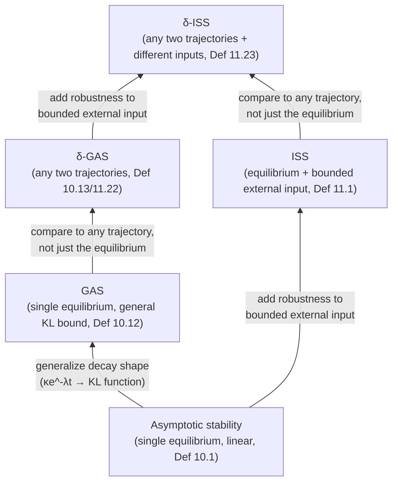

[[book-guidelines|↩ Back to guidelines]]

# Stability Theory for Approximate Abstraction

## Why does this topic exist at all?

The previous topic ([[Approximate-System-Relationships|Approximate System Relationships]]) gave us the *target*
relation: an $\varepsilon$-approximate bisimulation lets two systems disagree
on their outputs by at most $\varepsilon$, instead of demanding exact
agreement. That relaxation is what makes it plausible, for the first time in
the book, to relate an infinite-state dynamical system to a *finite*-state
symbolic model — Chapter 7's exact quotient constructions only worked for a
narrow class of "definable" dynamics (order-minimal, timed-automaton-shaped,
etc.), because exact bisimulation is a rigid, all-or-nothing requirement.

But relaxing the target relation is not, by itself, a construction. You still
need some structural property of the underlying dynamical system that lets
you actually *build* an $\varepsilon$-approximate bisimulation — some reason
why sampling the state space at a finite resolution $\eta$ and only checking
transitions every $\tau$ time units doesn't let the approximation error blow
up unboundedly as trajectories evolve. That property turns out to be
**stability**, in a precise, escalating hierarchy of senses. This article is
about the hierarchy itself — what each notion says, why the book needs
successively stronger versions of it as it moves from bare dynamical systems
to control systems with adversarial disturbances, and why (via Proposition
10.11 and Theorem 11.25) stability isn't just a convenient sufficient
condition here, but a *necessary* one. The actual machinery that turns a
Lyapunov function into a working symbolic-model construction — the quantized
systems $S_{\tau\eta}(\Sigma)$, Theorem 10.8, Theorem 11.12/11.14/11.18 — is
the subject of the sibling article on Approximate Symbolic Models; here we
only need to understand what the stability ingredient *is* and *why it must
be there*.

## The core intuition, before any symbols

Picture two trajectories of the same dynamical system starting at nearby but
distinct points. If the system is stable in the strongest useful sense, those
two trajectories never diverge — in fact they converge toward each other over
time. That is exactly the property an abstraction needs. When you replace the
exact continuous state $x$ with a nearby grid point $\hat x$ (the space
quantization error, of size at most $\eta$), you have effectively started a
*second*, slightly perturbed trajectory next to the real one. If the dynamics
amplified small differences, that $\eta$-sized error would grow without
bound as you let time run, and no finite grid resolution could keep the
abstraction within a fixed precision $\varepsilon$ forever. If instead the
dynamics *contracts* differences — nearby trajectories get closer, not
farther, apart — then the quantization error introduced at each sampling
step doesn't accumulate; it decays, and a fixed $\eta$ can guarantee a fixed
$\varepsilon$ for all time. Stability, in this reading, is precisely
"error-contracting dynamics." Everything below is this same idea, formalized
with increasing generality.

## Rung 1: asymptotic stability of a single equilibrium (§10.1)

Start with the simplest setting: a *linear* dynamical system $\Sigma =
(\mathbb{R}^n, A)$, i.e. $\dot\xi = A\xi$, with solution $\xi_x(t) = e^{At}x$.
The origin is always an equilibrium point here ($A\cdot 0 = 0$).

**Definition 10.1 (asymptotically stable equilibrium).** The equilibrium
$x_e = 0$ is *asymptotically stable* if there exist $\kappa, \lambda \in
\mathbb{R}^+$ such that for every $x \in \mathbb{R}^n$ and every $t \geq 0$:

$$\|\xi_x(t)\| \leq \kappa e^{-\lambda t}\|x\|.$$

Read this in words: every trajectory is bounded by $\kappa$ times its
starting distance from the origin, and that bound shrinks exponentially at
rate $\lambda$. Since $\lim_{t\to\infty}\kappa e^{-\lambda t}\|x\| = 0$, every
trajectory is squeezed to the equilibrium. When $\lambda$ is allowed to be
zero — no decay guaranteed, just boundedness — the weaker property is called
merely *stable*. This $\lambda$ (the decay rate) is the quantity that will
later do all the work of "absorbing" quantization error.

**Theorem 10.2** gives the purely algebraic test for the linear case: $x_e =
0$ is asymptotically stable iff every eigenvalue of $A$ has negative real
part. This is the classical linear-systems-theory fact — nothing new is
being invented here, Tabuada is just fixing notation for what follows.

**What breaks without this.** If $A$ has an eigenvalue with non-negative real
part, some direction in state space either stays constant or grows. Any
quantization error injected along that direction never shrinks (or actively
grows), so no fixed grid resolution $\eta$ can bound the long-run
approximation error by a fixed $\varepsilon$ — the abstraction becomes
invalid arbitrarily far out in time. Asymptotic stability is what turns "the
error is bounded at each step" into "the error stays bounded forever."

## Lyapunov functions: the certificate, not just the eigenvalue test

The eigenvalue test only works for *linear* systems, because only there does
$e^{At}$ have a closed algebraic form. Nonlinear systems (and later, systems
under adversarial disturbance) need a different, more general certificate of
stability — the **Lyapunov function**. This is the central object of the
entire topic; every subsequent stability notion in this article is
characterized by some variant of it.

**Definition 10.3 (Lyapunov function).** For $\Sigma = (\mathbb{R}^n, A)$, a
function $V: \mathbb{R}^n \to \mathbb{R}$ is a Lyapunov function if:

1. $V$ is continuous on $\mathbb{R}^n$, smooth away from $0$;
2. $V(x) \geq 0$ for all $x$;
3. $V(x) = 0 \implies x = 0$ (so $V$ genuinely measures "distance from the
   equilibrium," not just some auxiliary quantity);

and there exists $\lambda \in \mathbb{R}^+$ such that for all $x \neq 0$:

$$\frac{\partial V}{\partial x}Ax \leq -\lambda V(x). \tag{10.4}$$

The left side, $\frac{\partial V}{\partial x}Ax$, is exactly $\frac{d}{dt}
V(\xi(t))$ evaluated along a trajectory — the chain rule applied to $V
\circ \xi$. So (10.4) says: **$V$ decreases along every trajectory, at a rate
proportional to its own current value.** Integrating the resulting
differential inequality gives $V(\xi(t)) \leq e^{-\lambda t}V(\xi(0))$ — $V$
decays exponentially. Think of $V$ as an energy function: the system
dissipates energy over time, and that dissipation is *provable* just by
checking a single algebraic inequality on the vector field, without having to
solve the differential equation. When $\lambda = 0$ is allowed, $V$ is a
*weak* Lyapunov function (matching the "merely stable" case above).

**Theorem 10.4** closes the loop: for linear dynamical systems, asymptotic
stability holds *iff* a Lyapunov function exists (and stability holds iff a
weak Lyapunov function exists). This "iff" matters enormously — a Lyapunov
function isn't just *a* sufficient technique among several; it is exactly
equivalent to the stability property itself. That equivalence is what
eventually licenses treating "does this system admit a Lyapunov function?"
as *the* question to ask, rather than one convenient proxy for stability.

**Proposition 10.5** then shows that whenever a Lyapunov function exists for
a linear system, one can always be taken in the quadratic form $V(x) =
\sqrt{x^TPx}$ for some symmetric positive-definite matrix $P$ — and such
quadratic-form Lyapunov functions satisfy two inequalities that do the heavy
lifting in every later approximation-error bound:

$$\underline\alpha\|x\| \leq V(x) \leq \overline\alpha\|x\| \tag{10.5}$$
$$V(x - x') - V(x - x'') \leq \gamma\|x' - x''\| \tag{10.6}$$

(10.5) says $V$ is *norm-equivalent*: it can be sandwiched by (scaled)
Euclidean distance in both directions, so you can freely convert between "how
far apart are two states" and "how large is $V$ of their difference." (10.6)
is a *generalized triangle inequality* — indeed, if $V(x-x') = \|x-x'\|$
exactly, (10.6) reduces to the ordinary triangle inequality with $\gamma=1$.
This is the technical glue that (in the sibling article) lets quantization
error, measured in Euclidean distance, be converted into $V$-decay, and back
into an $\varepsilon$-precision bound on outputs.

**Grounding.** This is a natural target for direct numerical simulation.
Consider $\dot\xi = A\xi$ for a stable $2\times2$ $A$ (eigenvalues with
negative real part) versus an unstable one, with $V(x) = \sqrt{x^TPx}$ solved
from a Lyapunov equation $A^TP + PA = -Q$ for some $Q \succ 0$:

```python
import numpy as np
from scipy.linalg import solve_lyapunov, expm

def simulate(A, x0, dt=0.01, steps=500):
    P = solve_lyapunov(A.T, -np.eye(A.shape[0]))  # A^T P + P A = -I
    V = lambda x: np.sqrt(x @ P @ x)
    xs, Vs = [x0], [V(x0)]
    Phi = expm(A * dt)
    x = x0
    for _ in range(steps):
        x = Phi @ x
        xs.append(x); Vs.append(V(x))
    return np.array(xs), np.array(Vs)

A_stable   = np.array([[-1.0, 2.0], [-2.0, -1.0]])   # eigenvalues -1 ± 2i
A_unstable = np.array([[ 0.5, 2.0], [-2.0,  0.5]])   # eigenvalues 0.5 ± 2i
```

Plotting `Vs` for the stable case shows monotone exponential decay
(inequality 10.4 holding numerically along the trajectory); the unstable case
shows `Vs` growing — a direct, visual falsification of (10.4) for any
candidate $\lambda > 0$. This is worth actually running: it makes "$V$
decreases along trajectories" a felt fact rather than an algebraic one.

## Rung 2: from one equilibrium to global comparisons — class $\mathcal{K}$, $\mathcal{K}_\infty$, $\mathcal{KL}$ (§10.4)

Everything so far is tied to linear systems and a single distinguished
equilibrium at the origin, with a very specific decay shape ($\kappa
e^{-\lambda t}$). Nonlinear systems need to talk about decay *qualitatively*
— "eventually shrinks to zero," "grows unboundedly with the input size" —
without committing to a specific exponential rate, because a general
nonlinear system's transient behavior need not be a clean exponential at all.
Comparison functions are the vocabulary for this.

- A continuous $\gamma: \mathbb{R}_0^+ \to \mathbb{R}_0^+$ is **class
  $\mathcal{K}$** if it is strictly increasing and $\gamma(0) = 0$. Think:
  "a well-behaved notion of magnitude" — it turns a distance into another
  nonnegative quantity, monotonically, vanishing exactly at zero.
- It is **class $\mathcal{K}_\infty$** if additionally $\gamma(r) \to \infty$
  as $r \to \infty$ — it doesn't saturate, so it can bound arbitrarily large
  deviations, not just small ones (needed to sandwich a Lyapunov function
  from *above* as well as below, globally).
- A continuous $\beta: \mathbb{R}_0^+ \times \mathbb{R}_0^+ \to
  \mathbb{R}_0^+$ is **class $\mathcal{KL}$** if, for each fixed second
  argument $s$, $\beta(\cdot, s)$ is class $\mathcal{K}_\infty$ in its first
  argument, and for each fixed first argument $r$, $\beta(r,\cdot)$ is
  decreasing in $s$ with $\beta(r,s) \to 0$ as $s \to \infty$. This is
  exactly "a distance-and-time bound that shrinks in time and grows with
  initial distance" — the qualitative shape of $\kappa e^{-\lambda t}\|x\|$,
  generalized so the decay need not be exponential.

These are the "right abstract vocabulary" the topic asks for: rather than
proving a specific rate, you only need to exhibit *some* function with the
right shape. This is analogous to how a type-checker might only need "some
well-founded measure decreases" rather than a specific numeric bound —
$\mathcal{KL}$ functions are stability theory's well-founded-decrease
certificates.

## Rung 3: globally asymptotically stable (GAS) — comparing to the equilibrium

**Definition 10.12 (GAS).** An equilibrium $x_e$ of $\Sigma = (\mathbb{R}^n,
f)$ (now possibly nonlinear) is *globally asymptotically stable* if there is
a class $\mathcal{KL}$ function $\beta$ such that for all $t \geq 0$, $x \in
\mathbb{R}^n$:

$$\|\xi_x(t) - x_e\| \leq \beta(\|x - x_e\|, t).$$

Definition 10.1 is exactly the special case $x_e = 0$, $\beta(r,s) = \kappa
e^{-\lambda s}r$ — a *specific* $\mathcal{KL}$ function. GAS is the same
qualitative statement, freed from the exponential-decay and linearity
assumptions.

## Rung 4: incremental GAS ($\delta$-GAS) — comparing any two trajectories (§10.4)

GAS still only compares an arbitrary trajectory *to the fixed equilibrium
trajectory*. But recall the intuition from the top of this article: what the
abstraction actually needs is that any two nearby trajectories — the real
one and the grid-quantized one — converge toward *each other*, not toward
some designated rest point. That's a strictly stronger, and structurally
different, requirement, because the "reference" trajectory is no longer
fixed at the origin — it is itself moving.

**Definition 10.13 ($\delta$-GAS).** $\Sigma = (\mathbb{R}^n, f)$ is
*incrementally globally asymptotically stable* if it is forward complete and
there is a class $\mathcal{KL}$ function $\beta$ such that for all $t \geq
0$, $x, x' \in \mathbb{R}^n$:

$$\|\xi_x(t) - \xi_{x'}(t)\| \leq \beta(\|x-x'\|, t). \tag{10.20}$$

For linear systems, $\delta$-GAS collapses back to GAS/asymptotic stability:
$\|\xi_x(t)-\xi_{x'}(t)\| = \|e^{At}(x-x')\| \leq \kappa e^{-\lambda t}\|x -
x'\|$ follows directly from linearity, since the difference of two
trajectories of a *linear* system is itself a trajectory of the same linear
system starting at $x - x'$. That collapse is a genuinely important fact: it
means the entire escalation from GAS to $\delta$-GAS is invisible for linear
systems — the two are the same thing — and only becomes a real, separate
requirement once nonlinearity is introduced.

**What breaks without incrementality, for nonlinear systems.** For a
nonlinear $f$, GAS of one equilibrium says nothing about how two *other*
nearby trajectories relate to each other — you could have a GAS equilibrium
while a different pair of nearby trajectories diverges badly (e.g. limit
cycles or other attractors elsewhere in state space). Since the quantization
scheme compares the *real* trajectory to its own nearby quantized shadow —
not to a fixed equilibrium — GAS alone gives no bound on that gap. Only
$\delta$-GAS, which bounds the distance between *any* two trajectories,
supplies the needed guarantee. This is exactly why the topic list frames
$\delta$-GAS as "the stronger notion needed for the nonlinear generalization"
of the linear construction.

**Definition 10.14 ($\delta$-GAS Lyapunov function).** A smooth $V:
\mathbb{R}^n \times \mathbb{R}^n \to \mathbb{R}_0^+$ is a $\delta$-GAS
Lyapunov function if there exist $\mathcal{K}_\infty$ functions
$\underline\alpha, \overline\alpha$ and $\lambda \in \mathbb{R}^+$ with, for
all $x, x'$:

$$\underline\alpha(\|x-x'\|) \leq V(x,x') \leq \overline\alpha(\|x-x'\|)$$
$$\frac{\partial V}{\partial x}f(x) + \frac{\partial V}{\partial x'}f(x') \leq -\lambda V(x,x').$$

Notice the shape: $V$ is now a function of a *pair* of states, sandwiched
(via class $\mathcal{K}_\infty$ functions rather than fixed constants) by
their distance, and its total derivative along *both* trajectories
simultaneously is dissipative. This is the natural two-argument
generalization of Definition 10.3.

**Theorem 10.15.** $\Sigma$ is $\delta$-GAS iff it admits a $\delta$-GAS
Lyapunov function — the same clean "iff" as Theorem 10.4, one level up the
hierarchy.

**Grounding.** The *definition* of $\delta$-GAS (10.13) is a clean target for
a formal statement in Lean — it is a $\forall$-quantified inequality over a
$\mathcal{KL}$ function with no algorithmic content, exactly the shape a
proof assistant is comfortable stating and reasoning about (even if
constructing the witnessing $\beta$ or $V$ for a specific $f$ is analytic
work outside Lean's comfort zone):

```lean
-- sketch: not a full formalization of ℝⁿ dynamics, but the shape of the definition
def KLFunction (β : ℝ → ℝ → ℝ) : Prop :=
  (∀ s, StrictMonoOn (β · s) (Set.Ici 0)) ∧ (∀ s, β 0 s = 0) ∧
  (∀ r, ∀ s₁ s₂, s₁ ≤ s₂ → β r s₂ ≤ β r s₁) ∧
  (∀ r, Filter.Tendsto (β r) Filter.atTop (nhds 0))

def IncrementallyGAS (ξ : ℝ → ℝ → ℝ → ℝ) : Prop :=  -- ξ x t = trajectory from x at time t, simplified
  ∃ β, KLFunction β ∧ ∀ (t : ℝ), 0 ≤ t → ∀ (x x' : ℝ),
    |ξ x t - ξ x' t| ≤ β |x - x'| t
```

The point of writing it this way is that the *definition itself* is exactly
what a kernel type-checker is built to check — an existential over a
witness function satisfying a universally-quantified inequality — the same
shape you'll build when specifying soundness obligations for the refinement
type checker.

## Rung 5: input-to-state stability (ISS) — robustness to disturbance (§11.1)

Chapter 10's dynamical systems have no external input at all — $\dot\xi =
A\xi$ is autonomous. Chapter 11 moves to *control* systems, $\dot\xi = A\xi +
C\chi + D\delta + h$, with a control input $\chi$ the designer commands and a
disturbance input $\delta$ that is adversarial/unpredictable. Asymptotic
stability by itself says nothing about what happens once an external input is
continuously perturbing the trajectory — a system can be perfectly stable
with zero input and still be thrown arbitrarily far off course by a bounded
but sustained disturbance, if there is no bound relating disturbance
magnitude to state deviation. **Input-to-state stability** is exactly the
missing property: *bounded* inputs produce *bounded* deviation, in a
quantified way.

**Definition 11.1 (ISS).** A linear control system $(\mathbb{R}^n, C, D, A,
\mathcal{C}, \mathcal{D})$ is ISS if there exist $\kappa, \lambda, \rho_c,
\rho_d \in \mathbb{R}^+$ such that for any $x$, any control curve $\chi \in
\mathcal{C}$, any disturbance curve $\delta \in \mathcal{D}$, and any $t \geq
0$:

$$\|\xi_x^{\chi\delta}(t)\| \leq \kappa e^{-\lambda t}\|x\| + \rho_c\|\chi\| + \rho_d\|\delta\|. \tag{11.3}$$

This is (10.3) with two extra additive terms: the state is still exponentially
forgetting its own initial condition, but now also picks up a contribution
proportional to the *supremum norm* of the control and disturbance signals
over the run. Small/bounded inputs produce a proportionally small/bounded
contribution to the trajectory — that's the entire content of "robustness to
input" made precise.

**Definition 11.2 (ISS-Lyapunov function)** mirrors Definition 10.3 with the
input terms folded into the dissipation inequality:

$$\frac{\partial V}{\partial x}(Ax + Cc + Dd) \leq -\lambda V(x) + \sigma_c\|c\| + \sigma_d\|d\|. \tag{11.4}$$

$V$ still decreases at rate $\lambda$ along the *unforced* dynamics, but the
input terms can inject energy back in, bounded by their own magnitude.
Integrating gives $V(\xi(t)) \leq e^{-\lambda t}V(\xi(0)) +
\frac{\sigma_c}{\lambda}\|\chi\| + \frac{\sigma_d}{\lambda}\|\delta\|$ — the
same "forgetting plus bounded contribution" shape as (11.3), now at the level
of $V$ rather than raw distance.

**Theorem 11.3.** A linear control system is ISS iff it admits an
ISS-Lyapunov function — again a clean equivalence, one level up from Theorem
10.4. The book also notes (without separately numbering it) a fact that
collapses the check back to something familiar: for *linear* control
systems, ISS holds iff the origin is asymptotically stable for the
*unforced* system $(\mathbb{R}^n, A)$ — so Theorem 10.2's eigenvalue test
still suffices to decide ISS in the linear case; the presence of bounded
inputs doesn't change what stabilizes the system, only how large the
resulting deviation can be.

## Rung 6: incremental ISS ($\delta$-ISS) — both generalizations at once (§11.6)

Put the last two generalizations together — incrementality (comparing two
trajectories, not one to the equilibrium) and input-robustness (bounded
external disturbance) — and you get the notion the book ultimately needs for
nonlinear *control* systems.

**Definition 11.22 ($\delta$-GAS for control systems)** restates 10.13 with
an input $\upsilon \in \mathcal{U}$ common to both trajectories:
$\|\xi_{x\upsilon}(t) - \xi_{x'\upsilon}(t)\| \leq \beta(\|x-x'\|, t)$.

**Definition 11.23 ($\delta$-ISS).** $\Sigma = (\mathbb{R}^n, \mathcal{U},
f)$ is *incrementally globally input-to-state stable* if forward complete and
there exist a class $\mathcal{KL}$ function $\beta$ and a class
$\mathcal{K}_\infty$ function $\rho$ such that for all $t \geq 0$, $x, x'$,
and *possibly different* inputs $\upsilon, \upsilon'$:

$$\|\xi_{x\upsilon}(t) - \xi_{x'\upsilon'}(t)\| \leq \beta(\|x-x'\|, t) + \rho(\|\upsilon-\upsilon'\|). \tag{11.29}$$

Note the structure: setting $\upsilon = \upsilon'$ collapses (11.29) to
(11.28), so **$\delta$-ISS implies $\delta$-GAS** — it is strictly the
stronger property, exactly as ISS is strictly stronger than asymptotic
stability. This is the top of the hierarchy the topic asks you to build:



Each arrow is a "what breaks without this" story you've now seen twice: drop
incrementality and a quantization scheme that shadows a *moving* real
trajectory has no guarantee; drop input-robustness and an adversarial
disturbance (or, symmetrically, a piecewise-constant *quantized* control
input standing in for a continuous one) can push the abstraction error
unboundedly; need both nonlinearity and disturbance handled at once, and only
$\delta$-ISS supplies the guarantee.

**Definition 11.24 ($\delta$-GAS / $\delta$-ISS Lyapunov functions for
control systems)** extends Definition 10.14 exactly the way Definition 11.2
extended Definition 10.3 — a $\delta$-ISS Lyapunov function adds a
$\sigma(\|u-u'\|)$ slack term to the dissipation inequality, mirroring
(11.4)'s $\sigma_c\|c\|+\sigma_d\|d\|$ term.

**Theorem 11.25** is the capstone equivalence: for a control system $\Sigma =
(\mathbb{R}^n, \mathcal{U}, f)$,
1. if inputs range over a *compact* set, $\Sigma$ is $\delta$-GAS iff it
   admits a $\delta$-GAS Lyapunov function;
2. if inputs range over a *closed, convex* set containing the origin and
   $f(0,0)=0$, $\Sigma$ is $\delta$-ISS *if* it admits a $\delta$-ISS
   Lyapunov function; and if inputs range over a compact set, that
   implication becomes an equivalence.

This is the nonlinear-control-system analogue of Theorem 10.4/10.15/11.3 —
the final rung of the "characterize stability by a Lyapunov-style dissipation
inequality" ladder this whole topic has been building.

## The deep part: these conditions are *necessary*, not just sufficient

Everything so far reads as: "if you have this stability property, you can
build a Lyapunov function, and (per the sibling article) that Lyapunov
function is exactly the ingredient a construction like Theorem 10.8 needs to
build an $\varepsilon$-approximate bisimulation." That's a one-directional,
constructive story — stability is *sufficient*. The genuinely striking result
in this topic is that it is also, in a precise sense, *necessary*: there is
no way to get an $\varepsilon$-approximate bisimulation, for every desired
precision, without some form of stability holding.

**Proposition 10.11.** Consider an affine dynamical system $\Sigma =
(\mathbb{R}^n, A, h)$. If $(\mathbb{R}^n, A)$ admits a weak Lyapunov function,
then for any $\varepsilon, \tau$ the relation $R_\varepsilon = \{(x_\tau,
x'_\tau) : V(x_\tau - x'_\tau) \leq \overline\alpha\varepsilon\}$ is an
$\varepsilon$-approximate bisimulation between $S_\tau(\Sigma)$ and itself
(the forward direction — nothing new relative to Theorem 10.8's mechanism).

**The converse is the point.** Suppose there is a *single* constant
$\overline\alpha$ such that, for *every* $\varepsilon \in \mathbb{R}^+$ and
every $\tau \in \mathbb{R}^+$, *some* $\varepsilon$-approximate bisimulation
$R_\varepsilon$ between $S_\tau(\Sigma)$ and itself exists, satisfying the
technical closure condition $\|x_\tau - x'_\tau\| \leq \overline\alpha
\varepsilon \implies (x_\tau, x'_\tau) \in R_\varepsilon$ — i.e., a family of
approximate self-bisimulations exists at *every* precision, uniformly. Then
$(\mathbb{R}^n, A)$ **must** admit a weak Lyapunov function, hence (by
Theorem 10.4) the origin must be at least stable. The proof is a clean
argument by specialization: fix any $x$, set $\varepsilon = \|x\|/\overline
\alpha$ so that $(x, 0) \in R_\varepsilon$ by the closure assumption; since
$R_\varepsilon$ is a simulation relation, the $0$-trajectory (which stays at
the origin forever) must be matched by transitions from $x$'s trajectory
within precision $\varepsilon$ for all time — which is exactly the statement
$\|\xi_x(t)\| \leq \varepsilon = \|x\|/\overline\alpha$ for all $t$, i.e.
Definition 10.1 with $\kappa = 1/\overline\alpha$ and $\lambda = 0$: *stable*
in the sense of Definition 10.1.

**Theorem 11.25** delivers the parallel necessity result on the control side:
because it states $\delta$-GAS *iff* a $\delta$-GAS Lyapunov function exists
(under the compactness hypothesis), and because (per the sibling article's
Theorem 11.12/11.14) it is exactly a $\delta$-(G/I)AS Lyapunov function that
the symbolic-model construction consumes, the existence of the needed
approximate-bisimulation machinery for nonlinear control systems is tied,
both ways, to the existence of the Lyapunov certificate — you cannot have one
without the other.

Why does this matter beyond tidiness? It means Lyapunov functions in this
theory are not "a typical weapon in the control theorist's arsenal" deployed
because it happens to make the proof work (the book's own words, in the
Chapter 10 notes) — they are *forced* on you by the problem itself. Any
alternative technique for constructing finite-state approximate abstractions
of a dynamical system, however different it looks on the surface, is
secretly discovering something Lyapunov-function-equivalent, because
Proposition 10.11 shows there is no way around it. This is the kind of result
that tells you where the real mathematical content of a problem lives — not
in the particular construction (grid quantization, time sampling) but in the
stability property the construction is exploiting.

## Where this leads

This topic supplies the *concepts* — the ladder from asymptotic stability up
through $\delta$-ISS, the class $\mathcal{K}/\mathcal{K}_\infty/\mathcal{KL}$
vocabulary for stating them without committing to a specific rate, and the
Lyapunov-function characterizations (Theorems 10.4, 10.15, 11.3, 11.25) that
make each one checkable. The sibling article, *Approximate Symbolic Models
for Verification and Control*, is where these concepts become an actual
compiler pass on dynamical systems: it takes a Lyapunov function as an input
and outputs a finite-state (or countable-state) system
$S_{\tau\eta}(\Sigma)$ together with a proof (Theorem 10.8, Theorem
11.12/11.14/11.18) that it is $\varepsilon$-approximately bisimilar to the
original — plus the switched-system extension (common Lyapunov functions,
dwell time) that Chapter 11 closes with. Understanding *why* stability is the
right and necessary ingredient, established here, is what makes that
construction legible rather than a bag of inequalities to memorize.
