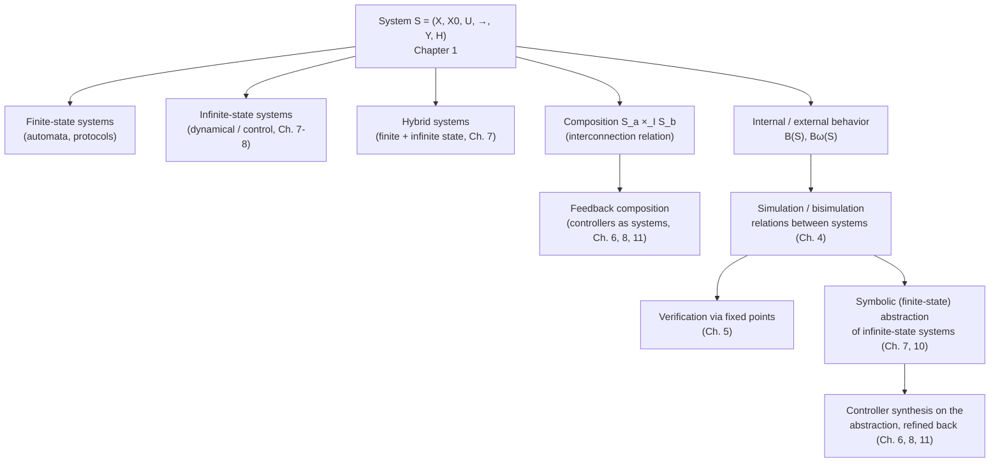

[[book-guidelines|↩ Back to guidelines]]

# Systems as the Common Mathematical Model

## Why a verification book starts by defining "system" at all

Here is the problem Tabuada is solving before he solves anything else. A digital communication protocol, a software averaging loop, the national-income equations of a toy macroeconomy, the Euler equations of a spinning rigid body, a real-time task scheduler with clocks, and a boost DC-DC power converter have, on the surface, nothing in common. One is a finite automaton you'd draw as circles and arrows. Another is a difference equation over $\mathbb{R}^2$. Another mixes discrete mode-switches with continuous differential flow. If you want a single verification and control theory that says something about *all* of them — safety, equivalence, controller synthesis — you cannot write five separate theories and hope the seams line up. You need one mathematical object general enough to swallow every one of these phenomena as a special case, equipped with just enough structure that you can still ask meaningful questions ("is this state reachable," "does this system's behavior match that specification," "can I design a controller") on the object itself, independent of whether the concrete phenomenon underneath is a Boolean circuit or a nonlinear ODE.

That object is what Tabuada calls a **system**. It is deliberately not "an automaton" (too finite-state-flavored) and not "a dynamical system" (too continuous-flavored) — it's the common ancestor type both specialize from. If you've built compilers or type checkers, the analogous move is familiar: you don't write a separate type checker for every surface syntax: you lower everything to one core IR (say, a small typed lambda calculus) and write your algorithms once against the IR. A `system` here is that IR for hybrid dynamics. Everything downstream in the book — simulation, bisimulation, verification games, controller synthesis, symbolic abstraction — is written once, against this one interface, and then instantiated against timed automata, linear control systems, or nonlinear ODEs by showing each of those *is* a system.

## The core definition: a system as a labeled transition structure

Tabuada's **Definition 1.1**:

> A system $S$ is a sextuple $(X, X_0, U, \to, Y, H)$ consisting of:
> - a set of states $X$;
> - a set of initial states $X_0 \subseteq X$;
> - a set of inputs $U$;
> - a transition relation $\to \, \subseteq X \times U \times X$;
> - a set of outputs $Y$;
> - an output map $H : X \to Y$.

Read this the way you'd read a `struct` before you read the operations that act on it. States $X$ are the system's *internal*, hidden configuration — think of them as private fields. Outputs $Y$, produced by $H$, are what's *externally visible* — think of them as the public API surface you actually get to observe. This states/outputs split is doing real work: it's what lets a hybrid state (finite mode, real-valued clock) be internally rich while exposing to the outside world only, say, whether an alarm has fired. If you were sketching this in Rust, the shape is close to a labeled transition system trait:

```rust
struct System<X, U, Y> {
    initial: HashSet<X>,           // X0 ⊆ X
    transition: HashSet<(X, U, X)>, // → ⊆ X × U × X   (a *relation*, not a function)
    output: fn(&X) -> Y,            // H : X → Y, total on all of X
}
```

A transition $(x, u, x') \in \to$ is written $x \xrightarrow{u} x'$; $x'$ is called a **$u$-successor** of $x$, $x$ a **$u$-predecessor** of $x'$. Tabuada writes $\mathrm{Post}_u(x)$ for the set of $u$-successors of $x$, and $U(x)$ for the set of inputs $u$ for which $\mathrm{Post}_u(x) \neq \emptyset$.

### Why a relation, not a function — the first "what breaks without this" moment

This is worth dwelling on because it's a genuine design decision, not incidental notation, and the book-guidelines' own Key Question 1 flags exactly this. If transitions were a function $X \times U \to X$, every state-input pair would determine a *unique* next state. That's fine for describing deterministic physics in isolation, but it collapses the moment you need to model:

- **nondeterminism from an unmodeled environment** — e.g. the receiver in the communication-protocol example, where "bad" vs. "good" reception isn't something the sender's own model can predict;
- **disturbances** — an adversarial or unknown perturbation acting alongside a controllable input;
- **underspecified controllers** — a controller that has *not yet* committed to a single choice among several legal ones (this becomes essential once alternating simulation and controller synthesis show up in Chapters 4–6).

A relation lets $(x, u)$ have zero, one, or many successors, and that headroom is what all of Parts II–IV eventually spend. If you're building a verifier in Rust, this is precisely the distinction between `fn step(&self) -> State` (deterministic small-step semantics) and `fn step(&self) -> Vec<State>` or a Kripke-structure-style `successors: HashSet<(State, State)>` (nondeterministic operational semantics, or exactly a CHC-style relational transition constraint if you're doing constrained-Horn-clause invariant generation) — the same fork every operational-semantics or abstract-interpretation implementer hits.

**Blocking / nonblocking, deterministic / output-deterministic.** With $\mathrm{Post}_u$ and $U(x)$ in hand, the book layers on a small vocabulary of structural properties:

- **Blocking**: some $x \in X$ has $U(x) = \emptyset$ (no outgoing transition for any input) — execution can get stuck.
- **Nonblocking**: every $x \in X$ has $U(x) \neq \emptyset$.
- **Deterministic**: for every $x, u$, at most one $u$-successor exists ($x \xrightarrow{u} x'$ and $x \xrightarrow{u} x''$ force $x' = x''$).
- **Output-deterministic**: $H|_{X_0}$ is injective, and any two $u$/$u'$-successors of $x$ that happen to produce the *same output* are forced to be the *same state* ($H(x') = H(x'') \Rightarrow x' = x''$).

Output-determinism is the subtler one and it matters a lot later (Chapter 5's Myhill–Nerode construction leans on it): a system can be *nondeterministic* in its internal transitions yet still be *output-deterministic*, if every genuinely distinct successor is externally distinguishable by output. The book's running example (Figure 1.1) is exactly this — two $u_0$-successors of $x_1$ exist ($x_1$ and $x_3$), so the system is nondeterministic, but they carry different outputs, so it's still output deterministic. The payoff, stated but not yet proved in Chapter 1, is that for an output-deterministic system a finite *external* behavior $y_0 y_1 \dots y_n$ uniquely determines the *internal* state trajectory that produced it — you can always replay from outputs alone. That's the property a verifier needs if it wants to reason about "what the system does" purely at the level of observable traces.

**Shorthand notations.** When some of the six components are trivial, the book drops them: $S = (X, U, \to, Y, H)$ when $X_0 = X$; $S = (X, X_0, U, \to)$ when $Y = X$ and $H = 1_X$ (identity); $S = (X, U, \to)$ when additionally $X_0 = X = Y$. Keep this in mind reading later chapters — a "system" written as a triple is not a different kind of object, just one where states are fully observable and always initial.

## Finite-state versus infinite-state, and why "time as input" is the crucial trick

**Finite-state**: $X$ is a finite set (e.g. a digital circuit's memory contents, a protocol's control states). **Infinite-state**: $X$ is not finite — most commonly $X = \mathbb{R}^n$, the state space of a differential or difference equation. Tabuada is careful about a linguistic point that's easy to trip over: strictly, a *state* (a bare element of a set) is neither finite nor infinite — only the *set* $X$ has that property. The book deliberately abuses language and calls a state "finite" or "infinite" depending on whether its containing set is, because that abuse turns out to be indispensable vocabulary for the entire book (you'll see "the finite part of the state" and "the infinite part of the state" throughout the hybrid-system material).

This finite/infinite split cross-cuts the discrete/continuous **time** distinction — and reconciling those two axes is the book's second key move (again a book-guidelines Key Question). For a [[Exact-Symbolic-Models-for-Control#Continuous-time|continuous-time]] dynamical system, e.g. Euler's rigid-body equations
$$
\dot\xi_1 = \tfrac{I_2-I_3}{I_1}\xi_2\xi_3,\quad \dot\xi_2 = \tfrac{I_3-I_1}{I_2}\xi_3\xi_1,\quad \dot\xi_3 = \tfrac{I_1-I_2}{I_3}\xi_1\xi_2,
$$
Tabuada sets $U = \mathbb{R}_0^+$ (nonnegative reals) and declares $x \xrightarrow{\tau} x'$ to hold exactly when a solution curve $\xi$ of the ODE satisfies $\xi(0)=x,\ \xi(\tau)=x'$. In words: **the input *is* the elapsed time**, and taking a "$\tau$-labeled transition" means "flow forward by $\tau$ time units." This is the trick that lets one uniform notion of "input" cover both a discrete automaton's symbolic actions (`send`, `ack`, `bad`) and a continuous flow's duration — they're both just elements of $U$ feeding the relation $\to$. It also automatically buys you two structural properties for free: existence and uniqueness of ODE solutions makes the resulting system **nonblocking and deterministic** — you always can advance by some $\tau$, and the state you land at is unique.

The book flags an immediate subtlety worth internalizing rather than glossing over: there is no single canonical "clock" shared across all interacting systems. Two digital platforms sampling the same continuous system at different clock periods (2 time units vs. 3) are feeding *different* input sets ($\{0,2,4,\dots\}$ vs. $\{0,3,6,\dots\}$) into the same underlying $S$ — "time as input" is a per-interaction choice, not a universal parameter.

For control systems this generalizes further: instead of a bare elapsed time, the input becomes a whole input *curve* $\upsilon : [0,\tau] \to \mathbb{R}^m$ (e.g. the satellite's gas-jet torques $\upsilon_1,\upsilon_2$ over the forced Euler equations), so a transition $x \xrightarrow{\upsilon} x'$ means "apply this specific control signal for its whole domain, landing at $x'$." Restricting the input-curve set to constant-zero curves and identifying each such curve with its domain length $\tau$ recovers the uncontrolled dynamical-system case exactly — a nice sanity check that "dynamical system" is literally the $U = \{0\}$-input special case of "control system," both instances of the one `System` type.

## Internal versus external behavior

Given a state $x$, a **finite internal behavior** from $x$ is a chain of transitions
$$
x_0 \xrightarrow{u_0} x_1 \xrightarrow{u_1} x_2 \xrightarrow{u_2} \cdots \xrightarrow{u_{n-1}} x_n, \qquad x_0 = x,
$$
(with $n=0$, a bare state, allowed as a degenerate behavior), and it's **initialized** if $x \in X_0$. This can extend to an **infinite internal behavior** $x_0 \xrightarrow{u_0} x_1 \xrightarrow{u_1} \cdots$ whenever the chain never gets stuck; in a nonblocking system every finite internal behavior extends to an infinite one.

The **external behavior** is what you get by pushing each internal behavior through $H$: the state sequence $x_0 x_1 \dots x_n$ becomes the output sequence $y_0 y_1 \dots y_n$ with $H(x_i) = y_i$. Definitions 1.3 and 1.4 collect these across all initial states:
$$
B(S) = \bigcup_{x \in X_0} B_x(S) \qquad\text{(finite external behavior)}, \qquad B^\omega(S) = \bigcup_{x \in X_0} B_x^\omega(S) \qquad\text{(infinite external behavior)}.
$$

Why insist on the internal/external split at all, rather than just talking about state trajectories directly? Because **verification questions are questions about what an outside observer can see**, not about the hidden state representation — two systems can have wildly different state spaces yet be indistinguishable from the outside (this is exactly what simulation/bisimulation in Chapter 4 will make precise). The states are your implementation; the external behavior is your spec-observable trace, in the same sense a type checker's internal elaboration state is invisible to the program's caller, who only sees the checked/rejected verdict (or, closer still, the sequence of observable side effects a small-step operational semantics exposes through a labeled-transition "trace" relation — this is literally the labeled-transition-system formulation used to define bisimulation in process calculi, which is exactly the ancestor Tabuada is drawing on here per the Foreword).

A structural subtlety worth flagging (book-guidelines' Key Question again): **infinite behavior does not require nonblocking.** Figure 1.2's example — a two-state system where $x_1$ has no outgoing transitions at all — is blocking, yet the infinite external behavior $aaaaa\dots$ (an infinite self-loop at $x_0$ before ever reaching $x_1$) still belongs to $B^\omega(S)$. Blocking only forecloses infinite behavior *from the states that block*, not necessarily from all reachable prefixes. The book defers full untangling of $B(S)$, $B^\omega(S)$, and blocking to Chapter 4, but flags here that infinite behaviors are the primary object of interest going forward, because they model **reactive systems** — embedded controllers, protocols — that are meant to run indefinitely rather than terminate.

**Recovering inputs from behavior.** One more move worth internalizing: outputs, as defined, depend only on state, not directly on the input used to reach it — so the *history of inputs* used to drive a system is, by default, invisible externally. If you need it visible (e.g. verifying a property that references "what control action was taken"), the book shows the standard trick: extend the state to $X_o = X \times U$ (pack the *last input used* into the state itself), extend $H_o(x,u) = (H(x), u)$, and the resulting system's external behavior now carries the full input history alongside the original outputs. This is a small but generally useful pattern: **anything you need to observe should be added to the state before you add it to the output map** — the state/output split is not a fixed boundary, it's a modeling choice you actively control.

## Composition: building systems out of systems

Definition 1.6 gives one composition operator general enough to express synchronous product, shared-clock composition, shared-output composition, and more, all as special cases of a single **interconnection relation** $I \subseteq X_a \times X_b \times U_a \times U_b$:

Given $S_a = (X_a, X_{a0}, U_a, \to_a, Y_a, H_a)$ and $S_b = (X_b, X_{b0}, U_b, \to_b, Y_b, H_b)$, the composition $S_a \times_I S_b = (X_{ab}, X_{ab0}, U_{ab}, \to_{ab}, Y_{ab}, H_{ab})$ has:
- $X_{ab} = \pi_X(I)$ (projection of $I$ onto the state coordinates — only jointly-legal state pairs survive);
- $X_{ab0} = X_{ab} \cap (X_{a0} \times X_{b0})$;
- $U_{ab} = U_a \times U_b$;
- $(x_a, x_b) \xrightarrow{(u_a,u_b)}_{ab} (x_a', x_b')$ iff $x_a \xrightarrow{u_a}_a x_a'$, $x_b \xrightarrow{u_b}_b x_b'$, **and** $(x_a, x_b, u_a, u_b) \in I$;
- $Y_{ab} = Y_a \times Y_b$, $H_{ab}(x_a,x_b) = (H_a(x_a), H_b(x_b))$.

$I$ is the whole mechanism: it says which combinations of states and inputs from the two sides are jointly legal, i.e. it's the **synchronization constraint**. Different choices of $I$ recover very different composition idioms — the book's Table 1.1 walks through four (using $H_a(x_a) = u_b$, i.e. system $a$'s output *drives* system $b$'s input; $u_a = u_b$, lockstep shared input; $H_a(x_a)=H_b(x_b)$, output-matching handshake; and combinations). The **trivial interconnection** $I = X_a \times X_b \times U_a \times U_b$ (no constraint at all) is written $S_a \times S_b$ and gives the free/asynchronous product.

Composition only ever *restricts* behavior, never adds to it:
$$
B(S_a \times_I S_b) \subseteq B(S_a) \times B(S_b),
$$
with equality exactly at the trivial interconnection. This inequality is small but it's load-bearing for the rest of the book — it's precisely why, once you get to Chapter 3's control problems, the "opposite" containment $S_b \preceq S_c \times_I S_a$ is never a sensible control goal: composing a plant with a controller can only cut down the plant's behavior, never grow it, so you can never use composition to *add* behaviors a specification demands but the plant didn't have.

The worked example — composing the communication-protocol sender (Figure 1.3) with the receiver (Figure 1.4) via output-matching ($H_a(x_a)=H_b(x_b)$) — is a nice concrete case to trace by hand: it produces Figure 1.10, and inspecting it directly reveals a subtle protocol bug (a `(bad tx, bad rx)` retry cycle can loop forever, so `tx/rx` need not always eventually be followed by `ack`). Tabuada uses this to motivate, in one sentence, why the rest of Part II exists: for anything past toy size, "inspect the composed automaton by eye" stops scaling and you need algorithmic verification.

If you've implemented CSP propagation or product automata, this interconnection relation is structurally the same idea as a **joint constraint over two variables' domains** in constraint propagation — $I$ is a binary relation pruning the Cartesian product $X_a \times U_a \times X_b \times U_b$ down to the jointly-consistent tuples, exactly like an AllDifferent- or table-constraint's allowed-tuples set in a CSP solver. A Rust sketch:

```rust
fn compose<Xa, Xb, Ua, Ub>(
    a: &System<Xa, Ua, Ya>,
    b: &System<Xb, Ub, Yb>,
    interconnect: impl Fn(&Xa, &Xb, &Ua, &Ub) -> bool, // membership test for I
) -> System<(Xa, Xb), (Ua, Ub), (Ya, Yb)> {
    // a transition of the product fires only if both sides transition
    // AND the interconnection predicate accepts the joint (state, input) tuple
}
```

## Dynamical, control, and hybrid systems, all as instances of `System`

Section 1.3's examples are not decoration — they're the proof, by construction, that "system" really is general enough to be the book's common currency. Each example is given by explicitly filling in the sextuple:

- **Finite-state**: the communication protocol (sender/receiver automata), and a software averaging loop (Algorithm 1.1) turned into a 3-state system tracking whether the running average $x$ is $<1$, $=1$, or $>1$.
- **Infinite-state dynamical**: Samuelson's national-income model (a [[Exact-Symbolic-Models-for-Control#Discrete-time|discrete-time]] difference equation on $(\mathbb{R}_0^+)^2$, with the trivial input $U=\{*\}$ just advancing time by one step) and Euler's rigid-body equations (continuous-time, $U = \mathbb{R}_0^+$ = elapsed time, as above).
- **Infinite-state control**: the same national-income model with government expenditure $g$ now chosen by an input $u \in [0,D]$, and the gas-jet-actuated satellite (continuous-time, $U$ = the set of admissible input curves).
- **Hybrid**: a real-time task scheduler and a boost DC-DC converter — both explicitly built as a *product* of a finite mode set (`sleep/active/execute/error/...` or `s1/s2`) with a continuous infinite part, where the state is literally a pair $x = (x_a, x_b)$, finite part $x_a$ and infinite ("clock" or physical) part $x_b$.

The hybrid case is the richest and deserves unpacking, because it's where "discrete transition" and "continuous flow" become genuinely distinct citizens of the same transition relation (book-guidelines Key Question 3). Each finite mode $x_a$ carries: an **invariant** $\mathrm{In}_{x_a} \subseteq (\mathbb{R}_0^+)^2$ (a condition the continuous part must keep satisfying while in that mode — e.g. "$0 \le \xi_1 \le T$" while `sleep`), a **differential equation** $\dot\xi = f_{x_a}(\xi)$ governing continuous evolution within the mode, and — per discrete transition out of the mode — a **guard** $\mathrm{Gu} \subseteq \mathrm{In}_{x_a}$ (a subset of the invariant where the transition becomes *enabled*) and a **reset map** $\mathrm{Re} : \mathrm{In}_{x_a} \to \mathrm{In}_{x_a'}$ (how the continuous part changes across the discrete jump). The transition relation then has exactly two shapes:

1. **Continuous flow**: $u \in \mathbb{R}_0^+$, finite mode stays fixed ($x_a' = x_a$), and there's a solution to the mode's ODE from $x_b$ to $x_b'$ over duration $u$, staying inside the invariant the whole time.
2. **Discrete transition**: $u$ is a discrete event label, the finite mode jumps, and the continuous part is required to be *inside the guard* before jumping and gets rewritten *by the reset map* after.

This is the crisp technical answer to "what distinguishes a discrete transition from a continuous flow": a flow-transition is time-labeled, mode-preserving, and invariant-constrained the whole duration; a discrete transition is event-labeled, mode-changing, and only checked/rewritten at the single instant it fires. And the reason the state must be *augmented* with both a finite and an infinite part (rather than picking one) is now obvious from the construction: neither the invariant/guard/reset machinery nor the differential equation make sense without both halves present simultaneously in every state.

The DC-DC converter example is the useful contrast case (Section 1.3.3, second half): there, the invariants are the whole space, the guards are unconstrained, and the reset maps are the identity — meaning the discrete switch position can change *completely independently* of the continuous current/voltage values, unlike the scheduler where discrete transitions are tightly gated by clock values. Two hybrid systems, same sextuple shape, structurally very different coupling between the discrete and continuous halves — this contrast is exactly the kind of thing to keep in mind once Chapter 7 starts building finite-state abstractions of hybrid systems, since how tightly discrete and continuous parts interact directly affects how hard that abstraction problem is.

## Synthesis: what this chapter is the foundation for



Every later chapter in the book is, structurally, "take the `System` interface from Chapter 1 and either (a) put a relationship on top of two instances of it, or (b) instantiate it against a richer class of dynamics." The sextuple and its behavior notions are the load-bearing type that everything else is generic over:

- **Chapters 2–3** pose the book's verification and control *questions* ($S_a \cong S_b$? $S_a \preceq S_b$? does a controller $S_c$ exist?) directly in terms of the behaviors $B(S)$, $B^\omega(S)$ defined here.
- **Chapter 4** defines simulation and bisimulation as relations *between* two systems' state spaces that respect $X_0$, $H$, and $\to$ — literally a structure-preserving relation on the sextuple's components, and the alternating variants reinterpret "input" as controllable-vs-uncontrolled, which only makes sense because inputs were already kept generic here.
- **Chapters 5–6** compute maximal simulation/bisimulation and solve safety/reachability games via fixed points over finite-state systems — algorithms written once, against the `System` interface, then applicable to any instance.
- **Chapters 7–8, 10–11** are entirely about exhibiting classes of infinite-state (dynamical, hybrid, control) phenomena as `System` instances — exactly extending the Section 1.3 examples — and then constructing finite-state systems bisimilar or approximately bisimilar to them, so that the machinery of Chapters 5–6 becomes applicable to genuinely infinite-state problems.
- Composition, defined here purely set-theoretically, becomes **feedback composition** the moment "input" is split into controllable and uncontrollable parts (Chapter 6) — the same $\times_I$ operator, a more specific $I$.

**Connection to the standing project (Static Analysis & Abstract Interpretation focus area).** This chapter is untagged for any *other* Focus Area in the book's learning-goals file, but it is tagged `static-analysis`, and the connection is direct rather than decorative: a `System` as defined here — a labeled transition relation over a state space, together with a designated reachable/initial region and an output/observation map — *is* the object every abstract interpreter, model checker, and reachability analyzer operates on. $\mathrm{Reach}(S)$ (introduced in Chapter 4, but only meaningful because $X_0$ and $\to$ are already fixed here) is exactly the invariant-generation target of an abstract interpreter; the finite-vs-infinite-state distinction drawn in this chapter is precisely the distinction between a program's syntactic control-flow graph and the (generally infinite) space of concrete program states it ranges over, i.e. the gap an abstract domain and Galois connection are built to bridge. When you eventually build the abstract-interpretation layer of your Rust verifier — computing over-approximate invariants for Hoare-style pre/post-conditions — you will be building, in Tabuada's vocabulary, a finite-state (or lattice-valued) system that *simulates* the infinite-state system of concrete program executions; the entire conceptual apparatus of "exact vs. approximate abstraction of an infinite-state system by a finite-state one," which is this book's spine from Chapter 7 onward, is the same shape as "sound abstract domain over-approximating concrete semantics." Chapter 1 is where that shape first gets fixed as a data type, before either the type-theoretic or the abstract-interpretive reading gets layered on top of it.

## Where this leads

Nothing else in the book is comprehensible without this chapter's vocabulary: $X, X_0, U, \to, Y, H$, blocking/nonblocking, (output-)determinism, internal/external behavior, and the interconnection-relation composition operator all reappear, unchanged in spirit, as the shared substrate for verification (Ch. 2, 5), control (Ch. 3, 6), exact symbolic abstraction (Ch. 7–8), and approximate/metric abstraction (Ch. 9–11). The single biggest thing to carry forward is the **behavior-observation asymmetry** (states are internal, outputs are external) — it is the seed that grows into simulation and bisimulation in the very next chapter summarized in the guidelines.
