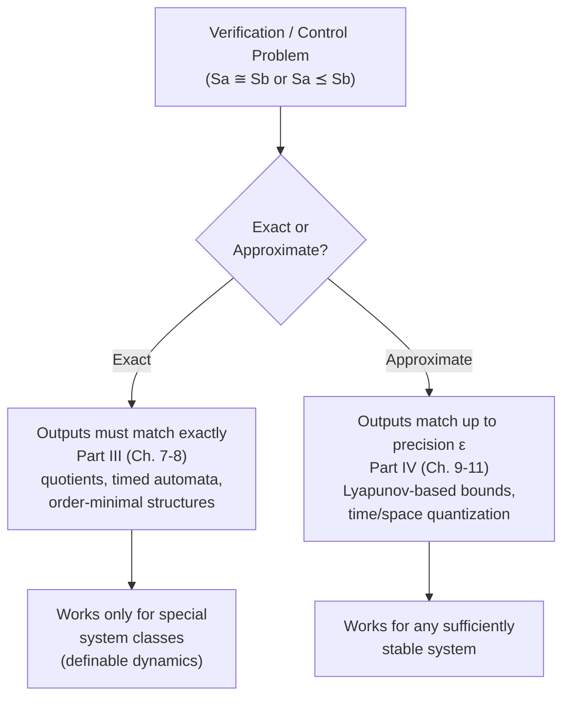
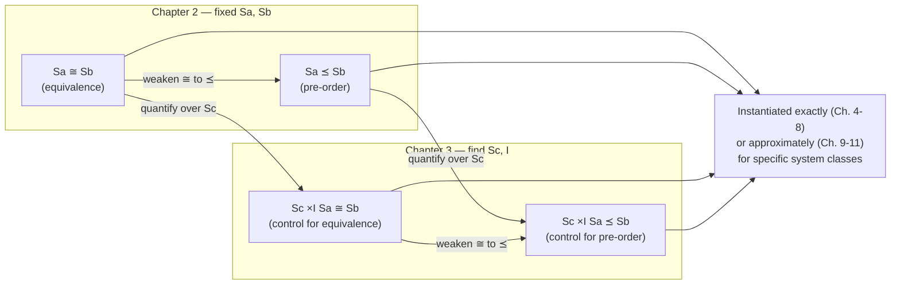

[[book-guidelines|↩ Back to guidelines]]

## Why pose verification as a relation between two systems at all?

Chapter 1 gave the book its one mathematical object: a *system* $S = (X, X_0, U, \to, Y, H)$, general enough to encode a finite-state protocol, a differential equation, or a hybrid automaton uniformly. But a system on its own is just a model — it doesn't yet tell you whether the thing you built is *correct*. Correctness is never a property of one object in isolation; it's a relationship between what you built ($S_a$) and what you wanted ($S_b$). This is the move Chapter 2 makes, and it's worth pausing on before any notation shows up: the book refuses to define "correct" as a monadic predicate (`is_correct(S) -> bool`) and instead insists on a binary relation (`conforms(S_a, S_b) -> bool`). That's not a stylistic preference — it's forced by the fact that "correct" is meaningless without a reference. A sorting function isn't "correct," it's correct *with respect to* a specification of what sorted means. The book's entire verification apparatus — everything from Chapter 4's simulation relations through Chapter 7's exact abstractions to Chapter 10's approximate ones — is scaffolding built to answer one of exactly two questions posed here: are two systems the *same*, or is one *contained in* the other?

Once you accept that framing, a second question follows immediately: if verification checks a relationship between a design and a spec, why isn't *control* just "verify the closed loop, then ship it"? Chapter 3's answer — and it's a genuinely elegant one — is that control problems are the same two relations, except now one of the two systems ($S_c$, the controller) is *unknown* and has to be constructed rather than checked. This single change of quantifier (from "does this relation hold?" to "does there exist a system making this relation hold?") is the entire conceptual distance between verification and control in this book. Everything else — the machinery of Chapters 5 through 11 — is about how to actually decide these relations and how to actually construct these controllers for specific classes of systems.

## The equivalence problem: $S_a \cong S_b$

**Problem 2.1 (Equivalence).** *Given systems $S_a$ and $S_b$ and a notion of equivalence between systems, when is $S_a$ equivalent to $S_b$?* Written with the book's notation, the question is simply whether

$$S_a \cong S_b.$$

What's notable is what the book deliberately leaves unspecified: it does *not* commit to a single definition of $\cong$ here. Equivalence is a *parameter* of the problem, not a fixed relation — Chapter 4 will supply candidate instantiations (behavioral equivalence, bisimilarity, and their approximate versions), and different chapters of the book will pick different instantiations depending on what class of system is under study. Chapter 2 is doing something more primitive: it's establishing *the shape of the question* before committing to how it gets answered.

**What breaks without this framing.** If you skip straight to "define bisimulation, then verify," you lose the ability to explain *why* bisimulation is the right notion of equivalence for one setting and wrong for another (e.g., why deterministic systems collapse simulation and bisimulation into the same thing, addressed later in Chapter 4). By keeping "equivalence" abstract at the problem-statement level, the book can reuse the same problem shape across wildly different systems — a communication protocol, a satellite, a DC-DC converter — while letting the *instantiation* of $\cong$ vary with what's actually being modeled.

### Two readings of the same equation

The book gives $S_a \cong S_b$ two distinct interpretations, and it matters which one you have in mind:

1. **Design-conforms-to-specification.** $S_a$ is a model of a system that has already been built (or is being built); $S_b$ is a model of what it was *supposed* to do. A positive answer to the equivalence problem certifies that the design meets the spec.
2. **Two candidate models of the same phenomenon.** $S_a$ and $S_b$ are both attempts to describe the same real system — perhaps at different levels of fidelity or from different modeling traditions — and you want to know if they agree.

In both readings, the book flags an implicit asymmetry: one of the two systems is expected to be *much simpler* than the other. If $S_b$ is the specification, it should be far easier to write down than $S_a$ — nobody wants their specification to be as complicated as their implementation, or verification buys you nothing over just re-reading the implementation. This constraint quietly shapes what "equivalence" is even allowed to mean: it has to be a relation that can hold between a large, detailed $S_a$ and a small, abstract $S_b$ without collapsing to trivial equality on states.

**Rust grounding.** This asymmetry is precisely the shape of a `trait` conformance check versus structural equality. You would never ask whether a `struct BoostConverter { i_l: f64, v_c: f64, switch: Switch }` is `==` to a four-line safety spec — you ask whether it *satisfies* the spec's trait bound, where the trait is implemented on top of a much coarser abstraction of the converter's state:

```rust
trait System {
    type State;
    type Input;
    fn successors(&self, x: &Self::State, u: &Self::Input) -> Vec<Self::State>;
}

// S_a: the detailed design (many states, e.g. a discretized converter model)
struct DetailedConverter { /* fine-grained continuous state */ }

// S_b: the simple specification (few states, e.g. "switch mode automaton")
struct SwitchSpec { /* two states: s1, s2 */ }

// "S_a ≅ S_b" is not Rust's `==` — it is a relation checked *between*
// two different `System` implementations, via some equivalence witness.
fn check_equivalence<A: System, B: System>(a: &A, b: &B /*, witness: ... */) -> bool {
    // Chapter 4 supplies what this witness looks like (a bisimulation relation).
    unimplemented!("instantiated later by a concrete notion of ≅")
}
```

The point of leaving `check_equivalence` abstract here mirrors the book's own move: Chapter 2 states the *signature* of the problem; Chapter 4 fills in the *body*.

### Exact versus approximate equivalence

The book draws one more distinction that turns out to be load-bearing for the entire second half of the book: **exact** equivalence requires outputs of related states to match *exactly*; **approximate** equivalence — parametrized by a precision $\varepsilon$ — allows outputs to differ by at most $\varepsilon$. Exact equivalence is usable for both finite- and infinite-state systems, but approximate equivalence is specifically motivated by infinite-state (dynamical/control/hybrid) systems, where insisting on bit-for-bit output agreement between a continuous plant and *any* finite symbolic model is simply unachievable — a continuum of real-valued states cannot be exactly bisimilar to a finite automaton except in special (order-minimal, as Chapter 7 shows) cases. Relaxing to $\varepsilon$-approximate equivalence is what makes Part IV's whole program (Chapters 9–11) possible: a much larger class of infinite-state systems admits an approximately equivalent *finite* symbolic model than admits an exactly equivalent one.

## The pre-order (containment) problem: $S_a \preceq S_b$

Equivalence is often too strong a demand. If $S_b$ is a specification, insisting that a real design $S_a$ behave *identically* to it — no more, no less — rules out designs that behave strictly *better* (e.g., a controller that additionally handles edge cases the spec was silent about). This motivates:

**Problem 2.2 (Pre-order).** *Given systems $S_a$ and $S_b$ and a pre-order between systems, when does $S_a$ precede $S_b$?* Written symbolically:

$$S_a \preceq S_b.$$

The book is careful to recall the precise algebraic shape of $\preceq$: a **pre-order** is a relation that is **reflexive** ($S \preceq S$ for all $S$) and **transitive** ($S_a \preceq S_b \wedge S_b \preceq S_c \Rightarrow S_a \preceq S_c$) — deliberately *not* required to be antisymmetric, which is exactly what makes it weaker than an equivalence-derived partial order and lets $S_a \preceq S_b \preceq S_a$ hold without forcing $S_a = S_b$. Intuitively $S_a \preceq S_b$ says $S_a$ is "included in" $S_b$ — every behavior $S_a$ can exhibit is one that $S_b$ permits, but $S_b$ may permit more.

**What breaks without this framing.** Without a genuinely weaker relation than equivalence, every legitimate design refinement — narrowing nondeterminism, adding safety margins, restricting to a subset of the specification's permitted behaviors — would register as a verification *failure*, because it isn't behaviorally identical to the spec. The pre-order is what lets "stricter than the spec" count as correct while "looser than the spec" does not; that directional asymmetry is the entire reason $\preceq$ needs to be a pre-order (one-directional inclusion) rather than dressed-up equivalence.

As with equivalence, the book immediately notes that both **exact** and **approximate** pre-orders will be considered, with the approximate version being a strict generalization of the exact one — the same motivation (infinite-state systems, output precision) applies here as it did for equivalence.

**Rust/Lean grounding.** A pre-order without antisymmetry is precisely a `PartialOrd`-like relation without an `Eq` requirement — Rust's own trait hierarchy is a decent analogy for *why* you'd want the weaker structure: many useful orderings (subtyping, subset inclusion, behavioral refinement) are naturally pre-orders before you quotient them into a genuine partial order. In Lean, this is stated exactly as an algebraic structure:

```lean
class Preorder (α : Type) extends LE α where
  le_refl : ∀ a : α, a ≤ a
  le_trans : ∀ a b c : α, a ≤ b → b ≤ c → a ≤ c
```

Reading $S_a \preceq S_b$ through this lens is useful because it tells you *for free* what kind of reasoning is licensed: transitivity means you can verify $S_a \preceq S_{mid} \preceq S_b$ in stages and conclude $S_a \preceq S_b$ — exactly the kind of compositional verification the book relies on when it stacks abstractions (Chapters 7–8 each build finite models through *chains* of such relations).

## Exact vs. approximate: the recurring fork in the road

It's worth naming this as its own idea rather than letting it stay buried inside equivalence and pre-order, because it is the single axis along which the entire book's Parts III and IV are organized:



Exact equivalence/pre-order is decidable and clean, but only for systems whose dynamics happen to admit a finite quotient (order-minimal structures, timed automata — Chapter 7). Approximate equivalence/pre-order trades exactness for applicability: almost any asymptotically stable system admits an $\varepsilon$-approximately bisimilar finite model (Chapter 10), at the cost of the answer now depending on a chosen precision. Chapter 2 is where this fork first appears, stated as a design choice about which relation to pose the problem with — long before the machinery exists to resolve either branch.

## From verification to control: quantifying over the missing piece

Chapters 2's two problems both ask: *given* $S_a$ and $S_b$, does a relation hold between them? Chapter 3 changes exactly one thing — it introduces a third system, $S_c$ (the controller), that does not yet exist, and asks whether one can be *constructed* so that a target relation holds for the *composition* $S_c \times_I S_a$ rather than for $S_a$ alone. Recall from Chapter 1 that $S_c \times_I S_b$ denotes composition through an interconnection relation $I \subseteq X_c \times X_a \times U_c \times U_a$ — $S_c$ and $S_a$ run concurrently, synchronized by $I$.

### The control problem for equivalence

**Problem 3.1 (Control for equivalence).** *Given systems $S_a$ and $S_b$, and given a notion of equivalence between systems, when does there exist, and how can we construct, a system $S_c$ and an interconnection relation $I$ such that:*

$$S_c \times_I S_a \cong S_b. \tag{3.1}$$

Here $S_a$ is the *plant* (a hardware platform, a physical system, an existing software layer) and $S_b$ is the specification to be *enforced* on that platform by designing $S_c$. The book gives concrete instances of what $S_c$ might be at different levels: an operating system to be designed atop hardware $S_a$, or application-level middleware to be designed atop an already-OS-equipped platform $S_a$.

The book then makes an observation worth sitting with, because it's the real payoff of framing control this way: **once $S_c$ is designed so that (3.1) holds by construction, no separate verification step is needed on the closed loop $S_c \times_I S_a$ against $S_b$.** Synthesis *subsumes* verification. This is a genuinely different posture from "build something plausible, then check it" — it says the act of constructing $S_c$ to satisfy Problem 3.1 *is* the proof that $S_c \times_I S_a \cong S_b$, because that's the very condition the construction procedure discharges.

**What breaks without this framing.** If control were instead posed as "guess an $S_c$, then separately verify the closed loop," you'd need the full verification machinery of Chapter 2/4/5 run twice — once conceptually to guide the guess, once for real to check it — with no guarantee the two ever converge for a nontrivial plant. By folding the correctness condition directly into the definition of what counts as a *solution* to the control problem, the book gets to reuse the *same* fixed-point machinery (Chapter 6, and later Chapter 8's controller refinement) for both "does a controller exist" and "here it is, and it's already correct by construction."

**Rust grounding — synthesis as a search over $S_c$, not a check on a fixed system.** The type signature makes the difference from verification explicit: verification is a decision procedure over two fixed arguments; control synthesis returns a *witness*.

```rust
// Verification (Chapter 2): decide a fixed relation between two fixed systems.
fn verify_equivalence<A: System, B: System>(a: &A, b: &B) -> bool { /* ... */ }

// Control (Chapter 3): SEARCH for a controller Sc and interconnection I
// such that composing it with the given plant Sa satisfies spec Sb.
// A `None` result means no such Sc exists (this is itself a theorem the
// book proves fixed-point-constructively for specific system classes,
// e.g. Chapter 6's safety games).
fn synthesize_for_equivalence<A: System, B: System, C: System>(
    plant: &A,
    spec: &B,
) -> Option<(C, InterconnectionRelation<C, A>)> {
    // By construction, if this returns Some((sc, i)), then
    // compose(sc, i, plant) ≅ spec holds automatically —
    // no separate call to verify_equivalence is ever needed.
    unimplemented!("instantiated by Chapter 6's fixed-point game algorithms")
}
```

This is also exactly the "abstract interpretation proves absence, search proves presence" duality from static analysis, wearing different clothes: `verify_equivalence` over-approximates/checks a fixed system (analogous to a soundness argument over an abstract domain), while `synthesize_for_equivalence` is a constructive search that, when it succeeds, produces a certificate (the controller itself) rather than merely a yes/no answer — much like a model checker returning a satisfying witness rather than only "SAT."

### The control problem for pre-order

**Problem 3.2 (Control for pre-order).** *Given systems $S_a$ and $S_b$, and given a pre-order between systems, when does there exist, and how can we construct, a system $S_c$ and an interconnection relation $I$ such that:*

$$S_c \times_I S_a \preceq S_b?$$

The motivation mirrors Problem 2.2's: equivalence-for-control may be an unreasonably strong demand, so weaken it to containment. The book then raises — and dismisses — a symmetric-looking alternative: why not instead design $S_c$ so that $S_b \preceq S_c \times_I S_a$ (the plant, once controlled, should be *at least as permissive* as the spec)? The book's answer is a clean piece of reasoning worth reconstructing in full, because it is characteristic of how this book argues:

Composing $S_c$ with $S_a$ via an interconnection relation can only **restrict** $S_a$'s behavior — every transition of $S_c \times_I S_a$ requires a *matching* transition in both $S_a$ *and* $S_c$ (recall Definition 1.6's composition rule), so $B(S_c \times_I S_a) \subseteq B(S_a)$ always. Controlling a plant can only shrink what it does, never expand it. Given that fact, consider the two cases for $S_b \preceq S_c \times_I S_a$:

- If $S_b \preceq S_a$ already holds *before* any controller is designed, then no $S_c$ is needed at all — the plant already contains the spec's behaviors.
- If $S_b \preceq S_a$ does *not* already hold, then no matter which $S_c$ you choose, composing further constrains $S_a$ to a subset of its own behavior, and a relation that failed against $S_a$'s *full* behavior cannot start holding against a strict *restriction* of it.

So $S_b \preceq S_c \times_I S_a$ is either already true for free, or permanently unachievable — it is never a meaningful design target. **This is a lemma about monotonicity of composition with respect to $\subseteq$**, stated informally here in Chapter 3, made precise once behavioral inclusion is formalized in Chapter 4.

**What breaks without this framing.** Missing this argument, one might naively try to synthesize a controller for "make the plant do *at least* what the spec requires" (a liveness-flavored goal) using the same machinery built for "make the plant do *at most* what the spec permits" (a safety-flavored goal) — and the synthesis would be guaranteed to fail or be vacuous every time, for a structural reason that has nothing to do with the difficulty of the specific system. Recognizing this early saves the reader from an entire unproductive research direction; it's also a first hint of the safety/liveness asymmetry that resurfaces sharply in Chapter 6 (safety games admit a canonical least-restrictive controller; reachability/liveness games do not).

```text
Composition only shrinks behavior:           B(Sc ×I Sa) ⊆ B(Sa)   (always)

Sc ×I Sa ⪯ Sb   — meaningful: can be achieved by suitably RESTRICTING Sa
Sb ⪯ Sc ×I Sa   — vacuous: either already true (Sb ⪯ Sa), or forever false
```

## Synthesis: where these four problems sit in the book



Chapter 2 and 3 are deliberately thin — six pages that state four problems without solving any of them, because solving them is the rest of the book's job. But every later technique is answering exactly one cell of this diagram for a specific class of systems: Chapter 5's Myhill–Nerode-plus-fixed-point construction answers the *exact verification* problems for finite-state systems; Chapter 6's safety/reachability games answer the *exact control* problems; Chapters 7–8 extend exact verification/control to infinite-state dynamical, hybrid, and control systems via quotienting, sign-based abstractions, and barrier certificates; Chapters 9–11 redo the same four cells with $\varepsilon$-approximate relations, trading exactness for applicability to systems (like generic asymptotically stable nonlinear plants) that admit no exact finite quotient at all.

**Connection to the static-analysis focus area.** This chapter pair is the cleanest possible statement, at problem-definition granularity, of the over-approximation/under-approximation duality that runs through the whole static-analysis and abstract-interpretation literature. The pre-order problem $S_a \preceq S_b$ *is* a soundness statement in the shape a Galois-connection-based analysis proves: "every concrete behavior of $S_a$ is accounted for by the abstract/spec system $S_b$" — structurally the same claim as "the abstract interpreter's reachable-state over-approximation contains every real reachable state." The asymmetry the book proves for control (composition can only restrict, never expand, so $S_b \preceq S_c \times_I S_a$ is vacuous) is the same monotonicity argument that justifies why a Galois connection's abstraction map $\alpha$ has to be applied in a consistent direction — you can't backwards-reason your way to a *larger* concrete set by refining the abstract one. And the exact/approximate fork is precisely the trade-off a domain-propagation-based analysis faces when choosing a lattice: a precise, potentially infinite domain (exact equivalence, decidable only for definable dynamics) versus a coarser domain with a bounded-precision guarantee (approximate equivalence, always available given a Lyapunov certificate). When you build the abstract-interpretation invariant-generation pass for the refinement-type compiler, this chapter's four-problem taxonomy is a useful checklist for what "the analysis is sound" and "the analysis is complete" actually mean as separate, independently establishable claims — exactly the equivalence-vs-pre-order distinction made precise here.

**[[Exact-Symbolic-Models-for-Control#Where this leads|Where this leads]].** Chapter 4 supplies the first concrete instantiations of $\cong$ and $\preceq$ (behavioral equivalence/inclusion, simulation, bisimulation, and their alternating variants for control), which Chapter 5 then shows how to *decide* via monotone-operator fixed points, and Chapter 6 shows how to *synthesize* controllers for via the same fixed-point machinery played as a game. Every subsequent chapter is, in that precise sense, still answering one of the four problems stated here.
