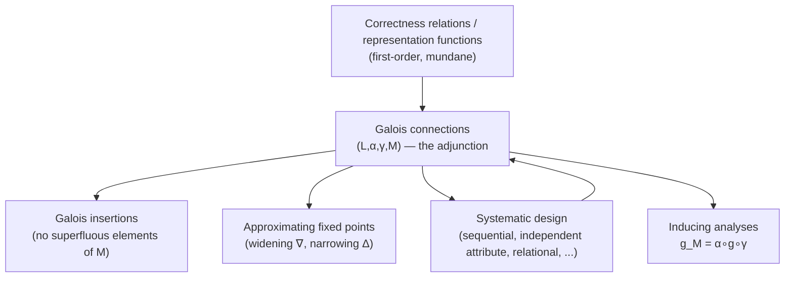

[[book-guidelines|↩ Back to guidelines]]

## The question this chapter finally makes precise

Every earlier chapter proved a *specific* analysis correct against a *specific* semantics — [[Data-Flow-Analysis|Live Variables against WHILE's SOS]], [[Control-Flow-Analysis-(0-CFA-and-Constraint-Based-Analysis)|0-CFA's acceptability relation against FUN's closures]]. Abstract Interpretation steps back and asks the question those proofs kept answering ad hoc: **what does it even mean, in general, for an abstract property space $L$ to safely describe a concrete value space $V$?** And once you have a good answer: **how do you replace an expensive/uncomputable $L$ with a cheaper $M$ without silently breaking that safety?** This chapter is language-independent on purpose — its objects are property spaces and the functions between them, not any one program syntax.

## Correctness relations and representation functions: two equivalent starting points

**Correctness relations.** Given a concrete semantics $p \vdash v_1 \leadsto v_2$ and an analysis $p\vdash l_1 \triangleright l_2$ (now written as deterministic functions $f_p(l_1)=l_2$), a **correctness relation** $R : V\times L\to\{true,false\}$ formalizes "$v$ is described by $l$." Correctness is then the demand that $R$ is *preserved under computation*:

$$
v_1\ R\ l_1 \wedge p\vdash v_1\leadsto v_2 \wedge p\vdash l_1\triangleright l_2 \implies v_2\ R\ l_2
$$

— a **logical relation**: whatever holds before execution keeps holding, in lockstep, after. When $L$ carries a lattice structure, two extra conditions connect $R$ to $\sqsubseteq$: $v\ R\ l_1 \wedge l_1\sqsubseteq l_2 \implies v\ R\ l_2$ (bigger-in-the-approximation-order is always at least as safe) and $R$ is preserved by arbitrary meets (a value described by every property in a set is described by their greatest lower bound).

**Representation functions.** The equivalent, often more usable, alternative is a **representation function** $\beta: V\to L$ mapping each value to its *best* — most precise, still-safe — description. Correctness becomes:

$$
\beta(v_1)\sqsubseteq l_1 \wedge p\vdash v_1\leadsto v_2 \wedge p\vdash l_1\triangleright l_2 \implies \beta(v_2)\sqsubseteq l_2
$$

The two formulations coincide when $R$ is *generated by* $\beta$: $v\ R\ l \iff \beta(v)\sqsubseteq l$. This is exactly the discipline every earlier correctness proof in the book was implicitly following — e.g. [[Control-Flow-Analysis-(0-CFA-and-Constraint-Based-Analysis)|0-CFA's]] closure-to-abstract-value relation $\mathcal V(\widehat\rho,\widehat v)$ (Section 3.2) is precisely a correctness relation of this shape, now recognized as an instance of a general pattern rather than a bespoke construction.

**First-order vs. second-order.** This "mundane" formulation only directly applies to **first-order analyses** — those where properties describe *sets of values* directly (Constant Propagation, [[Shape-Analysis|Shape Analysis]], Control Flow Analysis). It does *not* directly apply to **second-order analyses** like Live Variables, where a property (a set of "live" variables) describes a *relation between values* (which variable's value will still be read), not a value in isolation — the book is explicit that the deeper Sections 4.2–4.5 machinery applies equally to both classes, but the correctness-relation formulation of 4.1 specifically is the mundane, first-order-only special case.

## Approximating fixed points: when you can't just iterate to convergence

**The setup.** [[Monotone-Frameworks|Monotone Frameworks']] guaranteed termination via the Ascending Chain Condition — a finite lattice, or one satisfying ACC, forces $(f^n(\bot))_n$ to stabilize. Many useful abstract domains (intervals over $\mathbf Z$, for instance) have **infinite height** — no ACC — so the iterative sequence $f^n(\bot)$ may never stabilize even though $\mathrm{lfp}(f)$ exists (Tarski's theorem only needs $L$ complete, not ACC). Figure 4.3's ordering $f^n(\bot)\sqsubseteq\bigsqcup_n f^n(\bot)\sqsubseteq\mathrm{lfp}(f)\sqsubseteq\mathrm{gfp}(f)\sqsubseteq\prod_n f^n(\top)\sqsubseteq f^n(\top)$ holds regardless, but the outer sequences may simply never reach their limits computationally.

**Widening operators — force convergence from below, safely.** An **upper bound operator** $\breve\sqcup: L\times L\to L$ satisfies $l_1\sqsubseteq(l_1\breve\sqcup l_2)\sqsupseteq l_2$ (always at least as big as both arguments — deliberately *not* required to be monotone, commutative, associative, or idempotent). A **widening operator** $\nabla$ is an upper bound operator with the extra property that **every** ascending chain, run through it, eventually stabilizes:

$$
f_\nabla^n = \begin{cases}\bot & n=0 \\ f_\nabla^{n-1} & n>0 \wedge f(f_\nabla^{n-1})\sqsubseteq f_\nabla^{n-1} \\ f_\nabla^{n-1}\,\nabla\,f(f_\nabla^{n-1}) & \text{otherwise}\end{cases}
$$

The book's interval example makes the mechanism concrete: fixing a "landmark" interval $int$, $int_1\breve\sqcup^{int}int_2$ returns the ordinary join $int_1\sqcup int_2$ *if* one of the two operands is already contained in $int$, and otherwise jumps straight to $[-\infty,\infty]$. Applied to the diverging chain $[0,0],[1,1],[2,2],\ldots$ with $int=[0,2]$: the widened sequence is $[0,0],[0,1],[0,2],[-\infty,\infty],[-\infty,\infty],\ldots$ — stabilized after 4 steps, at the cost of jumping to total imprecision rather than continuing to track a growing-but-finite bound. This is the essential widening trade: sacrifice precision at exactly the moment you'd otherwise fail to terminate.

**Narrowing operators — claw back some of that precision.** Once $f_\nabla^m$ (the widened fixed point) satisfies $f(f_\nabla^m)\sqsubseteq f_\nabla^m$ — i.e., $f$ is *reductive* there — you can run $f$ forward again, this time *descending*: $[f]_\Delta^n = f_\Delta^{n-1}\,\Delta\,f([f]_\Delta^{n-1})$, where a **narrowing operator** $\Delta$ satisfies $l_2\sqsubseteq l_1 \implies l_2\sqsubseteq(l_1\,\Delta\,l_2)\sqsubseteq l_1$ and, symmetrically to widening, guarantees every descending chain run through it stabilizes. The result $\mathrm{lfp}_\nabla^\Delta(f) = [f]_\Delta^{m'}$ is provably still $\sqsupseteq\mathrm{lfp}(f)$ — narrowing recovers precision *without ever risking unsoundness*, because it only ever descends within $Red(f)$, the region where $f$ is already known reductive.

**Grounding it — Rust.** The interval-widening operator is a direct, checkable piece of static-analysis code:

```rust
#[derive(Clone, Copy, PartialEq)]
struct Interval { lo: f64, hi: f64 } // f64::{NEG_INFINITY, INFINITY} stand in for ±∞

fn widen(a: Interval, b: Interval, landmark: Interval) -> Interval {
    if contains(landmark, a) || contains(landmark, b) {
        Interval { lo: a.lo.min(b.lo), hi: a.hi.max(b.hi) } // ordinary join
    } else {
        Interval { lo: f64::NEG_INFINITY, hi: f64::INFINITY } // give up — but safely
    }
}
```

This is exactly the mechanism every real interval-analysis pass (LLVM's, or any SMT-adjacent invariant generator) uses to force loop-invariant computation to terminate on unbounded domains — not a textbook simplification, the actual production technique.

## Galois connections: the formal contract for "M safely approximates L"

**Why not just any pair of functions?** Motivating case: $L=\mathcal P(\mathbf Z)$ (exact, expensive) and $M=\mathbf{Interval}$ (approximate, cheap) — you want an **abstraction function** $\alpha: L\to M$ and a **concretisation function** $\gamma: M\to L$ relating them, but arbitrary monotone $\alpha,\gamma$ could be wildly inconsistent with each other. A **Galois connection** $(L,\alpha,\gamma,M)$ demands both are monotone and:

$$
\gamma\circ\alpha \sqsupseteq \lambda l.l \qquad\qquad \alpha\circ\gamma \sqsubseteq \lambda m.m
$$

— round-tripping $L\to M\to L$ never loses safety (only precision: $l\sqsubseteq\gamma(\alpha(l))$), and round-tripping $M\to L\to M$ never *creates* false precision. The equivalent, often-easier-to-check formulation is an **adjunction**: $\alpha(l)\sqsubseteq m \iff l\sqsubseteq\gamma(m)$ — Proposition 4.20 proves the two are the same thing. Two consequences worth internalizing: (Lemma 4.22) $\alpha$ alone determines $\gamma$ by $\gamma(m)=\bigsqcup\{l\mid\alpha(l)\sqsubseteq m\}$ (and symmetrically), so you only ever need to *design* one direction and the connection's own algebra hands you the other; and $\alpha$ is completely additive, $\gamma$ completely multiplicative — which is precisely the property Lemma 4.23 exploits to *construct* a Galois connection from just one completely-additive $\alpha$ (or completely-multiplicative $\gamma$) without separately verifying the adjunction.

**Worked example — the interval abstraction, made rigorous.** $(\mathcal P(\mathbf Z),\alpha_{ZI},\gamma_{ZI},\mathbf{Interval})$ with $\gamma_{ZI}(int)=\{z\mid \inf(int)\le z\le\sup(int)\}$ and $\alpha_{ZI}(Z) = [\inf'(Z),\sup'(Z)]$ (the tightest enclosing interval, $\bot$ for $Z=\emptyset$): checking $\gamma_{ZI}(\alpha_{ZI}(Z))\sqsupseteq Z$ is immediate (the enclosing interval always contains the original set), and this single Galois connection is the formal justification underlying every interval-analysis pass — including the widening operator above, which operates entirely inside $\mathbf{Interval}$, trusting that the connection back to $\mathcal P(\mathbf Z)$ stays sound throughout.

**Galois insertions — when $M$ has no waste.** A Galois connection may let several elements of $M$ describe the *same* element of $L$ ($\gamma$ not injective) — meaning $M$ contains genuinely superfluous distinctions. A **Galois insertion** additionally demands $\alpha\circ\gamma = \lambda m.m$ (equality, not just $\sqsubseteq$) — equivalently (Lemma 4.27): $\alpha$ surjective, $\gamma$ injective, or $\gamma$ order-reflecting. $(\mathcal P(\mathbf Z),\alpha_{ZI},\gamma_{ZI},\mathbf{Interval})$ is in fact a Galois insertion — every interval is the tightest enclosure of *some* set of integers, so no interval is wasted. When a plain Galois connection isn't already an insertion, the book shows (§4.3.2, "reduction operators") how to systematically quotient $M$ down to $\varsigma[M]$, its non-redundant image, recovering an insertion for free.

## Systematic design: build complex Galois connections from simple ones

Rather than hand-designing every analysis's abstract domain from scratch, the book supplies **composition operators** that build new Galois connections out of existing, already-verified ones:

- **Sequential composition.** Galois connections chain: $(L_0,\alpha_1,\gamma_1,L_1)$ then $(L_1,\alpha_2,\gamma_2,L_2)$ compose into $(L_0,\alpha_2\circ\alpha_1,\gamma_1\circ\gamma_2,L_2)$ — a direct, provable consequence of the adjunction characterization. This is how the book's Array Bound Analysis example is actually built: integers → magnitude-difference → a small finite lattice, each stage independently simple and independently verified.
- **Independent attribute method.** Given $(L_1,\alpha_1,\gamma_1,M_1)$ and $(L_2,\alpha_2,\gamma_2,M_2)$, combine componentwise into $(L_1\times L_2,\alpha,\gamma,M_1\times M_2)$ with $\alpha(l_1,l_2)=(\alpha_1(l_1),\alpha_2(l_2))$. **What breaks:** there is *zero* interplay between the two components — the book's own counterexample is the expression `(x, -x)`: its exact value set is $\{(z,-z)\mid z\in\mathbf Z\}$, but representing each component's sign independently can only report $(\{-,0,+\},\{-,0,+\})$ — the correlation "these two signs are always opposite" is provably unrecoverable once each attribute is abstracted in isolation.
- **Relational method.** The fix: build the combined Galois connection directly over $\mathcal P(V_1\times V_2)\to\mathcal P(D_1\times D_2)$ rather than factoring through $\mathcal P(V_1)\times\mathcal P(V_2)$ — letting the abstraction see *pairs* before it commits to abstracting each side separately, which is precisely what's needed to preserve a correlation like `(x, -x)`'s opposite-sign invariant.
- **Direct product, total/monotone function spaces** round out the catalogue — combining analyses of the *same* structure (rather than independent attributes of a structure), and lifting Galois connections pointwise across function types, respectively — each with the same "prove it once, reuse everywhere" motivation.

**[[Shape-Analysis#What this buys you|What this buys you]], structurally.** A small set of *basic*, independently-verified Galois connections (signs, intervals, an extraction function) combines mechanically into sophisticated domains (the book's running Array Bound Analysis target) — and because each combinator is proved correct *once*, in general, every analysis assembled from it inherits correctness without a bespoke proof. This is the chapter's own version of the book's founding "commonality across techniques" thesis, now applied one level up: not just "these analyses are instances of one framework," but "these framework instances are themselves built from a small reusable algebra."

## Inducing new analyses along an abstraction function

Given an existing, already-correct analysis $g$ over $L$, and a Galois connection $(L,\alpha,\gamma,M)$, the **induced** analysis over $M$ is $g_M = \alpha\circ g\circ\gamma$ — concretize into $L$, run the known-correct $g$, abstract the result back. This is exactly the pattern Chapter 1's introductory example used informally (inducing Reaching Definitions from the collecting semantics via $\widehat\alpha\circ G\circ\widehat\gamma$) and it recurs as the chapter's payoff: once you trust $(L,\alpha,\gamma,M)$'s adjunction, *any* correct analysis over $L$ transports to a correct analysis over $M$ automatically — you get new sound analyses for free by re-targeting old ones through a new lens, rather than re-deriving correctness from the concrete semantics each time.

## Where this leads



This chapter retroactively explains *why* the book kept succeeding at proving different-looking analyses correct with the same shape of argument — every prior correctness proof (Live Variables vs. WHILE's SOS, 0-CFA vs. FUN's SOS) was implicitly building a correctness relation or representation function, and every "combine two analyses" move throughout the book was implicitly an instance of one of §4.4's composition operators. For the standing project, this chapter is the single most directly load-bearing piece of theory in the book (`static-analysis`): the correctness-relation/Galois-connection discipline is exactly what will let you *prove* — not just hope — that your compiler's abstract-interpretation-based invariant generator soundly over-approximates real program behavior, the systematic-design catalogue is the template for assembling your refinement-type domain from simpler, separately-verified pieces (with the relational-vs-independent-attribute distinction directly warning against losing cross-variable correlations your Hoare contracts will need), and widening/narrowing is the concrete mechanism your invariant generator will need whenever a refinement domain (intervals, polyhedra) has unbounded height and a loop's fixed point can't simply be iterated to.
