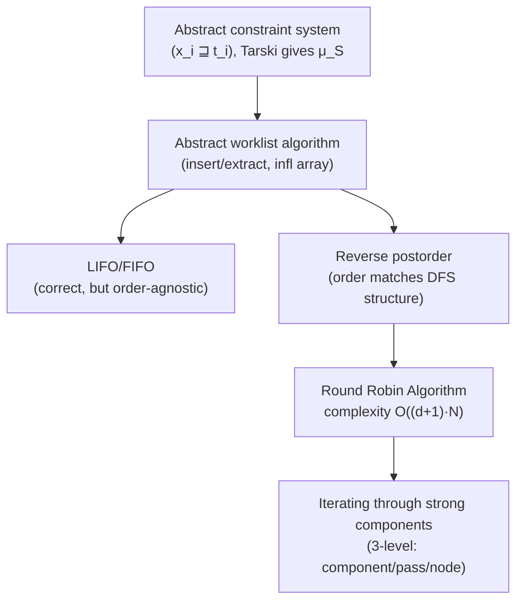

[[book-guidelines|↩ Back to guidelines]]

## Abstracting away the analysis entirely

Every chapter so far solved its equations with a worklist algorithm shaped to that chapter's specific setting: [[Monotone-Frameworks|MFP's]] worklist over $flow(S_*)$, [[Control-Flow-Analysis-(0-CFA-and-Constraint-Based-Analysis)|0-CFA's]] graph-based constraint solver, [[Interprocedural-Data-Flow-Analysis|the embellished framework's]] context-indexed worklist. This chapter asks the natural next question: **strip away every analysis-specific detail and ask what a worklist algorithm fundamentally needs to be correct and efficient, for *any* system of inequations over *any* complete lattice satisfying ACC.** The payoff mirrors [[Monotone-Frameworks|Monotone Frameworks']] own payoff one level up — a single correctness proof and a single complexity bound that every earlier chapter's algorithm turns out to be a special case of.

## The abstract constraint system

A **constraint system** is $\mathcal S = (x_i \sqsupseteq t_i)_{i=1}^N$: finitely many **flow variables** $x_i$, each with a right-hand-side **term** $t_i$ whose free variables $FV(t_i)$ are drawn from the same finite set $X=\{x_1,\ldots,x_N\}$. A **solution** is a total function $\psi: X\to L$ into a complete lattice satisfying ACC, and each term $t$ is interpreted via $[\![t]\!]\psi \in L$ — required only to be **monotone** in $\psi$ and to depend only on $\psi$'s values at $FV(t)$. Crucially, this single, generic shape subsumes conditional constraints too: the book shows (Example 6.2) how [[Control-Flow-Analysis-(0-CFA-and-Constraint-Based-Analysis)|0-CFA's]] conditional constraints $\{t\}\subseteq rhs'\Rightarrow lhs\subseteq rhs$ from Chapter 3 become ordinary right-hand sides containing an `if`-term — $x_5 \sqsupseteq \mathbf{if}\ \{\mathtt{fn}\ x\Rightarrow x^1\}\subseteq x_2\ \mathbf{then}\ x_1$ — so nothing about the abstract framework here is actually less expressive than Chapter 3's specialized constraint language; it's the same expressiveness, purified of syntax.

**Correctness, for free, from Tarski.** Define $F_{\mathcal S}(\psi)(x) = \bigsqcup\{[\![t]\!]\psi \mid x\sqsupseteq t \text{ in } \mathcal S\}$ — a monotone function on the complete lattice $X\to L$. Tarski's Fixed Point Theorem (already used repeatedly since [[Abstract-Interpretation|Chapter 4]]) immediately gives a least fixed point $\mu_{\mathcal S} = \bigsqcup_j F_{\mathcal S}^j(\bot)$, and finiteness of $X$ plus ACC on $L$ guarantees the chain $(F_{\mathcal S}^n(\bot))_n$ stabilizes. **The entire correctness question the rest of the chapter answers is just: does a given worklist strategy actually compute this $\mu_{\mathcal S}$, and how fast?**

## The abstract worklist algorithm

Table 6.1 parameterizes the classic worklist loop over exactly two operations — `insert` (add a constraint to the pending work) and `extract` (remove and return one) — leaving their implementation entirely open:

```
Step 1 (init):  W := empty
                for all x ⊒ t in S: W := insert((x⊒t), W); Analysis[x] := ⊥
                infl[x'] := infl[x'] ∪ {x⊒t}  for all x'∈FV(t), for all x⊒t in S

Step 2 (iterate):
    while W ≠ empty:
        ((x⊒t), W) := extract(W)
        new := eval(t, Analysis)              -- i.e. [[t]](Analysis)
        if Analysis[x] ⋢ new:
            Analysis[x] := Analysis[x] ⊔ new
            for all x'⊒t' in infl[x]: W := insert((x'⊒t'), W)
```

The `infl` array — "which constraints does a change to $x$ affect" — is the general-purpose analogue of every earlier chapter's ad hoc dependency tracking (Data Flow's `flow` edges, 0-CFA's constraint graph edges): $\mathrm{infl}[x] = \{(x'\sqsupseteq t') \text{ in } \mathcal S \mid x\in FV(t')\}$, computed once in Step 1 by a linear scan, then consulted every time $x$'s value actually changes. **Lemma 6.4** (correctness): this computes exactly $\mu_{\mathcal S}$ — and, tellingly, the proof is essentially the same induction used for [[Monotone-Frameworks|MFP's]] Lemma 2.29, now made once, generically, rather than re-derived per chapter.

**What breaks without `infl`.** Without it, detecting "which other constraints need re-checking after $x$ changes" would require re-scanning the entire constraint system on every update — turning an $O(N)$-per-change operation into an $O(N)$-per-change-times-$N$-constraints operation. `infl` is the single data structure that makes incremental re-propagation (rather than full re-evaluation) possible at all — precisely the same role a real compiler's dataflow-analysis engine's "worklist + use-def edges" plays in production.

**Grounding it — Rust.** The abstract algorithm, made concrete and generic over any lattice:

```rust
trait ConstraintLattice { type L: PartialEq + Clone; fn bottom() -> Self::L; fn join(a: &Self::L, b: &Self::L) -> Self::L; fn leq(a: &Self::L, b: &Self::L) -> bool; }

fn solve<C: ConstraintLattice>(
    constraints: &[(VarId, Box<dyn Fn(&HashMap<VarId, C::L>) -> C::L>)],
) -> HashMap<VarId, C::L> {
    let mut analysis: HashMap<VarId, C::L> = constraints.iter().map(|(x, _)| (*x, C::bottom())).collect();
    let infl: HashMap<VarId, Vec<usize>> = build_influence_map(constraints); // FV(t) -> constraint indices
    let mut worklist: VecDeque<usize> = (0..constraints.len()).collect();
    while let Some(i) = worklist.pop_front() {
        let (x, term) = &constraints[i];
        let new = term(&analysis);
        if !C::leq(&new, &analysis[x]) {
            analysis.insert(*x, C::join(&analysis[x], &new));
            worklist.extend(infl.get(x).into_iter().flatten());
        }
    }
    analysis
}
```

## LIFO, FIFO, and why "which constraint next" matters at all

The abstract algorithm says nothing about *order* — `extract` could return constraints in any sequence and Lemma 6.4's correctness proof goes through unchanged, because that proof never inspects the order, only that every influenced constraint *eventually* gets re-examined. **This is itself the chapter's first real lesson**: correctness lives entirely in the `insert`/`extract` contract's *completeness* (nothing pending is ever silently dropped), while performance lives entirely in *which* pending constraint gets picked first. LIFO (stack: most recently inserted first) and FIFO (queue: oldest first) are the two obvious choices, and the book's worked trace (Example 6.7, Figure 6.1) shows LIFO on the running example needing on the order of a dozen iterations for a 6-node system — workable, but with no structural reason to expect it scales well as $N$ grows, since a naive LIFO/FIFO order has no relationship to the constraint system's actual dependency structure.

## Reverse postorder: making the *order* match the *dependencies*

**The idea.** Build a **graphical representation** $G_{\mathcal S}$ — one node per constraint, an edge $x_i\sqsupseteq t_i \to x_j\sqsupseteq t_j$ whenever $x_i$ occurs in $t_j$ (i.e., $x_j\sqsupseteq t_j \in \mathrm{infl}[x_i]$) — then extract a **depth-first spanning forest** and its **handle** (a minimal set of roots from which every node is reachable — the generalization of "the graph has one clear root" to graphs that don't). [[Graphs-and-Regular-Expressions|Appendix C's]] reverse postorder numbering on this spanning forest gives an iteration order where, along any forward (non-back) edge, a constraint's dependents are visited *before* it is — meaning a single inner pass propagates a change as far forward through the dependency graph as the graph's structure allows, before any re-visit is needed.

Table 6.3 implements this **without changing the outer algorithm at all** — just by choosing a cleverer `(insert, extract)` pair: the worklist is a pair $(W.c, W.p)$ of a current reverse-postorder-sorted list and a pending set; `extract` only re-sorts $W.p$ into reverse postorder when the current list is exhausted. This is a clean illustration of the abstract algorithm's actual design payoff: the *entire* reverse-postorder optimization is packaged as a different implementation of two functions, with zero changes to Step 1/Step 2's logic or to Lemma 6.4's correctness proof.

**The complexity payoff — loop connectedness.** [[Graphs-and-Regular-Expressions|Appendix C's]] **loop connectedness parameter** $d(G_{\mathcal S},T)$ — the maximum number of *back edges* (edges violating the reverse-postorder numbering) on any cycle-free path — directly bounds the **Round Robin Algorithm's** iteration count:

$$
\text{Lemma 6.12: the algorithm halts within } d(G_{\mathcal S},T)+3 \text{ iterations, performing } O((d(G_{\mathcal S},T)+1)\cdot N) \text{ assignments.}
$$

**Why this is the right complexity measure**: a path with $d$ back edges needs at most $d+1$ passes to propagate a value all the way along it — one pass reaches the first back edge's source (since everything before it is already topologically ordered by construction), each subsequent pass needs exactly one more sweep to cross the next back edge. For WHILE programs specifically, $d(G_{\mathcal S},T)$ equals the **maximal nesting depth of `while`-loops**, independent of which spanning forest you happened to pick — giving an overall $O((d+1)\cdot b)$ bound (for $b$ elementary blocks) that is often dramatically better than the naive $O(b^2)$ worst case, precisely because real programs rarely nest loops very deeply even when they have very many blocks.

## Iterating through strong components: one more structural refinement

**What Round Robin still leaves on the table.** Reverse postorder handles a single monolithic pass well, but a constraint graph is typically not one big strongly-connected mess — it decomposes into a **reduced graph** of strongly connected components (SCCs), always a DAG (Appendix C), with genuine "loop" behavior confined *inside* each component and none between them. Table 6.5's `srPostorder` numbering exploits this directly: process SCCs in the reduced graph's topological order (an SCC never needs revisiting once all its predecessors are settled), and *within* each SCC, use local reverse postorder exactly as before. The book's worked example shows every SCC coinciding with exactly one outermost `while`-loop for WHILE flow graphs — confirming that this three-level (component / pass / node) strategy is not an arbitrary refinement but the *natural* granularity for iterative dataflow, matching the program's actual loop structure component-for-component rather than treating the whole flow graph as one undifferentiated cycle.

## Where this leads



This chapter is a direct capstone on the book's central claim: [[Data-Flow-Analysis|Chaotic Iteration]], [[Monotone-Frameworks|MFP's worklist]], and [[Control-Flow-Analysis-(0-CFA-and-Constraint-Based-Analysis)|0-CFA's graph-based constraint solver]] are not merely *similar*, they are literally the same algorithm — correctness proved once via Tarski, performance improved once via reverse postorder and strong-component decomposition — instantiated at different property spaces. For the standing project, this is the concrete template for the **generic fixed-point solver** underneath any abstract-interpretation-based invariant generator (`static-analysis`): the `infl`-array dependency-tracking discipline is exactly what a real incremental Hoare-contract or refinement-type constraint solver needs to avoid quadratic re-checking, and the loop-connectedness-driven complexity bound is the right lens for reasoning about how your compiler's fixed-point computation will scale on real, typically shallowly-nested control flow rather than assuming worst-case behavior everywhere.
