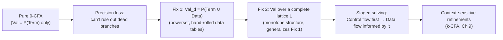

[[book-guidelines|↩ Back to guidelines]]

## What pure 0-CFA can't see

[[Control-Flow-Analysis-(0-CFA-and-Constraint-Based-Analysis)|0-CFA]] as developed so far tracks *only* function abstractions — $\widehat{\mathbf{Val}} = \mathcal{P}(\mathbf{Term})$ has no room for "what integer or boolean value could this expression hold." That's a real limitation, and not just for missing obviously-useful facts about numbers: **it directly costs precision in the control-flow answer itself**, because a pure 0-CFA analysis has no way to rule out a branch of an `if` as dead, even when the branch condition is a compile-time-obvious constant. The book's worked example (Example 3.27) makes this concrete:

```
let f = fn x => (if (x > 0) then (fn y => y) else (fn z => 25))
in ((f 3) 0)
```

Since `f` is always applied to the literal `3`, the `if`'s condition `x > 0` is always true — the `else`-branch (`fn z => 25`) can never actually be returned. But pure 0-CFA, blind to data values, cannot see that `x` is always positive, so it must conservatively assume *either* branch's function could flow out of the `if`, reporting that the outer application's result could be `fn y => y` **or** `fn z => 25`. This is a precision loss with a direct, checkable cost — not a hypothetical one.

## Fix 1: abstract values as powersets of terms and data

**The move.** Enlarge the abstract value domain to $\widehat{\mathbf{Val}}_d = \mathcal{P}(\mathbf{Term}\cup\mathbf{Data})$ — a single powerset now mixing function-abstraction terms *and* abstract data properties (e.g., for a Detection-of-Signs analysis, $\mathbf{Data}_{sign} = \{\mathtt{tt},\mathtt{ff},-,0,+\}$). Every constant needs an abstract counterpart $d_c \in \mathbf{Data}$ (so $d_{\mathbf{true}} = \mathtt{tt}$, $d_7 = +$, etc.), and every operator needs a total [[Abstract-Interpretation|abstract interpretation]] $\widehat{op} : \widehat{\mathbf{Val}}_d\times\widehat{\mathbf{Val}}_d\to\widehat{\mathbf{Val}}_d$, typically defined pointwise over the underlying concrete operator table:

$$
\widehat v_1\ \widehat{op}\ \widehat v_2 = \bigcup\{d_{op}(d_1,d_2) \mid d_1\in\widehat v_1\cap\mathbf{Data},\ d_2\in\widehat v_2\cap\mathbf{Data}\}
$$

For Detection of Signs, $\widehat +$ is exactly the sign-arithmetic table you'd expect — $(-)\ \widehat+\ (-) = \{-\}$, $(-)\ \widehat+\ (+) = \{-,0,+\}$ (can't know the sign of a sum of opposite signs without magnitudes) — and this table *is itself* a safe approximation in the [[The-Nature-and-Scope-of-Program-Analysis|Chapter 1 sense]]: every entry is a superset of every concrete outcome consistent with the abstract inputs.

**The acceptability relation's `[if]` clause gets sharper.** With data values now mixed into $\widehat{\mathsf C}$, the `[if]` clause can check whether the condition's abstract value actually *admits* `true` (respectively `false`) before recursing into that branch at all — this is exactly what recovers the `f 3` example's precision: if $\widehat{\mathsf C}(\ell_{cond})$ turns out to only ever contain $\mathtt{tt}$, the analysis is licensed to skip analyzing the `else`-branch's propagation into the result entirely. **This is the first hint of flow-sensitivity entering Control Flow Analysis** — the *value* computed by one subexpression (the condition) now controls which *other* subexpressions even get considered, a genuinely different character from 0-CFA's original clauses, which recursed into every syntactic child unconditionally regardless of what any sibling's value turned out to be.

**Grounding it — Rust.** The powerset-of-terms-and-data domain is naturally a tagged union collapsed into one flat set type:

```rust
#[derive(Clone, PartialEq, Eq, Hash)]
enum AbstractElem {
    Closure(FnTerm),   // an element of Term
    Sign(Sign),         // an element of Data (here, Detection of Signs)
}
type AbstractVal = HashSet<AbstractElem>; // Val_d = P(Term ∪ Data)

fn abstract_add(v1: &AbstractVal, v2: &AbstractVal) -> AbstractVal {
    let mut out = AbstractVal::new();
    for e1 in v1.iter().filter_map(as_sign) {
        for e2 in v2.iter().filter_map(as_sign) {
            out.extend(sign_add_table(e1, e2).into_iter().map(AbstractElem::Sign));
        }
    }
    out // closures are simply ignored by +, exactly as d_op only consumes ∩ Data
}
```

## Fix 2: abstract values as complete lattices — generalizing beyond powersets

**Why powersets aren't always enough.** $\mathcal{P}(\mathbf{Data})$ is a perfectly good complete lattice, but it's also the *specific* choice that makes Detection of Signs work — it's not forced. The book generalizes: define a **monotone structure** as a complete lattice $L$ plus a set $\mathcal{F}$ of monotone functions $L\times L \to L$ — deliberately the *same* shape of object as a [[Monotone-Frameworks|Monotone Framework]]'s $(L,\mathcal{F})$ pair, minus the flow component (flow here is Control Flow Analysis's job, not this structure's). An *instance* additionally supplies $\iota_c \in L$ per constant and $f_{op}\in\mathcal{F}$ per operator. Constant Propagation slots in directly: $L = \mathbf{Z}_\bot^\top \times \mathcal{P}(\{\mathtt{tt},\mathtt{ff}\})$, tracking a possibly-unknown integer or boolean rather than merely a sign.

**[[Shape-Analysis#What this buys you|What this buys you]], concretely.** The powerset-of-Data instance from Fix 1 is recoverable as the special case $L=\mathcal{P}(\mathbf{Data})$, $\mathcal F$ = monotone functions over it — so Fix 2 is a strict generalization, not a different technique. The acceptability relation gets restated once, generically, over $\widehat{\mathsf D}:\mathbf{Lab}\to L$ (a separate cache for the *data* half, decoupled from $\widehat{\mathsf C}:\mathbf{Lab}\to\mathcal{P}(\mathbf{Term})$ for the *term* half) and $\widehat\delta:\mathbf{Var}\to L$ (Table 3.9):

$$
\begin{aligned}
[con] &\quad \iota_c \sqsubseteq \widehat{\mathsf D}(\ell) \\
[var] &\quad \widehat\rho(x)\subseteq\widehat{\mathsf C}(\ell)\ \wedge\ \widehat\delta(x)\sqsubseteq\widehat{\mathsf D}(\ell) \\
[op] &\quad f_{op}(\widehat{\mathsf D}(\ell_1),\widehat{\mathsf D}(\ell_2))\sqsubseteq\widehat{\mathsf D}(\ell)
\end{aligned}
$$

and — the crucial staging move — `[if]`:

$$
[if]\quad (\widehat{\mathsf C},\widehat{\mathsf D},\widehat\rho,\widehat\delta)\models_D(\mathbf{if}\ t_0^{\ell_0}\ \mathbf{then}\ t_1^{\ell_1}\ \mathbf{else}\ t_2^{\ell_2})^\ell \iff \cdots \wedge (\iota_{\mathbf{true}}\sqsubseteq\widehat{\mathsf D}(\ell_0) \Rightarrow \cdots \models_D t_1^{\ell_1} \wedge \cdots) \wedge (\iota_{\mathbf{false}}\sqsubseteq\widehat{\mathsf D}(\ell_0)\Rightarrow \cdots \models_D t_2^{\ell_2}\wedge\cdots)
$$

Both branch obligations are now **conditional** on the condition's abstract data value actually admitting that truth value — literally a lattice-generic version of the intuition from Fix 1, now stated with the full generality of Monotone Framework-style transfer functions rather than hand-rolled sign tables.

## Staging: two constraint systems, solved in a deliberate order

**Why "staging," not "one big simultaneous solve."** You could in principle try to solve the term-flow constraints ($\widehat{\mathsf C},\widehat\rho$) and the data-flow constraints ($\widehat{\mathsf D},\widehat\delta$) as one giant simultaneous fixed-point problem. The book's practical recommendation is different: **control flow first, data flow informed by it** — because a term's identity (which function abstraction a subexpression evaluates to) is what determines *which* transfer functions and *which* branches are even relevant to the data-flow half. This is the same "stage the cheaper/more-structural analysis first, then let it narrow the more expensive one" principle you'd recognize from compiler pipelines that run a points-to/alias analysis before a value-range analysis, rather than fusing both into one lattice from the start — fusing is possible (and sometimes more precise, exactly as the `[if]`-staging trick shows can matter) but staged solving is dramatically cheaper and, for the specific `[if]`-conditioning trick used here, still recovers the interesting precision gain without needing a fully joint fixed point.

**What breaks if you get the order backwards.** If you tried to determine the data-flow facts *before* knowing which functions could be called, you couldn't even state which `[op]`/`[if]` obligations apply to which call sites — the term-flow information is a prerequisite for knowing the constraint *system's shape* itself (which bodies exist to analyze, which application sites correspond to which functions), not just a value feeding into an otherwise-fixed system. Control-flow-first is not merely an optimization order — it's the only order in which the constraint generation step is even well-defined.

## Where this leads



This chapter is the concrete demonstration of the book's founding thesis in miniature: Control Flow Analysis and [[Data-Flow-Analysis|Data Flow Analysis]] aren't just *both in the book* — they compose, with each making the other more precise, exactly the way [[Monotone-Frameworks|Monotone Frameworks']] general machinery was designed to be reusable across very different-looking analyses. For the standing project, the monotone-structure generalization here (Fix 2) is a direct rehearsal for how your compiler's **abstract domains for refinement-type inference** should be architected (`static-analysis`) — decoupled from the control-flow/points-to layer, expressed as a pluggable $(L,\mathcal F)$ pair, and staged so the cheaper structural analysis (which function/branch is live) narrows the more expensive numeric/logical one, rather than solving one undifferentiated joint fixed point. The `[if]`-staging trick specifically — using a data-flow fact to prune which control-flow obligations even need to be generated — is the same shape of interaction your Hoare-contract generator will need between reachability facts and the verification conditions it emits (`static-analysis`, `sat-smt-csp`): don't generate a VC for a branch your invariant analysis has already proven dead.
