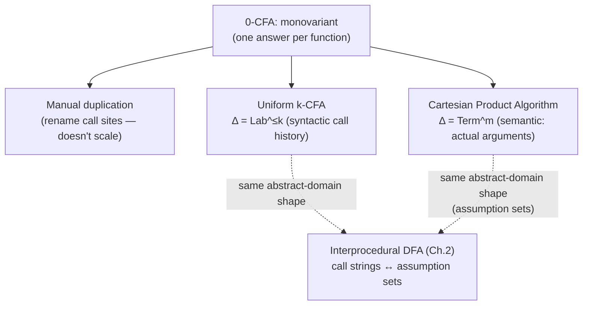

[[book-guidelines|↩ Back to guidelines]]

## The precision ceiling of "0"

[[Control-Flow-Analysis-(0-CFA-and-Constraint-Based-Analysis)|0-CFA]] treats every call to a given function abstraction identically — the "0" means zero bits of context distinguish one call from another. The book's Example 3.32 shows exactly where this costs real precision:

```
let f = (fn x => x)
in ((f f) (fn y => y))
```

The least 0-CFA solution correctly determines $\widehat\rho(x) = \{\mathtt{fn\ x=>x},\ \mathtt{fn\ y=>y}\}$ — because `x` is used as *both* the identity function's argument in `f f` (bound to `f` itself) *and* as the argument in the outer application (bound to `fn y=>y`), and 0-CFA merges both call instances of `x` into one global entry. But by tracing the actual reduction by hand, only `fn y => y` is ever the *final* result — the merge has smeared together two genuinely different runtime instances of the same variable. This is precisely the [[Interprocedural-Data-Flow-Analysis|context-insensitivity]] problem from Chapter 2's interprocedural analysis, reappearing in Control Flow Analysis under its own name: **monovariant** analysis (one abstract answer per function, regardless of call site) versus **polyvariant** analysis (potentially different answers per call site or per calling context).

## The cheapest fix: don't analyze, duplicate

**A trick worth knowing before reaching for machinery.** Example 3.33 shows you can sometimes sidestep the whole problem: rename the two occurrences of `f` in the identity-function role so they're syntactically distinct —

```
let f1 = (fn x1 => x1) in let f2 = (fn x2 => x2) in (f1 f2) (fn y => y)
```

— and now 0-CFA, unmodified, *already* determines the precise answer, because `x1` and `x2` are different variables with different (0-CFA-tracked) abstract environments. This works whenever the program's actual call structure is statically bounded and small enough to duplicate by hand (or by a preprocessing inlining pass) — but it obviously doesn't scale to recursive functions called an unbounded number of times, which is exactly the case that motivates real context-sensitivity mechanisms rather than syntactic workarounds.

## Uniform k-CFA: context = the last $k$ call sites

**The core idea.** Extend the abstract domains so a **context** $\delta \in \Delta = \mathbf{Lab}^{\leq k}$ — a sequence of at most $k$ call-site labels, the most recent $k$ calls that led here — tags every abstract value and every environment lookup. A **context environment** $ce \in \mathbf{CEnv} = \mathbf{Var}\to\Delta$ tracks, for each variable, which context its *current* binding was created under; abstract values now carry a context environment alongside each closure term: $\widehat v \in \mathcal P(\mathbf{Term}\times\mathbf{CEnv})$. This is a direct, disciplined generalization of exactly the closure structure from [[The-WHILE-and-FUN-Model-Languages|FUN's SOS]] — a real closure pairs a term with an environment; a $k$-CFA abstract value pairs a term with a *context environment*, recording not the actual bindings but *which context* each free variable's binding came from.

The `[app]` clause (Table 3.10) is where context actually gets threaded through:

$$
\delta_0 = \lceil \delta,\ell\rceil_k \qquad\qquad ce_0' = ce_0[x\mapsto\delta_0]
$$

Read this as: the callee's context $\delta_0$ is formed by appending the call-site label $\ell$ to the caller's context $\delta$, then truncating to the last $k$ entries ($\lceil\cdot\rceil_k$) — a bounded, sliding window over the call history, exactly the same **bounded call-string** idea flagged in [[Interprocedural-Data-Flow-Analysis|Chapter 2's interprocedural analysis]] as the practical fix for call strings' unboundedness. The formal parameter $x$ then gets *this* fresh context recorded in the context environment used to analyze the callee's body — so two calls to the same function abstraction, differing in even their most recent call label, get analyzed with genuinely separate context-tagged bindings for $x$, resolving Example 3.32's precision loss without needing to hand-duplicate the source.

**Direct kinship with Chapter 2.** The book explicitly closes this loop (§3.6.1, "Interprocedural analysis revisited"): $k$-CFA's abstract domain $\Delta\to\mathcal P(\mathbf{Term}\times\mathbf{CEnv})$ has exactly the same shape as [[Interprocedural-Data-Flow-Analysis|the embellished Monotone Framework's]] $\Delta\to L$ — Control Flow Analysis with call-string context and interprocedural [[Data-Flow-Analysis|Data Flow Analysis]] with call-string context are, structurally, **the same construction applied to different base analyses**. This is another instance of the book's founding thesis: not just that the four *base* techniques share a common shape, but that the *refinements* on top of them (context-sensitivity, in this case) transfer wholesale between them too.

**Grounding it — Rust.** Bounded call-string context as a first-class abstract-value tag:

```rust
type Context = SmallVec<[Label; K]>; // Lab^{≤k}, truncated on push

fn push_context(delta: &Context, call_site: Label, k: usize) -> Context {
    let mut d = delta.clone();
    d.push(call_site);
    if d.len() > k { d.remove(0); } // ⌈δ, ℓ⌉_k
    d
}

#[derive(Clone, PartialEq, Eq, Hash)]
struct AbstractClosure { term: FnTerm, context_env: HashMap<VarId, Context> }
// Val = P(Term × CEnv) — same shape as a real closure (term, Env),
// but recording *which context bound this*, not the binding itself
```

## The Cartesian Product Algorithm: context = the actual arguments

**A genuinely different notion of context.** Uniform $k$-CFA's context is *syntactic* — call-site labels, independent of what values actually flow through the call. The **Cartesian Product Algorithm (CPA)** — developed originally for object-oriented languages, adapted here to a FUN variant with $m$-ary functions $\mathbf{fn}\ x_1,\ldots,x_m\Rightarrow e_b$ — takes context to be **semantic**: $\delta\in\Delta = \mathbf{Term}^m$, the actual tuple of abstract argument values supplied at this call. The key clause:

$$
\forall\delta_b\in\widehat{\mathsf C}(\ell_1,\delta)\times\cdots\times\widehat{\mathsf C}(\ell_m,\delta):\quad \{\delta_b\}\subseteq\widehat\rho(x_1)\times\cdots\times\widehat\rho(x_m) \wedge (\widehat{\mathsf C},\widehat\rho)\models^{\delta_b}_{\mathrm{CPA}} t_b^{\ell_b} \wedge \widehat{\mathsf C}(\ell_b,\delta_b)\subseteq\widehat{\mathsf C}(\ell,\delta)
$$

— literally the **Cartesian product** $\widehat{\mathsf C}(\ell_1,\delta)\times\cdots\times\widehat{\mathsf C}(\ell_m,\delta)$ that gives the algorithm its name: the function body is analyzed once *per distinct tuple of actual argument abstractions* that could reach this call, not once per call-site history. **[[Shape-Analysis#What this buys you|What this buys you]] concretely**: if a function is called with arguments `(Int, Bool)` at one point and `(Int, String)` at another, CPA analyzes the body twice — once specialized to each argument-type combination — capturing exactly the value-dependent precision that a purely syntactic call-string context (which only sees *where* a call came from, not *what* it was called with) cannot.

**A practical concern the book flags directly.** Naively re-analyzing a function body for every argument-tuple recomputation would blow up; the book's fix is **memoization via templates** — $(\widehat{\mathsf C},\widehat\rho)\models^{\delta_b}_{\mathrm{CPA}} t_b^{\ell_b}$ derivations are cached in a global pool keyed by $(\ell_b,\delta_b)$, so a repeated argument-tuple reuses the prior analysis rather than redoing it. And since $\widehat{\mathsf C}(\ell_1,\delta)\times\cdots\times\widehat{\mathsf C}(\ell_m,\delta)$ only ever *grows* monotonically as the enclosing fixed-point computation proceeds, the product can be computed **lazily**, incrementally extending rather than recomputing from scratch each time one factor grows — a direct echo of the incremental-worklist discipline from [[Monotone-Frameworks|MFP]].

**Where CPA sits relative to "small assumption sets."** The book closes the loop here too: reformulating [[Interprocedural-Data-Flow-Analysis|Chapter 2's "small assumption sets"]] ($\Delta = D$, the analysis's own property domain) against $\Delta = \mathbf{Term} = D$ shows the two are, again, "variations over a theme" — assumption-set-based interprocedural analysis and CPA both key context by the analysis's *own value domain* rather than by syntactic call history, in contrast to $k$-CFA/call-strings' syntactic approach.

## The precision/cost spectrum, made explicit

| Technique | Context $\Delta$ | Granularity | Cost driver |
|---|---|---|---|
| 0-CFA (monovariant) | none | one answer per function | cheapest, least precise |
| Uniform $k$-CFA (polyvariant) | $\mathbf{Lab}^{\leq k}$ | one answer per last-$k$-calls history | exponential in $k$ |
| CPA (polyvariant) | $\mathbf{Term}^m$ | one answer per distinct argument-tuple | exponential in number of distinct argument combinations |

Both $k$-CFA and CPA are **polyvariant** — the general term for "more than one abstract answer per function" — but they polyvary along *different axes*: call history versus actual argument shape. Neither is uniformly better; $k$-CFA is exponential in $k$ even though $k$ is a small syntactic knob (flagged in the book's Concluding Remarks as a known hard complexity result), while CPA's cost scales with how many genuinely distinct argument-value combinations actually reach a given function — cheap when argument diversity is low, expensive when it isn't.

## Where this leads



This chapter is the payoff of the book's recurring "different-looking techniques, same underlying shape" argument applied at the level of *refinements*, not just base analyses: context-sensitivity in Control Flow Analysis and context-sensitivity in interprocedural Data Flow Analysis turn out to be the identical construction, instantiated twice. For the standing project, CPA's argument-tuple-keyed context is the more directly relevant precedent (`type-theory`, `automated-reasoning`): a dependent-type elaborator routinely needs *exactly* this kind of value-dependent specialization — the same function checked differently depending on which concrete types or refinement predicates it's applied to — which is structurally a CPA-style polyvariant analysis over your term representation, memoized by argument shape exactly as the book's template-pool trick does, rather than a $k$-CFA-style syntactic call-history context that a purely-value-dependent type system has less use for.
