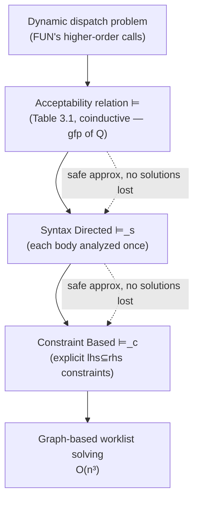

[[book-guidelines|↩ Back to guidelines]]

## The problem [[The-WHILE-and-FUN-Model-Languages|FUN]] was built to expose

Recall the motivating example from Chapter 1: `let f = fn x => x 1; g = fn y => y+2; h = fn z => z+3 in (f g) + (f h)`. The application `x 1` inside `f`'s body has no syntactically fixed target — control flows to *whatever `x` happens to be bound to*, and that depends on the caller. This is the **dynamic dispatch problem**, and it's exactly the thing [[Data-Flow-Analysis|Data Flow Analysis's]] flow graphs couldn't handle: `flow(S)` was computable by pure structural recursion over WHILE because every `goto`-like transfer was visible in the syntax. In FUN it isn't. **Control Flow Analysis** (0-CFA in this chapter's specific, context-free form) is the missing piece: compute, for every subexpression, the set of function abstractions it might evaluate to — which is precisely the interprocedural flow information [[Interprocedural-Data-Flow-Analysis|Chapter 2's `inter-flow_*`]] needed but couldn't derive for a language with first-class functions.

## Abstract caches and abstract environments

A 0-CFA analysis result is a pair $(\widehat{\mathsf C}, \widehat\rho)$:

$$
\widehat v \in \widehat{\mathbf{Val}} = \mathcal{P}(\mathbf{Term}) \qquad \widehat\rho \in \widehat{\mathbf{Env}} = \mathbf{Var}\to\widehat{\mathbf{Val}} \qquad \widehat{\mathsf C} \in \mathbf{Cache} = \mathbf{Lab}\to\widehat{\mathbf{Val}}
$$

An abstract value is a *set of function-abstraction terms* — `0-CFA` doesn't track data values at all here (that's added back in [[Combining-Control-Flow-and-Data-Flow-Analysis|the next chapter's extension]]). $\widehat{\mathsf C}(\ell)$ answers "what functions could the subexpression labelled $\ell$ evaluate to"; $\widehat\rho(x)$ answers "what functions could variable $x$ be bound to." The **"0"** in 0-CFA means *no context sensitivity at all* — every call site of the same function abstraction is analyzed identically, a choice this chapter accepts and [[Context-Sensitivity-in-Control-Flow-Analysis|k-CFA]] later relaxes.

Read $\widehat{\mathsf C}$ and $\widehat\rho$ as abstractions of exactly the concrete machinery from [[The-WHILE-and-FUN-Model-Languages|FUN's closure-based SOS]]: $\widehat\rho$ over-approximates the set of environments that could occur in real closures at runtime, and $\widehat{\mathsf C}$ over-approximates the set of "execution profiles" — what each labelled subexpression could evaluate to across every possible run. This is the same shape of relationship as an ordinary Data Flow lattice to the states it describes, just lifted from "sets of definitions" to "sets of function terms."

## The acceptability relation: a specification, not yet an algorithm

Rather than compute $(\widehat{\mathsf C},\widehat\rho)$ directly, the book first defines what it means for a *proposed guess* to be **acceptable** — a relation $(\widehat{\mathsf C},\widehat\rho)\models e$, given clause by clause in Table 3.1:

$$
\begin{aligned}
[con] &\quad (\widehat{\mathsf C},\widehat\rho)\models c^\ell \text{ always} \\
[var] &\quad (\widehat{\mathsf C},\widehat\rho)\models x^\ell \iff \widehat\rho(x)\subseteq\widehat{\mathsf C}(\ell) \\
[fn] &\quad (\widehat{\mathsf C},\widehat\rho)\models(\mathbf{fn}\ x\Rightarrow e_0)^\ell \iff \{\mathbf{fn}\ x\Rightarrow e_0\}\subseteq\widehat{\mathsf C}(\ell) \\
[app] &\quad (\widehat{\mathsf C},\widehat\rho)\models(t_1^{\ell_1}\ t_2^{\ell_2})^\ell \iff (\widehat{\mathsf C},\widehat\rho)\models t_1^{\ell_1} \wedge (\widehat{\mathsf C},\widehat\rho)\models t_2^{\ell_2}\ \wedge \\
&\qquad \forall(\mathbf{fn}\ x\Rightarrow t_0^{\ell_0})\in\widehat{\mathsf C}(\ell_1):\ (\widehat{\mathsf C},\widehat\rho)\models t_0^{\ell_0} \wedge \widehat{\mathsf C}(\ell_2)\subseteq\widehat\rho(x) \wedge \widehat{\mathsf C}(\ell_0)\subseteq\widehat{\mathsf C}(\ell)\ \wedge\ (\cdots\text{same for } \mathbf{fun})
\end{aligned}
$$

Read $[var]$ as: for the guess to be acceptable, every function $x$ could be bound to must already be recorded at $x$'s own use site. Read $[app]$ operationally: *for every function abstraction the operator position could evaluate to* (per $\widehat{\mathsf C}(\ell_1)$), demand that (a) its body is itself acceptably analyzed, (b) the actual parameter's possible values flow into the formal parameter ($\widehat{\mathsf C}(\ell_2)\subseteq\widehat\rho(x)$ — this is exactly the "definition reaches a use" link, structurally identical to a [[Data-Flow-Analysis|ud-chain]], just for functions instead of values), and (c) the body's result flows out to the whole application's label. This is the analysis's version of "call-by-value parameter passing," expressed entirely as set-inclusion constraints rather than as an operational step.

**What breaks without coinduction.** The clause $[app]$ is *not* in a form amenable to ordinary structural induction on $e$: checking acceptability of $(t_1^{\ell_1}\ t_2^{\ell_2})^\ell$ requires checking acceptability of $t_0^{\ell_0}$ — a function *body* that is not a syntactic subexpression of the application at all (it lives wherever the `fn` was originally written, possibly far away). A naive least-fixed-point ("build up the smallest relation satisfying the rules") reading would need to already know $\widehat{\mathsf C}(\ell_1)$'s contents before it could ever include a body's acceptability — a circular dependency inductive definitions can't resolve. The book's fix: define $\models$ **coinductively**, as the *greatest* fixed point of the monotone functional $\mathcal{Q}$ built from Table 3.1's clauses, over the complete lattice $((\widehat{\mathbf{Cache}}\times\widehat{\mathbf{Env}}\times\mathbf{Exp})\to\{true,false\},\sqsubseteq)$. Concretely: start by *assuming* everything is acceptable, then only reject what a finite unfolding of the rules can actually disprove — the dual of the usual "start from nothing, only accept what a finite proof can build."

**Why this specific analysis needs the *greatest*, not the least, fixed point.** A least-fixed-point reading would, for a genuinely non-terminating program (recall FUN's `loop` example from [[The-WHILE-and-FUN-Model-Languages|Chapter 3.1's `loop`]]: `let g = fun f x => f (fn y => y) in g (fn z => z)`, which calls itself forever), require an *infinite* derivation to establish acceptability of the ever-recurring call — and an inductively-defined relation only contains what a *finite* derivation tree can prove. The greatest fixed point instead only requires that no finite unfolding of the rules can find a contradiction; it happily accepts the infinite, self-consistent unfolding that a real (non-terminating) execution corresponds to. This mirrors exactly why [[The-WHILE-and-FUN-Model-Languages|WHILE's SOS]] needed to be small-step rather than big-step: a big-step semantics represents non-termination by the *absence* of a derivation, but here you need non-termination to have a *positive*, checkable acceptability witness — which only a coinductive (greatest-fixed-point) reading supplies.

**Grounding it — Lean.** This inductive/coinductive distinction is precisely the one your elaborator's kernel will face between `Prop`-level inductive definitions (finite proof terms, well-founded) and Lean's coinductive machinery for potentially-infinite structures. The acceptability relation here is structurally the same object as a **bisimulation**: you're not asking "can I build this fact up from nothing in finitely many steps," you're asking "is this fact consistent with itself, forever" — exactly the proof principle [[Induction-and-Coinduction|Chapter 15/Appendix B's coinduction]] formalizes, applied here concretely to a real static analysis rather than in the abstract.

**Grounding it — Rust.** A worked acceptability *checker* (not yet a solver — this only verifies a proposed guess) makes the "recursive call not on a subexpression" shape concrete:

```rust
fn acceptable(cache: &Cache, env: &Env, e: &Expr) -> bool {
    match &e.term {
        Term::Var(x) => env.get(x).is_subset(&cache.get(e.label)),
        Term::Fn { .. } => cache.get(e.label).contains_term(&e.term),
        Term::App(t1, t2) => {
            acceptable(cache, env, t1) && acceptable(cache, env, t2)
            && cache.get(t1.label).closures().all(|(param, body, _)| {
                // body is NOT a subexpression of e — this is the non-structural
                // recursive call that forces a coinductive reading of `acceptable`
                acceptable(cache, env, &body)
                    && cache.get(t2.label).is_subset(&env.get(param))
                    && cache.get(body.label).is_subset(&cache.get(e.label))
            })
        }
        // ... [if], [let], [op] follow Table 3.1 directly
        _ => unimplemented!(),
    }
}
```

In practice this recursion terminates on any finite program (finitely many labels to revisit, with memoization) — the coinductive reading matters for *justifying* that this terminating check is sound even when the program *itself* wouldn't terminate, not for making the checker itself loop forever.

## From specification to algorithm: syntax-directed, then constraint-based

Table 3.1's acceptability relation is a *specification*: checking a guess, or worse, enumerating candidate guesses to find the least one, is not remotely tractable as stated (Proposition 3.13's implicit algorithm involves enumerating all candidates). Two refinement steps recover tractability, each a **safe approximation of the previous stage** — $(\widehat{\mathsf C},\widehat\rho)\models_B e_* \implies (\widehat{\mathsf C},\widehat\rho)\models_A e_*$, so the least solution of the more computational spec is still a valid solution of the more semantic one:

**Step 1 — Syntax Directed 0-CFA ($\models_s$).** Reformulate so each function *body* is analyzed exactly once, in the clause for `fn`/`fun` themselves rather than repeatedly in every `app` clause that happens to call it. This trades a little completeness — bodies now get analyzed even if *unreachable* — for a specification that only ever recurses on genuine subexpressions, once each. Because the specification is syntax-directed, there's exactly one relation satisfying it regardless of whether you read it inductively or coinductively — the induction/coinduction distinction that mattered for Table 3.1 dissolves once recursion follows the syntax tree.

**Step 2 — Constraint Based 0-CFA ($\models_c$).** Mechanically expand $\models_s$'s recursive structure into an explicit, finite set of constraints $\mathcal{C}_*[\![e_*]\!]$ of two shapes:

$$
lhs \subseteq rhs \qquad\qquad \{t\}\subseteq rhs' \Rightarrow lhs \subseteq rhs
$$

— ordinary inclusion constraints, plus *conditional* ones (read as: "if term $t$ is ever found in $rhs'$, then also demand $lhs\subseteq rhs$" — exactly what $[app]$'s "$\forall(\mathbf{fn}\ x\Rightarrow t_0^{\ell_0})\in\widehat{\mathsf C}(\ell_1)$" needed, now reified as data instead of a universally-quantified side condition). Proposition 3.21 confirms this preserves exactly the least solution: $(\widehat{\mathsf C},\widehat\rho)\models_s e_*$ iff $(\widehat{\mathsf C},\widehat\rho)\models_c \mathcal{C}_*[\![e_*]\!]$.

**Solving the constraints.** Once you have a finite constraint set, it's a genuine fixed-point problem over $\widehat{\mathbf{Cache}}_*\times\widehat{\mathbf{Env}}_*$: the naive approach is $O(n^5)$ where $n$ is the expression's size; representing the constraints as a graph and propagating along edges (a worklist algorithm, structurally the same idea as [[Monotone-Frameworks|MFP's worklist solver]], but now over a graph whose edges are themselves partly determined by what's already been discovered — conditional constraints activate new edges dynamically) brings this down to $O(n^3)$. The pattern — "specification correct but intractable → syntax-directed reformulation → explicit constraints → efficient graph-based solving" — is a direct generalization of the [[Monotone-Frameworks|MFP worklist algorithm's]] own recipe, adapted to a setting where the flow graph itself isn't given up front but has to be discovered as the analysis proceeds.

## Where this leads



0-CFA's acceptability relation is the concrete object [[Combining-Control-Flow-and-Data-Flow-Analysis|the next chapter]] extends with a Data Flow component (splitting $\widehat{\mathsf C}$ into a term part and a data part, and staging the `[if]` clause to only recurse into live branches), and its "0" — no context — is exactly the axis [[Context-Sensitivity-in-Control-Flow-Analysis|Chapter 9's k-CFA]] generalizes. For the standing project, this chapter's coinductive acceptability relation is the most concrete rehearsal in the book for how your elaborator's **metavariable unification** (`type-theory`, `automated-reasoning`) will need to reason about self-referential constraints — an occurs-check-passing metavariable solution is accepted precisely because no finite unfolding of the unification rules finds a contradiction, the same greatest-fixed-point discipline Table 3.1 uses to accept `loop`'s infinite, self-consistent call structure. The constraint-based reformulation is likewise a direct precedent for how your refinement-type inference will turn typing-judgment-shaped specifications into an explicit, solvable constraint set (`sat-smt-csp`) rather than leaving correctness as an unimplementable relation.
