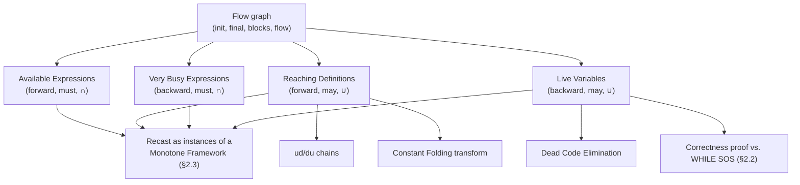

[[book-guidelines|↩ Back to guidelines]]

## From "the program" to "a graph you can compute over"

[[The-WHILE-and-FUN-Model-Languages|WHILE's labelled elementary blocks]] exist for exactly this chapter: Data Flow Analysis needs to talk about *program points*, and the labels are what turn a syntax tree into something with addressable points at all. The first job of §2.1 is entirely mechanical — walk the syntax once and derive a **flow graph** — and it's worth taking seriously precisely because everything downstream (four classical analyses, then [[Monotone-Frameworks|Monotone Frameworks]] in general) is defined *in terms of* this graph, never in terms of the original tree-shaped syntax again.

Four functions do the walking:

$$
init : \mathbf{Stmt} \to \mathbf{Lab} \qquad final : \mathbf{Stmt} \to \mathcal{P}(\mathbf{Lab}) \qquad blocks : \mathbf{Stmt} \to \mathcal{P}(\mathbf{Blocks}) \qquad flow : \mathbf{Stmt} \to \mathcal{P}(\mathbf{Lab}\times\mathbf{Lab})
$$

`init` is the unique entry label; `final` is the set of exit labels (a sequence has exactly one, but a conditional has as many as its branches, and — this is the detail worth noticing — a `while`-loop's only final label is its own *test*, because the loop "terminates immediately after the test has evaluated to false," never inside the body). `blocks` collects the elementary blocks (assignments, tests, `skip`s) that carry a label; `flow` collects the directed edges between them:

$$
flow(\mathbf{while}\ [b]^\ell\ \mathbf{do}\ S) = flow(S) \cup \{(\ell, init(S))\} \cup \{(\ell', \ell) \mid \ell' \in final(S)\}
$$

reads exactly as you'd draw it: enter the loop at the test, branch into the body when true, and every path out of the body loops back to the test — never anywhere else. Once you have `labels(S)` (the graph's nodes) and `flow(S)` (its edges), the original tree is no longer needed; every analysis in this chapter is stated purely as a function of this graph.

**What breaks without this.** If you tried to define an analysis directly on the recursive syntax tree instead, you'd need a different equation shape for every nesting pattern a `while`-loop or `if` could appear in — recursion through the AST doesn't compose the way traversal of an explicit graph does, particularly once loops introduce back-edges that a naive AST walk has no natural way to represent as "flow." Compiling to the graph once, up front, is what lets every later analysis just say "for all $(\ell,\ell') \in flow(S)$" and be done with structural recursion forever.

**Grounding it — Rust.** This is precisely the compile-once-to-a-CFG step every real compiler backend performs before running any dataflow pass:

```rust
struct FlowGraph {
    labels: HashSet<Label>,
    edges: HashSet<(Label, Label)>, // flow(S)
    entry: Label,                  // init(S)
    exits: HashSet<Label>,         // final(S)
}

fn build_flow(s: &Stmt) -> FlowGraph {
    match s {
        Stmt::Seq(s1, s2) => {
            let (mut g1, g2) = (build_flow(s1), build_flow(s2));
            g1.edges.extend(g2.edges);
            g1.labels.extend(g2.labels);
            for l in &g1.exits { g1.edges.insert((*l, g2.entry)); }
            g1.exits = g2.exits;
            g1
        }
        Stmt::While { label, body, .. } => {
            let mut gb = build_flow(body);
            gb.edges.insert((*label, gb.entry));
            for l in &gb.exits { gb.edges.insert((*l, *label)); }
            gb.entry = *label;
            gb.exits = HashSet::from([*label]); // exit is the TEST, not the body
            gb.labels.insert(*label);
            gb
        }
        // Assign/Skip/If follow the same pattern as init/final/flow above
        _ => unimplemented!(),
    }
}
```

## Four analyses, one shared shape — and one axis of variation

All four classical analyses are built from the same two ingredients per block: **kill** (what this block invalidates) and **gen** (what this block newly establishes), combined by the same equation shape at entry and exit. What makes them four *different* analyses, rather than one, is where each sits on two independent axes the book is careful to name explicitly:

| Analysis | Direction | may/must | Question |
|---|---|---|---|
| Available Expressions | forward | **must** | which expressions are *definitely* already computed, unmodified, on *every* path in |
| Reaching Definitions | forward | **may** | which assignments *could* still be live, on *some* path in |
| Very Busy Expressions | backward | **must** | which expressions will *definitely* be used, unmodified, on *every* path out |
| Live Variables | backward | **may** | which variables *could* still be used, on *some* path out |

**Direction** (forward vs. backward) says whether entry-info is computed from predecessors' exit-info (via `flow`) or exit-info from successors' entry-info (via `flow`$^R$, the reversed edge set). **may vs. must** says whether the equations combine incoming information by **union** (may — true if true along *any* path) or **intersection** (must — true only if true along *every* path). This single distinction is *why* Available Expressions needs the largest fixed point while Reaching Definitions needs the smallest: intersection-based equations shrink monotonically as you consider more paths, so their natural solution starts from "everything" and prunes down (largest solution, computed as $AExp_* \cap \cdots$), while union-based equations grow monotonically, so theirs starts from "nothing" and accumulates (least solution, starting from $\emptyset$).

### Available Expressions Analysis (forward, must)

*"For each program point, which expressions must already have been computed, and not later modified, on all paths to the point."* Table 2.1:

$$
\begin{aligned}
kill_{AE}([x:=a]^\ell) &= \{a' \in \mathbf{AExp}_* \mid x \in FV(a')\} &
gen_{AE}([x:=a]^\ell) &= \{a' \in \mathbf{AExp}(a) \mid x \notin FV(a')\} \\
\mathsf{AE}_{entry}(\ell) &= \begin{cases}\emptyset & \ell = init(S_*) \\ \bigcap\{\mathsf{AE}_{exit}(\ell') \mid (\ell',\ell)\in flow(S_*)\} & \text{otherwise}\end{cases} &
\mathsf{AE}_{exit}(\ell) &= (\mathsf{AE}_{entry}(\ell)\setminus kill_{AE}(B^\ell)) \cup gen_{AE}(B^\ell)
\end{aligned}
$$

The $\bigcap$ at merge points is the "must" in action: an expression is available entering a merge point only if it was available along **every** incoming edge. Use case: don't recompute `a+b` if you can prove it's still sitting wherever you last put it.

### Reaching Definitions Analysis (forward, may)

*"For each program point, which assignments may have been made and not overwritten, when execution reaches this point along some path."* Same shape, but $\bigcup$ instead of $\bigcap$, and the domain is pairs $(x,\ell) \in \mathbf{Var}_* \times \mathbf{Lab}_*^?$ — a variable together with the label of the assignment that defined it (or the special label `?` for "possibly still uninitialized"). Worked example (`x:=5; y:=1; while x>1 do (y:=x*y; x:=x-1)`, labels 1–5): *all* of the assignments reach the entry of block 4 (label 1 and 2 reach only on the first iteration, but they're still "may" there), while only 1, 4, and 5 reach the entry of block 5 — because block 4 always overwrites `y`'s previous definition on any iteration after the first. This is the analysis that later licenses [[The-Nature-and-Scope-of-Program-Analysis|Constant Folding]]: a use is foldable to a literal only if *every* reaching definition of that variable assigns the same constant.

### Very Busy Expressions Analysis (backward, must)

*"For each program point, which expressions must be very busy at the exit from the point"* — must be used, unmodified, on **every** path leaving the point. Symmetric to Available Expressions but backward: `kill`/`gen` are the same functions, but the recursive equation runs against `flow`$^R$ instead of `flow`. Worked example: in `if [a>b]^1 then ([x:=b-a]^2;[y:=a-b]^3) else ([y:=b-a]^4;[x:=a-b]^5)`, both `a-b` and `b-a` are very busy right at the start of the conditional — every branch is going to need both — so they can be **hoisted** above the `if` entirely, computed once instead of (potentially) twice.

### Live Variables Analysis (backward, may)

*"For each program point, which variables may be live at the exit from the point"* — used along **some** path without being redefined first. Table 2.4's kill/gen operate on variables rather than expressions:

$$
kill_{LV}([x:=a]^\ell) = \{x\} \qquad\qquad gen_{LV}([x:=a]^\ell) = FV(a)
$$

This is the analysis the book picks to *prove correct* against the [[The-WHILE-and-FUN-Model-Languages|WHILE SOS]] (§2.2) — its use for **Dead Code Elimination** is immediate and intuitive: if $x \notin \mathsf{LV}_{exit}(\ell)$ and block $\ell$ is an assignment to $x$, that assignment can be deleted outright, since nothing downstream, on any path, will ever read the value it produces. Worked example: in `x:=2; y:=4; x:=1; (if y>x then z:=y else z:=y*y); x:=z`, `x` is not live at the exit of the *first* assignment (label 1) — it gets overwritten at label 3 before anything reads it — so that first `x:=2` is provably dead.

## Solving the equations — and reusing them for good measure

The book doesn't just define $\mathsf{RD}_{entry}/\mathsf{RD}_{exit}$; it shows they can be **solved** by *Chaotic Iteration* — repeatedly apply the equations to an initial (all-$\emptyset$, for a least/may solution) approximation until nothing changes. This is the seed of the general **MFP worklist algorithm** developed for [[Monotone-Frameworks|Monotone Frameworks]] in the next section — Data Flow Analysis's four hand-crafted examples are, not coincidentally, the first four instances of the general framework the book is building toward.

Once you have Reaching Definitions, you get **Use-Definition (ud) chains** and **Definition-Use (du) chains** almost for free: $UD(x,\ell)$ — "which definitions of $x$ reach this use" — is literally $\{\ell' \mid (x,\ell') \in \mathsf{RD}_{entry}(\ell)\}$ when $x$ is actually used (i.e. `gen`'d) at $\ell$; $DU$ is its converse. These chains are exactly the direct value-producer-to-value-consumer edges a compiler's SSA construction or a dependence analysis wants — Reaching Definitions is the semantic content, ud/du chains are just that content reindexed by *use-site* instead of by program point.

## Where this leads



Every one of these four analyses is about to be *re-derived* in the next section as a special case of a single abstract object — a complete lattice satisfying the Ascending Chain Condition, plus a space of monotone transfer functions — which is precisely the payoff the book promised in its opening chapter: four "unrelated-looking" optimizations turn out to be four points on one mathematical structure. For the standing project, the may/must (∪/∩) distinction here is the most direct, concrete precursor to the **over- vs. under-approximation** split your compiler's Hoare-contract generator will need to keep straight (`static-analysis`): Reaching-Definitions-style "may" reasoning over-approximates for soundly proving invariants hold everywhere, while a CSP-style counterexample search (`sat-smt-csp`) needs the dual, "must-fail-somewhere" reasoning to soundly report a bug's presence.
