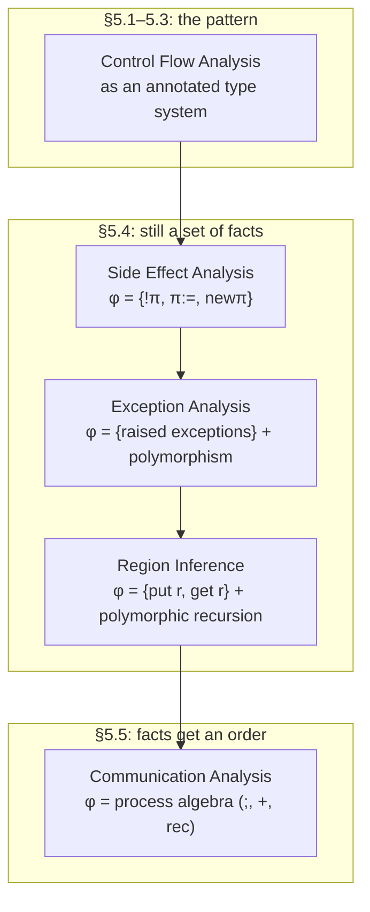

[[book-guidelines|↩ Back to guidelines]]

## Why this chapter exists

Sections 5.1–5.3 did something sly: they took Control Flow Analysis — a genuinely different-looking beast from ordinary type checking, built out of acceptability relations and constraint solving in Chapter 3 — and re-expressed it as an *annotated type system*. The annotation on a function arrow, $\hat\tau_1 \xrightarrow{\varphi} \hat\tau_2$, recorded which closures could flow into that function position. That single move bought two things: a semantic soundness proof by subject reduction (instead of a bespoke acceptability argument), and a type-inference algorithm (instead of a bespoke worklist).

This chapter's real content, §5.4–§5.5, is the payoff: **the same pattern generalizes to almost anything you'd want to know about a program's dynamic behavior, not just "which functions might get called here."** Swap out what the annotation *means* and you get a different analysis for free — the typing rules, the soundness machinery, and (mostly) the inference algorithm come along for the ride. The book works through four instances:

- **Side Effect Analysis** — which reference cells get read or written where.
- **Exception Analysis** — which exceptions can escape an expression uncaught.
- **Region Inference** — which stack frame a value's memory should live in.
- **Communication Analysis** — the *temporal order* in which channels get created, and messages sent and received.

The first three are still just *sets* of atomic facts — an effect $\varphi$ is a set of program points, exceptions, or (accesses, region-placements). The fourth breaks that mold: a behaviour needs sequencing, choice, and recursion, because "channel $A$ created, then a value sent on it" is a fundamentally different fact from "channel $A$ created" and "value sent on $A$" reported separately.



**What breaks without this framing:** if each of these analyses were designed from scratch — its own semantics, its own soundness theorem, its own algorithm — you'd redo the same subject-reduction argument four times with cosmetic changes to the annotation clauses. Treating "annotated type system" as a *parametrized* construction (parametrized over what the annotations mean and how they combine) is what makes four analyses cost roughly the proof effort of one and a half.

---

## The recurring skeleton

Every analysis in this chapter shares a judgement shape

$$\hat\Gamma \vdash e : \hat\tau \mathbin{\&} \varphi$$

read as: "under type-and-effect assumptions $\hat\Gamma$, expression $e$ has annotated type $\hat\tau$ and, along the way, exhibits effect $\varphi$." And every analysis needs exactly one non-obvious rule to make this well-behaved: **[sub]**, the combined subeffecting-and-subtyping rule.

$$\frac{\hat\Gamma \vdash e : \hat\tau \mathbin{\&} \varphi}{\hat\Gamma \vdash e : \hat\tau' \mathbin{\&} \varphi'} \quad \text{if } \hat\tau \le \hat\tau' \text{ and } \varphi \subseteq \varphi'$$

Two rules are hiding inside this one: **subeffecting** (you may always claim a larger effect than what actually happens — safe over-approximation, the same idea that runs through every analysis in this book) and **subtyping on annotated types** (you may widen $\hat\tau$ to $\hat\tau'$ when their *underlying* types agree — "shape conformant" subtyping, since $\hat\tau \le \hat\tau'$ forces $\lfloor\hat\tau\rfloor = \lfloor\hat\tau'\rfloor$).

The book is explicit about *why* you need both halves together, not just one: dropping either one still gives a well-defined system, but only the combined rule gives a **conservative extension** of the underlying (unannotated) type system — meaning every program the plain type checker accepts, the effect system also accepts, just with an effect attached. Drop [sub] entirely and you lose that guarantee outright.

The variance pattern is the part worth internalizing, because it recurs in every subsection below and it is *exactly* the variance rule a Rust programmer already has muscle memory for:

$$\frac{\hat\tau_1' \le \hat\tau_1 \quad \hat\tau_2 \le \hat\tau_2' \quad \varphi \subseteq \varphi'}{\hat\tau_1 \xrightarrow{\varphi} \hat\tau_2 \le \hat\tau_1' \xrightarrow{\varphi'} \hat\tau_2'}$$

Function types are **contravariant in the argument, covariant in the result and the effect** — a function is safe to use in a context expecting a *smaller* argument-domain, a *larger* result, and a *larger* set of possible effects. This is precisely `fn(&T) -> U` subtyping in a language with subtyping: a function accepting `&dyn Trait` can stand in for one expecting `&ConcreteType`, never the reverse.

```rust
// The book's contravariance/covariance rule, made concrete.
// A handler expecting the *more general* input and promising the
// *more specific* (smaller-effect) output can always be used where a
// narrower/looser one was expected — never the other way around.
trait Animal {}
struct Dog;
impl Animal for Dog {}

// fn(&dyn Animal) -> Dog  can be used wherever  fn(&Dog) -> dyn Animal  is expected:
// contravariant in the argument (dyn Animal is "wider" than Dog),
// covariant in the result (Dog is "narrower" than dyn Animal).
fn handler(_: &dyn Animal) -> Dog { Dog }
```

---

## Side Effect Analysis (§5.4.1)

**The question:** for each subexpression, *which* reference cells does it create, read from, or write to?

The book extends `FUN` with mutable references — `new`$_\pi x := e_1$ `in` $e_2$ (allocate, at program point $\pi$), `!x` (dereference), `x := e` (assign) — and gives them a small-step semantics threading an explicit store $\varsigma : \mathbf{Loc} \to_{\mathrm{fin}} \mathbf{Val}$.

**What breaks without this:** without *some* discipline, "does this closure mutate shared state" is undecidable in general and invisible in the type of the closure — exactly the problem languages with unrestricted mutable aliasing (or Rust without the borrow checker) are built to prevent. Side Effect Analysis is the *static, over-approximate* answer: instead of preventing the mutation, it makes the mutation *visible* in the type.

### The annotated type

A location gets identified not by a runtime address but by *the program point where it could have been created* — the same "abstract location = allocation site" move that recurs in every heap-shape analysis in this book (see [[Shape-Analysis]]). The type of a reference is then

$$\hat\tau ::= \mathtt{int} \mid \mathtt{bool} \mid \hat\tau_1 \xrightarrow{\varphi} \hat\tau_2 \mid \mathbf{ref}_\varpi\,\hat\tau$$

where $\varpi$ is a set of program points — "this reference could have been created at any of these allocation sites" — and effects are

$$\varphi ::= \{!\pi\} \mid \{\pi\!:=\} \mid \{\mathtt{new}\pi\} \mid \varphi_1 \cup \varphi_2 \mid \emptyset$$

read, respectively, as: a location created at $\pi$ was **accessed**, **assigned**, or **just created**.

The rules that matter most are `[deref]` and `[ass]`, because they show the variance argument doing real work:

$$\frac{}{\hat\Gamma \vdash_{SE} {!x} : \hat\tau \mathbin{\&} \{!\pi_1,\ldots,!\pi_n\}}\ \text{if } \hat\Gamma(x)=\mathbf{ref}_{\{\pi_1,\ldots,\pi_n\}}\hat\tau
\qquad
\frac{\hat\Gamma \vdash_{SE} e : \hat\tau \mathbin{\&} \varphi}{\hat\Gamma \vdash_{SE} x := e : \hat\tau \mathbin{\&} \varphi \cup \{\pi_1\!:=,\ldots,\pi_n\!:=\}}\ \text{if } \hat\Gamma(x)=\mathbf{ref}_{\{\pi_1,\ldots,\pi_n\}}\hat\tau$$

and `[fn]`/`[app]` propagate the effect of a function body onto its arrow annotation, so calling a function is exactly where hidden effects surface:

$$\frac{\hat\Gamma[x\mapsto\hat\tau_x]\vdash_{SE} e_0:\hat\tau_0\mathbin{\&}\varphi_0}{\hat\Gamma \vdash_{SE} \mathtt{fn}_\pi\,x\Rightarrow e_0 : \hat\tau_x \xrightarrow{\varphi_0} \hat\tau_0 \mathbin{\&} \emptyset}$$

**Why `ref` is both covariant and contravariant depending on use, and this is the load-bearing subtlety of the whole subsection:** $\mathbf{ref}_\varpi\hat\tau$ is *covariant* in $\hat\tau$ when the reference is only ever read (`!x` produces a $\hat\tau$-shaped value — a "wider" $\hat\tau$ is safe to hand back), but *contravariant* when it can be assigned (`x := e` consumes a $\hat\tau$-shaped value — accepting a *narrower* type is what's safe there). This is precisely why Rust's `Cell<T>`/`RefCell<T>` and mutable references `&mut T` are famously **invariant** in `T`, not covariant like `&T`: a mutable reference is used for both reading and writing, so it must simultaneously satisfy the read-side covariance and the write-side contravariance constraint, and the only relation consistent with both is equality. The book calls the resulting notion **shape conformant subtyping**: $\hat\tau_1 \le \hat\tau_2$ only ever changes *effect annotations*, never the underlying (erased) type — $\lfloor\hat\tau_1\rfloor = \lfloor\hat\tau_2\rfloor$ always.

```rust
// Shape-conformant subtyping in Rust's own subtyping rules:
// &T           is covariant in T      (read-only: like `!x`)
// &mut T       is invariant in T      (read+write: like `ref` used both ways)
// fn(T) -> U   is contravariant in T, covariant in U (exactly [app]'s arrow rule)

fn read_only<'a>(r: &'a i32) -> &'a i32 { r }         // &'long can stand in for &'short: covariant
fn read_write<'a>(r: &'a mut i32) { *r += 1; }         // no analogous widening is sound: invariant
```

The type-only alternative — dropping subeffecting and relying solely on subtyping-with-arrows, as shown in **Example 5.27** — is strictly less precise: without `[sub]`'s effect half, two functions with genuinely different effect sets ($\{!A\}$ vs.\ $\{A\!:=\}$) can only be given a *common* type by inflating both effects to their union *before* abstraction, which the derivation shows concretely produces a strictly bigger recorded effect than necessary.

---

## Exception Analysis (§5.4.2)

**The question:** for each expression, which exceptions might it raise and *not* trap internally?

`FUN` gets `raise s` and `handle s as e₁ in e₂` (trap exception `s`, running `e₁` as the handler; anything else propagates). The semantics extends values with `raise s` and threads it through every construct — application, `if`, `let` — via three new evaluation rules per construct (the book gives the pattern for `[app]` and says "similarly for the rest," which is the right level of ceremony: once you've written the propagation rule once, it's boilerplate).

**What breaks without this:** without static tracking, "does this call site need a handler for `DivByZero`" is either checked dynamically (crash if you guessed wrong) or ignored entirely. Exception Analysis makes the escaping-exception set part of the type, closer to Java's checked exceptions or Rust's `Result<T, E>` — except here it's *inferred*, not annotated by the programmer, and it's an *effect* (a fact about evaluation) rather than a value that flows through ordinary data channels.

### Why this section needs polymorphism, and the CFA-parallel section doesn't (yet)

Here the chapter introduces something new relative to §5.1–5.3: **type schemes.**

$$\hat\sigma ::= \forall(\zeta_1,\ldots,\zeta_n).\hat\tau$$

with two rules to manage them — **generalisation** and **instantiation**:

$$[gen]\ \frac{\hat\Gamma \vdash_{ES} e : \hat\tau \mathbin{\&} \varphi}{\hat\Gamma \vdash_{ES} e : \forall(\zeta_1,\ldots,\zeta_n).\hat\tau \mathbin{\&} \varphi}\ \text{if } \zeta_i \notin \mathrm{fv}(\hat\Gamma,\varphi)
\qquad
[ins]\ \frac{\hat\Gamma \vdash_{ES} e : \forall(\zeta_1,\ldots,\zeta_n).\hat\tau \mathbin{\&} \varphi}{\hat\Gamma \vdash_{ES} e : (\theta\,\hat\tau) \mathbin{\&} \varphi}\ \text{if } \mathrm{dom}(\theta)\subseteq\{\zeta_1,\ldots,\zeta_n\}$$

This is **Hindley–Milner let-polymorphism**, transplanted almost verbatim, with one twist: the quantified variables $\zeta_i$ range over both *type* variables and *annotation* (effect) variables. Generalizing a `let`-bound function's exception effect, not just its type, is exactly what lets **Example 5.30** give `f` the type scheme

$$\forall\, 'a,'b,'0.\ ('a \xrightarrow{'0} 'b) \xrightarrow{\emptyset} ('a \xrightarrow{'0} 'b)$$

and then instantiate the effect variable `'0` differently at each call site (`{neg}` at one, `{pos}` at the other) — precisely the reason `let`-bound identifiers get to be used at multiple, incompatible types (or here, multiple, incompatible effects) in ML-family languages. Without generalisation, the book notes, you'd fall back to subeffecting alone and be forced into the strictly less precise type $(\mathtt{int}\xrightarrow{\{\mathtt{neg},\mathtt{pos}\}}\mathtt{int})\xrightarrow{\emptyset}(\mathtt{int}\xrightarrow{\{\mathtt{neg},\mathtt{pos}\}}\mathtt{int})$ for `f` itself (though the *whole program's* final effect turns out the same either way).

```lean
-- The book's [gen]/[ins] pair is Lean's own generalization/specialization
-- at a definition site, just made explicit as inference rules instead of
-- being handled silently by the elaborator.
def identity : ∀ {α : Type}, α → α := fun x => x
-- `identity` is generalized over α ([gen]); every call site instantiates
-- α to something concrete ([ins]) — exactly θ in the book's rule, with
-- dom(θ) ⊆ {ζ₁,...,ζₙ} being Lean's own restriction that you can only
-- substitute for variables actually bound by the ∀.

#check @identity Nat        -- [ins] with θ = {α ↦ Nat}
#check @identity Bool       -- [ins] with θ = {α ↦ Bool}, a different instance
```

The rule `[handle]` is where the effect-specific content lives:

$$\frac{\hat\Gamma \vdash_{ES} e_1:\hat\tau\mathbin{\&}\varphi_1 \quad \hat\Gamma \vdash_{ES} e_2:\hat\tau\mathbin{\&}\varphi_2}{\hat\Gamma \vdash_{ES} \mathtt{handle}\ s\ \mathtt{as}\ e_1\ \mathtt{in}\ e_2 : \hat\tau \mathbin{\&} \varphi_1 \cup (\varphi_2\setminus\{s\})}$$

— removing exactly the trapped exception $s$ from $e_2$'s effect before union, a genuine (if small) departure from every other rule in the chapter, which only ever take unions. The book flags this as a *choice*: their $\varphi\setminus\{s\}$ definition treats an unresolved effect variable $\beta$ as *not* containing $s$ (so $\beta\setminus\{s\}=\beta$), which is sound but conservative — a fully liberal system would need to extend the UCAI axiomatization to reason about set difference symbolically, which they leave as an exercise.

```rust
// The Rust idiom this analysis statically infers *for* you:
// a function's "raised-and-uncaught" set is its Result's Err variant(s),
// but here it's an effect, not a value threaded through returns.
enum MyExn { XOutOfRange, YOutOfRange }

fn comb(x: i32, y: i32) -> Result<i32, MyExn> {
    if x < 0 { return Err(MyExn::XOutOfRange); }
    if y < 0 || y > x { return Err(MyExn::YOutOfRange); }
    if y == 0 || y == x { return Ok(1); }
    Ok(comb(x - 1, y)?.wrapping_add(comb(x - 1, y - 1)?))
}

// `handle x-out-of-range as 0 in comb x y` from Example 5.28 is:
fn handled(x: i32, y: i32) -> i32 {
    match comb(x, y) {
        Err(MyExn::XOutOfRange) => 0,        // trapped — matches [handle]'s φ \ {s}
        Err(e) => panic!("uncaught: propagates, like y-out-of-range"),
        Ok(v) => v,
    }
}
```

---

## Region Inference (§5.4.3)

**The question:** can we place every value FUN allocates into a *statically determined stack region*, instead of a garbage-collected heap?

This is the deepest subsection, and it's worth naming plainly what it is: **this is the direct academic ancestor of Rust's lifetime/region system.** The book is working through the ML Kit region-inference algorithm (Tofte & Talpin), the same line of research that later shaped how Rust's borrow checker reasons about `'a` as a static, inferred region rather than a runtime-tracked reference count.

**What breaks without this:** heap allocation with GC is simple but pays a runtime cost and gives up predictable, bounded memory — unacceptable for the embedded/real-time regime the book is implicitly targeting. But you can't naively "just put things on the stack" in a language with closures and higher-order functions, because a closure's captured data can outlive the stack frame that created it — the classic dangling-pointer failure mode. Region Inference's job is to prove, statically, exactly how far allocated data can escape, so each piece of data can be assigned a *lifetime-shaped* region instead of the heap by default.

### The memory model

Memory becomes a **stack of dynamic regions** `r1, r2, r3, ...`, each an indexed array of values (Figure 5.1). Source expressions get elaborated (not just checked — the typing judgement literally *translates*) into **extended expressions** `ee` that carry explicit placement:

$$\hat\Gamma \vdash_{RI} e \leadsto ee : \hat\tau@r \mathbin{\&} \varphi$$

Every subexpression that *produces* a value now says explicitly which region it lands in: `c at r`, `(fn x => ee₀) at r`, and the **letregion** construct that both introduces fresh region variables and deallocates them once the enclosed expression is done — a static, scope-delimited `alloc`/`free` pair, generated automatically rather than written by hand.

```rust
// The region-inference translation, restated as Rust's own region/lifetime
// elaboration. You never write 'r explicitly for a literal — the compiler
// infers it, exactly as [con] and [region] do for `c at r` / `letregion`.
fn example<'r>(bump: &'r bumpalo::Bump) -> &'r i32 {
    let x = bump.alloc(7);       // ~ "c at r" : an explicit placement
    x                             // the value's region IS its lifetime 'r
}   // ~ "letregion ρ in ..." : the arena (region) is deallocated in bulk
    //   when `bump` goes out of scope — no per-value bookkeeping needed
```

### Polymorphic recursion: the one genuinely new mechanism

The `[fun]` rule for recursive functions is deliberately *not* syntax-directed:

$$[fun]\ \frac{\hat\Gamma[f\mapsto(\forall\vec\beta,[\vec\varrho].\hat\tau)@r]\vdash_{RI} \mathtt{fn}_\pi\,x\Rightarrow e_0 \leadsto \cdots : \hat\tau@r \mathbin{\&} \varphi}{\hat\Gamma \vdash_{RI} \mathtt{fun}_\pi\,f\,x\Rightarrow e_0 \leadsto \cdots : ((\forall\vec\beta,[\vec\varrho].\hat\tau)@r)\mathbin{\&}\varphi}\ \text{if } \vec\beta,\vec\varrho \notin \mathrm{fv}(\hat\Gamma,\varphi)$$

— it lets the recursive occurrence of $f$ be used **polymorphically inside its own body**, over region variables (and effect variables $\beta$), *excluding type variables specifically because full polymorphic recursion over types is undecidable*. This is a genuinely subtle, deliberate restriction: enough polymorphism to let each recursive call allocate its local data in a *fresh* region (so recursive calls don't all pile their temporaries into one shared region — the entire point of the analysis), but not so much that type inference stops terminating. **Example 5.31**'s `letregion ρ₁,ρ₃,ρ₄ in ...` shows exactly this: three different placements for three different values inside one small program, each independently deallocatable.

The **compound type scheme** notation $\forall(\vec\alpha,\vec\beta,[\vec\varrho]).\hat\tau$ (brackets around the region variables, distinguished syntactically from ordinary schemes $\forall(\vec\alpha,\vec\beta).\hat\tau$) exists purely so the two instantiation rules `[ins₁]`/`[ins₂]` can tell which case they're in — `[ins₂]` is the one that's *visible in the generated code*, inserting an explicit placement construct `ee[\vec\rho] at r'` because instantiating a recursive function's region parameters is a real runtime action (copying a closure into a fresh region), not just an invisible type-level substitution.

Finally, the `[region]` rule uses an auxiliary function **Observe** to *hide* region information that's purely local:

$$\mathrm{Observe}(\hat\Gamma,\hat\tau,r')(\{\mathtt{put}\,r\}) = \begin{cases}\{\mathtt{put}\,r\} & \text{if } r \text{ occurs in } \hat\Gamma,\hat\tau,\text{ or } r'\\ \emptyset & \text{otherwise}\end{cases}$$

— once a `letregion`-bound region is deallocated, any effect that only mentions *that* region is invisible from the outside, exactly like a Rust arena's internal allocations vanishing from any caller-visible type once the arena itself goes out of scope.

---

## Behaviours: Communication Analysis (§5.5)

**The question:** for a concurrent extension of `FUN` (processes, channels, `spawn`/`send`/`receive`), what communications happen, and crucially, **in what order**?

**What breaks without this:** every analysis so far only asked "does fact $X$ hold somewhere during execution" — a *set*. But "channel created, then value sent on it" and "channel created *or* nothing happens" are observably different programs that a mere set of atomic facts $\{\mathtt{new}, \mathtt{send}\}$ can't distinguish. You need an algebra with **sequencing, choice, and recursion** — i.e., something shaped like a regular expression or a process calculus, not a set.

### The behaviour algebra

$$\varphi ::= \beta \mid \Lambda \mid \varphi_1;\varphi_2 \mid \varphi_1+\varphi_2 \mid \mathrm{rec}\,\beta.\varphi \mid \hat\tau\,\mathtt{chan}\,r \mid \mathtt{spawn}\,\varphi \mid r!\hat\tau \mid r?\hat\tau$$

Read: $\Lambda$ is the empty/silent behaviour (identity for `;`); $\varphi_1;\varphi_2$ is sequential composition; $\varphi_1+\varphi_2$ is nondeterministic choice (used at `if`, since either branch might run); $\mathrm{rec}\,\beta.\varphi$ is a recursively-defined behaviour; $\hat\tau\,\mathtt{chan}\,r$ records a channel creation; $\mathtt{spawn}\,\varphi$ records a new process behaving as $\varphi$; and $r!\hat\tau$/$r?\hat\tau$ are a send/receive over a channel from region $r$.

This is, structurally, **Kleene algebra / a tiny process calculus (reminiscent of CSP)** — the book says so directly, and it's the same algebraic shape as the regular expressions used elsewhere in the book for path summarization (see [[Graphs-and-Regular-Expressions]]). $[app]$'s rule makes the sequencing concrete:

$$[app]\ \frac{\hat\Gamma \vdash_{CA} e_1:\hat\tau_2 \xrightarrow{\varphi_0}\hat\tau_0 \mathbin{\&}\varphi_1 \quad \hat\Gamma \vdash_{CA} e_2:\hat\tau_2\mathbin{\&}\varphi_2}{\hat\Gamma \vdash_{CA} e_1\,e_2:\hat\tau_0\mathbin{\&}\varphi_1;\varphi_2;\varphi_0}$$

— evaluate the function, *then* the argument, *then* run the body: the evaluation order from the operational semantics is baked directly into the effect, not just into a proof that the effect is sound. `[if]` uses **choice** for exactly the branches you'd expect: $\varphi_0;(\varphi_1+\varphi_2)$.

```rust
// The behaviour algebra as a tiny embedded DSL — this is literally what a
// session-type or typestate library encodes at the type level.
enum Behaviour {
    Silent,                                   // Λ
    Seq(Box<Behaviour>, Box<Behaviour>),       // φ1 ; φ2
    Choice(Box<Behaviour>, Box<Behaviour>),    // φ1 + φ2
    Rec(String, Box<Behaviour>),               // rec β. φ
    ChanCreate,                                // τ chan r
    Spawn(Box<Behaviour>),                     // spawn φ
    Send, Receive,                             // r!τ, r?τ
}
// A session type for a client that repeatedly sends then optionally
// receives is exactly `rec β. (Send ; (Receive + Silent) ; β)`.
```

The book's own worked example (**5.35**) types the `node` process (spawn a process that loops: receive, apply `f`, send) with

$$\varphi = \mathrm{rec}\,{}'2.\ ({}''1?'a;\ \Lambda;\ {}''2!'b;\ {}'2)$$

— a recursive behaviour reading exactly like a regular expression: receive, then (silently apply `f`), then send, then repeat. This is precisely what a **session type** in a language like Rust (typestate-encoded protocols) or in a session-typed calculus would call the protocol's type — the book arrived at the same algebraic structure from the analysis side rather than the type-design side.

### The ordering, and why it needs a full recursive definition

Because behaviours have real structure, $\varphi \sqsubseteq \varphi'$ (Table 5.18) can't just be subset inclusion — it has to be defined as a **preorder that's a congruence for `;` and `+`**, together with monoid laws ($\Lambda$ is identity for `;`), a distributive law for choice over sequencing, and fixed-point unfolding laws for `rec`:

$$\mathrm{rec}\,\beta.\varphi \sqsubseteq \varphi[\beta\mapsto\mathrm{rec}\,\beta.\varphi] \qquad \varphi[\beta\mapsto\mathrm{rec}\,\beta.\varphi] \sqsubseteq \mathrm{rec}\,\beta.\varphi$$

Two directions, giving equality-up-to-unfolding — the recursive behaviour is genuinely *the same thing as* one unfolding of itself, mirroring exactly how a recursive type is equal to (not just isomorphic to, in an equirecursive system) one unfolding of its own definition. The channel/send/receive cases at the bottom of Table 5.18 repeat the contravariant/covariant pattern from every earlier subsection — `chan` is covariant in the region, and split (covariant for send, contravariant for receive) in the payload type, exactly mirroring `ref`'s split behavior in §5.4.1.

One structural difference from Region Inference is worth naming explicitly: Communication Analysis has **no analogue of the `Observe`/`letregion` hiding step**. Where region inference deliberately throws away information about regions that have gone out of scope, communication behaviours are meant to record *everything*, because the whole point of this analysis is to preserve temporal information for the outside observer — hiding it would defeat the analysis's purpose.

---

## Where this leads

**Within the book:** Chapter 6 (Algorithms) is where all four of these analyses cash out computationally — every one of them ultimately reduces to solving a constraint system $(x_i \sqsupseteq t_i)$ over some complete lattice (behaviours included, once you note that $(\mathrm{Ann}, \sqsubseteq)$ is itself a complete lattice by Tarski's theorem, see [[Partially-Ordered-Sets-and-Complete-Lattices]]), so the worklist algorithms there apply uniformly to all of them.

**For the `type-theory` focus area:** the generalisation/instantiation machinery in Exception Analysis *is* Hindley–Milner let-polymorphism with the quantifier domain widened to cover effect variables — this is the most direct bridge in the book between "type inference" in the ordinary sense and the metavariable-generalization step an elaborator performs when it decides a `let`-bound definition is polymorphic. The compound type schemes in Region Inference ($\forall(\vec\alpha,\vec\beta,[\vec\varrho]).\hat\tau$) go further: a **restricted, decidable form of polymorphic recursion** — worth remembering as a concrete example the next time "why can't type inference just allow polymorphic recursion everywhere" comes up, since undecidability is the answer and this section shows exactly which piece you have to give up (type variables, not region/effect variables) to get a usable fragment back.

**For `static-analysis`:** the contravariant/covariant discipline running through every subsection here (`ref`, function arrows, `chan`) is the same variance discipline Abstract Interpretation formalizes generally via Galois connections (see [[Abstract-Interpretation]]) — a function space between lattices is itself only monotone, hence *sound*, when argument and result positions are handled with opposite polarity. Seeing it worked out concretely four times, in four different effect systems, is good preparation for recognizing the same shape abstractly.
