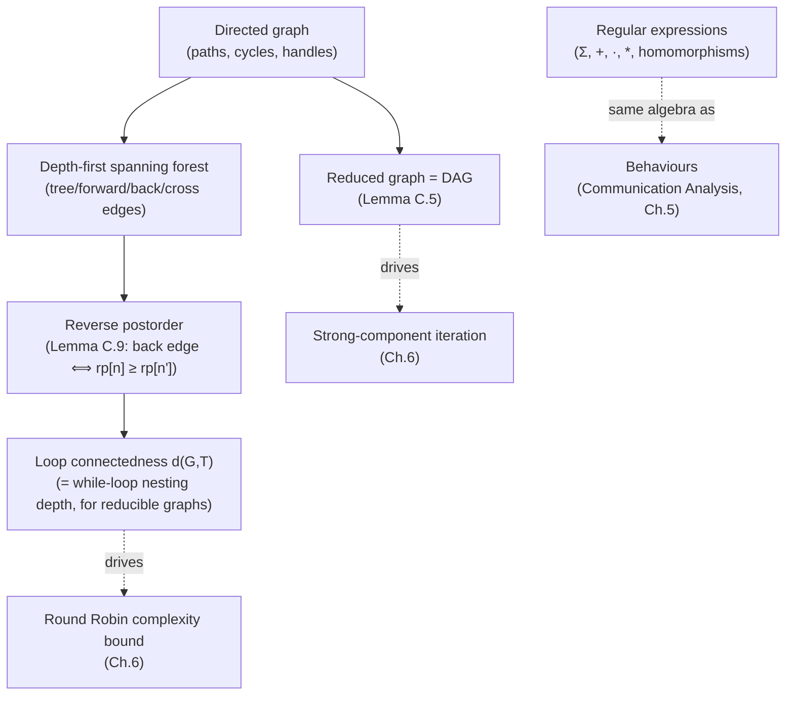

[[book-guidelines|↩ Back to guidelines]]

## The vocabulary hiding behind every flow graph in the book

Every flow-graph-based analysis in this book — [[Data-Flow-Analysis|Chapter 2's `flow(S)`]], [[Control-Flow-Analysis-(0-CFA-and-Constraint-Based-Analysis)|0-CFA's constraint graph]], [[Algorithms-for-Solving-Analysis-Equations|the Algorithms chapter's $G_{\mathcal S}$]] — has quietly assumed a shared vocabulary: root, path, cycle, strongly connected component, reverse postorder. This appendix is where that vocabulary finally gets defined precisely and its key properties proved. It reads as pure reference material, but two results in it — the reduced graph is always a DAG, and reverse postorder exactly characterizes back edges — are the *specific facts* that made [[Algorithms-for-Solving-Analysis-Equations|the Round Robin Algorithm's complexity bound]] and its strong-component refinement provable at all.

## Basic structure: paths, cycles, and handles

A **directed graph** $G=(N,A)$ is nodes plus edges $A\subseteq N\times N$; a **path** is a sequence of edges chained target-to-source; a **cycle** is a non-trivial path from a node to itself. Two nodes are **strongly connected** if paths exist both ways; this relation $\mathcal{SC}$ is an equivalence relation (**Fact C.3**, proved by trivial-path reflexivity, definitional symmetry, and path-concatenation transitivity) — its equivalence classes are the **strongly connected components (SCCs)**.

A **handle** $H\subseteq N$ is a set from which every node is reachable — a generalization of "the graph has a root" that doesn't require a *single* root to exist (needed because, as [[Interprocedural-Data-Flow-Analysis|Chapter 2.5]] and [[Algorithms-for-Solving-Analysis-Equations|Chapter 6]] both note, backward flow graphs and Constraint Based Analysis's constraint graphs frequently *don't* have one root). Minimal handles always exist (finiteness of $N$) though they need not be unique; a handle is a singleton exactly when the graph *is* rooted.

**Lemma C.5: the reduced graph of strongly connected components is always a DAG.** Collapse each SCC to one node, with an edge between two distinct SCC-nodes exactly when some edge crosses between their members in the original graph. The proof is a clean contradiction: if the reduced graph had a cycle $[SC_0,\ldots,SC_m=SC_0]$ with two SCCs $SC_i\ne SC_j$ on it, you could stitch together the paths crossing between components (using each SCC's own internal strong connectivity to bridge the gaps) into a single path from $SC_i$ back to $SC_j$ *and* from $SC_j$ back to $SC_i$ — contradicting $SC_i\ne SC_j$ by definition of strong connectivity. **Why this matters directly**: it's the load-bearing fact behind [[Algorithms-for-Solving-Analysis-Equations|"iterating through strong components"]] — a DAG always admits a topological order, so processing SCCs "outermost-loop-first" is always well-defined, never circular.

## Depth-first spanning forests, and the four kinds of edge

A **depth-first spanning forest (DFSF)** is built non-deterministically by DFS traversal (Table C.1), simultaneously recording each node's **reverse postorder** number — the reverse of the order nodes are *last* visited (i.e., the order their DFS calls complete). Every edge of the original graph falls into exactly one of four categories relative to this forest:

- **Tree edges** — the edges actually in the spanning forest.
- **Forward edges** — non-tree edges to a proper *descendant*.
- **Back edges** — edges to an *ancestor* (self-loops included).
- **Cross edges** — edges between unrelated nodes, and (by construction of the DFS algorithm) always running from a *later*-visited node to an *earlier*-visited one.

**The one property worth memorizing precisely — Lemma C.9**: an edge $(n,n')$ is a **back edge if and only if** $\mathrm{rPostorder}[n]\ge\mathrm{rPostorder}[n']$ (equality exactly for self-loops). This is a genuinely two-directional theorem, not just a definitional restatement: the forward direction is immediate from how DFS numbers ancestors before their still-pending descendants complete; the *reverse* direction needs the observation that cross edges are constrained (by the algorithm's own construction) to only ever run from high-numbered to low-numbered nodes in the *other* direction — so an edge violating the reverse-postorder ordering in the direction that would make it a cross edge is structurally ruled out, leaving "back edge, ancestor relationship" as the only remaining possibility.

**Corollary C.10, immediately**: every cycle contains at least one back edge — because a cycle returns to its own start, forcing $\mathrm{rPostorder}[n_0]=\mathrm{rPostorder}[n_m]$ for some point along it, which Lemma C.9 identifies as a back edge. **Corollary C.11**: reverse postorder topologically sorts the tree, forward, and cross edges (only back edges violate the order — that's their defining property). This pair of corollaries is exactly what licenses [[Algorithms-for-Solving-Analysis-Equations|Table 6.3's reverse-postorder worklist strategy]]: process nodes in this order, and every edge except a back edge already has its source processed before its target, so the *only* re-processing a fixed-point iteration can ever need is triggered by back edges specifically.

**Grounding it — Rust.** Classifying edges during a DFS pass is a direct, small piece of compiler-analysis infrastructure:

```rust
#[derive(PartialEq)]
enum EdgeKind { Tree, Forward, Back, Cross }

fn classify_edge(rpostorder: &HashMap<NodeId, usize>, ancestors: &HashSet<NodeId>, n: NodeId, np: NodeId) -> EdgeKind {
    if ancestors.contains(&np) {
        EdgeKind::Back // n's ancestor — matches rPostorder[n] >= rPostorder[n'] by Lemma C.9
    } else if rpostorder[&n] < rpostorder[&np] {
        EdgeKind::Forward
    } else {
        EdgeKind::Cross
    }
}
```

## Loop connectedness: the parameter that made Round Robin's bound work

The **loop connectedness parameter** $d(G,T)$ is the largest number of back edges on any *cycle-free* path. [[Algorithms-for-Solving-Analysis-Equations|Lemma 6.12's]] complexity bound $d(G,T)+3$ iterations rests entirely on this appendix's characterization of what a back edge *is* (Lemma C.9) — without a precise, checkable definition of "back edge," "how many back edges can a path cross" wouldn't even be a well-posed question.

**Dominator-back edges are spanning-forest-independent; ordinary back edges are not.** A **dominator-back edge** $(n_1,n_2)$ is one where $n_2$ *dominates* $n_1$ (every path from the handle to $n_1$ passes through $n_2$) — and such an edge is *guaranteed* to be a back edge regardless of which spanning forest you happen to construct, since any path reaching $n_1$'s ancestor-chain in the tree must have already passed through the dominator $n_2$. But the book gives a concrete counterexample graph (Figure C.3) with **no** dominator-back edges at all, where *some* edge between two specific nodes is nevertheless forced to be classified a back edge by *every possible* spanning forest — showing that "back edge" is a real, unavoidable structural feature of certain graphs even when no single edge is individually a dominator-back edge.

**Reducible graphs — where loop connectedness becomes forest-independent.** For a **reducible** graph, $d(G,T)$ turns out to be *independent* of the choice of spanning forest $T$ — and for WHILE flow graphs specifically, it equals exactly the **maximal nesting depth of `while`-loops** in the program. This is precisely the fact [[Algorithms-for-Solving-Analysis-Equations|Chapter 6]] cited without proof to conclude that Round Robin's complexity for WHILE programs is $O((d+1)\cdot b)$ for nesting depth $d$ and block count $b$ — a bound that only makes sense as a *program property* (rather than an accident of which spanning tree an implementation happens to build) because reducibility guarantees forest-independence. **Corollary C.14** sharpens this further: on a reducible graph, any cycle-free path starting from the handle is *monotonically increasing* in reverse postorder — meaning a single reverse-postorder pass, with no back edges crossed, makes genuine forward progress the entire way, exactly the property that makes reverse postorder outperform an arbitrary LIFO/FIFO order on real (reducible) control-flow graphs.

**Why reverse postorder specifically, and not preorder or breadth-first order.** All three orderings topologically sort tree and forward edges, but only reverse postorder also topologically sorts *cross* edges — preorder and breadth-first order can each be shown (with small explicit counterexamples the book supplies) to leave some cross edge running the wrong way. This is the precise, checkable reason [[Algorithms-for-Solving-Analysis-Equations|Chapter 6]] specifically chose reverse postorder over the other "obvious" traversal orders — it is the *unique* one among the three that gets every non-back edge correctly oriented.

## Regular expressions: the algebra behind behaviour-shaped effects

An **alphabet** $\Sigma$, **regular expressions** $R ::= \Lambda\mid\emptyset\mid a\mid R_1+R_2\mid R_1\cdot R_2\mid R_1^*$, and the language they denote, $\mathcal L[\![R]\!]$, defined compositionally ($\mathcal L[\![R_1+R_2]\!]=\mathcal L[\![R_1]\!]\cup\mathcal L[\![R_2]\!]$, $\mathcal L[\![R_1\cdot R_2]\!] = \mathcal L[\![R_1]\!]\cdot\mathcal L[\![R_2]\!]$, $\mathcal L[\![R_1^*]\!]=\bigcup_{k\ge 0}\mathcal L[\![R_1]\!]^k$). **This is, syntactically, the exact same algebra as [[Effects-Beyond-Control-Flow_old|Communication Analysis's behaviours]]** — $\varphi_1;\varphi_2$ is concatenation, $\varphi_1+\varphi_2$ is choice/union, $\mathrm{rec}\,\beta.\varphi$ is the Kleene-star-like recursive closure — the book is explicit that behaviours were deliberately modeled on regular expressions (and process calculi like CSP) for exactly this reason. A **homomorphism** $h:\Sigma_1^*\to\Sigma_2^*$ extends compositionally over regular expressions too ($h(R_1+R_2)=h(R_1)+h(R_2)$, etc.), preserving the language: $\mathcal L[\![h(R)]\!]=h(\mathcal L[\![R]\!])$ — the algebraic-structure-preservation guarantee that licenses substituting one alphabet's regular language for another's, symbol by symbol, without recomputing membership from scratch.

## Where this leads



Every graph-theoretic fact this appendix proves is invoked, not re-derived, wherever it's needed elsewhere in the book — [[Algorithms-for-Solving-Analysis-Equations|Chapter 6's]] entire complexity analysis for the Round Robin and strong-component algorithms rests on Lemma C.9 and Lemma C.5 respectively, and [[Interprocedural-Data-Flow-Analysis|Chapter 2.5's]] handle-based generalization of "root" is used verbatim for backward flow graphs. For the standing project, two threads matter directly: the DFSF edge-classification machinery (tree/forward/back/cross) is exactly the infrastructure a real compiler's dominance-frontier or loop-nesting-forest computation needs — load-bearing for any pass, including yours, that needs to reason about loop structure to place invariants correctly (`static-analysis`); and the regular-expression/behaviour correspondence made explicit here confirms that temporal verification conditions (safety properties expressible as "this sequence of events must/must-not occur") are naturally checked against automaton-shaped specifications — directly relevant groundwork for whatever finite-state or regular structure your CSP kernel ends up using to represent and check temporal constraints (`sat-smt-csp`).
