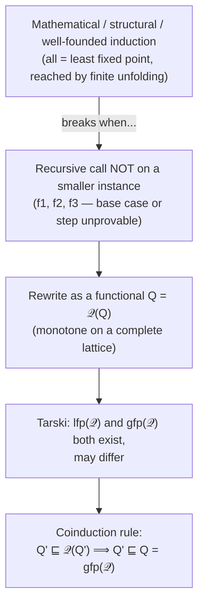

[[book-guidelines|↩ Back to guidelines]]

## The proof technique [[Control-Flow-Analysis-(0-CFA-and-Constraint-Based-Analysis)|0-CFA]] needed but never explained

Back in [[Control-Flow-Analysis-(0-CFA-and-Constraint-Based-Analysis)|Chapter 3]], the acceptability relation $\models$ for 0-CFA had to be defined "by coinduction," as a *greatest* fixed point, because its `[app]` clause made a non-structural recursive call and needed to accept the infinite, self-consistent unfolding corresponding to a non-terminating program. That claim was asserted there and used immediately. This appendix is where it gets a real foundation: a general proof principle, justified directly from [[Partially-Ordered-Sets-and-Complete-Lattices|Tarski's Fixed Point Theorem]], that tells you exactly *when* you need coinduction instead of induction, and exactly *how* to actually carry out a coinductive proof once you know you need one.

## Ordinary induction, four ways

The book runs through a hierarchy of induction principles, each a specialization of the next, all ultimately justified by the same idea — the proof structure mirrors the *construction* structure:

- **Mathematical induction**: $Q(0)$ and $\forall n: Q(n)\Rightarrow Q(n+1)$, hence $\forall n: Q(n)$ — justified because every natural number is either $0$ or a successor.
- **Structural induction**: for an algebraic datatype $d ::= \mathtt{Base}\mid\mathtt{Con}_1(d)\mid\mathtt{Con}_2(d,d)$, prove $Q(\mathtt{Base})$, $Q(d)\Rightarrow Q(\mathtt{Con}_1(d))$, and $Q(d_1)\wedge Q(d_2)\Rightarrow Q(\mathtt{Con}_2(d_1,d_2))$ — this is mathematical induction on a `size` measure, just with the arithmetic hidden.
- **Induction on the shape of inference trees**: exactly the same idea applied to a relation defined by inference rules ($d\xrightarrow{\triangledown}n$ for an evaluator) rather than to a datatype — prove the property closed under every rule, base cases included, and it holds for every derivable judgement.
- **Course-of-values induction** ($\forall n: (\forall m<n: Q(m))\Rightarrow Q(n)$, hence $\forall n: Q(n)$) and its generalization **well-founded induction** (no infinite descending chain — exactly the Descending Chain Condition from [[Partially-Ordered-Sets-and-Complete-Lattices|Appendix A]], reappearing here under a different name) fold the base case into the inductive step rather than treating it separately.

**The common thread, made precise**: every one of these is, underneath the notation, an appeal to the fact that a suitably defined predicate is the **least fixed point** of a monotone functional — and provably reachable by finite unfolding of that functional's defining rules from $\bot$. This observation is what the rest of the appendix makes rigorous.

## The motivating failure: when induction can't even get started

**The setup.** Consider `if f(27, m) then "something good" else "something bad"` where $f: \mathbf N\times\mathbf N\to\{true,false\}$, and you want to prove the program never does "something bad" — i.e. $Q_f(n) \iff \forall m: f(n,m)\ne false$, and you want $Q_f(27)$. Define four candidate functions by the same recursive shape but different base/step content:

$$
f_0(0,m)=true,\ f_0(n{+}1,m)=f_0(n,m) \qquad f_1(0,m)=f_1(0,m),\ f_1(n{+}1,m)=f_1(n,m)
$$
$$
f_2(0,m)=true,\ f_2(n{+}1,m)=f_2(n{+}1,m) \qquad f_3(0,m)=f_3(0,m),\ f_3(n{+}1,m)=f_3(n{+}1,m)
$$

$f_0$'s mathematical induction proof works fine — base case $Q_{f_0}(0)$ trivially true, step trivially inherited. But $f_1$'s recursive equation for $0$ ($f_1(0,m)=f_1(0,m)$) *doesn't terminate at all* — you can't even establish the base case, because evaluating it never yields an answer. $f_2$'s successor case has the same problem shifted to the inductive step. $f_3$ fails at *both* — no base case, no step. **Induction is completely stuck on all three**, yet all three functions "should" be considered acceptable in the sense that they never explicitly compute `false` — non-termination isn't the *presence* of bad behavior, it's the *absence* of any behavior at all.

## Making the circularity precise: a functional over predicates

Rewrite each $f_i$'s clauses as clauses for a predicate $Q_i$, then abstract the recursive occurrence into an explicit argument, giving a **functional** $\mathcal Q_i$ (a function whose argument and result are themselves predicates/functions) such that $Q_i = \mathcal Q_i(Q_i)$ — a genuine fixed-point equation. E.g. $\mathcal Q_3(Q')(0) = Q'(0)$, $\mathcal Q_3(Q')(n{+}1)=Q'(n{+}1)$. Each $\mathcal Q_i$ is **monotone** on the complete lattice $(\mathbf N\to\{true,false\},\sqsubseteq)$ (ordered by logical implication, $\bot=\lambda n.false$, $\top=\lambda n.true$) — so [[Partially-Ordered-Sets-and-Complete-Lattices|Tarski's Fixed Point Theorem]] guarantees **both** $\mathrm{lfp}(\mathcal Q_i)$ and $\mathrm{gfp}(\mathcal Q_i)$ exist, and — this is the crux — **they need not coincide**.

**Working the four cases through Tarski, explicitly:**

- $\mathrm{lfp}(\mathcal Q_0) = \bigsqcup_k \mathcal Q_0^k(\bot)$ — here continuity actually holds (each clause calls $Q$ finitely, in fact at most once, at a strictly smaller argument), so the iterative-approximation reading and the least-fixed-point reading agree, and $\mathrm{lfp}(\mathcal Q_0)(27)=true$ by ordinary induction — exactly the well-behaved case.
- $\mathrm{lfp}(\mathcal Q_3) = \bot$ — because $\mathcal Q_3(\bot)=\bot$ is already a fixed point, and it's the *least* one, so the inductive reading gives $Q_3(27)=false$, i.e. **induction actively gives the wrong answer here**, not merely an unprovable one — $f_3$ never being observed to return `false` should intuitively make it acceptable, but the least-fixed-point predicate says otherwise.
- $\mathrm{gfp}(\mathcal Q_3) = \top$ — because $\mathcal Q_3(\top)=\top$ is a fixed point, the *greatest* one, giving $\mathrm{gfp}(\mathcal Q_3)(27)=true$ — matching the intuitively correct answer.
- $\mathrm{lfp}(\mathcal Q_0)=\mathrm{gfp}(\mathcal Q_0)$ exactly, for $\mathcal Q_0$ specifically — the book notes this is no coincidence: $\mathcal Q_0$'s recursive call is always on a strictly *smaller* argument, which is exactly the extra structure (related to Banach's Fixed Point Theorem for contractive operators on a complete metric space) that collapses the induction/coinduction distinction back to a single answer. **This is the litmus test**: whenever a functional's recursive calls are all on syntactically smaller arguments, plain induction suffices and coinduction adds nothing; the moment a call can reference the *same* or a *not-provably-smaller* instance — as in $\mathcal Q_1$, $\mathcal Q_2$, $\mathcal Q_3$, and as in [[Control-Flow-Analysis-(0-CFA-and-Constraint-Based-Analysis)|0-CFA's `[app]` clause referencing an arbitrary function body $t_0^{\ell_0}$]] — induction and coinduction can genuinely disagree, and it's the *coinductive* reading that captures "never observed to fail."

## The coinduction proof rule — and how to actually use it

Since $Q = \mathrm{gfp}(\mathcal Q)$, Tarski's characterization $\mathrm{gfp}(f) = \bigsqcup\mathrm{Ext}(f)$ (from [[Partially-Ordered-Sets-and-Complete-Lattices|Proposition A.10]]) converts directly into a usable proof rule:

$$
\dfrac{Q'\sqsubseteq\mathcal Q(Q')}{Q'\sqsubseteq Q} \qquad\text{i.e. to prove } Q(d):\ \text{find } Q' \text{ such that } Q'(d) \text{ and } \forall d': Q'(d')\Rightarrow\mathcal Q(Q')(d')
$$

Read operationally: **guess** a predicate $Q'$ that (a) already includes the fact you want ($Q'(d)$) and (b) is *extensive* under $\mathcal Q$ — applying $\mathcal Q$ to $Q'$ never produces something $Q'$ doesn't already imply. If such a $Q'$ exists, it must sit below $\mathrm{gfp}(\mathcal Q)=Q$, so $Q(d)$ follows. This has, as the book puts it, "a very optimistic flavour: we can assume everything we like as long as it cannot be demonstrated that we have violated any facts" — the mirror image of induction's "take nothing for granted, only believe what can be built up from nothing."

**A convenient strengthening.** The derived rule $\dfrac{Q'\sqsubseteq\mathcal Q(Q\sqcup Q')}{Q'\sqsubseteq Q}$ lets your guess $Q'$ reference the *already-known* facts in $Q$ itself (via $Q\sqcup Q'$), not just its own guessed content — often making the extensivity check easier to discharge, since you get to assume more on the right-hand side without weakening the conclusion. The proof of this derived rule is a two-line consequence of $Q\sqsubseteq\mathcal Q(Q)$ (i.e. $Q$ is itself a fixed point) plus monotonicity of $\mathcal Q$.

**Grounding it — Lean, directly.** This *is* the exact shape of a **bisimulation proof** or a coinductive proof in Lean's `coinductive`/`CoInductive` machinery: to show two infinite structures are bisimilar (or that a predicate holds coinductively), you exhibit a relation $Q'$ containing the pair you care about, and show that relation is closed under one step of unfolding — precisely "$Q'\sqsubseteq\mathcal Q(Q')$." [[Control-Flow-Analysis-(0-CFA-and-Constraint-Based-Analysis)|0-CFA's acceptability relation]] is, retroactively, exactly this pattern: the "guess $(\widehat{\mathsf C},\widehat\rho)$, verify Table 3.1's clauses hold" methodology *is* the coinduction proof rule, with $\models$ playing the role of $Q$ and each concrete guess playing the role of $Q'$.

**Grounding it — Rust**, showing the induction/coinduction contrast as two different fixed-point computations over the *same* recursive shape:

```rust
// Induction: build up from ⊥, only include what a FINITE unfolding proves.
fn least_fixed_point(functional: impl Fn(&HashSet<u32>) -> HashSet<u32>, domain: &[u32]) -> HashSet<u32> {
    let mut q = HashSet::new(); // ⊥
    loop {
        let next = functional(&q);
        if next == q { return q; }
        q = next; // only grows by what's freshly, finitely justified
    }
}

// Coinduction: start from a GUESS (often ⊤, or a specific candidate),
// only REMOVE what's provably inconsistent — accepting whatever an
// infinite, self-consistent unfolding would never contradict.
fn greatest_fixed_point(functional: impl Fn(&HashSet<u32>) -> HashSet<u32>, domain: &[u32]) -> HashSet<u32> {
    let mut q: HashSet<u32> = domain.iter().copied().collect(); // ⊤
    loop {
        let next = functional(&q);
        if next == q { return q; }
        q = next; // only shrinks by what's freshly, finitely disproved
    }
}
```

The direction of iteration — start from $\bot$ and grow, versus start from $\top$ and shrink — is the entire operational difference between an inductive and a coinductive fixed-point computation, and it exactly mirrors why $\mathrm{lfp}(\mathcal Q_3)=\bot$ (nothing was ever positively justified) while $\mathrm{gfp}(\mathcal Q_3)=\top$ (nothing was ever positively refuted).

## Where this leads



This appendix is the theoretical justification the book deferred at [[Control-Flow-Analysis-(0-CFA-and-Constraint-Based-Analysis)|Chapter 3's acceptability relation]] and reuses (implicitly) anywhere a specification permits, rather than forces, some behavior. For the standing project, this is close to the single most important piece of proof technique in the entire book for the elaborator (`type-theory`, `automated-reasoning`): metavariable unification's occurs-check and Miller's pattern-unification fragment are coinductive in exactly this sense — a candidate substitution is accepted because no finite unfolding of the definitional-equality rules refutes it, not because a finite derivation positively builds it — and the guess-then-verify-extensivity discipline here (find $Q'$ with $Q'\sqsubseteq\mathcal Q(Q')$) is the literal template for how a bisimulation-style soundness proof for your kernel's `isDefEq` should be structured.
