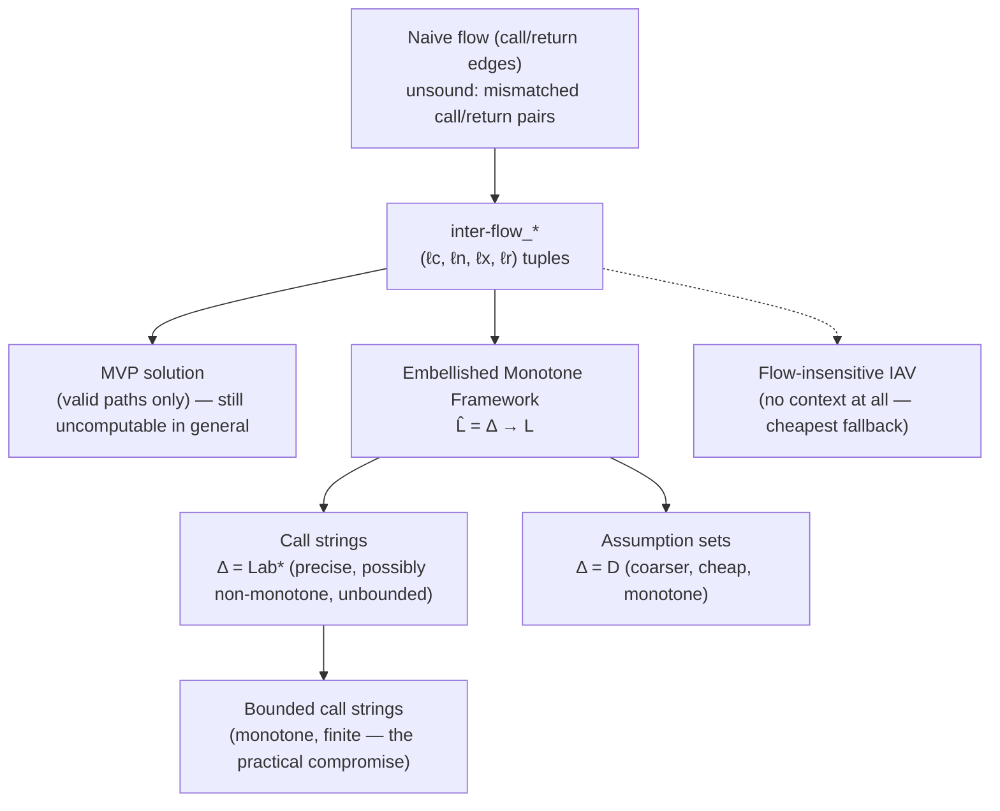

[[book-guidelines|↩ Back to guidelines]]

## Why procedures break everything you just built

[[Monotone-Frameworks|Monotone Frameworks]] gave a clean, generic account of Data Flow Analysis — but it was quietly built on an assumption that procedure calls destroy: that a flow graph's edges tell you the whole truth about how control can move through a program. Add procedures, and a naive flow graph — one edge from a call site to a callee's entry, one edge from the callee's exit back to *every* call site — starts admitting nonsense paths: control "returning" to a call site that never actually called the procedure it's returning from. §2.5's entire arc is: notice this precisely, name it, and then supply increasingly practical fixes, each trading precision for computability in a different place.

## Extending WHILE with procedures

The book extends WHILE minimally: `begin D* S* end`, where `D*` is a sequence of (possibly mutually recursive) top-level procedure declarations, each with exactly one **call-by-value** parameter and one **call-by-result** parameter:

$$
D ::= \mathbf{proc}\ p(\mathbf{val}\ x,\mathbf{res}\ y)\ \mathbf{is}^{\ell_n}\ S\ \mathbf{end}^{\ell_x} \mid D\ D
$$

Crucially, the call statement itself carries **two labels**, not one:

$$
S ::= \cdots \mid [\mathbf{call}\ p(a,z)]^{\ell_c}_{\ell_r}
$$

$\ell_c$ marks the call, $\ell_r$ marks the matching return — deliberately distinct program points, because a data flow property true *at the call* (before the callee runs) and one true *at the return* (after it runs, with possibly-mutated globals) are different facts that need different labels to attach to. The flow-graph machinery from [[Data-Flow-Analysis|Chapter 2's intraprocedural analyses]] extends directly:

$$
flow([\mathbf{call}\ p(a,z)]^{\ell_c}_{\ell_r}) = \{(\ell_c,\ell_n),(\ell_x,\ell_r)\} \quad\text{if } \mathbf{proc}\ p(\mathbf{val}\ x,\mathbf{res}\ y)\ \mathbf{is}^{\ell_n}\ S\ \mathbf{end}^{\ell_x} \in D_*
$$

— one edge into the callee's entry $\ell_n$, one edge out of its exit $\ell_x$ back to the return point $\ell_r$. So far this looks harmless. The book also tracks this relationship separately as **interprocedural flow**:

$$
\mathit{inter\text{-}flow}_* = \{(\ell_c,\ell_n,\ell_x,\ell_r) \mid P_* \text{ contains } [\mathbf{call}\ p(a,z)]^{\ell_c}_{\ell_r} \text{ and } \mathbf{proc}\ p(\ldots)\ \mathbf{is}^{\ell_n}\ S\ \mathbf{end}^{\ell_x}\}$$

keeping the full 4-tuple together — and *this* is where the fix begins, because plain `flow` has already thrown away the pairing information `inter-flow` still has.

## The matching problem, made concrete

**What breaks.** Suppose two call sites $\ell_c^1, \ell_c^2$ both call the same procedure, with $inter\text{-}flow_*$ containing $(\ell_c^i,\ell_n,\ell_x,\ell_r^i)$ for $i=1,2$. Decomposed into plain `flow` edges, you get $(\ell_c^i;\ell_n)$ and $(\ell_x;\ell_r^i)$ for $i=1,2$ — four separate edges. But nothing in `flow` alone remembers *which* call led to *which* return: from these four edges you can equally well construct the path $\ell_c^1 \to \ell_n \to \cdots \to \ell_x \to \ell_r^2$ — control "entering" via call 1 and "returning" to call 2, a physically impossible execution. Of the four $(i,j)$ combinations only $i=j$ is real; that's exactly the set `inter-flow` was defined to preserve. Any analysis run naively over `flow` alone is therefore *unsound in a specific, avoidable way*: it isn't merely imprecise, it's tracking data as if it could leak between unrelated call sites of the same procedure.

**Grounding it — Rust.** This is precisely the difference between a naive interprocedural CFG (one merged node per procedure, edges fan in/out indiscriminately) and a call-graph-aware one that tags each edge with which call site it belongs to:

```rust
struct InterFlow {
    call: Label,   // ℓ_c
    entry: Label,  // ℓ_n
    exit: Label,   // ℓ_x
    ret: Label,    // ℓ_r
}
// naive `flow` loses the (call ↔ ret) pairing once decomposed into
// separate (call,entry) and (exit,ret) edges; inter_flow keeps the
// 4-tuple intact specifically so a later analysis can re-derive it.
```

## Valid paths and the MVP solution

**The fix at the semantic level.** The book redefines [[Monotone-Frameworks|the MOP solution's]] notion of a path to only admit **valid paths** — those with properly *nested* call/return structure, generated by a small grammar of "complete path" nonterminals $CP_{\ell_1,\ell_2}$ (a call must be matched by its own procedure's exit before continuing) plus "valid path" nonterminals $VP_{\ell_1,\ell_2}$ (allowing some calls to still be pending, for paths that stop mid-computation). The resulting **MVP (Meet over all Valid Paths)** solution replaces plain $path_\circ/path_\bullet$ with $vpath_\circ/vpath_\bullet$ — strictly smaller path sets than before — giving $MVP \sqsubseteq MOP$ pointwise: restricting to valid paths can only *improve* precision relative to MOP, never hurt it, since MOP was already over-approximating by including nonsense paths that MVP correctly excludes.

This is elegant, but it's a *semantic* target, not an algorithm — like MOP itself, it's generally undecidable to compute directly. The rest of §2.5 is about recovering something computable that approximates MVP as closely as practical.

## Making context explicit: embellished Monotone Frameworks

**The core idea.** Rather than fix the path structure, lift the *property space itself* to carry context. Given an ordinary Monotone Framework instance $(L,\mathcal{F},F,E,\iota,f_\bullet)$, an **embellished** framework replaces $L$ with $\widehat L = \Delta \to L$ — a function from **contexts** $\delta \in \Delta$ to ordinary properties. Read $\widehat l(\delta)$ as "what we know, given that we arrived here having taken context-path $\delta$." Everything now happens pointwise per context:

$$
\widehat{f_\ell}(\widehat l)(\delta) = f_\ell(\widehat l(\delta))
$$

and, critically, a procedure's call and return transfer functions get to *reference the context itself* — a call pushes onto $\delta$, a return only combines information that shares the same context prefix, which is exactly the mechanism that restores the call/return matching plain `flow` had lost:

$$
\widehat{f^2_{\ell_c,\ell_r}}(\widehat l, \widehat{l'})(\delta) = f^2_{\ell_c,\ell_r}(\widehat l(\delta), \widehat{l'}([\delta,\ell_c]))
$$

The specific *choice* of $\Delta$ is now a knob you turn for a precision/cost tradeoff — the book works through three points on that knob.

### Call strings: $\Delta = \mathbf{Lab}^*$

Take $\Delta$ to be sequences of call labels — literally the stack of pending call sites, most recent on the right, with the empty string $\Lambda$ meaning "no pending calls" ($\widehat\iota(\Lambda) = \iota$, $\widehat\iota(\delta)=\bot$ otherwise). A call pushes $\ell_c$: $\widehat{f^1_{\ell_c}}(\widehat l)([\delta,\ell_c]) = f^1_{\ell_c}(\widehat l(\delta))$. A return combines the pre-call context $\delta$ with the post-callee-exit context $[\delta,\ell_c]$ — meaning: only merge information from a return if it came from a call that matches this exact call string prefix. This is exactly a call stack made explicit as data, and it's precise by construction — but $\Delta = \mathbf{Lab}^*$ is *infinite* (unbounded recursion depth means unboundedly long call strings), so **in general this still doesn't terminate**; the standard fix is to bound the string to its last $k$ entries, trading a little precision (merging together call histories that agree only on their most recent $k$ calls) for a finite, ACC-respecting lattice.

**Grounding it — Rust.** A bounded call-string context is exactly a small fixed-capacity ring of "who called this," the same shape used by context-sensitive points-to analyses in real compilers:

```rust
#[derive(Clone, PartialEq, Eq, Hash)]
struct CallString(VecDeque<Label>); // bounded to length k

impl CallString {
    fn push(&self, call_site: Label, k: usize) -> Self {
        let mut s = self.0.clone();
        s.push_back(call_site);
        while s.len() > k { s.pop_front(); } // truncate — the precision/cost knob
        CallString(s)
    }
}
```

### Assumption sets: $\Delta = D$

**What breaks with call strings.** They're precise but the transfer functions $\widehat{f^1_{\ell_c}}$ and $\widehat{f^2_{\ell_c,\ell_r}}$, once you push the "exact set of matching contexts" bookkeeping through, turn out to be **not monotone in general** — which breaks the guarantee that a worklist algorithm terminates and computes a well-defined least solution at all. The book's practical fallback: use assumption sets, where $\Delta = D$ is directly the analysis's own property domain (e.g. an abstract *state*, rather than a syntactic call-history string). The extremal value becomes $\widehat\iota = \{(\iota,\iota)\}$ and the framework is rebuilt over $D\times D$ pairs instead of $\mathcal{P}(D)\times D$. This trades away the precision of exact call-string matching for a monotone, computable framework — the smaller and coarser $\Delta$ is, the more different real calling contexts get merged together (losing precision) but the cheaper and more clearly well-founded the resulting analysis is.

This progression — call strings (precise, possibly non-monotone, unbounded) → bounded call strings (monotone, finite, still fairly precise) → assumption sets (monotone, small, coarser) — is the book's concrete demonstration that context sensitivity is a *spectrum*, not a binary choice, foreshadowing the same spectrum reappearing as **k-CFA** in [[Context-Sensitivity-in-Control-Flow-Analysis|Context Sensitivity in Control Flow Analysis]].

## The cheap fallback: flow-insensitive analysis of assigned variables

Sometimes you don't need path-sensitivity at all — you just need to know, conservatively, "what variables could this procedure possibly touch, directly or via anything it calls." The book gives a purely *structural*, non-fixed-point definition for this: $AV(S)$ (assigned variables, ignoring calls) and $CP(S)$ (immediately called procedures), both by simple structural recursion — e.g. $AV([x:=a]^\ell) = \{x\}$, $AV([\mathbf{call}\ p(a,z)]^{\ell_c}_{\ell_r}) = \{z\}$ (only the call-by-result parameter is a potential assignment target from the caller's point of view). These feed a **procedure call graph** (nodes = procedures plus a synthetic $\mathbf{main}_*$, edges = "directly calls") and a tiny least-fixed-point equation

$$
IAV(p) = (AV(S)\setminus\{x\}) \cup \bigcup\{IAV(p') \mid p' \in CP(S)\}
$$

that closes $AV$ over the call graph transitively — "all variables this procedure or anything it (transitively) calls could assign." This is deliberately **flow-insensitive** (no notion of program point or order — a rearrangement of statements inside $S$ gives the identical answer) and **context-insensitive** (one answer per procedure, not per call site). It's a strictly weaker tool than the embellished frameworks above, useful exactly when you need a cheap, sound side-effect summary (e.g. "can this call possibly clobber my local `x`?") rather than a precise dataflow fact at a specific program point.

## Where this leads



This chapter's context-sensitivity spectrum reappears nearly verbatim as **k-CFA** for [[Control-Flow-Analysis-(0-CFA-and-Constraint-Based-Analysis)|Control Flow Analysis]] in Chapter 3 — call strings there become the "$k$" in k-CFA, and the monotonicity concern raised here about assumption sets is the same concern that motivates the **Cartesian Product Algorithm** later. For the standing project, this is the most direct precursor in the book to **context-sensitive verification-condition generation** (`static-analysis`): your Hoare-contract generator will face exactly this call/return matching problem when procedures (or, in your compiler's case, function definitions with dependent contracts) are analyzed modularly, and the call-string-vs-assumption-set tradeoff is the same precision/cost knob you'll need for scaling contract inference across a real call graph without either losing soundness (the naive-flow mistake) or blowing up state space (unbounded call strings).
