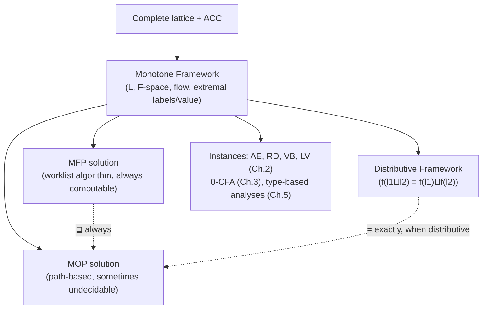

[[book-guidelines|↩ Back to guidelines]]

## One shape, four analyses — now make the shape explicit

Look back at [[Data-Flow-Analysis|the four classical analyses]] and a pattern jumps out: every one of them is "combine incoming information with $\bigcup$ or $\bigcap$, then apply a per-block transfer function," running either forward or backward. The book's move in §2.3 is to stop treating that as a coincidence and *name the pattern as a mathematical object* — a **Monotone Framework** — so that every later result (a generic solving algorithm, a generic correctness theorem, a generic complexity bound) gets proved *once*, for the framework, instead of four times, once per analysis.

The general equation shape, stripped of anything analysis-specific:

$$
Analysis_\circ(\ell) = \begin{cases} \iota & \text{if } \ell \in E \\ \bigsqcup\{Analysis_\bullet(\ell') \mid (\ell',\ell)\in F\} & \text{otherwise}\end{cases} \qquad\qquad Analysis_\bullet(\ell) = f_\ell(Analysis_\circ(\ell))
$$

Every slot here is now a parameter you plug an analysis into, rather than something baked into the equations: $\bigsqcup$ is $\cap$ or $\cup$ (and correspondingly $\sqcup$ is $\cup$ or $\cap$), $F$ is $flow(S_*)$ or $flow^R(S_*)$, $E$ is $\{init(S_*)\}$ or $final(S_*)$, $\iota$ is the extremal (boundary) value, and $f_\ell$ is the block's transfer function. **Available Expressions, Reaching Definitions, Very Busy Expressions, and Live Variables are exactly the four ways of filling in these six slots** — Figure 2.6 in the book tabulates all four side by side, and seeing them in one table is the moment the "these are the same thing" thesis stops being a slogan and becomes a literal instantiation table.

## What a Monotone Framework actually demands

**What breaks without this.** If the property space were an arbitrary set with an arbitrary combination rule, you couldn't guarantee an analysis *terminates*, or that the answer it converges to is well-defined independent of the order you process blocks in. Every requirement below exists to rule out exactly one of those failure modes.

**The property space $L$** must be a **complete lattice** — a partial order $(L,\sqsubseteq)$ where every subset has a least upper bound $\bigsqcup Y$ — satisfying the **Ascending Chain Condition (ACC)**: every ascending chain $l_1 \sqsubseteq l_2 \sqsubseteq \cdots$ eventually stabilizes. This is not decoration; ACC is *the* thing that makes iterative solving terminate at all, the same role $\mathbf{AExp}_*$ and $\mathbf{Var}_* \times \mathbf{Lab}_*^?$ being *finite* played implicitly back in Chapter 2's four examples (Examples 2.23–2.24 show Reaching Definitions' and Available Expressions' lattices are ACC exactly because those underlying sets are finite).

**The transfer functions $f_\ell : L \to L$** must be **monotone**: $l \sqsubseteq l' \implies f_\ell(l) \sqsubseteq f_\ell(l')$. Read operationally: *more input knowledge never produces less output knowledge*. The book also asks for a function space $\mathcal{F} \ni f_\ell$ that (a) contains every actual $f_\ell$, (b) contains the identity (this is what `skip` needs), and (c) is closed under composition (this is what sequencing needs) — you don't have to take $\mathcal{F}$ to be *all* monotone functions over $L$, just a set closed enough to make the framework compositional.

**Distributive frameworks** are a strictly stronger, optional refinement: every $f \in \mathcal{F}$ satisfies $f(l_1 \sqcup l_2) = f(l_1) \sqcup f(l_2)$ (monotonicity alone only gives you $\sqsupseteq$ for free; distributivity demands the reverse inclusion too). This matters because — as you'll see below — distributivity is *exactly* the condition under which the cheap, iterative MFP solution coincides with the expensive, path-based MOP solution.

**Grounding it — Rust.** The framework's parameters translate directly into a generic trait a real dataflow-analysis engine would define once and instantiate four times:

```rust
trait MonotoneFramework {
    type L: PartialOrd + Clone;      // the complete lattice
    fn bottom(&self) -> Self::L;     // ⊥
    fn join(&self, a: &Self::L, b: &Self::L) -> Self::L;   // ⊔ (∪ or ∩)
    fn transfer(&self, label: Label, input: &Self::L) -> Self::L; // f_ℓ — must be monotone
    fn extremal_labels(&self) -> HashSet<Label>;            // E
    fn extremal_value(&self) -> Self::L;                    // ι
    fn flow(&self) -> HashSet<(Label, Label)>;               // F (flow or flow^R)
}
```

Available Expressions, Reaching Definitions, Very Busy Expressions, and Live Variables become four tiny `impl` blocks against this one trait — precisely the point the book is making, just made structural.

## When monotone isn't enough: Constant Propagation as the non-distributive witness

**What breaks without distributivity.** Take Constant Propagation: the lattice is $\widehat{\mathbf{State}}_{CP} = (\mathbf{Var}_* \to \mathbf{Z}^\top)_\bot$, where $\mathbf{Z}^\top = \mathbf{Z} \cup \{\top\}$ orders every integer below $\top$ ("known non-constant") and integers are pairwise incomparable. Consider the block $[y := x*x]^\ell$ and two states $\hat\sigma_1(x)=1$, $\hat\sigma_2(x)=-1$. Evaluated separately: $f_\ell^{CP}(\hat\sigma_1)$ and $f_\ell^{CP}(\hat\sigma_2)$ **both** map $y \mapsto 1$ — squaring erases the sign, so both branches agree $y$ is the constant $1$. But $\hat\sigma_1 \sqcup \hat\sigma_2$ maps $x \mapsto \top$ (the two states disagree on $x$, so the join gives up), and $f_\ell^{CP}$ applied to *that* joined state must conservatively report $y \mapsto \top$ too — it can no longer see that both branches happened to agree. So:

$$
f_\ell^{CP}(\hat\sigma_1) \sqcup f_\ell^{CP}(\hat\sigma_2) = \{y \mapsto 1\} \;\sqsubset\; \{y \mapsto \top\} = f_\ell^{CP}(\hat\sigma_1 \sqcup \hat\sigma_2)
$$

— a strict inequality, which is precisely what distributivity forbids and monotonicity alone permits. **This is the general lesson**: joining information *before* transforming it can lose precision that transforming *first, then* joining would have kept. Constant Propagation is monotone (safe) but not distributive (imprecise at joins) — and this exact failure mode is why later, more powerful analyses (widening/narrowing in [[Abstract-Interpretation|Abstract Interpretation]]) need machinery beyond plain lattice theory to recover precision where distributivity fails.

## Solving the equations: MFP, computed cheaply

**The MFP algorithm** (Table 2.8) is the generic worklist solver every instance of a Monotone Framework can reuse verbatim. Confusingly, "MFP" stands for **Maximal Fixed Point** but the algorithm actually computes the *least* fixed point — a historical name surviving from when the classical literature mostly used $\sqcup = \cap$, where the least fixed point w.r.t. $\sqsubseteq$ happens to be the *greatest* w.r.t. plain set inclusion $\subseteq$.

```
Step 1 (init):  W := every pair in F, as a worklist
                Analysis[ℓ] := ι if ℓ ∈ E, else ⊥

Step 2 (iterate):
    while W ≠ nil:
        (ℓ, ℓ') := head(W); W := tail(W)
        if f_ℓ(Analysis[ℓ]) ⋢ Analysis[ℓ']:
            Analysis[ℓ'] := Analysis[ℓ'] ⊔ f_ℓ(Analysis[ℓ])
            for all ℓ'' with (ℓ', ℓ'') ∈ F: W := cons((ℓ',ℓ''), W)

Step 3 (present): MFP_o(ℓ) := Analysis[ℓ];  MFP_•(ℓ) := f_ℓ(Analysis[ℓ])
```

Termination relies on exactly the ACC requirement above — `Analysis[ℓ']` only ever moves *up* the lattice (line "Analysis[ℓ'] := Analysis[ℓ'] ⊔ ..."), and ACC guarantees an ascending chain can't climb forever. Correctness (Lemma 2.29) — that this computes the *least* solution to the equation system — follows by showing the final `Analysis` array is both a fixed point of the equations and no fixed point can be strictly smaller, by induction on the worklist's iteration count.

**Grounding it — Rust**, generic over any `MonotoneFramework` impl:

```rust
fn mfp<M: MonotoneFramework>(m: &M) -> HashMap<Label, M::L> {
    let mut analysis: HashMap<Label, M::L> = HashMap::new();
    let labels: HashSet<Label> = m.flow().iter().flat_map(|&(a, b)| [a, b]).collect();
    for l in &labels {
        analysis.insert(*l, if m.extremal_labels().contains(l) { m.extremal_value() } else { m.bottom() });
    }
    let mut worklist: VecDeque<(Label, Label)> = m.flow().into_iter().collect();
    while let Some((l, lp)) = worklist.pop_front() {
        let candidate = m.transfer(l, &analysis[&l]);
        if !leq(&candidate, &analysis[&lp]) {           // f_ℓ(Analysis[ℓ]) ⋢ Analysis[ℓ']
            let joined = m.join(&analysis[&lp], &candidate);
            analysis.insert(lp, joined);
            worklist.extend(m.flow().iter().filter(|&&(a, _)| a == lp)); // re-propagate
        }
    }
    analysis
}
```

## MOP: the "true" answer, and why it's usually out of reach

MFP computes a solution by *iterating equations to convergence* — it never looks at actual execution paths. There's a more direct, semantically obvious alternative: for each label $\ell$, collect **every finite path** from an extremal label to $\ell$, run the transfer functions for that specific path, and join over all such paths. That's the **Meet Over all Paths (MOP)** solution:

$$
MOP_\bullet(\ell) = \bigsqcup\{f_{\vec\ell}(\iota) \mid \vec\ell \in path_\bullet(\ell)\} \qquad\text{where } f_{[\ell_1,\ldots,\ell_n]} = f_{\ell_n}\circ\cdots\circ f_{\ell_1}\circ id
$$

This is, in a real sense, *more* faithful to "what could actually happen" than MFP, because it never joins information from different paths until each path has been fully, individually transformed. But **Lemma 2.31: the MOP solution for Constant Propagation is undecidable**, via a reduction from the (undecidable) **Modified Post Correspondence Problem** — the book constructs a WHILE program whose final variable equals a specific sign value if and only if a given MPCP instance has *no* solution, so deciding $MOP_\bullet(\ell)$ for that program would decide MPCP. Since MPCP is undecidable, so is MOP, in general — a beautifully concrete instance of the very first theme of the book: [[The-Nature-and-Scope-of-Program-Analysis|the exact answer is often out of reach; only a safe approximation is guaranteed computable]].

**Comparing them (Lemma 2.32):** $MFP_\circ \sqsupseteq MOP_\circ$ and $MFP_\bullet \sqsupseteq MOP_\bullet$ always — MFP safely *over*-approximates MOP, never the reverse, which is reassuring (MFP is at least as conservative as the semantically-ideal answer) but also exactly what you'd predict from the Constant Propagation counterexample above: joining early (MFP, at every merge point) can only lose precision relative to joining late (MOP, only at the very end of each path), never gain it. And **for distributive frameworks specifically, $MFP = MOP$ exactly** — distributivity is precisely the algebraic condition that makes "join early" and "join late" commute, so the cheap iterative algorithm loses nothing relative to the semantically ideal, uncomputable one. This is the framework-level payoff of distributivity promised above: Available Expressions, Reaching Definitions, Very Busy Expressions, and Live Variables are all distributive, so for all four of them, the MFP worklist algorithm's answer is *provably* the best any analysis could ever report — no hidden precision is being left on the table by using the tractable algorithm instead of the uncomputable one.

## Where this leads



Monotone Frameworks is the load-bearing abstraction for the rest of the book's *algorithmic* side: [[Control-Flow-Analysis-(0-CFA-and-Constraint-Based-Analysis)|0-CFA's constraint solving]] and the general [[Algorithms-for-Solving-Analysis-Equations|worklist algorithms of Chapter 6]] are direct generalizations of exactly the MFP algorithm given here, and [[Abstract-Interpretation|Abstract Interpretation's]] widening/narrowing operators exist specifically to recover precision in the non-distributive cases this chapter flags but doesn't yet solve. For the standing project: the MFP-vs-MOP gap is the cleanest textbook illustration of the soundness/completeness tradeoff your compiler's invariant-generation pass will face directly (`static-analysis`) — an abstract-interpretation-based Hoare-contract generator is, structurally, an MFP-style "join early" algorithm, chosen deliberately over an MOP-style path-enumeration approach *because* MOP is undecidable in general — and the distributivity criterion here is the precise, checkable condition under which you can be sure that tradeoff is costing you nothing. The Modified Post Correspondence reduction is also a nice concrete rehearsal for how you'll later need to reason about undecidability boundaries when scoping what your own CSP/counterexample kernel (`sat-smt-csp`) can and cannot be asked to decide.
