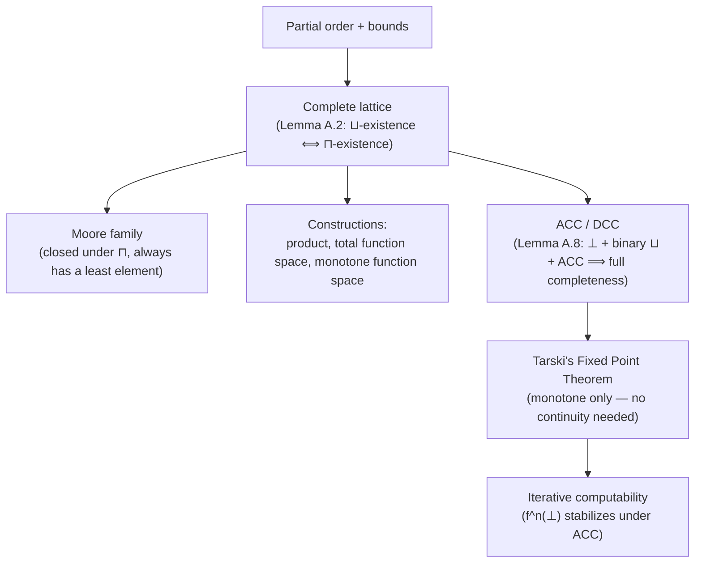

[[book-guidelines|↩ Back to guidelines]]

## The mathematical vocabulary every earlier chapter borrowed

By the time you reach this appendix, you've already used "complete lattice," "least fixed point," and "Ascending Chain Condition" dozens of times — [[Monotone-Frameworks|Monotone Frameworks]] demanded them outright, [[Abstract-Interpretation|Abstract Interpretation]] built its entire theory on top of them, [[Algorithms-for-Solving-Analysis-Equations|the Algorithms chapter]] invoked Tarski's theorem as a one-line justification. This appendix is where those invocations get their actual proofs. It's reference material, deliberately — but reference material worth reading once end-to-end, because several of its results (Lemma A.8 especially) are exactly the kind of fact that quietly does load-bearing work everywhere else in the book without ever being re-derived.

## Partial orders, bounds, and complete lattices

A **partial ordering** $\sqsubseteq$ is reflexive, transitive, antisymmetric. Given $Y\subseteq L$, an **upper bound** is $l$ with $l'\sqsubseteq l$ for all $l'\in Y$; a **least upper bound** $\bigsqcup Y$ is the smallest such — unique when it exists, by antisymmetry. A **complete lattice** demands *every* subset (not just finite ones, not just chains) has both a least upper bound and a greatest lower bound. This "every subset, no exceptions" strength is exactly what later theorems lean on: Tarski's Fixed Point Theorem needs $\mathrm{Fix}(f) = \{l\mid f(l)=l\}$ — a set with no a priori structure — to have both a $\bigsqcup$ and a $\bigsqcap$, and only completeness guarantees that unconditionally.

**Lemma A.2** — a fact worth internalizing precisely because it's used silently everywhere — shows *"has all least upper bounds"* and *"has all greatest lower bounds"* are each **independently sufficient** to make $L$ a complete lattice: given all $\bigsqcup$'s, define $\bigsqcap Y = \bigsqcup\{l\mid \forall l'\in Y: l\sqsubseteq l'\}$ (the sup of all lower bounds) and it's automatically the greatest lower bound. This is why, e.g., [[Data-Flow-Analysis|Available Expressions' "must" semantics via $\bigcap$]] and [[Data-Flow-Analysis|Reaching Definitions' "may" semantics via $\bigcup$]] never needed two separate existence arguments — proving one direction of completeness for a powerset lattice trivially buys you the other.

## Moore families: closure under meets, for free

A **Moore family** $Y\subseteq L$ is closed under arbitrary greatest lower bounds: $\forall Y'\subseteq Y: \bigsqcap Y' \in Y$. The immediate consequence — a Moore family is *never* empty (since $\bigsqcap\emptyset = \top \in Y$) and always contains a least element $\bigsqcap Y$. This is exactly the structural fact behind every "the set of acceptable analyses forms a Moore family, hence has a best (least) member" argument scattered through [[Control-Flow-Analysis-(0-CFA-and-Constraint-Based-Analysis)|0-CFA]] and [[Type-and-Effect-Systems|Type and Effect Systems]] — proving a set of typings is closed under intersection is, via this single definition, the entire proof that a *unique best analysis result* exists at all, without needing to separately construct it.

## Constructing new complete lattices from old ones

Four constructions recur throughout the book, each preserving completeness automatically:

- **Cartesian product** $L_1\times L_2$: componentwise ordering, $\bigsqcup Y = (\bigsqcup_1\{\ldots\}, \bigsqcup_2\{\ldots\})$ — this is the silent machinery behind every "abstract state = pair of components" domain, e.g. [[Combining-Control-Flow-and-Data-Flow-Analysis|Chapter 3.5's $(\widehat{\mathsf C},\widehat{\mathsf D})$ split]].
- **Total function space** $S\to L_1$ for an arbitrary set $S$ (no structure required on $S$): pointwise ordering, $\bot = \lambda s.\bot_1$. This is exactly $\widehat{\mathbf{Env}} = \mathbf{Var}\to\widehat{\mathbf{Val}}$ and $\mathbf{Cache} = \mathbf{Lab}\to\widehat{\mathbf{Val}}$ from [[Control-Flow-Analysis-(0-CFA-and-Constraint-Based-Analysis)|0-CFA]] — a complete lattice for free, the instant $\widehat{\mathbf{Val}}$ itself is one.
- **Monotone function space** $L_1\to L_2$ (only the *monotone* functions, ordered pointwise) — the domain [[Monotone-Frameworks|Monotone Frameworks' transfer-function space $\mathcal F$]] and [[Abstract-Interpretation|Abstract Interpretation's monotone structures]] both live in.

**What breaks without restricting to monotone functions specifically.** If you took the space of *all* functions $L_1\to L_2$ (not just monotone ones), you'd lose exactly the property [[Monotone-Frameworks|Monotone Frameworks]] needs its transfer functions to have — that bigger input never yields smaller output. The book's careful choice of *which* function space to complete-lattice-ify is itself a design decision with teeth: the monotone function space is a complete lattice, but it's a complete lattice of specifically well-behaved functions, which is exactly the property every transfer-function-composing argument in the book depends on.

**Grounding it — Rust.** The total function space construction is precisely why a `HashMap`-backed abstract environment composes correctly under join:

```rust
// S → L1 is a complete lattice whenever L1 is — pointwise, no other structure on S needed
fn join_envs<S: Eq + Hash + Clone, L: Lattice>(a: &HashMap<S, L>, b: &HashMap<S, L>) -> HashMap<S, L> {
    let keys: HashSet<&S> = a.keys().chain(b.keys()).collect();
    keys.into_iter().map(|k| {
        let joined = L::join(a.get(k).unwrap_or(&L::bottom()), b.get(k).unwrap_or(&L::bottom()));
        (k.clone(), joined)
    }).collect()
}
```

## Chains, ACC/DCC, and the one lemma worth memorizing

A **chain** is a totally ordered subset; **ascending**/**descending chains** are sequences $(l_n)_n$ that are monotonically non-decreasing/non-increasing. $L$ satisfies the **Ascending Chain Condition (ACC)** iff every ascending chain eventually stabilizes (symmetrically for DCC). **Lemma A.6**: finite height $\iff$ ACC $\wedge$ DCC together — a clean equivalence, but the appendix's real payoff is the *asymmetric* refinement:

$$
\text{Lemma A.8: "}L\text{ is a complete lattice satisfying ACC" } \iff \text{ "}L\text{ has a }\bot\text{, binary joins, and satisfies ACC."}
$$

**Why this matters practically.** Proving a candidate property space is a complete lattice from scratch means showing *every* subset has a least upper bound — a genuinely awkward, often infinite, universal claim. Lemma A.8 says you never actually have to do that: exhibit a bottom element, show binary joins exist, and show ACC holds, and completeness for *arbitrary* subsets follows automatically (the proof literally constructs an ascending chain approximating an infinite join and invokes ACC to guarantee it stabilizes at the true least upper bound). Every time [[Data-Flow-Analysis|Chapter 2]] or [[Monotone-Frameworks|Chapter 2.3]] asserted "$\mathbf{AExp}_*$ (finite) with $\subseteq$ is a complete lattice satisfying ACC" in one sentence, this is the lemma quietly making that one-sentence claim actually rigorous.

## Tarski's Fixed Point Theorem — the result everything else stands on

For a monotone $f: L\to L$ on a complete lattice, define $\mathrm{Red}(f) = \{l\mid f(l)\sqsubseteq l\}$ (where $f$ is **reductive**) and $\mathrm{Ext}(f) = \{l \mid f(l)\sqsupseteq l\}$ (**extensive**). Then:

$$
\text{Proposition A.10 (Tarski): } \mathrm{lfp}(f) = \bigsqcap\mathrm{Red}(f) \in \mathrm{Fix}(f) \qquad \mathrm{gfp}(f) = \bigsqcup\mathrm{Ext}(f)\in\mathrm{Fix}(f)
$$

The proof (for $\mathrm{lfp}$) is a small, elegant piece of reasoning worth walking through once: let $l_0=\bigsqcap\mathrm{Red}(f)$. Since $l_0\sqsubseteq l$ for every $l\in\mathrm{Red}(f)$ and $f$ is monotone, $f(l_0)\sqsubseteq f(l)\sqsubseteq l$ for every such $l$ — so $f(l_0)$ is itself a lower bound of $\mathrm{Red}(f)$, giving $f(l_0)\sqsubseteq l_0$ (i.e., $l_0\in\mathrm{Red}(f)$ too). Then $f(f(l_0))\sqsubseteq f(l_0)$ (monotonicity applied to the inequality just derived), so $f(l_0)\in\mathrm{Red}(f)$ as well, forcing $l_0\sqsubseteq f(l_0)$ by $l_0$'s minimality. Combining $f(l_0)\sqsubseteq l_0$ and $l_0\sqsubseteq f(l_0)$ gives $f(l_0)=l_0$ — a genuine fixed point, and the least one since $\mathrm{Fix}(f)\subseteq\mathrm{Red}(f)$.

**No continuity assumed — which is exactly the point.** Denotational semantics traditionally computes $\mathrm{lfp}(f)$ as $\bigsqcup_n f^n(\bot)$, which requires $f$ to be *continuous* ($f(\bigsqcup_n l_n)=\bigsqcup_n f(l_n)$ on ascending chains) to actually reach the fixed point. Tarski's theorem needs **only monotonicity** — a strictly weaker, easier-to-verify hypothesis every transfer function in this book satisfies trivially. The chain

$$
\bot \sqsubseteq f^n(\bot) \sqsubseteq \bigsqcup_n f^n(\bot) \sqsubseteq \mathrm{lfp}(f) \sqsubseteq \mathrm{gfp}(f) \sqsubseteq \prod_n f^n(\top) \sqsubseteq f^n(\top) \sqsubseteq \top
$$

can have every inequality strict *in general* — but the moment $L$ satisfies **ACC**, the iterative sequence $f^n(\bot)$ is guaranteed to stabilize at exactly $\mathrm{lfp}(f)$ (and dually, DCC forces $f^n(\top)$ to stabilize at $\mathrm{gfp}(f)$) — which is precisely *why* [[Monotone-Frameworks|MFP's worklist algorithm]] is licensed to compute the least fixed point by plain iteration: ACC is the extra ingredient that turns Tarski's existence guarantee into a computable procedure.

## Where this leads



This appendix is the load-bearing mathematical floor under every fixed-point computation in the book — [[Monotone-Frameworks|MFP]], [[Control-Flow-Analysis-(0-CFA-and-Constraint-Based-Analysis)|0-CFA's least acceptable analysis]], [[Abstract-Interpretation|widening/narrowing's approximated fixed points]], [[Algorithms-for-Solving-Analysis-Equations|the generic worklist algorithm's $\mu_{\mathcal S}$]] — all cash out to "Tarski's theorem, plus ACC for computability." For the standing project, Lemma A.8's ACC-suffices-for-completeness result and Tarski's continuity-free fixed-point guarantee are the exact theorems your compiler's abstract-interpretation engine will cite when proving that a *newly designed* refinement-type or invariant-inference domain is well-founded (`static-analysis`) — you'll want to verify "$\bot$, binary joins, ACC" for each new abstract domain you add, precisely because that's the cheapest sufficient condition, and this appendix is where that shortcut is actually proved correct rather than merely asserted.
