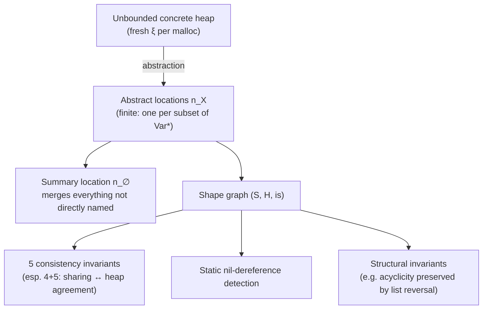

[[book-guidelines|↩ Back to guidelines]]

## The problem every prior analysis in this book dodged

Every analysis so far — [[Data-Flow-Analysis|Available Expressions, Reaching Definitions, Live Variables]], even [[Interprocedural-Data-Flow-Analysis|the interprocedural extensions]] — has a property space built from **finitely many** syntactic things: expressions appearing in the program, variables, labelled assignments. That finiteness is what let the Ascending Chain Condition hold almost for free (Examples 2.23–2.24: $\mathbf{AExp}_*$ and $\mathbf{Var}_* \times \mathbf{Lab}_*^?$ are finite because the *program text* is finite).

A heap has no such guarantee. `malloc` can run inside a loop; the *set of locations that actually exist at runtime* is unbounded even though the program that creates them is a fixed, finite piece of text. If you tried to build a Monotone Framework whose lattice tracks "the exact heap," you'd have an infinite lattice with no ACC, and the whole machinery from [[Monotone-Frameworks|Monotone Frameworks]] stops applying. Shape Analysis's entire technical content is: find a **finite characterization** of an unboundedly large heap, precise enough to still answer useful questions (does this program dereference `nil`? does it preserve acyclicity?) — a genuinely more intricate instance of the exact tension named all the way back in [[The-Nature-and-Scope-of-Program-Analysis|Chapter 1]]: safe approximation of something exact and (here) unbounded.

## Extending WHILE with a heap

The language gets pointer expressions $p ::= x \mid x.sel$ (one level of selectors — `car`/`cdr` if you like Lisp pairs), a `malloc p` statement, `nil`, and pointer-equality/pointer-test operators. Crucially, arithmetic and boolean expressions can only *read* heap cells through pointer expressions — they cannot create cells or mutate them; only assignment `[p:=a]^ℓ` and `malloc p` touch the heap's shape.

The **Structural Operational Semantics** extends states to `State = Var_* → (Z + Loc + {◊})` — a variable now holds either an integer, a heap location $\xi \in \mathbf{Loc}$, or the `nil` marker $\diamond$ — plus an explicit **heap** $\eta$ mapping (location, selector) pairs to values. The two `malloc` rules are the ones worth internalizing:

$$
\langle[\mathtt{malloc}\ x]^\ell,\sigma,\eta\rangle \to \langle\sigma[x\mapsto\xi],\eta\rangle \quad\text{where } \xi \text{ fresh}
$$
$$
\langle[\mathtt{malloc}\ (x.sel)]^\ell,\sigma,\eta\rangle \to \langle\sigma,\eta[(\sigma(x),sel)\mapsto\xi]\rangle \quad\text{where } \xi \text{ fresh},\ \sigma(x)\in\mathbf{Loc}
$$

Each `malloc` mints a genuinely fresh location — never previously used in $\sigma$ or $\eta$ — which is precisely the source of unboundedness: a loop that allocates on every iteration produces a semantics with infinitely many distinct locations across all possible (unboundedly long) executions, even though any *single* terminating execution only ever touches finitely many.

## Abstract locations: the finite stand-in for infinitely many real ones

**The core move.** Instead of tracking individual locations $\xi \in \mathbf{Loc}$ (infinite), track **abstract locations** $n_X \in \mathbf{ALoc} = \{n_X \mid X \subseteq \mathbf{Var}_*\}$ — one abstract location *per subset of program variables*. Since $\mathbf{Var}_*$ is finite (the program has finitely many variable names), $\mathbf{ALoc}$ is finite too — that's the entire trick. The intended reading: $n_X$ represents every real location currently pointed to by *exactly* the variables in $X$ simultaneously. $n_{\{x\}}$ is "the location `x` points to (and nothing else does, directly)." The special case $n_\emptyset$ — the **abstract summary location** — represents *every* location not directly reachable from any variable: everything you can only get to by walking further into the heap. This single summary node is what actually buys finiteness: an unboundedly long linked list, walked node by node, has unboundedly many real locations in its tail, but all of them not directly named by a variable collapse into the one node $n_\emptyset$.

**What breaks without the summary location.** If you tried instead to give every heap cell its own distinct abstract name based on, say, "how many `cdr` steps from `x`," you'd be right back to an unbounded lattice for an unboundedly long list — you'd have re-derived the original problem in a thin disguise. $n_\emptyset$ is deliberately *imprecise on purpose*: it merges together everything it can't afford to distinguish, in exchange for the property space actually being finite.

**Grounding it — Rust.** The finite-vs-infinite trade is the same one a real points-to analysis makes when it names abstract heap objects by *allocation site* rather than by runtime identity:

```rust
#[derive(PartialEq, Eq, Hash, Clone)]
enum AbstractLoc {
    Named(BTreeSet<VarId>), // n_X — represents whatever exactly these vars point to
    Summary,                 // n_∅ — everything else, merged
}
```

Every real analysis that scales to unbounded heaps (points-to analysis, shape analysis, separation-logic-based verifiers) makes exactly this move somewhere: replace "one abstract object per runtime object" (infinite, unusable) with "one abstract object per *finite naming scheme*" (allocation site, variable set, access path up to some bound) plus a summary bucket for everything the naming scheme can't distinguish.

## Shape graphs: three components, five invariants

A **shape graph** is a triple $(S, H, is)$:

- **Abstract state** $S \in \mathcal{P}(\mathbf{Var}_* \times \mathbf{ALoc})$ — which variables point to which abstract locations. (Integers, `nil`, and uninitialized fields are all deliberately conflated here — the analysis only cares about *shape*, not data.)
- **Abstract heap** $H \in \mathcal{P}(\mathbf{ALoc}\times\mathbf{Sel}\times\mathbf{ALoc})$ — triples $(n_V, sel, n_W)$ meaning "some real location represented by $n_V$ has its $sel$-field pointing to some real location represented by $n_W$."
- **Sharing information** $is \subseteq \mathbf{ALoc}$ — which abstract locations represent a real location that is the target of **more than one heap pointer** (i.e., genuinely shared/aliased structure, not just merged-for-finiteness structure).

Five invariants keep these three components mutually consistent and keep the *naming* meaningful:

1. **Disjointness of names.** If $n_X$ and $n_Y$ both occur in a shape graph, either $X=Y$ or $X\cap Y=\emptyset$ — two different abstract locations never claim overlapping sets of variables (proved by contradiction: if $z \in X\cap Y$, then $\sigma(z)$ would have to be represented by both $n_X$ and $n_Y$, forcing $n_X=n_Y$).
2. **Naming consistency.** If the abstract state maps $x$ to $n_X$, then $x \in X$ — you can't call something $n_{\{y\}}$ and have $x$ point to it.
3. **Determinism except at the summary.** If $(n_V,sel,n_W)$ and $(n_V,sel,n_{W'})$ are both in $H$, then either $V=\emptyset$ or $W=W'$ — a selector field's target is uniquely determined by its source, *unless* the source is the summary location, which is allowed to represent many real locations with genuinely different targets.
4. **Explicit sharing is heap-justified.** If $n_X \in is$, either $(n_\emptyset, sel, n_X) \in H$ for some $sel$ (could be multiple real locations, hiding inside the summary, pointing here), or there exist two *distinct* triples $(n_V,sel_1,n_X), (n_W,sel_2,n_X) \in H$ (two genuinely different named sources point here).
5. **Heap-implied sharing is made explicit.** Conversely, whenever two distinct triples in $H$ target the same $n_X \neq n_\emptyset$, that $n_X$ must be in $is$ — the sharing component can't be silent about aliasing the abstract heap itself already reveals.

Invariants 4–5 together are exactly a two-way consistency check: `is` and `H` are required to agree about what's shared, in both directions. This is the sharpest tool the analysis has for **recovering precision the abstraction otherwise threw away** — merging many real locations into $n_\emptyset$ inherently loses the ability to say "these two are actually the same cell vs. actually different cells," and `is` is the targeted patch that restores exactly the one bit of that information (shared vs. not) that turns out to matter for correctness questions like "does list reversal preserve acyclicity."

**Worked example (in-situ list reversal).** For the program `y:=nil; while not is-nil(x) do (z:=y; y:=x; x:=x.cdr; y.cdr:=z); z:=nil` reversing the list at `x` into `y`, the book tracks the shape graph through each loop iteration (Figure 2.13). Two details are worth internalizing: first, *even though the underlying semantics reuses the same set of concrete locations throughout*, those locations get represented by *different* abstract locations at different points in the analysis — $n_\emptyset$ at one program point can represent $\{\xi_2,\xi_3,\xi_4,\xi_5\}$ and at another, after one more iteration, $\{\xi_3,\xi_4,\xi_5\}$ — the abstraction is a snapshot per program point, not a fixed renaming. Second, the sharing component is what distinguishes "`y` points to a location also reachable via `x`'s tail" (a real aliasing configuration, `is` nonempty) from an *identically shaped* graph that happens not to have that aliasing — two heaps with the same shape-graph-minus-`is` can be operationally very different, and `is` is precisely the differentiator.

## What this buys you

**Static nil-dereference detection.** Since $S$ conflates `nil` with everything else, this needs the boolean `has-sel`/`is-nil` tests threaded through the same equational machinery as the rest of the analysis (kill/gen-style transfer functions per block) — but the point is structural: once you have a finite, sound abstraction of "what could this pointer expression currently be," you can flag a dereference where the abstraction proves the pointer is *always* `nil` on entry, catching a bug the language's type system alone (WHILE has none to speak of) cannot.

**Validating shape invariants across a whole procedure** — the headline example is exactly the list-reversal program above: prove that a program known to receive a **non-cyclic** list also **produces** a non-cyclic list, purely from the shape graph's evolution through the loop, without ever running the program on a specific input. This is a genuinely different kind of claim than anything [[Data-Flow-Analysis|the four classical Data Flow analyses]] could state — those reasoned about *which expressions/definitions/variables*, a syntactic classification; Shape Analysis reasons about the **topology of a mutable data structure**, a semantic/structural claim about the heap's shape that has no purely-syntactic proxy.

## Where this leads



Shape Analysis is deliberately placed at the *end* of the Data Flow Analysis chapter as a "how far can these techniques stretch" capstone — the same kill/gen/lattice/worklist vocabulary from [[Monotone-Frameworks|Monotone Frameworks]] still applies, but the property space itself now has to be *engineered* (the summary-location trick) rather than falling out trivially from finite program text. That engineering move — replace an unbounded concrete domain with a finite abstract one related back to it by a representation function, then prove the abstraction sound — is exactly the general recipe [[Abstract-Interpretation|Abstract Interpretation]] formalizes in the next chapter via Galois connections; shape graphs are a fully worked, unusually intricate instance of that recipe applied before the general theory has even been stated.

For the standing project, this chapter is the most direct precedent in the book for **automatically inferring separation-logic-style heap invariants** (`static-analysis`) — the shape graph's summary-location-plus-sharing-bits design is a concrete, checkable answer to exactly the "how do I soundly and finitely abstract an unbounded mutable heap" question your compiler's invariant generator will face when checking refinement types or Hoare contracts over programs that build and mutate data structures, and the five consistency invariants here are a template for the kind of well-formedness side-conditions your own abstract domain will need to maintain and prove sound (`type-theory`'s representation-function discipline, applied to heaps instead of terms).
