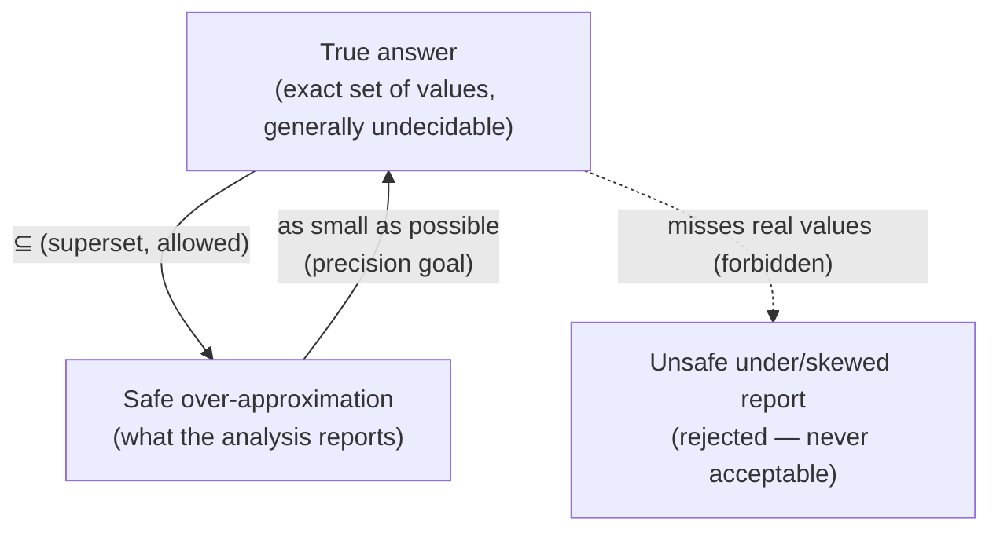

[[book-guidelines|↩ Back to guidelines]]

## Why compilers (and verifiers) need to guess the future

A compiler, or a verifier, has to answer questions about what a program will do when it runs — *before* it runs. "Is this expression's value already sitting in a register?" "Can `z` ever be negative here?" "Is this pointer definitely non-null?" The only way to answer these with total certainty, in general, is to actually run the program on every possible input — which is exactly what you can't afford to do at compile time, and which doesn't even terminate for programs that loop forever on some inputs.

So every static analysis is a **structured guess**: a computable procedure that predicts something about a program's *dynamic* behavior using only *static* (compile-time) information. Nielson, Nielson & Hankin's opening move in this book is to name the tension this guess lives inside, before introducing a single formalism. That tension has three parts, and they map onto three distinct engineering decisions you make every time you design a static analysis:

1. What are you willing to get wrong, and in which direction?
2. Does your analysis have to be justified against the language's real semantics, or can it stand on its own?
3. What do you do with the answer once you have it?

## 1. Safe approximation: the direction you're allowed to be wrong in

**What breaks without this.** Suppose you write an analysis that tries to compute the *exact* set of values a variable can hold at some program point. For almost any nontrivial program, this is undecidable — it's equivalent to solving the halting problem. Rice's theorem generalizes this: almost every interesting *semantic* property of programs is undecidable. If you insist on exactness, you don't get a slower analysis — you get no analysis at all.

The book's answer is **safe approximation** (§1.1, p. 1–3): give up on exactness, but never give up on being *wrong in a predictable direction*. Concretely, for an analysis whose job is to compute a set of possible values/behaviors, "safe" means: the analysis's answer must be a superset of the true set.

$$
\{d_1, \ldots, d_n\} \;\subseteq\; \{d_1, \ldots, d_n, \ldots, d_{n+m}\}
$$

where the left side is the true (exact) answer and the right side is what the analysis is allowed to report. The book's own running example (Fig. 1.1, and worked out with the program `read(x); (if x>0 then y:=1 else (y:=2;S)); z:=y`) makes the failure mode concrete: if `S` is a statement that provably never terminates when `x≤0`, then the *true* answer for the reachable values of `y` at `z:=y` is just `{1}`. An analysis that (correctly, but only by getting lucky about undecidable termination) says `{1}` is fine. An analysis that conservatively says `{1, 2}` is *also* fine — it's safe, just less precise. An analysis that says `{1, 2, 27}` is safe but useless. An analysis that says `{1}` *without justification* — one that would say `{1}` even in cases where `y` really can be `2` at that point — is unsafe, and that's the one case you can never accept.

This gives you a two-axis design space for every analysis in the book:

- **Precision** — how close the reported over-approximation is to the true answer.
- **Computability / cost** — whether the analysis terminates in reasonable time at all.

You are always trading one against the other. An analysis that reports "could be anything" is maximally safe, computable in $O(1)$, and worthless. An analysis that tries to track exact values is maximally precise and undecidable. Every analysis in Chapters 2–5 (Data Flow, Constraint Based, [[Abstract-Interpretation|Abstract Interpretation]], [[Type-and-Effect-Systems|Type and Effect Systems]]) is a different point on this tradeoff curve, and — this is the book's real thesis — they're different *engineering* answers to the *same* precision/computability problem, not unrelated techniques.



**Grounding it in Rust.** This "safe means superset" discipline is exactly the contract a `#[must_use]`-style dataflow lattice or an abstract-interpretation domain has to satisfy in a real compiler pass. A minimal sketch of a sign-analysis domain makes the superset obligation a type-level fact rather than a comment:

```rust
#[derive(Clone, Copy, PartialEq, Eq, Debug)]
enum Sign {
    Bottom,        // "no possible value reaches here" (unreachable code)
    Negative,
    Zero,
    Positive,
    Top,           // "could be anything" — always safe, never precise
}

// A safe join: the result must over-approximate BOTH inputs. Never
// narrows — narrowing here would be exactly the unsafe move the book
// rules out.
fn join(a: Sign, b: Sign) -> Sign {
    use Sign::*;
    match (a, b) {
        (x, y) if x == y => x,
        (Bottom, x) | (x, Bottom) => x,
        _ => Top, // when in doubt, admit you don't know — safely
    }
}
```

The `join` function's only real invariant is monotonicity toward `Top`: it is structurally incapable of returning something *more precise* than either input actually justifies. That's the type-level embodiment of "safe approximation" — and it's the same invariant a lattice-based abstract domain in your own compiler's dataflow pass has to preserve, whether it's tracking signs, intervals, or points-to sets.

## 2. Semantics-based, not semantics-directed

Given that every analysis is a guess, how do you know a *particular* guess is any good? The book draws a sharp, easily-confused-pair distinction here (§1.2, p. 3) that is worth pinning down precisely:

- **Semantics-based** (what this book insists on): the information the analysis produces can be *proved* correct with respect to a formal semantics of the language — an operational semantics, in this book's case. The analysis's *design* can look however you like; its *correctness claim* is always cashed out against the real meaning of programs.
- **Semantics-directed** (what this book explicitly does *not* pursue, except in passing): the *structure* of the analysis itself mirrors the structure of the semantics — e.g., the analysis is literally the standard semantics reinterpreted over an abstract domain, clause for clause.

Every semantics-directed analysis is trivially semantics-based (if its structure mirrors the semantics, correctness is nearly free), but the converse is not true — you can have an analysis whose algorithmic shape looks nothing like the operational semantics (a worklist algorithm over a hand-crafted flow graph, say) and still demand, and get, a rigorous soundness proof relating it back to that semantics.

**What breaks without this.** The book is blunt about the motivation: "new program analyses often contain subtle bugs." An analysis is a piece of mathematics *and* a piece of software; without an explicit correctness relation to check against, an unsound analysis will silently tell a compiler it's safe to elide a bounds check, or fold a constant, when it isn't. Semantics-based analysis is the discipline that catches this *before* it ships, by making "is this analysis correct" a theorem statement instead of a hope.

**Grounding it — this is where your own project connects most directly.** This distinction is the ancestor of the soundness argument your compiler's own over-approximating passes will need to make. Concretely, "semantics-based" cashes out later in the book as a **correctness relation** or **Galois connection** $(\alpha, \gamma)$ between the *collecting semantics* (the exact, usually infinite, set of all reachable states) and the *abstract domain* your analysis actually computes over — the same shape of object you'll want between your refinement-type checker's abstract invariants and the concrete program traces those invariants are supposed to over-approximate. A Rust sketch of what "semantics-based" demands as an obligation (not yet the Galois-connection machinery itself, which the book builds up starting in Chapter 4, but the property it exists to guarantee):

```rust
// The correctness obligation a semantics-based analysis owes you:
// for every concrete execution, the analysis's abstract result must
// contain the concrete outcome. This is a property to *prove*, not
// just a type to check — but the type is the scaffold the proof hangs on.
trait SoundAnalysis {
    type Concrete; // e.g. an environment: Var -> i64
    type Abstract; // e.g. an environment: Var -> Sign

    fn abstract_step(&self, pre: &Self::Abstract) -> Self::Abstract;
    fn concrete_step(&self, pre: &Self::Concrete) -> Self::Concrete;

    // Soundness theorem, stated as a property to discharge (by hand,
    // or by proof assistant), not code that runs:
    //   represents(concrete_step(c), abstract_step(a))
    //   whenever represents(c, a)
    fn represents(c: &Self::Concrete, a: &Self::Abstract) -> bool;
}
```

In Lean terms, this `represents` relation is precisely what later becomes a *representation function* or a Galois connection's $\gamma$ (concretization map), and the soundness obligation above is the statement you'd actually discharge as a Lean theorem once the domains are formalized — `represents (concrete_step c) (abstract_step a)` given `represents c a`, by induction on the operational semantics. Keep this shape in mind; it recurs, unchanged in spirit, every time this book proves an analysis correct.

## 3. What the analysis is *for*: transformation and optimization

Program analysis isn't an end in itself — the book frames its motivating applications right in §1.1: helping compilers avoid **redundant** computations (reusing an already-available result, hoisting a loop-invariant computation out of a loop) and **superfluous** ones (computing a result nobody needs, or one already known at compile time), plus newer applications like validating third-party code for malicious or unintended behavior.

Section 1.8 makes the connection between *analysis* and *transformation* completely concrete with **Constant Folding**: given a solution to Reaching Definitions Analysis (which variable-definitions can reach which program points), you get a source-to-source rewrite rule — if a variable `y` used in an expression at label $\ell$ is guaranteed (by the RD solution) to have been assigned a single constant value `n` everywhere it could have reached $\ell$, replace that use of `y` with the literal `n`. The book states this as a small inference system, e.g.

$$
[ass_1]\quad \mathsf{RD} \vdash [x:=a]^\ell \;\triangleright\; [x := a[y \mapsto n]]^\ell \quad \text{if } y \in FV(a) \wedge (y,?) \notin \mathsf{RD}_{entry}(\ell) \wedge \cdots
$$

— read this as: "given that RD proves `y` can never be undefined at $\ell$, and every definition of `y` that reaches $\ell$ assigns it the same constant `n`, it is safe to substitute `n` for `y` inside the assignment at $\ell$." This is the cleanest possible illustration of *why* safety (point 1) matters operationally: the transformation is licensed **only because** the underlying analysis over-approximates safely. If Reaching Definitions ever under-approximated — missed a definition that really could reach $\ell$ — this rule would silently corrupt the program's meaning. Every optimization built on top of a static analysis inherits that analysis's soundness obligation as its own correctness obligation.

## Where this leads

These three ideas are not chapter-1 throwaway framing — they are the fixed points the rest of the book keeps returning to:

- **Safe approximation** reappears as the defining property of every concrete analysis (Available Expressions needs the *largest* safe solution, Reaching Definitions the *smallest*, for reasons tied to may/must-analysis) and gets formalized as *complete lattices satisfying the Ascending Chain Condition* in [[Monotone-Frameworks|Monotone Frameworks]].
- **Semantics-based correctness** is what Chapter 4's Galois connections and correctness relations exist to formalize precisely — turning "we believe this analysis is safe" into a provable adjunction $\alpha(l) \sqsubseteq m \Leftrightarrow l \sqsubseteq \gamma(m)$.
- **Analysis as a basis for transformation** is the through-line that eventually gives every analysis in the book *teeth* — [[Data-Flow-Analysis|Data Flow Analysis]] licenses Constant Folding and dead-code elimination, Control Flow Analysis licenses devirtualization/inlining decisions, and effect systems license region-based memory reuse.

For the standing project of building a Rust-based verifying compiler: this chapter is the place to fix, once and for all, what "sound" is going to mean for every abstract-interpretation-based invariant pass you write later — an over-approximation of reachable states, correct with respect to the language's real operational semantics, exactly in the sense the book insists on here (`static-analysis`). The companion discipline — proving the *presence* of a counterexample rather than the *absence* of all bugs — is a genuinely different (under-approximating, satisfiability-flavored) correctness contract, and this chapter's "safe means superset" framing is precisely the contract you should *not* apply there; keep the two obligations from blurring together once the CSP/counterexample-search kernel enters the picture (`sat-smt-csp`).
