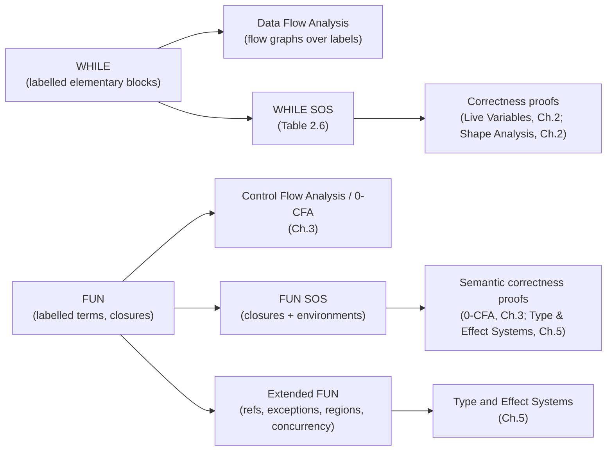

[[book-guidelines|↩ Back to guidelines]]

## Why the book needs two toy languages, not one

Every analysis technique in this book gets developed twice: once for an imperative setting and once for a functional one. That's not padding — it's the whole argument. The book's thesis is that Data Flow Analysis, Constraint Based Analysis, [[Abstract-Interpretation|Abstract Interpretation]], and Type and Effect Systems are *the same ideas* wearing different clothes, and the cleanest way to demonstrate that is to run every idea through **two structurally different languages** and watch the same mathematics fall out both times.

**WHILE** is the imperative half: assignments, conditionals, loops — deliberately unsurprising, so that all the interesting complexity lives in the analysis, not the language. **FUN** is the functional half: a small untyped lambda calculus with recursion, conditionals, and local definitions — deliberately *not* unsurprising, because higher-order functions introduce a problem WHILE doesn't have (the "dynamic dispatch problem": you can't tell what a function application calls just by looking at its syntax). Almost every later result in the book — Monotone Frameworks, 0-CFA, Galois connections, annotated type systems — gets stated for one or both of these languages, so getting their syntax and semantics precisely right here pays off for the rest of the book.

## WHILE: elementary blocks and labelled abstract syntax

**What problem this solves.** A Data Flow Analysis needs to talk about specific *points* in a program — "the set of expressions available right after this assignment," "the definitions reaching just before this test." Ordinary program text doesn't have addressable points; you'd have to talk about a whole assignment statement's syntax tree just to refer to "the place right after it." The book's fix (§1.2) is to require every atomic action to carry an explicit, unique **label** $\ell \in \mathbf{Lab}$, turning each assignment, `skip`, and boolean test into what the book calls an **elementary block** — the smallest unit a flow-sensitive analysis can attach information to.

The labelled abstract syntax of WHILE:

$$
a ::= x \mid n \mid a_1 \; op_a \; a_2 \qquad\qquad b ::= \mathbf{true} \mid \mathbf{false} \mid \mathbf{not}\ b \mid b_1\; op_b\; b_2 \mid a_1\; op_r\; a_2
$$

$$
S ::= [x := a]^\ell \;\mid\; [\mathbf{skip}]^\ell \;\mid\; S_1;S_2 \;\mid\; \mathbf{if}\ [b]^\ell\ \mathbf{then}\ S_1\ \mathbf{else}\ S_2 \;\mid\; \mathbf{while}\ [b]^\ell\ \mathbf{do}\ S
$$

Only assignments, `skip`s, and the tests inside `if`/`while` get labels — sequencing and the control-flow constructs themselves don't, because they're not "actions," they're *structure*. This single design choice is what makes flow graphs (Chapter 2) mechanical to build: every label becomes a node, and `flow`/`flow`$^R$ functions connect them by walking the syntax tree once.

**Grounding it in Rust.** The elementary-block discipline is exactly the shape of an AST where every "actionable" node carries a stable ID for later analysis passes to key off of:

```rust
type Label = u32;

enum Stmt {
    Assign { label: Label, var: String, expr: AExpr },
    Skip { label: Label },
    Seq(Box<Stmt>, Box<Stmt>),
    If { label: Label, cond: BExpr, then_branch: Box<Stmt>, else_branch: Box<Stmt> },
    While { label: Label, cond: BExpr, body: Box<Stmt> },
}
```

Note which constructors carry a `Label` and which don't — `Seq` doesn't, mirroring the book exactly: sequencing has no dynamic behavior of its own to attach a dataflow fact to.

## WHILE: a Structural Operational Semantics you can run

**What problem this solves.** A safe approximation is a claim about *real* program behavior — but "real behavior" has to mean something precise before you can prove anything safe with respect to it. §2.2.1 supplies that precision with a **small-step Structural Operational Semantics (SOS)**: small-step, rather than big-step, specifically so it can talk about *intermediate* states of a computation and about *non-terminating* programs — both things a big-step "input state → output state" relation can't express.

A **state** $\sigma \in \mathbf{State} = \mathbf{Var} \to \mathbf{Z}$ maps variables to integers. A **configuration** is either a pair $\langle S, \sigma\rangle$ (still executing) or bare $\sigma$ (terminated). Transitions have the shape $\langle S,\sigma\rangle \to \sigma'$ (finishes in one step) or $\langle S,\sigma\rangle \to \langle S',\sigma'\rangle$ (one step done, $S'$ remains). The full rule set (Table 2.6):

$$
\begin{aligned}
[ass] &\quad \langle [x:=a]^\ell, \sigma\rangle \to \sigma[x \mapsto \mathcal{A}[\![a]\!]\sigma] \\
[skip] &\quad \langle [\mathbf{skip}]^\ell, \sigma\rangle \to \sigma \\
[seq_1] &\quad \dfrac{\langle S_1,\sigma\rangle \to \langle S_1',\sigma'\rangle}{\langle S_1;S_2,\sigma\rangle \to \langle S_1';S_2,\sigma'\rangle}
\qquad
[seq_2]\ \dfrac{\langle S_1,\sigma\rangle \to \sigma'}{\langle S_1;S_2,\sigma\rangle \to \langle S_2,\sigma'\rangle} \\
[if_1] &\quad \langle \mathbf{if}\ [b]^\ell\ \mathbf{then}\ S_1\ \mathbf{else}\ S_2, \sigma\rangle \to \langle S_1,\sigma\rangle \quad\text{if } \mathcal{B}[\![b]\!]\sigma = true \\
[if_2] &\quad \dots \to \langle S_2,\sigma\rangle \quad\text{if } \mathcal{B}[\![b]\!]\sigma = false \\
[wh_1] &\quad \langle \mathbf{while}\ [b]^\ell\ \mathbf{do}\ S,\sigma\rangle \to \langle (S;\mathbf{while}\ [b]^\ell\ \mathbf{do}\ S),\sigma\rangle \quad\text{if } \mathcal{B}[\![b]\!]\sigma = true \\
[wh_2] &\quad \dots \to \sigma \quad\text{if } \mathcal{B}[\![b]\!]\sigma = false
\end{aligned}
$$

where $\mathcal{A}[\![\cdot]\!]$ and $\mathcal{B}[\![\cdot]\!]$ are ordinary denotational functions giving the value of an arithmetic/boolean expression in a state (Table 2.5) — expressions are total and instantaneous; only statements get the step-by-step treatment. The two `while` rules are the elegant part: `while` **unrolls itself** into `S ; while [b]^ℓ do S` rather than needing a dedicated loop-continuation mechanism — the semantics of iteration is entirely reduced to the semantics of sequencing plus a self-referential rewrite.

**What breaks without this.** Without a small-step relation, you cannot state "Live Variables Analysis is correct" as a theorem at all — correctness (Theorem 2.21 in the book) is a statement about how the analysis's abstract facts evolve *in step with* real execution steps, one $\to$ at a time. A big-step semantics only tells you input/output pairs, so it can't support an inductive correctness proof that has to track what's true *mid-loop*, on iteration $n$ specifically.

**Grounding it — Rust.** A small-step semantics translates almost literally into an interpreter that exposes single steps rather than running to completion, which is the natural shape for something a static-analysis pass would want to reason about inductively:

```rust
enum Config { Running(Stmt, State), Done(State) }

fn step(cfg: Config) -> Config {
    match cfg {
        Config::Running(Stmt::Assign { var, expr, .. }, mut st) => {
            let v = eval_aexpr(&expr, &st);
            st.insert(var, v);
            Config::Done(st)
        }
        Config::Running(Stmt::Seq(s1, s2), st) => match step(Config::Running(*s1, st)) {
            Config::Done(st2) => Config::Running(*s2, st2),
            Config::Running(s1p, st2) => Config::Running(Stmt::Seq(Box::new(s1p), s2), st2),
        },
        Config::Running(Stmt::While { cond, body, label }, st) => {
            if eval_bexpr(&cond, &st) {
                let unrolled = Stmt::Seq(body.clone(),
                    Box::new(Stmt::While { cond, body, label }));
                Config::Running(unrolled, st)
            } else {
                Config::Done(st)
            }
        }
        // ... ass/skip/if omitted for brevity, same shape as the rules above
        _ => unreachable!(),
    }
}
```

Each `match` arm is a direct transcription of one inference rule — `[seq_1]`/`[seq_2]` collapse into one recursive call, and `[wh_1]`/`[wh_2]` collapse into one `if`. This one-to-one correspondence between inference rules and interpreter cases is *exactly* the correspondence a soundness proof exploits: proving an analysis correct with respect to this semantics means showing your analysis's abstract transfer function commutes with each of these concrete cases.

## FUN: labelled terms, and why higher-order functions need closures

**What problem this solves.** In WHILE, "what fragment of the program does control go to next" is always syntactically obvious. In a functional language with higher-order functions, it isn't. The book's motivating example (§1.4, §3.1):

```
let f = fn x => x 1;
    g = fn y => y+2;
    h = fn z => z+3
in (f g) + (f h)
```

The application `x 1` inside `f`'s body calls *whatever `x` is bound to* — and that depends on whether `f` was called with `g` or `h`. This is the **dynamic dispatch problem**: control flow itself becomes a piece of information you have to compute, not something visible in the syntax. Solving this (via Control Flow Analysis, [[Control-Flow-Analysis-(0-CFA-and-Constraint-Based-Analysis)|0-CFA]] later in the book) is FUN's whole reason for existing.

**Labelled syntax.** Mirroring WHILE's discipline, FUN distinguishes labelled **expressions** ($e \in \mathbf{Exp}$) from unlabelled **terms** ($t \in \mathbf{Term}$), so that *every* subexpression — not just top-level statements — is individually addressable:

$$
e ::= t^\ell
$$
$$
t ::= c \mid x \mid \mathbf{fn}\ x \Rightarrow e_0 \mid \mathbf{fun}\ f\ x \Rightarrow e_0 \mid e_1\ e_2 \mid \mathbf{if}\ e_0\ \mathbf{then}\ e_1\ \mathbf{else}\ e_2 \mid \mathbf{let}\ x = e_1\ \mathbf{in}\ e_2 \mid e_1\ op\ e_2
$$

`fn x => e0` is a non-recursive abstraction; `fun f x => e0` is the recursive form, binding `f` inside its own body — the book's economical way of giving FUN recursion without a separate fixed-point combinator in the syntax.

**Why closures, not substitution.** The book is explicit about a design decision that matters a lot for analysis: it gives FUN an SOS based on **explicit environments and closures**, not substitution, because "a substitution based semantics does not preserve the identity of functions ... during evaluation" (§3.2.1). If you evaluated `fn x => e0` by literally substituting values into `e0` wherever it's later called, two syntactically-identical-looking function bodies arising from different closures would become indistinguishable — but Control Flow Analysis needs to track *which* function abstraction (by label!) a value came from. So:

$$
v ::= c \mid \mathbf{close}\ t\ \mathbf{in}\ \rho \qquad\qquad \rho ::= [\,] \mid \rho[x \mapsto v]
$$

A function value is a **closure**: the function's own syntax `t` (still carrying its label) paired with the environment $\rho$ that was active when the closure was created. This is precisely why the book can treat $\ell_0$ in `close (fn x => e_0^{\ell_0}) in ρ` as a "unique identification" of *this* function abstraction — the label survives evaluation because the semantics never throws the syntax away.

The transitions live over an extended grammar of **intermediate expressions/terms** that additionally include `bind ρ in ie` (evaluate `ie` under the pushed environment `ρ` — the small-step encoding of a call frame) and `close t in ρ` (a fully evaluated closure value) — needed only because a small-step semantics has to represent partially-evaluated function calls as first-class syntax, the same way WHILE's small-step semantics needed intermediate configurations $\langle S', \sigma'\rangle$ for partially-executed statements.

**Grounding it — this is squarely elaborator territory.** A closure-based FUN interpreter in Rust makes the "environment travels with the function, syntax is never substituted into" discipline a structural fact:

```rust
#[derive(Clone)]
enum Value {
    Const(i64),
    Closure { param: String, body: Rc<Term>, env: Env }, // env captured, not substituted
}

type Env = im::HashMap<String, Value>; // persistent map — cheap to snapshot per closure

fn eval(term: &Term, env: &Env) -> Value {
    match term {
        Term::Fn { param, body } => Value::Closure {
            param: param.clone(), body: body.clone(), env: env.clone(),
        },
        Term::App(e1, e2) => {
            let fv = eval(e1, env);
            let av = eval(e2, env);
            match fv {
                Value::Closure { param, body, env: captured } => {
                    let call_env = captured.update(param, av); // bind, don't substitute
                    eval(&body, &call_env)
                }
                _ => panic!("apply of non-function"),
            }
        }
        // ...
        _ => unreachable!(),
    }
}
```

**Grounding it — Lean.** This closure/environment discipline is *exactly* what your elaborator's own term representation needs when it defers substitution for efficiency and correctness — Lean's kernel represents a `let` or lambda body unreduced, carrying its local context, and only substitutes lazily during `whnf`/`isDefEq` reduction, for the same reason the book gives: eager substitution would either be wasteful or (worse, in a dependently-typed setting) risk losing the sharing/identity information metavariable unification depends on. The book's closure `close t in ρ` is a first-order stand-in for what Lean formalizes as a suspended substitution/thunk in its expression representation.

## Extensions of FUN: what changes when you add real-world features

The core FUN calculus is deliberately minimal so that 0-CFA (Chapter 3) stays tractable to present. But the book's [[Type-and-Effect-Systems|Type and Effect Systems]] chapter (Chapter 5) extends FUN along four largely orthogonal axes, each adding one specific analysis problem:

- **References** (§5.4, Side Effect Analysis) — mutable cells introduce *aliasing*: two variables can denote the same mutable location, so an analysis must track effects like $!\pi$ (dereference region $\pi$) and $\pi{:=}$ (assign region $\pi$) as annotations on the type, not just on the term.
- **Exceptions** (§5.4, Exception Analysis) — raising/handling introduces non-local control transfer; the analysis needs polymorphic type schemes $\forall(\zeta_1,\ldots,\zeta_n).\hat\tau$ so a `raise`-able function's exception behavior can be reused polymorphically at different call sites, analogous to how ordinary let-polymorphism reuses an ordinary type.
- **Regions** (§5.4, Region Inference) — stack-discipline memory management needs to track *where* (in which region) a value is allocated and *when* that region can be safely deallocated, which is a static analysis problem with real runtime consequences if it's wrong.
- **Concurrency** (§5.5, Communication Analysis) — channels, `spawn`, send/receive add *temporal order* to the effects: it's no longer enough to know *that* a communication can happen, you need a **behaviour** — an effect algebra with sequencing, choice, and recursion — to know in what order.

Each of these is a case study in the same recipe: extend FUN's syntax minimally, extend its SOS with the new dynamic behavior (a heap for references, an exception-propagating configuration, a region stack, communicating processes), and then show the corresponding *static* annotation is a safe over-approximation of that new dynamic behavior — the same safe-approximation discipline from [[The-Nature-and-Scope-of-Program-Analysis|The Nature and Scope of Program Analysis]], now applied to effects rather than just values.

## Where this leads



WHILE's labelled elementary blocks are the load-bearing prerequisite for every flow graph in [[Data-Flow-Analysis|Data Flow Analysis]] and [[Monotone-Frameworks|Monotone Frameworks]] — the labels *are* the nodes. FUN's closure-based SOS is the load-bearing prerequisite for 0-CFA's acceptability relation and for the Type and Effect Systems chapter's subject-reduction proofs; without closures carrying labels, "which function abstraction is this value" isn't even a well-formed question to ask.

For the standing project: FUN's environment/closure discipline is the most direct precursor in this book to the term representation your own elaborator will need (`type-theory`) — captured environments rather than eager substitution is precisely the design your metavariable-unification and bidirectional-typing machinery will also want, for the same identity-preservation reason the book gives. And the extensions — especially Region Inference's compile-time-checked deallocation and Side Effect Analysis's aliasing tracking — are close cousins of the Hoare-triple/refinement-type invariants your compiler's abstract-interpretation passes (`static-analysis`) will need to generate and check automatically.
