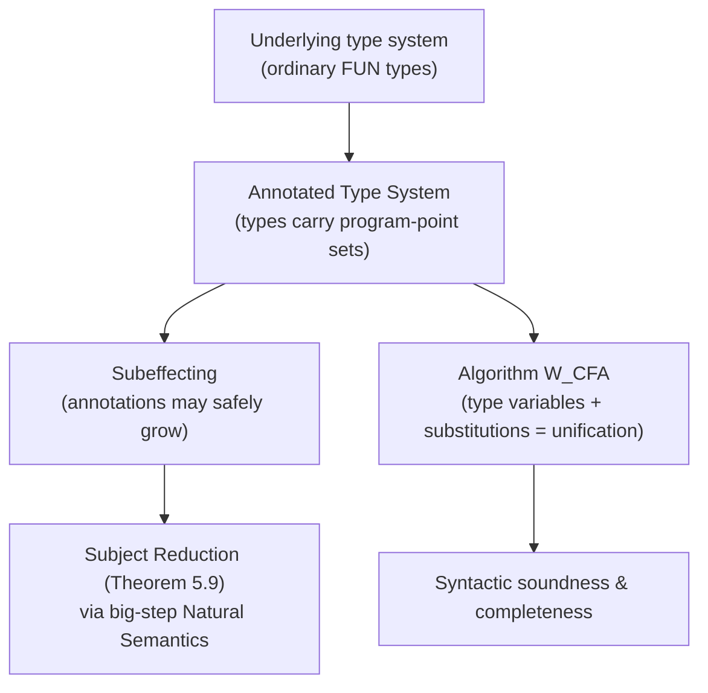

[[book-guidelines|↩ Back to guidelines]]

## Recasting an analysis as a type system

Every prior analysis technique in the book — [[Data-Flow-Analysis|Data Flow]], [[Control-Flow-Analysis-(0-CFA-and-Constraint-Based-Analysis)|0-CFA]], [[Abstract-Interpretation|Abstract Interpretation]] — worked equally well whether or not the source language had a type system at all. This chapter breaks that pattern deliberately: it demands a *typed* language, because its whole technique is to **piggyback the analysis on the syntax of types**. The question this chapter answers is: given that [[Control-Flow-Analysis-(0-CFA-and-Constraint-Based-Analysis)|0-CFA]] already computes "which function abstractions could a subexpression evaluate to," can that same information be recovered as a *type*, checked by *typing rules*, rather than as a set-theoretic acceptability relation checked by coinduction? The answer is yes, and the payoff is a completely different, arguably more familiar, proof technique for correctness: **subject reduction**, the workhorse of every type-soundness proof you've seen for a real programming language.

## The underlying type system: ordinary types, nothing new yet

FUN gets one syntactic change — function abstractions carry a **program point** $\pi\in\mathbf{Pnt}$ (`fn`$_\pi$ `x => e`$_0$) instead of Chapter 3's labels — and an entirely ordinary simply-typed reading:

$$
\tau ::= \mathtt{int}\mid\mathtt{bool}\mid\tau_1\to\tau_2
$$

with the expected rules (Table 5.1) — $[fn]$: $\Gamma[x\mapsto\tau_x]\vdash_{UL}e_0:\tau_0$ gives $\Gamma\vdash_{UL}\mathtt{fn}_\pi\,x\Rightarrow e_0 : \tau_x\to\tau_0$; $[app]$: the usual arrow-elimination. Nothing here is Control-Flow-Analysis-specific yet — this is exactly the type system you'd write for FUN if you'd never heard of program analysis. The book calls it the **underlying type system** precisely because everything else in the chapter is built as a conservative extension on top of it.

## Annotated types: the type *is* the analysis result

**The core move.** Extend function types with an **annotation** $\varphi\in\mathbf{Ann}$ — a set of program points, built from $\{\pi\}$, unions, and $\emptyset$ — giving $\widehat\tau_1\xrightarrow{\varphi}\widehat\tau_2$. Read $\varphi$ as *exactly* [[Control-Flow-Analysis-(0-CFA-and-Constraint-Based-Analysis)|0-CFA's]] $\widehat{\mathsf C}(\ell)$: the set of function abstractions this arrow-typed value could actually be. Every annotated type erases to an ordinary type via $\lfloor\cdot\rfloor$ (strip the annotations: $\lfloor\widehat\tau_1\xrightarrow\varphi\widehat\tau_2\rfloor = \lfloor\widehat\tau_1\rfloor\to\lfloor\widehat\tau_2\rfloor$), so an annotated typing is always a *refinement* of an ordinary one, never a different claim about the program's ordinary type.

The Control Flow Analysis judgement $\widehat\Gamma\vdash_{CFA}e:\widehat\tau$ (Table 5.2) modifies exactly the two clauses that create function values:

$$
[fn]\quad\dfrac{\widehat\Gamma[x\mapsto\widehat\tau_x]\vdash_{CFA}e_0:\widehat\tau_0}{\widehat\Gamma\vdash_{CFA}\mathtt{fn}_\pi\,x\Rightarrow e_0 : \widehat\tau_x\xrightarrow{\{\pi\}\cup\varphi}\widehat\tau_0}
$$

— literally recording "this abstraction, named $\pi$, is a possible value here," the exact content Chapter 3's $[fn]$ clause of Table 3.1 asserted via $\{\mathtt{fn}\ x\Rightarrow e_0\}\subseteq\widehat{\mathsf C}(\ell)$, now living inside the type itself rather than in a side-table indexed by labels. Function *application* ($[app]$) requires the operator's type to already carry a matching annotated arrow — no separate acceptability check needed, because the type discipline enforces it structurally.

## Subeffecting: the annotation can grow, freely, without loss of soundness

**What breaks without it.** The rule $\widehat\tau_x\xrightarrow{\{\pi\}\cup\varphi}\widehat\tau_0$ has a free $\varphi$ that the $[fn]$ rule *allows* to be anything — including $\emptyset$, giving the minimal annotation $\{\pi\}$. But consider the book's `loop` example, `let g = fun`$_F$` f x => f (fn`$_Y$` y => y) in g (fn`$_Z$` z => z)`. Typing `fn`$_Y$` y => y` inside `f`'s body forces its annotated type to be $\widehat\tau\xrightarrow{\{Y\}}\widehat\tau$. But `g` gets *applied* to `fn`$_Z$` z => z`, and consistency at the call site demands `fn`$_Y$` y => y`'s type match `fn`$_Z$` z => z`'s type exactly — impossible if the annotations are forced to their syntactically-minimal singleton sets $\{Y\}$ and $\{Z\}$, which are different. **Some programs would then have no derivable typing at all** in [[Effects-Beyond-Control-Flow#The annotated type|the Annotated Type]] System — a genuinely unacceptable outcome, since this analysis must be usable on *every* well-typed program.

**The fix**: let $\varphi$ range freely — the annotation on any arrow can be *enlarged* beyond its syntactic minimum, as long as every actual use is still contained. The book's worked derivation enlarges $\{Y\}$ to $\{Y,Z\}$ and $\{Z\}$ to $\{Z,Y\}$ — now syntactically equal sets — letting the application typecheck with a shared annotated type. This freedom to over-approximate the annotation is called **subeffecting**, and it is the load-bearing reason the analysis can type *every* program the underlying type system can type — Fact 5.6 states this precisely as a **conservative extension** result: (i) every CFA-typing erases to a valid underlying typing, and (ii) every underlying typing has *some* CFA-typing above it (constructed, in the extreme, by annotating every arrow with the set of *all* program points in the expression — always safe, just maximally imprecise). Without subeffecting, condition (ii) fails outright, exactly as the `loop` example demonstrates.

**Grounding it — Lean.** Subeffecting is structurally identical to **subtyping via widening a constraint**, the same move your elaborator's bidirectional typing makes when a metavariable's inferred type needs to unify against a *less specific* expected type — accepting any annotation that's a safe superset of what's strictly required is the annotation-level analogue of accepting any term whose type is a subtype of (or definitionally equal up to some tolerance to) what's expected. The set-inclusion ordering on annotations here ($\{\pi\}\cup\varphi$ can always grow) is a miniature, decidable instance of the same "is this answer *at least as general* as required" check your unifier performs on types.

## Semantic correctness: subject reduction via a big-step Natural Semantics

**A genuinely different proof technique from Chapters 2–3.** [[The-WHILE-and-FUN-Model-Languages|WHILE and FUN's]] earlier correctness proofs used **small-step** SOS specifically so intermediate/non-terminating computations had something to say. This chapter instead uses a **big-step Natural Semantics**, $\vdash e\longrightarrow v$ — and handles non-termination the way a big-step semantics has to: by the **absence** of a finite inference tree. The book makes this concrete by re-running `loop` through the Natural Semantics: unfolding the recursive definition literally reproduces the same judgement it started from, an infinite regress with no base case — exactly the *lack* of an inference tree standing in for non-termination, mirroring how [[Control-Flow-Analysis-(0-CFA-and-Constraint-Based-Analysis)|0-CFA's coinductive acceptability relation]] needed a *positive*, checkable witness for the same phenomenon; here, correctness is instead framed around what a *terminating* derivation preserves, sidestepping the coinduction machinery entirely by simply not needing to say anything about non-terminating runs.

**Subject reduction, stated precisely:**

$$
\text{Theorem 5.9:}\quad \text{if } [\,]\vdash_{CFA}e:\widehat\tau \text{ and } \vdash e\longrightarrow v \text{ then } [\,]\vdash_{CFA}v:\widehat\tau.
$$

Read this as: *whatever type an expression has, its final value has too* — evaluation never invalidates a typing, it only ever produces a value that still satisfies it. Two immediate, useful corollaries fall out: if $e$ has type $\widehat\tau_1\xrightarrow{\varphi_0}\widehat\tau_2$ and evaluates to $\mathtt{fn}_\pi\,x\Rightarrow e_0$, then $\pi\in\varphi_0$ — **the analysis correctly predicts every closure that can actually arise**, which is the entire point of doing Control Flow Analysis in the first place; and if $e$ has type $\widehat\tau_1\xrightarrow{\emptyset}\widehat\tau_2$, $e$ **cannot terminate** — an arrow type with an empty annotation is a positive, checkable certificate of non-termination, obtained as a free byproduct of an otherwise ordinary type derivation.

The proof needs the two standard supporting lemmas every type-soundness proof leans on — **weakening** (Fact 5.10: extending $\widehat\Gamma$ with irrelevant bindings never changes a typing) and **substitution** (Lemma 5.11: substituting a well-typed closed expression for a variable preserves the derivability of a typing) — both proved by straightforward structural induction, in sharp contrast to [[Control-Flow-Analysis-(0-CFA-and-Constraint-Based-Analysis)|0-CFA's]] non-structural, coinduction-requiring `[app]` clause. **This is the chapter's real payoff**: recasting the *same* analysis as a type system trades a genuinely subtle proof technique (coinduction over a non-syntax-directed relation) for the standard, well-understood substitution-lemma machinery of ordinary type soundness proofs.

## From inference system to algorithm: Algorithm $\mathcal W$

**The problem an inference system doesn't solve.** Table 5.1/5.2's rules tell you how to *check* a proposed typing, but using them to *find* one requires guessing types and annotations up front — exactly the same "specification vs. algorithm" gap [[Control-Flow-Analysis-(0-CFA-and-Constraint-Based-Analysis)|0-CFA]] faced between Table 3.1 and its constraint-based reformulation. The fix here is the classical **Algorithm $\mathcal W$** (Milner's algorithm, underlying every Hindley–Milner type inferencer): work over **augmented types** $\tau ::= \mathtt{int}\mid\mathtt{bool}\mid\tau_1\to\tau_2\mid\alpha$ that include **type variables** $\alpha$ standing for not-yet-determined parts of the type, plus **substitutions** $\theta: \mathbf{TVar}\to_{fin}\mathbf{AType}$ that get refined as inference proceeds.

$\mathcal W_{UL}(\Gamma, e) = (\tau,\theta)$ — given a (possibly variable-containing) type environment and an expression, return an inferred type *and* a substitution recording how the environment's own type variables had to be pinned down along the way. The worked example $\mathcal W_{UL}([x\mapsto{}'\!a],\ 1+(x\ 2)) = (\mathtt{int}, ['\!a\mapsto\mathtt{int}\to\mathtt{int}])$ makes the mechanism vivid: inspecting `1 + (x 2)` forces `x`'s type variable `'a` to unify with `int → int`, and the algorithm returns both the answer (`int`) and the constraint that made it possible.

**Grounding it — Lean, directly.** This is not merely analogous to your elaborator's unification — **it is the same algorithm**, applied here to a monomorphic type system rather than a dependently-typed one. A type variable $\alpha$ is exactly a metavariable; a substitution $\theta$ is exactly a metavariable assignment (an "occurs-check-passing solution," in Miller's terminology); and $\mathcal W_{UL}$'s pattern of "infer a type shape with holes, then solve constraints that pin the holes down" is precisely first-order unification, the specific tractable fragment underlying Miller's pattern unification your elaborator will need for implicit-argument resolution. The soundness statement the book proves for $\mathcal W_{CFA}$ (the CFA-extended version) — $\mathcal W_{UL}(\Gamma,e)=(\tau,\theta)$ implies $\theta_G(\theta\,\Gamma)\vdash_{UL}e:\theta_G\tau$ for every *ground* substitution $\theta_G$ extending $\theta$ — is exactly the shape of soundness statement a metavariable solver needs: whatever assignment the solver commits to, *every* further-refining ground instantiation of it must still typecheck.

## Syntactic soundness and completeness

**Soundness (Theorem 5.20)**: if $\mathcal W_{CFA}(\widehat\Gamma,e)=(\widehat\tau,\theta,C)$ (now also tracking a set $C$ of annotation constraints alongside the type substitution) and $\theta_G$ is any ground substitution validating $\theta\,\widehat\Gamma$, $\widehat\tau$, and $C$, then $\theta_G(\theta\,\widehat\Gamma)\vdash_{CFA}e:\theta_G\,\widehat\tau$ — whatever the algorithm infers is genuinely derivable in the inference system. This direction is, as the book notes, "rather straightforward" by structural induction, since the algorithm is syntax-directed by construction.

**Completeness is the harder direction** — that the algorithm doesn't merely produce *a* correct typing but is capable of producing every derivable one (up to substitution) — and the book flags this as characteristically *easy* here only because both the algorithm and Table 5.2's inference system are syntax-directed; for more elaborate Type and Effect Systems (with genuinely non-syntax-directed rules, like an explicit subsumption rule), establishing completeness generally requires a **proof normalization** result first — showing the non-syntax-directed rules can always be pushed to specific, predictable places in a derivation without loss of generality. This is exactly the discipline a bidirectional type checker's *completeness* proof needs whenever a subsumption/coercion rule isn't syntax-directed on its own.

## Where this leads

This chapter is where the book's four approaches visibly converge: the same information [[Control-Flow-Analysis-(0-CFA-and-Constraint-Based-Analysis)|0-CFA]] computed via a coinductive acceptability relation is recovered here as an ordinary, syntax-directed type system with a completely standard substitution-lemma soundness proof — precision unchanged, proof technique entirely different. [[Effects-Beyond-Control-Flow_old|Chapter 5's remaining sections]] generalize this exact recipe — annotated types, subeffecting, subject reduction, Algorithm $\mathcal W$ — to Side Effect Analysis, Exception Analysis, and Region Inference, each just a different choice of what the annotation records.

For the standing project, this chapter is the single clearest precedent in the book for the elaborator itself (`type-theory`, `automated-reasoning`): Algorithm $\mathcal W$'s type-variable-plus-substitution machinery is literally first-order unification, and the subeffecting discipline is a working miniature of the subsumption/coercion reasoning your bidirectional elaborator will need whenever an inferred type must be accepted as "general enough" rather than syntactically identical to what's expected. The subject-reduction proof pattern here — weakening plus substitution lemmas, both by structural induction — is also the exact template for proving your own refinement-type system's soundness, once your compiler's typing judgment is extended (the same way $\vdash_{CFA}$ extends $\vdash_{UL}$) with the invariant/contract annotations the standing project's Hoare-triple checking depends on.
