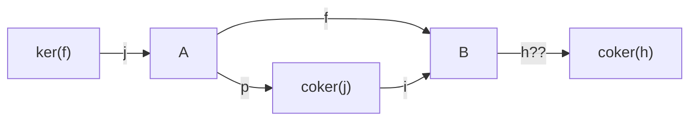

[[book-guidelines|↩ Back to guidelines]]

## Why bother axiomatizing "categories where you can add morphisms"?

Homological algebra runs on a handful of moves you probably absorbed unconsciously while learning linear algebra: you take kernels and cokernels of maps, you build resolutions of an object by projectives or injectives, and — critically — you *add and subtract morphisms*. `f - g` needs to make sense before you can say "the equalizer of $f$ and $g$ is the kernel of $f - g$." None of that machinery exists in a bare category. `Sets`, or `Gr` (groups), gives you kernels and cokernels of a sort, but there is no way to add two group homomorphisms $f, g : G \to H$ and get another homomorphism, unless $H$ is abelian. Richter opens the chapter with exactly this observation: *"If you want to do homological algebra, you need projective and injective resolutions of objects, and for this, you need to be able to form kernels and cokernels of morphisms and you need to be able to add and subtract morphisms."*

So this short chapter (pp. 141–148) builds up, in three tightening stages, exactly the amount of extra structure needed to make "kernel," "cokernel," and "image factorization" behave the way they do in `R`-Mod or `Ab`:

1. **Preadditive** — hom-sets become abelian groups; composition is bilinear.
2. **Additive** — preadditive, *plus* every pair of objects has a biproduct (a single object that is simultaneously product and coproduct).
3. **Abelian** — additive, plus every morphism has a kernel and cokernel, and (crucially) every mono is *itself* a kernel and every epi is *itself* a cokernel.

Each stage buys you strictly more theorems for strictly more axioms, and by the end you get the single result that makes abelian categories the right home for homological algebra: **every morphism factors uniquely as an epimorphism followed by a monomorphism** — the categorical version of "first-isomorphism-theorem" image factorization.

## 7.1 Preadditive categories: what breaks without bilinearity

**Definition (preadditive / "ringoid").** A category $\mathcal{A}$ is *preadditive* if for every pair of objects $A_1, A_2$, the hom-set $\mathcal{A}(A_1, A_2)$ is an abelian group, and composition is bilinear: $(f_1+f_2)\circ g = f_1\circ g + f_2\circ g$ and $f\circ(g_1+g_2) = f\circ g_1 + f\circ g_2$.

The one-object case is illuminating: a preadditive category with a single object is *exactly* a ring — the endomorphisms of that object form an abelian group under $+$, and composition supplies the multiplication. So "preadditive category" is precisely "ring, but with many objects" (hence the term *ringoid*, echoing "groupoid" = group with many objects). This many-objects-generalizing-one-object pattern is one you'll see everywhere in this book (categories generalize monoids, groupoids generalize groups); here it's rings.

**What breaks without bilinearity:** $\mathrm{Gr}$ (groups and homomorphisms) is *not* preadditive, because you cannot pointwise-add two homomorphisms $f, g: G \to H$ and land in $\mathrm{Hom}(G,H)$ unless $H$ is abelian — the sum of two homomorphisms into a nonabelian group need not itself be a homomorphism. $R\text{-Mod}$, by contrast, *is* preadditive, since $R$-linear maps add pointwise and stay $R$-linear.

**Kernels and cokernels, redefined via equalizers/coequalizers.** Recall a *zero object* (Definition 1.5.1, Chapter 1) is one that is both initial and terminal; it gives you *zero morphisms* $0 \in \mathcal{A}(C_1, C_2)$ by composing the unique map $C_1 \to 0$ with the unique map $0 \to C_2$. Given that:

$$\ker(f) := \mathrm{eq}(f, 0), \qquad \mathrm{coker}(f) := \mathrm{coeq}(f, 0)$$

for $f \in \mathcal{A}(C_1, C_2)$. This is worth pausing on: you already know kernels and cokernels are equalizers/coequalizers of $f$ against the zero map from ordinary linear algebra intuition, but stated this way it plugs directly into everything Chapter 3 already proved about [[Limits-and-Colimits|limits and colimits]] — a kernel is automatically a monomorphism (equalizers are always monic) and a cokernel is automatically an epimorphism (dually).

**The key theorem of §7.1 — every equalizer is a kernel, in a preadditive category.** This is where bilinearity earns its keep. The universal property of the equalizer of $f, g: A_1 \to A_2$ says: for every $\alpha: A \to A_1$ with $f\alpha = g\alpha$, there's a unique $\xi$ factoring $\alpha$ through the equalizer. Bilinearity lets you rewrite the condition $f\alpha = g\alpha$ as $(f-g)\alpha = 0$ — and *that's* exactly the defining condition of the equalizer of $(f-g, 0)$, i.e. the kernel of $f - g$. So in a preadditive category, "equalizer" and "kernel" are the same concept in different clothes; you only need one of them as primitive.

**What breaks without preadditivity — monomorphisms need not be kernels.** In general categories, "monomorphism" is a strictly weaker notion than "kernel of something." Richter's example: in $\mathrm{Gr}$, an arbitrary subgroup inclusion $i: H \hookrightarrow G$ is a monomorphism, but it is a *kernel* only when $H$ is a *normal* subgroup (since a kernel of $f: G \to G'$ is always normal). A generic (non-normal) subgroup inclusion is mono but not a kernel of anything. This is the categorical shadow of a familiar group-theory fact — "not every subgroup is a kernel" — restated as "mono $\ne$ kernel outside preadditive categories."

**Preadditive categories automatically have zero objects if they have any extreme object at all.** *Proposition 7.1.10:* in a preadditive category, "has an initial object," "has a terminal object," and "has a zero object" are all equivalent. The proof is a clean bilinearity argument: if $\emptyset$ is initial, the group $\mathcal{A}(\emptyset,\emptyset)$ has a single element, which must be $1_\emptyset$ acting as the group's zero. For any other object $A$, any $f \in \mathcal{A}(A, \emptyset)$ satisfies $f = 1_\emptyset \circ f$; since composition is bilinear (in particular, additive in the first variable), this forces $f$ to be the group-zero of $\mathcal{A}(A,\emptyset)$ — so $\emptyset$ is also terminal. This wouldn't be provable in a bare category: "initial implies terminal" genuinely needs the additive structure of the hom-groups.

## 7.2 Additive categories: biproducts, where product = coproduct

**What breaks without biproducts:** in $\mathrm{Ab}$, you already know $A \times B \cong A \oplus B$ — the direct product *is* the direct sum. That coincidence looks accidental until you see the general statement.

**Proposition 7.1.11 (the biproduct characterization).** For a preadditive category $\mathcal{A}$ and objects $A, B$, TFAE:
1. The coproduct $A \sqcup B$ exists.
2. The product $A \times B$ exists.
3. There is an object $M$ with maps $p_A, p_B, i_A, i_B$ satisfying $p_A i_A = 1_A$, $p_B i_B = 1_B$, $p_A i_B = 0$, $p_B i_A = 0$, and $i_A p_A + i_B p_B = 1_M$.

Condition (3) is the crux, and it's the *only* one that mentions addition — it says the identity on $M$ decomposes as a sum of the two "inject-then-project" idempotents. This is the phenomenon that fails in a non-additive category like $\mathrm{Gr}$: the free product $G * H$ and the direct product $G \times H$ genuinely differ (there is no equation like $i_G p_G + i_H p_H = 1$ to write down, because $\mathrm{Gr}$'s hom-sets aren't abelian groups) — product and coproduct only coincide when there's a group structure on morphisms letting you add the two projection-injection idempotents back to the identity. The proof direction (1)$\Rightarrow$(3) constructs $i_A$ as *the unique map with* $p_A i_A = 1_A$, $p_B i_A = 0$ — using the universal property of the product to *define* an injection out of pure projection data, which only makes sense because you can characterize $i_A$ by an equation instead of a diagram-chase. A bonus fact folded into the same proposition: $i_A$ is automatically the kernel of $p_B$, and $p_A$ is automatically the cokernel of $i_B$ — biproducts silently package kernel/cokernel relationships for free.

**Definition (biproduct).** The object $M$ of Proposition 7.1.11 is the *biproduct* $A \oplus B$.

**Definition (additive category).** A preadditive category is *additive* if it has all binary biproducts.

**Lemma 7.2.2 — four equivalent notions of "additive functor."** For $F: \mathcal{A} \to \mathcal{B}$ between additive categories, TFAE: $F$ is additive (i.e. each $F: \mathcal{A}(A_1,A_2) \to \mathcal{B}(FA_1, FA_2)$ is a group homomorphism); $F$ preserves finite coproducts; $F$ preserves finite products; $F$ preserves binary biproducts. The interesting direction is that preserving biproducts *forces* preservation of the terminal object $0_{\mathcal{A}}$ — because $\mathcal{B}$ being preadditive guarantees at least one morphism into $F(0_{\mathcal{A}})$ from anywhere, which combined with $0_\mathcal{A}$ being terminal collapses the two candidate projections $0_\mathcal{A}\times 0_\mathcal{A}\to 0_\mathcal{A}$ into one. `R`-modules over `R`-linear maps is the running example of an additive category; the free-abelian-group-on-a-category construction $\mathbb{Z}[\mathcal{C}]$ from §7.1 is generally only preadditive, not additive — a useful reminder that the two levels really are different.

## 7.3 Abelian categories: the payoff — epi-mono image factorization

**Definition (abelian category).** A preadditive category $\mathcal{A}$ is *abelian* if:
- $\mathcal{A}$ has a zero object,
- $\mathcal{A}$ has finite biproducts,
- every morphism has a kernel and a cokernel,
- **every monomorphism is a kernel, and every epimorphism is a cokernel.**

That last axiom is the one doing all the interesting work, and it's the one that fails for merely "additive" categories in general. (Richter notes, citing Borceux, that preadditivity itself is technically derivable from the remaining axioms — but stating it up front keeps [[Simplicial-Objects-and-Simplicial-Sets#The definition|the definition]] self-contained and matches the chapter's incremental build-up.)

Free consequence: kernels/cokernels + biproducts already give you *all* finite limits and colimits — an arbitrary equalizer of $f,g$ is $\ker(f-g)$, and dually for coequalizers — so "abelian" silently implies "finitely (co)complete," reusing Chapter 3's completeness criterion (products + equalizers) without needing to check it separately.

**Proposition 7.3.3 — iso $\iff$ epi and mono.** This is the first place the "mono is a kernel / epi is a cokernel" axiom gets used directly. If $f$ is both epi and mono, write $f$ as the kernel of some $g: B \to C$ (using the axiom). Then $g \circ f = 0$; but $f$ is epi and $0 \circ f = 0$, so $g$ must itself be the zero map. And the kernel of a zero map is always an isomorphism (identity included in the equalizer trivially). Notice how load-bearing the axiom is here — in a general category, epi + mono famously does *not* imply iso (the standard counterexample is $\mathbb{Z} \hookrightarrow \mathbb{Q}$ in commutative rings, flagged back in Chapter 1's Key Questions); it's specifically the guarantee that monos arise as kernels that lets you produce the $g$ this proof needs.

**Theorem 7.3.5 — the main event: epi-mono factorization.** Every morphism $f: A \to B$ in an abelian category factors as $f = i \circ p$ with $p$ epi and $i$ mono; moreover $i$ is *the kernel of the cokernel of $f$*, and $p$ is *the cokernel of the kernel of $f$*.

Concretely: this is the categorical "first isomorphism theorem." In $\mathrm{Ab}$, take $p$ to be the surjection $A \twoheadrightarrow \mathrm{im}(f)$ and $i$ the inclusion $\mathrm{im}(f) \hookrightarrow B$; the theorem says this pattern generalizes to *any* abelian category, with "$\mathrm{im}(f)$" defined abstractly as $\mathrm{coker}(\ker f)$ (equivalently $\ker(\mathrm{coker} f)$).

The proof is a genuine diagram chase — worth walking through once, because it's the clearest illustration in the chapter of *why* the mono-is-kernel/epi-is-cokernel axioms are load-bearing rather than decorative:



Set $j: \ker(f) \to A$ and $p: B \to \mathrm{coker}(j)$; since $f \circ j = 0$, $f$ factors as $f = i \circ p$ for a unique $i$. The whole proof is devoted to showing $i$ is mono: by the abelian-category characterization of monomorphism (Exercise 7.3.4 — $f$ is mono iff every $h$ with $f\circ h = 0$ is itself zero), it suffices to take any $h: C \to \mathrm{coker}(j)$ with $i \circ h = 0$ and show $h = 0$. From $i \circ h = 0$, $i$ factors through $\mathrm{coker}(h)$ as $i = \xi \circ \pi$. Then a sequence of "factor through the epi/mono you were just handed" moves — using that $\pi \circ p$, being epi, is *the* cokernel of some map $g$ (again invoking "every epi is a cokernel"), tracing $g$ back through $\ker(f)$, and finally invoking "every mono is a kernel" one more time — forces $\pi$ itself to be mono. Since $\pi$ is *also* (by construction) the cokernel of $h$, and cokernels are epi, $\pi$ being simultaneously mono-and-epi lands you back at Proposition 7.3.3: $\pi$ is an iso, which collapses $h$ to zero. The chain of reasoning literally alternates between the two halves of the abelian-category axiom, three times — that's the sense in which the theorem *needs* both halves, not just one.

**Corollary 7.3.6.** As an immediate consequence: a monomorphism is always the kernel of its own cokernel, and (dually) an epimorphism is always the cokernel of its own kernel. This tidies up the earlier definition — "mono is *a* kernel" strengthens to "mono is *the* kernel of *its own* cokernel," a canonical, not merely existential, statement.

**Proposition 7.3.7 — functor categories into abelian categories are abelian.** If $\mathcal{D}$ is small and $\mathcal{A}$ is abelian, then $\mathrm{Fun}(\mathcal{D}, \mathcal{A})$ is abelian. The proof leans entirely on results already banked earlier in the book: limits/colimits in functor categories are computed pointwise (Proposition 3.3.1), so zero object/biproducts/kernels/cokernels all exist pointwise; and monomorphisms/epimorphisms in functor categories are detected componentwise (Corollary 3.3.2), so "mono is a kernel" and "epi is a cokernel" transfer pointwise too. This one-paragraph proof is the reason the whole chapter exists in this book: it's the load-bearing fact for **[[Functor-Homology|functor homology]]** (Chapter 15) — the entire enterprise of doing homological algebra with functors as the objects (Tor and Ext of functors, Hochschild/cyclic/Gamma homology as special cases) presupposes that a functor category into an abelian target is itself abelian, so that "kernel," "cokernel," "exact sequence," and "projective resolution" all make sense one level up.

## Grounding: what the axioms buy you, computationally

**Preadditive as a trait bound (Rust).** Instead of a `Category` trait with just `compose`, imagine adding a bound that hom-"sets" are abelian groups:

```rust
trait Preadditive: Category {
    // Hom(A, B) must support addition and a zero element.
    fn zero_morphism<A, B>() -> Self::Morphism<A, B>;
    fn add<A, B>(f: Self::Morphism<A, B>, g: Self::Morphism<A, B>) -> Self::Morphism<A, B>;
    // Bilinearity is the *law* this trait must satisfy, not something the
    // type system checks for you:
    //   compose(add(f1, f2), g) == add(compose(f1, g), compose(f2, g))
    //   compose(f, add(g1, g2)) == add(compose(f, g1), compose(f, g2))
}
```

This is exactly the shape of "ring, but many objects": a single-object instance of this trait, where the one object's endomorphisms carry `add` and `compose` (= multiply), *is* a `Ring` trait. The chapter's observation that `Gr` fails to be preadditive is a failure at the *value* level, not the type level — you could write `impl Preadditive for GroupCat`, but the `add` operation you'd define (pointwise multiplication of two homomorphisms) simply isn't well-typed as landing back in `Hom(G, H)` unless `H`'s group law is commutative, so the impl is unsound for nonabelian targets. This is a good illustration of a **law-abiding trait**: the compiler cannot check bilinearity for you, only the shape of the operations — verifying the law itself is exactly the kind of side-condition a refinement-type or contract system (the kind you're building) would need to discharge, since "is `H` abelian" is a semantic precondition on the impl, not something `H: Group` alone guarantees.

**Kernel-as-equalizer, in Lean-flavored terms.** The equivalence "in a preadditive category, every equalizer is a kernel" is worth stating the way you'd state it as a Lean lemma, because the proof pattern — rewrite a proposition about two things being equal into a proposition about one thing being zero — is exactly the kind of definitional-equality-flavored move your elaborator's unifier does constantly:

```
theorem equalizer_eq_kernel {A A₁ A₂ : C} (f g : A₁ ⟶ A₂) :
    is_equalizer f g ↔ is_equalizer f g (isKernelOf := (f - g)) := by
  -- key step: `f ∘ α = g ∘ α`  is *propositionally* the same condition as
  -- `(f - g) ∘ α = 0`, once you unfold what `-` means in a preadditive
  -- category (it's `Hom` being an `AddGroup`), and this rewrite is exactly
  -- what licenses treating the two universal properties as the same up to iso.
  sorry
```

The mathematical content — "$f\alpha = g\alpha \iff (f-g)\alpha = 0$" — is definitionally trivial once you've unfolded `AddGroup` axioms, but it is *not* syntactically the same expression; recognizing the two sides as interchangeable is the same species of work as your elaborator normalizing two terms before checking `isDefEq`. It's a nice, low-stakes preview of "equality up to unfolding a structure's operations" showing up outside type theory proper.

**Image factorization as a design pattern (Python sketch).** The epi-mono factorization theorem is the categorical ancestor of every "canonical form" construction you've written informally — factor a linear map into `(coimage → image)` then `(image ↪ codomain)`. A minimal illustration over matrices (thinking of $\mathrm{Ab}$/vector-space intuition, not full generality):

```python
def epi_mono_factor(f_matrix):
    # f : A -> B.  p : A -> im(f) is epi (surjective onto the row space),
    # i : im(f) -> B is mono (inclusion of that subspace).
    # This is literally coker(ker f) -> B factoring through im(f).
    image_basis = row_reduce_basis(f_matrix)   # p's target, up to iso
    p = project_onto(f_matrix, image_basis)    # epimorphism
    i = include_into(image_basis, f_matrix.codomain)  # monomorphism
    assert compose(i, p) == f_matrix
    return p, i
```

This isn't load-bearing for your compiler project, but it's the cleanest possible restatement of Theorem 7.3.5's content in a form you already have intuition for: "surjective part, then injective part," now justified as a *theorem* rather than an ad hoc linear-algebra fact, and now known to hold in *any* abelian category — including, per Proposition 7.3.7, categories of functors, which is precisely what Chapter 15's functor homology needs.

## Where this leads

Abelian categories are the axiomatic floor under everything homological the rest of the book does. Proposition 7.3.7 — that $\mathrm{Fun}(\mathcal{D}, \mathcal{A})$ is abelian whenever $\mathcal{A}$ is — is the single fact Chapter 15 (Functor Homology) needs to even *state* its central definitions: $\mathrm{Tor}^{\mathcal{D}}_*(F,G)$ and $\mathrm{Ext}^{\mathcal{D}}_*(F,G)$ presuppose an abelian target so that "projective resolution," "exact sequence," and "derived functor" all typecheck. Chapter 10's Dold–Kan correspondence (simplicial objects in an abelian category $\leftrightarrow$ chain complexes) also depends on it directly. And the epi-mono factorization of Theorem 7.3.5 is quietly used every time the book later needs to talk about the "image" of a natural transformation between functors landing in an abelian category.

For your own project: this chapter is a clean case study in **axiomatizing exactly enough structure to make a familiar decomposition theorem (first isomorphism theorem) hold in general**, and in *how much work a single axiom does* — the diagram chase in Theorem 7.3.5 shows a proof that structurally alternates between two halves of one axiom, which is a good model for how you'll eventually want to think about *soundness proofs that lean on a specific, minimal set of typing/kernel axioms* rather than an unstructured pile of assumptions. It's a less direct connection to `type-theory`/`automated-reasoning` than chapters on Kan extensions or monads, but the "prove the law holds generically once, reuse everywhere via Proposition 7.3.7" pattern — generic abelian-category theorems transferring for free to functor categories — is the same shape of leverage a trusted kernel gets from proving its core inference rules sound once and reusing them across every derived tactic.
