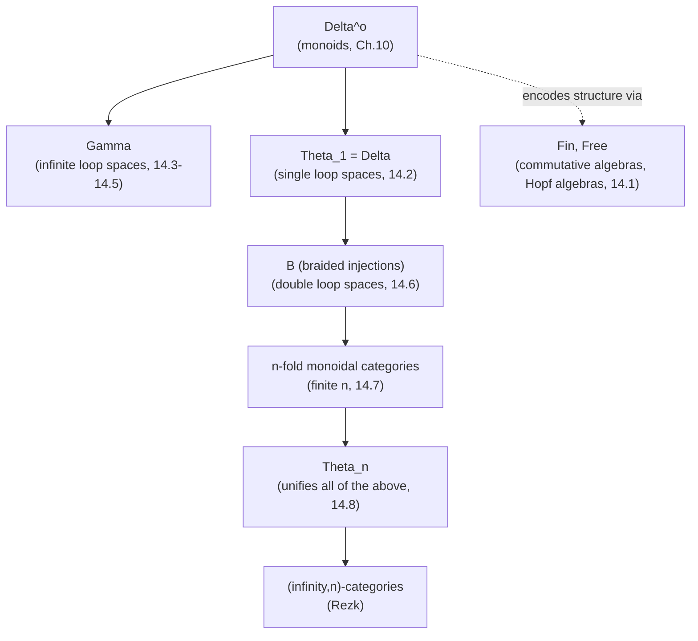

[[book-guidelines|↩ Back to guidelines]]

# Diagram Categories and Iterated Loop Spaces

## Why you need a "diagram category" at all

Chapter 12 built one gadget — the operad — for recognizing when a space is (weakly equivalent to) an $n$-fold loop space $\Omega^n Y$, and Chapter 13 used the classifying space $BC$ of a symmetric monoidal category as raw material for that recognition machine when $n=\infty$. This chapter asks a sharper question: instead of building one bespoke gadget (an operad, with its arities and its coherence axioms) every time you want to detect a new kind of algebraic structure or a new kind of loop space, can you find a single ambient category $\mathcal{D}$ such that "a functor $\mathcal{D} \to \mathcal{C}$" *is* — not merely encodes, but literally *is* — the structure you're after?

**What breaks without this reframing:** if you only had operads in your toolkit, you'd need a new operad (with its own arity-by-arity data and axioms to verify) for every flavor of structure — monoids, commutative algebras, Hopf algebras, iterated loop spaces of every fixed height $n$ — and proving two presentations agree would mean comparing two independently-axiomatized gadgets by hand. The diagram-category viewpoint replaces "verify these axioms" with "check this is a functor," and replaces "compare two gadgets" with "compare two diagram categories," which is often a much shallower, more mechanical question (an isomorphism or equivalence of categories, as in $I \wr I \cong \Delta_2^o$ later in this chapter).

This is precisely the "functor as an interpreter of a signature" idea from Chapter 12, pushed one level up: instead of an operad $O$ whose algebras are objects with $O$-shaped operations, you have a fixed indexing category $\mathcal{D}$ whose *functors out of it* are automatically the structure. A signature becomes a category; obeying the signature's laws becomes functoriality.

## §14.1 — Diagram categories determine algebraic structure

### The founding example: monoids are functors out of $\Delta^o$

Recall the simplicial category $\Delta$ from Chapter 10: objects $[n] = \{0,\dots,n\}$, morphisms order-preserving maps, generated by face maps $\delta^i$ and degeneracy maps $\sigma^j$ subject to the simplicial identities — in particular $\delta^1\delta^2 = \delta^1\delta^1 : [1] \to [3]$ in $\Delta$ (dualize for $\Delta^o$: $d_1 d_2 = d_1 d_1 : [3] \to [1]$).

**Proposition 14.1.3 (Richter, p. 317).** A set $M$ is a monoid if and only if the assignment $[n] \mapsto M^n$ extends to a functor $\Delta^o \to \mathrm{Sets}$.

The "only if" direction is the interesting one, and it's worth sitting with the mechanism: given a monoid $(M,\cdot,1)$, define
$$
d_i(m_1,\dots,m_n) = \begin{cases} (m_2,\dots,m_n), & i = 0,\\ (m_1,\dots,m_i\cdot m_{i+1},\dots,m_n), & 1 \le i \le n-1,\\ (m_1,\dots,m_{n-1}), & i = n,\end{cases}
$$
and let the degeneracy $s_i$ insert $1$ in slot $i+1$. Checking that this respects the simplicial identity $d_1 d_2 = d_1 d_1$ (as maps $M^3 \to M^1$) is *exactly* checking associativity: both composites multiply the same two adjacent factors, and the identity forces $(m_1 m_2) m_3$ and $m_1(m_2 m_3)$ to land in the same place. **This is the nerve construction of the monoid's one-object category $C_M$ (Definition 11.1.1) staring back at you** — the simplicial identities of $\Delta^o$ don't just resemble the associativity/unit laws, they *are* those laws, packaged as functoriality.

**What breaks without functoriality here:** if you only demanded that $[n]\mapsto M^n$ be *some* assignment of sets — not necessarily respecting composition of the $d_i,s_j$ — you could write down face maps satisfying the boundary conditions individually while silently violating associativity on some triple. Functoriality is precisely the global consistency check that no finite list of "local" axioms could substitute for as cleanly.

### The desymmetrized k-linear analog: commutative algebras are functors out of $\mathrm{Fin}$

**Proposition 14.1.4 (p. 318).** For a commutative ring $k$ and a $k$-module $A$: $A$ is a commutative $k$-algebra iff $\underline{n} \mapsto A^{\otimes_k n}$ extends to a functor $L_k(A): \mathrm{Fin} \to k\text{-mod}$.

Here $\mathrm{Fin}$ is the category of *all* finite sets and functions between them — crucially, $\mathrm{Fin}(n,n)$ contains the full symmetric group $\Sigma_n$, not just the identity. That extra symmetry is what forces *commutativity*: the multiplication $\mu = L_k(A)(v)$, for $v: \underline{2}\to\underline{1}$ the unique map, must agree with $\mu$ precomposed with the swap $\tau \in \mathrm{Fin}(2,2)$ (since $v \circ \tau = v$ as maps in $\mathrm{Fin}$), which is exactly $\mu(a,b)=\mu(b,a)$. Unit and associativity come from $0$ being initial in $\mathrm{Fin}$ and from an identity of composites $v\circ(v\oplus\mathrm{id}) = v\circ(\mathrm{id}\oplus v)$ in $\mathrm{Fin}$.

The book flags the general recipe explicitly (§14.1's opening remark): **if you desymmetrize a diagram category, you lose the automatic commutativity it was encoding.** The category of operators $\Gamma(O)$ attached to an operad $O$ (Definition 14.1.1) makes this parametric: $\Gamma(\mathrm{Com}) \cong \mathrm{Fin}$ recovers the fully symmetric (commutative) case, while $\Gamma(\mathrm{As})$ recovers the desymmetrized category of finite pointed *associative* sets $(\mathrm{as})$ — objects are finite pointed sets, but morphisms additionally carry a total ordering on each fiber, which is precisely enough bookkeeping to talk about a non-commutative multiplication without a symmetric-group action doing the work.

### The surprising one: commutative Hopf algebras are functors out of free groups

**Proposition 14.1.6 (p. 319).** Let $\mathrm{Free}$ be the category with objects $\underline{n}$ and morphisms group homomorphisms between free groups on $n$ and $m$ generators. Then a $k$-module $H$ is a commutative Hopf algebra over $k$ iff $\underline{n} \mapsto H^{\otimes n}$ extends to a functor $L_k(H): \mathrm{Free} \to k\text{-mod}$.

This is the sharpest illustration of the whole section's thesis. A Hopf algebra needs *five* pieces of structure — multiplication, unit, comultiplication, counit, antipode — plus compatibility between all of them (the multiplication and comultiplication interact via a hexagon-shaped commuting diagram, reproduced on p. 319). Every single piece drops out of a *single* functoriality requirement:

| Hopf-algebra structure | comes from $L_k(H)$ applied to... |
|---|---|
| unit $\eta: k \to H$ | the zero map $0 \to 1$ in $\mathrm{Free}$ ($0$ is a zero object there) |
| counit $\varepsilon: H \to k$ | the zero map $1 \to 0$ |
| multiplication $\mu$ | $v: \underline{2}\to\underline{1}$, $x_1,x_2 \mapsto x_1$ (this is *not* injective as a group hom in general, but it's the free-group map with that effect) |
| comultiplication $\Delta$ | $\psi: \langle x_1\rangle \to \langle x_1,x_2\rangle$, $x_1 \mapsto x_1x_2$ (note: comultiplication is a map $H \to H\otimes H$, and $\psi$ goes $\underline{1}\to\underline{2}$, i.e. *contravariantly* against $\mathrm{Free}$'s arrow, matching $L_k$'s covariance since $L_k(\psi): H \to H\otimes H$) |
| antipode $S$ | $L_k(i)$ for $i: x_1 \mapsto x_1^{-1}$ |

and coassociativity of $\Delta$ literally *is* the identity $(x_1x_2)x_3 = x_1(x_2x_3)$ in the free group on three generators — associativity of the free group's own multiplication reappears, one categorical level up, as coassociativity of the Hopf algebra it classifies. Non-cocommutativity is likewise forced: the free group on $\ge 2$ generators is non-abelian, so $\Delta$ cannot be cocommutative in general, even though $H$ itself, as an algebra, is commutative (that came from $\mathrm{Free}$, not $\mathrm{Fin}$, having the relevant symmetry only at the *algebra* level, via $v$'s fiber structure, not at the coalgebra level).

### First-principles grounding: a diagram category as a signature-with-laws-for-free

If you've written a compiler, the pattern in §14.1 is one you've essentially implemented before, just not in this vocabulary: a **diagram category is a category whose morphism structure is rich enough that "obeying it" already forces the axioms you wanted to state by hand.** Compare this to how a `trait` with default-method laws only *documents* laws (`Add` doesn't statically enforce associativity), whereas here the laws are *derivable consequences* of functoriality — because $\mathrm{Free}$'s Hom-sets already secretly contain a copy of the equations you care about (e.g. $(x_1x_2)x_3 = x_1(x_2x_3)$ is baked into what a "group homomorphism between free groups" even *is*).

```rust
// A functor Fin -> k-Mod, restricted to what you need to check
// Proposition 14.1.4: giving this data + functoriality IS giving
// a commutative k-algebra structure on A. No separate associativity
// or commutativity proof obligation -- it falls out of composing
// morphisms of Fin correctly.
trait FinDiagram<R> {
    // the object assigned to the finite set {1,...,n}
    fn at(&self, n: usize) -> TensorPower<R>; // A^{\otimes n}
    // the morphism assigned to f: {1,...,n} -> {1,...,m} in Fin
    fn apply(&self, f: &FiniteMap, x: &TensorPower<R>) -> TensorPower<R>;
    // functoriality laws (checked once, generically, not per-construction):
    //   apply(id_n, x) == x
    //   apply(g compose f, x) == apply(g, apply(f, x))
}
```
Once `FinDiagram` is implemented and *verified functorial* (ideally in Lean, where functoriality is a theorem you actually discharge rather than an informal comment), commutativity, associativity, and the unit law of the resulting algebra are corollaries — you never separately state or prove them. This is the same "push the proof burden into the interface, not the implementation" move that shows up in a well-designed intermediate representation: get the indexing category right, and the algebraic laws become *structural*, checkable once and for all by the functor-law verifier rather than case-by-case at every use site.

## §14.2 — Reduced simplicial spaces and loop spaces

A simplicial (topological) space $X_\bullet$ is **reduced** if $X_0$ is a point (Definition 14.2.1) — there's only one "object," so all the interesting data lives in $X_1$ (the "morphisms") and higher $X_n$. It's a **Segal space** if the Segal map
$$
(i_1,\dots,i_n): X_n \to \underbrace{X_1 \times_{X_0} \cdots \times_{X_0} X_1}_{n}
$$
is a weak equivalence for all $n \ge 2$ (Definition 14.2.2) — informally, "an $n$-simplex is (up to homotopy) the same data as $n$ composable 1-simplices," the up-to-homotopy analogue of the strict nerve condition from Chapter 11 (a genuine nerve satisfies this *on the nose*, as a pullback, not just up to weak equivalence).

For a reduced Segal space, $\pi_0(X_1)$ is automatically a monoid (composition of 1-simplices, up to homotopy, is associative because higher simplices witness it). Segal's recognition theorem sharpens this to an actual identification of loop spaces:

**Theorem 14.2.3 [Se74].** A reduced Segal space $X$ has $X_1 \simeq \Omega|X|$ iff $X_1$ has homotopy inverses and $X$ is *good* (fat realization $\simeq$ geometric realization, cf. §10.9).

This is the $n=1$ case of the entire chapter's project, and it's worth naming precisely what's being traded: a strict category (Chapter 11, where $N\mathcal{C}$ is a genuine limit and $B\mathcal{C}=|N\mathcal{C}|$) gives you $\pi_1(B\mathcal{C})$-type invariants but not, in general, a based loop space *up to homotopy equivalence* unless $\mathcal{C}$ is a groupoid. Relaxing "the Segal map is an isomorphism" to "the Segal map is a weak equivalence" is precisely what buys you the loop-space identification for a much larger class of examples — you no longer need genuine invertibility, only invertibility up to homotopy, which is realized by upgrading "monoid" to "monoid object with homotopy inverses in a homotopy-coherent world."

## §14.3 — Gamma-spaces

This section builds the machine for **detecting infinite loop spaces**, and it does so by choosing a genuinely different diagram category, $\Gamma$: objects are finite pointed sets $[n]=\{0,\dots,n\}$ (basepoint $0$), morphisms are basepoint-preserving functions. There's a canonical functor $\Delta^o \to \Gamma$ (Definition 14.3.1's simplicial circle $C$), so $\Gamma$ sits strictly "above" $\Delta^o$ in expressive power.

**Definition 14.3.3.** A **$\Gamma$-space** is a functor $Y: \Gamma \to s\mathrm{Sets}_*$ with $Y[0] = *$.

Three structural facts make $\Gamma$-spaces the right home for spectra:

1. **Every $\Gamma$-space produces a spectrum.** The evaluation of $Y$ on a finite pointed simplicial set (Definition 14.3.6) plus the *assembly map* $\sigma_{X_1,X_2}: X_1 \wedge Y(X_2) \to Y(X_1\wedge X_2)$ let you feed in the simplicial spheres $S^n$ and get structure maps $S^1 \wedge Y(S^n) \to Y(S^{n+1})$ — exactly a prespectrum. Its homotopy groups are $\pi_n(Y) = \mathrm{colim}_i \pi_{n+i}Y(S^i)$ (Definition 14.3.7), a **filtered colimit** (the categorical device from Chapter 3 that lets you take a limiting process seriously as an honest colimit, not merely a limiting heuristic).
2. **Two named examples already recognizable from Chapter 10.** $S: \Gamma \to s\mathrm{Sets}_*$ (turning each finite pointed set into a constant simplicial set) gives the *sphere spectrum* — homotopy groups are the stable homotopy groups of spheres. For an abelian group $A$, $HA[n]=A^n$ gives the *Eilenberg–Mac Lane spectrum* $HA$. Remark 14.3.9 notes explicitly: this is *the same* sphere/Eilenberg-Mac Lane spectrum you built from symmetric spectra in §10.15 — different diagram category, same object, recovered as a corollary rather than by separate construction.
3. **Segal's recognition criterion, mirroring §14.2 exactly.** $Y$ is **special** if the projection maps induce weak equivalences $Y[n] \xrightarrow{\sim} Y[1]^n$ (Definition 14.3.12(1)) — the $\Gamma$-space analogue of the Segal condition. $Y$ is **very special** if, in addition, $\pi_0 Y[1]$ is a *group*, not merely a monoid (14.3.12(2)).

**Theorem 14.3.13 [Se74].** If $Y$ is a very special $\Gamma$-space, then $Y[1]$ is an infinite loop space.

Notice the structural symmetry with §14.2's Theorem 14.2.3: "reduced Segal space + homotopy inverses" $\to$ single loop space; "$\Gamma$-space + special + group completion at $\pi_0$" $\to$ infinite loop space. The *group-completion condition* is doing exactly the work that "homotopy inverses" did one section earlier, now applied to $\pi_0$ rather than to the space itself — a preview of the theme that runs through the rest of the chapter: **each flavor of loop space (single, double, $n$-fold, infinite) corresponds to a diagram category plus a group-completion-flavored extra condition.**

$\Gamma$-spaces also inherit a symmetric monoidal (smash) structure via **Day convolution** (§9.8): $(Y_1 \wedge Y_2)[n] = \mathrm{colim}_{f\in\Gamma([m]\wedge[\ell],[n])} Y_1[m]\wedge Y_2[\ell]$ (Definition 14.3.14). This is the same universal-property machine from Chapter 9 reappearing verbatim, not a bespoke smash product invented for this context — one more instance of "diagram category + a single categorical construction (Day convolution) replaces an ad hoc definition."

## §14.4 — Segal K-theory of a permutative category

Segal's $\Gamma$-space machine can be applied *systematically* to any permutative category $(C,\oplus,0,\tau)$ (Chapter 8's strict symmetric [[Monoidal-Categories|monoidal categories]]), producing a $\Gamma$-space $K^S(C) = NC(-): \Gamma \to s\mathrm{Sets}$ (Definition 14.4.3). The construction is genuinely clever: $C(X)$ for a finite pointed set $X$ has objects that remember *every possible way* of splitting a "total object" into a sum indexed by subsets $S\subset X\setminus\{*\}$, together with compatible isomorphisms $\gamma_{S,T}: C_S \oplus C_T \xrightarrow{\cong} C_{S\cup T}$ — literally the data needed to make "additivity of splitting" functorial in the finite pointed set indexing the pieces, exactly analogous to how Proposition 14.1.4 needed the fiber structure of $\mathrm{Fin}$-morphisms to encode multiplication.

This one construction specializes to essentially all the algebraic K-theory examples the book has been building toward:

- $C = P(R)$ (f.g. projective $R$-modules) $\Rightarrow K^S(P(R))$ gives the K-theory spectrum $K(R)$.
- $C = \Sigma$ (finite sets and bijections) $\Rightarrow$ the sphere spectrum again — a *third* independent construction of it, alongside $\Gamma$-space $S$ and symmetric-spectrum $\mathbb{S}$.
- $C = V_\mathbb{C}$ / $V_\mathbb{R}$ (complex/real vector spaces) $\Rightarrow$ connective $ku$ / $ko$.
- $C$ = discrete category on an abelian group $A$ $\Rightarrow$ the Eilenberg–Mac Lane spectrum $HA$.

The recurring pattern — "the sphere spectrum arises independently from three unrelated-looking diagram-category constructions" — is itself evidence for the chapter's central thesis: these aren't three different objects that happen to agree, they're one object visible through three different indexing lenses.

## §14.5 — Injections and infinite loop spaces

A fourth diagram category, $I$ (finite sets and *order-preserving injections*), lets you build $E_\infty$-structures directly on homotopy colimits rather than on classifying spaces. Given a **commutative $I$-space monoid** $X: I \to s\mathrm{Sets}$ with multiplication $\mu$, Schlichtkrull's result (**Proposition 14.5.1**) equips $\mathrm{hocolim}_I X$ with an honest action of the Barratt–Eccles operad $(NE_m)_{m\ge0}$ — the same operad from §12.3 — via an explicit functor $F_m: E_m \times (X\wr I)^m \to X\wr I$ built from permuting blocks according to $\sigma(n_1,\dots,n_m)$.

The payoff is concrete and recognizable: $n\mapsto BO(n)$, $n\mapsto BU(n)$, $n\mapsto BGL_n(R)$ are commutative $I$-space monoids, and their $\mathrm{hocolim}_I$'s recover exactly $BO$, $BU$, $BGL(R)^+$ — the classifying spaces (or plus-constructions) that are the actual inputs to real, complex, and algebraic K-theory. So the Barratt–Eccles action produced abstractly here is what certifies these familiar spaces really do carry $E_\infty$-structure (hence, ultimately, infinite-loop-space structure), rather than that fact being taken on faith.

## §14.6 — Braided injections and double loop spaces

Single loop spaces come from monoidal categories (associativity only); infinite loop spaces come from symmetric monoidal categories (full commutativity). What sits *between* these — encoding structure with commutativity witnessed by a *specific, non-involutive* braiding rather than full symmetry — should, by the Eckmann–Hilton philosophy from §8.1/§14.7 below, detect exactly **double** loop spaces.

Schlichtkrull–Solberg's construction (§ScSo16, summarized here) desymmetrizes the injections category $I$ from §14.5 differently than $\mathrm{Free}$/$(\mathrm{as})$ did: replace the symmetric-group automorphisms with **braid-group** automorphisms.

**Definition 14.6.1.** $\mathcal{MI}$ = order-preserving injections on finite sets $\underline{n}$. $\mathrm{Br}_n$ = the braid group on $n$ strands (Chapter 8's braided monoidal categories). The category $\mathcal{B}$ of **braided injections** has the same objects as $\mathcal{MI}$; morphisms $\underline{n}\to\underline{m}$ are composites $f = i\circ\sigma$ with $\sigma\in\mathrm{Br}_n$, $i\in\mathcal{MI}(n,m)$, and composition uses a "comb-and-concatenate" rewriting rule ($g\circ f = (j\circ\tau_*(i))\circ(i^*(\tau)\circ\sigma)$) reminiscent of how you'd normalize a term in a rewriting system with a confluence property — every composite has a *unique* normal form as (injection) $\circ$ (braid), exactly the shape needed to keep the category well-defined.

$\mathcal{B}$ is itself a braided monoidal category (disjoint ordered union as $\oplus$, with braiding $\tilde\chi(n,m)\in\mathrm{Br}_{n+m}$ threading the first $n$ strands in front of the last $m$). Functors $\mathcal{B}\to s\mathrm{Sets}$ ("$\mathcal{B}$-spaces") inherit a Day convolution product that is *braided* rather than symmetric monoidal (**Proposition 14.6.3**) — the braid group's non-involutivity is precisely what prevents the resulting product from being fully commutative, matching the target (double, not infinite, loop spaces).

**The double bar construction.** Given a commutative $\mathcal{B}$-space monoid $A$ (Definition 14.6.4 — a monoid compatible with the braiding $\beta$), the reduced two-sided bar construction $B_\bullet(\mathcal{B}(0,-),A,\mathcal{B}(0,-))$ from Chapter 10's §10.4 machinery produces another $\mathcal{B}$-space monoid $B^\Delta(A)$, so you can iterate it:

**Proposition 14.6.6 [ScSo16].** For $A$ a commutative $\mathcal{B}$-space monoid with flat underlying $\mathcal{B}$-space, $B^\Delta(B^\Delta(A))_{h\mathcal{B}}$ is a **double delooping** of the group completion of $\mathrm{hocolim}_\mathcal{B}A$.

The pattern to notice: bar construction *once* deloops (turns a monoid into a space one loop-level "higher," as it did classically for $BG$ in Chapter 11); doing it *twice*, over a diagram category whose braiding supplies exactly enough non-strict commutativity, deloops twice. This is the concrete mechanism realizing the general slogan "braided monoidal categories deloop twice" (Fiedorowicz [Fi∞]; Berger [Be99] via simplicial operads — cited but not the route taken here).

## §14.7 — Iterated monoidal categories as models for iterated loop spaces

Now the general $n$-fold case, following [BFSV03]. The motivating tension is the **Eckmann–Hilton argument** you met in §8.1: if a set carries two monoid structures $\bullet_1,\bullet_2$ sharing a unit and satisfying the interchange law $(a\bullet_2 b)\bullet_1(c\bullet_2 d) = (a\bullet_1 c)\bullet_2(b\bullet_1 d)$, the two structures collapse into one, and that one structure is commutative — this is exactly why $\pi_n$ of a topological space is abelian for $n\ge 2$ (two independent loop-concatenation directions force commutativity).

So an $n$-fold monoidal category *cannot* simply demand $n$ perfectly compatible monoidal structures — that would trigger Eckmann–Hilton and collapse everything to one commutative structure, over-shooting the target (you want $n$-fold structure, not $\infty$-fold/commutative structure). The fix:

**Definition 14.7.1.** An **$n$-fold monoidal category** is $C$ with $n$ strict monoidal products $\otimes_1,\dots,\otimes_n$ sharing a unit $e$, plus for every $i<j$ a natural transformation
$$
\varphi^{ij}_{A,B,C,D}: (A\otimes_j B)\otimes_i(C\otimes_j D) \to (A\otimes_i C)\otimes_j (B\otimes_i D)
$$
— an interchanger — satisfying unit conditions, two associativity-flavored pentagon-shaped diagrams, and a hexagon for triples $i<j<k$, and crucially: **$\varphi^{ij}$ is not required to be an isomorphism.**

That last clause is the entire trick. If $\varphi^{ij}$ were forced to be invertible, you'd have the strict interchange law and Eckmann–Hilton would fire, collapsing $\otimes_i$ and $\otimes_j$ into one commutative product. Leaving $\varphi^{ij}$ merely a (coherent, non-invertible) natural transformation is precisely "genuine $n$-fold structure without genuine commutativity" — it's the categorical-level analogue of "associative up to non-invertible witness, not up to isomorphism," which is why iterated monoidal categories can model $\Omega^n X$ for finite $n$ without accidentally modeling $\Omega^\infty X$.

**Theorem 14.7.2 [BFSV03].** The group completion of the classifying space of an $n$-fold monoidal category is an $n$-fold based loop space.

## §14.8 — The category $\Theta_n$

The final, most structurally rich construction: Joyal's category $\Theta_n$, built by **iterated wreath product** with $\Delta$.

**Definition 14.8.5–14.8.6.** For a small category $C$, $\Delta\wr C$ (also written $\Delta(C)$) has objects $([m]; C_1,\dots,C_m)$ — an object of $\Delta$ with a "label" object of $C$ attached to each of its $m$ edges — and morphisms combining a $\Delta$-morphism $f$ with $C$-morphisms $g_{ij}: C_i \to D_j$ wherever $f(i-1) < j \le f(i)$ (informally: $C_i$ "can see" $D_j$ if $f$'s arrows don't block the view). Then $\Theta_0 := [0]$ and $\Theta_{n+1} := \Delta(\Theta_n)$, so
$$
\Theta_n = \Delta \wr \cdots \wr \Delta \quad (n \text{ copies}).
$$

**Grounding this in something checkable.** The wreath construction $\Delta \wr C$ is precisely the categorical shape of a **two-level abstract syntax tree**: an object of $\Theta_2$, $([n];[k_1],\dots,[k_n])$, is literally a two-level planar tree — a "spine" of $n$ edges, with a corolla of $k_i$ leaves grafted onto the $i$-th spine edge (the book's own picture on p. 337 draws exactly this). This is worth pausing on because it's the cleanest bridge in the chapter to compiler-shaped thinking: $\Theta_n$-objects are $n$-level ASTs, and the morphisms of $\Theta_n$ are exactly the tree-morphisms a term-rewriting or elaboration pass would need — a map of trees that can merge/split subtrees level-by-level while respecting "visibility."

```python
# Theta_2 object as a two-level tree, in the spirit of p.337's picture.
# ([n]; [k_1], ..., [k_n]): a spine of n edges, k_i leaves grafted at edge i.
class Theta2Object:
    def __init__(self, spine_len: int, leaf_counts: list[int]):
        assert len(leaf_counts) == spine_len
        self.spine_len = spine_len
        self.leaf_counts = leaf_counts   # k_1, ..., k_n

# A Theta_2 morphism carries a Delta-morphism on the spine (f) plus,
# for every spine edge i and target edge j with f(i-1) < j <= f(i),
# a morphism g_ij between the corollas -- "can Ci see Dj."
```

Three further identifications close the loop back to constructions seen earlier:

- **$\Theta_n \cong I^{\wr n}$ (Proposition 14.8.14)**: the $n$-fold iterated wreath product of the *interval category* $I$ (Chapter 10's Joyal intervals) with itself is isomorphic to $\Theta_n^o$. The proof of the $n=2$ case (Example 14.8.13, "$( \Delta\wr\Delta)^o \cong I \wr I$") is a genuinely satisfying diagram chase showing morphisms literally reverse direction when you dualize the wreath construction — worth working through by hand once, since the "reading the picture upside-down" intuition transfers directly to the general induction.
- **$\Theta_n \cong \mathring{D}_n$**, the category of *open finite combinatorial $n$-disks* (Proposition 14.8.18), with an adjunction $(-)^\circ \dashv^{-1} L$ between disks and their interiors, giving a homotopy equivalence $B\Theta_n \simeq B\Theta_n^o$ (Corollary 14.8.19) — a rare case in the book where a category is shown equivalent to its own opposite, up to homotopy of classifying spaces, via genuinely different-looking combinatorial models.
- **Berger's recognition theorem (14.8.20)**: for a reduced, cofibrant–fibrant functor $X:\Theta_n^o\to cg$, the evaluation $U(X)$ (at the "canonical" object $\sigma_{n-1}\circ\cdots\circ\sigma_1[1]$) is weakly equivalent to $\Omega^n|X|_n$ — Berger's realization functor $|-|_n$ produces an actual $n$-fold delooping. Setting $n=1$ recovers Segal's Theorem 14.2.3 exactly (Remark 14.8.21) — the entire chapter's $n=1,2,\infty$ special cases are unified as instances of one $\Theta_n$-indexed statement.

**§14.8.2's algebraic shadow, $E_n$-homology**, ties directly back to Chapter 15: the shuffle product on the bar construction $B(k,A,k)$ of a commutative augmented algebra can itself be encoded as a functor out of $\Theta_2$ (via the morphism $p+q \xrightarrow{\rho} 2 \to 1$ in $\Theta_2$, whose fiber structure is exactly a $(p,q)$-shuffle when the connecting map is bijective) — this is the same "encode the algebraic operation as fiber data on a diagram-category morphism" move from §14.1's $\mathrm{Fin}$/$\mathrm{Free}$ examples, now feeding directly into [LR11]'s functor-homology description of $E_n$-homology (§15.5's Gamma homology is the $n=\infty$ endpoint of that same story).

**§14.8.3** reads $\Theta_n$-objects as presenting strict $n$-categories directly: $([n];[k_1],\dots,[k_n])$ in $\Theta_2$ is a strict 2-category with $k_i$ 1-morphisms between consecutive 0-cells and $(k_i-1)$ 2-morphisms between those. This is the entry point to Rezk's use of $\Theta_n$-spaces as a model for $(\infty,n)$-categories — a model-categorical presentation of higher category theory that generalizes quasi-categories (models for $(\infty,1)$-categories, Chapter 10) to arbitrary $n$.

## Where this leads



This chapter is the payoff of nearly everything earlier in the book: the simplicial category (Ch. 10), nerves and classifying spaces (Ch. 11), operads (Ch. 12), and group completion (Ch. 13) all get reused as raw material for a single unifying idea — pick the right indexing category, and a "kind of loop space" becomes "a functor out of it plus a group-completion-flavored condition." It feeds forward directly into **Chapter 15 ([[Functor-Homology|Functor Homology]])**: the diagram categories built here ($\mathrm{Fin}$, $(\mathrm{as})$, $\Gamma$, $\Theta_2$) are exactly the indexing categories whose $\mathrm{Tor}$/$\mathrm{Ext}$ groups Chapter 15 identifies with Hochschild, cyclic, and Gamma homology — §14.1's $\mathrm{Fin}$/$(\mathrm{as})$ examples and §14.8.2's shuffle-product $\Theta_2$-functor are not incidental, they are literally the functors Chapter 15 takes Tor of.

**On the standing project (`type-theory` focus area).** The clean, transferable idea in this chapter is not the homotopy theory itself (which doesn't bear directly on a dependent-type compiler) but the **methodology of §14.1 and §14.8**: a signature-with-laws can often be replaced by "functor out of a category built so the laws are unavoidable." That is the same design principle you'd want when choosing the indexing structure for an intrinsically-typed term representation or a well-scoped-syntax library — pick a category (e.g., the category of *renamings/substitutions* on contexts, the type-theorist's analogue of $\Delta$ or $I$) rich enough that "presheaf on it" automatically enforces functoriality laws (naturality under substitution) that you would otherwise have to state and prove by hand for every operation. The wreath-construction pattern of $\Theta_n$ (§14.8) — building an $n$-level indexing category by iterating a single one-level construction — is likewise the same shape as building an $n$-level context/telescope representation by iterating a one-level "context extension" functor. Neither of these connections is about unification or elaboration specifically; they are about the more basic discipline, shared across both projects, of finding the diagram category whose functor-laws *are* the invariants you need, rather than invariants you must separately verify.
