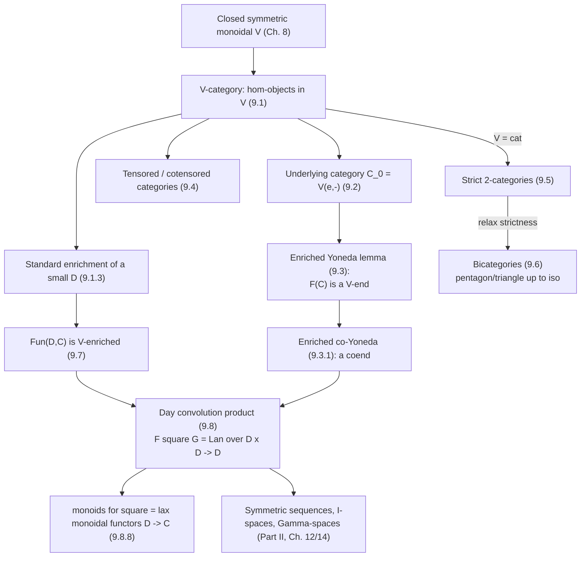

[[book-guidelines|↩ Back to guidelines]]

## Why generalize hom-*sets* at all?

Every category so far in the book has been secretly making a choice you probably stopped noticing: for any two objects $C_1, C_2$, the morphisms between them form a **set**, $\mathcal C(C_1,C_2)$, with composition an ordinary function $\mathcal C(C_1,C_2)\times \mathcal C(C_2,C_3)\to \mathcal C(C_1,C_3)$. But you already know examples where "the collection of morphisms" carries more structure than a bare set. If $A,B$ are abelian groups, $\mathrm{Ab}(A,B)$ is itself an abelian group, and composition is bilinear — that's exactly Chapter 7's preadditive categories. If $C_\bullet, C'_\bullet$ are chain complexes, the maps between them aren't just a set either: there's a whole chain complex $\mathrm{HOM}(C_\bullet, C'_\bullet)$ of "morphisms, homotopies between morphisms, homotopies between homotopies, …", and actual chain maps are recovered as the degree-zero cycles of that complex.

**What breaks if you insist on staying at the level of sets:** you lose the extra structure before you ever get to use it. If all you record is the *set* of chain maps $C_\bullet\to C'_\bullet$, you've thrown away the fact that this set sits inside a chain complex that also remembers homotopies — precisely the data that later chapters need (the bar construction, model structures, [[Functor-Homology|functor homology]] all lean on "the morphisms know about more than composition"). Enriched category theory is the fix: replace "hom-set" by "hom-**object**, living in some auxiliary category $V$," and re-derive every basic categorical notion — functor, natural transformation, Yoneda, (co)limits-adjacent tensoring — relative to that choice of $V$. This is also, structurally, the last piece of scaffolding the book needs before Part II: simplicial objects, operads, and the classifying-space machinery are all going to be *enriched* functor categories in disguise, glued together with the **Day convolution product** that closes this chapter.

## 9.1 The definition: replacing hom-sets with hom-objects

**Definition 9.1.1 ($V$-category).** Fix a closed symmetric monoidal category $(V,\otimes,e)$ (Chapter 8's closed structure is not optional — you need an internal hom to even state Yoneda later, and you need $\otimes$ to state composition). A category $\mathcal C$ **enriched in $V$** (a $V$-category) consists of:

- a class of objects,
- for every pair of objects $C_1,C_2$, an object $\mathcal C(C_1,C_2)\in V$ (not a set — an object of $V$),
- a composition morphism *in $V$*, $m:\mathcal C(C_1,C_2)\otimes\mathcal C(C_2,C_3)\to\mathcal C(C_1,C_3)$,
- a unit morphism *in $V$*, $\eta_C : e\to\mathcal C(C,C)$,

subject to the associativity and unit squares built from $\otimes$'s associator $\alpha$ and unitors $\lambda,\rho$ — literally the monoid-object axioms from Chapter 8, except now there's one "monoid multiplication" $m$ for every triple of objects rather than a single global one. Every notational habit from ordinary category theory needs a small adjustment: you can no longer write "$f\in\mathcal C(C_1,C_2)$" and mean an element, because $\mathcal C(C_1,C_2)$ might not have elements in any naive sense — it's an *object*, and "morphisms $C_1\to C_2$" only make sense after you've picked a way to extract them (Section 9.2 does exactly this).

**The examples that anchor everything downstream:**

| $V$ | What a $V$-category is |
|---|---|
| $\mathrm{Sets}$ | an ordinary (locally small) category |
| $\mathrm{Ab}$ | a preadditive category (Chapter 7) — composition is $\mathbb Z$-bilinear |
| $V$ itself | every closed symmetric monoidal category is enriched in itself, $\mathcal C(C_1,C_2) := C_2^{C_1}$ (the internal hom) |
| $k\text{-mod}$ | a $k$-linear category |
| $k\text{-Top}$ | Example 9.1.2's category $V_{\mathbb C}$: objects $\mathbb N_0$, hom-object $V_{\mathbb C}(n,m) = \varnothing$ if $n\ne m$ and the unitary group $U(n)$ if $n=m$, with composition = matrix multiplication |

**Definition 9.1.3 (standard enrichment).** Given a small (ordinary) category $D$ and a *cocomplete* closed symmetric monoidal $V$, you can always manufacture a $V$-enrichment of $D$ mechanically:
$$
D(D_1,D_2) := \coprod_{D(D_1,D_2)}e.
$$
Read this literally: take the *set* of morphisms $D_1\to D_2$ and replace it by a coproduct of that many copies of the monoidal unit $e$ in $V$ (cocompleteness is what guarantees this coproduct exists; closedness is what guarantees the coproduct distributes over $\otimes$, which you need for the composition map to typecheck). Specializing $V=\mathrm{Ab}$ recovers $\mathbb Z[D]$, the free preadditive category on $D$ you already saw in Chapter 7; specializing $V = k\text{-mod}$ gives $k\{D(D_1,D_2)\}$. This construction is the hinge the whole chapter turns on: it's how an *ordinary* diagram category $D$ gets promoted to something you can take enriched functor categories out of (Section 9.7 onward).

**Grounding (Rust).** Think of $\mathcal C(C_1,C_2)$ as a type, not a value — an ordinary category is "the type of morphisms between $A$ and $B$ is `Vec<Morphism>`'s underlying *set*," whereas a $V$-enriched category says "the type of morphisms is itself an object of some richer universe with its own internal structure." A close (if imperfect) Rust analogy: an ordinary category's `Hom(A, B)` is a plain `enum`/set of terms, while a *chain-complex-enriched* category's `Hom(A, B)` is a whole `struct` carrying a differential — you don't just get "is there a map," you get "is there a map, and a homotopy between any two such maps, and a homotopy between homotopies," graded by a degree, exactly mirroring how a Rust trait's associated type can itself carry structure (`type Hom<A,B>: ChainComplex`) rather than being a bare marker type.

**Grounding (Lean).** The self-enrichment example ($V$ enriched in itself) is the cleanest bridge to type theory: take $V = \mathrm{Type}$ (or Lean's universe of `Type u`) with $\times$ as $\otimes$ and the ordinary function-type former as internal hom. Then a "$\mathrm{Type}$-enriched category" has hom-*objects* $\mathcal C(C_1,C_2) : \mathrm{Type}$, composition a genuine function `comp : Hom C2 C3 → Hom C1 C2 → Hom C1 C3`, and identities a term `id : Hom C C`, exactly Lean's `CategoryTheory.Category` structure in Mathlib — which is precisely defined as a `Type`-enriched category, not a `Prop`-enriched (set-truncated) one. The distinction between $V=\mathrm{Prop}$-enrichment (a category degenerates to a preorder, since $\mathrm{Prop}(C_1,C_2)$ has at most one inhabitant) and $V=\mathrm{Type}$-enrichment (a genuine category, since hom-types can have many, differently-behaved inhabitants) is the categorical shadow of proof-irrelevance versus data-carrying types — a distinction your elaborator already has to make when deciding whether a hypothesis is squashed.

## 9.2 The underlying category: how to get elements back

**What breaks without this:** once hom-objects are allowed to be, say, chain complexes or unitary groups, the phrase "$f$ is a morphism $C_1\to C_2$" stops meaning "$f\in\mathcal C(C_1,C_2)$" in the naive sense — you need a *uniform* recipe, valid for every $V$, that recovers an honest set of morphisms so you can talk about "the underlying ordinary category" and compose actual elements again.

**Definition 9.2.1.** For a $V$-category $\mathcal C$, its **underlying category** $\mathcal C_0$ has the same objects, and
$$
\mathcal C_0(C_1,C_2) := V(e,\mathcal C(C_1,C_2)).
$$
This is the right move because $V(e,-)$ is exactly "the global sections functor" / "the functor that turns an object of $V$ into a genuine set" — an element of $\mathcal C_0(C_1,C_2)$ is a morphism $e\to \mathcal C(C_1,C_2)$ in $V$, i.e., a "generalized point" of the hom-object. Composition and identities on $\mathcal C_0$ are inherited from $m$ and $\eta$ via the unit isomorphism $e\otimes e\cong e$ (Theorem 9.2.2 is the routine but genuinely necessary check that this satisfies associativity/unit — the associativity check is a hexagon built from $\alpha,\lambda$ and the enriched composition axioms, worth doing once by hand to convince yourself nothing is circular).

Two structural payoffs follow immediately:

- **Corollary 9.2.4 / Remark 9.2.5:** an underlying morphism $f\in\mathcal C_0(C_1,C_2)$ still acts functorially on hom-objects on either side — $f_* : \mathcal C(C,C_1)\to\mathcal C(C,C_2)$ and $f^*:\mathcal C(C_2,C)\to\mathcal C(C_1,C)$ — obtained by tensoring $f$ against the identity and composing with $m$. This is exactly the enriched analogue of "post/precomposition by $f$" and it's what makes the enriched Yoneda embedding (Section 9.3) sensible.
- **Proposition 9.2.6:** if you self-enrich $V$ and then take the *underlying category of that self-enrichment*, you get back $V$ itself, up to isomorphism — via the chain of natural isomorphisms
$$
V(e,V(V_1,V_2)) \cong V(e\otimes V_1, V_2) \cong V(V_1,V_2).
$$
This is a sanity check that the whole framework is consistent: enriching doesn't secretly change what $V$'s own morphisms are, it just gives you a uniform lens (valid for *any* $V$-category, not just $V$ itself) for recovering them.

**Grounding (Lean).** $V(e,-)$ is *definitionally* the "extract a term from a type" move you use every time you write `example : Hom A B := f`. In particular, when $V=\mathrm{Type}$ and $e = \mathrm{Unit}$, $V(e,X)\cong X$ via `fun f => f ()`/`fun x _ => x` — Proposition 9.2.6's isomorphism is exactly this currying trick, spelled out coherently. This matters for your elaborator work because it's the same pattern used whenever you need to convert between "a proof of $P$" (a term of type $P$) and "a global point $\mathrm{Unit}\to P$" — a triviality in $\mathrm{Type}$, but the *general* categorical shape of that triviality is Definition 9.2.1, and it stops being trivial once $V$ is, say, a category of chain complexes or sheaves, where "extract the underlying set of morphisms" is genuinely doing work.

## 9.3 The enriched Yoneda lemma — recovering an object from enriched incoming maps

Chapter 2's Yoneda lemma said: to know $F(C)$, it suffices to know all natural transformations out of the representable functor $\mathcal C(C,-)$. The enriched version says the same thing, but now "the set of natural transformations" has to be replaced by an *object of $V$* — an end computed inside $V$ rather than a hom-set computed inside $\mathrm{Sets}$.

**Step 1 — the set-level enriched Yoneda lemma (Proposition 9.3.1).** For $C\in\mathcal C$ and a $V$-functor $F:\mathcal C\to V$, there's a bijection between $V$-natural transformations $\mathcal C(C,-)\Rightarrow F$ and the *underlying set* $V(e,F(C))$. The proof is worth internalizing because the two directions are exactly evaluation and "the Yoneda trick": given $\xi$, evaluate its $C$-component at the unit $\eta_C: e\to\mathcal C(C,C)$ to get $e\to F(C)$; conversely, given a point $f:e\to F(C)$, build $\xi_{C'}$ by applying $F$, then post-composing with $V(f,1_{F(C')})$, then using the closed structure's canonical isomorphism $V(e,F(C'))\cong F(C')$.

**Step 2 — enriched dinatural families and ends (Definitions 9.3.4–9.3.5).** These are the literal $V$-internal analogues of Chapter 4's dinatural transformations and ends — a family $(\partial_C : V\to G(C,C))_C$ is $V$-dinatural if the obvious hexagon (built from the two adjoint "evaluation" maps using $G$'s contravariant/covariant halves) commutes, and a $V$-dinatural family is the $V$-end $\int_C G(C,C)$ if it's universal among such families. Enriched ends inherit the standard disclaimer from ordinary ends: they need not exist, but do exist whenever $V$ is complete.

**Theorem (Proposition 9.3.6, the enriched Yoneda lemma proper).** For $V$ closed symmetric monoidal *and complete*, and $F:\mathcal C\to V$ a $V$-functor,
$$
F(C)\;\cong\;\int_{C'} V\bigl(\mathcal C(C,C'),\,F(C')\bigr).
$$
Notice the proof doesn't reprove Yoneda from scratch — it *reduces* the enriched end's universal property to the set-level Proposition 9.3.1 applied fiberwise, then uses the adjoint correspondence between $\mu_{C'}:V\to V(\mathcal C(C,C'),F(C'))$ and $\overline\mu_{C'}:\mathcal C(C,C')\to V(V,F(C'))$ to transport the universal $f$ back across the adjunction. This "reduce the enriched statement to its set-level shadow, then adjoint-transport" is a technique that recurs throughout the chapter (it's exactly how Corollary 9.3.7 and Proposition 9.3.8 are obtained too).

**Payoff for preadditive categories (Corollary 9.3.7, Proposition 9.3.8).** Specializing $V=\mathrm{Ab}$: natural transformations from $A(A,-)$ to an *additive* functor $F:\mathcal A\to\mathrm{Ab}$ form an abelian group isomorphic to $F(A)$ — the additive Yoneda lemma. The multilinear generalization (Proposition 9.3.8) upgrades this to several variables at once: natural transformations out of $\mathcal C(A_1,B_1)\otimes\cdots\otimes\mathcal C(A_n,B_n)$ into a multiadditive $F$ form a group isomorphic to $F(A_1,\dots,A_n)$ — this is the exact tool Richter cites using in her own prior research [Ri03], a reminder that this isn't idle generality but load-bearing machinery for functor-homology computations in Chapter 15.

**Enriched co-Yoneda (Proposition 9.3.10).** Dualize: for $D$ a small $V$-category and $F:D^{op}\to V$ a $V$-functor into a cocomplete $V$, there's a coend isomorphism $\int^D F(D)\otimes D(D_1,D)\cong F(D_1)$ — the enriched analogue of Theorem 5.4.8, and the identity that will make the Day convolution product's unit computation (Proposition 9.8.3) work at the end of the chapter.

**Grounding (Rust/Lean).** The set-level enriched Yoneda lemma is precisely "a natural transformation out of a representable functor is determined by where it sends the identity" — in Rust terms, if `Hom<C, ->>` is a trait object representing "things producible by post-composing a fixed morphism out of `C`," then *any* natural family of functions from that trait to `F` is pinned down entirely by a single value `f : F(C)` (apply the family to `id_C` and you get `f`; conversely, define the family by "apply `F` to the incoming morphism, then apply `f`"). This is the same principle that justifies why, in Lean's elaborator, a metavariable's assignment is fully determined by supplying *one* term for it and letting substitution ("apply $F$") propagate the assignment everywhere the metavariable occurs — the enriched Yoneda lemma is the categorical statement that "knowing an assignment at the generic point suffices," which is the semantic backbone of unification finding a *single* substitution that closes all outstanding constraints at once, rather than one substitution per occurrence.

## 9.4 Tensored and cotensored categories

**[[Simplicial-Objects-and-Simplicial-Sets#What problem this solves|What problem this solves]]:** a $V$-category $\mathcal C$ has hom-*objects* living in $V$, but does that mean you can act on $\mathcal C$'s own objects *by* objects of $V$? Not automatically — that extra piece of structure is what "tensored"/"cotensored" supplies.

**Definition 9.4.1.** For $C\in\mathcal C$, $V\in V$:
- the **tensor** $C\otimes V$ exists if there's an object of $\mathcal C$ satisfying $\mathcal C(C\otimes V, C')\cong V(V,\mathcal C(C,C'))$ naturally in $C'$;
- the **cotensor** $C^V$ exists if $\mathcal C(C,C'^V)\cong V(V,\mathcal C(C,C'))$ naturally in $C$.

Read these as *defining* $C\otimes V$ and $C^V$ by universal property — they're adjoint-style characterizations, exactly parallel to how a coproduct/product is defined by a universal mapping property rather than a formula. $\mathcal C$ is **tensored** (resp. **cotensored**) over $V$ if these exist for every $C,V$.

**The prototypical examples, worth having concrete:**
- $V$ is tensored/cotensored over itself trivially (Example 9.4.2).
- $\mathrm{Fun}(D,\mathcal C)$ for $(\mathcal C,\otimes,e_{\mathcal C})$ closed symmetric monoidal is tensored/cotensored over $\mathcal C$ pointwise: $(F\otimes C)(D)=F(D)\otimes C$, $(F^C)(D)=F(D)^C$ (Example 9.4.3) — this is the pattern you'll see reused constantly in Part II, where a diagram of spaces/chain complexes gets tensored levelwise against a fixed object.
- If $\mathcal C$ merely has small coproducts, it's automatically tensored over $\mathrm{Sets}$: $C\otimes X := \coprod_{x\in X} C$ (the $X$-fold **copower**), dually cotensored via the $X$-fold power $C^X:=\prod_{x\in X}C$ (Example 9.4.7) — so "tensoring over Sets" is nothing exotic, it's just indexed coproducts/products in disguise.

**Structural payoffs (Propositions 9.4.4, 9.4.6):**
- $C\otimes e\cong C$, and iterated tensors associate coherently: $(C\otimes V_1)\otimes V_2\cong C\otimes(V_1\otimes V_2)\cong (C\otimes V_2)\otimes V_1$ — the proof is a three-step chain of adjoint isomorphisms threading through the defining universal property twice and $V$'s own closed structure once, a good template for "how do I prove two universally-defined gadgets are isomorphic" arguments in general.
- $(-)\otimes V:\mathcal C\to \mathcal C$ and $(-)^V:\mathcal C\to\mathcal C$ are themselves **$V$-functors** — tensoring/cotensoring isn't just an operation on objects, it's coherent with the enriched hom-structure.

**Where this is going:** (co)tensors are the technical prerequisite for talking about (co)limits of enriched diagrams (a $V$-weighted colimit is built from tensors the same way an ordinary colimit is built from coproducts and coequalizers), and Chapter 10 onward will lean on the $\mathrm{Fun}(D,\mathcal C)$-is-tensored-over-$\mathcal C$ example constantly — e.g. geometric realization is, under the hood, a tensor of a simplicial object against simplices.

## 9.5 Categories enriched in Cat: strict 2-categories

Set $V = \mathbf{cat}$, the closed symmetric monoidal (bicomplete) category of small categories with $\times$ as tensor. A category enriched in $\mathbf{cat}$ is called a **strict 2-category**: for every pair $C_1,C_2$, the hom-object $\mathcal C(C_1,C_2)$ is itself a *category* — its objects are called **1-morphisms** $C_1\to C_2$, and morphisms between two parallel 1-morphisms $f,g$ are called **2-morphisms**, drawn as 2-cells

$$
C_1 \;\underset{g}{\overset{f}{\rightrightarrows}}\; C_2 \quad\text{with } \varphi: f\Rightarrow g.
$$

Because $\mathcal C(C_1,C_2)$ being a category means its own composition is strictly associative and unital, and the enriched composition axioms make $\circ : \mathcal C(C_1,C_2)\times\mathcal C(C_2,C_3)\to\mathcal C(C_1,C_3)$ a *functor* (hence compatible with 2-cell composition via the interchange law), everything about a strict 2-category is "on the nose": 1-morphism composition associates strictly, and there are two compatible ways to compose 2-cells (vertically, within a hom-category; horizontally, across the composition functor) that interchange perfectly.

**Definition 9.5.1** makes this official: *a strict 2-category is a category enriched in $\mathbf{cat}$.* $\mathbf{cat}$ itself is the founding example, self-enriched: its hom-"objects" are functor categories $\mathrm{Fun}(\mathcal C,\mathcal C')$, whose objects are functors and whose morphisms are natural transformations — the interchange law for vertical/horizontal composition of natural transformations (Chapter 2) is *exactly* the strict-2-category axiom being verified in the case $V=\mathbf{cat}$.

**Example 9.5.2 (the low-dimensional case, worth memorizing both directions):** a strict monoidal category $(C,\otimes,e)$ gives rise to a one-object strict 2-category $\mathcal B$: the single object absorbs $C$'s objects as 1-morphisms and $C$'s morphisms as 2-morphisms, with 1-morphism composition given by $\otimes$. Conversely, any one-object strict 2-category *is* a strict monoidal category read off this way. This is the same "collapse a dimension by having only one object" move you saw for a one-object category = a monoid, now one level up: **one-object 2-category = monoidal category**.

**Grounding (type theory).** This is the sharpest connection this chapter has to your standing project. A strict 2-category has genuinely *two* notions of "sameness" between 1-morphisms — equality on the nose (they're literally the same 1-morphism), and *isomorphism via a 2-cell* (there's an invertible $\varphi:f\Rightarrow g$) — and these are different notions precisely because the 2-cells are extra, non-trivial data, not truncated to "at most one." This is the categorical shape of the distinction between **definitional equality** ($f \equiv g$, no witness needed, checked by the kernel's `isDefEq`/reduction) and **propositional equality up to an explicit path/2-cell** (a witnessed identification you carry around and can compute with) — exactly the distinction Homotopy Type Theory makes precise by literally identifying "type" with "$\infty$-groupoid" and "path" with "2-cell, 3-cell, …". A strict 2-category is the "everything associates strictly" (definitional-equality-flavored) end of that spectrum; Section 9.6's bicategories are the "associativity only holds up to a coherent isomorphism" (propositional-equality-flavored) end.

## 9.6 Bicategories: when strictness is too much to ask

**What breaks with strict 2-categories:** demanding the associativity and unit laws for 1-morphism composition to hold *on the nose* is often unnatural — the paradigm case is composition of spans, bimodules, or (later) the comma-category gluing from Chapter 5, where "$(f\circ g)\circ h$" and "$f\circ(g\circ h)$" are canonically isomorphic but rarely *equal as objects*. Bénabou's **bicategories** (Definition 9.6.1) weaken strict 2-category axioms exactly there: composition is no longer strictly associative/unital, but associative/unital *up to specified, coherent natural isomorphisms*.

**The data, read against the strict case to see what changed:**
- objects ("0-cells"), and for each pair $B_1,B_2$ a category $\mathcal B(B_1,B_2)$ (1-cells/2-cells) — same as before;
- composition **functors** $c_{B_1,B_2,B_3}:\mathcal B(B_1,B_2)\times\mathcal B(B_2,B_3)\to\mathcal B(B_1,B_3)$ — same as before;
- an identity 1-cell $I_B$ per object, but now *not* required to be a strict two-sided unit for $c$;
- an **associativity isomorphism** $\alpha$ — a *natural isomorphism* (not an equality) between $c\circ(1\times c)$ and $c\circ(c\times 1)$;
- **unit isomorphisms** $\lambda,\rho$ — natural isomorphisms exhibiting $I_{B_1}$ and $I_{B_2}$ as units up to isomorphism, not strictly.

These isomorphisms are themselves subject to **coherence axioms**: the pentagon (9.6.1) — all the ways of reassociating a fourfold composite using $\alpha$ agree — and the triangle (9.6.2) — inserting an identity via $\lambda$ or $\rho$ interacts correctly with $\alpha$. This is, notation for notation, *exactly* the pentagon/triangle coherence you already proved for [[Monoidal-Categories|monoidal categories]] in Chapter 8, one dimension up — and **Examples 9.6.2** confirms the specialization is exact: a one-object bicategory *is* a monoidal category (with $C_1\otimes C_2 := C_2\circ C_1$), and the bicategory pentagon/triangle degenerate to the monoidal-category pentagon/triangle. So the chain is: monoid (Chapter 1) $\to$ one-object category; monoidal category (Chapter 8) $\to$ one-object bicategory; strict monoidal category $\to$ one-object *strict* 2-category. Bicategories sit strictly between "strict 2-category" and "no coherence at all."

**A genuinely new (non-strict) example (Example 9.6.2, second bullet):** $\mathrm{Bim}$, whose objects are rings and whose 1-cells $R_1\to R_2$ are $R_1$-$R_2$-bimodules — composition is tensoring bimodules over the middle ring, and $(M\otimes_{R_2}N)\otimes_{R_3}P \cong M\otimes_{R_2}(N\otimes_{R_3}P)$ is a *canonical isomorphism*, never literal equality of bimodules. This is the reason bicategories exist: some of the most natural composition operations in mathematics are associative only up to coherent isomorphism, and forcing strictness would mean working with an artificial, non-canonical strictification instead.

**Morphisms of bicategories (Definition 9.6.4)** — "lax functors" / "pseudofunctors" depending on whether the comparison 2-cells $\varphi$ are required to be isomorphisms — generalize monoidal (lax/strong) functors from Chapter 8 the same way bicategories generalize monoidal categories. And the closing fact (Remark 9.6.5, citing the coherence theorem) is the payoff that makes bicategories tractable in practice: **every bicategory is biequivalent to a strict 2-category**, the direct generalization of Chapter 8's monoidal strictification theorem — so you can always *reason* as if things were strict, provided you're careful to only use equivalence-invariant statements.

**Grounding (type theory, again the sharpest connection in the chapter).** Bicategories are the precise categorical model of "associativity as data, not as a proof of an equation you throw away" — which is exactly the shift Homotopy Type Theory makes from set-level equality (`Eq a b` as a mere proposition, at most one proof matters) to type-level equality (`a = b` as a type whose *inhabitants* — the paths — you compute with, e.g. via `Eq.mpr`/transport, and where two different paths can themselves be non-equal). If your elaborator is ever going to reason about definitional equality *up to* some explicit coherence data (rather than by decidable, canonical reduction, as Lean's kernel does), the bicategory pentagon/triangle axioms are the correct shape for "the coherence data itself needs its own coherence, and it terminates in two dimensions" — the same phenomenon that makes higher inductive types and cubical type theory need explicit face/coherence conditions rather than an infinite regress.

## 9.7 Enrichment transfers to functor categories

**Proposition 9.7.2.** If $\mathcal C$ is enriched in $V$ and $V$ has all small limits, then $\mathrm{Fun}(D,\mathcal C)$ (for $D$ small, ordinary) is again $V$-enriched — you build the hom-object $\mathrm{Fun}(D,\mathcal C)(F,G)$ as the $V$-end $\int_{D} \mathcal C(F(-),G(-))$ of the bifunctor $\mathcal C(F(-),G(-)):D^{op}\times D\to V$. This is the direct enriched generalization of "natural transformations = an equalizer/end of the component maps" from Chapter 4, and it's the mechanism by which the whole later apparatus (Day convolution, symmetric spectra, $\Gamma$-spaces) gets to live inside a *closed symmetric monoidal enriched* functor category rather than a bare category of diagrams.

**Three diagram categories to know by name** (Examples 9.7.1), because they recur constantly in Part II:
- $\mathbf I$ — finite sets $\underline n=\{1,\dots,n\}$ and **injections**; $\mathrm{Fun}(\mathbf I,\mathcal C)$ is the setting for Bökstedt's topological Hochschild homology and for "$I$-spaces."
- $\Sigma$ — same objects, but only **bijections**; so $\Sigma = \mathrm{Iso}(\mathbf I)$, and $\mathrm{Fun}(\Sigma,\mathcal C)$ is the category of **symmetric sequences** in $\mathcal C$ — the home of operads (Chapter 12) and symmetric spectra (Chapter 10.15).
- $\Gamma$ — finite *pointed* sets $[n]=\{0,\dots,n\}$ with basepoint-preserving maps (careful: Richter's $\Gamma$ is opposite to Segal's original convention) — the indexing category for $\Gamma$-spaces (Chapter 14).

## 9.8 Day convolution: transporting monoidal structure to functor categories

This is the chapter's capstone construction, and it's worth building up in the order the book does, because each step is a genuinely separate idea.

**Step 1 — external product.** For $F,G\in\mathrm{Fun}(D,\mathcal C)$, the **external product** $F\boxtimes G\in \mathrm{Fun}(D\times D,\mathcal C)$ is the pointwise tensor $(F\boxtimes G)(D_1,D_2):=F(D_1)\otimes G(D_2)$ — no interaction with $D$'s own monoidal structure yet, just "pair up the two functors."

**Step 2 — convolve along $D$'s monoidal structure.** Now assume $D$ itself is symmetric monoidal $(D,\square,0,\tau)$ and $\mathcal C$ is cocomplete closed symmetric monoidal. The **Day convolution product**
$$
F\, \Box\, G \;:=\; \mathrm{Lan}_{\square}(F\boxtimes G)
$$
is the *left Kan extension* of the external product along $\square: D\times D\to D$ — i.e., you're asking "what functor on $D$ best approximates $F\boxtimes G$ after gluing pairs of objects together via $\square$." Using the standard enrichment of $D$ and the pointwise-Kan-extension formula from Chapter 4, this becomes an explicit coend:
$$
(F\,\Box\,G)(-) \;\cong\; \int^{D_1,D_2} D(D_1\square D_2,\,-)\otimes F(D_1)\otimes G(D_2).
$$
**Universal property (Lemma 9.8.2):** $\mathrm{Fun}_{\mathcal C}(D,\mathcal C)(F\Box G, H)\cong \mathrm{Fun}_{\mathcal C}(D\times D,\mathcal C)(F\boxtimes G, H\circ\square)$ — maps out of the convolution product correspond exactly to $D$-bilinear-style maps out of the pair $(F,G)$, the direct analogue of how a map out of a tensor product of modules corresponds to a bilinear map.

**Step 3 — this makes $\mathrm{Fun}_{\mathcal C}(D,\mathcal C)$ symmetric monoidal (Proposition 9.8.3).** Associativity of $\Box$ follows by unwinding the coend description twice and invoking $D$'s and $\mathcal C$'s own associativity; the **unit** is the representable $D(0,-)$ (using $D$'s own monoidal unit $0$), verified via the co-Yoneda identity from Section 9.3; the symmetry isomorphism $\chi_{F,G}$ needs *both* $\mathcal C$'s symmetry $c$ (to swap $F(D_1)\otimes G(D_2)$) *and* $D$'s twist $\tau$ (to swap $D_1\square D_2 \to D_2\square D_1$) — a two-input naturality condition (9.8.1) that's easy to under-specify if you only remember "swap the tensor factors."

**Step 4 — closedness, and an explicit product of representables (Corollary 9.8.4, Proposition 9.8.5).** If $\mathcal C$ has small limits too, $(\mathrm{Fun}_{\mathcal C}(D,\mathcal C),\Box)$ is *closed*, with internal hom $\mathcal C^D(F,G)(D):=\int_{D_1}\mathcal C(F(D_1),G(D\square D_1))$ — obtained by the same "reduce to the set-level statement, then Yoneda/adjoint-transport" technique used in Section 9.3. As a direct payoff, representables multiply the way you'd hope: $D(D_1,-)\Box D(D_2,-)\cong D(D_1\square D_2,-)$ — the Day convolution product of two "generic points" is the generic point of their $D$-monoidal product.

**Step 5 — the punchline (Proposition 9.8.8): monoids for $\Box$ *are* lax monoidal functors.** There's an equivalence of categories between lax (symmetric) monoidal functors $D\to\mathcal C$ and (commutative) monoids in $(\mathrm{Fun}_{\mathcal C}(D,\mathcal C),\Box)$. The proof is a careful but mechanical unwinding: a multiplication $m:F\Box F\to F$ corresponds (via Lemma 9.8.2's universal property) to a $\mathcal C$-natural transformation $\varphi: F\boxtimes F\Rightarrow F\circ\square$, which is *exactly* the lax monoidal structure map $F(D_1)\otimes F(D_2)\to F(D_1\square D_2)$; associativity/unit/commutativity of $m$ transport, step by step, into the corresponding lax-monoidal-functor axioms for $\varphi$.

**Why any of this matters (Examples 9.8.6–9.8.9), concretely:**
- $D=\Sigma$ (symmetric sequences): $\Box$ becomes the explicit formula $(X\,\Box\,Y)(n)=\coprod_{p+q=n}\Sigma_n\times_{\Sigma_p\times\Sigma_q}X(p)\otimes Y(q)$ — this *is* the composition product underlying operad theory (Chapter 12).
- $D=\mathbf I$: commutative monoids for $\Box$ in $\mathrm{Fun}(\mathbf I,\mathrm{Top})$ are **commutative $I$-space monoids**, a strictly-commutative stand-in for spaces with an $E_\infty$-multiplication (Chapter 14.5); the analogous chain-complex version models $E_\infty$-ring spectra over $H k$.
- $D=\Gamma$: commutative monoids are commutative **$\Gamma$-rings**, feeding directly into $\Gamma$-space machinery (Chapter 14.3).

**Grounding (Rust/Lean).** The universal property of $\Box$ (Lemma 9.8.2) is structurally identical to how you'd define a "convolution"-style combinator over indexed data in Rust: if `F, G : D -> C` are functor-shaped structures, `F.day_convolve(G)` is the *smallest* functor through which any "jointly-indexed" transformation `(F(d1), G(d2)) -> H(d1 <> d2)` factors — the same universal-property discipline you use when defining `zip_with`/`liftA2`-style combinators generically over an `Applicative`-like interface, except here the indexing category $D$'s own monoidal structure `<>` is what tells you *how* to combine the indices, not just the values. In Lean, this is worth recognizing if you ever formalize operads or symmetric-sequence composition products (Mathlib's `SymmetricSequence`/species-adjacent constructions use exactly this coend formula), since getting the coend's universal property right (rather than just writing down the explicit coproduct formula for $\Sigma$) is what makes the associativity/unit proofs above go through uniformly for every $D$.

## Where this leads

Structurally, this chapter is the last piece of "pure" category-theoretic scaffolding before the book turns to homotopy theory: it depends on Chapter 8's closed symmetric monoidal categories (you can't enrich without a place to put the hom-objects) and on Chapter 4's ends/coends (the enriched Yoneda lemma and Day convolution are both stated as $V$-internal (co)ends). Everything downstream leans on it — the nerve and classifying space machinery of Chapter 11 implicitly works with $\mathrm{cat}$-enriched (2-categorical) structure, operads in Chapter 12 are literally monoids for a Day-convolution-flavored composition product on symmetric sequences, and the diagram-category models of iterated loop spaces in Chapter 14 are all commutative-monoid objects in some $\mathrm{Fun}_{\mathcal C}(D,\mathcal C)$ under Day convolution.

For the standing project (`type-theory` focus area): the two ideas worth carrying forward explicitly are (1) the **strict-2-category vs. bicategory** distinction (Sections 9.5–9.6) as the cleanest categorical model for **definitional equality vs. equality-up-to-coherent-isomorphism** — directly relevant if your elaborator's `isDefEq` ever needs to reason about equalities that only hold up to an explicit, computationally-relevant witness rather than by silent reduction; and (2) the **enriched Yoneda lemma** (Section 9.3) as the general statement that "an assignment at the generic/representable point determines everything," the same principle underlying why a single metavariable substitution, once found, propagates correctly through every occurrence during unification.
