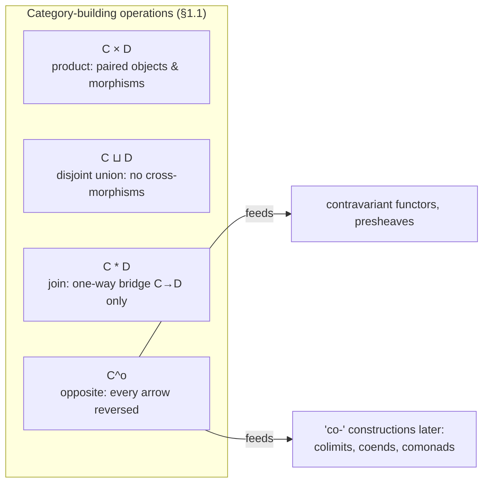
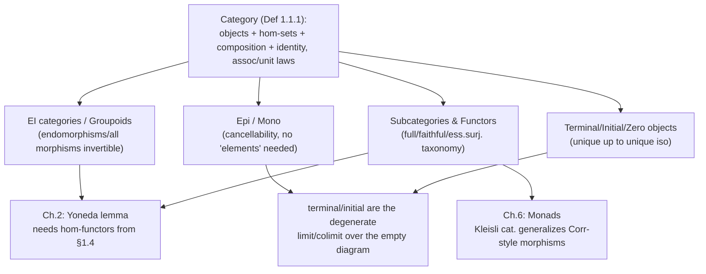

[[book-guidelines|↩ Back to guidelines]]

# Foundations of Category Theory

## Why bother axiomatizing "things and arrows"?

Richter's Chapter 1 opens with a small but pointed remark: to define a category, specifying the objects isn't enough — "you always have to say what kind of morphisms you want to allow" (§1.1). That sentence is the whole motivation for the chapter. A programmer already has an intuition for this: a `struct` alone doesn't tell you what you can *do* with it — the `impl` blocks, the trait bounds, the functions that consume and produce it, are where the actual content lives. Category theory takes that intuition and turns it into the entire foundation of a mathematical universe: don't describe objects by their internals, describe them by how they relate to everything else via morphisms. This is the same shift structural typing makes over nominal typing, generalized to the point where it becomes the *only* allowed move.

What breaks without this discipline? If you only track objects, you can't compose anything, and composition is where all the interesting structure (functors, natural transformations, the Yoneda lemma two chapters from now) actually lives. A category is, at minimum, the smallest amount of structure that lets you *compose* relationships and trust that composing is well-behaved (associative, has identities) — the same two laws that make a `Monoid` trait useful instead of just a random binary operation.

## The definition itself

Richter's Definition 1.1.1: a category $\mathcal{C}$ consists of

1. a class of objects $\mathrm{Ob}\,\mathcal{C}$,
2. for every pair of objects $C_1, C_2$, a **set** $\mathcal{C}(C_1, C_2)$ of morphisms from $C_1$ to $C_2$,
3. a composition law $\mathcal{C}(C_1,C_2) \times \mathcal{C}(C_2,C_3) \to \mathcal{C}(C_1,C_3)$, written $g \circ f$ for the composite of $f$ then $g$,
4. an identity morphism $1_C$ for every object $C$,

subject to two laws: associativity, $h \circ (g \circ f) = (h \circ g) \circ f$, and identity, $1_{C_2} \circ f = f = f \circ 1_{C_1}$.

Note the asymmetry already baked in: point 1 says objects form a *class* (can be too big to be a set — think "all sets"), but point 2 says morphisms *between any fixed pair of objects* form a *set*. This is the notion of a **locally small** category (Remark 1.1.2); dropping even that constraint (allowing $\mathcal{C}(C_1,C_2)$ itself to be a proper class) is technically allowed by some authors, but Richter's book fixes locally small as the default. A category is **small** if the objects themselves also form a set (Definition 1.1.4), and **finite** if additionally every hom-set is finite. A **discrete category** has only identity morphisms — it's a category that has forgotten how to relate objects to each other except trivially, i.e., a set wearing a category costume.

**Rust grounding.** The cleanest way to see the shape of this definition is as a trait obligation, not a concrete data type — a category isn't one struct, it's a *specification* that a candidate (objects, morphisms, composition, identity) must satisfy:

```rust
trait Category {
    type Object;
    type Morphism; // conceptually: Morphism<C1, C2>, tagged with source/target

    fn source(m: &Self::Morphism) -> Self::Object;
    fn target(m: &Self::Morphism) -> Self::Object;
    fn identity(obj: &Self::Object) -> Self::Morphism;
    fn compose(f: Self::Morphism, g: Self::Morphism) -> Self::Morphism; // g ∘ f, defined only if target(f) == source(g)

    // Laws (not checkable by the compiler, only testable/provable):
    // compose(identity(source(f)), f) == f
    // compose(f, identity(target(f))) == f
    // compose(compose(f, g), h) == compose(f, compose(g, h))
}
```

The laws are exactly the kind of thing a type system *cannot* enforce on its own — they're propositional obligations layered on top of the structural definition. That gap (structure vs. the laws it must satisfy) is precisely what a proof assistant is for, which is why the honest formalization lives in Lean, not Rust.

**Lean grounding.** This is worth taking seriously because it's the load-bearing case for this article: Lean's own `CategoryTheory.Category` class is a near-literal transcription of Definition 1.1.1, and it makes the law/structure distinction explicit in a way Rust's trait system cannot:

```lean
class Category (obj : Type u) where
  Hom : obj → obj → Type v
  id : ∀ X, Hom X X
  comp : ∀ {X Y Z}, Hom X Y → Hom Y Z → Hom X Z
  id_comp : ∀ {X Y} (f : Hom X Y), comp (id X) f = f
  comp_id : ∀ {X Y} (f : Hom X Y), comp f (id Y) = f
  assoc : ∀ {W X Y Z} (f : Hom W X) (g : Hom X Y) (h : Hom Y Z),
    comp (comp f g) h = comp f (comp g h)
```

Here `id_comp`, `comp_id`, and `assoc` are *fields of the structure* — proof obligations that must be discharged (usually by `rfl` when the composition is literally function composition, or by an explicit proof term otherwise) before a candidate `obj`/`Hom`/`comp` is accepted as a `Category` instance. This is the general pattern behind every "structure with laws" in a dependently typed kernel: a `Sigma`-type packaging data together with proof terms that the data satisfies certain propositions, checked by `isDefEq` or an explicit tactic proof. The judgment "this is a category" is not decidable syntactically the way "this is well-typed" is — it requires a full proof term, exactly like checking a Hoare triple requires a full derivation, not just a syntax check. This is the deepest connection this chapter has to the standing project: **a category is a judgment form with proof obligations**, the same shape as a typing judgment $\Gamma \vdash e : \tau$ paired with the metatheoretic proofs (progress, preservation) that make the judgment meaningful rather than just syntactically well-formed.

Richter also gives a geometric picture worth keeping: the identity law as two glued triangles, and associativity as a tetrahedron whose four faces are the two ways of parenthesizing a triple composite. She flags explicitly that this isn't decoration — it's the seed of the **nerve** and **classifying space** construction in Chapter 11, where an $n$-fold composable chain of morphisms becomes literally an $n$-simplex.

## The zoo of standard categories

Section 1.1 walks through a long list of examples (Sets, Gr, Ab, $K$-vect, $R$-mod, Top, Top$_*$, CW, Ch, Ch$_{\geq 0}$) whose only real point is to establish the pattern: *category = (some kind of object) + (structure-preserving maps between them)*. Two examples deserve more than a glance because they're less obvious:

- **Corr**, the category of correspondences: objects are sets, but a morphism $S \to T$ is not a function — it's an arbitrary *subset* of $S \times T$ (a relation). Composition is relational composition (pull back along the diagonal, then project). This is worth noting because it shows morphisms need not be "structure-preserving functions" at all; a category is compatible with a much broader notion of "process taking $S$ to $T$" — which is exactly the mindset needed later for Kleisli categories of monads (Chapter 6) and for thinking of nondeterministic or relational semantics in a verifier.
- **A poset as a category**: given $(X, \leq)$, make the elements of $X$ the objects, and put exactly one morphism $x \to y$ when $x \leq y$, none otherwise. This tiny example is a preview of an enormous idea: *a category is a generalization of a preorder where you also remember the "proof" (morphism) as data, not just the fact that it exists.* Where a poset only tells you "$x \le y$" as a yes/no proposition, a category keeps every witness of $x \to y$ around, possibly several inequivalent ones. This is the exact same move dependent type theory makes over classical logic: propositions become types, and proofs become terms of that type, so instead of "P holds" (a bit) you have "the type of proofs of P," which may be empty, a singleton (proof-irrelevant, poset-like), or genuinely have many distinct inhabitants (category-like). The finite linear orders $[n] = (0 < 1 < \cdots < n)$ that Richter introduces as "diagram" categories are exactly the poset-as-category construction, and they will reappear constantly (they generate the simplex category $\Delta$ in Chapter 10).

Also notable: **every category $\mathcal{C}$ gives, for any object $C$, a monoid $\mathcal{C}(C,C)$ of endomorphisms** — and conversely every monoid $M$ gives a one-object category $\mathcal{C}_M$. Richter's slogan: "every category can be thought of as a monoid with many objects." This single remark answers one of the guidelines' Key Questions almost by definition — groupoids (below) then answer the group version of the same question.

**Category-building operations** (Definition 1.1.7) are worth internalizing as combinators, because they recur as *type-level* combinators throughout the book: product $\mathcal{C} \times \mathcal{D}$ (pairs of objects, pairs of morphisms, composed componentwise — literally a Rust tuple `(A, B)` where you compose each half independently), disjoint union $\mathcal{C} \sqcup \mathcal{D}$ (an `enum` with two non-interacting variants — no morphisms cross between the two summands), the asymmetric **join** $\mathcal{C} * \mathcal{D}$ (disjoint union plus a *single, unique* morphism from every object of $\mathcal{C}$ to every object of $\mathcal{D}$, and nothing the other way — a "one-way bridge"), and the **opposite category** $\mathcal{C}^o$ (same objects, every morphism formally reversed: $\mathcal{C}^o(C,C') = \mathcal{C}(C',C)$). The opposite category is the single most important of these for everything downstream — contravariant functors, presheaves, and the entire "co-" prefix vocabulary (colimits, coends, comonads) are all secretly "the ordinary concept, but computed in $\mathcal{C}^o$."



## EI categories and groupoids: when is "invertible" the norm?

Definition 1.2.1: $f \in \mathcal{C}(C, C')$ is an **isomorphism** if some $g \in \mathcal{C}(C', C)$ satisfies $g \circ f = 1_C$ and $f \circ g = 1_{C'}$; $g$ is then unique and written $f^{-1}$.

Two named special cases of "how much invertibility does this category have":

- **EI category**: every *endo*morphism (morphism from an object to itself) is an isomorphism. (The name literally stands for "Endomorphisms are Isomorphisms.")
- **Groupoid**: *every* morphism is an isomorphism.

Every groupoid is an EI category (trivially — if all morphisms are iso, certainly all endomorphisms are), and in any EI category, the endomorphisms of a single object $C(C,C)$ form not just a monoid but a genuine **group** (a monoid where every element is invertible). This sharpens the earlier "category = monoid with many objects" slogan into: **a groupoid is a group with many objects**, and this is not just an analogy — Richter makes it precise via the one-object groupoid $C_G$ built from any group $G$ (Definition mirrors $C_M$ from §1.1, but restricted to a group), and the converse direction: any one-object groupoid's endomorphism set literally *is* a group.

The chapter's example list here is doing real work for later chapters:

- $I$ = finite sets with **injections** — an EI category (endomorphisms of $\underline{n} = \{1,\ldots,n\}$ are exactly the permutations $\Sigma_n$, which are invertible, but injections between different-sized finite sets are not iso).
- $\Sigma$ = finite sets with **surjections** — dually also EI, same endomorphism groups $\Sigma_n$.
- $\mathrm{Iso}(\mathcal{C})$ = the sub-collection of a category's isomorphisms only — always a groupoid, for any $\mathcal{C}$.
- The **fundamental groupoid** $\Pi(X)$ of a space $X$: objects are points, morphisms $x \to y$ are homotopy classes of paths, and $\Pi(X)(x,x) = \pi_1(X,x)$ recovers the fundamental *group* as the endomorphism monoid at a single point — a beautiful, concrete instance of the EI-category slogan.
- The **translation category** $E_G$ of a group $G$: objects are the elements of $G$ itself, and $E_G(g,h) = \{hg^{-1}\}$ — a *single* canonical morphism between any two objects. This "exactly one morphism between any two objects, always" property ("every object has equal rights," in Richter's phrase) reappears explicitly in Chapter 11 as the model for the total space $EG$ of a principal bundle, and again whenever the book needs a contractible free $G$-action.

**What this buys downstream (type-theory angle):** EI categories and groupoids are the precise categorical shadow of a very load-bearing type-theoretic idea — **definitional/propositional equality with non-trivial witnesses**. A groupoid is what you get when "$x = y$" is allowed to have more than one distinct proof (path), which is exactly the situation homotopy type theory formalizes via the identity type $\mathrm{Id}_A(x,y)$ — a groupoid structure living *inside* type theory itself, rather than being merely analogous to it. Even without going that far, the discipline of "track *which* isomorphism, don't just assert one exists" is the same discipline a metavariable unifier needs: two terms being *defeq* is not a boolean, it's (in principle) witnessed by a specific reduction path, and Miller's pattern-unification fragment is precisely about restricting to the well-behaved (EI-like) cases where that witness is forced to be unique rather than a genuine multi-object ambiguity.

## Epimorphisms and monomorphisms: recovering "surjective"/"injective" without elements

This is the section where category theory earns its keep as "algebra without elements." In $\mathbf{Sets}$, injectivity and surjectivity are tested pointwise. In a general category there may be no notion of "point" at all (what's a point of a chain complex?), so Richter tests these properties using *morphisms as probes* instead of elements.

**Definition 1.3.1 (epimorphism):** $f \in \mathcal{C}(C_1,C_2)$ is epi if for every object $D$ and every pair $h_1, h_2 : C_2 \to D$, $h_1 \circ f = h_2 \circ f \implies h_1 = h_2$. Epimorphisms are **right-cancellable**.

**Definition 1.3.5 (monomorphism):** $f$ is mono if $f^o$ is epi in $\mathcal{C}^o$ — unwound, this says $f$ is **left-cancellable**: for all $h_1, h_2 : D \to C_1$, $f \circ h_1 = f \circ h_2 \implies h_1 = h_2$. Notice the opposite-category trick from §1.1 already paying for itself: "mono" is *defined* as "epi in $\mathcal{C}^o$," not re-derived from scratch — duality isn't decoration, it's a labor-saving device baked into the definitions themselves.

Proposition 1.3.4 proves epimorphisms of sets = surjections exactly (the forward direction is the pointwise argument you'd expect; the reverse direction is the clever part — given an epi $f: X \to Y$ that's *not* surjective, build a 2-element target $Z = \{z_1, z_2\}$ and two functions that agree exactly on the image of $f$ but disagree off it, forcing $h_1 = h_2$ to fail unless $f$ was already surjective).

**What breaks without extra care:** the *converse* pattern ("epi ⟺ surjective," "epi + mono ⟹ iso") does **not** hold in general categories, and Richter is explicit that this is the trap to watch for. The canonical counterexample, mentioned three separate times in the chapter for emphasis: in the category of **commutative rings with unit**, the inclusion $\mathbb{Z} \hookrightarrow \mathbb{Q}$ is both mono (obviously injective) and epi (any two ring maps out of $\mathbb{Q}$ that agree on $\mathbb{Z}$ must agree everywhere, since every rational is a ratio of integers and ring maps are forced to respect division once denominators become invertible) — yet it is manifestly not an isomorphism, since $\mathbb{Z} \neq \mathbb{Q}$. This single example is doing a lot of pedagogical work: it's the sharpest possible warning against importing set-theoretic intuition ("surjective," "injective," "epi+mono=iso" as in $\mathbf{Set}$ or $\mathbf{Vect}$) wholesale into an arbitrary category. Structural characterizations (Proposition 1.3.6) sharpen the definitions into a test using *hom-functors*: $f$ is mono iff $\mathcal{C}(D,f) : \mathcal{C}(D,C_1) \to \mathcal{C}(D,C_2)$ is injective as a function of sets, for every test object $D$ — the first appearance of the idea (fully exploited by the Yoneda lemma next chapter) that a hom-functor can *detect* properties of a morphism just by watching how it acts on all the "probes into" or "probes out of" the objects involved.

**Retractions, sections, projective/injective objects** (§1.3 continued) generalize "has a one-sided inverse":

- $r: C_1 \to C_2$ is a **retraction** if some $s: C_2 \to C_1$ satisfies $r \circ s = 1_{C_2}$; then $s$ is a **section**, and $C_2$ is a **retract** of $C_1$. Retractions are automatically epi; sections are automatically mono (Proposition 1.3.9) — but the *converse* fails just as badly as epi+mono⟹iso does: a surjective group homomorphism need not split (need not have a section that's *also* a homomorphism), even though the underlying function of sets always splits (using choice). This is a genuinely useful failure mode to internalize for a verifier project: "the map exists on the underlying data" and "the map exists respecting the structure you actually care about" are different claims, and conflating them is a classic soundness bug.
- **Projective** and **injective objects** (Definition 1.3.11) categorify the module-theoretic notions: $P$ is projective if every diagram
$$
\begin{array}{ccc} & & P \\ & \; \xi \diagup & \downarrow p \\ M & \xrightarrow{\ f\ } & Q \end{array}
$$
with $f$ epi admits a **lift** $\xi$ with $f \circ \xi = p$ (uniqueness of $\xi$ is *not* required — only existence). Injectivity is the dual statement about **extending** along a monomorphism. Both properties are preserved under retracts (Proposition 1.3.14): if $P$ is projective and $U$ is a retract of $P$, then $U$ is projective too.

**Rust/verifier grounding for lifting.** The "lift along an epimorphism" pattern is exactly the shape of a **proof obligation with a witness search**: you're handed a "surjective-like" constraint $f: M \twoheadrightarrow Q$ and a target-fact $p: P \to Q$, and you must *search for* a realizer $\xi: P \to M$ making the triangle commute — this is structurally identical to a metavariable-solving step in an elaborator (find a term $\xi$ inhabiting the type that makes definitional equality $f \circ \xi \equiv p$ hold) or to the CSP kernel's job of finding a concrete witness satisfying a constraint system, rather than just asserting a set is nonempty. The "no uniqueness required" clause is the precise reason lifting problems in general categories can have multiple incompatible solutions — a preview of why unification needs *most general* solutions (principal unifiers), not just *some* solution, once these lifting problems compose.

## Subcategories and functors

A **subcategory** $\mathcal{D} \subset \mathcal{C}$ (Definition 1.4.1) restricts both objects and morphisms while staying closed under composition and identities; it's **full** (Definition 1.4.2) if it keeps *all* of $\mathcal{C}$'s morphisms between the objects it retains — i.e. you only threw away objects, never morphisms between the ones you kept. Ab $\subset$ Gr is full; $I$ (finite sets + injections) inside FinSets is *not* full, because morphisms (arbitrary functions) were also restricted.

**Definition 1.4.3 (functor):** $F: \mathcal{C} \to \mathcal{D}$ assigns objects to objects and, for every pair $C, C'$, a function $F: \mathcal{C}(C,C') \to \mathcal{D}(F(C),F(C'))$, such that $F(g \circ f) = F(g) \circ F(f)$ and $F(1_C) = 1_{F(C)}$.

This is the categorical generalization of a **homomorphism** — and, from a compiler-engineer's seat, it's the generalization of a *structure-preserving compiler pass*: a functor is a transformation of "programs and their relationships" that is guaranteed, by the two functor laws, to never break composition or identity. That guarantee is precisely what you want from an optimization pass or a lowering pass: `pass(f ; g) = pass(f) ; pass(g)` and `pass(id) = id` are the functor laws stated as compiler-pass correctness conditions.

```rust
trait Functor<C: Category, D: Category> {
    fn map_object(c: &C::Object) -> D::Object;
    fn map_morphism(f: C::Morphism) -> D::Morphism;
    // Laws: map_morphism(compose(f, g)) == compose(map_morphism(f), map_morphism(g))
    //       map_morphism(identity(c)) == identity(map_object(c))
}
```

Richter's example list gives sixteen functors, but a few are structurally distinct and worth flagging:

- **Forgetful functors** ($U: \mathrm{Top} \to \mathrm{Sets}$, $U: K\text{-vect} \to \mathrm{Ab}$): discard structure, keep the underlying data. These are always **faithful** but never full (you can't recover, say, "is this function continuous" just from knowing it's a function of the underlying sets).
- **Functors out of the "shape" categories** $[0]$, $[1]$, $[2]$: a functor $[0] \to \mathcal{C}$ is exactly a *choice of object*; a functor $[1] \to \mathcal{C}$ is a choice of two objects plus a morphism between them; a functor $[2] \to \mathcal{C}$ is a *composable pair* of morphisms with their forced composite. This reframes "diagram in $\mathcal{C}$" as "functor out of an indexing category" — the idea that powers the entire theory of limits/colimits two chapters later (a diagram is nothing but a functor $F: \mathcal{D} \to \mathcal{C}$ from some small "shape" category $\mathcal{D}$).
- **The covariant hom-functor** $\mathcal{C}(C_0, -): \mathcal{C} \to \mathbf{Sets}$: sends an object $C$ to the *set of morphisms from a fixed $C_0$*. Innocuous-looking, Richter says, but "very important" — this is the functor at the heart of the Yoneda lemma (Chapter 2) and of representability throughout the book.
- **Presheaves** (Example (16)): a functor $F : \mathcal{U}(X)^{op} \to \mathcal{C}$ out of the *opposite* of the open-sets category of a topological space $X$ — contravariant precisely because restricting a section from a bigger open set to a smaller one goes the "wrong way" relative to inclusion. The presheaf axioms ($\mathrm{res}_{U,U} = \mathrm{id}$, and restriction is transitive: $\mathrm{res}_{W,U} = \mathrm{res}_{V,U} \circ \mathrm{res}_{W,V}$) are literally the functor laws applied to $\mathcal{U}(X)^{op}$ — nothing new is postulated, it's a specific instance of "contravariant functor."

**Contravariant functors** $F: \mathcal{C}^o \to \mathcal{D}$ (equivalently, $F: \mathcal{C}(C,C') \to \mathcal{D}(F(C'),F(C))$ with the composition order flipped, $F(g \circ f) = F(f) \circ F(g)$) get their own name rather than being folded into ordinary functors precisely because the arrow-reversal shows up so often it needs its own vocabulary — dual vector space $V \mapsto V^*$, singular cochains, and local systems (Example 1.4.6, contravariant functors out of $\Pi(X)$) are the chapter's worked instances.

**The taxonomy of "how much of a functor's structure is faithfully preserved"** (Definition 1.4.10) is the section's real payoff:

| Property | Condition on $F: \mathcal{C}(C,C') \to \mathcal{D}(F(C),F(C'))$ | Reading |
|---|---|---|
| **full** | surjective, for every pair $C, C'$ | no morphism in $\mathcal{D}$'s image is "missed" |
| **faithful** | injective, for every pair $C, C'$ | $F$ never conflates two distinct morphisms |
| **fully faithful** | bijective, for every pair $C, C'$ | hom-sets are literally identified |
| **essentially surjective** | every $D \in \mathcal{D}$ is *isomorphic* to some $F(C)$ | hits every object up to iso, not necessarily on the nose |
| **isomorphism of categories** | bijective on objects *and* fully faithful, with an actual inverse functor | strict, on-the-nose identification |

Richter is careful to flag the trap here too (Remark 1.4.14): fully faithful does **not** imply essentially surjective, and does **not** rule out sending different objects to the *same* image — full faithfulness only pins down behavior on morphisms between objects already in the image, saying nothing about coverage. This trio — full, faithful, essentially surjective — is exactly the vocabulary the next chapter uses to give the precise definition of "equivalence of categories" (fully faithful + essentially surjective), which is the correct, up-to-isomorphism notion of "these two categories are really the same," as opposed to the much stricter isomorphism of categories defined here.

**Why small categories, why `cat`:** Definition 1.4.15 defines $\mathbf{cat}$, the category of *all small categories and functors between them*. Richter immediately asks the guidelines' first Key Question herself: why the restriction to small categories? Her answer is concrete and important — if you tried to form the "category of all categories" without a smallness restriction, even something as modest as "the constant functors from $\mathbf{Sets}$ to itself" already forms a proper class (one constant functor per set, and there's a proper class of sets), so $\mathbf{cat}(\mathbf{Sets}, \mathbf{Sets})$ would fail to be a set — violating the very definition of category (hom-*sets*, not hom-classes) from §1.1. This is the categorical cousin of Russell's-paradox-style size issues in naive set theory, and the fix (small vs. locally small vs. "large," and restricting $\mathbf{cat}$'s objects to *small* categories) is the same kind of universe-stratification discipline a dependently typed kernel needs for its own type universes ($\mathrm{Type}_0 : \mathrm{Type}_1 : \cdots$) to avoid `Type : Type`-style inconsistency.

## Terminal, initial, and zero objects

Definition 1.5.1: $t$ is **terminal** if there's a *unique* morphism $C \to t$ from every object $C$; $s$ is **initial** dually (unique morphism $s \to C$ to every object); an object that is both is a **zero object** $0$, giving canonical **zero morphisms** $C \to 0 \to C'$ between any two objects.

The key structural fact, easy to prove and used constantly afterward: terminal and initial objects, when they exist, are **unique up to (unique) isomorphism** — not unique on the nose, but unique in exactly the sense "equivalence of categories" cares about. This is the first appearance, in miniature, of a pattern that recurs at every level of the book: universal properties pin down an object uniquely up to canonical isomorphism, never on the nose, and "up to canonical iso" turns out to be the *right* notion of uniqueness for essentially everything downstream (limits, colimits, Kan extensions, adjoints).

Worked instances: in $\mathbf{Sets}$, $\emptyset$ is initial and any singleton is terminal, but there is *no* zero object (they're not isomorphic — $\mathbf{Sets}$ has more than one one-element set up to bijection being terminal, but $\emptyset \not\cong \{*\}$). Passing to pointed sets $\mathbf{Sets}_*$ fixes this: the one-point set is now a zero object. In $R\text{-mod}$ and $\mathrm{Ab}$, the zero module/group is a genuine zero object. In $\mathrm{Gr}$, the trivial group is both terminal and initial. In the translation category $E_G$ from §1.2, *every* object is simultaneously initial and terminal — consistent with "every object has equal rights."

## Synthesis: what this chapter is actually building toward



Every later chapter in Part I is, structurally, "take one piece of vocabulary from Chapter 1 and generalize it along a specific axis." Terminal/initial objects generalize into [[Limits-and-Colimits|limits and colimits]] (Chapter 3) — a terminal object is literally the limit of the empty diagram. The hom-functor $\mathcal{C}(C_0,-)$ becomes the engine of the Yoneda lemma (Chapter 2). The full/faithful/essentially-surjective taxonomy becomes the exact definition of equivalence of categories (Chapter 2, §2.5). Epi/mono become the building blocks of image factorization in abelian categories (Chapter 7). Even the opposite category $\mathcal{C}^o$, introduced almost as a notational convenience here, becomes indispensable machinery the moment "co-" constructions (colimits, coends, comonads, cofinal functors) start appearing.

**For the standing project (Focus Area: `type-theory`):** this chapter is the categorical analogue of the very first page of a type theory text — before judgments, before typing rules, you need the notion of "a collection of things and the well-behaved ways of relating them," closed under a sensible notion of composition. The three ideas most worth carrying forward explicitly:

1. **A category-with-laws is structurally identical to a judgment-with-proof-obligations** — the Lean `Category` class's `assoc`/`id_comp`/`comp_id` fields are proof terms attached to structural data, the same shape as a typing derivation attached to a syntactic term. Any elaborator that checks "does this instance satisfy the category laws" is doing the same kind of defeq/proof-term checking a kernel does for `isDefEq`.
2. **Groupoids as "invertible-everything" categories** foreshadow identity types with nontrivial path structure — the same tension between "propositions as booleans" (poset-like, EI-ish, at most one proof) and "propositions as types with potentially many distinct proofs" (groupoid-like) that separates classical/propositional reasoning from the type-theoretic view your elaborator will need to reason about definitional vs. propositional equality.
3. **The lifting property defining projective objects** is a search-for-a-witness problem with the same shape as metavariable resolution — existence without uniqueness, exactly the reason unification needs a *principal* (most general) solution once these lifting/solving steps start composing across a derivation.

This section of the book had no code examples of its own — it's pure mathematical prose with diagrams — so the Rust and Lean snippets above are original illustrations built to make the book's definitions executable/checkable, not material lifted from the text itself.
