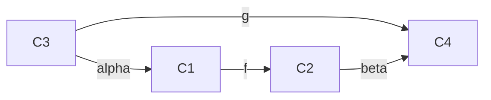
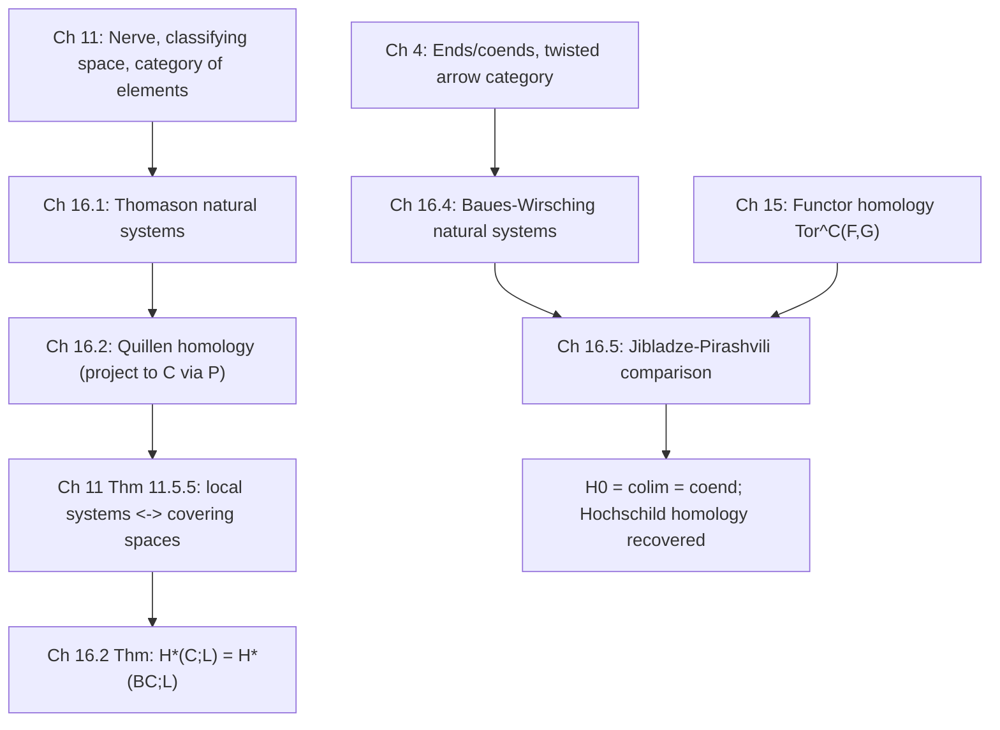

[[book-guidelines|↩ Back to guidelines]]

# Homology and Cohomology of Small Categories

## Why a category needs a homology theory at all

By the end of Chapter 15, you have a working notion of *[[Functor-Homology|functor homology]]*: given a small diagram category $\mathcal{C}$ and functors $F : \mathcal{C}^{op} \to k\text{-mod}$, $G : \mathcal{C} \to k\text{-mod}$, you can derive the tensor product $F \otimes_{\mathcal{C}} G$ to get $\mathrm{Tor}^{\mathcal{C}}_*(F,G)$. That machinery is purely algebraic — it never looks at $\mathcal{C}$ as anything other than an indexing shape for modules.

But a small category $\mathcal{C}$ is also, via its nerve, a *space* — the classifying space $B\mathcal{C}$ from Chapter 11. So there's an obvious question the book has been setting up since Chapter 11: if $\mathcal{C}$ has a topology, does it have a *homology*, and if so, how does that homology relate to (a) the ordinary singular homology of $B\mathcal{C}$, and (b) the purely algebraic $\mathrm{Tor}^{\mathcal{C}}_*$ from Chapter 15?

This chapter answers both questions, but it does so by presenting *three* superficially different constructions — Thomason's, Quillen's, and Baues–Wirsching's — before proving they are all secretly the same thing (or specializations of the same thing). This multiplicity is not sloppiness on the book's part; it reflects three different historical entry points into the same idea, and each one is the natural generalization of a homology theory you already know: Thomason's generalizes simplicial homology directly, Quillen's generalizes group homology, and Baues–Wirsching's generalizes bimodule (co)homology / Hochschild-style coefficients. Seeing why they coincide is the payoff of the whole chapter, and it is what finally closes the loop back to Chapter 15's functor homology.

**What breaks without this:** without a homology theory *of the category itself* (as opposed to of $B\mathcal{C}$ or of some external $\mathrm{Tor}$), you have no way to compute invariants of $\mathcal{C}$ using coefficients that vary functorially over the objects of $\mathcal{C}$ — e.g. group homology with a nontrivial $G$-module of coefficients, which is not just "the homology of the space $BG$" (untwisted) but genuinely depends on the module structure. You need a homology theory with *local coefficients built in*, and that's exactly what all three constructions below provide.

---

## 16.1 Thomason (co)homology: coefficients on the category of simplices

### The construction, motivated first

Recall the nerve $N(\mathcal{C}) : \Delta^{op} \to \mathrm{Sets}$, sending $[n] \mapsto N_n(\mathcal{C})$, the set of $n$-tuples of composable morphisms $[f_n|\cdots|f_1]$. If you wanted to compute the *ordinary* (co)homology of the simplicial set $N(\mathcal{C})$ with constant coefficients, you'd just take the alternating sum of face maps on the free module on $N_n(\mathcal{C})$ — that's simplicial homology, no category theory needed.

The generalization Thomason (via [GCNT13], building on Thomason's original work) makes is: allow the coefficients to *vary with the simplex itself*, not just be a fixed module. To do that you need a category whose objects *are* the simplices of $N(\mathcal{C})$, so that a "coefficient system" can be a functor out of that category.

This category is the **category of elements of the nerve**, denoted $N(\mathcal{C}) \backslash \Delta^{op}$ (also called the *simplex category* of $\mathcal{C}$, and identical in spirit to the category of elements $\mathrm{el}(X)$ from Definition 10.2.7 applied to $X = N(\mathcal{C})$):

- **Objects:** pairs $([n], F)$ where $[n]$ is an object of $\Delta$ and $F = [f_n|\cdots|f_1] \in N_n(\mathcal{C})$.
- **Morphisms:** $h \in N(\mathcal{C})\backslash\Delta^{op}\big(([n],F),([m],G)\big)$ is a morphism $h \in \Delta([m],[n])$ (note the direction reversal — $\Delta^{op}$) such that $N(\mathcal{C})(h)\cdot F = G$, i.e. precomposing $F$'s data along $h$ recovers $G$.

**A Thomason natural system** with values in $E$ is just a functor $M : N(\mathcal{C})\backslash\Delta^{op} \to E$ (contravariant version: $L : (N(\mathcal{C})\backslash\Delta^{op})^{op} \to E$). Think of $M$ as: "for every string of composable morphisms in $\mathcal{C}$, a module, functorial in how that string arises from shorter/longer strings via face and degeneracy maps."

Given such an $M$ valued in a complete/cocomplete abelian category $\mathcal{A}$ with exact products and coproducts, form:

$$
C_T^n(\mathcal{C}; M) := \prod_{([n],F) \text{ obj of } N(\mathcal{C})\backslash\Delta^{op}} M([n],F), \qquad \delta = \sum_{i=0}^n (-1)^i M(\delta_i),
$$

dually $C^T_n(\mathcal{C}; L) = \bigoplus_{([n],F)} L([n],F)$ with $d = \sum (-1)^i L(\delta_i)$. The resulting cohomology $H^n_T(\mathcal{C};M)$ and homology $H^T_n(\mathcal{C};L)$ are **Thomason cohomology/homology**.

Richter flags the conceptual payoff immediately (Remark 16.1.3): this is nothing exotic — the Thomason chain complex *is* the normalized chain complex of an honest simplicial object in $\mathcal{A}$ (namely $[n] \mapsto \bigoplus_F L([n],F)$), and the cochain complex is the cochain complex of a cosimplicial object. So Thomason (co)homology is "ordinary" simplicial (co)homology machinery, just applied to a diagram built from $\mathcal{C}$'s own nerve rather than to $\mathcal{C}$ directly — this is the most general of the three theories precisely because it makes the least assumption about where the coefficients "live."

**What this buys you, mechanistically:** if you're building a compiler pass that needs to track information indexed by *derivation trees* or *composable rule chains* (an obvious analogy: a proof-search trace is a string of composable inference steps, exactly the shape of an $N_n(\mathcal{C})$-element), Thomason natural systems are the abstract blueprint for "an invariant attached to a derivation that's compatible with how derivations factor and compose" — the same shape problem that shows up whenever you want a coefficient system on a category of *proofs* rather than a category of *objects*.

---

## 16.2 Quillen's definition: pulling the coefficients back to $\mathcal{C}$ itself

### The problem with 16.1's generality

Thomason natural systems are indexed by the simplex category, which is a much bigger, more complicated category than $\mathcal{C}$ itself. Most of the time you don't actually want coefficients that vary over *all* composable strings — you want coefficients that vary only over the *objects* of $\mathcal{C}$, i.e. an ordinary functor $K : \mathcal{C} \to \mathcal{A}$. Quillen's definition is exactly the specialization of Thomason's framework to this common case.

The bridge is a **projection functor**
$$
P : N(\mathcal{C})\backslash\Delta^{op} \to \mathcal{C}, \qquad P([n], F) = F(n) = C_n
$$
(the target object of the composable string $F = [f_n|\cdots|f_1]$; dually $P^{op}([n],F) = F(0) = C_0$, the source). Given $K : \mathcal{C} \to \mathcal{A}$, precomposing gives $K \circ P : N(\mathcal{C})\backslash\Delta^{op} \to \mathcal{A}$, a genuine Thomason natural system, "associated with $K$."

**Definition 16.2.2 (Quillen's homology).** $H_n(\mathcal{C}, K) := H^T_n(\mathcal{C}, K \circ P)$.

Concretely, the chain groups collapse to something much more recognizable than the general Thomason formula:
$$
C^T_n(\mathcal{C}, K\circ P) = \bigoplus_{[f_n|\cdots|f_1] \in N_n(\mathcal{C})} K(C_0),
$$
i.e. one copy of $K$ evaluated *at the source object* of the string, summed over all $n$-strings. This is literally Quillen's original definition [Q73, p. 91] of the homology of a category with coefficients in a functor.

### Why this recovers ordinary singular homology

This is the theorem that makes Quillen's homology more than bookkeeping. Call $L : \mathcal{C} \to k\text{-mod}$ **morphism-inverting** if $L(f)$ is an isomorphism for every morphism $f$ of $\mathcal{C}$. Recall from Chapter 11 (Theorem 11.5.5) that morphism-inverting functors $\mathcal{C} \to \mathrm{Sets}$ correspond exactly to covering spaces of $B\mathcal{C}$ — so a morphism-inverting $L : \mathcal{C} \to \mathrm{Ab}$ is precisely the data of a **local coefficient system** on $B\mathcal{C}$.

**Theorem 16.2.3 [Q73].** For morphism-inverting $L$, $H_*(\mathcal{C};L) \cong H_*(B\mathcal{C}; L)$ — Quillen's homology of the category equals the singular homology of the classifying space with the corresponding local coefficients.

*Proof idea (this is a nice, reusable pattern):* filter $B\mathcal{C}$ by skeleta $B\mathcal{C}^{(0)} \subset B\mathcal{C}^{(1)} \subset \cdots$, and consider the spectral sequence of this filtration. The $E^1$-page vanishes for $q > 0$ (skeletal filtrations of CW complexes are concentrated on the base row precisely because each $n$-skeleton is built by attaching $n$-cells), and the surviving $q=0$ row is exactly the normalized chain complex computing $H_p(\mathcal{C};L)$. Since the spectral sequence converges to $H_*(B\mathcal{C};L)$, the two must agree.

**What breaks without morphism-inverting:** the correspondence with covering spaces / local systems genuinely needs every structure map to be invertible — this is the same phenomenon as needing a $G$-*module* (not an arbitrary functor out of a monoid) to get honest group cohomology with local coefficients. If $L$ isn't morphism-inverting, $H_*(\mathcal{C};L)$ is still perfectly well-defined (Quillen's definition doesn't require it), it just no longer literally computes $H_*(B\mathcal{C};L)$ for an honest local system, because there's no local system to compute — the coefficients don't transport consistently around $B\mathcal{C}$'s loops.

**Example 16.2.4 (recovering group homology).** Take $\mathcal{C} = C_G$, the one-object category associated to a group $G$ — every morphism is automatically invertible, so *every* functor $L : C_G \to k\text{-mod}$ is morphism-inverting. Set $M = L(*)$; the isomorphisms $L(g)$ give $M$ a $G$-action by $k$-linear maps, i.e. $M$ is a $k[G]$-module, and $H_*(C_G;L)$ is exactly the group homology $H_*(G;M)$. This is the chapter's cleanest instance of "special case first, general theory later" — group homology was always secretly an instance of Quillen's homology of a one-object category.

---

## 16.3 The spectral sequence for homotopy colimits

This section is short and structural: it packages an observation from Chapter 11 (Remark 11.4.7) — that $\mathrm{hocolim}_{\mathcal{D}}F$ for $F : \mathcal{D} \to \mathrm{Ch}(k)_{\geq 0}$ is the total complex of a bicomplex built from $\bigoplus_{[f_p|\cdots|f_1]} F(s(f_1))_q$ (source-indexed, with the nerve's $\delta$ in one direction and $F$'s internal differential $d$ in the other) — as a computational tool. Filtering by columns and taking homology in the vertical direction produces exactly $H_p(\mathcal{D}; F_q)$, where $F_q : \mathcal{D} \to \mathrm{Ab}$ sends $D \mapsto F(D)_q$. This yields:

$$
\textbf{Theorem 16.3.1: } \quad E^1_{p,q} = H_p(\mathcal{D}; F_q) \Rightarrow H_{p+q}\,\mathrm{hocolim}_{\mathcal{D}}F.
$$

This is the categorical analogue of the familiar fact that a homotopy colimit of chain complexes can be computed by a spectral sequence whose input is the (ordinary) homology of the diagram category with coefficients in the pointwise homology of $F$ — the "collapse a double complex two ways" pattern that recurs throughout this chapter (you'll see it again in §16.5's hyperhomology argument).

---

## 16.4 Baues–Wirsching (co)homology: coefficients that see both variances at once

### Why source/target coefficients need a new indexing category

Quillen's homology only lets coefficients depend on *one* object per morphism (the source, via $P^{op}$, or the target, via $P$). But plenty of natural coefficient systems genuinely need to see *both ends of a morphism simultaneously* — a bifunctor $D : \mathcal{C}^{op} \times \mathcal{C} \to k\text{-mod}$, exactly the shape you use for $\mathrm{Hom}$-functors, bimodules, or (not coincidentally) the tensor-product coefficients from Chapter 15's functor homology. Baues–Wirsching homology is the theory built to house exactly this shape of coefficient.

The indexing category is the **twisted arrow category** $\mathcal{C}^\tau$ (already defined back in Definition 4.5.1, in the ends/coends chapter — worth noticing that this is the same twisted-arrow trick used there to express an end as a limit): objects are morphisms of $\mathcal{C}$; a morphism in $\mathcal{C}^\tau$ from $f : C_1 \to C_2$ to $g : C_3 \to C_4$ is a pair $(\alpha : C_3 \to C_1,\ \beta : C_2 \to C_4)$ with $g = \beta \circ f \circ \alpha$:

Baues and Wirsching call $\mathcal{C}^\tau$ the **category of factorizations** of $\mathcal{C}$: a morphism of $\mathcal{C}^\tau$ is literally a way of factoring $g$ through $f$ on both sides at once.

**Definition 16.4.1.** A **natural system** (Baues–Wirsching sense) on $\mathcal{C}$ is a functor $M : \mathcal{C}^\tau \to \mathcal{A}$.

There's a projection functor $\nu : N(\mathcal{C})\backslash\Delta^{op} \to \mathcal{C}^\tau$ sending $([n],F) \mapsto (f_n \circ \cdots \circ f_1 : C_0 \to C_n)$ — the composite of the whole string, remembered as a single arrow — and correspondingly:

**Definition 16.4.3.** $H_*^{BW}(\mathcal{C};M) := H^T_*(\mathcal{C}; M \circ \nu)$.

So Baues–Wirsching homology is *also* just Thomason homology, specialized via a different projection functor than Quillen's $P$. This is the first hint that all three theories in this chapter are really "Thomason homology, viewed through different projections" — the general theory in §16.1 was general precisely so it could specialize both ways.

### The key example: bifunctors as natural systems

**Example 16.4.4.** Any $D : \mathcal{C}^{op}\times\mathcal{C} \to k\text{-mod}$ becomes a Baues–Wirsching natural system by $D(f : C_1 \to C_2) := D(C_1,C_2)$ — three concrete instances matter downstream:

1. $F \otimes G$ for $F : \mathcal{C}^{op}\to k\text{-mod}$, $G:\mathcal{C}\to k\text{-mod}$ — this is the coefficient system that will let Baues–Wirsching homology talk about Chapter 15's tensor product of functors.
2. $R\text{-mod}(G_1,G_2)$ for $G_1,G_2 : \mathcal{C}\to R\text{-mod}$ — natural transformations as a natural system.
3. The constant functor $k$ paired with any $G : \mathcal{C}\to k\text{-mod}$ recovers Quillen's homology exactly: $H_*^{BW}(\mathcal{C}; k\otimes G) \cong H_*(\mathcal{C};G)$. So Quillen's theory sits *inside* Baues–Wirsching's as the special case where the contravariant variable is trivial.

**Exercise 16.4.5** asks you to check the degree-zero cases directly: $H_0^{BW}(\mathcal{C}; F\otimes G) = F\otimes_{\mathcal{C}} G$ (a coend) and $H^0_{BW}(\mathcal{C}; R\text{-mod}(G_1,G_2))$ is the natural-transformation module (an end) — i.e. **$H_0^{BW}$ computes coends and $H^0_{BW}$ computes ends**. This is exactly the mechanistic content you want to remember: Baues–Wirsching homology is a *derived functor of the coend*, the same way Quillen's $H_0$ turns out (§16.5) to be a derived colimit.

---

## 16.5 Comparison: closing the loop with Chapter 15

This is the payoff section — the Jibladze–Pirashvili comparison theorem, which identifies **functor homology** (algebraic, defined via projective resolutions in a functor category, from Chapter 15) with **Baues–Wirsching homology** (topological/simplicial in flavor, defined via the twisted arrow category, from §16.4).

**Theorem 16.5.1 [JP91, Cor. 3.11].** If $F : \mathcal{C}^{op}\to k\text{-mod}$ or $G : \mathcal{C}\to k\text{-mod}$ takes values in *projective* $k$-modules, then
$$
H_*^{BW}(\mathcal{C}; F\otimes G) \cong \mathrm{Tor}_*^{\mathcal{C}}(F,G).
$$

### Why a projectivity hypothesis is unavoidable — and what happens without it

The proof is a genuinely instructive derived-functor argument, worth walking through because the pattern ("resolve one variable, take homology in the other direction, get a spectral sequence, then check when it collapses") is the same trick used constantly in homological algebra generally.

1. **Lemma 16.5.3** is the base case: for a representable-tensor coefficient $k\{\mathcal{C}(-,C)\} \otimes G$, homology is concentrated entirely in degree $0$, where it equals $G(C)$. The proof exhibits an explicit chain contraction (a chain homotopy witnessing acyclicity) — sending $g\otimes m$ in a $p$-simplex to $1_C \otimes m$ in the corresponding $(p{+}1)$-simplex. This is the categorical analogue of "a free resolution is acyclic because it's built from a contractible complex," made completely explicit rather than asserted abstractly.
2. **Remark 16.5.4** bootstraps this from representables to *all* projectives: since $k\{\mathcal{C}(-,C)\}$ are projective generators of $\mathrm{Fun}(\mathcal{C}^{op},k\text{-mod})$ (established back in Chapter 15, Lemma 15.3.8), and epimorphisms from sums of generators detect all projectives, acyclicity transfers to every projective $F$: $H_*^{BW}(\mathcal{C}; F\otimes G)$ vanishes in positive degree and equals $F\otimes_{\mathcal{C}} G$ in degree $0$.
3. **Proposition 16.5.5** is the general (non-projective) case, and it's where the spectral sequence appears: resolve $F$ by a projective resolution $P_*$ in the functor category, form $P_*\otimes G : \mathcal{C}^{op}\times\mathcal{C}\to \mathrm{Ch}_{\geq 0}(k)$, and apply the **hyperhomology spectral sequence** to the double complex this induces:
$$
E^2_{p,q} = H_p^{BW}\big(\mathcal{C};\, \mathrm{Tor}_q^k(F(-),G(-))\big) \Rightarrow \mathrm{Tor}^{\mathcal{C}}_{p+q}(F,G).
$$
4. **Now the projectivity hypothesis does its work:** if $F$ is objectwise projective, $\mathrm{Tor}_q^k(F(-),G(-)) = 0$ for $q>0$ (ordinary module-level Tor vanishes against a projective), so the $E^2$-page collapses to a single row $E^2_{p,0} = H_p^{BW}(\mathcal{C};F\otimes G)$, and the spectral sequence degenerates to the isomorphism claimed by Theorem 16.5.1.

**What this buys you when the hypothesis fails:** you don't lose the comparison entirely — you lose the *collapse*, and get instead the full spectral sequence of Proposition 16.5.5, which still relates the two invariants but now requires actually tracking $\mathrm{Tor}_q^k(F(-),G(-))$ for $q>0$ as an extra layer of bookkeeping. This is a completely general phenomenon worth internalizing: a "clean isomorphism" theorem in homological algebra is very often a degenerate special case of an underlying spectral sequence, and the hypothesis exists precisely to force the degeneration.

### Corollaries: what this reduces to in familiar cases

- **Corollary 16.5.7:** taking $F = k$ (the constant functor, trivially projective) recovers Quillen's homology as functor Tor: $H_*(\mathcal{C};G) \cong \mathrm{Tor}_*^{\mathcal{C}}(k,G)$.
- **Remark 16.5.8:** unwinding $H_0$, $\mathrm{colim}_{\mathcal{C}}G \cong H_0(\mathcal{C},G)$, and the higher $H_i(\mathcal{C},G)$ are literally the **left-derived functors of colimit**, $\mathrm{colim}_{\mathcal{C}}^i G$ — matching up with the homotopy-colimit spectral sequence of Theorem 16.3.1 (a chain complex concentrated in degree $0$ has homotopy colimit whose homology is exactly this derived colimit). This is a genuinely satisfying unification: *"colimit," "coend," and "$H_0$ of a category" are three names for one construction*, and this chapter's machinery is precisely what lets you derive all three simultaneously and get the same answer.
- **Example 16.5.6 / Corollary 16.5.10:** specializing $\mathcal{C} = \Delta$ recovers **Hochschild homology** as $\mathrm{Tor}^{\Delta^{op}}_*(k,G) \cong H_*(\Delta^{op},G)$ — i.e. the very first worked functor-homology example from Chapter 15 (§15.3) is, after this chapter's comparison theorem, *also* an instance of Quillen's homology of the simplicial indexing category. Chapter 15 built the algebra; Chapter 16 shows the algebra was secretly geometry all along.

---

## Synthesis: where this sits in the book, and in the project

**Structurally**, this chapter is where three threads that have been running in parallel since Part I finally converge:

Thomason's theory is the most general umbrella; Quillen's is the specialization that reconnects to topology (classifying spaces, group homology, local coefficient systems); Baues–Wirsching's is the specialization that reconnects to algebra (bifunctor coefficients, ends/coends); and the Jibladze–Pirashvili theorem is the bridge showing the algebraic and topological specializations agree wherever both are defined. This is the concrete cash-out of the book's running theme that "many algebraic and homotopical concepts are instances of a single categorical construction."

**For the compiler/verifier project**, the most load-bearing idea here is not the topology (classifying spaces are not obviously part of a type-checker's toolkit) but the **general pattern of "coefficient system on a derived category of composable data, computed via a projective resolution, with the comparison theorem hinging on a flatness/projectivity side-condition."** Two connections worth keeping explicit:

- The twisted arrow category $\mathcal{C}^\tau$ (factorizations of $\mathcal{C}$) is structurally the same shape as a **derivation/proof-search trace category**: an object is "a step," a morphism is "a factorization of one step through another." If you ever want an invariant attached to proof search that's compatible with how proof steps compose and factor — e.g. tracking a cost or certificate that must behave functorially under proof composition — Baues–Wirsching natural systems are the exact template, directly relevant to `automated-reasoning`'s proof-certificate and proof-reconstruction concerns.
- The comparison theorem's projectivity hypothesis, and its failure mode (a spectral sequence that doesn't collapse), is a clean instance of a pattern that recurs in soundness arguments for approximation-based static analysis: a clean equality between two computed invariants ("the analysis is exact") typically holds only under a side-condition, and dropping the side-condition doesn't break the framework, it just reintroduces an extra approximation layer you must account for — the same shape as the gap between an abstract-interpretation over-approximation and the true reachable-state set when the abstract domain isn't precise enough. This isn't a hidden Focus Area connection so much as a transferable proof-engineering habit worth naming explicitly.

Chapter 16 is also the natural endpoint of Part II's project: after 361 pages, homology, cohomology, classifying spaces, functor Tor, and the Grothendieck construction all turn out to be facets of one thing — a category, viewed as a diagram, admitting derived invariants that don't care whether you approach them algebraically or topologically.
