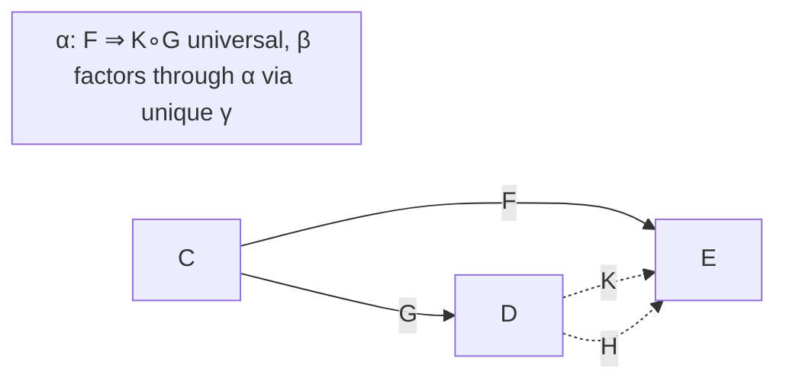
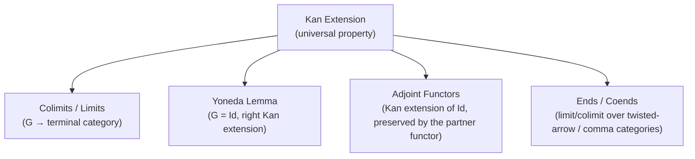

[[book-guidelines|↩ Back to guidelines]]

# Kan Extensions, Ends, and Coends

## The problem: you have a functor, but not on the category you need it on

Suppose you've defined a functor $F : \mathcal{C} \to \mathcal{E}$, and someone hands you another functor $G : \mathcal{C} \to \mathcal{D}$ that embeds — or more generally maps — $\mathcal{C}$ into a bigger category $\mathcal{D}$. You'd like a functor on all of $\mathcal{D}$ that "agrees with $F$ on the part that came from $\mathcal{C}$." This is exactly the shape of problem software engineers hit constantly: you have a function defined on a subtype or a restricted domain, and you want the *canonical* extension of it to a bigger domain — not just *some* extension, but the best one, in a sense you can make precise.

Concretely: think of `G` as an inclusion of a small finite-type category into `Sets`, and `F` as some construction you only know how to define for finite types. A left Kan extension is the universal recipe for extending `F` to *all* sets. This is not idle abstraction — Richter's own example (4.1.6/4.1.7) is exactly Day convolution, which underlies the algebraic structure of symmetric sequences and operads used throughout the rest of the book. If you've ever implemented a generic collection type by first defining behavior on `Vec<T>` and then asking "what's the *correct* way to generalize this to arbitrary iterators," you have already asked a Kan extension question, even if nobody called it that.

**What breaks without a universal property.** If you just pick *any* functor $K : \mathcal{D} \to \mathcal{E}$ agreeing with $F$ on $G$'s image, you get an extension, but an arbitrary, non-canonical one — there could be infinitely many, and nothing tells you which one composes well with further constructions (further colimits, further functors applied on top). The whole point of Kan extensions is to single out the *best* — i.e., the initial (or terminal) — such extension, the one that everything else factors through uniquely. That's what makes it composable and reusable machinery instead of an ad hoc patch.

## 4.1 — Left Kan extensions

**Definition (4.1.1).** Given $G : \mathcal{C} \to \mathcal{D}$ and $F : \mathcal{C} \to \mathcal{E}$, the **left Kan extension** of $F$ along $G$ is a pair $(K, \alpha)$ where $K : \mathcal{D} \to \mathcal{E}$ is a functor and $\alpha : F \Rightarrow K \circ G$ is a natural transformation, universal in the sense that for any other pair $(H, \beta)$ with $H : \mathcal{D} \to \mathcal{E}$ and $\beta : F \Rightarrow H \circ G$, there's a *unique* natural transformation $\gamma : K \Rightarrow H$ with $\gamma_G \circ \alpha = \beta$.



Read this the way you'd read the universal property of a colimit: $(K,\alpha)$ is the *initial* way of filling in the triangle. $K \circ G$ need not equal $F$ on the nose — $\alpha$ only compares them up to natural transformation — but in the best case ($G$ fully faithful, Lemma 4.1.10) $\alpha$ *is* an isomorphism, so the extension is genuinely faithful to $F$ on the original subcategory.

**Existence (Theorem 4.1.4).** If $\mathcal{C}$ is small and $\mathcal{E}$ is cocomplete, the left Kan extension always exists, and it's built from an auxiliary **comma category** $G \downarrow D$: objects are pairs $(C, h)$ with $h : G(C) \to D$, morphisms $f : (C,h) \to (C',h')$ are morphisms $f \in \mathcal{C}(C,C')$ with $h' \circ G(f) = h$. There's a forgetful functor $U : G\downarrow D \to \mathcal{C}$, and

$$K(D) = \mathrm{colim}_{G\downarrow D} (F \circ U).$$

Intuitively: $G \downarrow D$ collects every way an object of $\mathcal{C}$ maps into $D$ via $G$, weighted by how "close" it is to $D$; you evaluate $F$ on all of them and glue the results together with a colimit. This is why the construction is called **pointwise** (Definition 4.1.5) when this colimit exists object-by-object — it's the literal formula, not just an abstract existence claim.

**A concrete analogy for engineers: this is a left join.** If you know a relational database, $G \downarrow D$ is precisely the set of rows of a "left join" keyed by how each $C$-row relates to $D$ through $G$, and the colimit is how you *aggregate* the $F$-values of all matching rows into a single value at $D$. When $G$ is fully faithful (an actual embedding, no information duplicated or collapsed), the join is "clean" — every $D = G(C)$ has $(C, \mathrm{id})$ as a terminal object in $G\downarrow G(C)$, so the colimit collapses to exactly $F(C)$ (this is the proof of Lemma 4.1.10: a diagram with a terminal object has a colimit equal to the value there).

**Day convolution (4.1.7)**, previewed here and developed fully in Chapter 9, is the case $\mathcal{C} = \mathcal{D} = \Sigma$ (finite sets with bijections), $G$ the disjoint-union functor $\sqcup: \Sigma \times \Sigma \to \Sigma$. Extending $X \times Y$ left along $\sqcup$ produces
$$n \mapsto \coprod_{p+q=n} \Sigma_n \times_{\Sigma_p \times \Sigma_q} X(p) \times Y(q),$$
which is exactly the induced-representation formula from group theory, and it is the categorical origin of convolution products on graded/symmetric-sequence data — the algebraic backbone for operads later in the book.

**As an adjunction (Theorem 4.1.11).** When both $\mathcal{C},\mathcal{D}$ are small and $\mathcal{E}$ is cocomplete, precomposition $G^* = (-)\circ G : \mathrm{Fun}(\mathcal{D},\mathcal{E}) \to \mathrm{Fun}(\mathcal{C},\mathcal{E})$ has the left Kan extension as its **left adjoint**. This reframes everything: "extend $F$ along $G$" is literally "find the best approximation from the left" to the restriction functor $G^*$, the same universal-property flavor as "free construction is left adjoint to forgetful functor." If your compiler project has ever needed to characterize "the most general X consistent with these constraints," that's the same shape of universal problem.

**Rust grounding.** The comma-category colimit formula is awkward to encode directly (Rust has no native colimits), but the *adjunction* shape is familiar: think of a trait `Extend<C, D, E>` where implementing "restrict along $G$" is trivial (just precompose), but implementing the *left adjoint* — the canonical extension — requires you to specify how to merge/glue overlapping witnesses, which is exactly what a `Monoid`- or `Semigroup`-style `combine` operation does when you extend a partial function to a total one by picking a canonical default and gluing pieces:

```rust
// G: C -> D is the inclusion of a "small" index type into a larger one.
// F: C -> E is what you know how to compute on the small type.
// The left Kan extension K: D -> E is characterized, not constructed,
// by this universal factoring property:
trait LeftKanExtension<C, D, E> {
    // K(d) is glued from every (c, h: G(c) -> d) pair — the colimit.
    fn extend(d: D) -> E;
    // any other (H, beta) with the same triangle factors uniquely through K
    fn factor_through<H: Fn(D) -> E>(h: H) -> Box<dyn Fn(E) -> E>;
}
```

The trait's second method is the important one to internalize: it's not code you'd normally write, but it is exactly what a compiler's "most general unifier" or "principal type" guarantees — a canonical solution that every other solution factors through. That's the load-bearing conceptual link back to the elaborator project: a **universal property is the categorical vocabulary for "the most general X."**

**Lean grounding.** Lean's `mathlib` literally defines `CategoryTheory.Functor.LeftKanExtension` this way — as a *structure* carrying the universal cocone data, not as a computed formula — because in general position you cannot "compute" a Kan extension any more than you can decide type inhabitation in general; you can only characterize it and, in nice situations (small $\mathcal{C}$, cocomplete $\mathcal{E}$), *construct* a witness via the colimit formula. This mirrors precisely the distinction between a specification (`isDefEq` as "there exists a proof of equality") and an algorithm that computes it in restricted cases.

## 4.2 — Right Kan extensions

Dualize everything: reverse all the natural transformations and swap colimits for limits. The comma category becomes $D \downarrow G$, with objects $(C,h)$, $h : D \to G(C)$, and

$$\mathrm{RKE}_G(F)(D) = \lim_{D\downarrow G} F \circ U$$

when $\mathcal{C}$ is small and $\mathcal{E}$ is complete (Theorem 4.2.2). Right Kan extension is pointwise when this limit exists objectwise, and is again an isomorphism-producing extension when $G$ is fully faithful. Where left Kan extension is a left adjoint to precomposition, right Kan extension is precomposition's **right adjoint** — so both adjoints of $G^*$ exist simultaneously whenever $\mathcal{E}$ is bicomplete (Exercise 4.2.4), and both get their own notation, $G_!$ (left) and $G_*$ (right).

The mnemonic: **left** Kan extensions are built from **colimits** (gluing, "the most information you're forced to include"), **right** Kan extensions from **limits** (constraining, "the most information you're allowed to keep").

## 4.3 — Functors preserving Kan extensions

A functor $H : \mathcal{E} \to \mathcal{F}$ **preserves** the left Kan extension $(K,\alpha)$ of $F$ along $G$ if $(H\circ K, H\alpha)$ is *itself* a left Kan extension of $H \circ F$ along $G$ — i.e., you can compute the extension either before or after applying $H$ and get the same universal answer.

- **Proposition 4.3.2:** left adjoints preserve left Kan extensions. (Chain of adjunctions: $L\dashv R$ turns the adjunction characterizing $K$ into the adjunction characterizing $L\circ K$.)
- **Theorem 4.3.3** gives the precise reconciliation the chapter promised earlier: a right Kan extension is *pointwise* if and only if it is preserved by every representable functor $\mathcal{E}(E,-)$. This matters because the *abstract* universal-property definition of Kan extension doesn't automatically give you the objectwise limit/colimit formula — pointwise-ness is an extra condition, and representables are exactly the functors sensitive enough to detect it (because of Yoneda: $\mathcal{E}(E,\lim X_i) \cong \lim \mathcal{E}(E,X_i)$ precisely characterizes limits, so testing against all representables is testing against "all possible probes").

This is the answer to Key Question 1 from the guidelines: pointwise-ness is a *strengthening*, not a consequence, of the abstract definition, and representable functors are the exact class of test functors that can tell the difference.

## 4.4 — Ends: natural transformations as a limit-like gluing

Motivating example: a natural transformation $\varphi : F \Rightarrow G$ (for $F,G : \mathcal{D}\to\mathcal{C}$) is a *family* of morphisms $\varphi_D \in \mathcal{C}(F(D),G(D))$ satisfying $G(f)\circ\varphi_D = \varphi_{D'}\circ F(f)$ for all $f : D \to D'$. Notice the funny variance: the family is indexed by objects $D$, but the coherence condition mixes $D$ and $D'$ — it's "diagonal" data on a functor of *two* variables, $\mathcal{D}^{op}\times\mathcal{D} \to \mathcal{C}$, $(D_1,D_2)\mapsto \mathcal{C}(F(D_1),G(D_2))$.

**Definition (4.4.1): dinatural transformation.** For $H_1, H_2 : \mathcal{D}^{op}\times\mathcal{D} \to \mathcal{E}$, a family $\tau_D : H_1(D,D)\to H_2(D,D)$ is dinatural if a hexagon (not a square — that's the whole point) commutes for every $f : D\to D'$. "Dinatural" means **natural on the diagonal**, not natural-in-two-variables (Remark 4.4.2) — $\tau$ is only ever defined where both slots agree.

**Definition (4.4.4): the end.** An end of $H : \mathcal{D}^{op}\times\mathcal{D}\to\mathcal{E}$ is a pair $(E,\tau)$, universal among dinatural transformations out of the constant functor $\kappa_E$ into $H$ — the terminal such gadget, in exactly the sense a limit is terminal among cones. Applied to $H = \mathcal{C}(F(-),G(-))$, the end **is** $\mathrm{nat}(F,G)$, the set of natural transformations (Example 4.4.5) — this cashes out [[Natural-Transformations-and-the-Yoneda-Lemma#The motivating example|the motivating example]]: natural transformations are literally an end.

**Coends** are dual: a coend of $H$ is initial among dinatural transformations *from* $H$ into a constant functor. The headline example (4.4.7) is the **tensor product of functors**, $F \otimes_{\mathcal{D}} G$, built for $F : \mathcal{D}^{op}\to k\text{-mod}$, $G:\mathcal{D}\to k\text{-mod}$ as
$$F\otimes_{\mathcal{D}} G := \Big(\bigoplus_D F(D)\otimes_k G(D)\Big)\Big/ \big(F(f)(x)\otimes y - x\otimes G(f)(y)\big).$$
Set $\mathcal{D} = $ the one-object category of a ring $R$, $F(\ast)=M$, $G(\ast)=N$: this recovers the ordinary tensor product of $R$-modules $M\otimes_R N$ as a special case of a coend. This is precisely why the ordinary "identify $(rm)\otimes n$ with $m\otimes(rn)$" relation in $M\otimes_R N$ looks the way it does — it's a dinaturality condition in disguise.

**Rust/Python grounding.** An end over a category is close in spirit to a **universally-quantified generic function**: `nat(F, G)` is the type of "a function that works for every `D`, coherently" — much like a Rust `for<'a> fn(F<'a>) -> G<'a>` or a Haskell-style `forall a. F a -> G a`. The dinaturality hexagon is what guarantees that instantiating this generic function at different types doesn't secretly depend on which type you picked — the categorical version of *parametricity* ("theorems for free"). If you've ever relied on the fact that a fully generic function `fn identity<T>(x: T) -> T` can only be the identity (it can't peek at `T` to do anything else), you've used the end/dinaturality principle without the name.

## 4.5 — Coends as colimits, ends as limits

To settle existence, Richter builds the **twisted arrow category** $\mathcal{D}^\tau$ (Definition 4.5.1): objects are morphisms $f : D_1\to D_2$ of $\mathcal{D}$; a morphism from $f$ to $g:D_3\to D_4$ is a pair $(h_1,h_2)$ with $h_1 : D_3\to D_1$, $h_2:D_2\to D_4$, and $g = h_2\circ f\circ h_1$ (source moves backward, target moves forward — a genuinely "twisted" indexing). There's a functor $\chi : \mathcal{D}^\tau \to \mathcal{D}^{op}\times\mathcal{D}$ sending $f\mapsto(s(f),t(f))$.

**Proposition 4.5.3:** the end of $H$ is isomorphic to $\lim_{\mathcal{D}^\tau}(H\circ\chi)$. So ends are literal limits (over this twisted category), and — dually — coends are literal colimits. Consequence: **ends exist whenever $\mathcal{E}$ is complete and $\mathcal{D}$ is small**, exactly the same existence pattern as ordinary limits, just over a re-indexed diagram shape.

## 4.6 — Integral notation and Fubini

Ends/coends are conventionally written as integrals: $\int_D H(D,D)$ for the end, $\int^D H(D,D)$ for the coend (Notation 4.6.1) — a deliberate analogy, since ends behave like universally-quantified "sums over the diagram," and there's a genuine **Fubini theorem** (Proposition 4.6.3): for $H$ on a product category $(\mathcal{D}\times\mathcal{D}')^{op}\times(\mathcal{D}\times\mathcal{D}')$,
$$\int_{D}\int_{D'} H(D,D',D,D') \;\cong\; \int_{D'}\int_D H(D,D',D,D') \;\cong\; \int_{D\times D'} H,$$
whenever any one side exists. This is the same "swap the order of iterated integration" intuition from calculus, and it's what licenses computing complicated ends/coends (like Day convolution, or hom-functor calculations) one variable at a time.

## 4.7 — "All concepts are Kan extensions"

Mac Lane's slogan ([ML98, X.7]) gets cashed out concretely:

- **Colimits/limits as Kan extensions (Prop 4.7.1).** Take $G : \mathcal{C}\to[0]$, the unique functor to the terminal (one-object) category. A left Kan extension of $F:\mathcal{C}\to\mathcal{E}$ along $G$ is precisely a choice of object $E\in\mathcal{E}$ with a universal cone $\alpha:F\Rightarrow(\underline{E})$ — i.e., $E = \mathrm{colim}\,F$. Limits are the dual, along the same $G$.
- **Yoneda as a right Kan extension (Prop 4.7.2).** Take $G = \mathrm{Id}_\mathcal{C}$. The right Kan extension of $F:\mathcal{C}\to\mathrm{Sets}$ along the identity is $F$ itself, and unwinding the pointwise limit formula over $\mathcal{C}\downarrow\mathrm{Id}_\mathcal{C}$ produces exactly $F(C) \cong \mathrm{nat}(\mathcal{C}(C,-),F)$ — the Yoneda lemma, derived as a special case rather than assumed.
- **Adjunctions as Kan extensions (Prop 4.7.3).** If $L\dashv R$ with unit $\eta$ and counit $\varepsilon$, then $(R,\eta)$ is the left Kan extension of $\mathrm{Id}_\mathcal{C}$ along $L$ (and is preserved by $L$), and $(L,\varepsilon)$ is the right Kan extension of $\mathrm{Id}_{\mathcal{E}}$ along $R$ (preserved by $R$). Conversely, either Kan extension existing is *enough* to reconstruct the adjoint pair. So "having an adjoint" and "having a certain Kan extension along the identity, preserved by the other functor" are literally the same fact.



This answers Key Question 3: the unification isn't a slogan-level analogy — each of these is a literal instance of the same universal-property machine (initial/terminal factorization through a comma-category (co)limit), just with $G$ specialized differently. **What breaks without this unification**: without it, you'd need a separate ad hoc universal-property proof for colimits, for Yoneda, and for adjunctions — three different "why does this construction work" arguments. Kan extensions collapse them into one theorem you prove once (Theorem 4.1.4 / 4.2.2) and instantiate three times.

## Where this leads

Kan extensions are the load-bearing generalization behind **Chapter 5's comma-category and Grothendieck-construction machinery** (the $G\downarrow D$ category built here is reused directly), **Chapter 9's Day convolution and monoidal-functor-category theory** (already previewed in 4.1.7), and **Chapter 10's skeleta of simplicial sets** (explicitly built as left Kan extensions in the guidelines' summary). Ends/coends resurface as the technical engine for [[Functor-Homology|functor homology]] and for defining symmetric monoidal structures on functor categories throughout Part II.

**Connection to the `type-theory` focus area:** the recurring theme here — a universal property picking out "the most general/canonical solution consistent with given constraints, unique up to unique factorization" — is the exact categorical shape of a **principal solution** in unification and elaboration. Where a metavariable unifier looks for the *most general* unifying substitution (and everything else factors through it), a left Kan extension looks for the *most general* extending functor (and everything else factors through it via the unique $\gamma$). The proof technique in Lemma 4.1.10 — that a diagram with a terminal object has its colimit given by evaluation at that object — is also structurally identical to how a trusted kernel's `isDefEq` short-circuits: when the "search category" collapses to something with a canonical terminal witness, computation replaces search. Keep this shape in mind when the elaborator project reaches implicit-argument resolution: "does a canonical/most-general answer exist, and does it come from a terminal object in some indexing category" is a question worth asking explicitly, not just intuiting.
