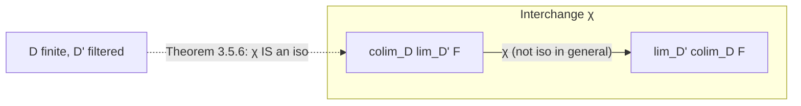

[[book-guidelines|↩ Back to guidelines]]

# Limits and Colimits

## Why you need a concept before you have all the examples

Category theory keeps discovering that wildly different-looking constructions — gluing two spaces along a common piece, taking the union of an increasing chain of sets, forming the tensor product of two modules, intersecting a descending chain of subgroups — are *the same construction* wearing different costumes. Richter opens Chapter 3 by listing several of these: gluing spaces is a pushout, a preimage is a fiber product, the Hawaiian earring is an inverse limit, a product of groups is a product, a direct sum of abelian groups is a coproduct. The chapter's job is to extract the single shape these all share, so that once you've proven a fact about "the shape," you get it for free in every one of its costumes.

That single shape is a **universal cone** (for limits) or **universal cocone** (for colimits) over a **diagram** — and the reason it has to be phrased this abstractly is that not every category has these constructions at all. Richter's example: the category of fields has no products, because the underlying set of a product of fields would have to be the product of the underlying sets, but that product ring has zero divisors — so it can't be a field. This is your first "what breaks without this" moment: universality isn't a nicety, it's the thing that lets you even *ask* whether a construction exists in a category, independent of whatever concrete model you're used to in **Sets** or **Top**.

This is directly the same move a type checker makes when it asks whether a *type* (a limit in a suitable diagram category) exists before trying to construct a value of it — "does this shape have a terminal solution" is a question you'll ask again when the elaborator asks "does this unification problem have a most general solution."

## Diagrams, and the constant-functor trick

A **diagram** is just a functor $F : \mathcal{D} \to \mathcal{C}$ from some small category $\mathcal{D}$ (the *index* or *shape* category — think "the graph of what's connected to what") into the category $\mathcal{C}$ you actually care about. $\mathcal{D}$ need not have any special structure; it's whatever shape your problem has. $\mathrm{Fun}(\mathcal{D}, \mathcal{C})$, the category of all such diagrams with natural transformations as morphisms, is the ambient category the rest of the chapter works in.

To define "universal," Richter first needs a way to compare a diagram to a single fixed object — that's what the **constant-diagram functor** does:

$$\Delta : \mathcal{C} \to \mathrm{Fun}(\mathcal{D}, \mathcal{C}), \qquad \Delta(C)(D) = C \text{ for all } D, \quad \Delta(C)(f) = 1_C.$$

$\Delta(C)$ is the diagram that just puts $C$ at every vertex and the identity on every edge. This is a small but load-bearing piece of notation: it's the thing that turns "map from the diagram to an object" into "natural transformation between two diagrams," which is what makes [[Simplicial-Objects-and-Simplicial-Sets#The definition|the definition]] below actually precise instead of hand-wavy.

## Colimits: gluing as far out as possible

**Definition 3.1.2.** A colimit of $F : \mathcal{D} \to \mathcal{C}$ is a pair $(\mathrm{colim}_\mathcal{D} F, \tau)$ — an object plus a natural transformation $\tau : F \Rightarrow \Delta(\mathrm{colim}_\mathcal{D} F)$ (this $\tau$ is called a **cocone**, or *cone from $F$*, in the book's terminology) — such that for *any* other cocone $\tau' : F \Rightarrow \Delta(C)$, there is a **unique** morphism $\xi : \mathrm{colim}_\mathcal{D} F \to C$ with $\tau' = \Delta(\xi) \circ \tau$.

In words: $\mathrm{colim}_\mathcal{D} F$ is the object you land at if you glue the whole diagram together as economically as possible, and every other way of mapping the diagram compatibly into some object $C$ has to factor uniquely through that gluing. "As close to the diagram as possible with respect to morphisms *out of* the diagram," as Richter puts it.

The standard abstract-nonsense argument (any two colimits induce mutually inverse morphisms between them, by universality applied twice) shows colimits are unique up to canonical isomorphism when they exist — this is worth internalizing once and never re-proving: it is the same argument you'll use for "the" most general unifier, "the" normal form, or "the" principal type, whenever a construction is defined by a universal property.

Proposition 3.1.4 restates this as an adjunction: if colimits exist for all $F : \mathcal{D} \to \mathcal{C}$, then $\mathrm{colim}_\mathcal{D} \dashv \Delta$, i.e.

$$\mathcal{C}(\mathrm{colim}_\mathcal{D} F, C) \cong \mathrm{Fun}(\mathcal{D}, \mathcal{C})(F, \Delta(C)).$$

This is the chapter's first hint that "limit/colimit" and "adjoint functor" are not two separate topics — they're the same idea at different levels of generality, a thread that becomes explicit in §3.4 and, later in the book, in the "everything is a Kan extension" slogan of Chapter 4.

### Concrete zoo of colimits

Richter walks the reader through the standard special cases, each recovered by choosing the shape of $\mathcal{D}$:

- **Sequential colimits** ($\mathcal{D} = (0 \to 1 \to 2 \to \cdots)$): increasing unions $X_0 \subset X_1 \subset \cdots$, CW complexes as colimits of their skeleta, and — a genuinely striking worked example — the stable homotopy groups of spheres $\pi_k^s = \mathrm{colim}_m \pi_{k+m}(S^m)$, built from the stabilization maps induced by smashing with $S^1$.
- **Coproducts** (colimit over a *discrete* diagram, i.e. only identity morphisms): $\coprod_D F(D)$. Comes with canonical **inclusions** $i_D$ and, for the binary self-coproduct $C \sqcup C$, a **fold map** $\nabla : C \sqcup C \to C$ induced by $1_C$ — the fold map composed with an inclusion is the identity, which is exactly the retraction structure you'll see reused for split coequalizers. Concretely: wedge sums of pointed spaces, free products of groups $G_1 * G_2$ (words modulo reduction), and Richter's pinch-map example showing how fold maps generate self-maps of $S^1$ of every degree.
- **Pushouts** (colimit over $D_1 \leftarrow D_0 \to D_2$): gluing spaces along a common subspace (e.g. $\mathbb{RP}^2$ as a pushout of $S^1 \to D^2$ and a degree-2 map $S^1 \to S^1$), amalgamated products of groups $G_1 *_{G_0} G_2$, and the Seifert–van Kampen theorem as "pushouts compute $\pi_1$."
- **Coequalizers** (colimit over $D_0 \rightrightarrows D_1$): the coequalizer of $\alpha, \beta : F(D_0) \rightrightarrows F(D_1)$. Key structural fact (Remark 3.1.17): the coequalizer map $\psi$ is always an **epimorphism** — cancellability falls out of uniqueness in the universal property, not from any surjectivity assumption. Worked examples: the tensor product $M \otimes_R N$ as a coequalizer of $\mathrm{id}\otimes\nu$ and $\nu\otimes\mathrm{id}$, and the cokernel as the coequalizer of $f$ against the zero map.

### Split coequalizers: a preservation guarantee, for free

This subsection is the chapter's best illustration of "why does a definition need an extra condition beyond the obvious one." An ordinary coequalizer is *not*, in general, preserved by an arbitrary functor $F : \mathcal{C} \to \mathcal{E}$ applied to the diagram — colimits are a fact about $\mathcal{C}$, and nothing forces $F$ to respect them. Richter calls a coequalizer **absolute** if every functor *does* preserve it (Definition 3.1.18), and then exhibits a sufficient condition that's purely combinatorial: a **split** diagram

$$C_0 \underset{\beta}{\overset{\alpha}{\rightrightarrows}} C_1 \xrightarrow{\xi} C,\qquad \xi s = 1_C,\ \alpha t = 1_{C_1},\ \beta t = s\xi$$

for some $s : C \to C_1$, $t : C_1 \to C_0$. Lemma 3.1.20's proof is a two-line diagram chase using only these retraction identities — no properties of $\mathcal{C}$ at all. Corollary 3.1.22 then observes: since the defining data are morphisms and composites, **any** functor preserves them automatically. That's the punchline — "split" upgrades an existence statement into a preservation guarantee, at zero extra proof cost, because the witnessing data is functorial by construction. (Richter flags that this reappears verbatim in Chapter 6 for algebras over a monad — free algebras are always exhibited as split coequalizers, which is exactly why monadic constructions interact so well with forgetful functors.)

*Rust framing:* think of `s` and `t` as literal witness values your compiler keeps around — not proof obligations to re-discharge later, but a concrete retraction pair stored in the term, the way a `Cow<T>` carries the evidence needed to avoid a clone. A split coequalizer is a coequalizer *plus a certificate*, and certificates compose for free under any transformation — exactly the shape of a proof term that survives substitution automatically, rather than needing re-verification at every use site.

## Limits: the mirror image

**Definition 3.1.24** dualizes everything: a limit of $F$ is $(\lim_\mathcal{D} F, \tau)$ with $\tau : \Delta(\lim_\mathcal{D} F) \Rightarrow F$, universal among cones $\tau' : \Delta(C) \Rightarrow F$ — "as close to the diagram as possible with respect to morphisms *into* the diagram." Every colimit fact in §3.1 has a literal mirror:

| Colimit (shape of $\mathcal{D}$) | Limit (dual shape) |
|---|---|
| Coproduct (discrete) | Product (discrete) — projections $\mathrm{pr}_D$, diagonal $\delta$ |
| Pushout ($D_1 \leftarrow D_0 \to D_2$) | Pullback ($D_1 \to D_0 \leftarrow D_2$) |
| Coequalizer ($D_0 \rightrightarrows D_1$) | Equalizer ($D_0 \rightrightarrows D_1$, dual arrows) |
| Sequential colimit (increasing chain) | Sequential limit (decreasing chain / inverse limit) |
| Fold map $\nabla$ | Diagonal $\delta$ |

Concrete instances: sequential limits give the $p$-adic integers $\mathbb{Z}_p$ as $\varprojlim \mathbb{Z}/p^n\mathbb{Z}$ (an explicit coherent-tuple model, equation (3.1.4), which is worth staring at — it's the same "coherent family of approximations" shape you get in domain-theoretic denotational semantics); equalizers detect module homomorphisms as $\mathrm{Hom}(M,N) \to \mathrm{Hom}(R\otimes M, N)$; and — the example with the most mileage later in the book — a **presheaf is a sheaf** exactly when

$$F(U) \to \prod_{i} F(U_i) \rightrightarrows \prod_{i,j} F(U_i \cap U_j)$$

is an equalizer diagram. This reframes "gluing compatible local data" as a limit computation, which is the categorical fact underlying descent.

**Fiber products and kernel pairs** get special attention because they're the workhorse limit for detecting injectivity. The **kernel pair** of $f : A \to B$ is the pullback of $f$ against itself, $A \times_B A$. Proposition 3.1.34 is a clean iff: the kernel pair of $f$ is (isomorphic to) $(A, 1_A, 1_A)$ if and only if $f$ is a monomorphism. This is exactly the categorical generalization of "$f$ is injective iff $f(a_1) = f(a_2) \Rightarrow a_1 = a_2$," phrased without ever mentioning elements — a technique you'll need for any typed setting where "elements" aren't literally available (e.g. proof-irrelevant types, or objects of a category with no forgetful functor to **Sets**).

## Completeness: everything reduces to two primitives

**Definition 3.2.1** names the property: $\mathcal{C}$ is **complete** if every diagram $F : \mathcal{D} \to \mathcal{C}$ (small $\mathcal{D}$) has a limit, **cocomplete** dually, **bicomplete** if both. **Theorem 3.2.2** is the chapter's structural payoff:

$$\mathcal{C} \text{ is complete} \iff \mathcal{C} \text{ has all products and all equalizers}.$$

The proof is a genuine construction, not just an existence claim, and it's worth walking through because the *technique* (build every limit from products + one equalizer) is the same technique compilers use to build every typing judgment from a small kernel of primitive rules. Given $F : \mathcal{D} \to \mathcal{C}$, form two big products —

$$X = \prod_{D \in \mathrm{Ob}(\mathcal{D})} F(D), \qquad Y = \prod_{f \in \mathrm{Mor}(\mathcal{D})} F(t(f))$$

— and two parallel maps $\varphi, \psi : X \to Y$, where $\varphi$ just projects-then-reindexes ("read off the target object's coordinate") and $\psi$ additionally applies $F(f)$ ("read off the source object's coordinate, then push forward along the edge"). An element of $X$ satisfies naturality — i.e. actually specifies a cone — exactly when $\varphi$ and $\psi$ agree on it, so the **equalizer** $E \to X$ of $\varphi, \psi$ is precisely $\lim_\mathcal{D} F$. Every limit, no matter how exotic the shape $\mathcal{D}$, is literally "the sub-object of one big product where two derived maps agree." Lemma 3.2.4 offers an alternative primitive set — pullbacks + binary products give you equalizers too, if pullbacks feel more natural to reach for.

*What breaks without this:* if you only ever verify "has terminal object" or "has binary products" ad hoc for each shape you need, you get no leverage — you re-derive existence every time a new diagram shape shows up. Theorem 3.2.2 is what lets you say "$\mathcal{C}$ is complete" once and never worry about a specific pullback or equalizer failing to exist again. This is the same design principle behind keeping a type checker's kernel small: prove soundness once against a handful of primitive judgment forms, and every derived rule (subtyping, records, pattern matching) inherits it for free rather than needing its own soundness argument.

```python
# Illustrative sketch only (not load-bearing): the equalizer-of-two-maps
# construction that reduces an arbitrary diagram's limit to one equalizer.
def limit_via_equalizer(diagram_objects, diagram_morphisms, product, equalizer):
    X = product(diagram_objects.values())                     # prod over objects
    Y = product(diagram_morphisms.values())                   # prod over morphisms
    varphi = lambda x: {f: x[target(f)] for f in diagram_morphisms}
    psi    = lambda x: {f: apply(f, x[source(f)]) for f in diagram_morphisms}
    return equalizer(X, Y, varphi, psi)                        # = lim_D F
```

## Colimits and limits in functor categories: pointwise for free

**Proposition 3.3.1**: if $\mathcal{C}$ is (co)complete, so is $\mathrm{Fun}(\mathcal{D}, \mathcal{C})$ for any small $\mathcal{D}$, and the (co)limit is computed **pointwise** — evaluate the diagram of functors at each object $D$ separately, take the (co)limit in $\mathcal{C}$, and the results assemble back into a functor automatically (the proof is exactly the routine but essential check that this assignment respects composition and identities, i.e. is actually functorial in $D$). A clean corollary (3.3.2): a natural transformation is a monomorphism in $\mathrm{Fun}(\mathcal{D},\mathcal{C})$ iff every component is — because monomorphism-ness is tested via kernel pairs, and kernel pairs, being pullbacks, are computed pointwise.

This "pointwise" principle is exactly the reasoning you rely on informally whenever you say a natural transformation between two type-indexed families is an isomorphism "because it's an isomorphism at every index" — component-wise reasoning is licensed here, precisely, not just intuitively.

## Adjoints and (co)limits: RAPL / LAPC

**Theorem 3.4.2**, stated compactly by Richter's own mnemonic: if $L \dashv R$, then **$L$ preserves colimits** and **$R$ preserves limits** ("left adjoints preserve colimits," LAPC; dually RAPL for right-adjoints-preserve-limits). The proof is worth internalizing at the level of mechanism, not just the slogan: given a cocone $\tau : \Delta(D) \Rightarrow R \circ F$, transport each component across the adjunction bijection to get $\sigma_D : LD \to F(D')$; naturality of the adjunction bijection is exactly what makes these $\sigma$'s assemble into a cocone over $F$ itself, which the colimit in $\mathcal{C}$ then absorbs via a unique $\xi$; transport $\xi$ *back* across the adjunction to get the required factorization of the original cocone through $L(\mathrm{colim})$. The whole argument is "adjunction bijections are natural, so they carry universal properties across the correspondence intact" — this is the single fact you should walk away remembering, because it recurs every time you want to know whether some derived construction (a free monad, a left Kan extension, a substitution functor) plays nicely with colimits.

Concretely: forgetful functors (having a left adjoint) preserve products — "the underlying set of a product of groups is the product of the underlying sets" — while free functors preserve coproducts, so the $n$-fold coproduct (free product) of the free Lie algebra on one generator is the free Lie algebra on $n$ generators; similarly $*_{i=1}^n \mathrm{Fr}_1 \cong \mathrm{Fr}_n$ for free groups.

## Interchange: when do colimits and limits commute with each other?

Two (co)limits of the *same variance* always commute freely (Proposition 3.5.1): $\mathrm{colim}_\mathcal{D}\, \mathrm{colim}_{\mathcal{D}'} F \cong \mathrm{colim}_{\mathcal{D}\times\mathcal{D}'} F$, and dually for limits — this is just Fubini for iterated colimits, no surprises.

Mixing variance is where it gets interesting. There's always a canonical **interchange morphism**

$$\chi : \mathrm{colim}_\mathcal{D}\, \lim_{\mathcal{D}'} F \longrightarrow \lim_{\mathcal{D}'}\, \mathrm{colim}_\mathcal{D} F,$$

built by composing $\lim_{\mathcal{D}'} F(-, D') \to F(D,D') \to \mathrm{colim}_\mathcal{D} F(D,-)$ and taking the induced map — but $\chi$ is **not an isomorphism in general**. Richter's smallest counterexample: with $\mathcal{D}, \mathcal{D}'$ both two-object discrete categories and $\mathcal{C} = \mathbf{Sets}$, $\chi$ becomes a map

$$(F_{13}\times F_{23}) \sqcup (F_{14}\times F_{24}) \to (F_{13}\sqcup F_{14}) \times (F_{23}\sqcup F_{24}),$$

and products don't distribute over coproducts that way in general (this is literally the failure of a distributive law — the same obstruction that shows up whenever you try to naively swap a $\forall$ and a $\Sigma$, or a big union and a big intersection, without a finiteness or filteredness hypothesis rescuing you). What *does* rescue it (Theorem 3.5.6) is a **filtered** index category $\mathcal{D}'$ (Definition 3.5.5: nonempty, every pair of objects has a cocone, every parallel pair of morphisms is coequalized by some further morphism) together with $\mathcal{D}$ finite: filtered colimits commute with finite limits in **Sets**. The proof's mechanism — a finite family of elements from a filtered colimit can always be pulled back to live in one common stage of the filtration — is exactly the "eventually stabilizes" argument you already know from directed unions, and it's the reason filtered colimits are the well-behaved, computation-friendly kind of colimit throughout the rest of the book (they reappear as the technical engine behind sifted colimits in Chapter 5 and the Bousfield–Kan homotopy colimit machinery in Chapter 11).



## Synthesis: where this sits, and where it's going

Structurally, this chapter is the pivot between Chapter 2 (Yoneda, adjunctions as abstract bijections) and everything that follows: **Theorem 3.2.2** hands you a two-primitive kernel (products + equalizers) that every later "does this category have X" question reduces to; **Theorem 3.4.2** (RAPL/LAPC) is the specific adjunction fact that Chapter 4's Kan extensions generalize (a left Kan extension is *literally* a colimit over a comma category, so LAPC becomes "Kan extensions preserve the (co)limits their construction is built from"); and the notion of **filtered** category from §3.5 is promoted to a first-class citizen (**sifted** colimits, a strict generalization) in Chapter 5, and again governs which colimits the homotopy-colimit machinery of Chapter 11 can compute strictly rather than only up to homotopy.

For the standing project (`type-theory` focus area): the universal-property definitional style used throughout this chapter — object plus map, unique up to unique factorization — is the exact discipline you want for defining what a type "is" in the elaborator's internal representation (e.g. a $\Sigma$-type as a limit-flavored universal cone, an inductive type's eliminator as the map witnessing initiality of a colimit/algebra). The kernel-pair characterization of monomorphisms (Proposition 3.1.34) is a direct pattern for detecting *definitional equality classes* without appeal to elements — precisely the situation the kernel's `isDefEq` needs, since terms in a dependent type theory aren't naively comparable "as sets." And the interchange-morphism failure in §3.5 is worth remembering the moment you write code that swaps two quantifiers or two nested fixpoints in a constraint-generation or abstract-interpretation pass: $\chi$ not being an isomorphism is the categorical name for the bug you'll hit if you assume that swap is free without checking a filteredness- or finiteness-style side condition first.

**[[Abelian-and-Additive-Categories#Where this leads|Where this leads]] (per the book's own structure):** Chapter 4 reveals limits and colimits themselves as special cases of Kan extensions (to the terminal category $[0]$), so the universal-property machinery built here is reused, not superseded. Chapters 6–7 lean on split coequalizers (monad algebras) and the products+equalizers kernel (biproducts, kernels/cokernels in abelian categories) directly.
