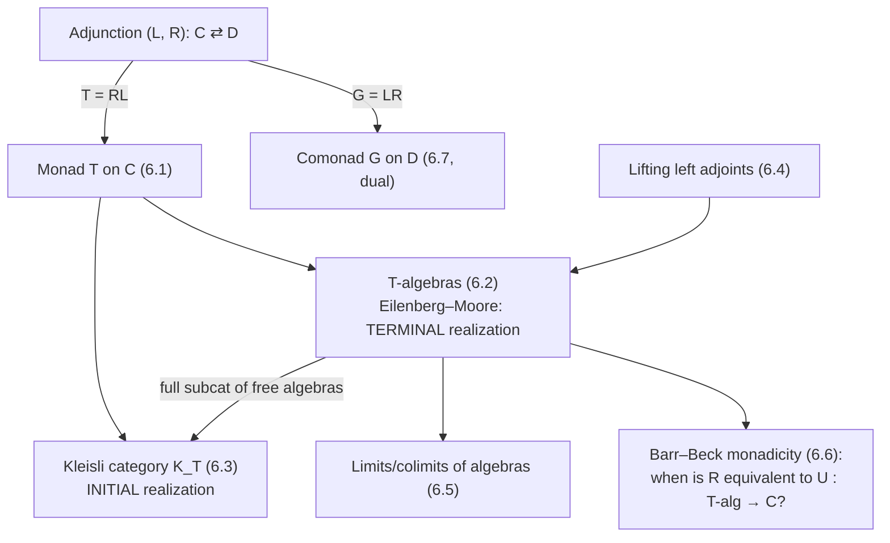

[[book-guidelines|↩ Back to guidelines]]

## Why monads at all?

By Chapter 5 you already know the single most productive move in category theory: take a concrete construction (free groups, tensor algebras, power sets) and notice it's the value of some functor. Chapter 2 went further and noticed that a *lot* of these functors come in adjoint pairs — a "free" functor $L$ left adjoint to a "forgetful" functor $R$. The free group functor and the forgetful functor $U:\mathrm{Gr}\to\mathrm{Sets}$; the tensor algebra functor and the forgetful functor from algebras to modules; the based-loop functor and suspension. Every one of these adjunctions is really doing the same job: freely generate some structure, then remember only the underlying data.

Here's the question this chapter answers: if all you're handed is the *composite* $T = R\circ L : \mathcal C \to \mathcal C$ — an endofunctor, with no adjunction in sight — can you tell that it secretly came from a free–forgetful pair, and if so, can you *reconstruct* the pair? The answer is a clean and surprising "yes, and not just one pair — there's a whole spectrum of adjunctions that give rise to the same $T$, with two canonical extremes." A monad is the residue an adjunction leaves behind once you forget which category $\mathcal D$ it was adjoint to; the chapter's job is to show you can always get $\mathcal D$ back, in (at least) two different ways, and that the freedom in choosing $\mathcal D$ is itself organized into a category with an initial and a terminal object.

If you already think of "monad" as a programming pattern — `Option<T>`, `Result<T, E>`, `IO<T>` — you're not wrong, but you're seeing only the shadow this categorical structure casts on programming languages. Section 6.2's notion of a "$T$-algebra" is what makes the connection precise: it says exactly what data you need to *interpret* a computation described by $T$, which is the same question a compiler backend or an effect handler has to answer.

## 6.1 The monad itself

**Definition (monad).** A monad on a category $\mathcal C$ is a triple $(T, \mu, \eta)$: an endofunctor $T : \mathcal C \to \mathcal C$, a natural transformation $\eta : \mathrm{Id} \Rightarrow T$ (the *unit*), and a natural transformation $\mu : T \circ T \Rightarrow T$ (the *multiplication*), subject to associativity and unit laws:

$$
\mu \circ T\mu = \mu \circ \mu T : T^3 \Rightarrow T, \qquad
\mu \circ \eta T = \mathrm{id}_T = \mu \circ T\eta : T \Rightarrow T.
$$

Richter's Remark 6.2.2 (used a page later, but worth having up front) tells you exactly how to read these axioms: **a monad is a monoid object in the category of endofunctors**, where the "multiplication" of the monoid is composition of functors and $\mathrm{Id}_{\mathcal C}$ is its unit. The associativity and unit squares of Definition 6.1.1 are literally the monoid axioms, transported one categorical level up. This is worth sitting with, because it means every fact you know about monoids acting on sets has a monad-shaped analogue — which is exactly what Section 6.2 exploits.

**Theorem 6.1.3 (adjunctions produce monads).** Given an adjoint pair $L \dashv R$, $L : \mathcal C \to \mathcal D$, $R:\mathcal D \to \mathcal C$, with unit $\eta:\mathrm{Id}_{\mathcal C}\Rightarrow RL$ and counit $\varepsilon: LR \Rightarrow \mathrm{Id}_{\mathcal D}$, the endofunctor $T = R\circ L$ is a monad on $\mathcal C$, with the same $\eta$ as unit and $\mu = R\varepsilon L$ as multiplication. The proof is a diagram chase reducing the associativity square to two applications of the counit, and the unit square to the two triangle identities $R\varepsilon\circ \eta R = \mathrm{id}_R$, $\varepsilon L \circ L\eta = \mathrm{id}_L$ that define an adjunction in the first place — so a monad's axioms are, structurally, nothing but the triangle identities pushed through $R$ and $L$.

**Worked examples from the book:**
- $U\circ\mathrm{Fr} : \mathrm{Sets}\to\mathrm{Sets}$, the free-group monad.
- $U\circ T(-)$, the tensor-algebra monad on $k\text{-mod}$, $T(M) = \bigoplus_{i\ge 0} M^{\otimes_k i}$.
- $U \circ \mathrm{Sym}(-)$, the symmetric-algebra monad, $\mathrm{Sym}(M) = \bigoplus_{i \ge 0} M^{\otimes_k i}/\Sigma_i$, with a monad morphism $T \Rightarrow \mathrm{Sym}$ induced by the quotient maps $M^{\otimes i} \to M^{\otimes i}/\Sigma_i$ — your first example of a **morphism of monads** (Definition 6.1.2): a natural transformation compatible with both units and multiplications.
- The loop–suspension monad $\Omega\Sigma$ on based, compactly generated spaces, and its $n$-fold analogue $\Omega^n\Sigma^n$ — this is the one that reappears in Chapter 12 as the monad of the little-cubes operad.

**Grounding (Rust).** The shape of Definition 6.1.1 is *exactly* the `Monad` typeclass you'd sketch for a language with higher-kinded types, if Rust had them natively (it doesn't — GATs get you partway, but a `Monad` trait requires simulating `T<A>` for varying `A`, so treat this as pseudo-Rust illustrating the categorical shape rather than compiling code):

```rust
// T : Type -> Type  (the endofunctor's action on objects)
trait Monad<A> {
    type Wrapped<B>;             // T applied to B
    fn unit(a: A) -> Self::Wrapped<A>;               // eta_A : A -> T(A)
    fn join<B>(ttb: Self::Wrapped<Self::Wrapped<B>>) // mu_B : T(T(B)) -> T(B)
        -> Self::Wrapped<B>;
}
```

`Option<T>` with `unit = Some` and `join = Option::flatten` is literally $\eta$ and $\mu$ for the "maybe" monad — the associativity law says flattening `Some(Some(Some(x)))` two different ways (inner-first or outer-first) gives the same result, and the unit law says wrapping-then-flattening is a no-op. Every "monad" you've written in Rust as `.and_then(...)` chains is using $\mu$ under a different name — `and_then(f) = join . map(f)`.

**Grounding (Lean).** Lean's own `Monad` class is this definition verbatim, specialized to $\mathcal C = \mathrm{Type}$: `pure : A → m A` is $\eta$, and `bind : m A → (A → m B) → m B` is a curried form of $\mu$ (you recover $\mu_A : m(m A) \to m A$ as `fun x => bind x id`). Lean's own elaborator is *itself* written using a monad — `TacticM`/`MetaM` — that threads the metavariable context, local context, and error state through every elaboration step; when you see `do`-notation resolving implicit arguments, that's Kleisli composition (Section 6.3, below) happening under the hood.

**Exercises worth internalizing (6.1.5–6.1.6):** a monad on a poset $P$ (viewed as a category with at most one morphism between any two objects) is a monotone, inflationary, idempotent-after-$\mu$ closure operator — the categorical notion collapses to something you'd recognize from lattice theory. The power-set assignment $X \mapsto \mathcal P(X)$ *is* a monad on $\mathrm{Sets}$ (with $\eta_X(x) = \{x\}$ and $\mu_X = \bigcup$) — worth checking by hand, because it's the cleanest example where $\mu$ is not "flatten a container" in the naive sense but a genuine union.

## 6.2 Algebras over a monad — what it means to *interpret* $T$

**What breaks without this:** a monad tells you a computation type exists ($T$), but not how to *run* one. `Option<T>` doesn't tell you what to do when you hit `None` — that's supplied separately, by whoever consumes the value. The categorical analogue of "supplying a way to run/interpret $T$" is an **algebra over the monad**.

**Definition 6.2.1.** A $T$-algebra is a pair $(C,\xi)$, $\xi : TC \to C$, such that

$$
\xi \circ \mu_C = \xi \circ T(\xi) : T^2C \to C, \qquad \xi \circ \eta_C = \mathrm{id}_C : C \to C.
$$

Read Remark 6.2.2 literally: $T$ is a monoid in $(\mathrm{End}(\mathcal C), \circ, \mathrm{Id})$, and a $T$-algebra is exactly a **module over that monoid** — the two axioms above are the module associativity and unit laws, one dimension up. This is the payoff of insisting on the monoid-object framing earlier: you don't need a new intuition for $T$-algebras, you reuse "module over a ring" wholesale.

Every $T$-algebra example the book gives is an instance of "$\xi$ tells you how to collapse one layer of $T$":
- $T = U\circ\mathrm{Fr}$: a group $G$ is a $T$-algebra via $\xi: UFr(G)\to G$, "evaluate a formal word in elements of $G$."
- $(-)^+ : X \mapsto X \sqcup \{+\}$ is a monad on $\mathrm{Sets}$; an algebra is a pointed set (the algebra structure map is forced, by the unit axiom, to only be free to choose where $+$ lands).
- $\Omega^n\Sigma^n$-algebras are, essentially by definition, $n$-fold loop spaces — this is the seed of Chapter 12's recognition principle for iterated loop spaces.
- $T(C)$ itself, with structure map $\mu_C$, is always a $T$-algebra — the **free $T$-algebra** on $C$.

**Theorem 6.2.5 (Eilenberg–Moore adjunction).** Every monad $(T,\mu,\eta)$ on $\mathcal C$ arises from *some* adjoint pair — namely $L\dashv R$ where $R : T\text{-}\mathrm{alg}_{\mathcal C}\to\mathcal C$ forgets the algebra structure and $L : \mathcal C \to T\text{-}\mathrm{alg}_{\mathcal C}$ sends $C\mapsto (TC,\mu_C)$. Composing gives back exactly $T$. This is Chapter 6's converse to Theorem 6.1.3: adjunctions and monads are not just "adjunctions produce monads" but a genuine two-way correspondence, and Eilenberg–Moore is the "biggest" way to realize it (made precise in Section 6.3).

**Proposition 6.2.9** is the structural fact that will matter for everything downstream (colimits of algebras, monadicity): for a $T$-algebra $(C,\xi)$, the diagram

$$
T^2C \; \substack{T\xi \\ \rightrightarrows \\ \mu_C} \; TC \xrightarrow{\ \xi\ } C
$$

is a coequalizer in $T\text{-}\mathrm{alg}_{\mathcal C}$, and after applying the forgetful functor $U$ it becomes a **split** coequalizer in $\mathcal C$ — the splitting maps are $\eta_C$ and $\eta_{TC}$. "Split" here is doing real work: split coequalizers are preserved by *every* functor, which is exactly the technical lever used later in the Barr–Beck theorem and in Lemma 6.5.2's transfer of colimits.

**Lemma 6.2.11 / Lemma 6.2.15** classify morphisms between monads algebraically: if $R:\mathcal C\to\mathcal D$ lifts to a functor $\tilde R$ on algebra categories compatible with the forgetful functors, this forces a natural transformation $\alpha : T'\circ R \Rightarrow R\circ T$ that is automatically a monad morphism, and conversely every monad morphism induces such a lift. This "commuting square of algebra categories $\leftrightarrow$ monad morphism" correspondence is what makes precise statements like "the associative-to-commutative-algebra forgetful functor is precomposition with the monad map $\mathrm{As}\to\mathrm{Com}$" (Example 6.2.13).

**Grounding.** In Rust, a $T$-algebra is precisely the "run" or "eval" function you attach to an effect/free-monad type — `fn eval(self) -> A` on a `Free<F, A>` structure — and the associativity law is exactly why you can build up a computation with `Free` combinators and then interpret it in one pass without worrying about *how* you nested the construction. In Lean's terms, an algebra for the `Except ε` monad is a handler: something that consumes `Except ε A` and produces `A`, i.e. a total function `(A → B) → (ε → B) → Except ε A → B` — the two algebra axioms say handling is compatible with the trivial "already succeeded" case and with sequential composition of two nested computations.

## 6.3 The Kleisli category — the other extreme

Section 6.2 built the *biggest* category realizing $T$ (all $T$-algebras). Section 6.3 builds the *smallest*.

**Definition 6.3.1.** The Kleisli category $K_T$ has the same objects as $\mathcal C$, and $K_T(C_1,C_2) := \mathcal C(C_1, T(C_2))$. Identity is $\eta_C$; composition of $f\in K_T(C_1,C_2)$ and $g\in K_T(C_2,C_3)$ is

$$
C_1 \xrightarrow{f} T(C_2) \xrightarrow{T(g)} T^2(C_3) \xrightarrow{\mu_{C_3}} T(C_3).
$$

This is precisely what a Rust programmer writes every time they chain `.and_then` — Kleisli composition *is* `and_then`, spelled out at the level of raw functions $C_1 \to T(C_2)$ rather than the curried `bind` combinator:

```rust
// Kleisli composition of f: A -> Option<B> and g: B -> Option<C>
fn kleisli_compose<A, B, C>(
    f: impl Fn(A) -> Option<B>,
    g: impl Fn(B) -> Option<C>,
) -> impl Fn(A) -> Option<C> {
    move |a| f(a).and_then(&g)
}
```

Example 6.3.3 makes the "partial function" reading explicit: for the monad $(-)^+$, a Kleisli morphism $X \to Y$ is exactly a function $X \to Y_+$, i.e. a partial function from $X$ to $Y$ — every partial function extends canonically to a Kleisli morphism by sending the undefined points to $+$. This is the categorical skeleton behind `Option`-typed error propagation in any language.

**Proposition 6.3.5.** $K_T$ is equivalent to $F_T(\mathcal C)$, the full subcategory of $T\text{-}\mathrm{alg}_{\mathcal C}$ spanned by *free* algebras, via $G(C) = (TC,\mu_C)$, $G(f) = \mu_{C_2}\circ T(f)$ for $f : C_1 \to TC_2$ a Kleisli morphism. This is the sense in which the Kleisli category is "the free algebras and nothing else" — it deliberately throws away every non-free $T$-algebra, which is exactly why it's the smaller of the two constructions.

**Corollary 6.3.6 (Kleisli adjunction).** $G$'s equivalence transports the free/forgetful adjunction on free algebras back along the equivalence to give an adjunction $F_T \dashv U_T$ between $\mathcal C$ and $K_T$ that *also* recovers $T$ as $U_T F_T$. So now you have two different adjunctions producing the same monad — the Eilenberg–Moore adjunction on all algebras, and the Kleisli adjunction on none but the free ones.

**Theorem 6.3.10 (the initial–terminal theorem).** This is the chapter's conceptual centerpiece. Form the category of *all* adjunctions realizing $T$ — objects are adjoint pairs $(L,R)$, $L:\mathcal C\to\mathcal D$, with $RL\cong T$ compatibly with unit and multiplication; morphisms are functors $H:\mathcal D\to\mathcal D'$ with $HL = L'$ and $R'H=R$ (Definition 6.3.8). Then:

$$
\textbf{Kleisli adjunction} = \text{initial object}, \qquad \textbf{Eilenberg–Moore adjunction} = \text{terminal object}.
$$

Every other adjunction realizing $T$ sits strictly in between, with a unique comparison functor in from the Kleisli side and a unique comparison functor out to the Eilenberg–Moore side. This is the precise sense in which "$T$ underdetermines $\mathcal D$": the monad alone pins down the *free* algebras uniquely (that's forced, initial data) and constrains the *maximum* possible category of algebras (terminal data), but anything strictly between — e.g. take only some sub-collection of $T$-algebras closed under the relevant structure — is an equally valid adjoint pair producing the same $T$.

**Why this matters for building an elaborator (routed via `type-theory`):** when you design a monad for your compiler's tactic/elaboration state (unification state, metavariable context, diagnostics), the *Kleisli category* is what tactic-composition operators (`;`, `<;>`, `orelse`) actually live in — composing two tactics `Tactic := State → (A, State)`-shaped Kleisli morphisms is exactly Definition 6.3.1's composition law. The Eilenberg–Moore side is what you'd reach for if you needed the *full* category of "interpretations" of your tactic monad (e.g. multiple different semantics for the same syntax of effects) rather than just the free term algebra that a parser directly builds. Recognizing which of the two you need avoids over- or under-engineering the effect-handling layer of a checker.

## 6.4 Lifting left adjoints

Given an adjunction $L\dashv R : \mathcal D \to \mathcal C$ and a lift $\tilde R : T'\text{-}\mathrm{alg}_{\mathcal D}\to T\text{-}\mathrm{alg}_{\mathcal C}$ of $R$ to algebra categories (Diagram 6.4.1: $U\circ\tilde R = R\circ U'$), when does $\tilde R$ itself have a left adjoint $\tilde L$?

**Theorem 6.4.1.** If $T\text{-}\mathrm{alg}_{\mathcal C}$ is cocomplete, $\tilde L$ exists — and it's forced to have a specific form: on free algebras, $\tilde L(T'D) := T(LD)$ (dictated by chasing the adjunction bijections through both algebra categories), and on a general $T'$-algebra $D$ with structure map $\theta_D$, $\tilde L(D)$ is built as the coequalizer of a specific pair of maps $\psi_1,\psi_2 : FLU'FD \rightrightarrows FLD$ (Proposition 6.2.9's presentation of any algebra as a coequalizer of free algebras is exactly what licenses this construction — since $\tilde L$ must preserve coequalizers, and every algebra *is* one, this pins down $\tilde L$ everywhere).

The mechanism here — "define the functor on free objects by the adjunction formula, then extend to everything else by presenting an arbitrary object as a coequalizer of free ones and demanding the functor preserve that coequalizer" — is a template worth recognizing on sight: it's the same maneuver used to define e.g. tensor products of modules, or (in a compiler) the way a substitution operation, once pinned down on variables, extends uniquely and canonically to all terms by structural recursion, provided the target structure has enough colimits (concatenation of substitutions plays the role of the coequalizer gluing here).

## 6.5 Limits and colimits of $T$-algebras

**Theorem 6.5.1.** If $\mathcal C$ is complete, $T\text{-}\mathrm{alg}_{\mathcal C}$ is complete, and — this is the useful half — **limits of algebras are computed exactly as limits of the underlying objects**, then equipped with the unique compatible algebra structure map $\xi$. Completeness of the category of algebras is, in this precise sense, free: $U$ *creates* limits.

**What breaks without care — Section 6.5's motivating failure.** Cocompleteness is not free. Book's example: the coproduct of $k$-modules $M, N$ is $M\oplus N$, but the coproduct of *commutative $k$-algebras* $M,N$ is $M\otimes_k N$ — you cannot compute the algebra-coproduct by taking the module-coproduct and hoping a structure map appears. Colimits genuinely have to be built inside the category of algebras, not borrowed from $\mathcal C$.

**Lemma 6.5.2 (a transfer criterion)** patches this partially: if $T$ and $T\circ T$ both preserve a given colimit computed in $\mathcal C$, then that colimit lifts to a colimit of algebras, preserved by $U$. This condition ($T,T^2$ preserving the relevant colimit) is exactly strong enough to make the induced structure map on the underlying colimit well-defined and associative — check where the proof needs $T^2$ (not just $T$) preserving the colimit: it's precisely the associativity square (6.5.2)'s "precompose with $T^2(\tau_D)$" step.

**Theorem 6.5.3** upgrades this to a clean existence criterion: if $\mathcal C$ is cocomplete, then $T\text{-}\mathrm{alg}_{\mathcal C}$ is cocomplete **iff it merely has coequalizers** — coproducts of algebras, in particular, can always be *built* from coequalizers of free algebras (using that free functors, being left adjoints, preserve coproducts, and Proposition 6.2.9's coequalizer presentation again). This mirrors the classical fact (Theorem 3.2.2 from Chapter 3) that a category is cocomplete iff it has coproducts and coequalizers — Section 6.5's news is that for algebra categories the coproducts come for free once you have coequalizers, because the free functor already supplies coproducts of *free* algebras, and Proposition 6.2.9 says every algebra is a coequalizer of free ones.

## 6.6 The Barr–Beck monadicity theorem — recognizing a forgetful functor without naming the monad

Here's the question that closes the loop opened in Section 6.1: given some functor $R : \mathcal D \to \mathcal C$ that *feels* like "the" forgetful functor of some algebraic structure, how do you check it, without first guessing what the monad even is?

**Definition 6.6.1.** $R$ is **monadic** (Barr–Beck: *tripleable*) if there is a monad $T$ on $\mathcal C$ and an equivalence $\Xi : \mathcal D \xrightarrow{\sim} T\text{-}\mathrm{alg}_{\mathcal C}$ with $U\circ\Xi \cong R$.

**Theorem 6.6.2 (Barr–Beck).** $R$ is monadic iff:

1. $R$ has a left adjoint $F$;
2. $R$ **reflects isomorphisms** — $f$ is an iso in $\mathcal D$ iff $R(f)$ is an iso in $\mathcal C$;
3. whenever $R(f), R(g) : R(D_1)\rightrightarrows R(D_2)$ has a **split** coequalizer in $\mathcal C$, the coequalizer of $f,g$ exists in $\mathcal D$ and is preserved by $R$ ("preserves/creates coequalizers of $R$-split pairs").

**Why condition (3) can't be weakened to "$R$ preserves all coequalizers" or dropped in favor of (1)+(2) alone** — this is one of the Chapter Summary's flagged Key Questions, and the proof shows exactly why: the *forward* direction uses Proposition 6.2.9 to say every coequalizer diagram of algebras becomes, after applying $U$, an $R$-split pair — so a monadic $R$ automatically satisfies (3), but only for split pairs, not general ones (Section 6.5's tensor-product example shows $U$ does *not* preserve general colimits of algebras). The *converse* direction constructs the comparison functor $\Xi(D) = (R(D), R\varepsilon_D)$ and checks it is full, faithful, essentially surjective — and every one of those three checks routes through condition (3) applied to a *specific* $R$-split pair built from the counit $\varepsilon$ (e.g. essential surjectivity uses the split pair $LRLR(C) \rightrightarrows LR(C)$ arising from Proposition 6.2.9 applied to an arbitrary algebra $(C,\xi)$). Reflecting isomorphisms alone tells you $R$ doesn't collapse distinct objects, but says nothing about whether $\mathcal D$ has *enough colimits shaped like the ones $T$-algebras are guaranteed to have* — condition (3) is exactly the transfer of Proposition 6.2.9's coequalizer presentation into $\mathcal D$, stated without ever mentioning $T$.

**Where this belongs on your project's radar (`type-theory`):** monadicity is the categorical version of a soundness-and-completeness statement about a semantics: "does the syntax I've built (via a free functor $F$) actually classify all the models, or did I under- or over-generate?" A trusted kernel that represents proof terms via some `PROOF` datatype and checks them via an interpretation functor is implicitly claiming (whether or not it's ever verified) that this interpretation functor is monadic over the category of "provable propositions" — Barr–Beck's three conditions are precisely the three things you'd want to audit to trust that claim: (1) can every proposition be freely generated into a proof term, (2) does term-equality exactly track provability-equivalence (isomorphism-reflection = no spurious identifications, no missed ones), (3) do the gluing operations your kernel supports (case splits, cut) compose the way the free construction predicts.

## 6.7 Comonads — the dual notion

Richter treats this in half a page, and rightly so: everything dualizes mechanically once you have the pattern.

**Definition 6.7.1.** A comonad on $\mathcal D$ is $(G,\varepsilon,\delta)$: an endofunctor $G:\mathcal D\to\mathcal D$, a **counit** $\varepsilon : G \Rightarrow \mathrm{Id}$, and a **comultiplication** $\delta : G \Rightarrow G\circ G$, with

$$
G(\delta)\circ\delta = \delta G\circ \delta : G \Rightarrow G^3, \qquad G(\varepsilon)\circ\delta = \mathrm{id}_G = \varepsilon G\circ\delta : G \Rightarrow G.
$$

**Theorem 6.7.2.** Every adjunction $L\dashv R$ gives a comonad $G = L\circ R$ on $\mathcal D$ (the *other* side of the same adjunction that gave the monad $T=RL$ on $\mathcal C$): $\delta = L\eta R$, $\varepsilon$ is the counit of the adjunction itself. So a single adjoint pair always produces *both* a monad (on the domain of $R$) and a comonad (on the codomain of $L$) — they are not independent phenomena but two faces of the same triangle identities.

**Grounding.** Where a monad $T$-algebra tells you how to *collapse* a layer of effectful computation ($TC \to C$), a comonad *coalgebra* $C \to GC$ tells you how to *unfold* a value into a context-carrying computation — this is exactly the shape of the `Store`/`Env` comonad used for context-dependent evaluation (spreadsheet-cell recomputation, cellular automata, zippers): every cell knows how to `extract` its own value ($\varepsilon$) and how to see itself embedded in the whole surrounding context, duplicated one level ($\delta$). In dependent type theory, the "context" $\Gamma$ that every judgment $\Gamma \vdash t : A$ carries has a comonadic flavor: weakening ($\Gamma \vdash t : A$ implies $\Gamma, x{:}B \vdash t : A$) is dual to a unit, and the fact that a judgment can always be "read off" against a smaller sub-context is the comultiplication-flavored move — worth keeping in mind if you ever formalize a context-comonad for your elaborator's local-context management, since Lean's own `LocalContext` threading through `MetaM` behaves comonadically with respect to variable scoping even though it's implemented via the monad `MetaM` (the monad carries the *computation*, but the context object it drags around behaves like a comonad coalgebra with respect to scope-narrowing).

## Where this leads



Structurally, this chapter closes the loop that Chapter 2's adjunctions opened: Chapter 2 showed you how to build adjunctions; this chapter shows every monad is *secretly* an equivalence class of adjunctions, bounded by Kleisli (initial) and Eilenberg–Moore (terminal). It feeds directly into **Chapter 12 (Operads)**, where an operad's associated monad and its algebras are exactly Section 6.2's machinery applied to `As`/`Com`-flavored operads, and into **Chapter 7 (Abelian Categories)**, where preadditive/additive/abelian structure is checked object-by-object using the same "structure map plus coherence axioms" pattern.

For the standing project (`type-theory` focus area): this chapter is the categorical backbone for *any* effect system your compiler's elaborator uses internally — metavariable-context threading, error propagation, and the tactic-composition monad are Kleisli-category phenomena (Section 6.3), and any claim that "my checker's term representation faithfully classifies the semantics I intended" is, underneath, a Barr–Beck monadicity claim (Section 6.6) about the forgetful functor from your term model to your semantic domain. The comonadic reading of context management (Section 6.7) is a smaller but genuinely useful lens for how `LocalContext`/scope objects behave as your elaborator narrows and widens variable scope during bidirectional type checking.
