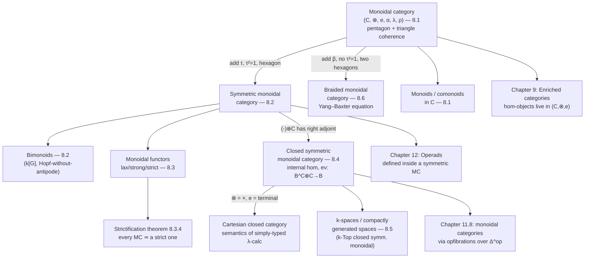

[[book-guidelines|↩ Back to guidelines]]

## Why monoidal categories at all?

You already know two "product-like" structures on $\mathrm{Sets}$: the cartesian product $\times$ and the disjoint union $\sqcup$. Both are associative and unital up to a canonical bijection — $(A\times B)\times C \cong A\times(B\times C)$, $\{*\}\times A \cong A$ — but neither is associative *on the nose* unless you go out of your way to define it that way (e.g. by fixing a specific encoding of ordered triples). The tensor product of vector spaces is the sharper version of the same phenomenon: $(U\otimes V)\otimes W$ and $U\otimes(V\otimes W)$ are not literally the same vector space — they're built from different underlying sets of formal symbols — but there's a unique, entirely canonical isomorphism between them, and every reasonable way of comparing longer tensor products via that isomorphism agrees.

This is Chapter 8's subject: axiomatize "there is a product-like bifunctor $\otimes$, together with associativity and unit isomorphisms that are canonical enough to be unambiguous," without demanding literal equality. The chapter needs this machinery because it recurs everywhere downstream — enriched categories (Chapter 9) replace hom-*sets* with hom-*objects in a monoidal category*; operads (Chapter 12) are defined *inside* a symmetric monoidal category; the whole apparatus of $E_\infty$-structures, group completion, and iterated loop spaces (Chapters 12–14) is a study of how monoidal/symmetric-monoidal structure interacts with homotopy.

**What breaks without coherence axioms.** If you only demand *some* isomorphism $\alpha_{C_1,C_2,C_3}:C_1\otimes(C_2\otimes C_3)\cong (C_1\otimes C_2)\otimes C_3$ for every triple of objects, with no compatibility condition, you get chaos: there could be two different ways to reassociate a four-fold tensor product $C_1\otimes(C_2\otimes(C_3\otimes C_4))$ into $((C_1\otimes C_2)\otimes C_3)\otimes C_4$ (one going through $(C_1\otimes(C_2\otimes C_3))\otimes C_4$, the other through $(C_1\otimes C_2)\otimes(C_3\otimes C_4)$), and nothing would force those two composite isomorphisms to agree. Definition 8.1.4's coherence axioms are precisely the minimal extra data needed to rule this out.

---

## 8.1 Monoidal Categories

### The strict case first

**Definition 8.1.1 (strict monoidal category).** $(C,\otimes,e)$: a category $C$, a functor $\otimes: C\times C \to C$, and an object $e$, satisfying literal functor equalities
$$
\otimes\circ(\otimes\times\mathrm{Id}) = \otimes\circ(\mathrm{Id}\times\otimes), \qquad \otimes\circ(e,\mathrm{Id}) = \otimes\circ(\mathrm{Id},e) = \mathrm{Id}.
$$
Unwound: $C_1\otimes(C_2\otimes C_3) = (C_1\otimes C_2)\otimes C_3$ *on the nose*, for objects and morphisms alike.

**Examples 8.1.2.** A monoid $M$, viewed as a discrete category with $\otimes = $ multiplication, is trivially strict monoidal. More interestingly: $(\mathrm{Fun}(D,D),\circ,\mathrm{Id}_D)$, the endofunctors of a small category $D$ under composition, is strict monoidal — composition of functors really is associative on the nose.

**Example 8.1.3 (the Eckmann–Hilton argument).** Take the one-object category $C_M$ whose single hom-set is the monoid $M$ (composition = the monoid's multiplication), and suppose $C_M$ is *also* equipped with a strict monoidal structure $\otimes$. Then $M$ carries two unital, associative operations — multiplication and $\otimes$ — and naturality of $\otimes$ as a functor $C_M\times C_M \to C_M$ gives the **interchange law**
$$
(m_1\otimes m_2)(m_3\otimes m_4) = (m_1 m_3)\otimes(m_2 m_4). \tag{8.1.1}
$$
A short computation (set $m_2=m_3=1_M$, then $m_1=m_4=1_M$, and use that $1_M = e$) shows the two operations coincide *and* are commutative: $m_2 m_3 = (1_M\otimes m_2)(m_3\otimes 1_M) = m_3\otimes m_2 = m_3 m_2$. This is the classical fact that "two unital magma structures on the same set, compatible via interchange, collapse to one commutative monoid" — Eckmann and Hilton used it to show $\pi_1$ of an H-space is abelian, and it's the same argument that shows higher homotopy groups $\pi_n$, $n\ge 2$, are always abelian (two compatible group structures on the same set — concatenation in two different directions — force commutativity).

**Grounding (Python — quick illustrative check).** The interchange law is easy to see fail to be automatic and easy to verify once you have two candidate operations:
```python
# Toy check of Eckmann-Hilton on Z with (+) and a second op "star"
# defined so interchange holds by construction: a*b = a+b (so they're equal already,
# illustrating the *conclusion*, not a nontrivial example).
def add(a, b): return a + b
def star(a, b): return a + b
assert add(star(1,2), star(3,4)) == star(add(1,3), add(2,4))  # interchange holds trivially
# The real content is: whenever interchange holds for genuinely *different* candidate
# operations sharing a unit, they must already be equal and commutative.
```

### The general (non-strict) case

**Definition 8.1.4 (monoidal category).** $(C,\otimes,e,\alpha,\lambda,\rho)$: a functor $\otimes:C\times C\to C$, an object $e$, and *natural isomorphisms*
$$
\alpha_{C_1,C_2,C_3}: C_1\otimes(C_2\otimes C_3)\xrightarrow{\ \cong\ }(C_1\otimes C_2)\otimes C_3,\qquad \lambda_C: e\otimes C\xrightarrow{\cong} C,\qquad \rho_C: C\otimes e\xrightarrow{\cong} C,
$$
subject to two coherence conditions:

1. **Pentagon axiom** (8.1.2): the two ways of reassociating a 4-fold product via $\alpha$ agree.
2. **Triangle axiom**: $\rho_{C_1}\otimes 1_{C_2} = (1_{C_1}\otimes\lambda_{C_2})\circ\alpha_{C_1,e,C_2}$ — the two ways of inserting and removing the unit in the middle of a 2-fold product agree.

**Mac Lane's coherence theorem** (cited as Remark 8.1.8, proved in [ML98, VII.2]) is the payoff: these *two* axioms suffice to guarantee that *every* formal diagram built out of instances of $\alpha,\lambda,\rho,\mathrm{id},\otimes$ commutes — you never need to check a bigger diagram by hand. This is structurally the same kind of theorem as a confluence/normalization result in rewriting theory: you have generators (the structural isomorphisms) and a finite set of relations (pentagon + triangle) that certify *global* consistency without an infinite checklist. If you've internalized how a confluent rewriting system lets you compare any two derivations by reducing both to normal form, this is the categorical analogue — reassociating a tensor product any two ways is "confluent" precisely because pentagon + triangle hold.

**Proposition 8.1.9 / Examples 8.1.10.** Any category with finite products is monoidal via $(\times,\text{terminal object})$; dually for finite coproducts. Concretely: $(\mathrm{Sets},\times,\{*\})$, $(\mathrm{Sets},\sqcup,\emptyset)$, $(\mathrm{vect}_K,\oplus,0)$, $(\mathrm{vect}_K,\otimes,K)$, $R$-bimodules under $\otimes_R$, and the category $\mathrm{Ch}(k)$ of unbounded chain complexes under the tensor product of chain complexes,
$$
(C_*\otimes C'_*)_n = \bigoplus_{p+q=n} C_p\otimes_k C'_q, \qquad d_\otimes(c\otimes c') = d_C(c)\otimes c' + (-1)^p c\otimes d_{C'}(c'),
$$
with unit the sphere complex $S^0(k)$ (concentrated in degree $0$). The sign in $d_\otimes$ — the **Koszul sign rule** — is the price of working with graded objects; it is exactly what later makes $\tau$ in Section 8.2 a *signed* swap.

Every monoidal category has an **underlying set functor** $C(e,-):C\to\mathrm{Sets}$ (Definition 8.1.12) — this generalizes "take a $k$-module and forget down to its underlying set," and for the monoidal category of groupoids under $\times$, it recovers "the set of objects with only identity morphisms."

### Monoids and comonoids internal to a monoidal category

**Definition 8.1.14 (monoid).** An object $M$ with $\mu\in C(M\otimes M,M)$ and $\eta\in C(e,M)$ satisfying associativity ($\mu\circ(\mu\otimes 1_M)\circ\alpha = \mu\circ(1_M\otimes\mu)$) and unit ($\mu\circ(\eta\otimes 1_M)=\lambda$, $\mu\circ(1_M\otimes\eta)=\rho$) laws.

This single definition, instantiated in different monoidal categories, recovers essentially every "multiplicative structure" you know:

| Monoidal category $(C,\otimes,e)$ | Monoid in $C$ |
|---|---|
| $(\mathrm{Sets},\times,\{*\})$ | ordinary monoid |
| $(\mathrm{Fun}(D,D),\circ,\mathrm{Id})$ | **monad** on $D$ (Chapter 6, revisited) |
| $(k\text{-mod},\otimes_k,k)$ | $k$-algebra |
| $(\mathrm{Ch}(k),\otimes,S^0(k))$ | differential graded $k$-algebra |

The DGA case is the one to sit with, because the associativity/unit axioms *force* a Leibniz rule on the differential: writing out that $\mu$ is a chain map gives $d_\otimes(a\otimes a') = d_{A_*}(a)\otimes a' + (-1)^p a\otimes d_{A_*}(a')$ for $a\in A_p$. Richter's worked example — a chain algebra over $\mathbb Z$ generated by $e$ in degree $1$ with $de=p$ and $e^4=0$ — shows $e^2$ is a nontrivial cycle even though $e$ isn't a cycle, because $d(e^2) = pe - pe = 0$ (the sign flips because $e$ has odd degree); the resulting homology is $\mathbb F_p$ concentrated in degree $2$. It's a small computation, but it's the prototype for every "differential meets multiplication" argument in homological algebra.

**Definition 8.1.17 (comonoid) / Definition 8.1.16 (monoid morphism).** Comultiplication $\Delta\in C(C,C\otimes C)$, coassociative and counital — literally "a monoid in $C^{op}$." A differential graded coalgebra is the comonoid case in $\mathrm{Ch}(k)$; the singular chain complex of a space, via the Alexander–Whitney diagonal approximation, is the motivating topological example.

**Grounding (Rust — primary).** The plain-`Sets` case of Definition 8.1.14 is exactly the `Monoid` trait you'd write for an associative, identity-bearing binary type:
```rust
trait Monoid {
    fn identity() -> Self;
    fn combine(&self, other: &Self) -> Self;
    // law (unchecked by the type system): combine is associative,
    // and combine(x, identity()) == combine(identity(), x) == x
}

impl Monoid for String {
    fn identity() -> Self { String::new() }
    fn combine(&self, other: &Self) -> Self { format!("{self}{other}") }
}
```
The monad case in the table above is worth re-reading against the earlier [[Monads-and-Comonads|Monads and Comonads]] article: "a monad is a monoid in the category of endofunctors" is not a slogan, it is *literally* Definition 8.1.14 applied to $(\mathrm{Fun}(D,D),\circ,\mathrm{Id})$ — $\mu:T\circ T\Rightarrow T$ and $\eta:\mathrm{Id}\Rightarrow T$ are precisely the monoid multiplication and unit, and the associativity/unit squares from that article are precisely the ones above, one categorical level up. If your compiler's elaborator has an internal "effect monad" for tactic state, this is the exact sense in which it is a monoid object, and the DGA-style Leibniz-rule reasoning above is the general pattern behind "does my effect's composition interact correctly with some auxiliary grading/cost/potential function."

---

## 8.2 Symmetric Monoidal Categories

**Definition 8.2.1 (symmetric monoidal category).** A monoidal category plus a natural isomorphism $\tau_{C_1,C_2}:C_1\otimes C_2\cong C_2\otimes C_1$ such that:

1. $\tau_{C_2,C_1}\circ\tau_{C_1,C_2}=1$ (swapping twice is the identity),
2. $\rho_C = \lambda_C\circ\tau_{C,e}$ (compatibility with the unit),
3. the **hexagon axiom**: $\tau$ is compatible with $\alpha$ around a six-sided diagram relating $(C_1\otimes C_2)\otimes C_3$, $C_3\otimes(C_1\otimes C_2)$, and $C_1\otimes(C_3\otimes C_2)$.

Almost every symmetric-looking example from 8.1.10 is genuinely symmetric monoidal — with one instructive twist: on $\mathrm{Ch}(k)$, the swap is *not* the naive $c\otimes c'\mapsto c'\otimes c$ but carries the **Koszul sign**,
$$
\tau_{C_*,C'_*}(c\otimes c') = (-1)^{pq}\, c'\otimes c, \qquad c\in C_p,\ c'\in C_q.
$$
(Exercise 8.2.4 asks you to check the naive swap *fails* to be natural/compatible with the differential — the sign is not decoration, it's required for $\tau$ to even be a chain map.)

**Definition 8.2.5 (permutative category)** is the strict analogue: a strict monoidal category with $\tau_{C_1,C_2}\circ\tau_{C_2,C_1}=1_{C_2\otimes C_1}$ and a hexagon-free compatibility condition with three-fold products, plus $\tau_{C,e}=1_C$. The skeleton of finite sets under disjoint union, and the categories $I$ (injections) and $\Sigma$ (bijections) built on it, are permutative — these are the diagram categories Chapter 14 uses to model iterated loop spaces.

**Commutative/cocommutative structure (Definition 8.2.6).** A monoid $M$ is *commutative* if $\mu\circ\tau_{M,M}=\mu$; dually for cocommutative comonoids. Ordinary commutative monoids, commutative $k$-algebras, and commutative DGAs (with the sign-twisted commutativity $\mu(a\otimes a') = (-1)^{pq}\mu(a'\otimes a)$) are all instances.

**Definition 8.2.8 (bimonoid).** An object $H$ that is simultaneously a monoid $(H,\mu,\eta)$ and a comonoid $(H,\Delta,\varepsilon)$, with $\Delta,\varepsilon$ required to be *morphisms of monoids* — i.e. $\Delta:H\to H\otimes H$ is compatible with multiplication once $H\otimes H$ is given the "obvious" monoid structure built by shuffling the middle two factors through $\tau$. The **group algebra** $k[G]$ is the canonical example: multiplication from the group, comultiplication $\Delta(g)=g\otimes g$ extended $k$-linearly, and the compatibility conditions are exactly what you'd check to confirm $k[G]$ is a (cocommutative, in general noncommutative) Hopf-algebra-without-antipode.

**What breaks without the sign/hexagon machinery.** If you try to symmetrize $\mathrm{Ch}(k)$ with the naive swap, associativity of $\otimes$ and compatibility with $d_\otimes$ silently break for odd-degree elements — you'd be claiming $(-1)^{pq}=1$ always, which is false. The hexagon axiom is the abstract shadow of "moving three things past each other one swap at a time should not depend on which two you swap first" — get it wrong and the symmetric group action on $n$-fold tensor powers (Remark 8.3.5, used pervasively for $\Sigma_n$-actions in Chapter 12's operad theory) stops being well defined.

---

## 8.3 Monoidal Functors

**Definition 8.3.1.** A **lax monoidal functor** $F:(C,\otimes,e_C)\to(D,\boxtimes,e_D)$ carries structure maps $\varphi_{C_1,C_2}:F(C_1)\boxtimes F(C_2)\to F(C_1\otimes C_2)$ (natural) and $\eta:e_D\to F(e_C)$, compatible with $\alpha,\lambda,\rho$. It is **strong** if $\varphi,\eta$ are isomorphisms, **strict** if they are identities. The symmetric refinement (Definition 8.3.2) additionally requires $\varphi$ to intertwine $\tau^C$ and $\tau^D$.

**Example 8.3.3.** $\mathbb Z\{-\}:\mathrm{Sets}\to\mathrm{Ab}$ (free abelian group) is strong symmetric monoidal: $\mathbb Z\{S\}\otimes\mathbb Z\{T\}\cong\mathbb Z\{S\times T\}$ naturally, sending $s\otimes t\mapsto (s,t)$. By contrast, the forgetful functor $\mathrm{Ab}\to\mathrm{Sets}$ (tensor product on the source, cartesian product on the target) is *not* strong monoidal — but the same forgetful functor *is* strong symmetric monoidal if you instead equip $\mathrm{Ab}$ with the *product* of groups, because a functor with a left adjoint automatically preserves products (an instance of the adjoint-functor/limit-preservation fact from Chapter 3).

**Proposition 8.3.4 (strictification).** Every monoidal category $C$ is monoidally equivalent to a strict one, $\mathrm{Str}(C)$ — built from *words* $(C_1,\ldots,C_n)$ of objects, with $\mathrm{Str}(C)((C_1,\ldots,C_n),(C_1',\ldots,C_m')) := C(F(C_1,\ldots,C_n), F(C_1',\ldots,C_m'))$ where $F$ fully-parenthesizes a word left-to-right. Concatenation of words is *literally* associative (it's just list concatenation), so all the coherence pain is absorbed once, into the isomorphism $F\circ G\cong \mathrm{Id}$, rather than being carried around forever.

This is the categorical parallel of a **normal-form / canonicalization pass** in a compiler or proof elaborator: rather than reasoning up to a possibly enormous coherence theorem every time you need to compare two differently-bracketed expressions, you push every object through a single normalizing functor ($G$, "parenthesize left-to-right") and compare normal forms, exactly as an elaborator normalizes terms before calling `isDefEq` rather than re-deriving definitional equality from scratch at every comparison. Mac Lane's coherence theorem is precisely what guarantees this normalization is *sound* — that no information is lost by always comparing strict representatives.

**Definition 8.3.7 (comonoidal functor)** and **Definition 8.3.8 (monoidal natural transformation)** dualize/refine the above; a strong monoidal functor is automatically strong comonoidal (the two structure maps are literally inverse to each other), and a natural transformation between lax monoidal functors is *monoidal* when it commutes with both $\varphi$ and $\eta$.

---

## 8.4 Closed Symmetric Monoidal Categories

**Definition 8.4.1.** $C$ is **closed** if $(-)\otimes C$ has a right adjoint $(-)^C$ for every $C$, i.e. there is a natural bijection
$$
C(A\otimes C, B) \;\cong\; C(A, B^C).
$$

This is *the* place in the chapter where the type-theorist's instinct should fire immediately: this is the categorical semantics of **currying**. Read $\otimes$ as "pairing" (product of contexts/arguments) and $B^C$ as "the type of functions from $C$ to $B$," and the bijection above says exactly: a function taking a pair $(A,C)$ and producing $B$ corresponds to a function taking $A$ alone and producing a function $C\to B$. Setting $A=B^C$ gives the **evaluation morphism** $\mathrm{ev}: B^C\otimes C\to B$ — the categorical shadow of function application.

**Definition 8.4.5 (cartesian closed category, CCC).** The special case where $\otimes=\times$ and $e$ is terminal. $\mathrm{Sets}$ is cartesian closed ($S^T = $ the set of functions $T\to S$, and the bijection above is literally the exponential law $S^{U\times T}\cong (S^T)^U$); so is $G\text{-}\mathrm{Sets}$, with $S^T$ built as $\mathrm{Sets}(T,S)$ under the conjugation action $(g.f)(t)=g.f(g^{-1}.t)$.

**Why this matters for a typed elaborator.** Cartesian closed categories are the standard categorical semantics of the *simply typed* $\lambda$-calculus: objects are types, morphisms $A\to B$ are (equivalence classes of) terms of type $A\to B$, $\times$ interprets product/pair types, and the closed structure's exponential $B^A$ interprets the function type $A\to B$, with the adjunction bijection *being* the currying isomorphism $\lambda$-abstraction relies on. When you generalize from $\mathrm{Set}$-based CCCs to a *dependent* type theory, the $\Pi$-type $\Pi_{x:A}B(x)$ is the fibered/indexed generalization of exactly this internal-hom adjunction — the object-level statement "closed monoidal category has internal homs" becomes, one level up, "a category with families/a locally cartesian closed category has dependent products." So closed monoidal categories are the non-dependent ancestor of the $\Pi$-types your elaborator needs to type-check, and the evaluation morphism $\mathrm{ev}$ is the semantic reading of $\beta$-reduction (apply a function to an argument).

**Definition 8.4.6 (Picard groupoid).** The invertible objects of $C$ (those $C'$ with $C\otimes C'\cong e$) and isomorphisms between them, itself symmetric monoidal. Example 8.4.7: invertible $k$-modules are exactly finitely-generated projective modules of rank one, with inverse the dual module — and this fact holds in *any* closed symmetric monoidal category, not just $k$-mod. When isomorphism classes of $\mathrm{Picard}(C)$ form a set, they assemble into the **Picard group** $\mathrm{Pic}(C)$ (Remark 8.4.8) — a genuine abelian group invariant of the monoidal category, which reappears in Chapter 13's classifying-space/group-completion machinery.

---

## 8.5 Compactly Generated Spaces

**What breaks without this section.** The category $\mathrm{Top}$ *is* closed symmetric monoidal (Pedicchio–Solimini), but its internal-hom object carries the pointwise-convergence topology, not the compact-open topology you actually want — mapping spaces behave badly, and a product of two CW complexes need not even be a CW complex unless one factor is locally compact. This is a "the naive category has the right shape but the wrong point-set behavior" problem, analogous to how a naive small-step operational semantics can have the right typing rules but fail progress/preservation on some corner case — you need a better-behaved subcategory.

**Definitions 8.5.1–8.5.13.** A subset $A\subset X$ is **$k$-closed** if $f^{-1}(A)$ is closed in $K$ for every continuous $f:K\to X$ from a compact Hausdorff $K$; $X$ is a **$k$-space** if every $k$-closed subset is genuinely closed. The **$k$-ification** $kX$ (same points, finer topology of $k$-closed sets) is a reflective localization: $k\text{-Top}\hookrightarrow \mathrm{Top}$ has $k(-)$ as a right adjoint (Lemma 8.5.5), so $k$-spaces form a reflective subcategory, and continuity out of a $k$-space can always be tested against maps from compact Hausdorff spaces (Lemma 8.5.6) — a useful "test-object" characterization structurally similar to how sheaf conditions are checked on a generating cover.

A space is **weak Hausdorff** if images of compact Hausdorff spaces are always closed; **compactly generated** ($\mathrm{cg}$) means weak-Hausdorff-and-$k$-space. The punchline (Theorem 8.5.16): for $k$-spaces $X,Y,Z$ there is a genuine homeomorphism
$$
k\mathrm{Top}(X,k\mathrm{Top}(Y,Z)) \cong k\mathrm{Top}(X\times_k Y, Z),
$$
i.e. $k$-Top (and its full subcategory $\mathrm{cg}$) is *actually* closed symmetric monoidal, with a mapping-space object that behaves the way you want. This is a genuinely topological, point-set-heavy argument with no natural Rust/Lean/Python code correspondent — the content is entirely in the point-set topology, so per the resolved style this section is reported rather than force-grounded in code. Its conceptual payoff (a badly-behaved category fixed by passing to a reflective subcategory with a "test object" characterization of the good objects) is the transferable idea, and it is exactly the same shape of fix used later for compactly generated *spectra* in stable homotopy theory.

---

## 8.6 Braided Monoidal Categories

**Definition 8.6.1.** Weaken symmetry: a **braiding** $\beta_{C_1,C_2}:C_1\otimes C_2\to C_2\otimes C_1$ satisfying *two* hexagon axioms (one for each way of moving $C_1$ or $C_2$ past a pair), but *without* requiring $\beta_{C_2,C_1}\circ\beta_{C_1,C_2}=1$. Concretely: think of a two-strand braid. Concatenating a braid with itself does *not* untwist it — you get a genuine double twist — yet the braid is still invertible (you can untwist it by braiding the opposite way). That is the entire conceptual content of "braided but not symmetric."

**Proposition 8.6.5 / the categorical Yang–Baxter equation.** In a strict braided monoidal category,
$$
(1_{C_3}\otimes\beta_{C_1,C_2})\circ(\beta_{C_1,C_3}\otimes 1_{C_2})\circ(1_{C_1}\otimes\beta_{C_2,C_3}) = (\beta_{C_2,C_3}\otimes 1_{C_1})\circ(1_{C_2}\otimes\beta_{C_1,C_3})\circ(\beta_{C_1,C_2}\otimes 1_{C_3}),
$$
the categorical shadow of the third braid-group relation (the two ways of braiding three strands past each other, one crossing at a time, agree). **Example 8.6.6** packages this cleanly: the braid groups $\mathrm{Br}_n$ assemble into a braided monoidal category $B$ (objects $=\mathbb N$, $B(n,m)=\mathrm{Br}_n$ if $n=m$ else $\emptyset$, $\oplus = +$), and this is genuinely braided, not symmetric — braiding twice really does give a nontrivial element of $\mathrm{Br}_n$. **Braided bialgebras** (Example 8.6.9, universal $R$-matrices) are the algebraic incarnation: an invertible $R\in H\otimes H$ satisfying $\tau\circ\Delta(h)=R\Delta(h)R^{-1}$ and two "hexagon" compatibility identities with $\Delta$, exactly encoding a braiding on the category of $H$-modules.

**Where this connects for automated reasoning.** Rewriting systems for braid-group elements (deciding whether two braid words represent the same braid) are a classical, nontrivial word-problem instance — structurally the same *kind* of question ("do these two composite morphisms, built from generators subject to relations, coincide?") as confluence-checking for a term-rewriting system or deciding equality of two proof terms up to a chosen set of definitional-equality rules. The categorical Yang–Baxter equation is literally a confluence-style critical-pair condition: it says the two ways of resolving "three strands crossing pairwise" via the local rewrite rule $\beta$ agree, the same shape of statement as a critical-pair lemma in a confluent rewriting system.

---

## Where this leads



Structurally, this chapter is the load-bearing wall between Part I's "pure" category theory and everything that follows: **Chapter 9** replaces hom-sets by hom-*objects in a closed symmetric monoidal category*, so nothing there makes sense without Sections 8.1–8.4; **Chapter 12**'s operads are literally "collections of multi-morphisms internal to a symmetric monoidal category," reusing Definition 8.1.14's monoid-internal-to-$C$ pattern one level up (an operad's associated monad, and algebras over it, generalize the monoid/monad correspondence you just saw); and Chapter 13's classifying-space and $K$-theory constructions need $\mathrm{Pic}(C)$ and the symmetric monoidal structure on $B\mathcal C$ set up here.

For the standing project (`type-theory` focus area): Section 8.4's closed monoidal categories are the *non-dependent ancestor* of the $\Pi$-types your elaborator will need to type-check and unify — the currying bijection $C(A\otimes C,B)\cong C(A,B^C)$ is the semantic content behind every occurrence of $\lambda$-abstraction and function application, and generalizing the fibered/indexed version of this adjunction is exactly what a locally-cartesian-closed-category semantics for dependent products looks like. Section 8.3's strictification theorem is worth remembering by name the next time you design a normalization pass for your elaborator: "prove a coherence theorem once, then always compare canonical/strict representatives" is precisely the trusted-kernel strategy of normalizing terms before calling `isDefEq`, rather than re-deriving definitional equality from first principles at every comparison. And Section 8.6's Yang–Baxter equation is a clean, small instance of a critical-pair/confluence condition — useful to have in your pocket as a template the next time you need to certify that a local rewrite rule is globally consistent.
