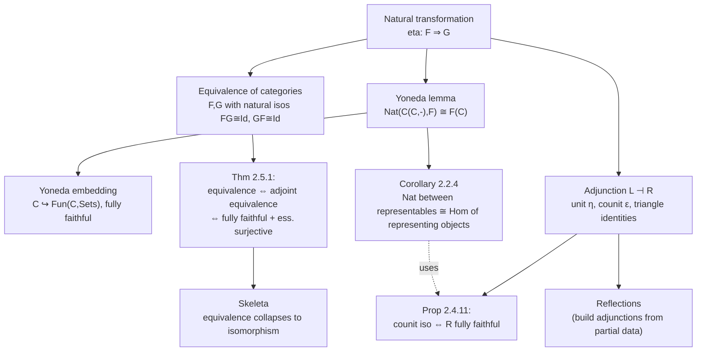

[[book-guidelines|↩ Back to guidelines]]

# Natural Transformations and the Yoneda Lemma

## Why this chapter exists

Chapter 1 gave you objects, morphisms, and functors — a way to compare *categories*. But as soon as you have two functors $F, G : \mathcal{C} \to \mathcal{C}'$ between the same pair of categories, a natural question appears: what does it mean to compare *them*? Functors are themselves structure-preserving maps, so "a morphism between functors" needs its own notion of structure-preservation. That notion is the natural transformation, and it is the single idea this whole chapter is built around — everything else (the Yoneda lemma, equivalences of categories, adjoint functors, skeleta) is a consequence of taking that idea seriously.

The payoff is enormous. Once you can compare functors, you can ask when a functor is "the same as" the operation of mapping-out-of (or into) a fixed object — that's representability, and the Yoneda lemma is the theorem that makes this precise. From there, adjoint functors — the "free/forgetful" pattern you already know informally from programming — get a rigorous, checkable definition. This is the machinery a compiler engineer eventually meets again as *definitional equality up to natural isomorphism*, and as the categorical skeleton underneath elaboration.

---

## 2.1 Natural transformations: comparing functors pointwise, coherently

### The motivating example

Richter opens with the connecting homomorphism from singular homology, $\delta: H_n(X,A) \to H_{n-1}(A)$. For a fixed $n$, this is not one map — it's a *family* of maps, one for every pair of spaces $(X,A)$. What makes this family more than an arbitrary collection is that it's compatible with every morphism of pairs $f:(X,A)\to(Y,B)$: pushing forward and then connecting gives the same answer as connecting and then pushing forward. That compatibility square is the whole idea, stripped of homology-specific content:

$$
\eta_{C_2} \circ F(f) = G(f) \circ \eta_{C_1}
$$

**Definition 2.1.1.** A natural transformation $\eta: F \Rightarrow G$ between functors $F, G: \mathcal{C} \to \mathcal{C}'$ is a family of morphisms $\eta_C \in \mathcal{C}'(F(C), G(C))$ (the *components*) such that for every $f \in \mathcal{C}(C_1, C_2)$ the square above commutes. If every component is an isomorphism, $\eta$ is a **natural isomorphism**.

**What breaks without naturality.** Suppose you only demanded a family of morphisms $\eta_C: F(C) \to G(C)$, one per object, with no compatibility condition. You'd get nothing useful: you could pick components completely independently of each other, and there would be no sense in which the family "respects" the structure of $\mathcal{C}$. The double-dual map for vector spaces, $\iota_V: V \to V^{**}$, is the classic illustration of why this matters: it's natural (it commutes with every linear map $f: V \to W$ via $\iota_W \circ f = f^{**} \circ \iota_V$), whereas the *choice of basis isomorphism* $V \cong V^*$ is not — you can't make it commute with an arbitrary linear map, only with isomorphisms compatible with your chosen bases. "Naturality" is precisely the formal way of saying "canonical, basis-free, without arbitrary choices."

### Vertical and horizontal composition

Natural transformations compose in two genuinely different ways, and conflating them is a common source of confusion, so it's worth being precise from the start.

- **Vertical composition** ($\nu \circ_1 \eta$): given $\eta: F \Rightarrow G$ and $\nu: G \Rightarrow H$ (same pair of categories, functors stacked "on top of each other"), $(\nu \circ_1 \eta)_C := \nu_C \circ \eta_C$. This is ordinary composition of morphisms in $\mathcal{C}'$, done componentwise.
- **Horizontal composition** ($\psi \circ_0 \eta$): given $\eta: F \Rightarrow G$ ($F,G: \mathcal{C}\to\mathcal{D}$) and $\psi: F' \Rightarrow G'$ ($F',G':\mathcal{D}\to\mathcal{E}$), you get $\psi \circ_0 \eta: F' \circ F \Rightarrow G' \circ G$, built from the square
$$
\begin{array}{ccc}
F'(F(C)) & \xrightarrow{\psi_{F(C)}} & G'(F(C)) \\
{\scriptstyle F'(\eta_C)}\downarrow & & \downarrow{\scriptstyle G'(\eta_C)} \\
F'(G(C)) & \xrightarrow{\psi_{G(C)}} & G'(G(C))
\end{array}
$$
which commutes precisely *because* $\psi$ is natural (applied to the morphism $\eta_C$).

These two operations interact via the **interchange law**:
$$
(\nu' \circ_1 \eta') \circ_0 (\nu \circ_1 \eta) = (\nu' \circ_0 \nu) \circ_1 (\eta' \circ_0 \eta). \tag{2.1.1}
$$
Richter notes this is the same interchange phenomenon that forces higher homotopy groups $\pi_n(X,x_0)$, $n \ge 2$, to be abelian (the Eckmann–Hilton argument) — two compatible composition laws on the same set of "cells" collapse into a single commutative one. It's worth internalizing this as a recurring shape: whenever you have a 2-dimensional composition structure (functors and natural transformations between them form exactly this — this is the **2-category cat**), interchange is not optional, it's forced.

**Grounding (Rust).** The vertical/horizontal distinction maps cleanly onto trait objects and generic functions:

```rust
// F, G, H : C -> D as "object-mapping + morphism-mapping" functors.
// A natural transformation is a family indexed by objects of C.
trait NatTransform<F, G> {
    // eta_C : F(C) -> G(C), for every object type C in the source category
    fn component<C>(&self) -> Box<dyn Fn(F::Applied<C>) -> G::Applied<C>>
    where
        F: Functor,
        G: Functor;
}

// Vertical composition: compose the *value-level* morphisms component-wise.
fn vertical_compose<F, G, H>(
    eta: impl NatTransform<F, G>,
    nu: impl NatTransform<G, H>,
) -> impl NatTransform<F, H> {
    // (nu . eta)_C := nu_C ∘ eta_C
    todo!()
}
```
The naturality *square* itself is the thing Rust's type system can't check for you — it's a proof obligation about behavior, not about types, so this is exactly the kind of property a refinement-type layer or an embedded prover would need to discharge as a side condition on a `NatTransform` implementation.

**Grounding (Lean).** Lean's own category theory library (`Mathlib.CategoryTheory.NatTrans`) defines this literally as a structure with a naturality field:
```lean
structure NatTrans (F G : C ⥤ D) where
  app : ∀ X, F.obj X ⟶ G.obj X
  naturality : ∀ {X Y} (f : X ⟶ Y),
    F.map f ≫ app Y = app X ≫ G.map f := by aut_cat
```
This is worth dwelling on precisely because it's a template for how *your* elaborator will eventually need to represent "structure plus a coherence proof obligation" — a natural transformation is a dependent record whose second field's *type* depends on the value of the first (`naturality`'s statement quantifies over the already-chosen `app`). This is the same shape as a Σ-type pairing a term with a proof about that term.

---

## 2.2 The Yoneda lemma: an object is exactly what maps into (or out of) it

### The setup: representable functors

**Definition 2.2.1.** A functor $F: \mathcal{C} \to \mathrm{Sets}$ is **representable** if there is an object $C$ and a natural isomorphism $\eta: \mathcal{C}(C,-) \Rightarrow F$. The pair $(C, \eta)$ is a **representation** of $F$.

The intuition to hold onto: $\mathcal{C}(C,-)$ is the functor "all morphisms out of $C$." Saying $F$ is representable means $F$'s values are, up to a coherent relabeling, exactly the morphisms out of some fixed object. This is a strong structural claim — it says $F$ has no content beyond what $\mathcal{C}$'s own morphism structure already provides.

### The theorem itself

**Theorem 2.2.2 (Yoneda lemma).** For a category $\mathcal{C}$ and functor $F: \mathcal{C} \to \mathrm{Sets}$:

1. For each object $C$, there is a bijection $Y(F,C): \mathrm{Nat}(\mathcal{C}(C,-), F) \xrightarrow{\sim} F(C)$.
2. These bijections are natural in $C$.
3. If $\mathcal{C}$ is small, they are natural in $F$ as well.

**The mechanism (this is the part worth understanding, not memorizing).** The bijection sends a natural transformation $\eta$ to the single element $\eta_C(1_C) \in F(C)$. This looks almost too simple to be useful — but the inverse direction is where the power lives. Given a single element $x \in F(C)$, you reconstruct an *entire natural transformation* $\tau(F,C)_x: \mathcal{C}(C,-) \Rightarrow F$ by setting
$$
\tau(F,C)_{x,C'}(f) := F(f)(x) \quad \text{for } f \in \mathcal{C}(C,C').
$$
In words: you push $x$ forward along $f$ using $F$'s action on morphisms. Naturality of $\tau(F,C)_x$ is not an extra assumption — it's automatic from $F$ being a functor (functoriality of $F$ *is* the naturality square, just read differently). This is the "what breaks without it" moment: if $F$ weren't functorial — if $F(g \circ f) \ne F(g) \circ F(f)$ — then $\tau(F,C)_x$ wouldn't be well-defined as a natural family at all, because the diagram used in the proof (`$F(g)\circ\tau_{x,C'}(f) = F(g\circ f)(x) = \tau_{x,C''}(g\circ f)$`) would simply fail.

**Why this matters (Remark 2.2.3 / Corollary 2.2.4).** The slogan "an object is determined by its morphisms" becomes precise: $\mathrm{Nat}(\mathcal{C}(C,-),\mathcal{C}(C',-)) \cong \mathcal{C}(C',C)$. Natural transformations between representable functors correspond *exactly* to morphisms of the representing objects — nothing is lost, nothing is gained. And if two objects represent the same functor (Lemma 2.2.5), those objects are isomorphic, and the isomorphism is itself forced by the data (constructed as $\eta_C^{-1}(\tau_C(1_C))$).

### The Yoneda embedding

Theorem 2.2.7 upgrades this to a statement about the whole category: the functor
$$
Y: \mathcal{C}^{op} \to \mathrm{Fun}(\mathcal{C}, \mathrm{Sets}), \qquad Y(C) = \mathcal{C}(C,-)
$$
is **fully faithful**, and $\mathcal{C}(C,-) \cong \mathcal{C}(C',-)$ if and only if $C \cong C'$. This means $\mathcal{C}$ embeds, without loss of any categorical information, into its own (typically much larger) category of presheaves. Every category can be studied as if it were a category of set-valued functors on itself — this single fact underlies an enormous amount of later category theory (presheaf toposes, the co-Yoneda lemma in Chapter 5, Day convolution in Chapter 9).

**The topological payoff.** Richter's worked application is genuinely load-bearing for algebraic topology: singular cohomology $X \mapsto H^n(X;A)$ is representable by an Eilenberg–Mac Lane space $K(A,n)$ (via $H^n(X;A) \cong [X, K(A,n)]$), and *cohomology operations* — natural transformations between such representable functors — correspond by Corollary 2.2.4 to actual maps $[K(A,n), K(B,m)]$. For $A = B = \mathbb{F}_p$, the collection of all such operations *is* the Steenrod algebra. This is Yoneda's abstract nonsense cashing out as one of the most important concrete objects in algebraic topology.

**Grounding (Lean — primary here, this is unification's ancestor).** The Yoneda lemma's proof mechanism — "a natural transformation out of a representable functor is uniquely determined by where it sends the identity morphism" — is structurally identical to how a metavariable gets resolved in a bidirectional elaborator: a single canonical witness (here, $\eta_C(1_C)$; in an elaborator, a metavariable's solution) determines an entire family of derived behavior by naturality/substitution. Lean's own `Yoneda` file (`Mathlib.CategoryTheory.Yoneda`) literally constructs this as an isomorphism of functors:
```lean
def yonedaEquiv {C : Type*} [Category C] {X : C} {F : Cᵒᵖ ⥤ Type*} :
    (yoneda.obj X ⟶ F) ≃ F.obj (op X) :=
  { toFun := fun η => η.app (op X) (𝟙 X)
    invFun := fun x => { app := fun Y f => F.map f.op x }
    ... }
```
Compare `toFun`/`invFun` directly against Richter's `Y(F,C)` and `τ(F,C)_x` — they are the same two maps. The general point to carry forward: **whenever your own elaborator reconstructs a full substitution instance from a single metavariable assignment, you are running a Yoneda-style argument**, whether or not the code names it that way — this is exactly the "book's own machinery doing unification's job without naming it" pattern flagged as a thread worth surfacing.

**Grounding (Rust).** A concrete, checkable instance: for $\mathcal{C} = \mathrm{Set}$ and $F(C) = \mathrm{Vec}\langle C\rangle$ (finite lists), $\mathrm{Nat}(\mathrm{Hom}(C,-), \mathrm{Vec}\langle-\rangle) \cong \mathrm{Vec}\langle C\rangle$ says: a polymorphic function `fn f<C2>(g: impl Fn(C) -> C2) -> Vec<C2>` (natural in `C2`) is completely determined by `f(id)`, a single `Vec<C>`. This is *parametricity* — "theorems for free" — dressed in categorical language; Rust's trait system enforces the naturality for you here because a truly generic function over `C2` has no way to inspect `C2` and act specially.

---

## 2.3 Equivalences of categories

Isomorphism of categories (an actual inverse functor, on the nose) is usually too strict — just as in topology, homeomorphism is often the wrong equivalence and homotopy equivalence is the useful one.

**Definition 2.3.1.** $F: \mathcal{C} \to \mathcal{C}'$ is an **equivalence of categories** if there is $G: \mathcal{C}' \to \mathcal{C}$ with natural isomorphisms $\mathrm{Id}_{\mathcal{C}} \cong G \circ F$ and $F \circ G \cong \mathrm{Id}_{\mathcal{C}'}$ — *not* actual identities, only natural isomorphisms.

The worked example (translation category $E_G \simeq [0]$) is instructive: $E_G$ has $|G|$ objects, and $[0]$ has one, so they are certainly not isomorphic as categories, yet the round-trip functor $F \circ P$ sends every morphism $h: g \to hg$ in $E_G$ to $e: e \to e$ — not the identity, but naturally isomorphic to it via $\eta_g := (g: e \to g)$, which is exactly the assertion that "up to coherent relabeling of objects, nothing is lost."

---

## 2.4 Adjoint pairs of functors

### Definition and the free/forgetful pattern

**Definition 2.4.1.** An adjunction between $\mathcal{C}$ and $\mathcal{C}'$ is a pair $L: \mathcal{C} \to \mathcal{C}'$, $R: \mathcal{C}' \to \mathcal{C}$ together with a bijection
$$
\varphi_{C,C'}: \mathcal{C}'(L(C), C') \xrightarrow{\sim} \mathcal{C}(C, R(C'))
$$
natural in both variables. $L$ is left adjoint to $R$; written $L \dashv R$.

This is the categorical skeleton of a pattern every programmer already knows informally: free constructions are left adjoint to forgetful functors. The free abelian group functor $\mathrm{Fra}$ is left adjoint to the underlying-set functor $U$ because "a function from a set $S$ into (the underlying set of) an abelian group $A$" is in natural bijection with "a group homomorphism from $\mathrm{Fra}(S)$ to $A$" — you can always extend a set-function to the unique structure-preserving map from the free object.

### Unit, counit, and the triangle identities — the load-bearing part

**Proposition 2.4.6** reformulates the adjunction without reference to the bijection $\varphi$ at all: $L \dashv R$ if and only if there are natural transformations
$$
\eta: \mathrm{Id} \Rightarrow R \circ L \quad (\text{unit}), \qquad \varepsilon: L \circ R \Rightarrow \mathrm{Id} \quad (\text{counit})
$$
satisfying the **triangle identities**
$$
\varepsilon_L \circ L(\eta) = \mathrm{Id}_L, \qquad R(\varepsilon) \circ \eta_R = \mathrm{Id}_R.
$$

This is worth sitting with, because it's the single most reused piece of categorical machinery for anyone building an elaborator: **the unit is "wrap," the counit is "run/extract," and the triangle identities are exactly the two ways of composing wrap-then-run that must both collapse to a no-op.** If you've implemented `return`/`join` for a monad in Rust or Haskell, you have already implemented one half of an adjunction's unit/counit data (a monad is what you get by composing an adjunction as $R \circ L$ — this is made completely explicit in Chapter 6).

**What the counit tells you about the right adjoint (Proposition 2.4.11) is the genuinely sharp result:**
- $R$ is **faithful** $\iff$ every component $\varepsilon_{C'}: LR(C') \to C'$ is an epimorphism.
- $R$ is **full** $\iff$ every $\varepsilon_{C'}$ has a left inverse.
- $R$ is **fully faithful** $\iff$ every $\varepsilon_{C'}$ is an isomorphism.

This is a genuinely useful diagnostic: instead of checking fullness/faithfulness of $R$ directly (a statement about all hom-sets), you check a single structural property of the counit's components at every object. The proof runs straight through the Yoneda lemma (Lemma 2.2.8) — another instance of "Yoneda as the universal translation device between morphism-level and object-level statements."

### Reflections: how you actually build an adjunction from partial data

**Definition 2.4.13.** A **reflection** of $D \in \mathcal{D}$ at $F: \mathcal{C}\to\mathcal{D}$ is a pair $(G_D, \eta_D: D \to F(G_D))$ universal among morphisms from $D$ into the image of $F$: for every $g: D \to F(C)$, there's a unique $f: G_D \to C$ factoring $g$ through $\eta_D$.

This is the practical construction recipe: you rarely get to write down an adjunction's natural bijection directly. Instead (Lemma 2.4.15, Proposition 2.4.16) you exhibit a reflection object-by-object, and the universal property alone forces functoriality of $L$ and forces $L \dashv F$ — the uniqueness clauses in the reflection's defining property are doing all the work of proving $L(k \circ h) = L(k) \circ L(h)$. A **reflective subcategory** (Definition 2.4.17) is exactly a subcategory where the inclusion has a left adjoint — e.g. $\mathrm{Ab} \hookrightarrow \mathrm{Gr}$ is reflective via abelianization, because $\mathrm{Gr}(G,A) \cong \mathrm{Ab}(G/[G,G], A)$.

**Grounding (Rust) — reflections as trait-bound generic construction.** A reflection is precisely the shape of a "smallest/most general instance satisfying a constraint" pattern:
```rust
// Reflection of D at F : given a target D, produce the *universal*
// object G_D together with a map D -> F(G_D), such that any other
// map D -> F(C) factors uniquely through it.
trait Reflection<D, F> {
    type GD;
    fn unit(d: &D) -> F::Applied<Self::GD>;
    // Universal property: for any C and g: D -> F(C), a unique
    // f: G_D -> C exists with F(f) . unit(d) == g.
    fn factor<C>(d: &D, g: impl Fn(&D) -> F::Applied<C>) -> Box<dyn Fn(Self::GD) -> C>;
}
```
This is the same shape as "type inference produces the *most general* type, and any other valid typing factors through it via a substitution" — the free/forgetful adjunction pattern is, quite literally, principal-type inference viewed categorically.

**Grounding (Lean).** `Mathlib.CategoryTheory.Adjunction.Basic` defines exactly `unit`/`counit`/triangle identities as Richter does:
```lean
structure Adjunction (F : C ⥤ D) (G : D ⥤ C) where
  unit : 𝟭 C ⟶ F ⋙ G
  counit : G ⋙ F ⟶ 𝟭 D
  left_triangle : F.map ... -- ε_F ∘ F(η) = id
  right_triangle : ...      -- G(ε) ∘ η_G = id
```
Lean's elaborator itself is built on a chain of adjunction-like reflections: elaborating a term against an expected type is (informally) finding the universal solution to "produce a term of type matching this expectation," with metavariable assignment playing the role of the reflection's unique factoring morphism.

---

## 2.5 Equivalences via adjoint functors — closing the loop

**Theorem 2.5.1** ties together everything so far: for $F: \mathcal{C} \to \mathcal{D}$, the following are equivalent:

1. $F$ has a left adjoint $L$, and both unit and counit are natural *isomorphisms*.
2. There exists $L$ with $\mathrm{Id} \cong FL$ and $LF \cong \mathrm{Id}$ (any natural isomorphisms, not necessarily unit/counit).
3. $F$ is fully faithful and essentially surjective.

The proof of $(3) \Rightarrow (1)$ is where reflections earn their keep: given full faithfulness and essential surjectivity, you build $L(D)$ by *choosing* a preimage object up to isomorphism, then use fully-faithfulness of $F$ to show every such choice assembles into a genuine reflection (hence a genuine adjoint) — the axiom of choice is doing real work here, silently, in "for every object $D$, choose $C$ with $D \cong FC$."

This theorem is the reason "fully faithful + essentially surjective" is *the* practical criterion for recognizing an equivalence — you never have to exhibit the inverse functor and its natural isomorphisms directly; you check two much more local conditions and get the rest for free.

---

## 2.6 Skeleta of categories

**Definition 2.6.1.** A category is **reduced** if isomorphic objects are literally identical. A **skeleton** is a reduced full subcategory that is an equivalence.

The point of skeleta is to make equivalence checkable as isomorphism: **Lemma 2.6.3** shows that for reduced categories, equivalence of categories collapses to isomorphism of categories — full faithfulness plus essential surjectivity, restricted to a setting with no distinct-but-isomorphic objects to conflate, forces an honest bijection on objects. Every category has a skeleton (**Proposition 2.6.4**, using the axiom of choice to pick one representative per isomorphism class), and **Corollary 2.6.5** gives the clean summary: two categories are equivalent iff their skeleta are isomorphic. This is the categorical version of "normalize, then compare for syntactic equality" — a pattern that should look familiar from definitional-equality checking, where you reduce two terms to normal form and then compare them literally.

---

## Structural summary



## Where this leads

This chapter's machinery is used everywhere downstream in the book: Chapter 3's colimits/limits are defined as adjoints to the constant-diagram functor $\Delta$ (so "left adjoints preserve colimits" is literally Proposition 2.4.6 plus naturality); Chapter 4's Kan extensions are built as adjoints to precomposition, and Mac Lane's "all concepts are Kan extensions" slogan reduces limits, colimits, the Yoneda lemma, *and* adjunctions themselves to one construction; Chapter 5's co-Yoneda lemma and density results are direct generalizations of §2.2; and Chapter 9's enriched Yoneda lemma re-derives everything here with hom-*objects* replacing hom-*sets*.

For the standing project (`type-theory` focus area): the Yoneda lemma's core mechanism — reconstructing a whole natural family from one canonical witness — is the same shape your metavariable unifier will lean on when resolving implicit arguments: a single principal solution, and every other valid instance factors through it uniquely, exactly as in Proposition 2.4.16's reflections. The unit/counit/triangle-identity package is worth memorizing cold, since Chapter 6 shows every monad (the structure underlying your elaborator's error/state handling, and eventually the Kleisli-style sequencing of constraint generation) arises as $R \circ L$ for exactly such an adjunction — so definitional equality, monadic elaboration, and adjunctions are, at bottom, three views of the same triangle identities.
