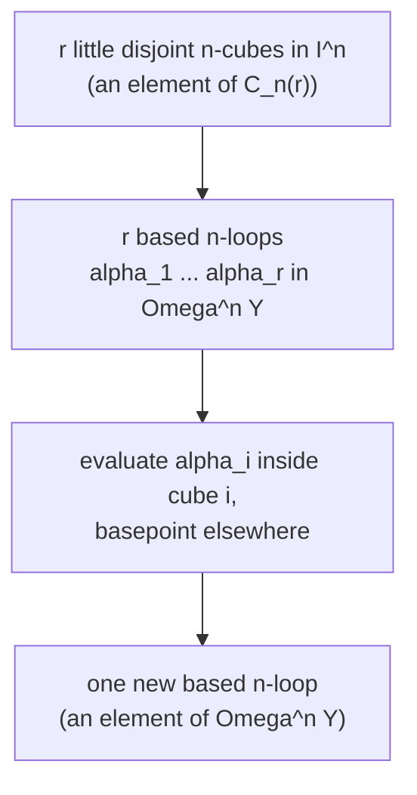

[[book-guidelines|↩ Back to guidelines]]

# Operads and Their Algebras

## Why you need this machine at all

Suppose you have a topological space $X$ and you want to say "$X$ carries a product that's associative and commutative, but only up to homotopy." A based loop space $\Omega Y$ is [[Natural-Transformations-and-the-Yoneda-Lemma#The motivating example|the motivating example]]: you can concatenate two loops, $(x * y)(t)$, and the result is homotopic to $x*(y*x)$ reparametrized... no wait, it's associative up to a homotopy, not on the nose. If you try to encode "associative up to homotopy" naively — just an operation plus a single homotopy witnessing $(xy)z \simeq x(yz)$ — you immediately run into a coherence problem: for four elements there are five ways to parenthesize a product, and you need homotopies between homotopies that themselves satisfy compatibility conditions, and this escalates without bound as the number of factors grows.

**What breaks without a systematic bookkeeping device:** if you try to write down, ad hoc, "the homotopy for 3 factors," "the higher homotopy for 4 factors," "the still-higher one for 5 factors," you either drown in size or you accidentally impose contradictory coherence conditions. You need one gadget that *organizes all possible input operations, of every arity, plus all the ways they compose,* and guarantees the coherence automatically. That gadget is an **operad**. This is exactly the historical motivation: Boardman, Vogt, and May introduced operads in the 1970s specifically to get a systematic handle on the homotopy type of iterated loop spaces $\Omega^n X$ (Richter, p. 285).

The other half of the payoff, which is the part that will matter most for anyone thinking about compilers and type systems, is that an operad is really a **multi-sorted algebraic signature with a built-in composition/substitution law**, together with symmetric-group actions that track "the operation doesn't care about argument order unless you tell it to." An algebra over an operad is then "an interpretation of that signature" — precisely the free-term / evaluator relationship that shows up whenever you build an AST for a DSL and then write an interpreter for it. Keep that analogy in your pocket; it becomes exact in §12.2.1.

## The picture before the symbols

Think of an element $w_m \in O(m)$ as a machine with $m$ input slots and one output:

```
  1   2  ...  m
   \  |      /
    \ |     /
     [ w_m ]
       |
     output
```

You can *stack* machines: feed the outputs of $n$ machines $w_{k_1}, \dots, w_{k_n}$ (with $k_1, \dots, k_n$ inputs respectively) into the $n$ input slots of a machine $w_n$, producing one combined machine with $k_1 + \cdots + k_n$ inputs and one output. That stacking operation — "plug outputs into inputs, then treat the composite as itself a single machine" — is exactly what the operad's composition morphism $\gamma$ formalizes. Everything else in [[Simplicial-Objects-and-Simplicial-Sets#The definition|the definition]] (associativity of $\gamma$, a unit machine that does nothing, and equivariance under relabeling inputs) is just the precise bookkeeping that makes "stack machines together" behave consistently no matter how you group the stacking or permute the wires.

## The formal definition

Fix a symmetric monoidal category $(C, \otimes, e, \tau)$ (associativity isomorphisms are suppressed by the coherence theorem — you can pretend $C$ is strict, i.e. permutative, without losing anything).

**Definition 12.1.1.** An **operad** $O$ in $C$ is:
- a collection of objects $O(n) \in C$ for $n \in \mathbb{N}_0$ (the object $O(n)$ is called the **$n$-ary part** — it's "the space/module/complex of $n$-input operations"),
- a unit morphism $\eta : e \to O(1)$,
- a right $\Sigma_n$-action on $O(n)$ for every $n$ (permuting the $n$ input wires),
- composition morphisms
$$
\gamma : O(n) \otimes O(k_1) \otimes \cdots \otimes O(k_n) \to O(k_1 + \cdots + k_n), \qquad n \ge 1,\ k_i \ge 0,
$$

subject to three axiom families, each of which is the formal translation of one intuition about stacking machines:

1. **Associativity.** Composing three layers of machines in either grouping order gives the same result — you can prove this by chasing the "shuffle" isomorphism that reindexes the tensor factors when several inner machines feed into one outer slot.
2. **Unitality.** Feeding the unit machine $\eta(e) \in O(1)$ into a slot, or plugging a machine into a solitary unit slot, does nothing: $O(n) \otimes e^{\otimes n} \cong O(n)$ and $e \otimes O(k) \cong O(k)$ commute correctly with $\gamma$.
3. **Equivariance** (two conditions). $\gamma$ is compatible with *permuting which machine goes in which outer slot* (condition (1): $\sigma \in \Sigma_n$ acting on the $n$ outer inputs corresponds to acting by the "blockwise" permutation $\sigma(k_1,\dots,k_n) \in \Sigma_k$ on the composite), and with *permuting the wires inside each inner machine independently* (condition (2): $\tau_1 \oplus \cdots \oplus \tau_n \in \Sigma_{k_1+\cdots+k_n}$, the block-concatenation of independent permutations of each inner machine's inputs).

**What breaks without equivariance specifically:** without it, you could not talk about *commutative* structures at all — commutativity is precisely the statement that the $\Sigma_n$-action on $O(n)$ becomes trivial (see $\mathrm{Com}$ below), and without equivariance axioms tying the group action to composition, "trivial action" wouldn't propagate consistently through nested composites.

A **morphism of operads** $f: O \to P$ is a $\Sigma_n$-equivariant family $f(n): O(n) \to P(n)$ respecting $\eta$ and $\gamma$ (Definition 12.1.5). Operads in $C$ form a category.

### The three founding examples

- **The endomorphism operad** $\mathrm{End}_C(A)$, for $A$ an object of a *closed* symmetric monoidal $C$: $\mathrm{End}_C(A)(n) := C(A^{\otimes n}, A)$, the internal-hom object of $n$-ary operations on $A$. Composition is literal function composition; $\Sigma_n$ permutes the domain $A^{\otimes n}$. This is the operad you should think of first, because — as you'll see in §12.2 — *every* operad action factors through it. It is the "trait object" of the theory: the operad of everything you could possibly do to $A$.
- **The associative operad $\mathrm{As}$**: in $\mathrm{Sets}$, $\mathrm{As}(n) = \Sigma_n$ (with $\Sigma_0, \Sigma_1$ both trivial), with $\gamma$ determined by the equivariance axiom. Transportable to $\mathrm{Top}$ (discrete spaces) or to $k\text{-mod}$ (free module $k\{\Sigma_n\}$).
- **The commutative operad $\mathrm{Com}$**: $\mathrm{Com}(n) = \{*\}$ (or its free-module transport, $k\cdot *$), trivial $\Sigma_n$-action. Any operad $O$ in $\mathrm{Sets}$ has a unique morphism $O \to \mathrm{Com}$ (Example 12.1.6) — a fact that becomes load-bearing later as the *augmentation* used to define $E_\infty$-operads.

$O(0)$ deserves a name of its own: it's the *nullary* operation, i.e. "a machine with zero inputs" that lets you contract/discard an input slot (Remark 12.1.3). An operad is **unital** if $O(0) \cong e$ (Definition 12.1.4); the induced map $\varepsilon(n): O(n) \to O(0) \cong e$ is called the operad's **augmentation**.

## Algebras over an operad

This is where the machine becomes useful: an operad by itself is just a signature. An **algebra over $O$** (an $O$-algebra) is an object $A \in C$ equipped with **action maps** $\theta_n \in C(O(n) \otimes A^{\otimes n}, A)$ — "run the $n$-ary operation $O(n)$ on $n$ actual elements of $A$" — that are associative, unital, and equivariant with respect to $\gamma$ and the $\Sigma_n$-actions (Definition 12.2.1). Concretely: a $\Sigma_n$-orbit representative $w \in O(n)$ together with $a_1, \dots, a_n \in A$ produces $\theta_n(w; a_1, \dots, a_n) \in A$, and composing operad elements before evaluating must agree with evaluating and then composing.

- **Monoids in $C$** are precisely $\mathrm{As}$-algebras: for $C = k\text{-mod}$, $\theta_n(e_\sigma; a_1 \otimes \cdots \otimes a_n) = a_{\sigma^{-1}(1)} \cdots a_{\sigma^{-1}(n)}$ — the action of the $\sigma$-summand of $\mathrm{As}(n) = k\{\Sigma_n\}$ is literally "multiply the factors in this particular order."
- **Commutative monoids in $C$** are precisely $\mathrm{Com}$-algebras — equivariance for the *trivial* $\Sigma_n$-action on $\mathrm{Com}(n)$ forces $\theta_n \circ \sigma = \theta_n$ for every $\sigma$, i.e. $a_{\sigma^{-1}(1)}\cdots a_{\sigma^{-1}(n)} = a_1\cdots a_n$: commutativity, read off directly from the operad's equivariance axiom rather than imposed separately.

**Exercise 12.2.4** states the fact that makes the endomorphism operad prototypical: giving $A$ an $O$-algebra structure is *equivalent* to giving a morphism of operads $O \to \mathrm{End}_C(A)$. Every algebra structure is "interpret each abstract $n$-ary operation as a concrete function on $A$," and that's exactly a map into the operad of all possible functions on $A$.

**Lemma 12.2.6** (functoriality under lax monoidal functors): if $F: C \to D$ is lax symmetric monoidal, it carries any operad $O$ in $C$ to an operad $F(O)$ in $D$, and any $O$-algebra to an $F(O)$-algebra. This is the transport mechanism used repeatedly in §12.3 to move the Barratt–Eccles operad from small categories, to simplicial sets, to topological spaces, to chain complexes — one construction, four target categories, via the nerve, geometric realization, and normalization functors, each lax symmetric monoidal.

### The monad associated with an operad — the free-algebra construction

Assume now $C$ is closed and cocomplete (so $(-)\otimes C$ commutes with colimits). Given an operad $O$ and any object $X \in C$, define

$$
F_O(X) := \coprod_{n \ge 0} O(n) \otimes_{\Sigma_n} X^{\otimes n}.
$$

**Lemma 12.2.7 / Proposition 12.2.9:** $F_O(X)$ is an $O$-algebra, and $F_O(-) : C \to O\text{-alg}$ is *left adjoint* to the forgetful functor $U: O\text{-alg} \to C$. That is: $F_O(X)$ is the **free $O$-algebra generated by $X$** — the smallest $O$-algebra that has $X$ sitting inside it with no relations imposed beyond the operad's own axioms.

**Definition 12.2.10:** the composite monad $\mathbb{O} := U \circ F_O(-) : C \to C$ is **the monad associated with the operad $O$**. Every $O$-algebra is exactly an algebra for this monad (Exercise 12.2.12, for nonunital $O$).

**This is the load-bearing connection for anyone building compiler/interpreter infrastructure.** Strip away the tensor-category generality and specialize $C = \mathrm{Sets}$: $O(n)$ is "the set of $n$-ary operation symbols in your signature," and
$$
F_O(X) = \coprod_{n\ge 0} O(n) \times_{\Sigma_n} X^n
$$
is *literally* the set of well-formed terms you can build over the "variables" $X$ using operations from the signature $O$ — i.e., an inductively generated abstract syntax tree, with the $\Sigma_n$-quotient encoding "commutative operators don't care about argument order at the level of raw syntax." The monad $\mathbb{O}$ is the **free monad on a signature functor**, the exact construction Haskell/Rust programmers reach for when they want to build an extensible interpreter (`Free` monad over a functor `F` whose constructors are your operation symbols) or when a compiler needs a generic "terms over a signature, modulo substitution" datatype before it commits to any particular evaluation semantics.

```rust
// The "signature functor" O(n) as a Rust enum of n-ary operation tags.
// This is exactly O(n) for small n, collapsed into one type via arity-tagging.
enum OpSymbol {
    Nullary,                 // O(0): e.g. a constant
    Unary,                   // O(1): e.g. negation
    Binary,                  // O(2): e.g. addition
    NAry(usize),             // O(n) for general n
}

// F_O(X): the free O-algebra on generators X — an AST, by construction.
enum Term<X> {
    Leaf(X),                              // an element of X = "a variable"
    Node(OpSymbol, Vec<Term<X>>),         // O(n) applied to n subterms
}

// theta_n : O(n) x A^n -> A is exactly "evaluate one node of the AST",
// and the associativity/unit axioms of the operad are exactly the statement
// that repeated evaluation (folding the tree bottom-up) is well-defined
// regardless of which subtrees you fold first.
fn eval<A: Clone>(t: &Term<A>, apply: &impl Fn(&OpSymbol, &[A]) -> A) -> A {
    match t {
        Term::Leaf(a) => a.clone(),
        Term::Node(op, kids) => {
            let vals: Vec<A> = kids.iter().map(|k| eval(k, apply)).collect();
            apply(op, &vals)
        }
    }
}
```

The adjunction $F_O \dashv U$ is then the categorical statement "an interpretation of an AST into $A$ (a map `Term<X> -> A` that respects the operad structure) is the same data as a map on the leaves (`X -> A`) plus a fixed evaluator" — precisely `eval`'s type signature above, generalized to arbitrary categories.

**Remark 12.2.11:** given the monad $\mathbb{O}$, you can build the two-sided bar construction $B(\mathbb{O}, \mathbb{O}, UA)$ (Definition 10.4.2) as a simplicial resolution of $A$ — this reappears constantly in the rest of the book (it's how May's recognition theorem in §12.3.2 produces an actual delooping).

## The classical examples (§12.3)

### The Barratt–Eccles operad $E$

Built from the translation categories $E_n$ (recall $E_G$ from Chapter 1 — the translation category of a group's action on itself), with composition transported from $\mathrm{As}$'s formula. $E = (E_n)_{n\ge0}$ is a unital operad in **cat** (Lemma 12.3.1). Applying Lemma 12.2.6 four times in a row transports it through nerve $\to$ simplicial sets, geometric realization $\to$ topological spaces, free module $\to$ simplicial $k$-modules, and normalized chains $\to$ chain complexes (Proposition 12.3.2) — one operad, one functoriality lemma, four homotopy-theoretic contexts for free.

### The little $n$-cubes operad $C_n$

$C_n(r)$ is the space of $r$-tuples of "little $n$-cubes" — linear, axis-parallel embeddings $I^n \hookrightarrow I^n$ with pairwise-disjoint images — topologized as a subspace of a mapping space. Composition is literal composition of the embeddings (Definition 12.3.4). The action of $C_n$ on an $n$-fold based loop space $X = \Omega^n Y$: an element $\omega \in C_n(r)$ takes $r$ based loops $\alpha_1,\dots,\alpha_r$ and produces a new loop by evaluating $\alpha_i$ inside the $i$-th little cube and sending everything outside the cubes to the basepoint.



Shrinking each little cube to its center gives a $\Sigma_r$-equivariant homotopy equivalence $C_n(r) \simeq \mathrm{Conf}_r(\mathring{I}^n)$, the ordered configuration space of $r$ points — the operad's spaces are, up to homotopy, just "configurations of points," which is why $C_n$ detects genuinely $n$-dimensional information (points in $\mathbb{R}^n$ can be moved past each other in $n-1$ independent "directions" of braiding/permuting).

**May's recognition theorem** (used, not reproved, here): if $X$ is a connected $C_n$-algebra, there is a zigzag of weak equivalences of $C_n$-algebras
$$
X \leftarrow B(\mathcal{C}_n, \mathcal{C}_n, X) \to B(\Omega^n\Sigma^n, \mathcal{C}_n, X) \to \Omega^n B(\Sigma^n, \mathcal{C}_n, X)
$$
identifying $X$, up to homotopy, with an actual $n$-fold loop space $\Omega^n Y$ for $Y = B(\Sigma^n, \mathcal{C}_n, X)$ — the bar construction on the operad's own monad $\mathcal{C}_n$ (from §12.2.1) is exactly the tool that produces the delooping $Y$. This is a striking payoff of the abstract monad machinery: *the same bar-construction recipe that builds free resolutions in homological algebra also builds actual topological deloopings.*

Stabilizing over $n$ via $\sigma(r): C_n(r) \to C_{n+1}(r)$ (padding with an extra trivial coordinate) gives $C_\infty(r) = \mathrm{colim}_n C_n(r)$, an operad whose spaces are contractible with free $\Sigma_r$-actions — an **$E_\infty$-operad** (Definition 12.3.6): every $O(n)$ is contractible, every $\Sigma_n$-action is free, so $O(n)/\Sigma_n \simeq B\Sigma_n$. The Barratt–Eccles operad's realization $(|NE_n|)_n$ is also $E_\infty$ (Example 12.3.8) — two independent constructions modeling the same homotopy-coherent-commutativity idea, one of several such models (Remark 12.3.9 surveys others, including Smith's).

### Homology operations on iterated loop spaces

If $X = \Omega^n Y$ for $n \ge 2$, $H_*(X)$ carries extra structure coming directly from $H_*(C_{n+1})$: this homology, as a graded $\mathbb{Q}$-vector space, itself forms an operad, and it encodes **$n$-Gerstenhaber algebras** (Definition 12.3.10) — a graded-commutative product together with a degree-$n$-raising bracket $[-,-]$ satisfying graded antisymmetry, a graded Jacobi identity, and a Poisson relation linking bracket and product. Cohen's theorem: $H_*(\Omega^{n+1}\Sigma^{n+1} Z;\mathbb{Q}) \cong \mathfrak{n}G(\bar H_*(Z;\mathbb{Q}))$, the free $n$-Gerstenhaber algebra on the reduced homology of $Z$. At odd/mod-$p$ coefficients the story is richer (Kudo–Araki, Browder, Dyer–Lashof, Milgram, culminating in Cohen's complete description), involving Dyer–Lashof operations $Q^i$ and a restricted Gerstenhaber structure — this is genuinely intricate classical algebraic topology and the book only sketches it, correctly flagging it as beyond a "brief introduction."

### Stasheff's associahedra and $A_\infty$-algebras

If a product $X \times X \to X$ is not strictly associative but is associative up to coherent homotopy — the loop-concatenation example $x * y$, associative only up to a specific reparametrization homotopy — then the "correct amount of homotopy data" needed for $n$ factors is encoded by a convex polytope $K_n$ (the $n$-th **Stasheff polytope** / **associahedron**), an $(n-2)$-dimensional polytope whose vertices are planar binary rooted trees with $n$ leaves (Definition 12.3.11). $K_4$ is literally the pentagon from the monoidal-category coherence axiom (Definition 8.1.4) — the associahedra are what happens when you refuse to assume the pentagon axiom holds *on the nose* and instead track the homotopy witnessing it, then the homotopy between those homotopies, and so on, all the way up. The associahedra $(K_n)_{n\ge1}$ form a **non-symmetric operad** (no $\Sigma_n$-action, hence no equivariance condition — order of inputs genuinely matters and there's no symmetry to quotient by), and a space is an **$A_\infty$-space** if it's an algebra over this operad (Definition 12.3.14). The vertex count of $K_{n+1}$ is the Catalan number $C_n = \frac{1}{n+1}\binom{2n}{n}$ — the number of ways to fully parenthesize $n+1$ factors.

The permutahedra $(P_n)_n$ play the analogous role for *strict* monoidal-but-not-associative-on-symmetry situations (permutative categories), and dropping strictness altogether gives the **permutoassociahedra** $KP_n$ (Kapranov), each an $(n-1)$-ball.

## $E_\infty$-monoidal functors (§12.4)

Not every monoidal functor is *symmetric* monoidal, so it won't send commutative monoids to commutative monoids in the target — but it might send them to something *commutative up to coherent homotopy*. Formally: $O$ is an **$E_\infty$-operad in chain complexes** if it's unital, each $O(n)$ is degreewise projective, and the augmentation $\varepsilon: O \to \mathrm{Com}$ is a quasi-isomorphism in every arity (Definition 12.4.1) — note the augmentation from §12.1 reappearing as exactly the right technical device to *test* $E_\infty$-ness. A functor $F: \mathrm{Ch}(k)_{\ge0} \to sk\text{-mod}$ is **$E_\infty$-monoidal** if there's an $E_\infty$-operad $O$ with compatible natural maps $O(n)\,\hat\otimes\, F(M_1)\,\hat\otimes\cdots\hat\otimes\, F(M_n) \to F(M_1\otimes\cdots\otimes M_n)$ (Definition 12.4.2). Such a functor turns differential graded commutative algebras into $O$-algebras — commutative up to homotopy, not necessarily on the nose — which is precisely the mechanism the book uses (citing the author's own [Ri03]) to show the inverse-of-normalization functor $\Gamma_N$ preserves "commutativity" only in this weakened, homotopy-coherent sense.

## Where this leads

Operads are the load-bearing structural device for the rest of Part II: Chapter 13 shows that the classifying space $B\mathcal{C}$ of a symmetric monoidal category is an algebra over the Barratt–Eccles operad (an $E_\infty$-space), which is exactly what lets group completion of $BC$ behave like group completion of an abelian monoid. Chapter 14's entire menagerie of diagram categories (Segal spaces, $\Gamma$-spaces, braided injections, $\Theta_n$) are different combinatorial gadgets for producing operad-like actions that detect $n$-fold and infinite loop spaces — direct descendants of the little-cubes recognition theorem here. Without this chapter's monad-of-an-operad construction (§12.2.1), the bar constructions used throughout Chapters 13–14 to build deloopings would have no uniform source.

**On the standing project (Type Theory focus area, `type-theory`):** the free-$O$-algebra functor $F_O$ and its associated monad $\mathbb{O}$ are exactly the *free monad on a signature functor* construction — the same pattern that underlies building an inductively defined term language (an abstract syntax tree as a least fixed point of a signature) before committing to a semantics. If your Rust compiler ever needs a generic "terms over an operation signature, closed under substitution" datatype — for building an intermediate representation, or for a generic effect-handler style interpreter separating syntax from evaluation — this chapter is the categorical blueprint: $O(n)$ is the signature's set of $n$-ary constructors, $F_O(X)$ is the term algebra freely generated over "holes" $X$, and $\theta_n$ is exactly a fold/catamorphism over that term algebra. This doesn't reach as far as dependent types or unification — operads here are untyped/single-sorted signatures — but the free-construction/adjunction pattern ($F_O \dashv U$) is the same shape you'll meet again, sharpened, whenever a later book constructs a term model or an initial algebra semantics for a typed calculus.
