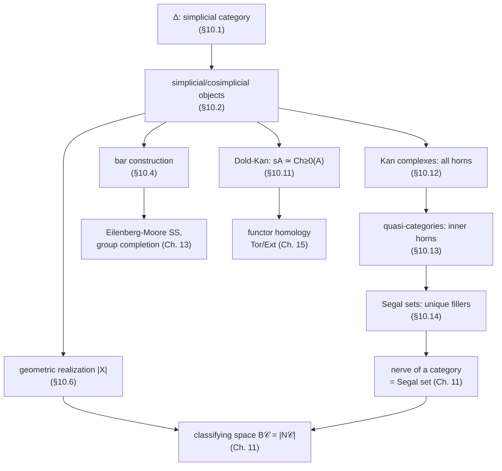

# Simplicial Objects and Simplicial Sets

[[book-guidelines|↩ Back to guidelines]]

## Why this chapter exists

Part I of the book gave you an enormous toolbox — limits, Kan extensions, monads,
monoidal structure, enrichment. Part II's job is to point that toolbox at a concrete
problem: *how do you do algebraic topology combinatorially, without ever touching a
point-set space?* The answer that has dominated homotopy theory since the 1950s is
the **simplicial set** — a purely combinatorial gadget (a functor out of a small
indexing category) that nonetheless carries enough structure to recover homotopy
groups, CW complexes, and eventually an entire model of $\infty$-categories.

The reason this chapter sits *here*, right after enriched categories, is that
simplicial objects are the payoff example for "diagram categories encode structure."
A simplicial set is nothing more exotic than a presheaf on a specific small category
$\Delta$ — an object you already know how to manipulate (Yoneda, colimits, Kan
extensions) from Part I. What's new is what you get to *do* with that presheaf once
you interpret its shape geometrically.

If you come from a type-theory background, keep one thread running in the back of
your mind throughout this article: quasi-categories (Section 10.13) are the
combinatorial backbone of Homotopy Type Theory's semantics, and the "horn-filling"
condition that recurs from Section 10.12 onward is structurally the same kind of
problem as constraint-satisfaction during unification — you're handed a partial
boundary and asked whether it extends. We'll make this precise at the end.

---

## 10.1 The simplicial category $\Delta$

### The problem it solves

Before you can define "a combinatorial model of a topological space," you need a
combinatorial model of *the basic building block of a space* — the simplex — and of
*the ways simplices glue to each other*. A triangle has three vertices, three edges,
and one 2-dimensional face; a tetrahedron has four of each lower type plus a
3-dimensional face; and every one of these pieces embeds into higher ones by
"forgetting a vertex" or degenerates from higher ones by "repeating a vertex." $\Delta$
is the category that packages exactly this combinatorics, with nothing topological
left in it at all.

### The definition

For each $n \geq 0$, let $[n] = \{0 < 1 < \cdots < n\}$ be the finite linearly ordered
set with $n+1$ elements.

> **Definition 10.1.1.** The **simplicial category** $\Delta$ has objects $[n]$,
> $n \geq 0$, and morphisms the order-preserving (monotone) functions
> $f : [n] \to [m]$, i.e. $f(i) \le f(j)$ whenever $i < j$.

$\Delta$ is small, and since the only order-preserving *bijection* of $[n]$ is the
identity, $\Delta$ has only trivial automorphism groups — its category of
isomorphisms $\mathrm{Iso}(\Delta)$ is discrete.

**What breaks without the ordering.** If you dropped "order-preserving" and just took
arbitrary functions $[n] \to [m]$, you'd get a category equivalent to $\mathrm{Fin}$,
the category of finite sets — which has *far* too many morphisms and, crucially, no
canonical way to talk about "the front face" versus "the back face" of a simplex.
The order is what lets you name specific structure maps (below) instead of an
undifferentiated pile of set maps.

### The generators: face and degeneracy maps

Every morphism in $\Delta$ decomposes uniquely into two kinds of atomic moves:

> **Definition 10.1.2.**
> - $\delta^i : [n-1] \to [n]$, $0 \le i \le n$, is the order-preserving *injection*
>   that skips the value $i$:
>   $$\delta^i(j) = \begin{cases} j & 0 \le j \le i-1 \\ j+1 & i \le j \le n-1\end{cases}$$
> - $\sigma^j : [n+1] \to [n]$, $0 \le j \le n$, is the order-preserving *surjection*
>   that sends both $j$ and $j+1$ to $j$:
>   $$\sigma^j(k) = \begin{cases} k & 0 \le k \le j \\ k-1 & j < k \le n+1\end{cases}$$

Read geometrically: $\delta^i$ is "the inclusion of the face opposite vertex $i$," and
$\sigma^j$ is "collapse the edge between vertices $j$ and $j+1$" (a degeneracy).

These satisfy the **cosimplicial identities** (Lemma 10.1.3):
$$
\delta^j \circ \delta^i = \delta^i \circ \delta^{j-1}\ (i<j), \qquad
\sigma^j \circ \sigma^i = \sigma^i \circ \sigma^{j+1}\ (i \le j),
$$
$$
\sigma^j \circ \delta^i =
\begin{cases}
\delta^i \circ \sigma^{j-1}, & i<j \\
1_{[n]}, & i=j,\,j+1 \\
\delta^{i-1}\circ \sigma^j, & i>j+1.
\end{cases}
$$

These three families of relations look arbitrary until you realize they are exactly
the relations you'd need to prove by induction if you tried to verify, by hand, that
"skip a vertex then skip another vertex" doesn't depend on some spurious ordering
choice. They're the coherence conditions for treating $\delta$'s and $\sigma$'s as a
presentation of $\Delta$ by generators and relations.

> **Lemma 10.1.4 (unique normal form).** Every $f : [n] \to [m]$ in $\Delta$ factors
> uniquely as
> $$f = \delta^{i_1}\circ \cdots \circ \delta^{i_r} \circ \sigma^{j_1} \circ \cdots \circ \sigma^{j_s}$$
> with $0 \le i_r < \cdots < i_1 \le m$ and $0 \le j_1 < \cdots < j_s < n$, and
> $m = n - s + r$.

*Proof idea:* factor $f$ as a surjection onto its image, followed by the inclusion of
the image; the surjective part is a composite of $\sigma$'s, the injective part a
composite of $\delta$'s; the simplicial identities force the decomposition's
uniqueness once you sort the indices.

**Grounding.** This "surjection-then-injection" factorization is precisely the
*epi–mono factorization* you saw for abelian categories in Chapter 7, specialized to
finite ordered sets — and it is also exactly the shape of a normal-form theorem in a
term rewriting system: every morphism reduces to a canonical composite of primitive
moves. In Rust, a monotone map $[n]\to[m]$ is naturally represented as a
non-decreasing `Vec<usize>` of length $n+1$ with values in $0..=m$, and Lemma 10.1.4
is the statement that this representation has a unique "sorted factorization" into
insertions ($\delta$, injective) and repeats ($\sigma$, surjective):

```rust
// A morphism [n] -> [m] in Δ, as a monotone function on {0,...,n}.
struct SimplicialMap {
    values: Vec<usize>, // len = n+1, non-decreasing, each in 0..=m
}

// δ^i : [n-1] -> [n], skip value i
fn coface(i: usize, n: usize) -> SimplicialMap {
    SimplicialMap {
        values: (0..n).map(|j| if j < i { j } else { j + 1 }).collect(),
    }
}

// σ^j : [n+1] -> [n], collapse j and j+1
fn codegeneracy(j: usize, n: usize) -> SimplicialMap {
    SimplicialMap {
        values: (0..=n + 1).map(|k| if k <= j { k } else { k - 1 }).collect(),
    }
}
```
Composition of two `SimplicialMap`s is just composition of the underlying functions;
Lemma 10.1.4 says you never need to store more than the sorted list of "which
$\delta$'s, which $\sigma$'s" — a compact normal-form representation, exactly the way
a compiler normalizes an expression tree.

---

## 10.2 Simplicial and cosimplicial objects

> **Definition 10.2.1.** A **simplicial object** in a category $\mathcal C$ is a
> contravariant functor $X : \Delta^{op} \to \mathcal C$. A **cosimplicial object** is
> a covariant functor $\Delta \to \mathcal C$.

Write $X_n := X([n])$. Because every morphism of $\Delta$ decomposes into
$\delta^i$'s and $\sigma^j$'s (Lemma 10.1.4), a simplicial object is *fully*
determined by:

- objects $X_0, X_1, X_2, \dots$,
- **face maps** $d_i := X(\delta^i) : X_n \to X_{n-1}$,
- **degeneracy maps** $s_j := X(\sigma^j) : X_n \to X_{n+1}$,

satisfying the dual simplicial identities:
$$
d_i d_j = d_{j-1} d_i\ (i<j), \qquad s_i s_j = s_{j+1} s_i\ (i \le j),
$$
$$
d_i s_j = \begin{cases} s_{j-1} d_i, & i<j \\ 1_{[n]}, & i = j,\,j+1 \\ s_j d_{i-1}, & i>j+1.\end{cases}
$$

Visually this is the familiar picture of a simplicial set as a "graph with more
directions":
$$X_0 \leftleftarrows X_1 \Lleftarrow X_2 \cdots$$

**Terminology.** An element $x \in X_n$ is an **$n$-simplex**. If $x = s_i(y)$ for
some $y \in X_{n-1}$, $x$ is **degenerate**. This distinction matters more than it
looks: degenerate simplices carry no genuinely new geometric information — they'll
be exactly the simplices that geometric realization (§10.6) collapses away.

**What kind of category is this an instance of?** Simplicial objects in $\mathcal C$
form a category $s\mathcal C := \mathrm{Fun}(\Delta^{op}, \mathcal C)$ — a functor
category, so everything Chapter 3 told you about (co)limits in functor categories
applies immediately: $s\mathcal C$ is (co)complete whenever $\mathcal C$ is, computed
levelwise. This is the "diagram category" idea from Part I paying off directly:
you don't need a *new* theory of limits for simplicial objects, you already have it.

**Two facts worth internalizing early**, because the rest of the chapter is built on
them:

1. **The Yoneda perspective.** Let $\Delta^n := \Delta(-, [n]) : \Delta^{op} \to
   \mathrm{Sets}$ be the representable presheaf. The Yoneda lemma (2.2.2) gives, for
   every simplicial set $X$,
   $$X_n \cong \mathrm{sSets}(\Delta^n, X). \tag{10.2.2}$$
   In words: an $n$-simplex of $X$ *is the same thing as* a map from the standard
   $n$-simplex into $X$. Every simplicial set is therefore built, up to isomorphism,
   as a colimit of representables — the **category of elements** $\mathrm{el}(X)$
   (objects: pairs $(n, x)$ with $x \in X_n$; morphisms given by $\Delta$-maps
   compatible with $X$) recovers $X$ exactly:
   $$\mathrm{colim}_{\mathrm{el}(X)} \Delta^n \cong X. \tag{10.2.3}$$
   This is literally the Density Theorem (5.4.3) from Chapter 5, specialized.
2. **Closed symmetric monoidal structure.** $(X \times X')_n = X_n \times X'_n$
   (levelwise product), and the internal hom is
   $\mathrm{sSets}(X,X')_p = \mathrm{sSets}(X \times \Delta^p, X')$. This closed
   structure is what will make geometric realization (a left adjoint, §10.6) behave
   well with products.

---

## 10.3 Interlude: Joyal's category of intervals

There's a second, purely order-theoretic way to see $\Delta^{op}$: as the category
$\mathbb I$ of **proper intervals** ($[n]$, $n \ge 1$, with morphisms fixing the
endpoints $0 \mapsto 0$, $n \mapsto m$). The bridge is **Dedekind cuts**: an object
$[n+1]$ of $\mathbb I$ corresponds to the $n+2$ possible "cut points" of $[n]$ —
e.g. $[3]$ has cuts $|0123,\ 0|123,\ 01|23,\ 012|3,\ 0123|$ — and a cut of $[n]$ is
identified with an element of $\Delta([n],[1])$. This produces an isomorphism of
categories
$$D : \Delta^{op} \xrightarrow{\ \cong\ } \mathbb{I}. \tag{Theorem 10.3.6}$$

This is a genuinely different *coordinatization* of the same category: instead of
tracking order-preserving maps between finite ordinals, you track how cut-points
propagate under precomposition. It's a book-keeping tool that pays off in §10.5
(simplicial homotopies become literal "moving a cut across an interval") and gives an
alternative combinatorial route to the geometric $n$-simplex
$\Delta^n = \{(t_0,\dots,t_n): 0\le t_i,\ \sum t_i = 1\}$ (Remark 10.3.8: a point of
$\Delta^n$ is exactly a map of *arbitrary* intervals $D[n]\to[0,1]$).

This construction doesn't have a natural Rust/Lean grounding as code — it's a
re-indexing lemma, not an algorithm — so we won't force one; the payoff is purely
that it gives you two equivalent mental pictures of $\Delta$, and the rest of the
chapter freely switches between them.

---

## 10.4 Bar and cobar constructions

### What problem this solves

Given a monoid $C$ acting on a right module $N$ and a left module $M$ (all internal
to some monoidal category), you often want a *resolution* — a simplicial replacement
that lets you compute derived functors (Tor, Ext, group homology, ...). The **bar
construction** is the canonical such resolution, built purely from the monoid
structure, with no extra input.

> **Definition 10.4.2.** For a monoid $(C,\mu,\eta)$ in $(\mathcal C,\otimes,1)$, a
> right $C$-module $(N,\rho)$, and a left $C$-module $(M,\lambda)$, the **two-sided
> bar construction** $B(N,C,M)$ is the simplicial object with
> $$B(N,C,M)_n = N \otimes C^{\otimes n} \otimes M,$$
> face maps multiplying adjacent factors ($\rho$ at the $N$ end, $\mu$ internally,
> $\lambda$ at the $M$ end) and degeneracies inserting the unit $\eta$.

The simplicial identities for $B(N,C,M)$ (Proposition 10.4.1) are *exactly*
associativity of $\mu$ and the module axioms for $\rho,\lambda$ — nothing more. This
is the general pattern: **a simplicial object's face-map identities are usually a
repackaging of an associativity/coherence law you already had**, just spread across
dimensions instead of stated as a single equation. The dual notion — the **cobar
construction** $\Omega(N,T,M)$ on a comonoid $T$ — is a cosimplicial object built the
same way from comultiplication.

### Why the book bothers: three applications

1. **Classical homological algebra.** $C = R$ an associative ring, $N,M$ modules —
   this recovers the ordinary bar resolution used to compute $\mathrm{Tor}^R_*$,
   group (co)homology, Hochschild (co)homology.
2. **Monad bar construction and delooping.** If $\mathbb C = RL$ is the monad of an
   adjunction $(L,R)$, $B(L,\mathbb C, R(D))$ is a simplicial object built from the
   monad alone. Specializing to the loop–suspension adjunction
   $(\Sigma^n, \Omega^n)$ on based compactly generated spaces: if $Y$ is an algebra
   for the monad $\Omega^n\Sigma^n$ (i.e., "looks like an $n$-fold loop space"), Beck's
   theorem identifies $Y \simeq \Omega^n |B(\Sigma^n,\Omega^n\Sigma^n,Y)|$ — the bar
   construction literally **produces an $n$-fold delooping** of $Y$.
3. **Adams' cobar construction.** Dualizing to a 1-reduced coalgebra $C_*$ (e.g. the
   normalized chains on a 1-reduced simplicial set), the cobar complex
   $\Omega(C_*)$ computes $H_*(\Omega X)$ from $C_*(X)$ — an algebraic model of the
   based loop space that is central to rational homotopy theory.

**What breaks without this.** Without a canonical, functorial resolution, every
computation of Tor/Ext/group-homology would need an *ad hoc* projective resolution
chosen by hand for each module — the bar construction gives you one uniformly, for
free, directly from the monoid axioms.

This is a place where the grounding genuinely doesn't transfer well to Rust or Lean
as *code* — it's a resolution used for homological computation, not an algorithm you
implement — so per the style guide we skip forcing an example here rather than
manufacture a strained one.

---

## 10.5 Simplicial homotopies

Topologically, a homotopy $H : X \times [0,1] \to Y$ between $f,g$ restricts to $f$
at $0$ and $g$ at $1$. The simplicial analogue replaces $[0,1]$ with the
interval object $\Delta^1$:
$$H : X \times \Delta^1 \to Y, \qquad H|_{X \times \{0\}} = f,\ \ H|_{X\times\{1\}}=g.$$

Unwinding this via the Yoneda identification (10.2.2) gives a fully combinatorial
description:

> **Definition 10.5.1.** A **simplicial homotopy** from $f$ to $g$ is a family
> $h_i : X_n \to Y_{n+1}$, $0 \le i \le n$, with $d_0 h_0 = f$, $d_{n+1}h_n = g$, and
> face/degeneracy compatibility relations mirroring (10.5.1) in the source.

Proposition 10.5.2 makes the two pictures (topological-style $H$, combinatorial
$h_i$) precisely interchangeable, using the Dedekind-cut labeling from §10.3 — each
$h_i$ is literally "$H$ evaluated against the cut just after position $i$." **What
breaks without the interval-object formulation:** you cannot talk about "continuous
deformation" in a purely combinatorial world without *some* stand-in for $[0,1]$;
$\Delta^1$ (equivalently $\mathbb{I}$'s object $D[1]$) is exactly the minimal such
stand-in, with two nondegenerate vertices and one nondegenerate edge connecting them
(Remark 10.2.6).

---

## 10.6 Geometric realization of a simplicial set

### Turning combinatorics back into a space

Everything so far has been purely algebraic. Geometric realization is the functor
that finally produces an actual topological space from a simplicial set, and it is
the construction that justifies calling $\Delta$ "simplicial" in the first place.

> **Definition 10.6.1.**
> $$|X| = \Big(\coprod_{n\ge 0} X_n \times \Delta^n\Big)\Big/\!\sim,$$
> where $X_n$ is discrete, $\Delta^n$ is the topological $n$-simplex, and the
> relations glue faces to faces and collapse degeneracies:
> $$(d_i x, t) \sim (x, \delta^i t), \qquad (s_j x, t) \sim (x, \sigma^j t).$$

**Remark 10.6.2 (the conceptual one-liner).** $|X|$ is nothing but the **coend** of
$H : \Delta^{op}\times\Delta \to \mathrm{Top}$, $H([n],[m]) = X_n \times \Delta^m$ —
i.e. it's a *tensor product of functors* in the Chapter 4/15 sense, with $X$ playing
the role of a right $\Delta$-module (of sets) and $[n]\mapsto \Delta^n$ the role of a
left $\Delta$-module (of spaces). This is the same coend machinery that will produce
functor Tor in Chapter 15 — geometric realization *is* an instance of the general
"integrate against a bimodule" pattern that recurs throughout the book.

**Why degenerate simplices vanish.** The relation $(s_j x, t) \sim (x,\sigma^j t)$
literally identifies every degenerate simplex's cell with a lower-dimensional cell —
this is what earns them the name "degenerate": they contribute zero new geometry.
Lemma 10.6.3 makes this precise: every point of $|X|$ has a *unique* nondegenerate
representative, and Proposition 10.6.4 (Milnor) upgrades this to a CW structure:

> $|X|$ is a CW complex with one $n$-cell per nondegenerate $n$-simplex.

**Products don't commute with realization for free.** $|X\times Y| \cong |X|\times|Y|$
(Prop. 10.6.7) requires $|X|\times|Y|$ to already be a CW complex — the proof is a
genuinely delicate combinatorial argument about subdividing products of simplices via
shuffles of partial sums, precisely because a product of two CW complexes need not
itself carry a CW structure in general topology. This is exactly why Richter set up
**compactly generated spaces** (§8.5) earlier: working in $\mathrm{cg}$ instead of
$\mathrm{Top}$ makes $(-)\times_k(-)$ well-behaved and turns geometric realization
into a genuine left adjoint (right adjoint to $\mathrm{Sing}$, §10.12), so it
automatically preserves *all* colimits, and (10.2.3) plus the interchange law
(3.5.1) gives $|X\times Y| \cong |X|\times_k|Y|$ formally, no combinatorics required.

---

## 10.7 Skeleta of simplicial sets

> **Definition 10.7.1.** The **$n$-skeleton** $\mathrm{sk}_n X$ is the left Kan
> extension of $X\circ\iota_n$ along the inclusion $\iota_n : \Delta_{\le n}\to\Delta$.

This is a direct, satisfying application of Chapter 4: restrict $X$ to simplicial
degrees $\le n$ (forgetting everything above), then re-extend it as generously as
possible (filling back in only degenerate simplices in higher degrees). Concretely,
$\mathrm{sk}_n$ is left adjoint to the restriction functor $\iota_n^*$. Geometrically
this matches your intuition exactly:
$$|\mathrm{sk}_n X| \cong \mathrm{sk}_n|X|,$$
the simplicial skeleton realizes to the CW skeleton.

---

## 10.8 Bisimplicial sets and the diagonal

A **bisimplicial set** is a functor $X : \Delta^{op}\times\Delta^{op}\to\mathrm{Sets}$
— a simplicial object in simplicial sets, in either variable. There are (at least)
four candidate ways to turn $X$ into a single space: realize the coend directly,
take the **diagonal** simplicial set $\mathrm{diag}(X)_p = X_{p,p}$ and realize that,
or realize one variable at a time in either order.

> **Proposition 10.8.5.** All four are homeomorphic.

The proof is a beautiful two-line argument once you have the right tools: check the
claim on the "atomic" bisimplicial sets $\Delta^p\boxtimes\Delta^q\times S$ by direct
computation, then note that *every* bisimplicial set is a coequalizer of such atoms
(this is Exercise 10.8.4's universal property, essentially Yoneda again), and that
geometric realization — being a left adjoint — automatically commutes with that
coequalizer. **This is the payoff of having proved "realization is a left adjoint"
in §10.6 rather than checking it by hand each time.** Remark 10.8.6 records the
practical consequence used constantly later: levelwise weak equivalences of
bisimplicial sets induce weak equivalences of diagonals.

---

## 10.9 The fat realization of a (semi)simplicial set or space

Sometimes you only have face maps and no degeneracies (a **semisimplicial object**,
functor out of the subcategory $\Delta_{inj}$ of injective order-preserving maps), or
your simplicial *space* has degeneracy maps that behave badly on point-sets. The
**fat realization** $\|X\|$ drops the degeneracy relation entirely:
$$\|X\| = \Big(\coprod_n X_n\times\Delta^n\Big)/(d_ix,t)\sim(x,\delta^i t)\text{ only.}$$

Segal's payoff (Proposition 10.9.4) is that $\|-\|$ has three good properties that
ordinary $|-|$ *lacks* for simplicial spaces in general: it preserves CW homotopy
type, sends levelwise homotopy equivalences to homotopy equivalences, and commutes
with finite products — at the cost of being "larger" (it doesn't collapse
degeneracies, Exercise 10.9.3). For **good** simplicial spaces the canonical map
$\|X\|\to|X|$ is a homotopy equivalence, so you get the best of both when you need it.

---

## 10.10 The totalization of a cosimplicial space

Dual to realizing a simplicial space, you can **totalize** a cosimplicial space
$Y : \Delta \to s\mathrm{Sets}$ (equivalently a functor $\Delta^{op}\times\Delta \to \mathrm{Sets}$):

> **Definition 10.10.3.** $\mathrm{Tot}(Y) = \hom(\Delta^\bullet, Y)$, an equalizer of
> $\prod_q \mathrm{sSets}((-,[q]), Y^q) \rightrightarrows \prod_{\varphi} \mathrm{sSets}((-,[q]), Y^{q'})$.

This is the dual construction to §10.8's diagonal, and its main use downstream is the
**Bousfield–Kan spectral sequence** (Remark 10.10.4), with $E_2 = \pi^s\pi_t Y$
converging to $\pi_*\mathrm{Tot}(Y)$ — a standard tool for computing homotopy groups
of mapping spaces.

---

## 10.11 The Dold–Kan correspondence

This is arguably the single most quietly powerful result in the chapter.

> **Theorem 10.11.2 (Dold–Kan).** For an abelian category $\mathcal A$, the
> **normalized chain complex** functor
> $$N_n(A) = \bigcap_{i=0}^{n-1}\ker(d_i), \qquad d = (-1)^n d_n$$
> is an equivalence of categories $s\mathcal A \simeq \mathrm{Ch}_{\ge 0}(\mathcal A)$.

**What problem this solves.** Simplicial objects in an abelian category carry a huge
amount of redundant data — an entire tower of face/degeneracy maps satisfying
quadratic-looking identities. Dold–Kan says this data is *exactly equivalent* to the
much sparser data of a nonnegatively graded chain complex: throw away every
degenerate direction ($N_n(A)$ intersects the kernels of all-but-the-last face map,
i.e. keeps only what can't be reached by degeneracies) and you're left with a chain
complex carrying the same homotopy-theoretic content. The inverse functor
$\Gamma_N$ is pinned down, via Yoneda, by
$$\Gamma_N(A)_n = \mathrm{Ch}(k)_{\ge 0}(N_*(k\{\Delta^n\}), A).$$

**Downstream payoff.** Combined with §10.12's fact that simplicial abelian groups
are always Kan complexes, Dold–Kan gives you combinatorial homotopy groups for free:
$\pi_n(A,0) \cong H_n(N_*(A)) \cong H_n(C_*(A))$ — simplicial homotopy theory and
classical homological algebra become *literally the same subject* on abelian-group
coefficients. This equivalence is also what later lets the book treat "simplicial
$k$-module" and "nonnegatively-graded chain complex" interchangeably without comment.

---

## 10.12 Kan complexes and horn filling

### The lifting-property idea

We now ask: which simplicial sets deserve to be called "spaces up to combinatorics" —
i.e., which ones support a sensible notion of homotopy *among themselves*, without
reference to $|-|$? The answer is phrased as a **lifting property** against horns.

> **Definition 10.12.3.** The $k$-th horn $\Lambda^n_k \subset \Delta^n$ is the
> simplicial subset generated by all faces $\delta^i$, $i\neq k$ — i.e., "$\Delta^n$
> with the interior and the face opposite vertex $k$ removed."
>
> **Definition 10.12.5.** $X$ is a **Kan complex** if every map $\Lambda^n_k \to X$
> extends along $\Lambda^n_k \hookrightarrow \Delta^n$ to a map $\Delta^n \to X$, for
> every $n,k$.

Concretely (Remark 10.12.6): given $(n{-}1)$-simplices $x_0,\dots,\check x_k,\dots,x_n$
satisfying the compatibility $d_ix_j=d_{j-1}x_i$, a Kan complex guarantees an
$n$-simplex $x$ with $d_i(x)=x_i$ for all $i\ne k$ — a **horn filler**.

**Key negative example.** $\Delta^n$ itself is *not* Kan for $n\ge2$ (Lemma 10.12.7)
— the representable simplicial sets are too "rigid" to fill their own horns; only
after mapping *into* something bigger do fillers appear. Two positive results save
the day:

- **$\mathrm{Sing}(X)$ is always Kan** (Proposition 10.12.9), and is right adjoint to
  geometric realization — the adjunction $|-| \dashv \mathrm{Sing}$ is the
  combinatorics/topology bridge for the rest of the book.
- **Every simplicial group is Kan** (Proposition 10.12.10, Moore) — an explicit,
  constructive horn-filling algorithm using the group's inverses to "close the gap"
  one face at a time.

For a Kan complex, combinatorial homotopy groups $\pi_n(X,x)$ are well-defined and
agree with $\pi_n(|X|,x)$ (Remark 10.12.12); $\pi_0$ has the simplest possible
description, as the coequalizer of $d_0,d_1 : X_1 \rightrightarrows X_0$. Proposition
10.12.14 shows $\Delta^{op}$ is **sifted** (colimits over it commute with finite
products) — a fact that will matter directly when the book later builds functor
homology and homotopy colimits (Chapters 11, 15).

### The type-theory connection — horn filling as constrained search

Here is the analogy worth carrying forward explicitly (Focus Area: `type-theory`,
with strong overlap into `automated-reasoning`). A horn-filling problem —
*"you're given all-but-one face of an $n$-simplex, satisfying compatibility, does a
filler exist?"* — has exactly the shape of a **unification problem under a partial
constraint set**: you're handed boundary data (the "known" faces, analogous to a
partially-instantiated metavariable context) and asked whether a term exists that is
*definitionally compatible* with all of it simultaneously. Kan's original insight —
that a simplicial *group* can always fill horns using the group inverse — is
structurally the same move as Miller's pattern-unification fragment guaranteeing a
*unique* solution when the metavariable's arguments are distinct bound variables:
in both cases, extra algebraic structure (a group action; a pattern restriction)
turns an underdetermined lifting problem into a decidable, even constructive, one.
We'll sharpen this analogy further with quasi-categories next, where the connection
to *judgmental* composition becomes explicit.

---

## 10.13 Quasi-categories and joins of simplicial sets

### Weakening "Kan" to "inner Kan"

Not all horns are created equal. Consider the three horns of $\Delta^2$:
$\Lambda^2_0, \Lambda^2_1, \Lambda^2_2$. Filling the **inner** horn $\Lambda^2_1$
(the one whose missing face is *between* the other two, at vertex $1$) has a very
different meaning from filling an **outer** horn ($\Lambda^2_0$ or $\Lambda^2_2$): if
you think of 1-simplices as morphisms, filling $\Lambda^2_1$ says "edges
$e_{01},e_{12}$ that compose end-to-end *do* have a composite $e_{02}$, witnessed by a
2-simplex" — a **composition** statement. Filling an outer horn instead produces a
one-sided (say, left or right) *inverse up to homotopy* — an **invertibility**
statement, which is much stronger and not something you want to demand of an
arbitrary category.

> **Definition 10.13.1.** A **quasi-category** is a simplicial set with the lifting
> property against all *inner* horns $\Lambda^n_k$, $0<k<n$ (Boardman–Vogt; the
> language and program of using them as a homotopy-coherent replacement for
> categories is due to Joyal).

**Reading a quasi-category as a category-up-to-homotopy.** $0$-simplices are
objects, $1$-simplices are morphisms; composition of $f,g$ isn't a single well-defined
edge, but *any* filler of the $\Lambda^2_1$-horn they span gives *a* composite, and
different fillers are related by higher (2-simplex-witnessed) homotopies. This is
literally "composition up to coherent homotopy," and it is the standard combinatorial
model for $(\infty,1)$-categories used throughout modern homotopy theory (and, not
covered in this book but worth knowing, throughout the semantic models used for
Homotopy Type Theory).

The **join** of simplicial sets (Definition 10.13.4, a simplicial analogue of the
topological join, satisfying $\Delta^k * \Delta^\ell \cong \Delta^{k+\ell+1}$) gives
you cones ($X * \Delta^0$) and is compatible with the quasi-category structure —
Joyal's theorem that the join of two quasi-categories is again a quasi-category
mirrors the categorical join from Chapter 1 exactly, one level of homotopy up.

### Bidirectional-typing reading

This is the sharpest connection this chapter has to the `type-theory` /
`automated-reasoning` focus areas. Compare:

- **Judgmental equality / definitional equality checking**, which asks "does this
  term reduce to that one" — a *decidable*, essentially unique, question (like the
  *outer*-horn / Kan-complex situation: strict, forced answers).
- **Composition in a bidirectionally-typed elaborator**, where combining two partial
  derivations (e.g. two adjacent typing steps) into one derivation is *not* a single
  canonical operation but a *search* that may succeed in several equally valid ways
  up to some notion of equivalence (proof irrelevance, or definitional equality of
  the resulting term) — this is exactly the **inner-horn** situation: the filler
  exists (a proof/term can be built), but it is witnessed rather than unique, and
  different witnesses are themselves connected by a higher notion of sameness.

A quasi-category's inner Kan condition is, in this sense, the categorified statement
of "my composition operation is well-defined up to a coherent choice" — precisely
the kind of claim you need to prove about an elaborator's own term-composition (e.g.
composing two coercions, or two derivations of the same judgment obtained by
different metavariable-solving paths) if you want a *trusted kernel* built on top of
it to be sound regardless of which path the elaborator took.

---

## 10.14 Segal sets

Quasi-categories relax "composable" to "composable up to homotopy, non-uniquely."
**Segal sets** go one step further and *demand* that composability be forced by the
1-skeleton alone.

> **Definition 10.14.1.** $X$ is a **Segal set** if for every $n \ge 2$ the Segal map
> $$X_n \longrightarrow X_1 \times_{X_0} \cdots \times_{X_0} X_1 \quad (n \text{ factors})$$
> is a *bijection* (not just admitting a filler).

The Segal condition says an $n$-simplex is *nothing more nor less than* a composable
chain of $n$ edges — no extra data, no ambiguity. Proposition 10.14.3 shows that for
a **reduced** Segal set ($X_0=\{*\}$), $X_1$ inherits an honest, strictly associative
**monoid structure** with unit $s_0(*)$ — the Segal condition on 2-simplices supplies
associativity directly, via a genuinely careful diagram chase using the two ways of
composing three edges through $X_3$.

**The conceptual takeaway across §§10.12–10.14**, worth stating explicitly because
it's exactly the "lifting conditions as a spectrum" picture the book's own Key
Questions flag: Kan complexes demand fillers for *every* horn (things are as
invertible/groupoid-like as possible); quasi-categories demand fillers only for
*inner* horns, with no uniqueness (categories up to coherent homotopy); Segal sets
demand *unique* fillers determined by the 1-skeleton (strictly associative
composition, recovering ordinary categories/monoids as a limiting case — indeed,
Chapter 11 will show the **nerve** of an ordinary small category is precisely a Segal
set with unique inner-horn fillers).

---

## 10.15 Symmetric spectra

A brief but important payoff: for a bicomplete closed symmetric monoidal category
$(\mathcal C,\otimes,1)$ and object $K$, form the symmetric sequence
$\mathrm{Sym}(K)$ with $\mathrm{Sym}(K)_n = K^{\otimes n}$ and $\Sigma_n$ permuting
tensor factors — this is a commutative monoid under **Day convolution** (recall
§9.8).

> **Definition 10.15.1.** A **symmetric spectrum** with respect to $K$ is a right
> $\mathrm{Sym}(K)$-module: objects $X(n)$ with $\Sigma_n$-equivariant structure maps
> $X(n)\otimes K \to X(n+1)$, coherently compatible under iteration.

Taking $\mathcal C = s\mathrm{Sets}$ and $K = S^1$ (the simplicial circle) recovers
the classical symmetric spectra of Hovey–Shipley–Smith, the standard small model for
the stable homotopy category. Proposition 10.15.3 gives a strikingly clean
alternative description when $K$ is the *unit* object $e$: symmetric spectra with
respect to $e$ are literally the same thing as functors from Joyal's interval
category $\mathbb{I}$ (§10.3!) to $\mathcal C$ — the injections category from
Chapter 1 makes a surprise return, closing a small loop within the chapter itself.
This section doesn't map naturally onto Rust/Lean/Python grounding — it's
infrastructure for stable homotopy theory, orthogonal to the compiler/elaborator
project — so we leave it as a pointer rather than force an illustration.

---

## Where this leads



Within the book, this chapter is the hinge of the entire second half: the nerve and
classifying space of a category (Chapter 11) are defined *as* a simplicial set and
its realization; the bar construction resurfaces as the categorical-K-theory
machinery of Chapter 13; the sifted-colimit fact about $\Delta^{op}$ underwrites the
homotopy-colimit spectral sequence of Chapter 16; and Dold–Kan is the silent
assumption behind every claim that "simplicial abelian group" and "chain complex"
can be used interchangeably from here on.

For the standing project (`type-theory`, with `automated-reasoning` overlap): the
Kan-filling / quasi-category / Segal-set hierarchy in §§10.12–10.14 is the cleanest
categorified vocabulary available for the distinction your elaborator design already
has to make between **decidable definitional equality** (Segal-set-like: unique,
forced composition — this is what a trusted kernel's `isDefEq` should behave like),
**coherent but non-unique proof composition** (quasi-category-like: a term exists,
possibly via several metavariable-solving paths, and soundness only requires the
results be *equivalent*, not identical), and **full invertibility** (Kan-complex-like:
reserved for genuinely groupoid-shaped structure, such as symmetric definitional
equality itself). Recognizing which of the three regimes a given operation in the
compiler belongs to is exactly the kind of design question this hierarchy was built
to answer precisely.
