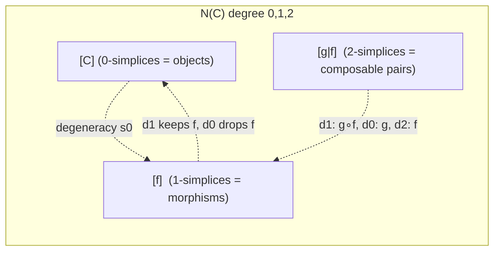
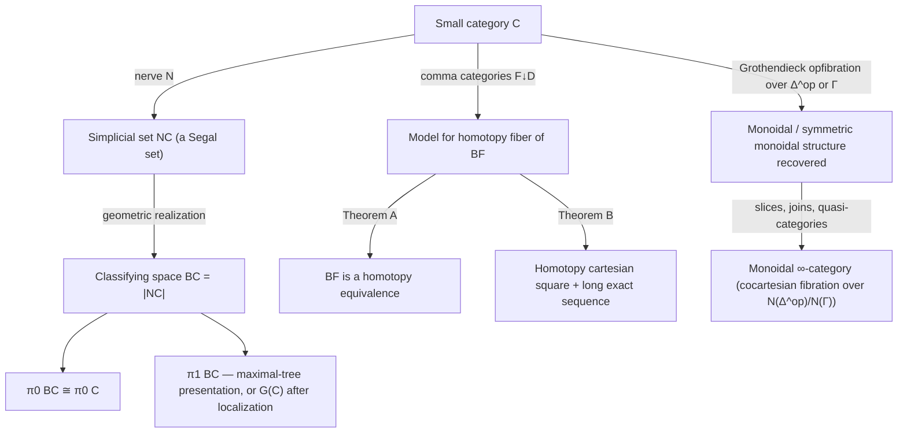

[[book-guidelines|↩ Back to guidelines]]

# The Nerve and Classifying Spaces of Categories

## The problem: categories aren't spaces, until you make them one

A category is combinatorial data — objects, morphisms, composition rules. A topological space is point-set data — points, open sets, continuous paths. There's no obvious reason the machinery of homotopy theory (paths, homotopies, $\pi_1$, fibrations) should say anything about a category at all. But it turns out almost every homotopy-theoretic idea *does* have a categorical shadow: the fundamental group of a category, contractibility of a category, a fibration of categories. Chapter 11 builds the bridge that makes this precise, in two stages: first turn the category into a simplicial set (the **nerve**), then turn the simplicial set into an actual topological space (the **classifying space**) by geometric realization.

**What breaks without this bridge.** Without it, "is this diagram of categories a fibration in some useful sense" or "does this functor behave like a homotopy equivalence" are questions with no available tools — you'd be stuck reasoning about universal properties and adjunctions with no way to import 100 years of algebraic topology (obstruction theory, spectral sequences, Quillen's own model-category machinery) to help you compute invariants. The nerve/classifying-space construction is what lets you say, rigorously, "$BG \simeq S^1$" for $G = \mathbb{Z}$, or "this functor of categories induces a long exact sequence of homotopy groups," and mean exactly what a topologist means by those words.

If you've built an elaborator or done dependency analysis over a DAG of definitions, you've already built something nerve-shaped without naming it: a directed graph of "things" and "dependencies-with-composition" is exactly the 1-truncated data of a nerve. The classifying space is what you get when you insist that composable *chains* of dependencies also carry coherent higher-dimensional data (triangles for triples, tetrahedra for quadruples, ...).

## 11.1 — The nerve: encoding composition as a simplicial set

**Definition (11.1.1).** For a small category $\mathcal{C}$, let $M_n(\mathcal{C})$ be the set of $n$-tuples of composable morphisms

$$C_0 \xrightarrow{f_1} C_1 \xrightarrow{f_2} \cdots \xrightarrow{f_n} C_n,$$

written $[f_n | \cdots | f_1]$. The **nerve** $N\mathcal{C} : \Delta^{op} \to \mathrm{Sets}$ sends $[n] \mapsto M_n(\mathcal{C})$, with:

- **Degeneracies** insert an identity morphism: $s_i[f_n|\cdots|f_1] = [f_n|\cdots|f_{i+1}|1_{C_i}|f_i|\cdots|f_1]$.
- **Face maps** compose adjacent morphisms or drop an endpoint:
$$d_i[f_n|\cdots|f_1] = \begin{cases} [f_n|\cdots|f_2], & i=0,\\ [f_n|\cdots|f_{i+1}\circ f_i|\cdots|f_1], & 0<i<n,\\ [f_{n-1}|\cdots|f_1], & i=n.\end{cases}$$

Read $d_i$ geometrically: it "omits the object $C_i$." At the two ends ($i=0,n$) the adjacent morphism just dies along with the object; in the middle, deleting $C_i$ forces its two neighboring morphisms to compose. This is precisely how you'd encode a call graph's 2-cell (a triangle $f, g, g\circ f$) as data: the triangle degenerates to an edge exactly when you drop the middle vertex and are forced to record the composite.

**What breaks without simplicial identities.** If face and degeneracy maps didn't satisfy the simplicial identities, $d_i \circ d_j$ could disagree depending on the order you delete vertices — but composition in $\mathcal{C}$ is associative and unital, so the two ways of collapsing a 3-simplex to a point *must* agree. The simplicial identities are exactly associativity and the unit laws for composition, restated as combinatorics.

If you've ever represented a call chain or a proof-term spine as a `Vec` of composable steps, $M_n(\mathcal{C})$ is exactly that, with the face maps as the "collapse one step" operation:

```rust
// A composable chain of n morphisms C0 -f1-> C1 -f2-> ... -fn-> Cn,
// i.e. one element of M_n(C) = N(C)_n.
struct Chain<Obj, Mor> {
    objects: Vec<Obj>,      // C0, C1, ..., Cn  (length n+1)
    morphisms: Vec<Mor>,    // f1, ..., fn      (length n)
}

impl<Obj: Clone, Mor: Clone> Chain<Obj, Mor> {
    // d_i: drop object C_i, composing its two neighboring morphisms
    // when 0 < i < n (composition itself is supplied by the category).
    fn face(&self, i: usize, compose: impl Fn(&Mor, &Mor) -> Mor) -> Chain<Obj, Mor> {
        let n = self.morphisms.len();
        let mut objects = self.objects.clone();
        let mut morphisms = self.morphisms.clone();
        objects.remove(i);
        if i == 0 {
            morphisms.remove(0);
        } else if i == n {
            morphisms.pop();
        } else {
            let composed = compose(&morphisms[i], &morphisms[i - 1]);
            morphisms.splice(i - 1..=i, [composed]);
        }
        Chain { objects, morphisms }
    }
}
```

This is a literal, executable version of Definition 11.1.1's $d_i$ — and it makes the "simplicial identities = associativity restated as combinatorics" point concrete: `face(i)` followed by `face(j)` must be independent of order precisely because `compose` is associative.



### The nerve is (almost) a quasi-category, exactly when composition is unambiguous

**Proposition 11.1.2.** Nerves of small categories are **quasi-categories** — every inner horn $\Lambda^n_k \to N\mathcal{C}$ ($0<k<n$) has a filler $\Delta^n \to N\mathcal{C}$. The proof is concrete: an inner horn already hands you $n$ composable morphisms $f_1,\ldots,f_n$ (everything except one composite is already specified), and you fill in the missing face by literally composing them in $\mathcal{C}$.

**Remark 11.1.3 — uniqueness.** Crucially, this filler is *unique*. This is what distinguishes a nerve from a general quasi-category (an $\infty$-category with only *some* choice of composite, chosen up to homotopy): in a nerve, composition is a strict, unique operation, not a homotopy-coherent choice. The book calls a simplicial set with this unique-inner-horn-filler property a **Segal set**, and states the converse: every Segal set is (isomorphic to) the nerve of an honest small category (Exercise 11.1.4). This is the combinatorial fingerprint of "1-categorical, on the nose" data sitting inside the more general world of quasi-categories.

**Kan vs. quasi.** Example 11.1.5 shows $N[n] \cong \Delta^n$ is *not* even a Kan complex for $n \geq 2$ (outer horns aren't fillable — you can't invert a non-invertible morphism). But **Proposition 11.1.6**: if $\mathcal{C}$ is a groupoid, $N\mathcal{C}$ *is* Kan — every morphism being invertible is exactly what lets you fill outer horns too. This single fact is the categorical seed of the whole groupoid-model-of-homotopy-types tradition: invertibility of morphisms $\leftrightarrow$ Kan-ness $\leftrightarrow$ "this simplicial set actually behaves like a space with no extra combinatorial junk."

**Lemma 11.1.7 — the adjoint going back.** The nerve functor $N : \mathrm{Cat} \to \mathrm{sSets}$ has a left adjoint $L$ (the "fundamental category" functor): $L(X)$ has $X_0$ as objects, morphisms freely generated by $X_1$ modulo relations from $X_2$ (a 2-simplex $x$ with faces $d_0x = x_0, d_1x=x_1, d_2x=x_2$ forces $x_1 = x_0 \circ x_2$). Composing $N$ then $L$ recovers $\mathcal{C}$ exactly (**Remark 11.1.8**) — the nerve loses no information about a category. Composing $L$ then $N$ on an arbitrary simplicial set is "wildly wrong" in general: it collapses $X$ down to whatever category its 1- and 2-cells generate, throwing away all higher coherence. This adjunction is the general-purpose bridge between "strict 1-categorical" and "simplicial/$\infty$-categorical" thinking that recurs throughout modern higher category theory.

**Monoidal structure (11.1.10, 11.1.11).** $N$ is strong symmetric monoidal (nerve of a product is the product of nerves — pairs of morphisms are exactly the data of a product-category morphism) and it preserves joins: $N(\mathcal{C}) * N(\mathcal{D}) \cong N(\mathcal{C}*\mathcal{D})$. These are exactly the compatibility facts you need later (§11.8) to reconstruct monoidal structure from a fibration over $\Delta^{op}$.

## 11.2 — The classifying space: cells built from composable chains

**Definition (11.2.1).** $B\mathcal{C} = |N\mathcal{C}|$, the geometric realization. Concretely: objects give $0$-cells, non-identity morphisms give edges, a composite $g \circ f$ gives a filled triangle with the three edges $f, g, g\circ f$, a threefold composite gives a tetrahedron, and so on. $B$ extends to a functor $\mathrm{cat} \to \mathrm{Top}$, and (Proposition 11.2.3) it is strong symmetric monoidal, inherited directly from $N$ being monoidal plus geometric realization commuting with products.

**Examples worth internalizing (11.2.2):**
- A discrete category (a set with only identity morphisms) has discrete $B\mathcal{C}$ — no edges, so no gluing happens at all.
- A group $G$, viewed as a one-object category $\mathcal{C}_G$, has $B\mathcal{C}_G =: BG$, **the** classifying space of the group. For abelian $G$, $BG$ is itself a topological group (composition is a homomorphism, giving a multiplication map $BG \times BG \to BG$), and $B\mathbb{Z} \simeq S^1$. Iterating: $BS^1 \simeq \mathbb{CP}^\infty = K(\mathbb{Z},2) \simeq B(BZ)$, and in general the $n$-fold classifying space of a finitely generated abelian group $A$ models the Eilenberg–Mac Lane space $K(A,n)$.
- For discrete $G$, group homology $H_*(G;\mathbb{Z})$ *is*, by definition, $H_*(BG;\mathbb{Z})$ — an entire subject (group cohomology) is secretly the singular (co)homology of one specific simplicial set.

**Theorem 11.2.4 — the key naturality/invariance facts:**
1. A natural transformation $\tau : F \Rightarrow F'$ between functors $\mathcal{C}\to\mathcal{D}$ induces a **homotopy** $BF \simeq BF'$. Mechanism: view $\tau$ as a single functor $T : \mathcal{C}\times[1] \to \mathcal{D}$ (the "walking natural transformation" trick — $[1]$ is the free-standing arrow category), then $B(\mathcal{C}\times[1]) \cong B\mathcal{C}\times[0,1]$ *is* the homotopy.
2. An adjoint pair $L \dashv R$ gives $B\mathcal{C} \simeq B\mathcal{D}$, immediately from (1) applied to the unit and counit.
3. Hence an equivalence of categories $\Rightarrow$ homotopy equivalence of classifying spaces.

This is the single most load-bearing fact in the chapter: **natural transformations are exactly homotopies, on classifying spaces.** Anywhere you already reason "up to natural isomorphism," $B$ turns that into "up to homotopy" for free.

**Corollary 11.2.5.** An initial or terminal object makes $B\mathcal{C}$ contractible — it's adjoint to $[0]$ (the terminal category, a point), so by (2), $B\mathcal{C}\simeq B[0] = *$.

**Caution (Example 11.2.6): equivalence $\neq$ homeomorphism.** $\mathcal{C}$'s translation category $E_G$ (objects = elements of $G$, morphisms $g_1 \to g_2$ = the unique $h$ with $hg_1=g_2$) has *every* object both initial and terminal, so $BE_G$ is contractible — yet it's the standard model for the universal space $EG$, which is very much not literally a point (e.g. $E(\mathbb{Z}/2)\simeq S^\infty = \mathrm{colim}_n S^n$). "Contractible" and "a point" are different claims; classifying spaces routinely realize the former without the latter, which is exactly why $EG$ is interesting (it's contractible *with a nontrivial free $G$-action*, the raw material for $BG = EG/G$).

**Proposition 11.2.7.** Any category with binary products has contractible $B\mathcal{C}$: fix $C$, use $C\times(-)$; the two projections give natural transformations to the constant-$C$ functor and to the identity functor, so by (1) both are homotopic to $\mathrm{id}$.

**Also true, proved later (Remark 11.2.8 / Proposition 11.3.10):** the classifying space of any small *filtered* category is contractible — filteredness (every finite diagram has a cocone) is exactly the combinatorial condition that makes the whole category "eventually collapse to a point up to homotopy," proved by expressing $\mathcal{C}$ as a filtered colimit of comma categories $\mathcal{D}\downarrow D$ (each of which has $D$ as a terminal object).

## 11.3 — $\pi_0$ and $\pi_1$: reading topological invariants off morphisms

**Definition 11.3.1.** $\pi_0\mathcal{C}$ is the set of equivalence classes of objects under "connected by a zigzag of morphisms." **Proposition 11.3.2**: $\pi_0 B\mathcal{C} \cong \pi_0\mathcal{C}$ — a categorical invariant computed with zero topology literally *is* a topological invariant. (Example 11.3.3: for a translation category $E_G^X$ of a $G$-action on a set $X$, $\pi_0 E_G^X = X/G$ — orbits are path components.)

**Maximal trees and the fundamental group (Definition 11.3.5, Proposition 11.3.6).** Pick a maximal tree $X$ of morphisms (a spanning tree of the underlying graph of $\mathcal{C}$, one edge per "extra" connection collapsed to the identity). Then $\pi_1(B\mathcal{C})$ has an explicit presentation: one generator $[f]$ per morphism $f$, with relations (a) $[f]=1$ for $f\in X$, (b) $[1_C]=1$, (c) $[g\circ f]=[g][f]$. This is the categorical analogue of the standard "spanning-tree presentation" of $\pi_1$ of a graph, upgraded by the composition relation coming from the 2-cells.

A five-line sketch of the presentation itself, for a category given as an adjacency list of morphisms (finding *some* spanning tree, not the tree in the proof's canonical sense, but enough to see the relations mechanically):

```python
# generators = one symbol per non-identity morphism not in the spanning tree
# relations  = "[g o f] = [g][f]" for every composable pair recorded in the category
def pi1_presentation(objects, morphisms, spanning_tree_edges):
    generators = [f for f in morphisms if f not in spanning_tree_edges]
    relations = [
        (f"{g}∘{f}", f"{g}*{f}")
        for f in morphisms for g in morphisms
        if composable(f, g)  # target(f) == source(g)
    ]
    return generators, relations
```

Two illustrative specializations (**Examples 11.3.7**): for a group $G$ as $\mathcal{C}_G$, this recovers $\pi_1(BG) \cong G$ exactly (no maximal-tree relations since there's only one object). For a *monoid* $M$ as $\mathcal{C}_M$, the same presentation forces $\pi_1(B\mathcal{C}_M)$ to be a **group** even though $M$ itself need not have inverses — $\pi_1$ automatically group-completes the monoid. (This is exactly the phenomenon Chapter 13's Grothendieck-group / group-completion machinery is built to formalize and generalize.)

**Higher homotopy groups (Definition 11.3.8):** $\pi_n(\mathcal{C};C) := \pi_n(B\mathcal{C},[C])$ — once you have the space, every homotopy invariant is "of the category" by definition, no extra work needed. Filtered-colimit compatibility (**Lemma 11.3.9**): geometric realization commutes with filtered colimits and spheres are compact, so $\pi_n$ of a filtered colimit of categories is the filtered colimit of the $\pi_n$'s — the mechanism behind Proposition 11.3.10's contractibility-of-filtered-categories result above.

## 11.4 — The Bousfield–Kan homotopy colimit: gluing diagrams up to homotopy

**Motivation.** An ordinary colimit of a diagram $F : \mathcal{C}\to\mathcal{D}$ is not homotopy-invariant: replacing an object of the diagram by something equivalent can change the colimit's homotopy type entirely (the classic failure case: a pushout along a non-cofibration). The **homotopy colimit** is the fix — a version of "gluing" that only ever sees homotopy-equivalence-invariant information.

**Definition 11.4.1 (Sets-valued case).** For $F:\mathcal{C}\to\mathrm{Sets}$, $\mathrm{hocolim}\,F := N(F\!\downarrow\!\mathcal{C})$, the nerve of the category-of-elements of $F$. Unpacking degreewise:
$$N(F\!\downarrow\!\mathcal{C})_n \cong \coprod_{[f_n|\cdots|f_1]\in N(\mathcal{C})_n} F(C_0).$$
So an $n$-simplex is a chain of composable morphisms in $\mathcal{C}$ *together with* a chosen element of $F$ at the start of the chain — you keep every object's "extra data" $F(C_0)$ tagged onto the diagram shape, rather than immediately gluing it into a single quotient.

**Definition 11.4.2 (simplicial-set/topological-space valued case).** For $F:\mathcal{C}\to\mathrm{sSets}$ (or $\mathrm{Top}$), take the analogous coproduct at each simplicial level and use the diagonal of the resulting bisimplicial object:
$$\mathrm{hocolim}_{\mathcal{C}} F \ \text{ has } n\text{-simplices } \coprod_{[f_n|\cdots|f_1]\in N(\mathcal{C})_n} F(C_0)_n.$$

**The universal comparison map (Remark 11.4.3).** There is always a canonical map $|\mathrm{hocolim}_\mathcal{C}F| \to B\mathcal{C}$ (collapse each $F(C_0)$ to a point) and, dually, a map $\mathrm{hocolim}_\mathcal{C}F \to \mathrm{colim}_\mathcal{C}F$ (the ordinary colimit). The homotopy colimit sits strictly upstream of both the shape-category's classifying space and the naive colimit — it's the thing that factors through both without losing information either could discard on its own.

**Worked cases (Examples 11.4.4):** over $[0]$, hocolim is just $F([0])$ itself (no gluing to do). Over the poset $\mathbb{N}$, hocolim is the mapping telescope $F[0]\to F[1]\to F[2]\to\cdots$ — the standard homotopy-colimit model for a sequential colimit. Over $\mathcal{C}_G$, hocolim recovers the **Borel construction** $EG\times_G X$ — this is *the* standard example that motivates the whole definition: it's how you correctly "quotient by a group action up to homotopy" when the action isn't free.

**Homotopy-sifted categories (§11.4.1, Definition 11.4.8).** $\mathcal{D}$ is homotopy sifted if the comma category $(D_1,D_2)\downarrow\Delta$ (over the diagonal $\Delta:\mathcal{D}\to\mathcal{D}\times\mathcal{D}$) is nonempty with contractible classifying space, for every $D_1,D_2$. This is precisely the condition ensuring finite products commute with homotopy colimits over $\mathcal{D}$ (via Dugger's cofinality criterion, Remark 11.4.6) — filtered categories and $\Delta^{op}$ itself both qualify (Examples 11.4.9), which is why filtered colimits and geometric realization are so well-behaved with respect to products elsewhere in the book.

## 11.5 — Coverings: recovering local systems from morphism-inverting functors

**Proposition 11.5.1 / Theorem 11.5.5** establish an equivalence of categories:
$$\{\text{coverings } E\to B\mathcal{C}\} \ \simeq\ \{\text{functors } F:\mathcal{C}\to\mathrm{Sets} \text{ sending every morphism to a bijection}\}.$$
The forward direction lifts paths (edges of $N_1\mathcal{C}$) via the path-lifting property of coverings to get bijections $F(C_1)\xrightarrow{\sim}F(C_2)$ for each $f:C_1\to C_2$; the reverse direction (Theorem 11.5.5) builds $B(F\downarrow\mathcal{C}) \to B\mathcal{C}$ directly as a covering with fiber $F(C)$, using a **simplicial covering** (Definition 11.5.2): a map of simplicial sets with unique lifts of "spine-to-vertex" diagrams, which realizes to an honest topological covering (Proposition 11.5.3).

**Why morphism-inverting is exactly the right condition:** a covering space's monodromy representation only ever produces *bijections* on fibers (never merely functions), so the functors classifying coverings of $B\mathcal{C}$ must already invert every morphism of $\mathcal{C}$ — they factor through the **localization** $\mathcal{C}[\mathrm{Mor}(\mathcal{C})^{-1}]$, the groupoid obtained by formally adjoining inverses to every morphism.

**Proposition 11.5.6.** For each object $C$, let $G(C)$ be the automorphism group of $C$ inside $\mathcal{C}[\mathrm{Mor}(\mathcal{C})^{-1}]$. Then $\pi_1(\mathcal{C};C)\cong G(C)$ — a second, more conceptual description of $\pi_1$ complementing the maximal-tree presentation from §11.3: instead of generators-and-relations, $\pi_1$ is literally the automorphism group left over after you invert everything.

## 11.6 — Fibers, homotopy fibers, and Grothendieck (op)fibrations

This section is where the chapter connects most directly to modern (op)fibration machinery used throughout higher category theory (Lurie's $\infty$-categories chief among them).

**The actual fiber (Definition 11.6.1).** For $F:\mathcal{C}\to\mathcal{D}$, $F^{-1}(D)$ is the strict pullback of $\mathcal{C}\to\mathcal{D}\leftarrow[0]_D$: objects of $\mathcal{C}$ mapping exactly to $D$, morphisms mapping to $1_D$. **Lemma 11.6.2**: this behaves correctly on classifying spaces, $B(F^{-1}(D)) = (BF)^{-1}([D])$ — the strict categorical fiber realizes to the strict topological fiber, on the nose.

**The problem strict fibers can't solve.** Strict fibers, like strict colimits, are not homotopy invariant, and in general $(BF)^{-1}([D])$ isn't the *homotopy* fiber of $BF$ — you need the comma categories $F\!\downarrow\! D$ and $D\!\downarrow\! F$ as models instead (Proposition 11.6.3 constructs canonical, always-existing maps $B(F\!\downarrow\!D)\to\mathrm{hfib}(BF)$, via the natural transformation $\tau:F\circ U\Rightarrow \mathrm{const}_D$ that a comma-category object gives you for free).

**Precofibered / cofibered / Grothendieck opfibration — three views of the same phenomenon:**

- **Definition 11.6.4**: $F$ is **precofibered** if the inclusion $F^{-1}(D)\hookrightarrow F\!\downarrow\!D$ has a left adjoint $L$ for every $D$; $L(C,f) =: f_*(C)$ is a "pushforward along $f$." $F$ is **cofibered** if these pushforwards compose strictly: $(g\circ f)_* = g_*\circ f_*$.
- **Definition 11.6.6/11.6.8 — Grothendieck opfibration.** A morphism $f\in\mathcal{C}(C_1,C_2)$ is $F$-**cocartesian** if it's the universal lift of $F(f)$ (a precise pullback-square condition on hom-sets, Definition 11.6.6); $F$ is a Grothendieck opfibration if every morphism in $\mathcal{D}$ out of $F(C_1)$ has an $F$-cocartesian lift starting at $C_1$.
- **Theorem 11.6.11.** These coincide: $F$ **precofibered $\iff$ $F$ a Grothendieck opfibration.** The proof is a direct application of the theory of reflections (a cocartesian lift *is* a reflection of $(C,\alpha)\in F\!\downarrow\!D$ into $F^{-1}(D)$), which is a nice payoff of Chapter 2's adjoint-functor-theorem-style machinery landing exactly here.

**Why this framing matters, structurally.** A Grothendieck opfibration packages "a family of categories $F^{-1}(D)$ indexed by $D\in\mathcal{D}$, functorially transported along morphisms of $\mathcal{D}$" into a *single* functor $F$, with no explicit choice of transport functors needed as extra data — the transport ($u_*: F^{-1}(D_1)\to F^{-1}(D_2)$, Remark 11.6.9) is *derived* from the lifting property. This "package an indexed family as one map with a lifting property" pattern is the direct 1-categorical ancestor of the cocartesian-fibration definition for quasi-categories used to define monoidal $\infty$-categories in §11.8.3, and more broadly is the same shape of idea as a dependent type family packaged as a single display map/fibration in categorical models of type theory — worth flagging explicitly since it's a recurring bridge between category theory and type-theoretic semantics: "a family of types indexed by a context" and "a Grothendieck fibration" are, at the right level of abstraction, the same construction.

Read Definition 11.6.6/11.6.8 next to a dependent type's substitution rule and the correspondence is almost syntactic. Compare the fiber-transport data (Remark 11.6.9) to Lean's `Eq.mp`/`cast` acting along a substitution:

```lean
-- The categorical picture: F : C → D a Grothendieck opfibration,
-- u : D₁ → D₂ a morphism, u✶ : F⁻¹(D₁) → F⁻¹(D₂) the induced transport,
-- derived from an F-cocartesian lift, not chosen by hand.

-- The type-theoretic shadow: a family `Ty` indexed by contexts `Γ : Ctx`,
-- and a substitution `σ : Γ' ⟶ Γ` acting functorially on that fiber.
structure TypeFamily where
  Ctx  : Type
  Sub  : Ctx → Ctx → Type            -- morphisms of the base category D
  Ty   : Ctx → Type                  -- the fiber F⁻¹(Γ), one "fiber category" per Γ
  subst : {Γ Γ' : Ctx} → Sub Γ' Γ → Ty Γ → Ty Γ'   -- u✶ : fiber transport

-- Functoriality of substitution (subst id = id, subst (σ ∘ τ) = subst τ ∘ subst σ)
-- is exactly the cofibered condition (g ∘ f)✶ = f✶ ∘ g✶ from Definition 11.6.4,
-- read in the opposite variance (fibered rather than opfibered).
```

This is precisely why the elaborator's context-extension and telescoping code should be read as choosing cocartesian/cartesian lifts: "substitute a term for a variable in a dependent type" *is* fiber transport along a morphism of contexts, and functoriality of substitution is the fibered/cofibered composition law, not an independent lemma you have to prove from scratch each time.

## 11.7 — Theorems A and B: Quillen's homotopy-equivalence detectors

**Definition 11.7.1 — twisted morphisms under $F$.** $F\rtimes\mathcal{D}$ has objects $(C,D,f:F(C)\to D)$; for $F=\mathrm{Id}_\mathcal{D}$ this is the twisted arrow category $\mathcal{D}^\tau$. This auxiliary category is the technical engine for both theorems: it admits two projections, to $\mathcal{C}^{op}$ and to $\mathcal{D}$, both of which turn out to be weak equivalences under the theorems' hypotheses, and comparing the two gives the result.

**Theorem A (11.7.2).** *If $B(F\!\downarrow\!D)$ is contractible for every object $D$ of $\mathcal{D}$, then $BF:B\mathcal{C}\to B\mathcal{D}$ is a homotopy equivalence.*

Why this is the *right* hypothesis: $F\!\downarrow\!D$ is (a model for) the homotopy fiber of $BF$ over $[D]$ (from §11.6). A map of spaces is a homotopy equivalence iff all its homotopy fibers are contractible (the "acyclic-fibration-like" detection principle from ordinary homotopy theory) — Theorem A is exactly this fact, stated and *proved* purely in terms of comma categories, with the proof running through a bisimplicial set built from $F\rtimes\mathcal{D}$ whose two directions of geometric realization recover $B\mathcal{C}^{op}$ and $B\mathcal{D}$ respectively, both as weak equivalences under the stated hypothesis.

**Corollary 11.7.3 / worked example (11.7.6).** If $F$ is precofibered with contractible actual fibers $BF^{-1}(D)$, the conclusion still holds (actual fiber $\to$ comma category is enough of a model when transport exists). Example: the inclusion $\iota:\mathcal{C}_{\mathbb{N}_0}\hookrightarrow\mathcal{C}_{\mathbb{Z}}$ has $\iota\!\downarrow\!*$ isomorphic to the *filtered*, hence contractible (Proposition 11.3.10), poset category of $\mathbb{Z}$ under $\leq$ — so $B\iota:B\mathbb{N}_0\to B\mathbb{Z}$, i.e. essentially the inclusion of a point into $S^1$'s universal-cover-adjacent data, is a homotopy equivalence. This is a genuinely nontrivial, checkable topological statement produced with zero point-set topology.

**Theorem B (11.7.7, stated without proof).** *If for every morphism $f:D\to D'$ of $\mathcal{D}$, the induced functor $F\!\downarrow\!D \to F\!\downarrow\!D'$ is a homotopy equivalence, then the square*
$$\begin{array}{ccc} B(F\downarrow D) & \to & B\mathcal{C}\\ \downarrow & & \downarrow BF\\ B(\mathcal{D}\downarrow D) & \to & B\mathcal{D}\end{array}$$
*is homotopy cartesian.* Since $B(\mathcal{D}\!\downarrow\!D)$ is always contractible ($D$ is terminal in it), this says exactly that $B(F\!\downarrow\!D)$ *is* a genuine model for the homotopy fiber of $BF$ over $[D]$ — yielding a long exact sequence of homotopy groups
$$\cdots \to \pi_n(B(F\downarrow D)) \to \pi_n(B\mathcal{C}) \to \pi_n(B\mathcal{D}) \to \pi_{n-1}(B(F\downarrow D)) \to \cdots$$

**Theorem A vs. Theorem B — the essential difference.** Theorem A's hypothesis is about *one fixed target*: every fiber is separately contractible, and the conclusion is the strongest possible ("$BF$ is an equivalence, full stop" — no long exact sequence needed because there's no interesting fiber left). Theorem B's hypothesis is about *compatibility across morphisms*: fibers need not be contractible, but they must vary by homotopy equivalence as you move the basepoint $D$ — i.e. $BF$ looks like a **quasi-fibration** with fiber $B(F\!\downarrow\!D)$, not a homotopy equivalence outright. Theorem A is the degenerate case of Theorem B where the (constant, up-to-equivalence) fiber happens to be a point. This progression — "detect an equivalence" vs. "detect a fibration sequence, then read off a long exact sequence" — mirrors exactly the two things you want from a fibration in ordinary algebraic topology, now derived purely from categorical hypotheses on comma categories.

**Corollary 11.7.8 — quasi-fibrations from base/cobase change.** If $F$ is prefibered (or precofibered) and every base-change (or cobase-change) functor is a homotopy equivalence, then $BF$ is a quasi-fibration — the topological statement that the actual fiber already computes the homotopy fiber, fiberwise.

## 11.8 — Monoidal structure recovered from a fibration over $\Delta^{op}$

This closing section inverts the whole chapter's direction of travel: instead of building a space from a category, it shows that (symmetric) monoidal structure — usually given as explicit axioms and coherence diagrams (Definition 8.1.4) — can be *recovered* from a single Grothendieck-opfibration-shaped piece of data.

**Definition 11.8.1 — the auxiliary category $\mathcal{C}^\otimes$.** Objects are finite sequences $(C_1,\ldots,C_n)$; morphisms from an $n$-sequence to an $m$-sequence consist of $\varphi\in\Delta([m],[n])$ plus, for each $i$, a morphism $C_{\varphi(i-1)+1}\otimes\cdots\otimes C_{\varphi(i)} \to C'_i$ in $\mathcal{C}$ (Mac Lane coherence guarantees the bracketing of that tensor word doesn't matter). There's a projection $p:\mathcal{C}^\otimes \to \Delta^{op}$ forgetting everything but the sequence lengths.

**Proposition 11.8.4 / Theorem 11.8.6 — the equivalence.** $p$ is always a Grothendieck opfibration when $\mathcal{C}$ is monoidal, and *conversely*: given only an abstract Grothendieck opfibration $p:\mathcal{D}\to\Delta^{op}$ such that $\mathcal{D}_{[n]} \simeq \mathcal{D}_{[1]}^{\times n}$ compatibly (via the maps $\iota_{i-1,i}$) and $\mathcal{D}_{[0]}\cong[0]$, the fiber $\mathcal{C} := \mathcal{D}_{[1]}$ inherits a monoidal structure — with $\otimes$, the associator $\alpha$, and the unit $e$ *all* extracted mechanically from cocartesian lifts of the face maps $\delta_1:[1]\to[2]$ and degeneracy $\sigma_0:[1]\to[0]$ in $\Delta$. Even the **pentagon axiom** for $\alpha$ falls out for free — it's the identity $\delta_1\delta_2\delta_1 = \delta_1\delta_1\delta_1 = \delta_2\delta_1\delta_1=\delta_2\delta_2\delta_1=\delta_3\delta_2\delta_1$ in $\Delta$, restated as a coherence diagram after applying the fiber-transport functor. This is a striking instance of *simplicial identities implying algebraic coherence laws* — the pentagon isn't imposed, it's a consequence of $\Delta$'s combinatorics plus the opfibration structure.

**§11.8.2 — symmetric case.** Swap $\Delta^{op}$ for **Segal's category of finite pointed sets** $\Gamma$ (Definition 11.8.7): morphisms in $\mathcal{C}^\otimes$ over $\Gamma$ use *preimages* $f^{-1}(i)$ rather than intervals, since there's no longer a linear order to respect — this is exactly what's needed to encode symmetry (the braiding $\tau$) rather than just associativity. Theorem 11.8.8 is the symmetric-monoidal analogue of Theorem 11.8.6.

**§11.8.3 — the $\infty$-categorical generalization.** Definition 11.8.13 lifts "cocartesian morphism" and "Grothendieck opfibration" to quasi-categories using slice constructions $X_{f/}$, $X_{/g}$ built from the join operation (Proposition 11.8.9, compatible with the nerve via Proposition 11.8.12). **Definition 11.8.14** then defines a **monoidal $\infty$-category** as a cocartesian fibration $p:X\to N(\Delta^{op})$ with $X_{[n]}\simeq X_{[1]}^n$ — the *exact same shape of definition* as Theorem 11.8.6, just with strict equivalence of categories replaced by categorical equivalence of $\infty$-categories, and $\Delta^{op}$ replaced by $\Gamma$ for the symmetric case. If $\mathcal{C}$ is an ordinary (symmetric) monoidal category, $N(\mathcal{C})$ is automatically a (symmetric) monoidal $\infty$-category — the whole $\infty$-categorical apparatus is a strict generalization, not a replacement, of the 1-categorical story just built.

## Synthesis: how this chapter sits in the book, and what it feeds



**Backward dependencies.** This chapter leans on essentially everything built earlier: simplicial sets and geometric realization (Chapter 10), [[Comma-Categories-and-the-Grothendieck-Construction|comma categories and the Grothendieck construction]] by name (the earlier comma-category chapter), adjoint functors and reflections (Chapter 2), coherence for [[Monoidal-Categories|monoidal categories]] (Chapter 8), and joins of simplicial sets plus quasi-category slices from the immediately preceding simplicial-sets material.

**Forward dependencies.** The maximal-tree/group-completion observation for monoids (§11.3) is the direct setup for Chapter 13's Grothendieck-group and Grayson–Quillen $C^{-1}C$ constructions and the identification of $K$-theory spaces as group completions. The Grothendieck-opfibration-over-$\Delta^{op}$/$\Gamma$ picture of §11.8 is exactly the framework Chapter 12's operads and Chapter 13's symmetric-monoidal classifying spaces build on. And Quillen's Theorems A and B are the standard toolkit invoked whenever a later chapter needs to prove some induced map of classifying spaces is an equivalence or fibration without touching point-set topology directly.

**Where this bears on the standing project (type theory / elaborator / verifier).** The Grothendieck-opfibration $\leftrightarrow$ "indexed family transported functorially" equivalence (Theorem 11.6.11) is the same underlying idea as a **dependent type family as a fibration/display map** in categorical semantics of type theory — both package "a $\mathcal{D}$-indexed family of things, functorial in $\mathcal{D}$" as a single structure-preserving map with a lifting property, rather than as separate data plus separate coherence conditions. Concretely, this is exactly the shape of statement your elaborator's context-extension and telescoping machinery has to satisfy: extending a context by a dependent type is a cocartesian-lift-shaped operation, and "substitution along $u:\Gamma'\to\Gamma$ acts functorially on the fiber of types-in-context-$\Gamma$" is fiber transport, verbatim. This connection is flagged here explicitly (Focus Area: `type-theory`) because it recurs any time a book frames "a family varying functorially over an index category" — the Grothendieck construction and its opfibration/fibration refinement are the load-bearing categorical vocabulary for talking about dependent contexts and substitution precisely, well before you get near an actual type-theoretic syntax.

## Where this leads

The next chapter (Operads) reuses the auxiliary-category-over-$\Delta^{op}$/$\Gamma$ pattern from §11.8 as its own launching point for encoding algebraic structures with coherence; Chapter 13 (Classifying Spaces of Symmetric Monoidal Categories) picks the thread back up to show $B\mathcal{C}$ for symmetric monoidal $\mathcal{C}$ carries an $E_\infty$-structure and to develop group completion, directly generalizing the $\pi_1(BC_M)$-is-a-group observation from §11.3.
