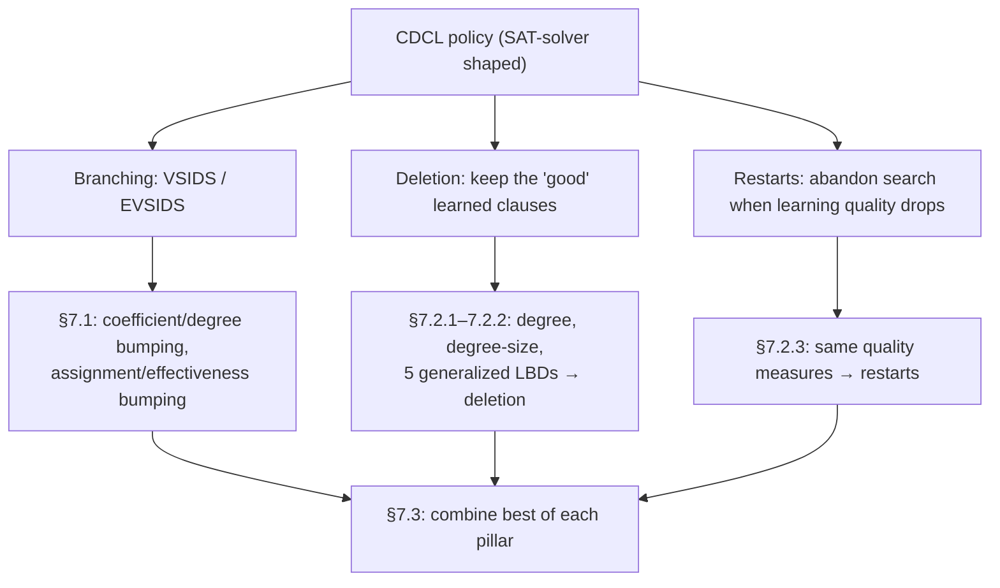

# Adapting CDCL Strategies to Pseudo-Boolean Solving

[[book-guidelines|↩ Back to guidelines]]

## Why a SAT-solver heuristic doesn't automatically work on a pseudo-Boolean constraint

CDCL SAT solvers are not just a search procedure — they are a search procedure wrapped in three policies that decide *how* to search: which variable to branch on next (the branching heuristic, e.g. VSIDS), which learned clauses are worth keeping around (deletion), and when to throw away the current partial assignment and start over (restarts). All three policies are driven by the same underlying signal: some notion of "how good, or how relevant, is this piece of learned knowledge?"

Pseudo-Boolean (PB) solvers built on [[The-Cutting-Planes-Proof-System|the cutting planes proof system]] inherited all three policies wholesale from SAT solvers, essentially unchanged. That's a strange thing to do, because a PB constraint $\sum_i a_i \ell_i \geq d$ (a weighted sum of literals bounded below by a degree $d$) is a genuinely richer object than a clause. A clause is a PB constraint where every $a_i = 1$ and $d = 1$ — the degenerate case. Reusing clause-shaped heuristics on general PB constraints means throwing away exactly the information — coefficients, degree, and the fact that a constraint can propagate while some of its literals are still unassigned — that makes PB constraints more expressive in the first place.

This chapter's project is to re-derive each of the three CDCL policies from first principles for PB constraints, using the extra structure a PB constraint carries that a clause doesn't. The throughline is: **every one of these heuristics is ultimately a proxy for "how much did this literal/constraint matter to the conflict," and clauses and PB constraints answer that question differently.**



## Part 1 — Branching: adapting (E)VSIDS (§7.1)

### What breaks without adaptation

(E)VSIDS bumps the "activity" score of every variable that appears in a clause encountered during conflict analysis, so that variables involved in recent conflicts get picked first at future decisions. For a clause, this is unambiguous: every literal in the clause was falsified, every one of them contributed to the conflict, so every one of them gets bumped by the same increment.

A PB constraint doesn't give you that uniformity for free. Take $5a + 5b + c + d + e + f \geq 6$. The literals $a$ and $b$ each *alone* almost satisfy the degree; $c$, $d$, $e$, $f$ individually are much weaker. Bumping all six variables by the same amount, as naive VSIDS would, throws away real information about which variables are structurally load-bearing in this constraint. The book's solution is to make the *increment itself* a function of the constraint's structure.

### Coefficient/degree-based bumping strategies

Four strategies multiply the usual VSIDS increment by a factor derived from the constraint's coefficients and degree:

- **bump-degree** — multiply by the constraint's degree $d$. A naive generalization of pbChaff's original approach (which only ever saw cardinality constraints, where every coefficient is already 1, so "degree" was the only knob available).
- **bump-coefficient** — multiply by the literal's own coefficient $a_i$, treating a large coefficient as a proxy for importance.
- **bump-ratio-coefficient-degree** — multiply by $a_i / d$ (Pueblo's heuristic).
- **bump-ratio-degree-coefficient** — multiply by $d / a_i$, a generalization of pbChaff's strategy that inverts the ratio.

For $5a + 5b + c + d + e + f \geq 6$, bumping $a$ multiplies the increment by $6$ (bump-degree), $5$ (bump-coefficient), $5/6$ (bump-ratio-coefficient-degree), or $6/5$ (bump-ratio-degree-coefficient) — four different answers to "how important is $a$ here," derived purely from the constraint's static shape, without looking at the assignment at all.

Empirically (Sat4j, three proof-system configurations — GeneralizedResolution, RoundingSat, PartialRoundingSat — 1200s timeout, 32GB memory, the book's standard experimental setup), **bump-ratio-coefficient-degree consistently wins** among these four, beating the solver's own default heuristic in every configuration tested. bump-degree and bump-ratio-degree-coefficient perform poorly across the board — because, as the book notes (citing pbChaff's own design rationale), these two strategies were designed to estimate *how many clauses* a PB constraint "represents" under a CNF encoding, not how relevant a literal was to *this particular* conflict. When a conflict occurs, not every implied clause of the constraint is actually involved, so treating degree as a universal importance multiplier over-bumps variables that had nothing to do with the conflict.

### Assignment/effectiveness-based bumping strategies

The coefficient/degree strategies are purely static — they never look at *which* literals were actually doing work during this specific conflict. The next five strategies fix that, using the partial assignment itself as the filter, building on the notion of an **effective literal** (Definition 107 of the book, introduced in the chapter on weakening strategies): given a conflicting or assertive PB constraint $\chi$, a falsified literal $\ell \in \chi$ is *effective* if satisfying it would not preserve the conflict (or propagation); otherwise it's *ineffective* — dead weight the constraint is carrying that had no causal role in the conflict.

- **bump-assigned** — bump only variables whose literal is currently assigned (falsified or otherwise) in the constraint.
- **bump-falsified** — bump only variables whose literal is falsified.
- **bump-falsified-propagated** — falsified literals, plus literals that were propagated at the current (latest) decision level.
- **bump-effective** — bump only variables whose literal is *effective* in the constraint.
- **bump-effective-propagated** — effective literals, plus literals propagated at the latest decision level.

Worked example (the book's Example 88): for $5a^{(0@3)} + 5b^{(1@3)} + c^{(?@?)} + d^{(?@?)} + e^{(0@1)} + f^{(1@2)} \geq 6$ at decision level 3 (notation: `literal(value@level)`, `?` = unassigned):

- bump-assigned bumps $a, b, e, f$ (everything assigned; $c,d$ are not).
- bump-falsified bumps $a, e$ (the literals whose value makes them false in the constraint).
- bump-falsified-propagated bumps $a, b, e$ (falsified, plus $b$ which was propagated at level 3).
- bump-effective bumps only $a$ — of the falsified literals, only $a$'s falsification is actually load-bearing for the conflict.
- bump-effective-propagated bumps $a, b$.

This is a strictly finer filter than "assigned" or even "falsified": effectiveness asks not just *is this literal false*, but *did its falsity matter*.

Empirically, **bump-effective wins in Sat4j-GeneralizedResolution** — a huge margin: 115 more instances solved than the default heuristic, closing most of the gap to RoundingSat's default performance. In the RoundingSat-based configurations, **bump-assigned and bump-effective-propagated** edge out bump-effective instead. The book's explanation is instructive: RoundingSat-style solvers apply *aggressive weakening* during conflict analysis (see the weakening-strategies chapter), which already strips ineffective literals out of the constraint before bumping happens — so by the time you'd bump, the "effective-only" filter has largely already been applied by the proof system itself, and a coarser assignment-based filter captures nearly the same signal at lower overhead. Effectiveness-based bumping and aggressive weakening are doing overlapping work; the more the proof system prunes, the less differentiated the bumping strategies become.

One negative result worth internalizing: combining a coefficient/degree strategy with an assignment/effectiveness strategy (e.g. "bump-effective, but scaled by coefficient") was tried and performs *worse* than either family used alone (Remark 43). The two families are not additive — they're two different lenses on the same signal, and stacking them adds noise rather than precision.

### What breaks without effectiveness-awareness

Without it, VSIDS on PB constraints degenerates into "bump everyone who happened to be in a big falsified sum," regardless of whether that literal's falsity was structurally necessary for the conflict. In a constraint with many redundant/ineffective literals, this floods the activity heuristic with noise from variables that are, causally, bystanders — exactly the asymmetry problem the chapter opens with.

```rust
// A schematic bumping dispatcher over a learned PB constraint.
// `Literal` carries its coefficient and (if assigned) decision level;
// `is_effective` implements Definition 107 relative to the conflict.
#[derive(Clone, Copy)]
enum BumpStrategy {
    Degree,
    Coefficient,
    RatioCoeffDegree,   // Pueblo's heuristic
    RatioDegreeCoeff,
    Assigned,
    Falsified,
    FalsifiedPropagated,
    Effective,
    EffectivePropagated,
}

fn bump_increment(strategy: BumpStrategy, base_increment: f64, lit: &Literal, degree: u64) -> f64 {
    match strategy {
        BumpStrategy::Degree            => base_increment * degree as f64,
        BumpStrategy::Coefficient       => base_increment * lit.coefficient as f64,
        BumpStrategy::RatioCoeffDegree  => base_increment * (lit.coefficient as f64 / degree as f64),
        BumpStrategy::RatioDegreeCoeff  => base_increment * (degree as f64 / lit.coefficient as f64),
        // assignment/effectiveness strategies gate on *whether* to bump at all,
        // rather than scaling the increment — the eligibility check happens
        // in the caller, which filters the constraint's literals first.
        _ => base_increment,
    }
}

fn eligible_literals<'a>(strategy: BumpStrategy, constraint: &'a Constraint, latest_level: u32)
    -> Box<dyn Iterator<Item = &'a Literal> + 'a>
{
    match strategy {
        BumpStrategy::Assigned => Box::new(constraint.literals.iter().filter(|l| l.is_assigned())),
        BumpStrategy::Falsified => Box::new(constraint.literals.iter().filter(|l| l.is_falsified())),
        BumpStrategy::FalsifiedPropagated => Box::new(constraint.literals.iter()
            .filter(|l| l.is_falsified() || l.decision_level() == Some(latest_level))),
        BumpStrategy::Effective => Box::new(constraint.literals.iter().filter(|l| l.is_effective())),
        BumpStrategy::EffectivePropagated => Box::new(constraint.literals.iter()
            .filter(|l| l.is_effective() || l.decision_level() == Some(latest_level))),
        _ => Box::new(constraint.literals.iter()), // coefficient/degree strategies bump everyone
    }
}
```

In Python, the same idea as a five-line sketch of "effectiveness" itself (the semantic core, without the bumping machinery around it):

```python
def is_effective(constraint, literal, assignment):
    """A falsified literal is effective if satisfying it (flipping its
    assignment) would break the conflict — i.e. it was load-bearing."""
    if not constraint.is_falsified_literal(literal, assignment):
        return False
    hypothetical = assignment.flip(literal)
    return not constraint.is_conflicting(hypothetical)
```

## Part 2 — Measuring constraint quality (§7.2)

Branching answers "who do I decide on next." Deletion and restarts both answer a different question: "is the reasoning I'm accumulating still good?" In SAT solvers this is measured per-clause via age, activity, size, or LBD (literal block distance — how many distinct decision levels a learned clause touches; a low LBD clause is one that "compresses" a lot of reasoning into few levels, which is considered a mark of quality). Section 7.2 asks which of these transfer to PB constraints, and finds that some do unmodified and others need real rework.

### What transfers unmodified — and what doesn't

Age- and activity-based measures don't look at a constraint's representation or semantics at all, so they carry over as-is. Size-based measures are where the trouble starts. In SAT, "this clause is long" is bad because a long clause is weak — you need almost every one of its literals to falsify before it can propagate. That intuition simply fails for PB constraints: a PB constraint can propagate while many of its literals are still unassigned (that's the whole point of a degree-based threshold), so raw literal count no longer tracks constraint strength.

What does track it, at least approximately? The book reaches for **slack**: the distance between the current sum of the constraint under the partial assignment and its degree. A constraint with slack 0 propagates everything; small slack signals a strong, tight constraint. Slack is offered as a *heuristic* stand-in for true strength, because computing true strength exactly (e.g. counting models) is NP-hard (Proposition 13) — this is a recurring move in the book: when the exact semantic quantity is intractable, fall back to a cheap structural proxy that correlates with it.

The other structural cost that's PB-specific: coefficients can grow arbitrarily large during conflict analysis (arbitrary-precision integers are needed), and that growth directly slows down arithmetic in every subsequent conflict-analysis step — a cost clause-based SAT solving never has to pay. This motivates two purely degree-based measures:

- **degree** quality measure — smaller degree is better.
- **degree-size** quality measure — the number of bits needed to represent the degree; also, smaller is better.

Why degree alone suffices as a coefficient proxy: the saturation rule (from the cutting-planes proof system) guarantees every coefficient in a normalized constraint is upper-bounded by the constraint's own degree — so you don't need to separately track "how big are the coefficients," the degree already caps them.

**Example (Example 89 in the book):** for $5a + 5b + c + d + e + f \geq 6$ — slack $= 8$, degree $= 6$, degree-size $= 3$ (since $6 = 110_2$ needs 3 bits).

### Literal block distance doesn't have a canonical PB definition

Standard LBD assumes every literal in the constraint is falsified (true of a learned clause by construction), and partitions them by decision level. PB constraints break this assumption immediately — a PB constraint being processed for a quality measure may have unassigned literals, and "which decision level does an unassigned literal belong to" has no canonical answer. The chapter resolves this by giving **five distinct generalizations**, each making a different choice about what to do with the literals standard LBD has no opinion about:

| Definition | Literals considered | Treatment of what's excluded |
|---|---|---|
| $LBD_a$ (Def. 108) | assigned literals only | unassigned literals simply don't count |
| $LBD_s$ (Def. 109) | assigned, plus unassigned bundled as one "same" dummy level | $+1$ to the count *iff* any literal is unassigned |
| $LBD_d$ (Def. 110) | assigned, plus every unassigned literal its own "different" level | $+u$, one extra level per unassigned literal |
| $LBD_f$ (Def. 111) | falsified literals only | mirrors clause LBD's original falsified-only view |
| $LBD_e$ (Def. 112) | effective literals only | narrows further, using Definition 107 |

Formally: let $\pi$ be the partition of the relevant literal subset by decision level, and $n = |\pi|$.

$$LBD_a(\chi) = n \qquad LBD_s(\chi) = \begin{cases} n & \text{all literals assigned} \\ n+1 & \text{otherwise}\end{cases} \qquad LBD_d(\chi) = n + u$$

where $u$ is the number of unassigned literals, and $LBD_f, LBD_e$ are structurally identical to $LBD_a$ but computed over the falsified-only, resp. effective-only, subset.

**Worked example (Example 90):** for $\chi = 5a^{(0@3)} + 5b^{(1@3)} + c^{(?@?)} + d^{(?@?)} + e^{(0@1)} + f^{(1@2)} \geq 6$:

$$LBD_a(\chi) = |\{\{a,b\},\{e\},\{f\}\}| = 3, \quad LBD_s(\chi) = |\{\{a,b\},\{c,d\},\{e\},\{f\}\}| = 4$$
$$LBD_d(\chi) = |\{\{a,b\},\{c\},\{d\},\{e\},\{f\}\}| = 5, \quad LBD_f(\chi) = |\{\{a\},\{e\}\}| = 2, \quad LBD_e(\chi) = |\{\{a\}\}| = 1$$

Note (Remark 44): all five definitions collapse to the *same* thing — the original clause LBD — the moment $\chi$ happens to be an actual clause. They're conservative generalizations, not replacements.

### What breaks without generalizing LBD

If you just apply clause-LBD's definition naively to a PB constraint (partition falsified literals by level, ignore the rest), you silently produce $LBD_f$ and throw away every signal the other four definitions were designed to capture — in particular you lose any information about how "committal" the constraint is with respect to its still-unassigned literals, which is exactly the dimension a clause never had to represent.

### Applying the measures: deletion (§7.2.2)

Each quality measure above yields a corresponding deletion policy — `delete-slack`, `delete-degree`, `delete-degree-size`, and `delete-lbd-a/s/d/f/e` — each deleting the constraints scoring *worst* (highest) on that measure when the learned-constraint database is reduced.

Empirical picture: differences *between* the eight new measures are modest, but **every one of them beats the SAT-solver-inherited `delete-activity` default** — strikingly, even *`no-deletion` (never delete anything) beats `delete-activity`*, which is a sharp signal that activity-based scoring, imported wholesale from SAT solving, is actively misleading on PB constraints rather than just suboptimal. Size/degree-based measures (`delete-degree`, `delete-degree-size`, `delete-slack`) generally edge out the LBD-based family specifically in RoundingSat-style solvers, and — notably — this improvement doesn't come from faster arithmetic (smaller coefficients), it comes from the measure being a genuinely better indicator of constraint quality.

### Applying the measures: restarts (§7.2.3)

The same eight measures can drive a Glucose-style adaptive restart policy: trigger a restart when the quality of recently learned constraints degrades. Here the result flips: **adaptive restarts based on these new measures generally underperform established SAT-solver restart schedules** (Picosat's policy in particular dominates in RoundingSat-based configurations). The one partial exception is `restart-degree` in Sat4j-GeneralizedResolution, which performs reasonably — but the book flags a caveat: in that configuration, degree can grow very large during conflict analysis (no division rule caps it, unlike in RoundingSat), which may be inflating the signal's apparent usefulness there rather than reflecting a genuinely good restart trigger.

### Why deletion and restarts diverge on the same measures

This is the chapter's most conceptually interesting negative result, and it's worth sitting with rather than just noting. Both deletion and restarts nominally ask "is recent learning good?" — so why would a measure that works for one fail for the other?

The book's own framing (§7.2.3, §7.3.1) suggests the answer is about *what each decision is actually for*: deletion is a **retrospective, per-constraint** judgment — "of everything I've learned, which individual constraints are worth keeping in the database" — where a size/degree-based proxy for strength is directly relevant, because a weak, bloated constraint costs memory and slows down every future propagation check regardless of what's happening right now. Restarts are a **prospective, aggregate** judgment — "is the trajectory of recent learning, taken as a whole, still productive, or should I abandon this branch of the search entirely." A single degree or slack value measures the shape of one constraint; it says very little about whether the *sequence* of constraints being learned reflects the search making progress. SAT-solver restart policies (Picosat's, Luby-style ones) were tuned specifically as trend detectors over a stream of clauses, not as constraint-quality scorers repurposed for triggering — and that specialization apparently matters more than which particular numeric proxy is plugged in.

## Part 3 — Putting the pillars together (§7.3)

### Combining deletion and restarts

Because Sat4j ties the deletion measure and the restart measure together by design, the book tests using the *same* quality measure to drive both simultaneously. Every combined configuration still beats the solver's `activity`/`picosat-activity` default, but the size of the improvement tracks the deletion contribution almost exactly — reinforcing §7.2.3's conclusion that these new measures are pulling their weight in deletion, and restarts are mostly along for the ride.

### Combining all "best" strategies

The final experiment takes the empirically-best bumping, deletion, and restart strategy *per proof system* and runs them together:

- **Sat4j-GeneralizedResolution:** bump-effective + delete-lbd-s + restart-degree. Solves 3884 instances vs. 3711 for the default — a substantial jump, and the combination clearly outperforms any single strategy in isolation (bump-effective alone: 3826).
- **Sat4j-RoundingSat:** bump-assigned + delete-slack + restart-picosat (no-deletion). 3962 vs. 3843 default.
- **Sat4j-PartialRoundingSat:** bump-assigned + delete-degree-size + restart-picosat (no-deletion). 3969 vs. 3855 default.

Each combination beats every one of its constituent strategies used alone — the gains are genuinely compounding, not just the best single strategy winning by default. One consistent asterisk across all three configurations: the FPGA_SAT05 benchmark family is *worse off* under the best-combination than under the plain default, a reminder that "best on average across the whole benchmark suite" is not the same claim as "best on every family" — a theme the book returns to more directly when it turns to full-scale benchmarking.

Even after combining everything in this chapter, none of the resulting Sat4j configurations beats the original, purpose-built RoundingSat implementation, nor Sat4j-Resolution running in parallel as part of Sat4j-Both. The chapter is explicit that this isn't meant to read as "these strategies don't matter" — the gains from bumping alone (up to +115 instances in one configuration) are larger than the gains from deletion or restarts, and stacking all three pillars compounds further — but rather that the proof system and propagation mechanism (slack-based vs. watched-literal-based detection) still dominate the CDCL-strategy layer in overall impact. Strategy tuning and proof-system engineering are complementary axes of improvement, not substitutes for one another.

## Where this leads

This chapter operationalizes a idea that runs through the whole book: a PB constraint is not "a clause with extra bookkeeping" — it's a genuinely different object, and every piece of CDCL machinery that was implicitly designed around clause semantics (uniform literal roles, all-falsified-on-conflict, size as a weakness proxy) has to be re-derived, not just ported, when the underlying constraint form changes. The effective/ineffective literal distinction this chapter leans on for bumping and $LBD_e$ is the same one the weakening-strategies material develops for reducing learned constraints to clauses in the first place — the two chapters are looking at the same underlying concept (which literals in a falsified PB constraint were causally necessary) from two different angles: one uses it to decide what to *keep in* a constraint, the other uses it to decide what to *reward* in a heuristic. The specific numbers in this chapter (instance counts, cactus-plot rankings) are themselves revisited and stress-tested at larger scale in the book's dedicated empirical-evaluation chapter, which is a different lens on the same underlying strategies: less "why does this work," more "how robust is this finding across solvers and benchmark families."

For the standing project of building a Rust-based verifier/CSP kernel (`sat-smt-csp` focus area): the effectiveness-based filtering pattern here — asking not just "is this fact false" but "was this fact's falsity load-bearing for the conflict" — is a directly transferable design principle for any constraint-propagation engine that does conflict-driven learning, whether the underlying domain is Boolean, integer, or a richer lattice: the same question ("which piece of the accumulated reasoning was actually necessary, versus incidentally present") recurs anywhere a solver has to decide what's worth remembering versus what's safe to prune. The tension identified between deletion-shaped and restart-shaped quality measures is also a useful caution for that project's own CSP kernel: a metric that's a good proxy for "should this constraint be kept in the database" is not automatically a good proxy for "should this search branch be abandoned" — they are different decisions wearing the same units.
