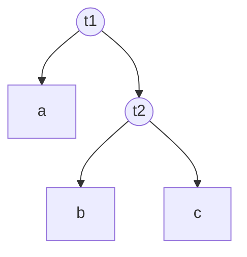
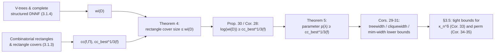

[[book-guidelines|↩ Back to guidelines]]

# Communication Complexity and Lower Bounds on Compilation

## The problem this machinery solves

Chapter 3 spends its first two sections building a menagerie of graph width measures — treewidth, cliquewidth, mim-width, and their signed/modular/dual variants — and showing (via the at-most-one function and the ladder encoding) that auxiliary variables can crash a CNF encoding's width from $n-1$ down to $2$. That's an *upper*-bound story: here's a clever encoding, look how narrow it is. But upper bounds alone don't tell you whether you were clever or just lucky — you need a way to prove that *no* encoding, however cleverly you introduce auxiliary variables, can do better than some width $k$. Without a matching lower-bound technique, "this encoding has treewidth 2" is a fact about one construction, not a fact about the function.

This is exactly the gap communication complexity fills. The connection is not obvious on its face — communication complexity is a two-party game about limiting *information exchanged between players*, seemingly unrelated to *the structure of a circuit*. The bridge Wallon builds (following [PD10], [BCMS16]) is this: a narrow compiled circuit, read the right way, *is* a cheap communication protocol. If you can show a Boolean function forces every communication protocol computing it to exchange many bits, you've shown every circuit computing it must be wide — for free, without reasoning about circuits directly at all. This article covers that bridge: combinatorial rectangles and rectangle covers (§3.1.3), the representation language the argument is stated over — structured deterministic DNNF and v-trees (§3.1.4) — and the resulting lower-bound machinery and its two worked applications, cardinality constraints and the permutation function (§3.3, §3.5).

**What this article deliberately leaves out:** the equivalence of treewidth, cliquewidth, modular treewidth, mim-width, etc. up to a $\log(n)$ factor (§3.4) is covered by the companion article on [[Graph-Width-Measures-for-CNF-Formulae-and-Encodings|graph width measures]]. Here, width measures appear only as the *targets* the communication-complexity lower bounds are aimed at — the bound itself, and the proof technique, are the focus.

---

## Part 1 — Rectangles: the combinatorial object underneath communication complexity

### The two-player game, stripped to its essentials

Communication complexity (Wallon cites [KN97] as the standard reference) studies a scenario with two players, traditionally called Alice and Bob. A function $f$ is defined on a variable set $X$, split into two disjoint halves $Y$ and $Z$ with $X = Y \cup Z$. Alice is handed an assignment to $Y$, Bob an assignment to $Z$, and neither can see the other's input. They want to jointly determine $f(X)$, communicating according to some protocol, and the complexity measure of interest is *how much they have to say to each other* — not how much computation either does locally.

**What breaks without this framing:** if you instead asked "how many gates does it take to compute $f$," you'd be back to ordinary circuit complexity, which is what you're trying to get a lower bound *on* — circular. Communication complexity sidesteps this by charging only for the bits crossing the Alice/Bob boundary, which turns out to be exactly the resource that a bounded-width circuit is stingy with when it's forced to "summarize" one side of a variable partition into a small state.

### Combinatorial rectangles: what a protocol's answer set looks like

> **Definition 77 (Combinatorial Rectangle).** Let $X$ be a set of variables and $\Pi = (Y, Z)$ a partition of $X$. A combinatorial rectangle respecting $\Pi$ is a Boolean function $r(X)$ that can be written as a conjunction $r(X) = r_1(Y) \land r_2(Z)$.

The name comes from picturing the truth table of $f$ as a matrix: rows indexed by assignments to $Y$, columns by assignments to $Z$. A set of models forming a rectangle in this matrix is precisely a set of the form (some set of rows) $\times$ (some set of columns) — the defining feature of low-communication protocols is that whatever Alice and Bob can jointly certify without further back-and-forth is always a rectangle, because once the protocol has settled on an answer, *neither party's decision depends on information the other has but didn't send*.

> **Definition 78 (Rectangle Cover).** Let $f$ be a Boolean function on $X$. A rectangle cover of size $s$ respecting $\Pi = (Y,Z)$ is a representation $f(X) = \bigvee_{i=1}^s r_i(X) = \bigvee_{i=1}^s r_1^i(Y) \land r_2^i(Z)$ where every $r_i$ is a combinatorial rectangle respecting $\Pi$.

**Example 35 (the book's own).** Take $\varphi = (\lnot x \land \lnot y \land z) \lor (x \land y \land z) \lor (x \land \lnot y \land \lnot z)$. As written, this DNF is already a rectangle cover of size 3 respecting *any* partition of $\{x,y,z\}$ — every DNF is trivially a rectangle cover of itself, since each term is already a conjunction over disjoint variable groups. But for the specific partition $(\{x,y\},\{z\})$, a smaller cover exists: $\bigl((\lnot x \land \lnot y) \lor (x \land y)\bigr) \land z \ \lor\ (x \land \lnot y \land \lnot z)$, size 2. The book notes this is optimal for that partition — you cannot merge the disjunction further without breaking the rectangle shape.

This example is the whole idea in miniature: the *DNF size* of $\varphi$ says nothing about its rectangle-cover-optimal size for a *given* partition; finding the smallest cover is a genuinely different (and generally harder) combinatorial question, tied to how "entangled" the two variable groups are.

```python
# A rectangle cover is a disjunction of independent (Y-side, Z-side) checks.
# Concretely, for the book's phi under partition ({x,y},{z}):
def phi_cover(x: bool, y: bool, z: bool) -> bool:
    r1 = (not x and not y) or (x and y)   # r1(Y) -- depends only on x, y
    r2 = z                                 # r2(Z) -- depends only on z
    rect1 = r1 and r2
    rect2 = (x and not y and not z)        # a second rectangle, r1'(Y) and r2'(Z)
    return rect1 or rect2

# Contrast: a *non*-rectangle predicate like "x == y == z" cannot be written
# as a disjunction of (f(x,y) and g(z)) terms without paying for every
# (x,y) combination separately -- that's exactly what forces a large cover.
```

### From cover size to a complexity measure

> **Definition 79 (Non-Deterministic Communication Complexity).** $cc(f, \Pi) = cc(f, (Y,Z)) := \log(s_{\min})$, where $s_{\min}$ is the minimum size of any rectangle cover of $f$ respecting $\Pi$.

Taking the log converts "number of rectangles" into "number of bits" — $\log(s_{\min})$ bits are enough for a non-deterministic prover to name *which* rectangle a given input falls into (a one-hot index into $s_{\min}$ possibilities), and this is exactly the standard non-deterministic communication complexity of $f$ under partition $\Pi$: Alice and Bob (or an external prover, in the non-deterministic setting) exchange a certificate for one rectangle, and checking it is trivial once received.

A single fixed partition can be arbitrarily easy or hard, so it is useful to quantify over *all* reasonably balanced partitions and ask for the hardest-of-the-easiest:

> **Definition 80 (Best-Case Non-Deterministic Communication Complexity).** $cc_{best}^{1/3}(f) := \min_{\Pi}\bigl(cc(f,\Pi)\bigr)$, minimizing over all partitions $\Pi = (Y,Z)$ of $X$ with $\min(|Y|,|Z|) \ge |X|/3$.

The $\tfrac13$-balance restriction matters: without it, the minimizing partition could put almost all variables on one side and a handful on the other, trivializing the bound (a rectangle cover w.r.t. a nearly-empty $Z$ is nearly free). Restricting to partitions where *both* sides carry at least a third of the variables forces the lower bound to be about genuine two-sided structure, which is exactly the structure a width-bounded circuit has to summarize across *some* cut of its variables no matter how the circuit is shaped.

**Example 36 (the book's own, and instructive precisely because it's a negative result about naive expectations).** Let $eq_n(x_1,\dots,x_n,y_1,\dots,y_n)$ hold iff $x_i = y_i$ for every $i$. Under the "obvious" partition $\Pi_1 = (\{x_i\}, \{y_i\})$ — all $x$'s vs. all $y$'s — this is the textbook-hard equality function: $cc(eq_n, \Pi_1) = n$ [KN97, Ch. 2]. But under the *interleaved* partition $\Pi_2 = (\{x_1,y_1,\dots,x_{\lceil n/2\rceil},y_{\lceil n/2\rceil}\}, \{x_{\lceil n/2\rceil+1},y_{\lceil n/2\rceil+1},\dots,x_n,y_n\})$, $eq_n$ factors as $\bigl(\bigwedge_{i\le \lceil n/2\rceil} x_i=y_i\bigr) \land \bigl(\bigwedge_{i > \lceil n/2\rceil} x_i = y_i\bigr)$ — a single rectangle, so $cc(eq_n,\Pi_2) = 0$. Since $\Pi_2$ is $\tfrac13$-balanced, $cc_{best}^{1/3}(eq_n) = 0$.

The lesson: hardness under one partition tells you nothing about $cc_{best}^{1/3}$ — the *best-case* measure is deliberately adversarial to the function, not to a fixed protocol. This is precisely why it will end up lower-bounding circuit width later: a circuit gets to *choose* how it partitions variables (that's what a v-tree is), so a lower bound on encoding width needs a lower bound that holds no matter which balanced partition the circuit designer picks — i.e. exactly $cc_{best}^{1/3}$.

---

## Part 2 — Structured deterministic DNNF: the circuit model the bound is stated over

Rectangle covers connect to communication complexity abstractly, but the bridge to *circuit width* needs a circuit model with an explicit, fixed way of splitting variables — this is what a v-tree supplies.

> **Definition 81 (V-Tree).** A v-tree $T$ for a variable set $V$ is a full binary tree whose leaves are in bijection with $V$; the variable assigned to a leaf $v$ is its label.
>
> **Notation 9.** For a node $t$ of $T$, $T_t$ is the subtree rooted at $t$, and $\mathrm{var}(T_t)$ the variables labeling its leaves.

**Example 37 (the book's own).**



Every internal node $t$ of a v-tree induces a bipartition of the variable set: $\mathrm{var}(T_t)$ vs. everything else. Here, node $t_2$ induces the partition $(\{b,c\}, \{a\})$. This is the mechanism that will let "a node of the v-tree" stand in for "a partition $(Y,Z)$" in the theorem below — the v-tree is nothing but a nested family of balanced-or-not bipartitions, baked into the circuit's structure.

A **complete structured DNNF** organizes a Boolean circuit's gates into blocks, one block per v-tree node, respecting that bipartition structure at every level:

> **Definition 82 (Complete Structured DNNF).** A complete structured DNNF $D$ structured by v-tree $T$ is a circuit with a labeling $\mu$ of $T$'s nodes by subsets of $D$'s gates such that: every gate $g$ belongs to a unique node's label $\mu(t_g)$; a leaf labeled by variable $x$ may only have $x, \lnot x$ in its label (and every literal gate sits at a leaf); every $\lor$-gate's inputs are all $\land$-gates in the *same* block; every $\land$-gate has exactly two inputs, which are $\lor$-gates or literals sitting in the two *child* blocks of $t_g$ in $T$. $D$ is **deterministic** if the circuit itself is deterministic (at most one disjunct of any $\lor$-gate is true under any input).

Intuitively (Remark 16): the gates are organized into a tree of blocks mirroring $T$; each block computes a small 2-level ($\land$-of-$\lor$s, i.e. essentially a DNF) combination of what its two children blocks already computed. This is exactly the recursive shape of a divide-and-conquer decision procedure over the variable partition induced by $T$.

> **Definition 83 (Width of a Complete Structured DNNF).** $\mathrm{wi}(D) := \max_t |\mu(t)|$ — the largest number of $\lor$-gates assigned to a single v-tree node.

**Example 38 (the book's own)** shows the DNNF over $\{a,b,c\}$ structured by the v-tree above: block $t_1$ (root) has one $\lor$-gate feeding from an $\land$ combining the literal $a/\lnot a$ with the sub-result of block $t_2$; block $t_2$ has one $\lor$-gate combining $b, \lnot b$ with $c, \lnot c$. Width 1 throughout.

```rust
// A complete structured DNNF node, following the v-tree recursively.
// Each block computes an OR over AND-pairs drawn from its two v-tree children
// (or is a literal, at a v-tree leaf).
enum DnnfBlock {
    Literal { var: usize, positive: bool },
    Block {
        // one entry per AND-gate in this v-tree node's block;
        // wi(D) is the max, over all blocks, of the OR-gate fan-in here.
        and_pairs: Vec<(Box<DnnfBlock>, Box<DnnfBlock>)>, // (left child block, right child block)
    },
}

impl DnnfBlock {
    fn width(&self) -> usize {
        match self {
            DnnfBlock::Literal { .. } => 0,
            DnnfBlock::Block { and_pairs } => and_pairs.len().max(
                and_pairs.iter()
                    .map(|(l, r)| l.width().max(r.width()))
                    .max().unwrap_or(0)
            ),
        }
    }
}
```

This is deliberately a literal transcription of the definitions: `and_pairs.len()` is exactly $|\mu(t)|$ for one block, and taking the max recursively gives $\mathrm{wi}(D)$.

**Determinism's role, and a caveat (Remark 15).** Because determinism means at most one disjunct of each $\lor$-gate fires per input, a deterministic complete structured DNNF's blocks behave like a case-split with no overlap — which is exactly what will let the width bound the *number of distinguishable rectangles* below, not just the size of a cover. The book also notes a subtlety worth flagging: forgetting (existentially quantifying) a variable from a *deterministic* complete structured DNNF does not, in general, preserve determinism — a fact that matters if you're chaining these results with existential elimination elsewhere in the thesis, but is not needed for the lower bound itself.

---

## Part 3 — The bridge: width bounds rectangle covers, and vice versa gives lower bounds

### Width of a DNNF block bounds a rectangle cover of the whole function

This is the technical heart of the chapter — an application of [PD10]'s result (for the more general, not-necessarily-complete structured DNNF model) specialized to the complete case, with the specialization justified via [BCMS16, §5]:

> **Theorem 4.** Let $D$ be a complete structured DNNF structured by v-tree $T$, computing $f$ on variables $X$. Let $t$ be a node of $T$, $Y = \mathrm{var}(T_t)$, $Z = X \setminus \mathrm{var}(T_t)$, and $n$ the number of $\lor$-gates in $\mu(t)$. Then there is a rectangle cover of $f$ respecting $(Y,Z)$ of size at most $n$.

**Why this is true, intuitively:** every proof tree of $D$ (a witness that some input satisfies $f$, traced through the circuit — formalized later as Definition 84) passes through *exactly one* $\lor$-gate at node $t$, because $t$'s block computes a 2-DNF over its children and determinism/completeness force a single path. Each choice of which $\lor$-gate at $t$ is "the one used" fixes a rectangle: everything below $t$ in $T$ (variables $Y$) is decided by the sub-circuit feeding that $\lor$-gate's left branch, and everything outside (variables $Z$) by the rest of $D$ built on top — and these two halves genuinely don't interact once you've fixed *which* $\lor$-gate fired, which is precisely the rectangle property $r_1(Y) \land r_2(Z)$. Since there are at most $n = |\mu(t)|$ such gates to choose from, $n$ rectangles suffice to cover every model.

Taking logs turns "rectangle-cover size" into "communication complexity," giving the form the rest of the chapter actually uses:

> **Proposition 30.** With $D, T, t, Y, Z$ as above: $\log(\mathrm{wi}(D)) \ge cc(f,(Y,Z))$.

*Proof.* Theorem 4 says the optimal rectangle-cover size for $(Y,Z)$ is at most $\mathrm{wi}(D)$ (the width bounds $n$ at every node, not just $t$); take $\log$ of both sides. $\blacksquare$

This one inequality is doing all the work in the rest of the chapter: it converts *any* statement of the form "$f$ needs a big rectangle cover for every balanced partition" into "every complete structured DNNF computing $f$ has to be wide somewhere." Since a v-tree always has a reasonably balanced node —

> **Corollary 28.** For every complete structured DNNF $D$ computing $f$: $\mathrm{wi}(D) \ge 2^{cc_{best}^{1/3}(f)}$.

*Proof.* Any v-tree over $X$ has a node $t$ with $|X|/3 \le |\mathrm{var}(T_t)| \le 2|X|/3$ (walk down from the root; the variable count at least halves each step, so some node lands in this range) — plug that $t$ into Proposition 30. $\blacksquare$

— this closes the loop: you no longer need to know or choose a specific v-tree to get a bound; $cc_{best}^{1/3}(f)$ alone forces *every* structured DNNF computing $f$, however it's structured, to be exponentially wide in that quantity.

### From DNNF width to encoding-parameter lower bounds

The final step generalizes away from DNNF specifically, to *any* representation language with an algorithm that compiles bounded-parameter instances into narrow DNNF — which is exactly the situation for CNF encodings under treewidth, cliquewidth, etc., since fixed-parameter-tractable SAT algorithms for these parameters are essentially DNNF-compilation algorithms in disguise:

> **Theorem 5.** Let $L$ be a fully expressive representation language, $p: L \to \mathbb{N}$ a parameter. If every $f$ encoded by some $\lambda \in L$ has a complete structured DNNF $D$ with $\mathrm{wi}(D) \le 2^{p(\lambda)}$, then $p(\lambda) \ge cc_{best}^{1/3}(f)$.

*Proof.* $p(\lambda) \ge \log(\mathrm{wi}(D)) \ge cc_{best}^{1/3}(f)$ by assumption and Corollary 28. $\blacksquare$

Wallon's own framing of what this *means* is worth keeping verbatim: "it is exactly the algorithmic usefulness of parameters that makes the resulting instances inexpressive... if a parameter has good algorithmic properties allowing efficient compilation into DNNF, then this parameter puts strong restrictions on the complexity of the expressible functions." The same feature that makes a width parameter *tractable* — a compilation algorithm exponential only in that parameter — is mechanically what forces it to be *large* whenever the function is communication-hard. There is no way to have both a cheap FPT algorithm and expressiveness for communication-hard functions; Theorem 5 is the formal version of that trade-off.

Instantiating $p$ with the concrete width measures the chapter studies gives the chapter's headline lower bounds (proved via known DNNF-compilation algorithms for each parameter, cited but not re-derived here since they belong to the companion width-measures article):

> **Corollary 29.** $\min\{tw_i(\varphi), tw_p(\varphi), tw_d(\varphi), scw(\varphi)\} \ge b \cdot cc_{best}^{1/3}(f)$ for every CNF $\varphi$ encoding $f$ (some constant $b>0$) — incidence/primal/dual treewidth and signed incidence cliquewidth.
>
> **Corollary 30.** Same bound, for circuits: $\min\{tw(C), cw(C)\} \ge b \cdot cc_{best}^{1/3}(f)$.
>
> **Corollary 31.** For parameters with only *polynomial* (not FPT) algorithms once fixed — mim-width, cliquewidth, modular treewidth — the bound is weaker by a $\log(n)$ factor: $\min\{mimw(\varphi), cw(\varphi), mtw(\varphi)\} \ge b \cdot cc_{best}^{1/3}(f) / \log(n)$.

The book flags that the $\log(n)$ gap in Corollary 31 versus Corollary 29 is *not* an artifact of a loose proof — §3.4 (the companion article's territory) shows the equivalence-of-width-measures result that makes this gap tight: there always exists an encoding of cliquewidth roughly $n/\log(n)$ whenever treewidth $n$ is achievable, so no proof technique could close that gap without the underlying fact being false.

---

## Part 4 — Two worked lower bounds: the payoff

These two applications (§3.5) are where the abstract machine above earns its keep — each one is a genuine "we now know the truth, not just a bound someone constructed" result.

### Cardinality constraints: the bound matches the construction exactly

Recall the cardinality constraint $\kappa_n^\delta \equiv \sum_{i=1}^n x_i \ge \delta$. An upper-bound construction (Observation 3) encodes it with primal treewidth $O(\log(\min(\delta, n-\delta)))$, by tracking a running partial sum in binary, capped at $\delta$, using $O(\log \delta)$ auxiliary bits at each step — a sequential-counter-style encoding, but with the counter in binary rather than unary specifically to keep the treewidth (not the size) small.

The matching lower bound goes through best-case communication complexity directly:

> **Proposition 31.** For $\delta < n/2$: $cc_{best}^{1/3}(\kappa_n^\delta) = \Omega(\log(\min(\delta, n/3)))$.

*Proof idea.* Fix any balanced partition $(Y,Z)$. Construct $s = \min(\delta, n/3)$ assignment pairs $(I_i, I_i')$ where $I_i$ puts $\delta - i$ ones on the $Y$-side and $I_i'$ puts $i$ ones on the $Z$-side — each pair sums to exactly $\delta$, so all are models. The key combinatorial fact: no single rectangle in a cover can contain two such pairs $(I_i, I_i')$ and $(I_j, I_j')$ with $i \ne j$, because a rectangle is closed under "mixing" — if it contains $(I_i, I_i')$ and $(I_j, I_j')$ it must also contain the cross-combination $(I_j, I_i')$, which sums to a wrong total and is *not* a model. So every one of the $s$ pairs needs its own rectangle. $\blacksquare$

This "mixing" argument is the generic template for lower-bounding rectangle covers: exhibit many models that pairwise *cannot* share a rectangle because recombining their two halves produces a non-model. It is essentially a fooling-set argument dressed up in the rectangle-cover vocabulary.

Combining the symmetric $\delta > n/2$ case with Theorem 4 gives the tight result:

> **Corollary 33.** Optimal-primal-treewidth CNF encodings of $\kappa_n^\delta$ have treewidth exactly $\Theta(\log(\min(\delta, n-\delta)))$ (same for dual/incidence treewidth, signed incidence cliquewidth; constant width suffices for incidence cliquewidth, modular treewidth, mim-width).

The upper and lower bounds meet exactly — this is a case where the theory doesn't just bound the problem, it *solves* it: nobody will ever find a smaller-treewidth encoding of a cardinality constraint, and the binary-counter construction was already optimal.

### The permutation function: beating a prior bound by a log factor

$perm$ takes $n^2$ variables $\{x_{i,j}\}$ read as a matrix and is true exactly on permutation matrices (one 1 per row, one 1 per column).

**Example 39 (the book's own).** For $n=2$: $perm_2$ accepts $\begin{pmatrix}1&0\\0&1\end{pmatrix}$ and $\begin{pmatrix}0&1\\1&0\end{pmatrix}$, rejects $\begin{pmatrix}1&1\\1&0\end{pmatrix}$ (a row with two 1's) and $\begin{pmatrix}0&1\\0&0\end{pmatrix}$ (a column with none).

```python
def is_permutation_matrix(matrix: list[list[int]]) -> bool:
    n = len(matrix)
    rows_ok = all(sum(row) == 1 for row in matrix)
    cols_ok = all(sum(matrix[i][j] for i in range(n)) == 1 for j in range(n))
    return rows_ok and cols_ok
```

Prior work [BKM11] showed CNF encodings of $perm$ require treewidth $\Omega(n/\log n)$. Wallon improves this by exactly the $\log n$ factor that Corollary 31 costs — because here the argument is run directly against Proposition 30/Theorem 4 (the *unweakened*, per-partition bound), not the polynomial-algorithm corollary:

> **Lemma 8.** For every v-tree $T$ on $X_n$, there is a node $t$ with $cc(perm, Y, Z) = \Omega(n)$, $Y = \mathrm{var}(T_t)$, $Z = X \setminus Y$.

*Proof idea.* Every model of $perm$ corresponds to a permutation $\pi_M$. Since every v-tree has $n-1$ internal nodes but $perm$ has $n!$ models, pigeonhole gives a node $t$ that is the "balance point" ($n/3$ to $2n/3$ of $M$'s 1-entries fall in $Y$) for at least $(n-1)!$ of them. For a rectangle $R = r_1(Y) \land r_2(Z)$ in a cover respecting $(Y,Z)$: fixing which row-indices map into $Y$-columns (a set of size $k$, $n/3 \le k \le 2n/3$) pins down which sub-permutation $r_1$ can realize — at most $k!$ choices — and symmetrically at most $(n-k)!$ choices for $r_2$. So each rectangle covers at most $k!(n-k)!$ of the $(n-1)!$ balanced models, and $k!(n-k)! \le (n/3)!\,(2n/3)!$ for $k$ in that range. Dividing $(n-1)!$ by this bound and simplifying (the book does this via Stirling-type estimates) gives a required rectangle count that grows like $\bigl(3^{-1/3}\bigr)^n / n$ — exponential in $n$ — so $\log$ of the minimum cover size, i.e. $cc(perm,Y,Z)$, is $\Omega(n)$. $\blacksquare$

Applying Theorem 4/Proposition 30 style reasoning to Lemma 8 (rather than going through the weaker best-case-only Corollary 28/Theorem 5 path) yields:

> **Corollary 34.** Optimal-primal-treewidth CNF encodings of $perm_n$ have treewidth exactly $\Theta(n)$.

The upper bound $O(n)$ comes from a direct construction: check each row's "exactly one 1" constraint in sequence, carrying forward, per column, a bit remembering "have we already seen a 1 in this column" — a tree decomposition over the rows with $O(n^2)$ auxiliary variables. Then, applying the width-measure-equivalence machinery of §3.4 (Theorem 6) to this treewidth bound:

> **Corollary 35.** Optimal-incidence-cliquewidth CNF encodings of $perm_n$ have width $\Theta(n/\log n)$ — resolving an open question left by [BKM11], who only had a conditional bound.

Notice the asymmetry with the cardinality-constraint case: there, the $\log n$-cost corollary (31) was tight because the *construction itself* only achieved $O(\log(\min(\delta,n-\delta)))$ treewidth to begin with. Here, going back to the unweakened per-node bound (Lemma 8 used directly against Theorem 4, not funneled through the FPT-parameter machinery of Corollary 31) is what recovers the missing $\log n$ factor — a reminder that Theorem 5's generic $cc^{1/3}_{best}$-based corollaries are convenient but not always the tightest tool available; sometimes it pays to go back to Proposition 30 directly.

---

## Where this leads



Within the thesis, this chapter's lower-bound machinery is the necessary complement to the width-measure-equivalence results of §3.4 (the sibling article): together they establish that (a) once auxiliary variables are allowed, all the width measures the thesis considers are essentially the same parameter up to $\log n$, and (b) that parameter has a hard floor set by communication complexity that no encoding trick can evade. The chapter's closing remark is the practical payoff: any solving algorithm whose runtime is exponential in one of these width measures (as all width-based exact algorithms are) will provably choke on cardinality or pseudo-Boolean constraints with large $\delta$ or many variables — not because nobody has found the right encoding yet, but because Corollary 33/34 prove none exists.

For the standing `sat-smt-csp` focus area: this chapter is a clean instance of a **fooling-set / rectangle-cover lower-bound argument**, the same proof shape that recurs whenever you need to show a solver or symbolic representation (a BDD, a DNNF, a treewidth-bounded CSP structure) cannot avoid blowing up on some family of instances — the "mixing" argument in Proposition 31's proof (two valid pairs whose cross-combination is invalid, hence they can't share a rectangle) is structurally the same technique used to lower-bound BDD/DNNF size for functions like the hidden-weighted-bit function or multiplication, and is worth recognizing on sight whenever a later source claims "this representation is provably exponential."
