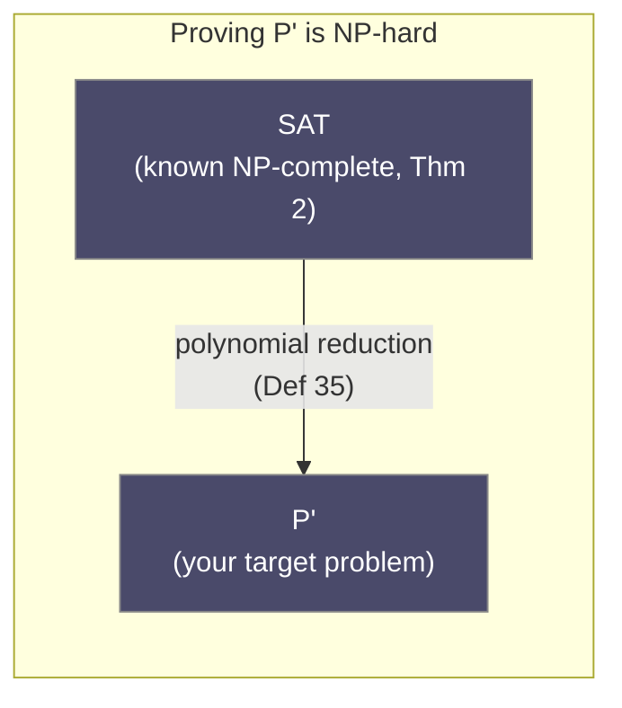
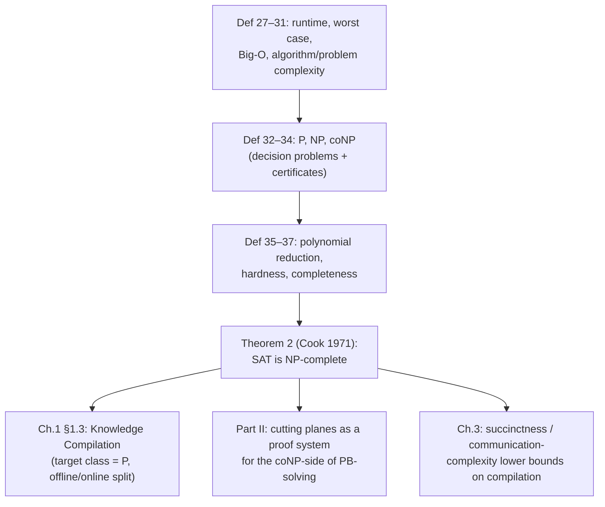

[[book-guidelines|↩ Back to guidelines]]

## Why the thesis stops to define this at all

Wallon's thesis spends its first chapter on plumbing — propositional logic, pseudo-Boolean constraints, CNF encodings — before it can say anything interesting. Section 1.2 is the last piece of that plumbing, and it's easy to skim past because none of it is new to anyone who has taken an algorithms course. But it earns its place for a specific reason: the entire thesis is an argument that lives or dies on complexity distinctions.

Part I ([[Knowledge-Compilation|knowledge compilation]]) is precisely the claim that some representations let you move hard queries from "intractable" to "tractable" by doing the hard work once, offline. That claim is meaningless without a formal notion of "tractable" — which is exactly Definition 32, the class **P**. Part II (pseudo-Boolean solving via cutting planes) is an argument about *proof systems* for **NP**-hard problems, and every "this doesn't help unless P = NP" aside in the text is leaning on Definitions 32–37. And the single fact that licenses treating SAT (and, by extension, pseudo-Boolean satisfiability) as *the* canonical hard problem to reduce from is Cook's theorem — Theorem 2. If you don't nail down Section 1.2 precisely, half of the thesis's later hardness arguments read as hand-waving instead of what they actually are: rigorous reductions.

So this article treats Section 1.2 as what it is: a short, dense checklist of definitions that every later hardness/succinctness proof in the book will invoke by name.

## Running time: what you're actually measuring

**What breaks without this:** "how fast is this algorithm" is meaningless until you fix *what counts as a step* and *on which inputs*. Without a shared cost model, two people can disagree about an algorithm's speed while agreeing about everything else.

The book fixes this by adopting the RAM (random-access machine) model from Cormen–Leiserson–Rivest–Stein, and gives:

> **Definition 27 (Running Time of an Algorithm).** The running time (or simply *runtime*) of an algorithm on a particular input $X$ is a function $f$ mapping $X$ to the number of elementary instructions required for the execution of the algorithm on this input.

Note what this *isn't* yet: it's a function of a single concrete input $X$, not of a size $n$. Two inputs of the same size can take wildly different numbers of steps (think: a search that gets lucky and finds its target on the first try vs. one that doesn't). To get something you can actually reason about across all inputs of a given size, the book collapses that variability into a single number — the worst case:

> **Definition 28 (Worst Case Running Time of an Algorithm).** Let $A$ be an algorithm having runtime $f$ and let $s$ be a function computing the size of any input $X$ of $A$. The worst case runtime of $A$ on inputs of size $n$ is the function $r$ given by
> $$r(n) = \max\{f(X) \mid s(X) = n\}.$$
> In this case, we say that $A$ runs in time $r(n)$.

Everything downstream in the book ("this algorithm runs in $O(n^2)$", "this problem is in P") is implicitly talking about this $r$, not about $f$ on some particular lucky or unlucky input.

**Rust grounding.** You already compute something like $f(X)$ every time you reason about a hot loop's instruction count:

```rust
// f(X): elementary steps for one concrete input
fn linear_search(xs: &[i32], target: i32) -> Option<usize> {
    for (i, &x) in xs.iter().enumerate() { // one comparison per iteration
        if x == target {
            return Some(i);
        }
    }
    None
}
```

`f(X)` for a specific slice `xs` and `target` is the number of loop iterations actually executed. `s(X) = xs.len()` is the size function. The worst-case runtime $r(n) = n$ is what you get by imagining the adversarial input of length $n$ where `target` is absent (or last) — you, the analyst, are literally computing $\max\{f(X) \mid s(X) = n\}$ by hand when you say "linear search is $O(n)$."

## Big-O: throwing away constants and small inputs on purpose

**What breaks without this:** exact runtime formulas are fragile — they depend on the machine, the compiler, the constant factors in your instruction count. If your notion of "efficient" required exact formulas, two equivalent algorithms compiled by different compilers could count as having "different complexity." Big-O is the deliberate act of forgetting the details that don't survive a change of machine.

The book gives the standard Knuth–Landau definition, and only this one — it does not separately define big-$\Omega$ or big-$\Theta$ as named notions, since everywhere else in the text an *upper bound* on runtime is all that's needed to talk about tractability and hardness:

> **Definition 29 ($O(\cdot)$).** Given functions $r, f : \mathbb{N} \to \mathbb{N}$, we say that $r$ is in $O(f(n))$, denoted $r(n) = O(f(n))$, if there exist $n_0 \in \mathbb{N}$ and a constant $c \in \mathbb{N}$ such that, for any $n \ge n_0$, $r(n) \le c \cdot f(n)$.

Read this the way it's meant to be read: "eventually (past $n_0$), and up to a constant factor $c$, $r$ never exceeds $f$." Both the constant and the point where the bound kicks in are existentially quantified — you get to pick them, once, to make the inequality hold forever after.

Since the requested scope for this topic explicitly names big-$\Omega$ (lower bound) and big-$\Theta$ (tight bound) alongside big-O, and the book doesn't spell them out, here they are for completeness, built by mechanically flipping or combining Definition 29 — this part is *not* Wallon's text, just the standard dual construction:
$$r(n) = \Omega(f(n)) \iff \exists n_0, c > 0.\ \forall n \ge n_0.\ r(n) \ge c \cdot f(n)$$
$$r(n) = \Theta(f(n)) \iff r(n) = O(f(n)) \text{ and } r(n) = \Omega(f(n))$$
In practice, the thesis only ever needs the $O(\cdot)$ half: every complexity-class definition in this section (P, NP, coNP) is phrased as an *upper bound* on some resource, so $\Omega$/$\Theta$ never actually appear in the rest of the document.

**Rust grounding.** The constant-forgetting move is exactly what you do when you look at generated assembly for two implementations of the same asymptotic algorithm and shrug: `Vec::sort` (which is $O(n \log n)$ regardless of whether the underlying implementation is timsort or pattern-defeating quicksort) is the same "$O(f(n))$" no matter which constant-factor-different implementation the standard library ships — Definition 29 is precisely the equivalence relation that lets you say that sentence without checking which one you're actually calling.

## From algorithms to problems: complexity as a property of the *problem*

Definitions 27–29 are about a specific algorithm. Definitions 30–31 lift this to something more useful for the rest of the thesis, which almost never talks about a specific algorithm — it talks about *problems*:

> **Definition 30 (Complexity of an Algorithm).** The (time) complexity of an algorithm is said to be in $O(f(n))$ when the runtime of the algorithm is upper bounded by $f(n)$.

> **Definition 31 (Complexity of a Problem).** We say that the complexity of a problem $P$ is in $O(f(n))$ if there is an algorithm that solves $P$ and runs in time $O(f(n))$.

The quiet but important move in Definition 31 is the existential quantifier: a problem's complexity is the *best available* algorithm's complexity, not any particular one. This is why "SAT is NP-complete" is a statement about the *problem* SAT, not about any specific SAT solver — CDCL solvers, which the thesis spends its second half on, are attempts to be fast *in practice* on a problem whose *worst-case* complexity (per Definition 31, via Theorem 2 below) is believed to admit no polynomial algorithm at all.

## Decision problems and certificates: the setup for P vs. NP

Before Definitions 32–34, the book narrows focus to **decision problems**: problems whose answer is yes/no, phrased as "does the input satisfy some property?" This isn't a limitation — SAT, PB-satisfiability, and essentially every problem in this thesis is naturally a decision problem (does this formula/constraint have a model?). The book also introduces the language-theoretic framing that all three of P, NP, coNP are stated in: a decision problem corresponds to a formal language $L$ over an alphabet $V$, and the "yes" instances are exactly the strings in $V^*$ that belong to $L$.

This matters because it's what makes "certificate" a well-typed notion: a certificate for a positive instance $X \in L$ is *extra information* accompanying $X$ that a checker can use to confirm $X \in L$ quickly, even if *finding* $X$'s certificate (or verifying $X \notin L$) might be hard.

## P, NP, coNP

> **Definition 32 (Complexity Class P).** A problem belongs to P if and only if its complexity is in $O(p(n))$ for a fixed polynomial $p$. We then also say the problem is solvable in polynomial time, or that it is *tractable*.

> **Definition 33 (Complexity Class NP).** A problem $P$ belongs to NP if and only if there exists a polynomial-time algorithm $A$ such that, for every positive instance $X$ of $P$, there is a certificate $C$ such that $A$ accepts when given $(X, C)$ as input. Moreover, for every negative instance $X$ of $P$ and *any* certificate $C$, $A$ rejects.

Read this carefully: NP is **not** "solvable by guessing in polynomial time" (a common but misleading gloss). It is a *verification* class: membership in NP says nothing about how hard it is to *find* a certificate — only that once you have one, checking it is cheap and, crucially, the checker can never be fooled by a bogus certificate on a genuinely negative instance.

> **Remark 8.** Clearly, $P \subseteq NP$ (a poly-time decision procedure is trivially a poly-time verifier that ignores its certificate). However, we do not know whether $P = NP$, and it is commonly conjectured that $P \ne NP$.

> **Definition 34 (Complexity Class coNP).** The decision problem "does the input satisfy property $\Pi$" is in coNP if and only if the decision problem "does the input *not* satisfy $\Pi$" is in NP.

coNP is the class of problems whose *negative* instances have short certificates — e.g., "is this formula *unsatisfiable*" is (conjectured to be) in coNP but not known to be in NP, because an unsatisfiability certificate (a full resolution or cutting-planes refutation) can itself be exponentially large in the worst case. This asymmetry between "has a model" (NP) and "has no model" (coNP) is exactly the asymmetry the second half of the thesis is built around: CDCL and cutting-planes solvers are, from this lens, machines that search for either a satisfying assignment (an NP-style certificate) or a refutation (a coNP-style certificate), and the *proof system* used to write refutations (resolution vs. cutting planes) determines how small that certificate can be.

**Rust grounding — the verifier, made concrete.** Definition 33's shape (a cheap checker, a possibly-expensive-to-find certificate) is exactly the shape of a Rust `fn verify(instance, certificate) -> bool` that you'd write to double-check a solver's answer without re-solving the problem:

```rust
// A SAT certificate is just an assignment. Checking it is linear in |formula|,
// no matter how hard it was to *find* — this IS Definition 33's polynomial-time A.
fn verify_sat_certificate(cnf: &[Vec<i32>], assignment: &[bool]) -> bool {
    cnf.iter().all(|clause| {
        clause.iter().any(|&lit| {
            let var = (lit.unsigned_abs() as usize) - 1;
            (lit > 0) == assignment[var]
        })
    })
}
```
This function is $A$ from Definition 33. It runs in time linear in the size of the CNF formula regardless of how many variables there are — the exponential part of SAT (finding `assignment` in the first place) never has to run for verification to be fast. That gap — cheap to check, expensive to search — *is* the entire empirical premise behind building a SAT solver at all.

**Lean / type-theoretic grounding — NP as an existential type.** This is where Definition 33 stops being "just" complexity theory and becomes directly relevant to the standing project's Σ-type and elaboration machinery. Read literally, "there is a certificate $C$ such that $A(X, C)$ accepts" is an existential statement, and in a dependently-typed setting an existential over a *witness* together with a *proof it's a valid witness* is precisely a $\Sigma$-type:

```lean
-- "X is a positive instance of P" as a Σ-type: a witness certificate,
-- packaged with a proof that the poly-time checker accepts it.
def InNP (checker : Instance → Certificate → Bool) (X : Instance) : Prop :=
  ∃ C : Certificate, checker X C = true
```
This is not a stretch — it's the standard Curry–Howard reading of NP membership, and it's exactly the shape your project's `automated-reasoning` and `type-theory` layers will keep re-deriving: a *proof certificate* (the term your learning goals name explicitly) for "this Horn clause / this VC is satisfiable" is a witness assignment; a proof certificate for "this VC is valid" (its negation unsatisfiable, i.e. a coNP-flavored statement) is a refutation object your trusted kernel would need to *check*, not *produce*. The cutting-planes proof system that dominates the rest of this thesis is, in this framing, one concrete choice of what a coNP-side certificate is allowed to look like.

## Reductions, hardness, completeness

To compare problems' difficulty *across* complexity classes rather than just asking "is this problem in P," the book introduces the standard reduction/hardness/completeness triad:

> **Definition 35 (Polynomial Reduction).** A problem $P$ is reduced in polynomial time to a problem $P'$ if and only if there is a polynomial-time algorithm $A$ that, given an instance $X$ of $P$, computes an instance $X'$ of $P'$ such that $X$ is a positive instance of $P$ if and only if $X'$ is a positive instance of $P'$.

> **Definition 36 (Hardness).** A problem $P'$ is $\mathcal{C}$-hard if and only if for every problem $P$ in complexity class $\mathcal{C}$, there is a polynomial reduction from $P$ to $P'$.

> **Definition 37 (Completeness).** A problem is $\mathcal{C}$-complete if and only if it is $\mathcal{C}$-hard and it belongs to $\mathcal{C}$.

The book immediately points out the practical payoff: because polynomial reductions compose (they're transitive), you never have to reduce from *every* problem in $\mathcal{C}$ to prove hardness — you only need one reduction, from a single problem *already known* to be $\mathcal{C}$-complete. This is the engineering trick that makes NP-hardness proofs tractable to actually write, and it's a pattern this thesis (and the wider compilation/succinctness literature it builds on) uses constantly: pick SAT, or 3-SAT, or a known-hard CSP, and reduce *into* your target problem.



**Rust grounding.** A polynomial reduction is, concretely, a translator function whose *existence and cheapness* is the whole proof — you never run it as part of a solver, you write it once as a mathematical argument:

```rust
// Def 35 made concrete: a poly-time translator between problem instances
// that preserves the yes/no answer exactly.
fn reduce_3sat_to_vertex_cover(cnf: Cnf3Sat) -> VertexCoverInstance {
    // ... builds a graph such that:
    // cnf is satisfiable  <=>  the graph has a vertex cover of size k
    todo!()
}
```
The *content* of an NP-hardness proof in this thesis (and in the compilation-succinctness arguments of later chapters) is exactly writing down a function with this signature and proving the "$\iff$" — never running it at scale.

## Theorem 2: Cook's theorem, and why it anchors everything

> **Theorem 2 ([Coo71]).** Propositional satisfiability is NP-complete.

> **Remark 9.** If there exists a polynomial-time algorithm for solving any NP-complete problem (e.g., the SAT problem), then $P = NP$.

This is Cook's 1971 theorem (independently Levin's), the founding result of NP-completeness theory, and the book states it without proof — appropriately, since proving it (via a reduction from an arbitrary NP-machine's computation history to a CNF formula) is a substantial theorem in its own right and orthogonal to the thesis's contributions. What matters for the rest of the document is what Theorem 2 *licenses*: because SAT is NP-complete, it is now the canonical "hub" problem for Definition 36's hardness machinery. Any problem you can reduce SAT into is automatically NP-hard, and the book leans on exactly this move for pseudo-Boolean satisfiability (which strictly generalizes CNF-SAT, so SAT reduces into it trivially, transferring NP-hardness for free) and for later succinctness/intractability arguments about compiled representations.

Remark 9 is the sentence that quietly disciplines the entire second half of the thesis: since $P = NP$ is (almost universally) believed false, nobody expects a polynomial-time SAT or PB-solving algorithm to exist in the worst case. Every CDCL/cutting-planes engineering contribution in Part II is therefore explicitly *not* an attempt to beat this barrier — it's an attempt to be fast on the instances that occur in practice, while conceding worst-case exponential behavior is unavoidable unless $P = NP$.

## Where this connects, and where it leads



**Within the book:** every later hardness claim — pseudo-Boolean satisfiability's NP-hardness, the intractability results motivating knowledge compilation's offline/online split (Section 1.3, whose entire premise is "target the tractable class P"), and the succinctness lower bounds of Chapter 3 that use communication complexity to bound compiled representation sizes — is a direct descendant of Definitions 35–37 plus Theorem 2. Knowledge compilation's stated goal ("perform the hard operations once, offline, so online queries are polynomial") is *literally* "compile into a representation on which the query problem sits in P" — Definition 32 is the target, restated as a design goal.

**For the standing project (Focus Area `sat-smt-csp`):** this section is the theoretical floor under the CSP kernel your compiler is meant to include. The asymmetry between NP (cheap to verify a *counterexample* — a concrete satisfying/falsifying assignment) and coNP (cheap to verify a *refutation* — a proof that no such assignment exists) is exactly the asymmetry your project's design already assumes: "CSP efficiently proves the presence of bugs by searching for concrete, satisfying assignments" is an NP-style search for a Definition-33 certificate, while "abstract interpretation proves absence of bugs by over-approximation" is aiming at a coNP-style guarantee without paying for an explicit refutation certificate every time. Definitions 35–37's reduction/hardness/completeness machinery is also the toolset you'll reach for directly when arguing that some fragment of your refinement-type constraint language is (or isn't) as hard as general SAT — the same move Wallon makes for pseudo-Boolean constraints. And Definition 33's certificate, read as a Σ-type (witness + proof of acceptance), is the same shape as a **proof certificate** in the `automated-reasoning` sense: something a small, trusted checker verifies without re-deriving, which is precisely the trusted-kernel discipline your elaborator's `isDefEq` and your prover's clause engine will both need.
