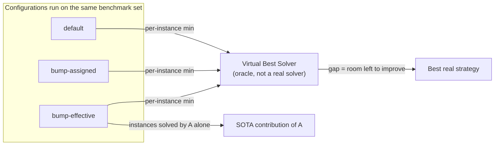

[[book-guidelines|↩ Back to guidelines]]

## Why a proof-theory thesis needs a statistics chapter

Every other chapter of this thesis proves something: a proof system p-simulates another, a language is more succinct than another, a strategy preserves soundness. Chapter 7 proves nothing of that kind. It reports numbers. That's not a lapse in rigor — it's an acknowledgment of a hard limit on what proof theory *can* tell you.

Soundness and completeness tell you a solver eventually gets the right answer. Complexity theory (via the results in [[Computational-Complexity-Preliminaries|Computational Complexity Preliminaries]] and the cutting-planes proof-size bounds of [[The-Cutting-Planes-Proof-System|The Cutting Planes Proof System]]) tells you about worst-case behavior, which is almost never the behavior you see on real instances. Neither tells you whether **bump-effective** beats **bump-assigned** on the instances people actually feed a solver, or whether a smarter branching heuristic is worth its bookkeeping cost. That question is decided empirically or not at all — and deciding it *rigorously*, rather than by eyeballing a few runtimes, requires its own methodology: a shared platform that isolates one variable at a time, standard plot types that make "better" a visually legible claim rather than a table of numbers nobody reads to the end, and a formal notion of the *ceiling* any combination of strategies could reach.

This article is about that methodology, not about the individual strategies it evaluates — bumping (`bump-effective`, `bump-assigned`, ...), constraint-quality measures (the five $LBD$ variants, `delete-slack`, ...), and restart policies each get their mechanics explained in the chapter's own sections and are only used here as running examples of "what gets fed into a cactus plot." If you haven't read [[Adapting-CDCL-Strategies-to-Pseudo-Boolean-Solving|Adapting CDCL Strategies to Pseudo-Boolean Solving]] or [[Guiding-the-Search-in-CDCL-SAT-Solvers|Guiding the Search in CDCL SAT Solvers]], that's fine — every number below is illustrative, not something you need to have derived yourself.

---

## 1. Sat4j as the experimental platform

### What breaks without a shared platform

Suppose you want to know whether `bump-effective` (bump only literals that are *effective* in a conflict — see Definition 107, covered in the weakening-strategies article) is better than `bump-assigned` (bump every assigned literal). The naive experiment — download solver $A$ implementing one heuristic and solver $B$ implementing the other, run both — is contaminated by everything *else* that differs between $A$ and $B$: implementation language, data structures, the propagation algorithm, the proof system, memory layout. A speed difference could come from any of these, and you'd have no way to attribute it to the one variable you actually wanted to test.

The thesis's answer is to **hold the platform fixed and vary only the strategy**. All of Chapter 7's bumping/deletion/restart experiments are run inside **Sat4j** [LP10], an open-source, Java-based pseudo-Boolean solver, specifically inside three of its internal configurations that share almost everything except their underlying proof system:

- **Sat4j-GeneralizedResolution** — conflict analysis via the full cutting-planes rules (addition, saturation, division as needed) described in [[Pseudo-Boolean-Solving-via-Cutting-Planes|Pseudo-Boolean Solving via Cutting Planes]].
- **Sat4j-RoundingSat** — conflict analysis restricted to RoundingSat's division-based reduction (see §2 below).
- **Sat4j-PartialRoundingSat** — a variant combining RoundingSat's division-based reduction with partial weakening.

Because a bumping strategy, a deletion strategy, or a restart policy is plugged into all three configurations *without touching anything else* in the solver, a performance difference observed between, say, `bump-degree` and `bump-effective` inside Sat4j-RoundingSat can be attributed to the strategy alone. This is the same logic as a controlled experiment in any empirical science: change one factor, hold the rest constant, repeat across enough "subjects" (here, benchmark instances) that the result isn't a fluke of one or two of them.

### Grounding: the platform as a strategy-pattern harness

The engineering shape of "swap the heuristic, keep everything else" is exactly the strategy pattern, and it is the natural way to *build* an experimental platform like Sat4j's internals, whether or not you're writing Java:

```rust
/// The parts of solver state a bumping strategy is allowed to see and touch.
/// Fixing this interface is what makes "only the strategy changed" a
/// meaningful, checkable claim rather than a hand-wave.
trait BumpingStrategy {
    fn bump_amount(&self, lit: Literal, constraint: &PbConstraint, assignment: &Assignment) -> f64;
}

struct BumpEffective;
impl BumpingStrategy for BumpEffective {
    fn bump_amount(&self, lit: Literal, c: &PbConstraint, a: &Assignment) -> f64 {
        if c.is_effective(lit, a) { 1.0 } else { 0.0 } // Def. 107: effective literal
    }
}

struct BumpRatioCoefficientDegree; // Pueblo's heuristic
impl BumpingStrategy for BumpRatioCoefficientDegree {
    fn bump_amount(&self, lit: Literal, c: &PbConstraint, _a: &Assignment) -> f64 {
        c.coefficient_of(lit) as f64 / c.degree() as f64
    }
}

/// The solver's conflict-analysis loop takes a `&dyn BumpingStrategy` — and
/// nothing about propagation, learning, or the proof system depends on which
/// concrete strategy was injected. That's the whole methodological point.
struct Solver<'a> {
    bumping: &'a dyn BumpingStrategy,
    // deletion: &'a dyn DeletionStrategy, restart: &'a dyn RestartPolicy, ...
}
```

The trait boundary *is* the experimental control: anything reachable only through `&dyn BumpingStrategy` cannot leak into deletion, propagation, or the proof system, so a benchmark difference has nowhere else to come from. This is worth internalizing beyond this one thesis — it's the same discipline you'd want when benchmarking, say, two domain-propagation strategies inside a CSP kernel, or two unification orderings inside an elaborator: fix the harness, inject the one thing under test, and only then trust the numbers.

---

## 2. RoundingSat and its variants as an external reference point

Sat4j-internal comparisons answer "which strategy is best *given this architecture*," but they can't answer "is this architecture any good in absolute terms?" For that, the thesis brings in **RoundingSat** [EN18], an independently implemented, C++-based pseudo-Boolean solver that pioneered the division-based conflict-analysis rule Sat4j-RoundingSat imitates — and its descendants **RoundingSat2** (with and without the `gmp` arbitrary-precision library).

Two distinctions matter here, and the chapter is explicit about both:

1. **Sat4j-RoundingSat is *not* RoundingSat.** It's Sat4j's own implementation of RoundingSat's *algorithm* (division-based cancellation instead of the saturation used by generalized resolution — see [[Pseudo-Boolean-Solving-via-Cutting-Planes|Pseudo-Boolean Solving via Cutting Planes]] for the rule itself). Comparing the two separates **algorithmic** effects from **engineering** effects: the scatter plot in Figure 4.5 shows the original RoundingSat solving 4442 instances against Sat4j-RoundingSat's 3843 on the same benchmarks — a gap the thesis attributes largely to implementation language (Java vs. C++, "roughly three times slower") and to C++'s finer memory control, *not* to the algorithm.
2. **RoundingSat2's `gmp` vs. non-`gmp` variants isolate a narrower engineering question**: the cost of arbitrary-precision arithmetic itself. RoundingSat originally assumed coefficients fit in machine words; RoundingSat2 adds big-integer support (`gmp`, or the `boost` library without it) to handle constraints where they don't — a strict expressiveness gain that measurably costs runtime, letting the thesis quantify "how much does correctness-for-large-coefficients cost you."

So "RoundingSat and its variants" in this chapter don't just supply one baseline number — they factor the total gap between "best known solver" and "this thesis's Sat4j experiments" into **algorithm**, **language/engineering**, and **arithmetic-precision** components, each measured by comparing exactly two configurations that differ in exactly that one respect. This is the same one-variable-at-a-time discipline as §1, just applied *across* solvers instead of within one.

---

## 3. Reading the plots: cactus and scatter

The thesis relies on exactly two plot types throughout, each answering a different question, and it's worth having crisp definitions of both since they recur in dozens of figures.

### Cactus plots — "how many instances does each configuration solve, and how fast?"

> A cactus plot is built by sorting each solver's per-instance runtimes ascending, then plotting *rank* (x-axis: number of instances solved) against *runtime* (y-axis, usually in seconds) — so the curve for a solver is a monotonically increasing step function whose value at $x$ is (informally) "the time needed to have solved the $x$ cheapest instances." **The further right a curve extends, the more instances that solver solved within the time budget; a curve below another at the same $x$ is faster at that point in its ranking.**

Reading rule the thesis states explicitly: only compare curves' *horizontal extent* (total instances solved) and relative height at a given $x$ — a cactus plot deliberately doesn't pair up "the same instance" across curves, because the $k$-th-fastest instance for solver $A$ needn't be the $k$-th-fastest for solver $B$. That's what scatter plots are for.

A worked instance from the source (Figure 4.2, comparing three propagation-detection algorithms in Sat4j-GeneralizedResolution): the two watched-literal variants' curves both extend well past 300 solved instances before the 1250 s cutoff, while the slack-based curve trails off earlier — read directly off the plot as "watched literals dominate slack-based detection for this configuration," with no per-instance pairing needed to support that claim.

### Scatter plots — "on *this specific* instance, which one wins?"

> A scatter plot places one point per benchmark instance, with coordinates $(t_A, t_B)$ giving configuration $A$'s and $B$'s runtime on that instance (log-scaled, since runtimes span orders of magnitude). A diagonal reference line marks $t_A = t_B$; points below it are instances where the $y$-axis configuration was faster, points above where the $x$-axis configuration was faster.

Where a cactus plot answers "who wins overall," a scatter plot answers "who wins *on which kind of instance*," and the thesis exploits this to explain *why* a strategy helps rather than just confirm *that* it does. Points are colored by benchmark family (§5), so a scatter plot routinely reveals that a strategy that looks like a clear overall win in a cactus plot is in fact winning broadly across most families while *losing* systematically on one or two — Figure 7.21, comparing Sat4j-GeneralizedResolution's best-combination strategy against its default, shows exactly this: a broad win everywhere except the `FPGA_SAT05` family, where the combination is worse. That's a diagnosis a cactus plot's aggregate ranking cannot produce, because it discards per-instance identity by construction.

```python
# Illustrative reconstruction of the data underlying both plot types, from a
# results table of (solver, instance, runtime_or_timeout) triples — this is
# roughly the shape of what produces Figures 4.2 and 4.5 in the thesis.
import pandas as pd

def cactus_curve(results: pd.DataFrame, solver: str, timeout: float) -> pd.Series:
    solved = results.query("solver == @solver and runtime < @timeout")["runtime"]
    return solved.sort_values().reset_index(drop=True)  # y = time, x = rank

def scatter_points(results: pd.DataFrame, solver_a: str, solver_b: str) -> pd.DataFrame:
    wide = results.pivot(index="instance", columns="solver", values="runtime")
    return wide[[solver_a, solver_b]].dropna()  # one row per instance both attempted
```

---

## 4. The Virtual Best Solver: a ceiling, not a competitor

Comparing solvers pairwise tells you who's ahead *today*, but the thesis also wants to know: given everything we've tried, how much room is left to improve? The answer is an oracle construction.

> **Virtual Best Solver (VBS).** Given a set of configurations $\{S_1, \dots, S_n\}$ run on the same benchmark set, the VBS is the solver defined, for each instance $i$, by $\mathrm{time}_{\mathrm{VBS}}(i) = \min_k \mathrm{time}_{S_k}(i)$ — i.e. an oracle that magically always picks whichever configuration happens to be fastest on that particular instance.

No real solver *is* the VBS (nothing decides in advance, per-instance, which configuration to run), which is exactly what makes it useful: it's a **hypothetical performance ceiling**, an upper bound on what a perfect portfolio combining the configurations under comparison could achieve. It appears in essentially every cactus plot in the chapter, always as the topmost, rightmost curve, precisely because no individual configuration can beat "take the best of everyone, every time."

The recurring pattern the thesis reads off this ceiling is the **gap between VBS and the best single strategy**. A small gap means the best strategy is close to as good as it gets — further tuning has little to offer. A *large* gap is the more interesting and more common finding: e.g. after combining every "best" identified strategy in Sat4j-GeneralizedResolution (bumping + deletion + restart together), the combination still solves noticeably fewer instances than the VBS computed over its own constituent strategies (Table 7.14 / Figure 7.20), meaning the constituents are still complementary — each one uniquely best on *some* instances the combination doesn't win.

This complementarity is measured by a second, per-strategy quantity used throughout the chapter's tables:

> **State-of-the-art (SOTA) contribution.** For a configuration $S_k$, its contribution is the number of instances solved by $S_k$ and by *no other* configuration in the comparison — i.e. the instances the VBS could only get from $S_k$.

A strategy can have mediocre raw solve counts yet a large SOTA contribution if the instances it solves are ones nothing else touches — Table 6.4 in the weakening-strategies material makes exactly this point: `Weaken Ineffective` contributes 76 uniquely-solved instances to its VBS despite not always having the highest solve count outright, marking it as complementary rather than strictly dominated. Conversely, near-identical variants of the same main strategy typically have *small* individual contributions relative to their combined "main strategy" contribution, since they solve largely overlapping sets of instances — a way of detecting, quantitatively, when two configurations are "really the same idea" rather than genuinely different approaches.



---

## 5. Benchmark families: the corpus that makes "better" meaningful

None of the above means anything without a benchmark set worth trusting, and the thesis is explicit about two design decisions that keep the corpus honest (Appendix B).

**The corpus.** All decision-problem instances using "small" (machine-word-sized) integers from every pseudo-Boolean competition since the first edition [MR06] — 5582 instances total. The "small integers" restriction exists so that solvers *without* arbitrary-precision support (several of the C++ baselines) can be included in the same comparison at all; it's a corpus-design choice made specifically to keep §2's cross-solver comparisons apples-to-apples.

**The "non-easy" filter.** Any instance solved by *every* compared configuration in under one minute is dropped from that comparison's plots and tables (its count is reported separately, not silently discarded). This directly protects the validity of the plots above: the corpus is dominated by one family, `oliveras` (4080 of the 5582 instances — resource-constrained project-scheduling encodings), and without filtering, a strategy that's marginally faster on thousands of trivial `oliveras` instances would visually swamp real differences on the harder, more diagnostic instances from every other family. This is a recurring trap in solver benchmarking generally: an unweighted corpus is implicitly a weighted average dominated by whichever family happens to be numerous, not whichever is representative.

**The families**, briefly (full descriptions in Appendix B.3): combinatorial encodings with known structure (`EC_ODD_GRIDS`/`EC_RANDOM_GRAPHS` — even-colouring of graphs; `liu` — degree-bounded spanning trees; `tsp` — travelling salesperson with $n=11$; `wnqueen` — weighted $n$-queens; `vertexcover-instances`), industrial instances (`FPGA_SAT05`, `uclid_pb_benchmarks`), domain-specific encodings (`heinz` — MIPLIB2010; `ppp-problems` — progressive party problem; `robin` — travelling tournament problem; `sroussel` — museum-visit scheduling; `lopes` — multiple constant multiplication), structural stress-tests (`roussel` — pigeonhole principle; `subsetcard`/`SUMINEQ` — cardinality/pebbling formulae designed to be hard for specific proof systems, per [EGNV18]), and cryptographic instances (`nossum` — SHA-1 preimage search). Scatter plots color points by family precisely so a strategy's family-dependent strengths and weaknesses (like the earlier `FPGA_SAT05` counter-example) are visible rather than averaged away — the thesis's own summary tables (7.2–7.4, 7.6–7.8, ...) go further and report per-family solve counts explicitly for this reason.

---

## 6. How the machinery is actually used: a compressed walkthrough of Chapter 7

With the platform, plot types, VBS, and corpus in hand, Chapter 7's own structure is a clean demonstration of the methodology applied incrementally:

1. **§7.1 (bumping):** each new bumping strategy is dropped into all three Sat4j configurations (§1), compared via cactus plots against the previous best and the VBS over the group, with per-family solve counts (Tables 7.2–7.4) checking for family-specific reversals.
2. **§7.2 (quality measures → deletion, then restarts):** the same measures (slack, degree, degree-size, five $LBD$ variants) are tried first as *deletion* criteria, then as *restart* triggers — using the identical experimental setup for both, which is what licenses the chapter's conclusion that the measures are well-suited to one role (deletion) but not the other (restarts): the only thing that changed between those two rounds of experiments was the role, not the platform or corpus.
3. **§7.3.1–7.3.2 (combination):** the best bumping, deletion, and restart strategies (per proof-system configuration) are combined and compared against the default and against the VBS computed over the combination's own ingredients — the residual VBS gap (§4) becomes the chapter's evidence that the individual strategies remain complementary rather than redundant.
4. **Final comparison:** the best Sat4j configurations are placed on a cactus plot alongside external state-of-the-art solvers (RoundingSat, RoundingSat2, Open-WBO, MiniSat+, NaPS — Figure 4.14 and its Chapter 7 descendants) to give the improvements an absolute, not just relative, reading.

Every step reuses the same four tools from §§1–4 rather than inventing new ones — which is the actual point of building the methodology out explicitly instead of ad hoc per experiment.

---

## Where this leads

This chapter is where the thesis closes the loop between the proof-theoretic machinery of Chapters 1–6 (the cutting-planes system, weakening, irrelevant literals) and the practical claim that any of it is *worth implementing*. Every earlier "this strategy should help" is only cashed out as "this strategy does help, on these families, by this much" here — and the VBS gaps reported at the end of §7.3.2 are explicitly left as open engineering problems for future pseudo-Boolean solvers, rather than claims that the thesis's strategies are the last word.

For the standing project (Focus Area `sat-smt-csp`): this chapter's toolkit — a strategy-injected platform for isolating one variable, cactus/scatter plots as the two standard comparison shapes, VBS as a performance ceiling, and SOTA contribution as a complementarity measure — is exactly the discipline to reuse when benchmarking your own CSP kernel's domain-propagation strategies or theorem-prover backends against baselines: hold the harness fixed, inject the one strategy under test, filter out instances too easy to be diagnostic, and always compute the VBS over your own variants before claiming a combination is "done." A Lean-flavored angle doesn't naturally fit this particular topic — nothing here is type-theoretic or proof-term-shaped — so, per the source material, it's skipped rather than forced.
