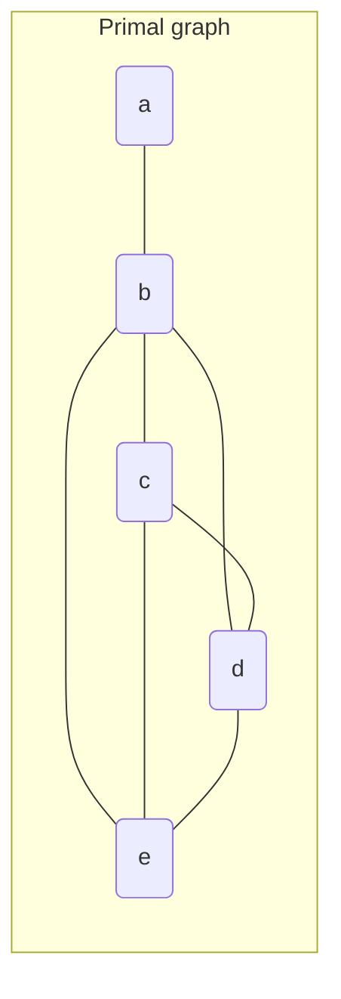
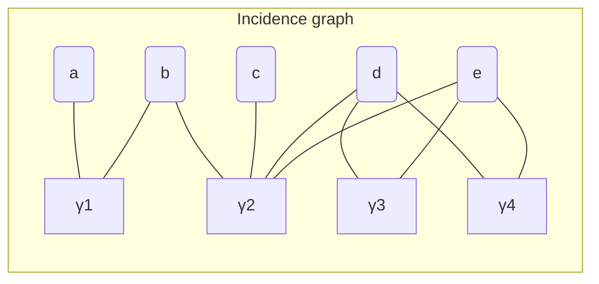
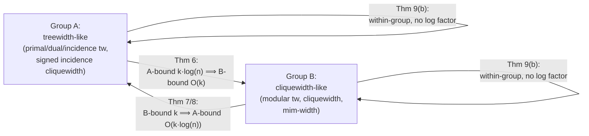

[[book-guidelines|↩ Back to guidelines]]

# Graph Width Measures for CNF Formulae and Encodings

## The question nobody had asked

There is a large body of algorithmic results with a common shape: "if the primal (or incidence) graph of a CNF formula has treewidth $\le k$, then SAT — and #SAT, and MAX-SAT, and QBF — can be solved in time exponential only in $k$, not in the number of variables." These are genuinely useful theorems: dynamic programming over a tree decomposition is a well-understood technique, and there is a whole literature bounding the treewidth of formulae arising from abduction, closed-world reasoning, answer-set programs, and more.

But every one of these results is conditional on the formula you're handed already having small width. Wallon's chapter asks the question that logically precedes all of them: **what Boolean functions can actually be written down as a bounded-width CNF formula in the first place?** If the answer is "almost nothing interesting," then an algorithm that is blazingly fast on bounded-width instances is a solution in search of a problem — good asymptotics on a near-empty class of inputs. If auxiliary variables are allowed (as they must be, since almost every real encoding uses them — Tseitin variables, adder bits, sorting-network wires), does that change the picture?

This is the same move as asking, for a compiler, "my optimizer runs in linear time on formulae with acyclic dependency graphs — but what programs actually *have* acyclic dependency graphs after I've introduced all my intermediate SSA variables?" The chapter's answer has two parts, and they pull in opposite directions:

1. **Bounding width is a real restriction.** Even with auxiliary variables, a bounded-width CNF encoding can only compute functions of low *communication complexity* — a completely different, information-theoretic notion of "how entangled are the variables." This is proved via a detour through knowledge compilation (structured DNNF).
2. **But which width measure you pick barely matters.** Treewidth, cliquewidth, modular treewidth, signed incidence cliquewidth, mim-width — once auxiliary variables are on the table, all of these are equivalent up to a factor of $\log(n)$ in the number of variables. So "is this function width-$k$-expressible" is, up to that log factor, one question, not five.

Everything below builds toward those two results.

## What breaks without auxiliary variables: primal and incidence graphs

A CNF formula gives rise to two natural graphs, and both recur throughout the chapter.

> **Def. 69 (Primal Graph).** The primal graph of a CNF formula $\varphi$ has the variables of $\varphi$ as vertices; $v$ and $v'$ are adjacent iff some clause $\gamma$ contains both.
>
> **Def. 70 (Incidence Graph).** The incidence graph of $\varphi$ has both the variables *and* the clauses as vertices; $(v, \gamma)$ is an edge iff $v \in \mathrm{var}(\gamma)$.

The primal graph forgets which clause induced an edge (every pair of variables co-occurring in *any* clause becomes indistinguishable from every other such pair); the incidence graph keeps clause identity as an explicit vertex, which is strictly more information and — as you'll see — a strictly gentler graph to have small width.

Take $\varphi = \gamma_1 \land \gamma_2 \land \gamma_3 \land \gamma_4$ with $\gamma_1 = a \lor \lnot b$, $\gamma_2 = b \lor c \lor \lnot d \lor \lnot e$, $\gamma_3 = \lnot d \lor e$, $\gamma_4 = d \lor e$:





The primal graph has a $K_4$ on $\{b,c,d,e\}$ (all four co-occur in $\gamma_2$), forcing any tree decomposition to have a bag containing all four — hence primal treewidth $\ge 3$. The incidence graph, by contrast, is a tree plus one 4-cycle (through $\gamma_2, e, \gamma_3, d$... actually a single cycle $d$–$\gamma_2$–$e$–$\gamma_3$–$d$), so it has treewidth exactly $2$: strictly smaller, because a clause of arity $k$ contributes a $k$-clique to the primal graph but only a $k$-star (with the clause itself as hub) to the incidence graph, and a star has treewidth 1 regardless of $k$.

## The width zoo: one core idea, several graph shapes

### Treewidth via tree decomposition

> **Def. 71 (Tree Decomposition).** A tree decomposition $(T, (B_t)_{t \in V(T)})$ of $G = (V,E)$ is a tree $T$ together with a *bag* $B_t \subseteq V$ per node, such that (i) every vertex is in some bag, (ii) every edge's endpoints share a bag, and (iii) for every vertex $v$, the set of nodes whose bag contains $v$ is connected in $T$ (the "running intersection" property).
>
> **Def. 72 (Treewidth).** The width of a decomposition is $\max_t |B_t| - 1$; the treewidth $\mathrm{tw}(G)$ is the minimum width over all decompositions.

Condition (iii) is the one that does all the algorithmic work later: it's what lets a dynamic-programming sweep over $T$ combine partial solutions bag-by-bag without a variable's constraint "reappearing" somewhere disconnected from where it was last handled. Trees themselves are exactly the connected graphs of treewidth $1$ — treewidth measures distance from tree-shaped.

**Rust grounding.** A tree decomposition is directly a data structure you'd validate before trusting a DP solver to run over it — this is exactly the kind of "checker, not oracle" pattern that recurs in verified-compiler and proof-certificate work:

```rust
struct TreeDecomposition {
    tree: Vec<Vec<usize>>,      // adjacency list over decomposition nodes
    bags: Vec<Vec<VarId>>,      // Bt for each node t
}

impl TreeDecomposition {
    fn width(&self) -> usize {
        self.bags.iter().map(|b| b.len()).max().unwrap_or(1) - 1
    }

    /// Checks conditions (i)-(iii) of Def. 71 against a graph's edge list.
    fn is_valid(&self, vars: &[VarId], edges: &[(VarId, VarId)]) -> bool {
        // (i) every vertex covered by some bag
        let covered = vars.iter().all(|v| self.bags.iter().any(|b| b.contains(v)));
        // (ii) every edge's endpoints share a bag
        let edges_ok = edges.iter().all(|(u, v)| {
            self.bags.iter().any(|b| b.contains(u) && b.contains(v))
        });
        // (iii) running intersection: for each var, the nodes containing it
        // induce a connected subtree
        let running_intersection_ok = vars.iter().all(|v| self.is_connected_subtree(*v));
        covered && edges_ok && running_intersection_ok
    }

    fn is_connected_subtree(&self, v: VarId) -> bool {
        let nodes: Vec<usize> = self.bags.iter().enumerate()
            .filter(|(_, b)| b.contains(&v)).map(|(i, _)| i).collect();
        if nodes.is_empty() { return true; }
        // BFS from nodes[0] restricted to `nodes`, check all reached
        let mut seen = std::collections::HashSet::new();
        let mut stack = vec![nodes[0]];
        while let Some(t) = stack.pop() {
            if !seen.insert(t) { continue; }
            for &next in &self.tree[t] {
                if nodes.contains(&next) { stack.push(next); }
            }
        }
        nodes.iter().all(|n| seen.contains(n))
    }
}

type VarId = usize;
```

For $\varphi$'s incidence graph, the optimal decomposition puts $\{a,\gamma_1\}, \{b,\gamma_1\}, \{b,\gamma_2\}, \{c,\gamma_2\}, \{d,e,\gamma_2\}, \{d,e,\gamma_3\}, \{d,e,\gamma_4\}$ along a path — width 2, matching the graph's one cycle.

### Modular treewidth and cliquewidth: exploiting symmetric variables

Two vertices $u, v$ have the *same neighborhood type* if $N(u) \setminus \{v\} = N(v) \setminus \{u\}$ — they're interchangeable as far as the graph's structure is concerned. Modular treewidth collapses each such equivalence class to a single representative before measuring treewidth:

> **Def. 73 (Modular Treewidth).** $\mathrm{mtw}(G)$ is the treewidth of the graph obtained from $G$ by deleting all-but-one vertex from every neighborhood-type class.

In the running example, $d,e$ have the same neighborhood type (both connect to $b,c,\gamma_2$ and to each other's clauses symmetrically) and so do $\gamma_3, \gamma_4$; contracting both collapses the one cycle into a tree, giving $\mathrm{mtw}(\varphi) = 1$ — strictly below the incidence treewidth of 2. This is the first hint of the chapter's main theme: different width measures see different amounts of "redundant" structure, and can diverge sharply on the *same* formula.

Cliquewidth generalizes further, dropping the graph-distance intuition entirely in favor of a *build sequence*:

> **Def. 74 (Cliquewidth).** $\mathrm{cw}(G)$ is the minimum number of vertex labels needed to construct $G$ using: create a labeled vertex; disjoint union; join all $i$-labeled to all $j$-labeled vertices ($i \ne j$); relabel $i \to j$.

Cliquewidth can be exponentially smaller than treewidth for graphs like large complete bipartite graphs (treewidth $\Theta(n)$, cliquewidth $2$) — precisely because "join everything labeled $i$ to everything labeled $j$" captures dense, regular structure that a tree decomposition has to represent bag-by-bag.

> **Def. 75–76 (Signed Incidence Graph, Signed Cliquewidth).** Label each incidence-graph edge $(v,\gamma)$ by $+$ if $v$ occurs positively in $\gamma$, $-$ if negatively; signed cliquewidth is cliquewidth with two join operations, one per sign.

The chapter also uses **dual treewidth** and **mim-width** as black boxes (defined only in the cited literature) — it only needs their known relationships to the other measures, not their internal definitions, to run the proofs. This is worth flagging explicitly: several of the chapter's strongest results (Cor. 30, part of Thm. 9) are proved *by citation* to auxiliary compilation-algorithm results from [BCMS15], [ACMS18], [Vat12] — the chapter's own contribution is the *communication-complexity lower bound machinery* and the *equivalence-up-to-$\log n$* argument, which it then plugs those external results into.

## The communication-complexity toolkit

The chapter's lower-bound technique comes from communication complexity, repurposed for a static (non-interactive) setting: think of the variables of a Boolean function $f$ partitioned between two parties, Alice holding $Y$ and Bob holding $Z$, and ask how much nondeterministic "evidence" it takes to certify $f(Y,Z) = 1$.

> **Def. 77 (Combinatorial Rectangle).** A rectangle respecting a partition $\Pi = (Y,Z)$ is $r(X) = r_1(Y) \land r_2(Z)$ — a function that factors into an independent constraint on each side.
>
> **Def. 78 (Rectangle Cover).** A rectangle cover of size $s$ writes $f = \bigvee_{i=1}^s r_1^i(Y) \land r_2^i(Z)$.
>
> **Def. 79–80 (Non-deterministic / Best-case Communication Complexity).** $cc(f,\Pi) = \log(s_{\min})$, the log of the smallest rectangle cover respecting $\Pi$. $cc^{1/3}_{best}(f) = \min_\Pi cc(f,\Pi)$ over *balanced* partitions ($\min(|Y|,|Z|) \ge |X|/3$).

A DNF is trivially a rectangle cover of size = number of terms, respecting *every* partition — so $cc(f,\Pi) \le \log(|\text{DNF terms}|)$ always. The interesting content is in functions where you can do far better than the naive DNF-sized cover for some *particular* partition:

```python
# Def. 79 made concrete: brute-force the size of the smallest rectangle
# cover of a Boolean function f for a fixed partition (Y, Z), by checking
# every candidate rectangle set. Only tractable for toy functions -- this
# is for building intuition about cc(f, Pi), not a real algorithm.
from itertools import product

def rectangle_covers_f(f, Y_vars, Z_vars, models):
    """models: set of satisfying assignments (as tuples over Y+Z order)."""
    y_vals = {tuple(m[i] for i in Y_vars) for m in models}
    z_vals = {tuple(m[i] for i in Z_vars) for m in models}
    # A single rectangle r1(Y) x r2(Z) covers exactly Y_vals x Z_vals
    # restricted to y in r1's accepted set, z in r2's. Model set equals
    # the full product iff f "factors" -- that's cc(f, (Y,Z)) = 0.
    return len(models) == len(y_vals) * len(z_vals)
```

The equality function $\mathrm{eq}_n(x_1,\ldots,x_n,y_1,\ldots,y_n)$ is the canonical illustration of how much a partition matters. Split it $(\{x_i\}, \{y_i\})$ — Alice's bits vs. Bob's bits — and $cc(\mathrm{eq}_n, \Pi_1) = n$: Alice genuinely needs to communicate essentially all of $x$ before Bob can check equality, because any rectangle can only contain models that agree bit-by-bit inside $Y$ *or* inside $Z$ in a way that doesn't cross. But interleave the partition instead — first half of both $x$ and $y$ on one side, second half on the other — and $cc(\mathrm{eq}_n, \Pi_2) = 0$: $\mathrm{eq}_n$ becomes a conjunction of two independent sub-equalities, each a trivial single rectangle. **Best-case** complexity takes the min over balanced partitions precisely to rule out this kind of partition-dependent illusion — it asks "is there *any* balanced way to split the variables that makes this function communication-cheap," which is the version that will actually correspond to a v-tree's choice of split.

## Structured DNNF: the compilation bridge

To connect width measures (a graph-theoretic notion) to communication complexity (an information-theoretic notion), the chapter routes through *structured* DNNF — recall from the [[Knowledge-Compilation]] article that DNNF requires every $\land$-gate's children to be variable-disjoint. Structuring pins down *how* that variable-disjointness is organized, via a v-tree:

> **Def. 81 (V-Tree).** A full binary tree whose leaves are in bijection with the variable set.
>
> **Def. 82 (Complete Structured DNNF).** A DNNF $D$ structured by v-tree $T$: every gate $g$ is assigned to a unique v-tree node $t_g$ via a labeling $\mu$; leaves may only hold literals of their labeling variable; every $\lor$-gate's inputs are all $\land$-gates *in the same node*; every $\land$-gate has exactly two inputs, from the two v-tree children.
>
> **Def. 83 (Width).** $\mathrm{wi}(D) = \max_t |\mu(t) \cap \{\lor\text{-gates}\}|$ — the most $\lor$-gates crammed into any one v-tree node's block.

```rust
// Extending the Knowledge-Compilation article's DNNF sketch with v-tree
// structuring: every gate is pinned to a v-tree node, and the DNNF's
// decomposability is *derived* from the v-tree split rather than checked
// per-gate.
struct VTree {
    // internal nodes indexed 0..n-2, leaves n-1..2n-2, each leaf <-> one var
    children: Vec<Option<(usize, usize)>>,
    leaf_var: std::collections::HashMap<usize, VarId>,
}

struct StructuredNode {
    gate: Gate,          // And(g1, g2) | Or(Vec<NodeId>) | Lit(Literal)
    v_tree_node: usize,  // t_g of Def. 82
}
// wi(D) = max over v-tree nodes t of |{g : v_tree_node(g) == t, gate is Or}|
```

Intuitively, a complete structured DNNF is a tree of "blocks," one per v-tree node; each block computes a small 2-DNF whose inputs are entire sub-solutions from its two v-tree children. The **width** of a block is exactly the number of alternative sub-solutions it has to keep alive — which is why it connects so directly to rectangle covers:

> **Theorem 4.** Let $D$ be structured by $T$, let $t$ be a v-tree node splitting variables into $Y = \mathrm{var}(T_t)$ and $Z = X \setminus Y$, and let $n = |\mu(t) \cap \{\lor\text{-gates}\}|$. Then $f$ has a rectangle cover respecting $(Y,Z)$ of size $\le n$.

Each of the (at most $n$) $\lor$-gates in $\mu(t)$ is, by construction, computing some conjunction of a sub-solution over $Y$ and a sub-solution over $Z$ — literally a rectangle. So a node's block width upper-bounds a rectangle cover at that split, giving the chapter's workhorse inequality:

$$\log(\mathrm{wi}(D)) \ge cc(f, (Y,Z)) \qquad \text{(Prop. 30)}$$

and, choosing $t$ near the v-tree's "balance point" (every v-tree has a node splitting variables roughly $1{:}2$),

$$\mathrm{wi}(D) \ge 2^{cc^{1/3}_{best}(f)} \qquad \text{(Cor. 28).}$$

This is the bridge: **any compilation algorithm that turns a bounded-width CNF encoding into a bounded-width structured DNNF hands you, for free, a communication-complexity lower bound on every function that encoding can represent.**

## Auxiliary variables can crash a width measure — or save it

Before chasing lower bounds, the chapter first shows auxiliary variables aren't a minor technicality — they can be the entire difference between "infeasible" and "trivial" for a given width measure. The witness is the **at-most-one** constraint:

$$\text{at-most-one}(x_1,\ldots,x_n) \equiv \sum_{i=1}^n x_i \le 1$$

Its natural quadratic-size CNF representation $\bigwedge_{i<j} \lnot x_i \lor \lnot x_j$ has primal graph $K_n$ — treewidth $n-1$.

> **Theorem 3.** *Every* CNF representation of at-most-one without auxiliary variables has primal treewidth $n-1$. But there is a CNF *encoding* of at-most-one with primal treewidth $2$.

The lower bound (Lemma 1) is a clean forcing argument, worth internalizing because the pattern recurs constantly in encoding lower bounds: take any candidate clause $\gamma$ in a representation and show it *must* rule out two specific bad assignments (all-zero, and "only $x_i=1$"), which forces $\gamma$ to contain at least two negative literals from $\{x_1,\ldots,x_n\}$; then, for any *pair* $x_i,x_j$, show that if no clause contains both $\lnot x_i,\lnot x_j$, the assignment setting exactly those two to $1$ survives every clause — so it would be a spurious model. Hence every pair must co-occur negatively in some clause, which is exactly "the primal graph is a clique."

**What breaks without the encoding trick:** if you insist on representing at-most-one with only its original $n$ variables, you are stuck at treewidth $n-1$ — no cleverness helps, the lower bound is unconditional. The ladder encoding breaks this by adding $n{+}1$ "prefix" variables $y_0,\ldots,y_n$ where $y_i$ means "some $x_j$, $j\le i$, is already set":

```rust
// Def. Lemma 2's ladder encoding: y_i tracks "have we seen a 1 among
// x_1..x_i yet". Two clause families keep y monotone and tie each x_i
// to a rising edge of y.
fn ladder_encoding(n: usize) -> Vec<Clause> {
    let x = |i: usize| Lit::pos(Var::X(i));
    let y = |i: usize| Lit::pos(Var::Y(i)); // y(0) is the constant-0 sentinel
    let mut clauses = Vec::new();
    for i in 1..=n {
        // validity: once "seen", stay "seen" -- not(y_{i-1}) or y_i
        clauses.push(clause![y(i - 1).neg(), y(i)]);
        // x_i <-> (not y_{i-1}) and y_i   (x_i is exactly the rising edge)
        clauses.push(clause![x(i).neg(), y(i - 1).neg()]);
        clauses.push(clause![x(i).neg(), y(i)]);
        clauses.push(clause![x(i), y(i - 1), y(i).neg()]);
    }
    clauses
}
```

Every bag $\{y_{i-1}, y_i, x_i\}$ along a path decomposition covers exactly the clauses touching index $i$, and consecutive bags overlap only on $y_i$ — width $2$, independent of $n$. The auxiliary variables didn't just help; they turned an *unbounded* treewidth requirement into a *constant* one. That gap is the entire reason this chapter exists: bounded-width algorithms are worthless on at-most-one *representations*, but perfectly fine on its ladder *encoding* — and you'd never notice the difference just by staring at width measures, you have to ask "representation or encoding?" first.

## From width to inexpressivity: the general lower-bound engine

Combining Theorem 4's rectangle-cover connection with known compilation algorithms (that turn a bounded-width-$k$ CNF encoding into a structured DNNF of width $2^{O(k)}$ or $n^{O(k)}$, cited from [BCMS15]) yields the chapter's general template:

> **Theorem 5.** If a representation language $L$ has parameter $p$ such that every $\lambda \in L$ encoding $f$ compiles to a structured DNNF of width $\le 2^{p(\lambda)}$, then $p(\lambda) \ge cc^{1/3}_{best}(f)$.

Instantiated against the known compilation results, this gives three corollaries covering essentially the whole width zoo:

- **Cor. 29** (the "fixed-parameter tractable" measures — incidence/primal/dual treewidth, signed incidence cliquewidth): $\min\{tw_i,tw_p,tw_d,scw\}(\varphi) \ge b\cdot cc^{1/3}_{best}(f)$ for a constant $b$.
- **Cor. 30** (circuit versions: treewidth/cliquewidth of a Boolean circuit, not just a CNF): the same bound.
- **Cor. 31** (the "polynomial but not FPT" measures — mim-width, cliquewidth, modular treewidth): the bound is *weaker by a factor of $\log n$*: $\min\{mimw,cw,mtw\}(\varphi) \ge b\cdot \frac{cc^{1/3}_{best}(f)}{\log n}$.

That $\log n$ gap between Cor. 29 and Cor. 31 is not a proof artifact — the chapter goes on to show it's *exactly* the gap that separates the two groups of width measures, everywhere, always. That's the content of the next section.

## The punchline: all width measures agree up to $\log n$

Split the measures into two families: $A = \{tw_p, tw_d, tw_i, scw\}$ (treewidth-like) and $B = \{mtw, cw, mimw\}$ (cliquewidth-like). The chapter's main structural results are:



**Theorem 6** (A-bound $\Rightarrow$ B-bound, gaining a $\log n$ factor): given an encoding of primal treewidth $k\log n$, you can build a *different* encoding (same function, possibly more auxiliary variables) of modular/cliquewidth $O(k)$. The mechanism is a packing trick worth internalizing on its own: take a width-$k\log n$ tree decomposition, and instead of tracking each of the up-to-$k\log n$ variables in a bag individually, partition them into $O(k)$ color classes of size $O(\log n)$ each, and replace each class with a *single* auxiliary variable-group encoding that class's assignment **in binary** (a group of $\log n$ Boolean variables has $n$ possible values, so $O(\log n)$ bits suffice, but critically you now only need $O(k)$ *groups*, not $O(k \log n)$ individual variables, to cover a bag). This is the general-purpose reason binary encodings beat unary ones whenever you're optimizing for width rather than size — you'll see the identical trick reused for cardinality constraints below.

**Theorem 7/8** (B-bound $\Rightarrow$ A-bound, same direction the intuition would guess is "free" but isn't): this is the more surprising direction, because *without* auxiliary variables, cliquewidth-like measures are known to be far more powerful than treewidth (recall $K_{n,n}$: cliquewidth $2$, treewidth $n$). The proof detours through structured DNNF exactly as before — compile the bounded-cliquewidth encoding into small-width DNNF (via cited algorithms), forget its auxiliary variables to get a DNNF of the *underlying function*, then apply a dedicated construction (Lemma 3) that turns *any* width-$k$ structured DNNF back into a CNF encoding of primal treewidth $O(\log k)$, using auxiliary variables that "guess" a satisfying proof tree of the DNNF and verify the guess with local clauses along the v-tree. Composing the two width bounds ($n^{O(k)}$ or $2^{O(k)}$ DNNF width, then $O(\log(\text{DNNF width}))$ treewidth) gives back an $O(k)$ or $O(k \log n)$ primal treewidth bound, depending on which measure you started from.

**Theorem 9** ties both directions together into the headline result: within a group (A-to-A or B-to-B), the measures are linearly related with *no* log factor; across groups, exactly one $\log n$ factor separates them, in both directions, and it's tight — Corollary 31's lower-bound gap and Theorem 6's upper-bound gain are the same gap, meeting in the middle. **Practically:** once you allow auxiliary variables, asking "does this function have a bounded-cliquewidth encoding" and "does it have a bounded-treewidth encoding" are, up to a $\log n$ factor you can always pay for by re-encoding, *the same question*. You get to pick whichever width measure has the more convenient algorithm for your downstream use, without worrying that you've silently restricted yourself to a different (smaller) class of expressible functions.

## Applications: two functions with opposite fates

### Cardinality constraints: exponentially better than the naive encoding

For $\kappa^\delta_n \equiv \sum_{i=1}^n x_i \ge \delta$, the "sequential counter" encoding from the SAT literature tracks partial sums $S_j = \sum_{i\le j} x_i$ in **unary**. The chapter's Observation 3 instead tracks them in **binary**, in $\lceil \log(\delta) \rceil + 1$ auxiliary bits per prefix — the same packing idea from Theorem 6's proof, applied directly instead of via a generic transformation:

```python
# Observation 3's binary partial-sum encoding, sketched at the level of
# what each prefix's auxiliary bit-group represents (not full clausal
# form -- that's an adder-circuit encoding of S_{j+1} = S_j + x_{j+1},
# capped at delta).
def cardinality_treewidth_bound(n, delta):
    d = min(delta, n - delta)          # symmetric: count 1s or count 0s
    bits_per_prefix = d.bit_length() + 1
    # each tree-decomposition bag only needs Y_j union Y_{j+1} union {x_{j+1}}
    return 2 * bits_per_prefix + 1     # O(log(min(delta, n-delta))) width
```

Crucially, this isn't just an upper bound of convenience — **Proposition 31** shows it's tight: a rectangle-cover argument (fixing an interleaved partition and showing any single rectangle can only "confuse" assignments that differ in *how many* of the $\delta$ required 1s fall on each side, not *which* ones) gives $cc^{1/3}_{best}(\kappa^\delta_n) = \Omega(\log(\min(\delta, n/3)))$, and Corollary 33 turns this into a matching lower bound for four of the width measures at once:

$$\text{optimal encoding width for } \kappa^\delta_n \;=\; \Theta(\log(\min(\delta, n-\delta)))$$

**Downstream relevance:** if you are building a CSP kernel with a cardinality-constraint propagator (exactly the "abstract data structures as complex domains" goal from this project's standing brief), Observation 3's binary-counter encoding is not a theoretical curiosity — it is the asymptotically optimal *structural* shape any width-aware propagation algorithm should exploit, and the unary sequential-counter encoding from classical SAT literature, while simpler to implement, is provably suboptimal by an exponential factor in exactly the parameter (treewidth) that governs DP-based propagation cost.

### The permutation function: provably hard, no shortcuts

At the other extreme, $\mathrm{perm}(X_n)$ (an $n \times n$ 0/1 matrix is a permutation matrix) needs treewidth $\Theta(n)$ — genuinely *no* encoding trick helps, unlike at-most-one. Lemma 8's proof is a nice illustration of a *counting* argument for communication lower bounds: since every model of $\mathrm{perm}$ corresponds to one of $n!$ permutations, and any v-tree node's balanced split can only distinguish permutations by which of their $n$ "assignment pairs" fall on each side, a counting/pigeonhole argument shows that any rectangle can cover at most $k!(n-k)!$ of the $(n-1)!$ models sharing a "typical" split point — forcing at least $\Omega(\sqrt[3]{n}\, ...)$, in fact $\Omega(n)$ after tightening, rectangles. Corollary 34 turns this into a *matching* treewidth bound $\Theta(n)$ (improving a prior conditional bound by exactly the log factor Theorem 9 predicts is generically recoverable), and Corollary 35, via Theorem 6, immediately gives incidence cliquewidth $\Theta(n/\log n)$ — resolving an open problem from prior work as a two-line corollary of the machinery built here.

## Where this leads

Within the thesis, this chapter is the structural counterpart to Chapter 2's succinctness results: Chapter 2 showed pseudo-Boolean constraints win on *succinctness* over CNF but lose several *transformations*; this chapter shows that CNF *encodings* (the mechanism PB-to-CNF translation actually uses) pay for their succinctness gains over CNF *representations* in a very concrete currency — bounded width only buys you low-communication-complexity functions, no matter which width measure you bound. Chapter 7 ([[Communication-Complexity-and-Lower-Bounds-on-Compilation|Communication Complexity and Lower Bounds on Compilation]]) picks the toolkit built here back up and pushes it further, including the treewidth lower bounds for at-most-one and permutation-style functions referenced above.

For the **`sat-smt-csp`** focus area specifically: this chapter *is* Structural Tractability and Algebraic Graph Theory made concrete and load-bearing, not just background — every "my algorithm is FPT in treewidth $k$" claim in the constraint-propagation literature inherits this chapter's ceiling on what instances can even reach small $k$ once you allow the auxiliary variables real encodings need. If the standing project's CSP kernel ever adopts a treewidth- or cliquewidth-bounded propagation strategy (dynamic-programming domain propagation over a tree decomposition of the constraint hypergraph — a very natural design for the lattice/domain-propagation goals described in the project brief), this chapter says two concrete things worth remembering at implementation time: (1) which width measure you bound is a genuine implementation-convenience choice, not a genuine expressiveness choice, up to a $\log n$ re-encoding cost you can budget for explicitly; and (2) auxiliary variables are not a hack to make width small, they are *structurally necessary* for width to be small at all for many useful constraints (at-most-one being the cleanest possible witness) — so a width-aware CSP encoder needs an explicit "introduce structural auxiliaries" pass, not just a post-hoc bound check on the user's original constraint graph.
