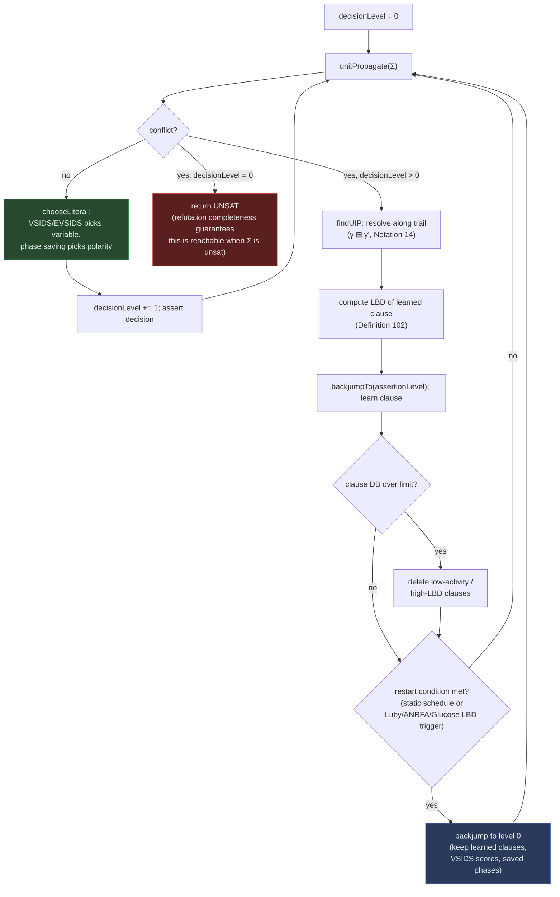

# Guiding the Search in CDCL SAT Solvers

[[book-guidelines|↩ Back to guidelines]]

## Why this section exists

The sibling article, [[Practical-SAT-Solving-and-the-CDCL-Architecture|Practical SAT Solving and the CDCL Architecture]], builds the *mechanism*: unit propagation, watched literals, implication graphs, 1-UIP clause learning, backjumping. That mechanism is a loop with three open slots it never fills in:

```
loop:
    unitPropagate(Σ)
    if conflict:
        γl ← findUIP(γ0)          # WHICH clause do we keep, and for how long?
        backjumpTo(...)           # WHEN do we throw the whole trail away instead?
    else:
        ℓ ← chooseLiteral(Σ)      # WHICH variable, and WHICH polarity?
```

Wallon opens §4.1.3 bluntly: "it is commonly accepted that, without these strategies, modern SAT solvers become very bad" [EGG+18]. That is not a minor tuning remark — a CDCL solver with a naive `chooseLiteral` (say, "first unassigned variable, value true") and no clause deletion or restarts is not a slower version of a modern solver; it is a qualitatively worse search procedure, because it explores the *same* resolution proof space blindly instead of steering toward short refutations. This article covers the three policies that do the steering:

1. **Branching heuristics** — VSIDS/EVSIDS (which variable) and phase saving (which value).
2. **Learned clause deletion** — when the clause database gets too large, which clauses earn their keep, measured by activity or **literal block distance (LBD)**.
3. **Restart policies** — static (geometric, Luby) and dynamic (agility-based, Glucose's LBD-based), which periodically discard the trail without discarding what was learned from it.

It closes by returning to the proof-theoretic backdrop from §4.1.2 — resolution's **soundness** and **refutation completeness** — because that is what makes "guiding the search" a coherent problem in the first place: every one of these three policies is, underneath, a policy for which *resolution refutation proof* the solver ends up constructing.

---

## 1. The search is a search for a proof

Before getting to the heuristics, it's worth being precise about what they're heuristics *for*. Recall from the sibling article:

> **Definition 97 (Soundness).** A proof system is sound iff every formula it derives is a logical consequence of the conjunction of the original formulae.

> **Definition 98 (Refutation Completeness).** A proof system is refutation complete iff, for every inconsistent conjunction of formulae, its rules can derive $\bot$ (the empty clause) from those formulae.

Resolution — the single rule $\dfrac{v \lor \bigvee \ell_i \quad \bar v \lor \bigvee \ell'_j}{\bigvee \ell_i \lor \bigvee \ell'_j}$, plus the merge rule for duplicate literals — has both properties. That combination is precisely what licenses treating "found a proof" and "formula is unsatisfiable" as the same fact: soundness rules out false positives (a derived $\bot$ that doesn't actually mean UNSAT), and refutation completeness rules out false negatives (an unsatisfiable formula for which resolution simply has no refutation to find). Nothing in the *definition* of soundness or completeness says anything about *how fast* a refutation can be found, though — and that's the gap CDCL's conflict analysis, learned-clause management, and restarts all live in.

Here's the reframing that makes §4.1.3 hang together as one topic rather than three unrelated tricks: **every 1-UIP clause the solver learns is itself a resolvent** — the sibling article's `findUIP` is nothing but repeated application of $\gamma \boxplus \gamma'$ (Notation 14) along the trail. So a full CDCL run, end to end, is implicitly building one large resolution derivation, and if the formula is unsatisfiable, a run that reaches decision level 0 with a conflict has — by refutation completeness — necessarily built a complete resolution refutation. The three policies in this article are then answering one unified question: *among the astronomically many resolution refutations that could be built (completeness only guarantees existence, not shortness), which one should the solver try to build?*

- Branching heuristics decide which resolvents get produced next, by deciding which variable's opposite-polarity clauses collide during propagation.
- Clause deletion decides which already-derived resolvents remain available as premises for future resolutions (a deleted clause is a lemma the "in-progress proof" forgets it ever proved).
- Restarts decide when to abandon the current partial derivation's decision structure while keeping the lemmas (learned clauses) it already produced — closer to "keep the theorems, retry the proof strategy" than to "start over."

The paragraph that closes §4.1.3 in the book makes the stakes of this concrete: pigeonhole-principle formulae are provably hard *for resolution itself* [Hak85] — no clever branching order rescues a solver built on resolution alone, because every resolution refutation of $\mathrm{PHP}_n$ requires exponentially many steps. That's not a defect in VSIDS or LBD; it's a hard limit on the proof system underneath them, and it's exactly the seam where Part II of the thesis pivots to a strictly stronger proof system — cutting planes (covered in "[[The-Cutting-Planes-Proof-System|The Cutting Planes Proof System]]" and "Pseudo-Boolean Solving via Cutting Planes"). Guiding the search well matters *within* a proof system's reach; it cannot substitute for a stronger proof system when the formula is fundamentally hard for the one you're using.

**Lean framing.** If you've internalized a proof assistant's trusted kernel, this distinction — proof system versus proof *search strategy* — should feel completely familiar, because it's the same distinction Lean draws between its kernel and its elaborator. Resolution's soundness is a metatheorem about the *rule*, checked once and for all (the kernel's job: every resolvent, however it was found, is re-verifiable by literally replaying $\gamma \boxplus \gamma'$). VSIDS, phase saving, LBD, and restarts are all part of the *search* that decides which resolvents to attempt (the elaborator's job: heuristically decide what to try, while the kernel stays agnostic to how the term/proof was found). A schematic:

```lean
-- The trusted core: soundness is checked once, structurally, independent of search strategy.
inductive Resolves : Clause → Clause → Clause → Prop
  | step (γ γ' : Clause) (ℓ : Literal) (hγ : ℓ ∈ γ) (hγ' : ℓ.negate ∈ γ')
      : Resolves γ γ' (resolvent γ γ' ℓ)

theorem resolution_sound (γ γ' ρ : Clause) (h : Resolves γ γ' ρ) :
    ∀ σ, σ ⊨ γ → σ ⊨ γ' → σ ⊨ ρ := by
  -- ρ is a logical consequence of γ ∧ γ' regardless of *why* ℓ was chosen as pivot
  sorry

-- The untrusted search: heuristics choose *which* Resolves steps to attempt.
-- A wrong choice wastes time; it can never produce an unsound ρ, because the
-- kernel-level `Resolves` relation is checked independently of the heuristic
-- that proposed it.
```

This is the same proof-certificate architecture the standing project's elaborator will need for its own theorem prover: the search (unification, clause selection, tactic heuristics) is free to be as heuristic and fallible as it likes, precisely *because* a separate, small, trusted checker re-verifies whatever proof it eventually proposes. CDCL's `findUIP` already *is* that checker for resolution — it's just implicit in "resolve along the trail" rather than reified as a separate replay pass.

---

## 2. Branching heuristics: which variable, which value

### 2.1 Why occurrence-counting heuristics don't survive contact with lazy data structures

Early DPLL-era heuristics (Böhm's heuristic, MOM's, Jeroslow-Wang) all rank variables by counting literal occurrences across the *current* (simplified) formula. The catch, as Wallon notes, is that they "require a complete view of the input formula" — they need to know, at decision time, exactly which clauses are currently satisfied and which literals are currently assigned. That's precisely the information watched literals (from the sibling article) are designed *not* to maintain eagerly — the whole point of the lazy scheme is that a clause's state is unknown until one of its two watches is touched. An occurrence-counting heuristic and a lazy propagation data structure are in tension: one wants global, current information every decision; the other is engineered to avoid ever computing that.

### 2.2 VSIDS and EVSIDS

**VSIDS** (variable state independent decaying sum) breaks that tension by decoupling the score from current formula state entirely:

- Every variable carries a score, incremented each time a *newly learned* clause contains it.
- Every 256 conflicts (in practice), all scores are halved — **rescoring** — so that variables involved in *recent* conflicts dominate variables that were merely active early in the search and have since become irrelevant.
- `chooseLiteral` picks the unassigned variable with the highest score.

Nothing here touches clause *satisfaction* state — it only touches the learned-clause stream — so it composes cleanly with watched literals.

**EVSIDS** (exponential VSIDS, from MiniSat) replaces periodic halving with a smoother exponential decay. Fix a growth factor $g \in [1.01, 1.2]$ at solver start. When a variable is touched during analysis of the $i$-th conflict, its score is bumped by $g^i$ (this update itself is called **variable bumping**):

$$
\mathrm{score}(v) \mathrel{+}= g^i
$$

Because $g^i$ grows with $i$, a variable touched at conflict 10,000 gets a far larger bump than one touched at conflict 10 — recency is baked into the increment itself, with no separate rescoring pass needed. Modern implementations extend the *scope* of bumping too: not just variables in the final learned clause, but every variable touched anywhere during the 1-UIP resolution chain that produced it (i.e., every clause resolved along the way, not just the final resolvent). Sat4j bumps a variable every time it's encountered during analysis (so a variable touched three times in one conflict's analysis gets bumped three times); MiniSat bumps each variable at most once per conflict.

```rust
struct EvsidsHeuristic {
    scores: Vec<f64>,          // indexed by variable
    bump_increment: f64,       // g^i, grown each conflict rather than recomputed from scratch
    growth: f64,               // g, e.g. 1.05
}

impl EvsidsHeuristic {
    /// Call once per literal touched during 1-UIP resolution (Notation 14's γ ⊞ γ' chain),
    /// not just once for the final learned clause's literals.
    fn bump(&mut self, var: usize) {
        self.scores[var] += self.bump_increment;
    }

    /// Called once after each conflict is fully analyzed: grows the increment
    /// exponentially, which is equivalent to Wallon's g^i update without ever
    /// recomputing g^i from i directly (avoids overflow for large i in practice).
    fn decay(&mut self) {
        self.bump_increment *= self.growth;
    }

    /// chooseLiteral's variable half: highest-score unassigned variable.
    /// A real solver keeps this in a max-heap or an order-maintenance
    /// structure rather than scanning linearly, since it runs every decision.
    fn pick_variable(&self, unassigned: &[usize]) -> Option<usize> {
        unassigned.iter().copied().max_by(|&a, &b| {
            self.scores[a].partial_cmp(&self.scores[b]).unwrap()
        })
    }
}
```

**What breaks without recency weighting.** A solver that just counted total lifetime occurrences (no decay at all) would keep re-deciding on variables that were locally important during the first few thousand conflicts of a run exploring one region of the search space, long after the solver has moved to a completely different region where those variables are irrelevant to the current conflicts. Decay — whether VSIDS's periodic halving or EVSIDS's exponential growth of future increments — is what makes the heuristic track *where the solver currently is*, not where it started.

A related idea, **variable move to front (VMTF)**, scores a variable by the index of the *last* conflict it was involved in rather than an accumulated sum — the most extreme form of "only recency matters, magnitude of involvement doesn't." **Learning rate branching (LRB)** goes the other direction, framing branching as a multi-armed-bandit problem and using machine-learning-style reward estimates to predict which variables will appear in future learned clauses.

### 2.3 Phase saving: which value, given the variable

VSIDS/EVSIDS answer "which variable." A separate, much simpler heuristic answers "true or false": **phase saving** assigns the variable to the *last* value it was propagated to, before it became unassigned again by backtracking [PD07].

```rust
struct PhaseSaving {
    saved_phase: Vec<Option<bool>>,   // last-seen value per variable, across backtracks
}

impl PhaseSaving {
    fn record(&mut self, var: usize, value: bool) {
        self.saved_phase[var] = Some(value);
    }

    /// chooseLiteral's polarity half.
    fn pick_polarity(&self, var: usize) -> bool {
        self.saved_phase[var].unwrap_or(true) // default when never assigned before
    }
}
```

**[[Pseudo-Boolean-Solving-via-Cutting-Planes#What breaks without it|What breaks without it]].** Without phase saving, a plausible default is "always try `true` first," which is arbitrary with respect to the formula's actual structure. Phase saving instead exploits a specific empirical regularity: when a variable is unassigned by backtracking, it is very often *because a decision elsewhere* in the search was wrong, not because that variable's own value was wrong — so re-trying its last value first tends to recover a large, already-mostly-correct partial assignment quickly, rather than needlessly re-deriving the same sub-assignment from scratch after every backjump.

The book also flags a refinement over "keep only the latest phase": the **decaying polarity score (DPS)**, generalized to literals via **LSIDS** (literal state independent decaying sum) [SM20], which aggregates the *trend* across all recent propagations of a literal rather than only remembering the single most recent one — the same recency-vs-accumulation tension VSIDS-vs-VMTF already illustrates, now applied to polarity instead of variable choice.

---

## 3. Deleting learned clauses: LBD and the cost of remembering

### 3.1 What breaks without deletion

Every conflict adds one clause to the database. Left unchecked, that's an unboundedly growing set of clauses, which hurts in two concrete ways: raw memory, and — more subtly — propagation speed, because watched-literal bookkeeping (Algorithm 1 in the sibling article) runs once per clause that watches a falsified literal, so more clauses means more work per assignment even when most of those clauses are never actually useful again.

### 3.2 When to delete

Wallon distinguishes two decisions: *when* to delete, and *which* clauses to delete.

**When:** the simplest policy is to never permanently store some learned clauses at all — use a clause purely as the `reason` for the propagation immediately following the backjump (so it participates in *that* one propagation and in any future conflict analysis that walks back through it via `reason()`), but don't add it to the searchable clause database. Some solvers (e.g. Lingeling, for long clauses) do exactly this. The more common approach is a size-limited database: delete clauses once a threshold is hit, with the threshold itself sometimes growing over the run.

**Which:** three policies, in the order the book presents them, each fixing a weakness of the last —

1. **Age-based** (delete oldest first) — simple, but ignores whether an old clause is still relevant to the region of the search space the solver currently occupies.
2. **Activity-based** (MiniSat) — mirror EVSIDS but for clauses instead of variables: bump a clause's score whenever conflict analysis touches it, delete low-activity clauses first. This fixes age-based deletion's blindness to actual recent relevance, but conflates "was resolved against recently" with "is a useful lemma to keep," which aren't quite the same property.
3. **Literal Block Distance (LBD)** [AS09] — a genuinely different, structural quality measure:

> **Definition 102 (Literal Block Distance).** Consider a clause $\gamma$ and the current assignment of its literals. Let $\pi$ be a partition of these literals, such that literals are partitioned with respect to their decision levels. The LBD of $\gamma$ is the number of elements in $\pi$.

In words: group the clause's literals by which decision level assigned them, and count the number of distinct groups. A clause whose literals were all assigned at the same decision level (LBD $= 1$) is, intuitively, tightly bound to a single "reasoning block" — it captures a relationship the solver discovered without needing to cross decision-level boundaries, which tends to make it a durable, broadly reusable lemma. A clause whose literals are scattered across many decision levels (high LBD) instead threads together many independent decisions, which tends to make it a narrow, situational fact unlikely to be useful again once the search moves past that specific combination of decisions.

```rust
use std::collections::HashSet;

/// Definition 102, computed directly against the current trail.
fn literal_block_distance(clause: &[Literal], level_of: impl Fn(Literal) -> u32) -> usize {
    let levels: HashSet<u32> = clause.iter().map(|&lit| level_of(lit)).collect();
    levels.len()
}
```

```python
# Same computation, illustrative: the "partition by decision level, count blocks" idea
# is genuinely three lines once you see it as a set of distinct levels.
def lbd(clause, level_of):
    return len({level_of(lit) for lit in clause})
```

Two operational details the definition alone doesn't convey: LBD is computed *when a clause is learned* (against the trail state at learning time) and then *updated* every time the clause later propagates a literal — so a clause's LBD is allowed to improve over its lifetime as the solver revisits it under different trail configurations, unlike a purely static, one-time score. Deletion then removes high-LBD clauses first, keeping the low-LBD ones — the structurally tight lemmas — around longest.

**Load-bearing connection.** This is worth flagging explicitly for the automated-reasoning thread this vault is tracking: LBD-style clause-quality scoring is not SAT-solver-specific machinery — it's a specific instance of the general **given-clause / clause-selection problem** that every saturation-based automated theorem prover (resolution or superposition provers, e.g. in the Vampire/E-prover lineage) also has to solve: given an ever-growing set of derived clauses, which ones are worth keeping as premises for further inference? Age-weight ratios in those provers play exactly the role activity and LBD play here. If the standing project's theorem-proving component ever does resolution-style proof search rather than pure tableau/sequent search, this deletion problem — and the "structural tightness across decision levels" intuition behind LBD specifically — reappears essentially unchanged.

---

## 4. Restarting the search

### 4.1 What a restart is (and isn't)

Restarts were introduced [GSK98] to counter the **heavy-tail phenomenon**: a non-negligible chance that exploring one subtree of the search takes exponentially longer than everything explored so far combined. A restart forgets the current trail — backjumps all the way to decision level 0, as if no decisions had ever been made — and calls the interval between two restarts a **run**.

The crucial detail, easy to miss: a restart is *not* a full reset. **Learned clauses, variable scores (VSIDS/EVSIDS), and saved phases all survive a restart.** So a restart doesn't throw away what the search has learned about the formula's structure — only the particular sequence of decisions currently on the trail. In the "search is a search for a proof" framing from §1: a restart keeps the lemmas already derived (the learned clauses) but abandons the current proof-construction *strategy* (the decision order), letting VSIDS's now-updated scores propose a different one. This is also why restarts and clause deletion interact non-trivially: Wallon flags that combining both features without care can theoretically prevent termination on some instances, if nothing guarantees that run lengths grow without bound over time.

### 4.2 Static restart policies

**Geometric (MiniSat).** Fix an initial run length $N$; each subsequent run is $1.5\times$ the previous one's length (measured in conflicts). Simple, but triggers restarts too rarely in practice — geometric growth means run lengths blow up quickly, and frequent restarts turn out to matter.

**Luby (based on reluctant doubling [LSZ93, Hua07]).** Defined recursively:

$$
\mathrm{luby}(i) = \begin{cases} 2^{k-1} & \text{if } i = 2^k - 1 \\ \mathrm{luby}(i - 2^{k-1} + 1) & \text{if } 2^{k-1} \le i < 2^k - 1 \end{cases}
$$

Knuth's plain-language description (as quoted by Wallon) is more tractable than the recursion looks: *every element is a power of 2, and $\mathrm{luby}(i+1) = 2 \times \mathrm{luby}(i)$ once $\mathrm{luby}(i)$ has occurred an even number of times — otherwise the next value resets to 1.* The sequence looks like $1,1,2,1,1,2,4,1,1,2,1,1,2,4,8,\dots$ — a self-similar pattern that mixes many short runs with occasional long ones, rather than monotonically growing run lengths. Run $i$'s length is then $N \times \mathrm{luby}(i)$, for the same base $N$ used by the geometric scheme.

```rust
/// luby(i) via the recursive definition, 1-indexed as in the book.
fn luby(i: u64) -> u64 {
    let mut k = 1u32;
    // find k such that i falls in [2^(k-1), 2^k - 1]
    while (1u64 << k) - 1 <= i {
        k += 1;
    }
    if i + 1 == (1u64 << k) {
        1u64 << (k - 1)
    } else {
        luby(i - (1u64 << (k - 1)) + 1)
    }
}

/// Run length schedule: run i has length base_n * luby(i).
fn run_length(base_n: u64, i: u64) -> u64 {
    base_n * luby(i)
}
```

**PicoSAT's inner/outer restarts.** Designed specifically to trigger *frequent* restarts (the stated weakness of the geometric scheme): an inner geometric schedule on conflict count triggers frequent restarts, while an outer geometric schedule (over the number of restarts already performed) periodically resets the inner schedule's baseline back to its initial value — preventing the inner schedule's own growth from eventually suppressing restarts the way plain geometric growth does.

### 4.3 Dynamic restart policies

Static policies trigger restarts on a schedule fixed in advance, blind to what the solver is actually doing. Dynamic policies look at solver state instead.

**ANRFA (average number of recently flipped assignments), later PicoSAT.** Defines a **flip**: a variable propagated to the opposite value from the last time it was propagated. A global **agility** measure tracks how often flips occur recently; when agility drops too low (the solver keeps re-deriving the same values — a sign it's stuck circling one region), a restart is triggered. High agility, conversely, suggests the solver is still discovering genuinely new structure and shouldn't be interrupted.

**Glucose's LBD-based policy [AS12].** Since LBD (Definition 102) is already a per-clause quality signal, Glucose reuses it as a *global* search-health signal: track the average LBD over the most recently learned clauses (last 100, in practice) against the average LBD over *all* learned clauses so far. When the recent average exceeds 70% of the global average — recent clauses are, on average, structurally worse than the historical norm — that's read as evidence the solver has wandered into an unproductive region, and a restart is triggered.

```rust
struct GlucoseRestartPolicy {
    recent_lbds: std::collections::VecDeque<u32>,  // last 100 learned clauses' LBDs
    window: usize,
    global_lbd_sum: u64,
    global_lbd_count: u64,
}

impl GlucoseRestartPolicy {
    fn record(&mut self, lbd: u32) {
        self.recent_lbds.push_back(lbd);
        if self.recent_lbds.len() > self.window {
            self.recent_lbds.pop_front();
        }
        self.global_lbd_sum += lbd as u64;
        self.global_lbd_count += 1;
    }

    fn should_restart(&self) -> bool {
        if self.recent_lbds.len() < self.window || self.global_lbd_count == 0 {
            return false;
        }
        let recent_avg = self.recent_lbds.iter().sum::<u32>() as f64 / self.window as f64;
        let global_avg = self.global_lbd_sum as f64 / self.global_lbd_count as f64;
        recent_avg > 0.7 * global_avg
    }
}
```

**Restart blocking.** Glucose adds one more refinement: suppress restarts entirely whenever the solver appears close to a complete satisfying assignment (the number of currently assigned variables exceeds the average assignment count seen at previous restart points). The intuition mirrors phase saving's: near-complete assignments represent real progress toward a *model*, and a restart that discards the trail right before completion would waste exactly the kind of progress restarts are supposed to protect against wasting elsewhere.

---

## Putting the three policies in the CDCL loop

Overlaying this article's content onto the sibling article's Algorithm 5:



---

## Where this leads

Within Chapter 4, §4.2.3 ("Guiding the Search in a Pseudo-Boolean Solver") takes every policy in this article and asks how it generalizes once clauses become pseudo-Boolean constraints with coefficients and degrees: VSIDS/EVSIDS's plain "bump on appearance" becomes a family of coefficient- and degree-aware bumping strategies (bump-degree, bump-coefficient, Pueblo's bump-ratio-coefficient-degree, and assignment/effectiveness-based variants tied to the notion of an *effective* literal from weakening strategies); LBD's decision-level partition generalizes five different ways depending on how you treat a pseudo-Boolean constraint's unassigned literals ($LBD_a$, $LBD_s$, $LBD_d$, $LBD_f$, $LBD_e$); and restart triggers get re-derived from the same quality measures, though — one of the thesis's more interesting negative empirical results — those adaptive restart variants turn out to *underperform* plain SAT-solver-style restart policies, suggesting quality measures that work well for deciding what to forget don't automatically work well for deciding when to reset.

For the standing project: the branching-heuristic material here is squarely `sat-smt-csp` territory for the CSP kernel's own search loop (a domain-narrowing CSP solver needs the analogue of VSIDS — which variable to branch on next — and the analogue of phase saving — which domain value to try first, informed by recent propagation history). But the more load-bearing connection is the `automated-reasoning` one from §1 and §3.2: the soundness/completeness split that separates a trusted proof-checking kernel from an untrusted, heuristic search strategy is the exact architecture a custom theorem prover's own proof-term reconstruction needs, and LBD-style clause-quality scoring is a direct ancestor of the given-clause selection problem in any resolution-flavored proof search the embedded prover ends up doing.
